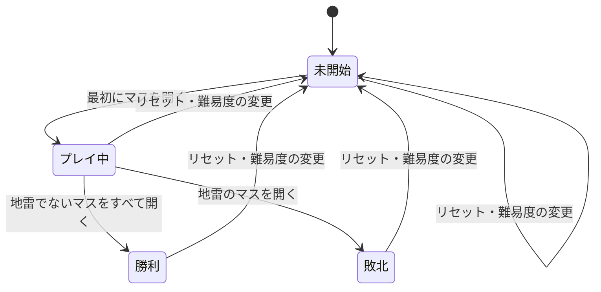

# マインスイーパー 仕様書

| 項目 | 内容 |
|------|------|
| 工程 | 3. 仕様書作成 |
| 作成日 | 2026-09-25 |
| 状態 | レビュー指摘を反映済み（docs/reviews/02-spec-review.md）。1.1.0 の改訂（効果音と演出）を行った（2026-09-26）。1.1.0 のレビューを待っている |
| 入力 | docs/01-research.md（調査書）、CLAUDE.md（目的・動作環境） |

## 1. 概要

Web ブラウザーで遊べるマインスイーパーを、Blazor WebAssembly の静的サイトとして作る。スマートフォン、タブレット、PC の各ブラウザーで、マウスでもタッチでも遊べるようにする。

この仕様書は「何ができるか」を定める。画面の見た目（配置、色、アイコン）は UI デザイン（docs/03-ui-design.md）で、実現の方法はアーキテクチャー設計書以降で定める。

**改訂（1.1.0）**: 効果音（5.6）と、操作の結果を見せる演出（5.7）を加えた。調査書 9 章の論点 20〜28 を 2 章で決め、関わる節（3.7、6.3、6.4、8 章、9 章）を改めた。見た目の洗練（様式、ツールバー、勝利カードの位置、PC のレイアウト）は、仕様を変えないので UI デザインで決める。

### 1.1 用語

| 用語 | 意味 |
|------|------|
| マス | 盤面の 1 区画。地雷があるか、ないかのどちらか |
| 開く | マスの中身を表示すること |
| 数字 | 開いたマスの周囲 8 マスにある地雷の数（0〜8）。0 は表示しない |
| 旗 | 地雷があると推理したマスに付ける印 |
| コード | 開いた数字のマスを操作して、周囲の未開放のマスをまとめて開くこと（chording） |
| 旗モード | タッチでの操作の割り当てを入れ替えるモード（4.3 を参照） |
| 長押し | タッチまたはペンで、押してから 400 ミリ秒以上、離さずに押し続けること（4.4 を参照）。マウスには長押しはない |
| 効果音 | 操作の結果を耳で知らせる短い音（5.6 を参照） |
| 演出 | 操作の結果を、変化の順序や動きで見せること（5.7 を参照）。ゲームの状態は変えない |

## 2. 論点の決定

調査書の 9 章の論点を、次のとおり決める。理由は各節に書く。

| # | 論点 | 決定 | 節 |
|---|------|------|----|
| 1 | 初級の盤面 | 9×9 | 3.1 |
| 2 | カスタムの範囲 | 幅 5〜30、高さ 5〜24、地雷 1〜（幅×高さ − 9） | 3.1 |
| 3 | 最初のクリックの安全保証 | 最初に開いたマスと、その周囲 8 マスには地雷を置かない | 3.3 |
| 4 | コード | 対応する。開いた数字のマスをクリック・タップして行う（旗モードでも同じ）。左右同時クリックと中クリックは対象外 | 3.5 |
| 5 | ？マーク | 対応しない | 9 |
| 6 | タッチでの旗の立て方 | パターン D（長押しで旗。加えて旗モードの切り替えボタンを置く）。長押しはタッチとペンだけ | 4.2、4.3 |
| 7 | 長押しの判定時間と知らせ方 | 400 ミリ秒。進行を表示で示し、成立したら振動させる（振動に対応した端末だけ） | 4.4 |
| 8 | 盤面が画面に入らない場合の扱い | 盤面は画面に収まるように自動で縮小し、必要なら回転して表示する。下限を下回るときだけスクロールさせる | 5.2 |
| 9 | マス目の最小サイズ | 下限 20px。目標は 24px 以上 | 5.2 |
| 10 | 敗北時・勝利時の表示 | 調査書 5.3 の定番どおりにする | 3.6 |
| 11 | 記録と統計 | 初級・中級・上級のベストタイムだけを記録する（整数秒） | 3.8 |
| 12 | No Guessing モード | 対象外 | 9 |
| 13 | オフライン対応（PWA） | 対象外 | 9 |
| 14 | 公開先 | GitHub Pages のプロジェクト サイト（`https://fujiwo.github.io/Shos.Minesweeper/`） | 7 |
| 15 | キーボード操作 | 対応する | 4.5 |
| 16 | スクリーンリーダー対応 | 基本的な対応をする | 6.3 |
| 17 | ダークモード | OS の設定に合わせる。切り替えボタンは置かない | 5.4 |
| 18 | 画面の言語 | 日本語だけ | 5.5 |
| 19 | 画面の向きが変わったときの扱い | レイアウトと盤面の回転を組み直す。ゲームの状態はそのまま続ける | 5.3 |

1.1.0 で加えた論点（調査書 9 章の 20〜28）:

| # | 論点 | 決定 | 節 |
|---|------|------|----|
| 20 | 効果音の有無と既定 | 効果音を入れる。既定で鳴らす | 5.6 |
| 21 | 効果音を鳴らす場面 | マスを開いた（1 つ・2 つ以上で音を分ける）、旗を立てた・外した、負けた、勝った。1 回の操作で鳴らすのは 1 つだけ | 5.6 |
| 22 | 効果音を消す操作と、その設定の保存 | 盤面の上の表示（3.7）に、効果音のオン・オフの切り替えを置く。設定はブラウザーに保存する | 3.7、5.6、6.4 |
| 23 | 音の作り方 | 音はプログラムで合成し、音のファイルは使わない | 5.6 |
| 24 | iOS の消音スイッチの扱い | 従う（消音スイッチを入れていれば鳴らない） | 5.6 |
| 25 | 音量と音の長さ | 控えめな音量で、短くする（勝利の音を除き 0.3 秒程度まで）。アプリの中で音量は変えられない（端末の音量に従う） | 5.6 |
| 26 | 見た目と演出の方針 | 操作の結果を、音と動きで手応えとして伝える。ただし操作を遅らせず、効果音の設定と動きを減らす設定に従う。0 の連鎖の広がり、負けと勝ちの演出を入れる | 5.7 |
| 27 | 演出の間の操作 | 演出の間も操作を受け付ける。演出は見た目だけで、ゲームの状態は操作の時点で変わっている。新しいゲームを始めたら、演出はその場で終える | 5.7 |
| 28 | 効果音と振動の関係 | 長押しが成立したときは、振動と、その結果の操作（旗など）の効果音を同時に出す。長押しそのものの音は作らない | 4.4、5.6 |

## 3. ゲームの仕様

### 3.1 難易度

| 難易度 | 幅 | 高さ | 地雷数 |
|--------|----|------|--------|
| 初級 | 9 | 9 | 10 |
| 中級 | 16 | 16 | 40 |
| 上級 | 30 | 16 | 99 |
| カスタム | 5〜30 | 5〜24 | 1〜（幅×高さ − 9） |

- 初級は 9×9 とする。現在の Windows 版と同じで、スマートフォンでもマスを大きく表示できる。
- カスタムの高さの上限を 24 とするのは、PC（表示領域の高さ 650px 程度）でもマスを 24px 以上で収めるためである（Windows 版のカスタムの上限 30×24 と同じとされる。出典未確認）。
- カスタムの地雷数の上限を「幅×高さ − 9」とするのは、最初に開いたマスとその周囲 8 マスに地雷を置かないため（3.3）である。
- カスタムの値が範囲の外、または整数でないときは、ゲームを始めずに、どの値が範囲の外かを示す。
- 難易度を変えると、その難易度で新しいゲームを始める。プレイ中のゲームは確認なしで破棄する。
- 最初の表示では初級を選ぶ。

### 3.2 ゲームの状態

- **未開始**: 地雷はまだ配置されていない。旗は立てられる。
- **プレイ中**: 地雷が配置され、経過時間を計っている。
- **勝利・敗北**: 盤面の操作は受け付けない。リセットか難易度の変更だけができる。
- 小さいカスタムの盤面で地雷が多いと、最初にマスを開いただけで地雷でないマスがすべて開くことがある（例: 5×5、地雷 16）。この場合は、プレイ中を経てすぐに勝利になり、経過時間は 0 秒になる。

### 3.3 地雷の配置

- 地雷は、最初にマスを開いたときに配置する。
- 最初に開いたマスと、その周囲 8 マス（盤面の端では、盤面の中にあるマスだけ）には地雷を置かない。これで最初に開いたマスは必ず 0 になり、ある程度の範囲が開いた状態から推理を始められる。
- それ以外のマスから、地雷数の分だけ一様ランダムに選ぶ。
- 未開始のうちに立てた旗は、地雷の配置に影響しない。旗のマスにも地雷が置かれることがある。

### 3.4 マスの状態と操作の結果

マスの状態は、未開放、旗、開放済みの 3 つである。

| 操作 | 未開放 | 旗 | 開放済み（数字） | 開放済み（0） |
|------|--------|----|------------------|---------------|
| 開く | マスを開く（3.4.1） | 何もしない | コード（3.5） | 何もしない |
| 旗 | 旗にする | 未開放に戻す | 何もしない | 何もしない |

#### 3.4.1 マスを開いたとき

- 地雷のマスなら敗北する。
- 数字のマスなら、その数字を表示する。
- 0 のマスなら、周囲の未開放のマスを連鎖的に開く。連鎖で開いたマスが 0 なら、さらに広げる。旗のマスは連鎖では開かない。
- 開いた結果、地雷でないマスがすべて開いていれば勝利する。

### 3.5 コード

- 開いた数字のマスを「開く」操作をしたとき、そのマスの周囲にある旗の数が数字と等しければ、周囲の未開放のマス（旗でないもの）をまとめて開く。
- 旗の数が数字と等しくないときは、何もしない。
- 旗の位置が間違っていて地雷のマスを開いた場合は、敗北する。
- 左右のボタンの同時クリックと中クリックによるコードは対象外とする。数字のマスのクリック・タップだけで同じことができ、タッチ端末とも操作を揃えられるからである。

### 3.6 勝利と敗北の表示

**敗北したとき**
- すべての地雷の位置を表示する。
- 開いてしまった地雷のマスを強調する。
- 誤った旗（地雷がないマスの旗）に、誤りであることを示す印を付ける。
- 経過時間を止める。

**勝利したとき**
- 旗のない地雷のマスすべてに、自動で旗を立てる。残り地雷数は 0 になる。
- 経過時間を止める。
- ベストタイムを更新した場合は、そのことを表示する（3.8）。

### 3.7 盤面の上の表示

| 表示 | 内容 |
|------|------|
| 残り地雷数 | 「地雷数 − 立てた旗の数」。旗を立てすぎた場合はマイナスになる |
| 経過時間 | 整数の秒（端数は切り捨て）。最初にマスを開いたときに 0 から計り始め、勝敗が決まったら止める。999 で止まる |
| リセット | 押すと、同じ難易度で新しいゲームを始める。ゲームの状態（プレイ中、勝利、敗北）が分かる表示を兼ねる |
| 旗モード | 旗モードの状態を示し、押すと切り替える（4.3） |
| 難易度の選択 | 初級、中級、上級、カスタムを選ぶ。カスタムでは幅、高さ、地雷数を入力する |
| 効果音 | 効果音を鳴らすかどうかを示し、押すと切り替える（5.6）。1.1.0 で追加 |

- 経過時間は、ブラウザーのタブが裏にあっても正しい値になるようにする（「開始した時刻との差」で計る）。

### 3.8 ベストタイム

- 初級、中級、上級のそれぞれで、勝利したときの最短の経過時間を記録する。値は画面の表示と同じ整数の秒（999 が上限）とする。同じ値のときは更新しない。カスタムは記録しない。
- 記録はブラウザーに保存し、ページを開き直しても残す。
- 保存ができない環境（プライベートブラウズなどで保存が禁止されている場合）でも、ゲームは遊べる。その場合、記録はページを開いている間だけ保つ。
- 記録を消す機能は持たない。

## 4. 操作の仕様

### 4.1 操作の割り当て

| 入力 | 通常のモード | 旗モード |
|------|--------------|----------|
| マウスの左クリック・タップ | 開く | 旗 |
| マウスの右クリック | 旗 | 旗 |
| 長押し（タッチ・ペン） | 旗 | 開く |

- 開いた数字のマスへのクリック・タップは、モードにかかわらずコード（3.5）になる。長押しで「開く」を開いた数字のマスに行った場合も、コードになる。
- マウスには長押しはない。左ボタンを押し続けてから離しても、通常の左クリックとして扱う。PC には右クリックがあり、長押しで旗を立てると、押したまま考えてから離す人が誤操作するからである。
- 右クリックでブラウザーのメニューが出ないようにする。
- 長押しが成立したら、指を離しても、タップの操作はしない（二重に操作しない）。

### 4.2 タッチでの旗の立て方

- 長押しで旗を立てる（調査書 7.1 のパターン A）。最も普及しており、多くの人が説明なしで使える。
- 加えて、旗モードの切り替えボタン（4.3）を置く（パターン D）。長押しを待つのが煩わしい人や、マスが小さく長押しがしにくい場合に使える。

### 4.3 旗モード

- 旗モードの間は、クリック・タップと長押しの役割を入れ替える（4.1 の表）。ただし、開いた数字のマスへのクリック・タップはコードのままにする。
- 旗モードは、リセットや難易度の変更をしても保つ。
- 旗モードかどうかが、盤面を見ている状態で分かるようにする（見た目は UI デザインで決める）。

### 4.4 長押しと誤操作の防止

- 長押しの判定時間は 400 ミリ秒とする。この値は実機での確認（工程 13、15）で調整してよい。
- 長押しの進行を表示で示す（見た目は UI デザインで決める）。
- 長押しが成立したら、振動に対応した端末では短く振動させる。iOS の Safari は振動に対応していないので、表示だけで知らせる。
- 長押しで操作が行われたときは、その操作の効果音（5.6）も鳴らす。長押しの成立そのものの音はない（1.1.0 で追加）。
- 押している間に指が 10px 以上動いたら、長押しもタップも取り消す。
- 盤面の上では、ダブルタップによるズーム、長押しによる文字選択やメニューを出さない。

### 4.5 キーボード操作

WCAG 2.1.1（すべての機能をキーボードで操作できること）に合わせる。

| キー | 動作 |
|------|------|
| 矢印キー | 盤面の中で、選択しているマスを移動する。方向は画面に表示された盤面の向きに従う（5.2 で縦と横を入れ替えている場合も、見たとおりの方向に動く） |
| Space または Enter | 選択しているマスを開く（数字のマスならコード） |
| F | 選択しているマスの旗を立てる・外す |
| Tab | 盤面、リセット、旗モード、難易度の選択の間を移動する |

- 盤面に入ったときは、前に選んでいたマスを選ぶ。初めてなら左上のマスを選ぶ。
- 選んでいるマスは、見て分かるようにする（見た目は UI デザインで決める）。
- 旗モードは、キーボードの操作には影響しない。

## 5. 表示と音の仕様

### 5.1 画面の構成

画面は 1 つだけで、盤面と、その上の表示（3.7）で構成する。ページの移動はない。

### 5.2 盤面の大きさと回転

調査書 7.4 のとおり、スマートフォンでは上級の盤面を 24px 以上のマスで収められない。一方で、盤面をスクロールできるようにすると、指の移動で長押しが取り消されやすくなる（調査書 8.1）。そこで、**盤面は原則として画面に収めて、スクロールさせない**。

- マスの大きさは、盤面の表示に使える領域に盤面全体が収まる最大の大きさにする。ただし、上限は 48px とする（PC で盤面が大きくなりすぎないように）。
- 盤面の縦と横を入れ替えたほうがマスが大きくなる場合は、入れ替えて表示する。例えば、スマートフォンの縦画面では、上級を 16×30 の縦長で表示する。入れ替えても、数字や記号は正しい向きで表示する（画像として回すのではなく、行と列を入れ替える）。
- マスの大きさの下限は 20px とする。下限でも収まらないときは、下限の大きさで表示し、盤面の領域だけをスクロールできるようにする。この場合は、指の移動で長押しやタップが取り消されることを受け入れる。
- マスの大きさの目標は 24px 以上（WCAG 2.5.8）とする。上級とカスタムの大きな盤面をスマートフォンで表示する場合は、24px を下回ることがある。これは既知の制約とし、旗モードで補う。
- 縦と横を入れ替えて表示しているときの「行」と「列」は、画面に表示された向きに従う（キーボードの操作は 4.5、読み上げは 6.3）。

各端末でのマスの大きさの見込みを次に示す（調査書 7.4 の表示領域の概算による）。

| 端末 | 上級（30×16） | カスタムの最大（30×24） |
|------|---------------|--------------------------|
| スマホ縦 | 18〜24px（縦長に入れ替え）。20px 未満になる端末では下限の 20px でスクロール | 収めると 15〜18px になるので、下限の 20px で表示してスクロール |
| スマホ横 | 15〜21px。20px 未満になる端末では下限の 20px でスクロール | 収めると 10〜14px になるので、下限の 20px で表示してスクロール |
| タブレット | 24px 以上 | 24px 以上 |
| PC | 36px 以上 | 24px 以上 |

### 5.3 画面の大きさや向きが変わったとき

- 画面の大きさや向きが変わったら、5.2 の規則でマスの大きさと盤面の入れ替えを決め直す。
- ゲームの状態（開いたマス、旗、経過時間）はそのまま続ける。

### 5.4 配色とダークモード

- OS の設定（ライトかダークか）に合わせて配色を切り替える。切り替えボタンは置かない。
- 数字の色は、調査書 5.3 のクラシックの配色（1 青、2 緑、3 赤、4 紺、5 えんじ、6 青緑、7 黒、8 灰）の色合いを踏襲する。ただし、ライトとダークのどちらの配色でも、背景とのコントラスト比 4.5:1 以上を満たすように明るさを調整する（ダークの配色では、7 の黒は明るい色に変える）。具体的な色は UI デザインで決める。
- 旗、地雷、誤った旗、踏んだ地雷は、色だけでなく形でも区別できるようにする。
- OS で動きを減らす設定をしている場合は、アニメーションを控える。

### 5.5 言語

画面の文言は日本語だけとする。

### 5.6 効果音（1.1.0 で追加）

操作の結果を、表示に加えて音でも知らせる。

| 出来事 | 鳴らす音 |
|--------|----------|
| マスを 1 つ開いた（コードで開いたマスが 1 つの場合を含む） | 開く音 |
| マスを 2 つ以上開いた（0 の連鎖、コード） | 連鎖の音（開く音と聞き分けられる、広がりのある音） |
| 旗を立てた | 旗を立てる音 |
| 旗を外した | 旗を外す音 |
| 負けた（地雷を開いた） | 負けの音 |
| 勝った | 勝ちの音 |

- 1 回の操作で鳴らすのは、1 つの音だけとする。勝敗が決まった操作では、開いた音は鳴らさず、勝ちか負けの音だけを鳴らす。
- 何も起きなかった操作（3.4 の「何もしない」。旗の数が合わないコードなど）では鳴らさない。
- 新しいゲーム、難易度の変更、経過時間の進み、旗モードの切り替えでは鳴らさない。
- マウス、タッチ、キーボードのどの操作でも、同じ規則で鳴らす。
- 続けて操作したときは、前の音を止めずに重ねて鳴らす。
- **既定で鳴らす。** 盤面の上の表示（3.7）の切り替えで消せる。消した設定はブラウザーに保存し、ページを開き直しても保つ。保存できない環境では、ページを開いている間だけ保つ（3.8 のベストタイムと同じ）。
- **ブラウザーの制限:** ブラウザーは、利用者がページを操作する前は音を鳴らさない。このゲームでは最初の音は利用者の操作の結果なので、最初の操作から鳴らす。
- **iOS の消音スイッチに従う。** 本体を消音にしている利用者には鳴らさない。
- **音量と長さ:** 控えめな音量で、読み上げ（6.3）を妨げないように短くする。勝ちの音を除き、0.3 秒程度までとする。アプリの中に音量の調整は置かず、端末の音量に従う。具体的な音は UI デザインで決め、実機で調整してよい。
- **音の作り方:** 音はプログラムで合成し、音のファイルは使わない。ライセンスの確認が要らず、読み込む量も増えない。次に作る WPF 版でも、同じ定義から同じ音を鳴らせるようにする（CLAUDE.md の「目的」。方法はアーキテクチャー設計で決める）。
- 音は、表示と読み上げの代わりにはしない。音を消していても、今までどおり表示と読み上げでゲームを進められる。

### 5.7 演出（1.1.0 で追加）

操作の結果を、変化の順序や動きで見せて、手応えを伝える。

| 出来事 | 演出 |
|--------|------|
| マスを 2 つ以上開いた | 開いたマスを、操作したマス（コードでは数字のマス）から近い順に、波が広がるように表示する |
| 負けた | 地雷のマスを、踏んだ地雷から近い順に表示する |
| 勝った | 地雷のマスに立った旗を、順に弾ませる |
| 旗を立てた | 旗が広がるように現れる（1.0.0 からのもの） |

- 演出は見た目だけで、ゲームの状態は変えない。ゲームの状態（開いたマス、勝敗、残り地雷数、経過時間の停止）は、操作の時点で変わっている。
- 演出の間も操作を受け付ける。演出の途中のマスへの操作は、そのマスの実際の状態に対する操作として扱う。
- 演出は短くする（0 の連鎖は、広がり終わるまで 0.3 秒程度まで）。具体的な長さと動きは UI デザインで決める。
- 新しいゲームを始めたら（リセット、難易度の変更）、演出はその場で終える。
- 読み上げ（6.3）は演出を待たず、操作の時点の状態を知らせる。
- OS で動きを減らす設定をしている場合は、演出をせず、結果をすぐに表示する（5.4）。
- 演出は、操作から画面に反映されるまでの時間（6.2）を延ばさない。最初の変化（押したマスが開く）は、今までどおり 100 ミリ秒以内に表示する。

## 6. 非機能の仕様

### 6.1 動作環境

CLAUDE.md の「動作環境」のとおり。

### 6.2 性能

- マスを開く、旗を立てるなどの操作から画面に反映されるまでを、上級の盤面で 100 ミリ秒以内とする（目標）。工程 13 と 15 で、実機での確認に使うスマートフォンで確かめる。
- 初回の読み込み中は、読み込んでいることが分かる表示を出す（テンプレートの表示を使う）。

### 6.3 アクセシビリティ

- WCAG 2.2 のレベル AA を目標とする。ただし、5.2 のマスの大きさ（2.5.8）は、上級とカスタムの大きな盤面をスマートフォンで表示する場合を除く。
- スクリーンリーダーには、基本的な対応をする。
  - 盤面を表（ARIA の `grid`）として読み上げられるようにする。
  - 各マスに、位置と状態が分かる名前を付ける（例: 「3 行 5 列、未開放」「3 行 5 列、2」）。行と列は、画面に表示された向きに従う。
  - 勝利と敗北は、読み上げで知らせる。
- スクリーンリーダーでの確認は、1 種類（例: iOS の VoiceOver）で行えばよいものとする。
- 効果音（5.6）は、表示と読み上げの代わりにしない。効果音を消す操作は、キーボードでも行え、読み上げでオンかオフかが分かるようにする（1.1.0 で追加）。

### 6.4 データとプライバシー

- 外部のサーバーとは通信しない（アプリの読み込みを除く）。
- ブラウザーに保存するのは、ベストタイム（3.8）と、効果音を鳴らすかどうかの設定（5.6）だけである（効果音の設定は 1.1.0 で追加）。

## 7. 公開

- GitHub Pages のプロジェクト サイトとして公開する。リポジトリは `https://github.com/Fujiwo/Shos.Minesweeper` で、URL は `https://fujiwo.github.io/Shos.Minesweeper/` になる。サブパスに置くので、発行時に `<base href>` を `/Shos.Minesweeper/` に合わせる。
- 具体的な手順は、リリース準備（工程 14）で決めた（docs/06-release.md）。

## 8. 受け入れ基準

リリースレビュー（工程 15）では、少なくとも次を確かめる。

1. 初級・中級・上級・カスタムで、勝利と敗北の両方までゲームを進められる。
2. 最初に開いたマスが、どの難易度でも必ず 0 になる。
3. コード、旗、旗モード、長押しが 4 章の表のとおりに動く。
4. スマートフォンの縦と横、タブレット、PC で、盤面が 5.2 の規則どおりに表示される。スマートフォンで長押しをしても、ズームや文字選択やメニューが出ない。
5. キーボードだけでゲームを最後まで進められる。
6. ベストタイムが記録され、ページを開き直しても残る。
7. ライトとダークの両方の配色で、数字が読める。
8. 旗モードでも、開いた数字のマスのタップでコードができる。PC でマウスの左ボタンを押し続けても、旗にならない。
9. プレイ中に画面の向きを変えても、ゲームがそのまま続く。
10. 保存ができない環境（プライベートブラウズなど）でも、ゲームを最後まで遊べる。
11. 未開始のうちに旗を立てても、最初に開いたマスが 0 になり、ゲームを続けられる。
12. 実機での確認に使うスマートフォンで、上級の盤面の操作が 100 ミリ秒以内に反映される（体感で遅れを感じない）。
13. スクリーンリーダー（1 種類）で、マスの位置と状態、勝敗が読み上げられる。

1.1.0 で加えた基準:

14. 5.6 の表の各出来事で、対応する効果音が鳴り、何も起きない操作では鳴らない。1 回の操作で鳴る音は 1 つだけである。
15. 効果音を消すと、どの操作でも鳴らなくなり、その設定はページを開き直しても残る。キーボードでも切り替えられ、状態が読み上げられる。
16. iOS の Safari で、本体を消音にしていると効果音が鳴らない。
17. 5.7 の演出が見え、演出の間も操作できる。演出の途中でリセットしても、新しいゲームがすぐに始まる。
18. OS で動きを減らす設定をしていると、演出をせずに結果がすぐ表示される。
19. 効果音と演出を入れても、基準 12（上級の盤面の操作が 100 ミリ秒以内）を満たす。

## 9. 対象外

次の機能は、この版では作らない。

| 機能 | 対象外とする理由 |
|------|------------------|
| ？マーク | 使わなくても遊べる。操作の状態が増え、タッチの操作が複雑になる |
| 左右同時クリック・中クリックでのコード | 数字のマスのクリックで同じことができる（3.5） |
| No Guessing モード | ソルバーが必要で、実装の手間が大きい（調査書 6.3） |
| 統計（プレイ回数、勝率など） | 目的に必須ではない |
| カスタムのベストタイム | 盤面の組み合わせが多く、記録として比べにくい |
| オフライン対応（PWA） | 目的に必須ではない。後から追加できる |
| 英語など他の言語 | 目的に必須ではない |
| ヒント、やり直し | 定番の機能ではない |
| アプリの中での音量の調整、音の種類の選択 | 端末の音量で足りる。音は 1 種類の組で十分である（1.1.0 で追加） |
| BGM（ゲーム中に流れ続ける音楽） | 読み上げと、ほかの音楽を聞きながら遊ぶ利用者の邪魔になる（1.1.0 で追加） |
| 経過時間の 1 秒ごとの音 | 鳴り続けると邪魔になる（1.1.0 で追加） |
| 記録の消去 | 目的に必須ではない |
| ゲームの途中経過の保存 | ページを開き直すと、途中のゲームは失われる。1 回のゲームは短く、保存しなくても困らない |
