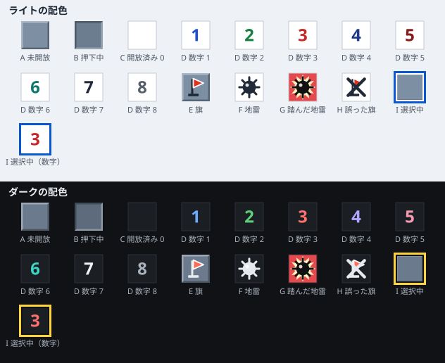

# マインスイーパー UI デザイン

| 項目 | 内容 |
|------|------|
| 工程 | 5. UI デザイン作成 |
| 作成日 | 2026-09-25 |
| 状態 | レビュー指摘を反映済み（docs/reviews/03-ui-design-review.md） |
| 入力 | docs/02-spec.md（仕様書）、docs/01-research.md（調査書） |

## 1. 概要

仕様書で決めた操作と表示を、画面に落とし込む。この文書は「どう見えるか」を定める。実現の方法（CSS の書き方、コンポーネントの分け方、JavaScript interop の要否）は、アーキテクチャー設計書以降で決める。

### 1.1 デザインの方針

| 方針 | 内容 |
|------|------|
| 盤面を最大に | 画面は 1 つだけにし、盤面以外の要素は 1 本のツールバーにまとめる。ツールバーの幅や高さを小さく保ち、盤面に使える領域を広げる（仕様書 5.2） |
| 押しやすさ | 盤面以外の押せる要素は、すべて 44×44px 以上にする |
| 色だけに頼らない | マスの状態、旗モード、勝敗は、形か文字でも区別できるようにする（仕様書 5.4） |
| どの端末でも同じ見た目 | アイコンは絵文字を使わず、SVG で描く。絵文字は OS ごとに絵柄が違い、ダークの配色で見えにくくなるものもあるからである |
| 飾りを足さない | 装飾のためのアニメーションや効果音は使わない。アニメーションは操作の結果を知らせるものだけにする |

## 2. 画面の構成

### 2.1 要素の一覧

画面はツールバーと盤面でできている。ほかに、必要なときだけ表示するダイアログとカードがある。

| 記号 | 要素 | 内容 | 仕様書 |
|------|------|------|--------|
| A | 難易度ボタン | 現在の難易度（「初級」など）を表示する。押すと難易度ダイアログ（G）を開く | 3.1、3.7 |
| B | 残り地雷数 | 地雷のアイコンと数を表示する | 3.7 |
| C | リセット ボタン | 顔のアイコンで、ゲームの状態を示す。押すと、同じ難易度で新しいゲームを始める | 3.7 |
| D | 経過時間 | 時計のアイコンと秒数を表示する | 3.7 |
| E | 旗モード ボタン | 旗のアイコンで、旗モードの状態を示す。押すと切り替える | 4.3 |
| F | 盤面 | マスを並べた領域。枠の模様で旗モードかどうかを示す | 3.4、5.2 |
| G | 難易度ダイアログ | 難易度の選択、カスタムの値の入力、ベストタイムの表示 | 3.1、3.8 |
| H | 勝利カード | 勝ったときに盤面の上に出す。タイムとベストタイムの更新を示す | 3.6、3.8 |
| I | 読み上げ用の領域 | 画面には表示しない。勝敗をスクリーンリーダーに知らせる | 6.3 |

ツールバーの要素は、左（横向きのスマートフォンでは上）から A、B、C、D、E の順に並べる。Tab キーでの移動の順も、この並びに従う（6.3）。

### 2.2 ツールバーの各要素

| 要素 | 大きさ | 表示 |
|------|--------|------|
| A 難易度ボタン | 高さ 44px、幅は文字に合わせる（最小 72px） | 「初級」「中級」「上級」「カスタム」の文字と、下向きの山形（▾ の形）のアイコン |
| B 残り地雷数 | 高さ 44px、幅 64px | 地雷のアイコン（16px）と数字。数字は等幅（`tabular-nums`）の太字 20px で、右に揃える。マイナスは「-3」のように表示する。桁の 0 埋めはしない。未開始のうちに旗を立てると、-100〜-719 の 4 文字になることがある。そのときは、幅に収まるまで数字を小さくする（最小 14px） |
| C リセット ボタン | 44×44px | 顔のアイコン（28px）。表情は 5.1、5.4、5.5 で定める |
| D 経過時間 | 高さ 44px、幅 64px | 時計のアイコン（16px）と数字。数字の書式は B と同じ |
| E 旗モード ボタン | 高さ 44px、幅 44px 以上 | 旗のアイコン（24px）。上バーで、かつ幅 600px 以上の画面では、アイコンの右に「旗モード」の文字も表示する。横バーでは文字を出さない。オンとオフの見た目は 5.3 で定める |

- ボタン（A、C、E）は、角を丸めた（半径 8px）四角にする。背景は `surface`、枠は 1px の `border` の色にする（色は 4.1）。
- B と D は押せないので、枠を付けない。押せる要素と押せない要素を、見た目で区別するためである。
- マウスで指したときに、ボタンの名前をツールチップ（`title`）で出す: A「難易度を変える」、C「新しいゲーム」、E「旗モード（オン）」または「旗モード（オフ）」。

### 2.3 難易度ダイアログ（G）

難易度ボタン（A）を押すと、画面の中央にダイアログを開く。盤面の上には半透明の幕（黒、不透明度 45%）をかける。

```text
┌ 難易度                                   [×]
│
│ ┌ 初級      9×9・地雷 10       ベスト 23 秒   ✓
│ ├ 中級    16×16・地雷 40       ベスト 98 秒
│ └ 上級    30×16・地雷 99       記録なし
│
│ カスタム
│   幅      [ 16 ]  5〜30
│   高さ    [ 16 ]  5〜24
│   地雷数  [ 40 ]  1〜247
│                          [ カスタムで始める ]
└
```

- 初級・中級・上級は、1 行ずつの大きなボタン（高さ 56px 以上）にする。押すとすぐに、その難易度で新しいゲームを始めてダイアログを閉じる（仕様書 3.1）。
- 現在と同じ難易度の行を押した場合も、新しいゲームを始める。「難易度の行を押す＝新しいゲーム」という動きを揃えるためである。ベストタイムを見るだけのときは、× や Esc で閉じれば、ゲームはそのまま続く。
- 各行には、盤面の大きさ、地雷数、ベストタイムを表示する。記録がなければ「記録なし」と表示する。**ベストタイムを見られる場所は、ここと勝利カード（H）である。**
- 現在の難易度の行には、チェックの印（✓ の形）を付ける。色だけで示さないためである。
- カスタムの欄は、常に表示しておく。入力欄の初期値は、現在の盤面の幅・高さ・地雷数とする。
- 入力欄の右には、入力できる範囲を常に表示する。地雷数の上限は、入力中の幅と高さから計算して表示を更新する。幅か高さが範囲の外なら、「1〜（幅×高さ − 9）」と式で表示する。
- 入力欄は、スマートフォンで数字のキーボードが出るようにする（`inputmode="numeric"`）。
- 「カスタムで始める」を押したときに値を確かめる。範囲の外の値があれば、ゲームを始めずに、その入力欄の枠を 2px の `danger` の色にし、入力欄の下に警告のアイコンと「5〜30 の整数を入力してください」のような文を表示する。最初の誤った入力欄にフォーカスを移す（仕様書 3.1）。
- 閉じ方: 右上の × ボタン（44×44px）、Esc キー、幕の部分を押す。閉じても、プレイ中のゲームはそのまま続く。
- ダイアログの幅は、画面の幅から 32px を引いた値と 400px の小さいほうにする。画面に収まらないとき（横向きのスマートフォンなど）は、ダイアログの中をスクロールさせる。

### 2.4 勝利カード（H）と敗北時の表示

**勝利カード**

勝ったときに、盤面の中央に重ねてカードを出す。盤面の操作はもう受け付けないので、盤面を隠しても困らない。

```text
┌──────────────────────────────
│  (サングラスの顔)  クリア！
│
│  タイム 45 秒
│  ★ ベストタイム更新！（これまで 52 秒）
│
│  [ もう一度 ]   [ 閉じる ]
└──────────────────────────────
```

- 幅は、盤面の領域の幅と 320px の小さいほうにする。背景は `surface`、角の半径 12px、影を付ける。
- 2 行目のベストタイムの行は、次のように出し分ける。

| 場合 | 表示 |
|------|------|
| 初級・中級・上級で、記録を更新した | 星のアイコンと「ベストタイム更新！（これまで 52 秒）」 |
| 初級・中級・上級で、初めて記録した | 星のアイコンと「ベストタイムを記録しました」 |
| 初級・中級・上級で、更新しなかった（同じ値を含む） | 「ベスト 30 秒」 |
| カスタム | この行を表示しない |

- 「もう一度」は、同じ難易度で新しいゲームを始める（リセット ボタンと同じ）。「閉じる」はカードを閉じて、勝った盤面を見られるようにする。Esc キーでも閉じる。閉じたカードは、もう一度は出さない。
- カードは、モードレスのダイアログ（`role="dialog"`。見出しの「クリア！」を名前にする）とする。
- カードを出したら、キーボードのフォーカスをカードの見出しに移す。ボタンに移さないのは、最後のマスを開くために押した Space や Enter を続けて押したときに、意図せず新しいゲームが始まらないようにするためである。Tab キーで、カードの中のボタンに移れる。
- カードを閉じたら、フォーカスをリセット ボタンに移す。

**敗北時**

敗北したときは、カードを出さない。どの地雷を踏んだか、どの旗が誤っていたかを盤面で確かめられるようにするためである。敗北は、次の三つで分かるようにする。

- 盤面: すべての地雷、踏んだ地雷、誤った旗の表示（4.2）
- リセット ボタン: 目が × の顔（5.5）
- 読み上げ用の領域: 「ゲームオーバー」の読み上げ（6.4）

### 2.5 ページ全体

| 項目 | 内容 |
|------|------|
| 言語 | `<html lang="ja">` にする |
| ページの題名 | 「マインスイーパー」。画面には題名を表示しない（盤面の領域を減らさないため）。スクリーンリーダー向けに、見えない見出し（`h1`）として置く |
| 読み込み中の表示 | テンプレートの円形の進捗表示を使う（仕様書 6.2）。色を 4.1 の配色に合わせ、文字の既定値を「Loading」から「読み込み中」にする |
| エラーの表示 | テンプレートの `#blazor-error-ui` の文言を日本語にする: 「エラーが発生しました。」「再読み込み」 |
| ブラウザーのツールバーの色 | `<meta name="theme-color">` を、ライトとダークのそれぞれのページの背景色（`page`）にする |
| ページ全体の拡大 | `viewport` の設定で拡大を禁止しない（WCAG 1.4.4）。盤面の上でのダブルタップによるズームは、仕様書 4.4 のとおり止める |

`index.html` を変えるときは、CLAUDE.md の「構成とポイント」にあるプレースホルダーを削除・変更しないこと。

## 3. レイアウト

### 3.1 2 種類のレイアウト

ツールバーを盤面の上に置く「上バー」と、盤面の左に置く「横バー」の 2 種類を使い分ける。

| レイアウト | 使う場面 | 条件 |
|------------|----------|------|
| 上バー | スマートフォンの縦向き、タブレット、PC | 下の条件に当てはまらないとき |
| 横バー | スマートフォンの横向き | 横長（`orientation: landscape`）で、かつ、表示領域の高さが 500px 以下 |

スマートフォンの横向きでは高さが足りない（調査書 7.4）。ツールバーを左に移せば、その分の高さを盤面に回せる。

各部の寸法は次のとおりとする。

| 部分 | 上バー | 横バー |
|------|--------|--------|
| ページの余白（四辺） | 4px | 4px |
| ツールバー | 高さ 52px（ボタン 44px ＋ 上下 4px） | 幅 88px（ボタン 44px を縦に並べ、各要素は幅いっぱいに広げる） |
| ツールバーと盤面の間 | 4px | 4px |
| 盤面の枠 | 3px | 3px |

- 上バーのツールバーの幅は、「画面の幅 − 8px」と 480px の小さいほうにし、画面の中央に置く。スマートフォンでは画面の幅いっぱいになり、タブレットと PC では 480px になる。要素の間隔は、幅に合わせて均等に広げる。
- 横バーのツールバーは、要素を上から A〜E の順に並べ、縦方向の中央に置く。B と D は、アイコンを数字の上に置いた 2 段の表示にする。A の文字は 14px にし、「カスタム」と山形のアイコンが 88px の幅に収まるようにする。E はアイコンだけにする（2.2）。
- 盤面は、盤面の領域（下の図の「盤面の領域」）の中で、縦と横の両方で中央に置く。
- `viewport-fit=cover` は使わない。iPhone のノッチなどを避けて表示する処理は、ブラウザーに任せる。

### 3.2 マスの大きさの決め方

仕様書 5.2 の規則を、上の寸法で具体的にする。

1. 盤面の領域の大きさ（幅 W、高さ H）を求める。
   - 上バー: W = 画面の幅 − 8 − 6、H = 画面の高さ − 8 − 52 − 4 − 6
   - 横バー: W = 画面の幅 − 8 − 88 − 4 − 6、H = 画面の高さ − 8 − 6
   - 画面の高さには、ブラウザーのツールバーを除いた実際の表示領域の高さを使う。
2. 盤面をそのままの向き（列 c、行 r）で置いた場合と、縦と横を入れ替えた場合（列 r、行 c）のそれぞれで、min(W ÷ 列数, H ÷ 行数) を求める。
3. 大きいほうの向きを選ぶ。同じなら、入れ替えない。
4. マスの大きさ = その値の小数を切り捨てた整数（px）。ただし、48 を超えたら 48、20 を下回ったら 20 にする。
5. 20 にしたときに盤面が領域からはみ出す場合は、盤面の領域だけをスクロールできるようにする。ツールバーはスクロールさせない。

マスの大きさを整数にするのは、マスの境目の線がにじまないようにするためである。

### 3.3 マスの大きさの見込み

3.2 の規則で計算した値を次に示す。R は縦と横を入れ替えたこと、S は下限の 20px にしてスクロールすることを表す。画面の大きさは、代表的な端末のブラウザーの表示領域を仮定した値である。

| 端末 | 画面（幅×高さ） | 初級 9×9 | 中級 16×16 | 上級 30×16 | カスタム最大 30×24 |
|------|-----------------|----------|------------|------------|--------------------|
| スマホ縦 | 360×640 | 38 | 21 | 20 R S | 20 R S |
| スマホ縦 | 390×700 | 41 | 23 | 21 R | 20 R S |
| スマホ縦 | 430×800 | 46 | 26 | 24 R | 20 R S |
| スマホ横 | 640×320 | 34 | 20 S | 20 S | 20 S |
| スマホ横 | 844×350 | 37 | 21 | 21 | 20 S |
| スマホ横 | 932×400 | 42 | 24 | 24 | 20 S |
| タブレット縦 | 768×950 | 48 | 47 | 29 R | 29 R |
| タブレット縦 | 1024×1300 | 48 | 48 | 41 R | 41 R |
| タブレット横 | 1024×700 | 48 | 39 | 33 | 26 |
| タブレット横 | 1366×950 | 48 | 48 | 45 | 36 |
| PC | 1280×650 | 48 | 36 | 36 | 24 |
| PC | 1920×950 | 48 | 48 | 48 | 36 |

- 仕様書 5.2 の見込み（PC の上級で 36px 以上、カスタムの最大で 24px 以上、タブレットで 24px 以上）を満たす。PC の 1280×650 では、カスタムの最大がちょうど 24px になる。上バーの縦方向の寸法（合計 70px）を増やすと 24px を下回るので、ツールバーの高さを増やすときは注意すること。
- スマートフォンの横向きの幅の狭い端末（640×320）では、中級もスクロールになる。これは仕様書 5.2 の「下限でも収まらないとき」に当たり、既知の制約とする。

### 3.4 ワイヤーフレーム

図の記号は 2.1 の表のとおりである。寸法は 3.3 の表の値を使った例である。

**スマートフォン縦（390×700、初級。マス 41px）**

```text
+--------------------------------------+
| [A v] [B 10]    (C)    [D 0]    [E]  |  toolbar 52px
+--------------------------------------+
|                                      |
|  +--------------------------------+  |
|  |                                |  |
|  |                                |  |
|  |      F  9 x 9 (cell 41px)      |  |
|  |       375 x 375 incl. frame    |  |
|  |                                |  |
|  |                                |  |
|  +--------------------------------+  |
|                                      |
+--------------------------------------+
```

**スマートフォン縦（390×700、上級。縦と横を入れ替えて 16 列×30 行。マス 21px）**

```text
+--------------------------------------+
| [A v] [B 99]    (C)    [D 0]    [E]  |  toolbar 52px
+--------------------------------------+
|   +------------------------------+   |
|   |                              |   |
|   |                              |   |
|   |                              |   |
|   |    F  16 cols x 30 rows      |   |
|   |       (cell 21px)            |   |
|   |                              |   |
|   |                              |   |
|   |                              |   |
|   |                              |   |
|   +------------------------------+   |
+--------------------------------------+
```

**スマートフォン横（844×350、上級。マス 21px）**

```text
+-------+----------------------------------------------------+
|  [A]  |  +----------------------------------------------+  |
|  [B]  |  |                                              |  |
|  (C)  |  |      F  30 cols x 16 rows (cell 21px)        |  |
|  [D]  |  |                                              |  |
|  [E]  |  +----------------------------------------------+  |
+-------+----------------------------------------------------+
 88px
```

**タブレット縦（768×950、上級。縦と横を入れ替えて 16 列×30 行。マス 29px）**

```text
+----------------------------------------------+
|     +--------------------------------+       |
|     | [A v] [B 99]  (C)  [D 0]  [E]  |       |  toolbar 52px, 480px
|     +--------------------------------+       |
|     +--------------------------------+       |
|     |                                |       |
|     |                                |       |
|     |    F  16 cols x 30 rows        |       |
|     |       (cell 29px)              |       |
|     |                                |       |
|     |                                |       |
|     +--------------------------------+       |
+----------------------------------------------+
```

**タブレット横・PC（1280×650、上級。マス 36px）**

```text
+------------------------------------------------------------------+
|              +------------------------------------+              |
|              | [A v] [B 99]  (C)  [D 0] [E flag]  |              |  max 480px
|              +------------------------------------+              |
|   +----------------------------------------------------------+   |
|   |                                                          |   |
|   |            F  30 cols x 16 rows (cell 36px)              |   |
|   |                                                          |   |
|   +----------------------------------------------------------+   |
+------------------------------------------------------------------+
```

PC で盤面がツールバーの最大幅（480px）より広いときは、ツールバーを盤面の中央の上に置く。

### 3.5 幅の狭い画面

幅 360px 未満の画面（例: 320px）では、ツールバーの要素の間隔を 2px まで詰め、B と D の幅を 56px に縮める。これで 320px でも 1 行に収まる。

## 4. 配色と見た目

### 4.1 配色

色は名前（トークン）で定め、ライトとダークの値を持つ。OS の設定（`prefers-color-scheme`）で切り替える（仕様書 5.4）。フォームの部品もダークの配色に合わせるため、`color-scheme: light dark` を指定する。

| トークン | 用途 | ライト | ダーク |
|----------|------|--------|--------|
| `page` | ページの背景 | #eef1f5 | #101216 |
| `surface` | ボタン、ダイアログ、カードの背景 | #ffffff | #1f242b |
| `border` | ボタンの枠、盤面の枠 | #7b8794 | #6b7682 |
| `text` | 文字 | #1f2937 | #e6e9ed |
| `text-sub` | 補足の文字（範囲の表示など） | #4b5563 | #aab3bd |
| `cell-closed` | 未開放のマス | #7d8fa3 | #6b7a8c |
| `cell-closed-hover` | マウスで指した未開放のマス | #8a9bb0 | #78879a |
| `cell-pressed` | 押下中の未開放のマス | #6c7d90 | #5d6b7c |
| `cell-open` | 開放済みのマス | #ffffff | #1b1f24 |
| `grid` | 開放済みのマスの境目の線 | #c3cbd4 | #2c323a |
| `flag` | 旗の布 | #e0321f | #ff6b5a |
| `flag-pole` | 旗の竿と台 | #1f2937 | #e6e9ed |
| `mine` | 地雷（踏んだ地雷を除く） | #1f2937 | #e6e9ed |
| `danger` | 踏んだ地雷の背景、入力の誤りの枠 | #e5484d | #e5484d |
| `danger-text` | 入力の誤りの文 | #c62828 | #ff8787 |
| `accent` | 旗モード（オン）のボタンの背景、盤面の枠の縞 | #e8590c | #ff922b |
| `on-accent` | `accent` の上の文字とアイコン | #111111 | #111111 |
| `focus` | フォーカスの枠（外側） | #0b57d0 | #ffd43b |
| `focus-inner` | フォーカスの枠（内側） | #ffffff | #101216 |

主なコントラスト比は次のとおりである（WCAG の相対輝度で計算）。文字は 4.5:1 以上（1.4.3）、文字以外の部品と状態は 3:1 以上（1.4.11）を満たす。

| 組み合わせ | ライト | ダーク | 基準 |
|------------|--------|--------|------|
| `text` と `page` | 12.96 | 15.39 | 4.5 |
| `text-sub` と `surface` | 7.56 | 7.35 | 4.5 |
| `danger-text` と `surface` | 5.62 | 6.74 | 4.5 |
| `on-accent` と `accent` | 5.27 | 8.45 | 4.5 |
| `cell-closed` と `cell-open`（未開放と開放済みの区別） | 3.32 | 3.78 | 3 |
| `border` と `page`（盤面の枠、ボタンの枠） | 3.23 | 4.05 | 3 |
| `accent` と `page`（旗モードの縞） | 3.16 | 8.39 | 3 |
| 旗の縁取り（白）と `cell-closed` | 3.32 | 4.39 | 3 |
| `mine` と `cell-open` | 14.68 | 13.60 | 3 |
| `danger` と `cell-open`（踏んだ地雷のマスと周囲） | 3.91 | 4.23 | 3 |
| `accent` と `surface`（長押しの円。5.2） | 3.58 | 6.99 | 3 |
| `border` と `surface`（長押しの円のまだ満ちていない部分、ボタンの枠） | 3.66 | 3.37 | 3 |
| `surface` と `cell-closed`（長押しの円の下地） | 3.32 | 3.56 | 3 |

旗の布（`flag`）と未開放のマスの色の比は 1.36（ライト）と 1.57（ダーク）で、3:1 に届かない。そこで、旗の布に白の縁取り（1px 相当）を付け、形は縁取りで読み取れるようにする。

### 4.2 マスの状態



| 記号 | 状態 | 背景 | 縁 | 中身 |
|------|------|------|----|------|
| A | 未開放 | `cell-closed` | 立体の縁（左上に明るい線、右下に暗い線） | なし |
| B | 押下中 | `cell-pressed` | 立体の縁を反転する（くぼんで見える） | なし |
| C | 開放済み（0） | `cell-open` | 右と下に 1px の `grid` の線 | なし |
| D | 開放済み（1〜8） | `cell-open` | C と同じ | 数字（4.3） |
| E | 旗 | `cell-closed` | A と同じ | 旗のアイコン |
| F | 地雷（敗北時に表示） | `cell-open` | C と同じ | 地雷のアイコン（`mine`） |
| G | 踏んだ地雷 | `danger` | C と同じ | 淡い黄色（#fff3bf）のギザギザの爆発の形の上に、黒（#111111）の地雷のアイコン |
| H | 誤った旗（敗北時に表示） | `cell-open` | C と同じ | 旗のアイコンの上に、`text` の色の太い × |
| I | 選択中（キーボード） | 元の状態のまま | 元の状態のまま | 二重のフォーカスの枠を重ねる。外側の枠はマスの外にはみ出す（6.3） |

- 立体の縁の太さは、マスの大きさの 1/16 を四捨五入した値（最小 1px）とする。20px のマスでは 1px、40px では 3px になる。
- 未開放のマスどうしの間には、隙間を置かない。立体の縁で区切りが分かるからである。
- 勝利時に自動で立てる旗は、E と同じ見た目にする。
- 敗北後に残る未開放のマス（地雷でないもの）は、A のままにする。
- 敗北後も、旗を立てていた地雷のマス（正しい旗）は、E のままにする。F の地雷の表示にするのは、旗のない地雷のマスだけである。

### 4.3 数字の色

仕様書 5.4 のとおり、クラシックの配色の色合いを踏襲し、開放済みのマスの背景（`cell-open`）とのコントラスト比 4.5:1 以上にする。

| 数字 | 色合い | ライト | 比 | ダーク | 比 |
|------|--------|--------|----|--------|----|
| 1 | 青 | #1d4ed8 | 6.70 | #6ea8ff | 6.87 |
| 2 | 緑 | #15803d | 5.02 | #5fd07a | 8.51 |
| 3 | 赤 | #c62828 | 5.62 | #ff7070 | 6.15 |
| 4 | 紺 | #1e3a8a | 10.36 | #b4a7ff | 7.82 |
| 5 | えんじ | #8b1a1a | 9.29 | #f59ab0 | 7.99 |
| 6 | 青緑 | #0f766e | 5.47 | #3dd6c6 | 9.17 |
| 7 | 黒 | #1f2937 | 14.68 | #f1f3f5 | 14.89 |
| 8 | 灰 | #57606a | 6.39 | #aab3bd | 7.80 |

- ダークでは、暗い色（紺、えんじ、黒）をそのまま使うと読めないので、明るくした。紺は 1 の青と見分けられるように、紫寄りの明るい色（#b4a7ff）にした。えんじは桃色寄りの明るい色、黒は白に近い色にした。
- 数字は太字（700）で、大きさはマスの 60%（20px のマスで 12px）とする。

### 4.4 アイコン

アイコンはすべて SVG で描き、24×24 の座標で作ってマスやボタンの大きさに合わせて拡大・縮小する。

| アイコン | 形 | 使う場所 |
|----------|----|----------|
| 地雷 | 黒い円に 8 本のとげ。左上に小さな白い光 | マス（F、G）、残り地雷数（B） |
| 旗 | 竿と台、三角の布（白の縁取り） | マス（E、H）、旗モード ボタン（E）、長押しの進行（5.2） |
| 爆発 | 12 の頂点を持つギザギザの星形 | 踏んだ地雷（G） |
| × | 2 本の太い斜線 | 誤った旗（H） |
| 時計 | 円と 2 本の針 | 経過時間（D） |
| 顔 | 黄色（#ffd43b）の円に、濃い色（#1f2937）の輪郭と表情。表情は 4 種類（下の表） | リセット ボタン（C）、勝利カード（H） |
| スコップ | 柄と刃 | 旗モードでの長押しの進行（5.2）。「開く」を表す |
| 星 | 5 つの頂点の星 | 勝利カードのベストタイムの行 |
| チェック | ✓ の形 | 難易度ダイアログの現在の難易度 |
| 警告 | 三角に「!」 | 入力の誤りの文 |
| 山形 | 下向きの山形 | 難易度ボタン |

顔の表情は次の 4 種類である。

| 表情 | 形 | 表示する場面 |
|------|----|--------------|
| 通常 | 点の目、笑った口 | 未開始、プレイ中 |
| 驚き | 点の目、丸く開けた口 | マスを押している間（5.1） |
| 勝利 | サングラス、笑った口 | 勝利 |
| 敗北 | × の目、への字の口 | 敗北 |

### 4.5 文字

- 書体は OS の標準の書体を使う（`system-ui, -apple-system, "Segoe UI", "Hiragino Sans", "Noto Sans JP", "Yu Gothic UI", Meiryo, sans-serif`）。Web フォントは読み込まない。読み込みの時間を増やさないためである。
- 数字（マスの数字、残り地雷数、経過時間）は、`font-variant-numeric: tabular-nums` で幅を揃え、値が変わっても位置がずれないようにする。
- 本文の大きさは 16px、補足は 14px とする。

## 5. 操作に対するフィードバック

### 5.1 押下中

マウスのボタンを押している間、または指やペンが触れている間は、次のように表示する。離すか取り消す（指が 10px 以上動く。仕様書 4.4）と、元に戻す。

| 押しているマス | 表示 |
|----------------|------|
| 未開放のマス | そのマスを押下中（4.2 の B）にする |
| 旗のマス | 変えない（開けないので） |
| 開いた数字のマス | 周囲の未開放のマス（旗でないもの）を、すべて押下中にする。コードで開く範囲を前もって示すためである |
| 開いた 0 のマス | 変えない |

- 押している間は、リセット ボタンの顔を「驚き」にする。
- 勝敗が決まった後は、盤面を押しても、押下中の表示も、顔の変化も、長押しの円（5.2）も出さない。盤面の操作を受け付けないからである（仕様書 3.2）。
- タッチとペンでは、長押しが成立したら（押し始めから 400 ミリ秒）、押下中の表示を消し、顔も元に戻す。長押しが成立した後は、指を離してもタップの操作をしない（仕様書 4.1）。長押しで何も起きないマス（5.2）では、押下中の表示が残っていると、離せば開く（コードになる）と誤解させるからである。
- 旗モードでタップが「旗」になる場合も、未開放のマスは押下中にする。押したマスが反応していることを示すためである。

### 5.2 長押しの進行

タッチかペンで押したときだけ、押したマスを中心に、進行を示す円を表示する（仕様書 4.4）。

```text
        .-- ring (fills clockwise in 400ms)
       /
    .-----.
   /  [f]  \     <- icon of the action: flag, or shovel in flag mode
  |  +---+  |
  |  |   |  |    <- pressed cell
  |  +---+  |
   \       /
    '-----'
```

- 円の直径は、マスの大きさの 2.5 倍と 64px の大きいほうにする。指でマスが隠れても、周りの円が見えるようにするためである。
- 円は 3 層の輪で描く。いちばん下は `surface` の色の幅 8px の輪（下地）、その上に `border` の色の幅 2px の輪（まだ満ちていない部分）、いちばん上に `accent` の色の幅 4px の輪を重ね、`accent` の輪を押し始めから 400 ミリ秒かけて上から時計回りに満たしていく。
- 下地を置くのは、円が未開放のマスに重なっても見えるようにするためである。`accent` と `cell-closed` の比はライトで 1.08、`border` と `cell-closed` の比は 1.10 しかなく、下地がないと円が見えない。下地の上では、`accent` は 3.58 以上、`border` は 3.37 以上になる（4.1）。
- 輪の上端に、長押しが成立したときの操作を示すアイコン（16px）を `surface` の色の小さな円の上に置く。通常のモードでは旗、旗モードでは「開く」を表すスコップである。
- 長押しで何も起きないマスでは、円を出さない。具体的には、通常のモード（長押しが「旗」）で開放済みのマスを押した場合と、旗モード（長押しが「開く」）で 0 のマスや旗のマスを押した場合である（仕様書 3.4 の表で「何もしない」のもの）。
- 長押しが成立したら、円を消し、すぐに結果（旗が立つ、マスが開くなど）を表示する。振動に対応した端末では、30 ミリ秒振動させる（仕様書 4.4。値は実機での確認で調整してよい）。
- 旗が立ったときは、旗のアイコンを 150 ミリ秒かけて 60% から 100% の大きさに広げる。旗が立ったことに目を向けやすくするためである。
- 円は盤面の上に重ねて表示し、盤面の外（ツールバーの上など）にはみ出してもよい。盤面の端のマスでも、円ができるだけ見えるようにするためである。ただし、画面の端に近いマスでは、円の一部が画面の外に出て切れる。これは受け入れる（docs/reviews/04-architecture-review.md の指摘 3）。

### 5.3 旗モード

旗モードかどうかは、ボタンと盤面の枠の両方で示す（仕様書 4.3）。

| 部分 | オフ | オン |
|------|------|------|
| 旗モード ボタン（E） | 背景 `surface`、枠 `border`、旗のアイコン | 背景 `accent`、枠なし、旗のアイコンと文字を `on-accent` の色にする |
| 盤面の枠（3px） | `border` の色の実線 | `accent` と `on-accent` の色の斜めの縞模様（幅 6px ずつ） |

- 盤面の枠の縞模様は、色が見分けにくい人にも「模様の有無」で分かる。旗モードでも枠の太さは変えない（マスの大きさが変わらないようにするため）。
- ボタンの状態は、スクリーンリーダーには `aria-pressed` で伝える。

### 5.4 勝利

1. 旗のない地雷のマスに旗を立て、残り地雷数を 0 にする（仕様書 3.6）。
2. 経過時間を止める。
3. リセット ボタンの顔を「勝利」にする。
4. 勝利カード（2.4）を 150 ミリ秒かけてフェードインさせる。
5. 読み上げ用の領域で勝利を知らせる（6.4）。

### 5.5 敗北

1. すべての地雷を表示し、踏んだ地雷と誤った旗を 4.2 の G、H の見た目にする（仕様書 3.6）。
2. 経過時間を止める。
3. リセット ボタンの顔を「敗北」にする。
4. 読み上げ用の領域で敗北を知らせる（6.4）。

### 5.6 マウスで指したとき

マウスのように指し示せる入力（`@media (hover: hover)`）では、未開放のマスと旗のマスを指したときに、背景を `cell-closed-hover` にする。ボタンは、背景を少し暗く（ダークでは少し明るく）する。タッチ端末では、指を離した後に指した状態が残らないように、この表示をしない。

### 5.7 動きを減らす設定

OS で動きを減らす設定（`prefers-reduced-motion: reduce`）をしている場合は、次のようにする（仕様書 5.4）。

| アニメーション | 通常 | 動きを減らす設定 |
|----------------|------|------------------|
| 長押しの円が満ちる | する | する（進行を知らせるために必要なので残す） |
| 旗が広がる | する | しない（すぐに 100% で表示する） |
| 勝利カードのフェードイン | する | しない（すぐに表示する） |

## 6. アクセシビリティ

### 6.1 色だけに頼らない表現

| 区別するもの | 色以外の手がかり |
|--------------|------------------|
| 未開放と開放済み | 立体の縁の有無 |
| 数字 1〜8 | 数字そのもの |
| 旗 | 旗の形 |
| 地雷 | 地雷の形 |
| 踏んだ地雷と、ほかの地雷 | 爆発の形の有無 |
| 誤った旗と、正しい旗 | × の有無 |
| 旗モードのオンとオフ | ボタンの塗りと枠の有無、盤面の枠の縞模様の有無 |
| 現在の難易度 | チェックの印 |
| 入力の誤り | 警告のアイコンと文 |
| 勝利と敗北 | 顔の表情、勝利カードの文 |

### 6.2 コントラスト

4.1 と 4.3 の表のとおり、文字は 4.5:1 以上、文字以外の部品と状態は 3:1 以上にする。配色を変えるときは、この表の比を計算し直すこと。

### 6.3 キーボードのフォーカス

- ボタンと入力欄は、`:focus-visible` のときに、`focus` の色の 3px の枠を 2px 離して表示する。
- 盤面は Tab キーでの移動先を 1 つにし、その中の選択中のマスを矢印キーで動かす（仕様書 4.5）。
- 選択中のマスには、二重の枠を重ねる。内側は `focus-inner` の色の 2px をマスの縁の内側に、外側は `focus` の色の 3px をマスの縁の外側に描く。外側の枠は隣のマスに重なるので、選択中のマスを手前に描く。
- 二重にするのは、どんな背景のマスの上でも、どちらかの枠が 3:1 以上で見えるようにするためである（ライトの `focus` は `cell-closed` に対して 1.92 だが、内側の白が 3.32 になる）。
- 外側の枠をマスの外に出すのは、20px のマスでも中の数字（12px）が隠れないようにするためである。枠を両方ともマスの内側に描くと、20px のマスでは中が 10px しか残らない。
- 選択中のマスの枠は、盤面にキーボードのフォーカスがあるときだけ表示する。マウスやタッチで操作しているときは表示しない。
- Tab キーでの移動の順は、難易度ボタン → リセット ボタン → 旗モード ボタン → 盤面 とする。残り地雷数と経過時間は、押せないので移動先にしない。
- 難易度ダイアログを開いている間は、フォーカスをダイアログの中に閉じ込める。開いたときは現在の難易度の行に、閉じたときは難易度ボタンにフォーカスを戻す。

### 6.4 スクリーンリーダー

| 要素 | 名前・読み上げ |
|------|----------------|
| 盤面 | `grid`。名前は「盤面、9 行 9 列」のように、表示している向きの行数と列数を含める |
| マス | 「3 行 5 列、未開放」「3 行 5 列、旗」「3 行 5 列、2」「3 行 5 列、空白」（0 のマス）。敗北後は「地雷」「踏んだ地雷」「誤った旗」も使う。行と列は表示している向きに従う（仕様書 6.3） |
| 難易度ボタン | 「難易度、初級」 |
| 残り地雷数 | 「残り地雷 10」 |
| リセット ボタン | 「新しいゲーム」 |
| 経過時間 | 「経過時間 45 秒」。毎秒の読み上げはしない |
| 旗モード ボタン | 「旗モード」と、`aria-pressed` によるオン・オフ |

読み上げ用の領域（`aria-live="polite"`）で、次の文を知らせる。

| 場面 | 読み上げる文 |
|------|--------------|
| 勝利 | 「クリア。45 秒。ベストタイムを更新しました。」（ベストタイムの部分は 2.4 の表に合わせて変える） |
| 敗北 | 「ゲームオーバー。地雷を開きました。」 |
| 新しいゲーム | 「新しいゲーム、初級、9×9、地雷 10。」。盤面の大きさは、難易度ダイアログと同じ「幅×高さ」で読み上げる。盤面を縦と横で入れ替えて表示していても、盤面の名前（行数と列数）と食い違わないようにするためである（docs/reviews/05-class-design-review.md） |

## 7. 文言の一覧

| 場所 | 文言 |
|------|------|
| 難易度 | 初級、中級、上級、カスタム |
| 難易度ダイアログ | 難易度、ベスト {n} 秒、記録なし、幅、高さ、地雷数、カスタムで始める、閉じる |
| 入力の誤り | {min}〜{max} の整数を入力してください |
| 勝利カード | クリア！、タイム {n} 秒、ベストタイム更新！（これまで {n} 秒）、ベストタイムを記録しました、ベスト {n} 秒、もう一度、閉じる |
| ツールチップ | 難易度を変える、新しいゲーム、旗モード（オン）、旗モード（オフ） |
| 読み込み中 | 読み込み中 |
| エラー | エラーが発生しました。、再読み込み |

## 8. 仕様書を補う決定

仕様書では決まっていなかった点を、この UI デザインで次のように決めた。

| # | 決定 | 理由 | 節 |
|---|------|------|----|
| 1 | ベストタイムは、難易度ダイアログと勝利カードで見られるようにする。ツールバーには出さない | 仕様書 3.8 は記録を定めるが、見る場所は決めていない。ツールバーに足すと、盤面の領域が減る | 2.3、2.4 |
| 2 | 難易度ダイアログを開いている間も、経過時間は止めない | 仕様書に一時停止の機能はない。止めると、ダイアログを開いて考える時間を稼げてしまう | 2.3 |
| 3 | カスタムの入力欄の初期値は、現在の盤面の値とする | 保存するのはベストタイムだけ（仕様書 6.4）なので、前回の値は残せない。現在の値からなら、少し変えるだけで済む | 2.3 |
| 4 | 勝利のときだけカードを出し、敗北のときは出さない | 敗北のときは、盤面の地雷と誤った旗を確かめたい。勝利のときはベストタイムの更新を示す場所が要る | 2.4 |
| 5 | スマートフォンの横向きでは、ツールバーを盤面の左に置く | 横向きでは高さが足りないため。上級を収めたときのマスが、15〜21px（仕様書 5.2 の見込み）から 17〜24px（3.3。20px 未満の端末では下限の 20px でスクロール）に広がる | 3.1、3.3 |
| 6 | 長押しの成立時の振動は 30 ミリ秒とする | 仕様書 4.4 は「短く」とだけ定めている | 5.2 |
| 7 | 難易度ダイアログで現在と同じ難易度を選んだ場合も、新しいゲームを始める | 仕様書 3.1 は「難易度を変えると」新しいゲームを始めると定めるが、同じ難易度を選んだ場合は決めていない | 2.3 |

## 9. 後の工程に送る事項

| 事項 | 送り先 |
|------|--------|
| 画面の大きさの取得と、3.2 の計算をどこで行うか（CSS だけでできるか、JavaScript interop が要るか） | アーキテクチャー設計（工程 7） |
| 長押しの円を盤面の上に重ねる方法（マスの外にはみ出すため） | アーキテクチャー設計（工程 7） |
| ダイアログのフォーカスの閉じ込めと、フォーカスの移動の方法 | アーキテクチャー設計（工程 7） |
| 数字の色、長押しの判定時間、振動の長さ、円の大きさの実機での確認 | 結合テスト（工程 13）、リリースレビュー（工程 15） |
| マスの状態の見本（docs/images/cell-states.svg）は、4.1 と 4.3 の色の値から作った。色を変えたら見本も作り直すこと | 実装（工程 11） |
