# マインスイーパー アーキテクチャー設計書

| 項目 | 内容 |
|------|------|
| 工程 | 7. アーキテクチャー設計書作成 |
| 作成日 | 2026-09-25 |
| 状態 | レビュー指摘を反映済み（docs/reviews/04-architecture-review.md）。クラス設計で改めた点を反映済み（docs/reviews/05-class-design-review.md）。工程 12 で、WPF 版・コンソール版と共有する部品のプロジェクトを加えた（docs/reviews/code-review.md の工程 12 の R5）。この変更を含めてレビューをやり直し、指摘を反映した（docs/reviews/04-architecture-review.md の「再レビュー」）。リファクタリングのやり直し（docs/reviews/code-review.md の RR4）で、`InputMapping` の名前を `PressMapping` に改めた。1.1.0 の改訂（効果音、演出、ツールバーと勝利カードの置き方）を行い（2026-09-26）、1.1.0 のレビューの指摘（効果音の部品を Presentation に置くというユーザーの指示を含む）を反映した（docs/reviews/04-architecture-review.md の「1.1.0 のレビュー」） |
| 入力 | docs/02-spec.md（仕様書）、docs/03-ui-design.md（UI デザイン）、CLAUDE.md（開発環境・設計方針）。1.1.0 では、調査書の追補（docs/01-research.md の 8.7、8.8）、仕様書 5.6・5.7、UI デザイン 10 章 |

## 1. 概要

仕様書と UI デザインで決めたものを、どの単位に分けて作り、単位どうしをどうつなぐかを定める。この文書で決めるのは、プロジェクトの構成、層と依存の向き、主な型とコンポーネントの責務、状態の持ち主、ブラウザーとの境界、テストの方針である。各型の公開メンバーや細かい型（列挙型など）は、クラス設計書（docs/05-class-design.md）で決める。

**改訂（1.1.0）**: 効果音（仕様書 5.6）、演出（仕様書 5.7）、ツールバーと勝利カードの置き方（UI デザイン 10.4、10.5）を実現する構成を加えた。主な変更は次の 5 つである。変えた箇所には「（1.1.0）」と書いた。

1. 効果音の部品（種類、鳴らす場面、波形の合成）を Presentation に置き、Web 版と WPF 版で共有する。Presentation は効果音の実装（音を鳴らす仕組み）に依存せず、鳴らすのは各アプリである（4 章、5 章。ユーザーの決定）。
2. `Game` の盤面の操作（開く・旗）は、その操作で起きたこと（操作の結果）を返す（6.1）。
3. 操作の結果から、`GamePage` が効果音を鳴らし、`BoardView` が演出を描く。演出の動きと時間は CSS が受け持つ（8.6、9.2）。
4. 盤面の置き方の持ち主を、`BoardArea` から `GamePage` に移す。ツールバーと勝利カードの置き場所にも使うためである（7.1、8.5）。
5. ブラウザーで効果音を鳴らす機能を `browser.js` に足す（9.1、9.4）。

### 1.1 設計の方針

| 方針 | 内容 |
|------|------|
| 関心事で分ける | 先に関心事を列挙し（3 章）、関心事ごとに置き場所を決める。クラスの一覧はその結果である |
| ゲームのルールは UI を知らない | ルールは別のクラスライブラリに置き、Blazor にもブラウザーにも依存させない（CLAUDE.md の設計方針）。依存の向きはコンパイラーに守らせる |
| アプリで共有できる部品は、UI の技術から分ける | 次に同じゲームの WPF 版とコンソール版を作る（CLAUDE.md の「目的」の前提）。どの UI でも形が変わらない表示と入力の部品（表示の文言、ポインターの操作の割り当て）は、UI の技術に依存しないクラスライブラリ（Presentation）に置く。ベストタイムの保存の形式は、`BestTimes` と同じ GameLogic に置く。形が UI の設計に左右されるもの（盤面の置き方、キーやポインターの受け方、マスの見た目）は、Web アプリに置く |
| 表示と入力の判断も C# のクラスにする | 盤面の向きとマスの大きさ、タップと長押しの判定、操作の割り当ては、画面の部品から切り離した C# のクラスにして、xUnit で確かめられるようにする |
| 効果音の部品は共有し、鳴らし方は各アプリが持つ（1.1.0） | 効果音の部品（どの出来事でどの音を鳴らすか、音の波形）は、UI の技術に依存しない C# で書けるので、Presentation に置いて Web 版と WPF 版で共有する。Presentation は、効果音の実装（ブラウザーの Web Audio、WPF の再生の方法やライブラリ）に依存しない。鳴らすのは各アプリで、コンソール版は効果音の部品を呼ばない（ユーザーの決定） |
| 演出は見た目だけ（1.1.0） | ゲームのルールは演出を知らない。`Game` は操作の結果を返すだけで、演出のための状態を持たない。演出の動きと時間は CSS に置き、C# は「どのマスを、どの順で」だけを決める |
| JavaScript は最小限 | Blazor と CSS でできることは、JavaScript を使わない。JavaScript が要るものは 1 つのファイルにまとめ、C# の窓口も 1 つにする（9 章） |
| 差し替え口はテストが求めるものだけ | 時刻、乱数（地雷の配置）は、テストで固定する必要があるので差し替えられるようにする。それ以外の抽象（インターフェイスなど）は作らない（15 章） |

## 2. システムの構成

サーバー側の処理はない。GitHub Pages が静的ファイルを配り、あとはすべてブラウザーの中で動く（仕様書 6.4、7）。

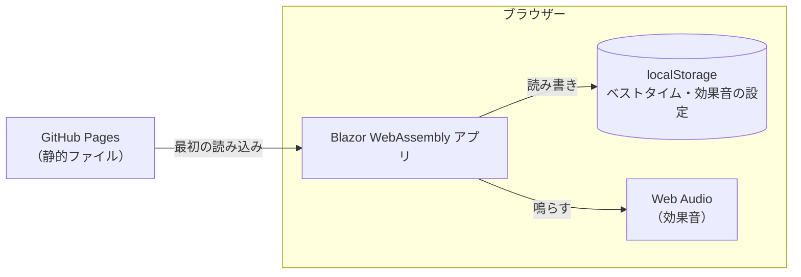

- 通信は、最初にアプリを読み込むときだけである。テンプレートが登録していた `HttpClient`（`Program.cs`）は使わないので、実装のときに削除した。

## 3. 関心事と置き場所

仕様書と UI デザインから、関心事を次のように列挙した。「置き場所」の列は 4 章の構成を指す。

| # | 関心事 | 内容 | 仕様書・UI デザイン | 置き場所 |
|---|--------|------|---------------------|----------|
| 1 | 難易度 | 初級〜上級の値、カスタムの範囲と検証 | 仕様 3.1 | GameLogic: `Difficulty` |
| 2 | 盤面 | マス、地雷、周囲の地雷の数、開く・連鎖・旗・コード | 仕様 3.3〜3.5 | GameLogic: `Board` |
| 3 | 1 回のゲームの進行 | 状態（未開始・プレイ中・勝利・敗北）、最初に開いたときの地雷の配置、勝敗の判定、残り地雷数、経過時間 | 仕様 3.2、3.6、3.7 | GameLogic: `Game` |
| 4 | ベストタイムの規則 | 初級〜上級だけ、短いときだけ更新、更新の結果 | 仕様 3.8 | GameLogic: `BestTimes` |
| 5 | ベストタイムの保存 | 保存の形式（JSON）、localStorage への読み書き、保存できないときはメモリーだけ | 仕様 3.8、6.4 | GameLogic: `BestTimesJson`（形式）。アプリ: `BestTimeStorage`（保存先） |
| 6 | 押す操作の判定 | タップ・長押し・取り消しの判定（400 ミリ秒、10px）、マウスとタッチの違い | 仕様 4.1、4.4 | アプリ: `PressGesture` |
| 7 | 操作の割り当て | 押し方（タップ・長押し・右クリック）と旗モードとマスの状態から、「開く」「旗」「何もしない」を決める。キーボードのキーから操作と方向を決める | 仕様 4.1、4.3、4.5、UI 5.2 | Presentation: `PressMapping`（押し方）。アプリ: `KeyboardMapping`（DOM のキー名） |
| 8 | キーボードの選択中のマス | 矢印キーでの移動、盤面に入ったときの位置 | 仕様 4.5 | アプリ: `BoardCursor` |
| 9 | 盤面の置き方 | 盤面の向き（入れ替えるか）、マスの大きさ、表示の座標と盤面の座標の変換 | 仕様 5.2、UI 3.2 | アプリ: `BoardPlacement`（スクロールは CSS） |
| 10 | ブラウザーの機能 | 領域の大きさの監視、振動、localStorage、キーでのスクロールの抑止 | 仕様 4.4、4.5、5.3 | アプリ: `BrowserFeatures` と `browser.js` |
| 11 | 画面の描画と画面の部品 | ツールバー、盤面、ダイアログ、勝利カード、読み上げ | UI 2 章、4〜6 章 | アプリ: Razor コンポーネント |
| 12 | 見た目 | 配色、レイアウトの切り替え（上バー・横バー）、アニメーション | UI 3、4、5 章 | アプリ: CSS |
| 13 | 表示の文言 | 難易度の表示名、読み上げ用の領域で知らせる文 | UI 6.4、7 章 | Presentation: `DifficultyNames`、`Announcements` |

1.1.0 で加えた関心事:

| # | 関心事 | 内容 | 仕様書・UI デザイン | 置き場所 |
|---|--------|------|---------------------|----------|
| 14 | 操作の結果 | 1 回の盤面の操作で起きたこと（何も起きなかった、開いた（新たに開いたマス）、旗を立てた、旗を外した）と、その操作で勝敗が決まったか | 仕様 5.6、5.7 | GameLogic: `Game` が返す値（6.1） |
| 15 | 効果音の規則 | 操作の結果から、鳴らす音を決める（1 回の操作で 1 つだけ、勝敗が決まったら勝ちか負けの音だけ、何も起きなければ鳴らさない） | 仕様 5.6 | Presentation: `SoundEffectMapping` |
| 16 | 効果音の合成 | 6 つの音の波形を作る | 仕様 5.6、UI 10.6 | Presentation: `SoundEffectSynthesizer` |
| 17 | 効果音の再生と設定 | ブラウザーで鳴らす、利用者の最初の操作で鳴らせる状態にする、オンとオフの切り替えと保存 | 仕様 5.6、6.4、UI 10.3 | アプリ: `SoundEffectPlayer`、`SoundSettingStorage`、`browser.js` |
| 18 | 演出 | 直前の操作から、演出するマスと、その種類と、開始の遅れ（操作したマスからの距離の比）を決める。動きと時間は CSS | 仕様 5.7、UI 10.7 | アプリ: `BoardAnimation` と CSS |
| 19 | ツールバーと勝利カードの置き場所 | 盤面の大きさに合わせて、ツールバーを盤面のすぐ上に、勝利カードを盤面の下の余白に置く | UI 10.4、10.5 | アプリ: `GamePage` が大きさを CSS の変数で渡し、CSS が置く |

関心事 5〜9、13〜16、18 は画面に関わるが、計算と判定だけで、画面の部品を必要としない。そこで Razor コンポーネントから切り離し、ふつうの C# のクラスにする。コンポーネントは、これらのクラスの結果を描くことと、イベントを渡すことだけを受け持つ。

## 4. ソリューションとプロジェクトの構成

```text
Shos.Minesweeper.slnx
├─ Shos.Minesweeper.GameLogic/        クラスライブラリ（net10.0）。ゲームのルール
│   ├─ Difficulty.cs
│   ├─ Board.cs
│   ├─ Game.cs
│   ├─ BestTimes.cs
│   └─ BestTimesJson.cs               ベストタイムの保存の形式。ほかの小さな型はクラス設計で決める
├─ Shos.Minesweeper.Presentation/     クラスライブラリ（net10.0）。UI の技術に依存しない、アプリで共有する表示と入力と効果音の部品
│   ├─ DifficultyNames.cs、Announcements.cs   表示の文言
│   ├─ PressMapping.cs、PressKind.cs、CellAction.cs   押し方からの操作の割り当て
│   └─ SoundEffect.cs、SoundEffectMapping.cs、SoundEffectSynthesizer.cs   効果音の種類、鳴らす場面、波形の合成（1.1.0）
├─ Shos.Minesweeper/                  Blazor WebAssembly アプリ（既存）
│   ├─ Pages/GamePage.razor           唯一のページ（ルートは "/"）。ゲームの画面。テンプレートの Home.razor の名前を変える
│   ├─ Components/                    画面の部品（6.3）
│   ├─ Input/                         PressGesture, KeyboardMapping, BoardCursor
│   ├─ Display/                       BoardPlacement, CellPresentation, BoardAnimation（1.1.0）
│   ├─ Browser/                       BrowserFeatures, BestTimeStorage, SoundEffectPlayer・SoundSettingStorage（1.1.0）
│   ├─ Layout/MainLayout.razor        既存。@Body だけを描く
│   └─ wwwroot/
│       ├─ css/app.css                配色のトークン、ページ全体のスタイル
│       ├─ js/browser.js              JavaScript の機能（9 章）
│       └─ index.html
├─ Shos.Minesweeper.GameLogic.Tests/  GameLogic のテスト（xUnit）
├─ Shos.Minesweeper.Presentation.Tests/  Presentation のテスト（xUnit）
├─ Shos.Minesweeper.TestSupport/      テストの共通の補助（クラスライブラリ）。盤面を文字の絵で書く TestGames
└─ Shos.Minesweeper.Tests/            アプリのテスト（xUnit ＋ bUnit）
    ├─ Input/、Display/、Browser/     アプリの C# クラスのテスト
    └─ Components/                   コンポーネントのテスト（bUnit）
```

プロジェクトの参照は次のとおりである。

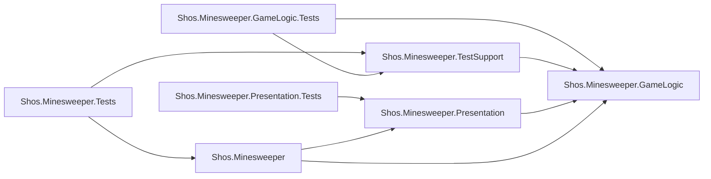

**ゲームのルールを別のプロジェクトにする理由**

- 「ルールは UI に依存しない」という方針を、コンパイラーで守れる。GameLogic のプロジェクトは Blazor のパッケージを参照しないので、UI の型を使うとビルドが通らない。
- 同じプロジェクトのフォルダーで分ける案も考えた。ファイルは 1 つ少なくて済むが、依存の向きを人が見張り続けることになる。プロジェクトを 1 つ増やす手間は一度きりなので、プロジェクトを分ける。

**アプリで共有する部品を別のプロジェクト（Presentation）にする理由**

- 次に作る WPF 版とコンソール版で、同じ規則（表示の文言、ポインターの操作の割り当て）を使うためである。Web アプリに置いたままだと、各アプリに同じ規則を書くことになる。
- GameLogic に入れる案も考えた。これらはゲームのルールではない（表示と入力の決まり）ので、GameLogic の「ゲームのルール」という境界を保つために、別のプロジェクトにした。Presentation は GameLogic だけに依存し、UI の技術には依存しない。
- ベストタイムの保存の形式（`BestTimesJson`）は、表示でも入力でもないので Presentation には置かず、GameLogic の `BestTimes` のそばに置く。形式の中身は `BestTimes`・`Difficulty.Presets`・`Game.MaxElapsedSeconds` という GameLogic の型と値だけでできていて（情報を持つ者に置く）、どのアプリも GameLogic を参照する。使うのは .NET の基本ライブラリの `System.Text.Json` だけなので、GameLogic の依存の規則（5 章）も変わらない。保存先（localStorage、ファイルなど）は、各アプリが決める。
- 共有するのは、どの UI でも形が変わらないと言えるものだけにした。盤面の置き方（`BoardPlacement`）、キーやポインターの受け方（`KeyboardMapping`、`PressGesture`。DOM の値に依存する）、マスの見た目（`CellPresentation`。CSS のクラス名を含む）は Web アプリに残し、WPF 版・コンソール版の設計で要る形が見えてから移す（CLAUDE.md の「目的」の前提）。

**効果音の部品を Presentation に置き、効果音の実装に依存させない理由（1.1.0）**

- 効果音の部品（どの出来事でどの音を鳴らすか、音そのもの）は、Web 版と WPF 版で共有し、コンソール版は使わない（CLAUDE.md の「目的」）。
- 効果音の種類、鳴らす場面、波形の合成は、どれも .NET の基本ライブラリだけで書け、UI の技術に依存しない。操作の結果を利用者に伝える部品として、表示の文言と同じ性質を持つので、Presentation に置く（ユーザーの決定。docs/reviews/04-architecture-review.md の「1.1.0 のレビュー」）。
- **Presentation は、効果音の実装に依存しない。** 効果音の実装とは、音を鳴らす仕組みのことで、Web 版ではブラウザーの Web Audio、WPF 版では WPF の再生の方法やライブラリ（NAudio など。調査書 8.8）である。Presentation が作るのは音の波形（サンプルの並び）までで、それを鳴らすのは各アプリである。Presentation のプロジェクトは、音を鳴らすパッケージを参照しない。Web 版は Web Audio で鳴らす（9.4）。WPF 版の再生の方法は、WPF 版の一巡で決める。
- コンソール版は Presentation を参照するが、効果音の部品を呼ばない。Presentation が音を鳴らす仕組みを持たないので、コンソール版が音を鳴らす仕組みに依存することはない。
- Presentation に、音を鳴らすためのインターフェイス（アプリが実装する）は作らない。Presentation の部品が自分で音を鳴らすことはなく、アプリが「鳴らす効果音を決める（`SoundEffectMapping`）→ 自分の方法で鳴らす」と呼ぶだけだからである（15 章）。
- 設計書の初めの案は、別のクラスライブラリ（SoundEffects）とそのテストプロジェクトを加えるものだった。コンソール版が効果音の部品を持たないことまでコンパイラーで守れるが、プロジェクトが 2 つ増える。ユーザーは、Presentation に置き、効果音の実装に依存しないことを守る形を選んだ。
- Web アプリに置く案は採らない。WPF 版で同じ規則と合成を書き直すことになり、2 つの版の音がずれていく。
- テストは、Presentation のテストプロジェクト（`Presentation.Tests`）に足す。

**テストプロジェクトを、共有するプロジェクト（GameLogic、Presentation）とアプリで分ける理由**

- Web 版の公開の後に、GameLogic と Presentation を使う WPF 版とコンソール版を作ると決めた（CLAUDE.md の「目的」）。共有するプロジェクトのテストは、どのアプリにも依存しないようにしておく。そのテストだけを流すときに、Web アプリと bUnit のビルドが要らない。
- 盤面を文字の絵で書く補助（`TestGames`）は、GameLogic のテストとアプリのテストの両方で使うので、小さなクラスライブラリ（`TestSupport`）に置く。xUnit v3 のテストプロジェクトは実行ファイルになるので、テストプロジェクトどうしを参照させない。
- すべてのテストは、リポジトリ直下の `dotnet test` の 1 回で走る（`global.json` とソリューションを見つける）。
- 初めは、分けても得るものがほとんどないとして 1 つにしていた。WPF 版とコンソール版を作ると決めたので、工程 12（リファクタリング）で分けた（docs/reviews/code-review.md の工程 12 の R1）。

**名前**

- `GameLogic` は、CLAUDE.md の「ゲームロジック」をそのまま名前にした。要求の語彙をコードでも使うためである。
- 効果音の型の名前（`SoundEffect` など）は、仕様書の「効果音」から付けた（1.1.0）。音楽（BGM）などは作らないので（仕様書 9 章）、`Audio` のような広い名前にしない。
- アプリのフォルダー名に `Layout` は使わない。既存の `Layout/`（Blazor のレイアウト）と意味がぶつかるからである。盤面の置き方のクラスは `Display/` に置く。

## 5. 層と依存の向き

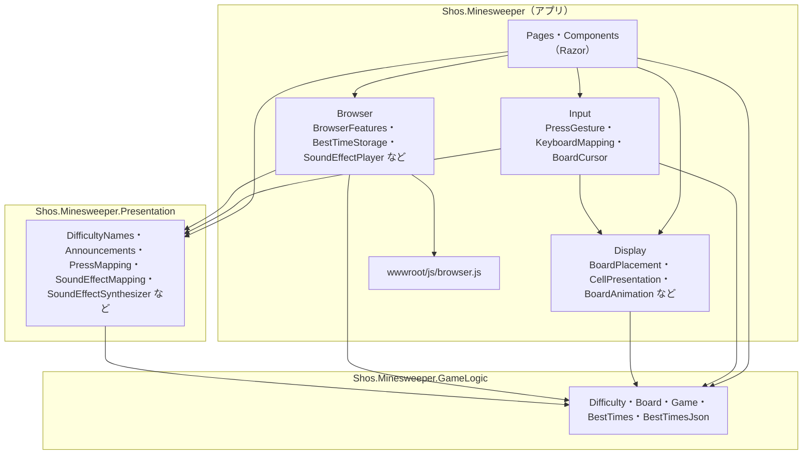

依存の規則は次のとおりである。

| 単位 | 依存してよいもの | 依存しないもの |
|------|------------------|----------------|
| GameLogic | .NET の基本ライブラリだけ（`TimeProvider`、`Random`、`System.Text.Json` など） | Blazor、JavaScript、アプリのすべて |
| Presentation | GameLogic（1.1.0 からは操作の結果も）、.NET の基本ライブラリ | Blazor、WPF、JavaScript、効果音の実装（Web Audio、WPF の再生の方法、NAudio などのライブラリ。1.1.0）、アプリのすべて |
| Input | GameLogic（マスの状態を見るため）、Presentation（押し方と操作の型）、`TimeProvider`、Display（`BoardCursor` が `BoardPlacement` を使うため） | Blazor、JavaScript |
| Display | GameLogic の値の型（盤面の座標、マスの見せ方、難易度など。表示の判断の入力として使う） | Blazor、JavaScript |
| Browser | GameLogic（`BestTimes` とその保存の形式）、Presentation（効果音の種類と合成。1.1.0）、`IJSRuntime` | コンポーネント |
| Pages・Components | 上のすべて | — |

- 矢印は一方向で、逆向きの依存（GameLogic や Presentation がアプリを知る、Input がコンポーネントを知る）はない。
- Presentation は、効果音の実装に依存しない。コンソール版は GameLogic と Presentation を参照し、効果音の部品は呼ばない（1.1.0）。
- GameLogic は、盤面の縦と横を入れ替えて表示することを知らない。入れ替えは表示だけの話で、ルールとは独立しているからである。座標の変換は `BoardPlacement` が受け持つ。

## 6. 各単位の責務

型の名前は、要求の語彙（仕様書の用語）に合わせた。公開メンバーはクラス設計で決める。

### 6.1 GameLogic

| 型 | ひとことで言うと | 持たないもの |
|----|------------------|--------------|
| `Difficulty` | 難易度（種類、幅、高さ、地雷数）。初級〜上級の値と、カスタムの値の検証を持つ | 画面の文言（「5〜30 の整数を…」は UI が組み立てる。範囲の値は `Difficulty` から得る） |
| `Board` | 盤面。マスの状態、地雷、周囲の地雷の数を持ち、開く（0 の連鎖を含む）、旗、コードを行う | 勝敗の判断、時刻、地雷を置く場所の選び方 |
| `Game` | 1 回のゲーム。状態の遷移、最初に開いたときの地雷の配置、勝敗、残り地雷数、経過時間を受け持つ。盤面の操作（開く・旗）は、操作の結果を返す（1.1.0） | 難易度の選択、ベストタイム、旗モード、直前の操作（1.1.0） |
| 操作の結果（1.1.0。型の名前はクラス設計で決める） | 1 回の盤面の操作で起きたこと。何も起きなかった、開いた（新たに開いたマスの一覧）、旗を立てた、旗を外した、のどれかと、その操作で勝敗が決まったか（勝ち・負け） | 鳴らす音、演出（決めるのは Presentation とアプリ） |
| `BestTimes` | 初級〜上級のベストタイムと、その更新の規則。更新したか、初めての記録か、を返す | 保存の方法 |
| `BestTimesJson` | ベストタイムの保存の形式（JSON）の読み書き。どのアプリも、この形式で記録を残す | 保存先（localStorage、ファイルなど。各アプリが決める） |

- 盤面の位置を表す小さな型（行と列）や、マスの状態、ゲームの状態を表す型は、クラス設計で決める。
- `Game` は、地雷を置く場所の選び方を外から受け取る（テストのための差し替え口。12 章）。本番では乱数で選ぶ。
- `Game` は、時刻を `TimeProvider` から得る。経過時間は「開始した時刻との差」で計算するので（仕様書 3.7）、タブが裏にあっても正しい。
- 操作の結果を `Game` が返すのは（1.1.0）、1 回の操作で何が起きたか（とくに 0 の連鎖やコードで新たに開いたマス）を知っているのが `Board` と `Game` だけだからである（情報を持つ者に置く）。
  - 画面が操作の前と後の盤面を比べて求める案は、採らない。上級では 480 マスを比べることになり、「何が起きたか」の判断が画面に漏れる。
  - `Game` に「直前の操作」を状態として持たせる案も、採らない。ルールには要らない、演出のためだけの状態になるからである。結果は戻り値として返し、それを覚えておくかどうかは画面が決める（7.1）。
  - 何も起きなかった操作（旗の数が合わないコード、開いたマスへの旗など）も、「何も起きなかった」という結果を返す。例外にはしない（仕様書 3.4 の「何もしない」は、正しい操作だからである）。

### 6.2 Presentation とアプリの C# クラス

**Presentation（アプリで共有する部品）**

| 型 | ひとことで言うと |
|----|------------------|
| `DifficultyNames` | 難易度の表示名（「初級」など） |
| `Announcements` | 新しいゲームと勝敗を知らせる文（Web 版では読み上げ用の領域で使う） |
| `PressMapping` | 押し方（タップ・長押し・右クリック）と旗モードとマスの状態から、行う操作（開く・旗・何もしない）を決める。長押しの円を出すかどうかも、ここで決まる（UI 5.2） |

**Presentation の効果音の部品（Web 版と WPF 版で共有する。1.1.0）**

| 型 | ひとことで言うと |
|----|------------------|
| `SoundEffect` | 効果音の種類。開く、連鎖、旗を立てる、旗を外す、負け、勝ちの 6 つ（仕様書 5.6） |
| `SoundEffectMapping` | 操作の結果から、鳴らす効果音を決める。勝敗が決まったら勝ちか負けの音だけ、新たに開いたマスが 1 つなら開く音、2 つ以上なら連鎖の音、何も起きなければ鳴らさない（仕様書 5.6） |
| `SoundEffectSynthesizer` | 効果音の種類から、音の波形（-1〜1 のサンプルの並び。モノラル）を合成する（UI デザイン 10.6）。全体の音量（0.8）もここで掛ける。雑音も乱数の種を固定して作り、同じ効果音には毎回同じ波形を返す |

**アプリの C# クラス**

| 型 | フォルダー | ひとことで言うと |
|----|------------|------------------|
| `PressGesture` | Input | 1 回の「押して離す」を、タップ・長押し・取り消しのどれかに判定する |
| `KeyboardMapping` | Input | キーボードのキー（DOM の `KeyboardEvent.key` の値）から、行う操作と矢印の方向を決める（仕様 4.5） |
| `BoardCursor` | Input | キーボードで選択しているマスの位置。位置は盤面の座標で持つ。矢印キーの方向は、`BoardPlacement` で盤面の方向に変えてから動かす |
| `BoardPlacement` | Display | 盤面の領域の大きさと盤面の行数・列数から、向きとマスの大きさを決める。表示の座標と盤面の座標を変換する。スクロールが要るかどうかは決めない（盤面の領域の CSS を `overflow: auto` にして任せる） |
| `CellPresentation` | Display | マスの見た目（CSS のクラス、アイコン）と読み上げの名前を決める |
| `BrowserFeatures` | Browser | `browser.js` の関数を呼ぶ窓口。JavaScript を呼ぶのはこのクラスだけである |
| `BestTimeStorage` | Browser | `BestTimes` を localStorage に読み書きする。形式は GameLogic の `BestTimesJson` に任せる。保存できないときは何もしない（メモリーの `BestTimes` だけが残る） |
| `BoardAnimation`（1.1.0） | Display | 直前の操作（操作したマスと操作の結果）と、マスの見せ方から、演出するマスと、その演出の種類（開く、踏んだ地雷、地雷が現れる、誤った旗、旗が跳ねる）と、開始の遅れの比（0〜1。操作したマスからの距離 ÷ その演出の中での最大の距離）を決める（UI デザイン 10.7）。時間の長さは持たない（CSS が持つ。9.2） |
| `SoundEffectPlayer`（1.1.0） | Browser | 効果音の波形を `SoundEffectSynthesizer` で合成して、`BrowserFeatures` で JavaScript に渡しておき、求められた効果音を鳴らす |
| `SoundSettingStorage`（1.1.0） | Browser | 効果音のオンとオフの設定を localStorage に読み書きする。保存できないときは何もしない（ページを開いている間だけ設定が残る。仕様書 5.6） |

- `PressGesture` と `PressMapping` を分けたのは、変更理由が違うからである。長押しの判定時間や移動の許容量を変えるときは `PressGesture` だけを、旗モードでの割り当てを変えるときは `PressMapping` だけを直す。
- `PressGesture` の長押しの待ち時間は、`TimeProvider` で計る。テストでは時刻を進めて確かめる。
- `BoardCursor` が盤面の座標で位置を持つのは、画面の向きが変わって盤面の縦と横が入れ替わっても、同じマスを選んだままにするためである。表示の座標で持つと、入れ替わったときに別のマスを指してしまう。
- `CellPresentation`、`DifficultyNames`、`Announcements` はクラス設計で加えた。公開メンバーと、ほかの小さな型はクラス設計書（docs/05-class-design.md）にある。
- `SoundEffectMapping` と `SoundEffectPlayer` を分けたのは（1.1.0）、変更理由が違うからである。鳴らす場面を変えるときは `SoundEffectMapping` だけを直し、Web 版と WPF 版の両方に効く。ブラウザーでの鳴らし方を変えるときは `SoundEffectPlayer` と `browser.js` だけを直す。
- `BoardAnimation` は、Web アプリに置く（1.1.0）。演出の形（どのマスに、どの種類を、遅れの比で渡す）が、CSS のアニメーションで描く Web 版の描き方に合わせたものだからである。WPF 版で要る形が見えてから、共有するかを決める（CLAUDE.md の「目的」の前提）。

### 6.3 コンポーネント

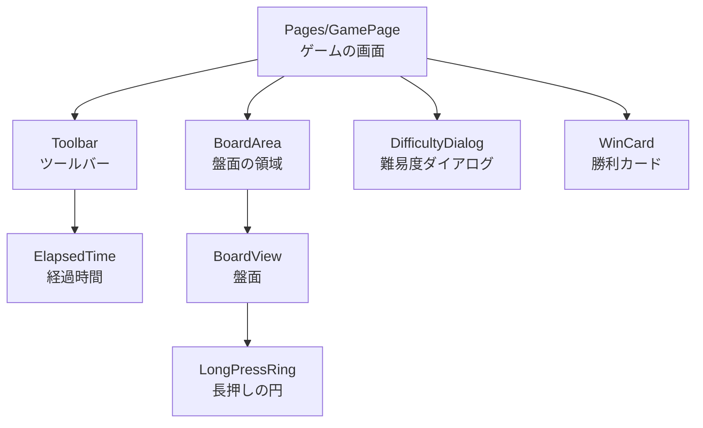

| コンポーネント | 責務 |
|----------------|------|
| `GamePage` | 画面全体の状態の持ち主（7.1）。子からの操作の意図を受けて `Game` を呼び、勝ったらベストタイムを更新して保存し、勝利カードと読み上げを出す。1.1.0 で次を加えた: 操作の結果から効果音を鳴らし（8.6）、直前の操作を盤面に渡す。盤面の領域の大きさから盤面の置き方を計算し、ツールバーと勝利カードの置き場所のための大きさを CSS の変数で渡す（8.5、9.2）。効果音のオンとオフを切り替えて保存する |
| `Toolbar` | 難易度ボタン、残り地雷数、リセット ボタン（顔）、経過時間、旗モード ボタン、効果音 ボタン（1.1.0）を描き、押されたことを `GamePage` に伝える |
| `ElapsedTime` | 経過時間を表示する。250 ミリ秒ごとに経過時間を確かめ、表示する秒が変わったときだけ自分を描き直す（7.3） |
| `BoardArea` | 盤面の領域。大きさの変化を監視して、`GamePage` に伝える（1.1.0 で、置き方の計算を `GamePage` に移した。7.1）。盤面が収まらないときは、この領域がスクロールする |
| `BoardView` | マスを描き、ポインターとキーボードのイベントを受けて、`PressGesture`・`PressMapping`・`KeyboardMapping`・`BoardCursor` を使い、「この位置を開く」「この位置の旗」という意図を `GamePage` に伝える。押下中の表示もここで持つ。直前の操作の演出を、`BoardAnimation` の結果からマスの CSS のクラスと変数にして描く（1.1.0） |
| `LongPressRing` | 長押しの進行の円を、押したマスの位置に重ねて描く。押下を追っている `BoardView` の子にする |
| `DifficultyDialog` | 難易度の選択とカスタムの入力。入力の検証は `Difficulty` に任せ、誤りの文言を表示する |
| `WinCard` | 勝利カード。タイムとベストタイムの更新の結果を表示する。置き場所（盤面の下か、領域の下端か）は CSS が決める（1.1.0。9.2） |

アイコン（SVG）などの小さな部品は、クラス設計で決める。

1.1.0 で `GamePage` が受け持つことが増えたので、`GamePage` は判断を持たず、つなぐだけにする。鳴らす効果音は `SoundEffectMapping`、演出は `BoardAnimation`、盤面の置き方は `BoardPlacement`、保存は `BestTimeStorage` と `SoundSettingStorage` が決める。`GamePage` に残るのは、誰の結果を誰に渡すかと、状態の持ち主としての値だけである。

### 6.4 組み立て（`Program.cs`）

依存性の注入（DI）に登録するのは、次の 5 つだけである（1.1.0 で 2 つ加えた）。

| 登録するもの | 有効期間 | 使う側 |
|--------------|----------|--------|
| `TimeProvider`（本番は `TimeProvider.System`） | シングルトン | `GamePage`（`Game` を作るときに渡す）、`BoardView`（`PressGesture` に渡す）、`ElapsedTime`（経過時間を確かめるタイマー） |
| `BrowserFeatures` | スコープ | `BoardArea`、`BoardView`、`BestTimeStorage`、`SoundEffectPlayer`、`SoundSettingStorage` |
| `BestTimeStorage` | スコープ | `GamePage` |
| `SoundEffectPlayer`（1.1.0） | スコープ | `GamePage` |
| `SoundSettingStorage`（1.1.0） | スコープ | `GamePage` |

- Blazor WebAssembly では、スコープの有効期間はアプリの実行中ずっと続く（シングルトンと同じになる）。
- `Game`、`BestTimes`、`PressGesture`、`BoardCursor`、`BoardPlacement` は、DI に登録しない。状態を持つ持ち主のコンポーネント（7.1）が `new` で作る。持ち主が 1 つに決まっており、差し替える必要があるのは中で使う `TimeProvider` だけだからである。
- 地雷を置く場所の本番の選び方（乱数）は、GameLogic が既定として持つ。`GamePage` は既定のまま使い、テストだけが別の選び方を渡す。
- テンプレートが登録している `HttpClient` は削除する（2 章）。
- bUnit のテストでは、`TimeProvider` の代わりに `FakeTimeProvider` を登録し、JavaScript の呼び出しは bUnit の偽物で受ける。効果音も、JavaScript の呼び出し（どの効果音を鳴らしたか）を偽物で受けて確かめる（1.1.0）。
- `SoundEffectMapping` と `SoundEffectSynthesizer` は、状態を持たない規則と計算なので、DI に登録しない（1.1.0）。

## 7. 状態と更新の流れ

### 7.1 状態の持ち主

| 状態 | 持ち主 | 理由 |
|------|--------|------|
| 現在のゲーム（`Game`） | `GamePage` | ツールバーと盤面の両方が表示に使う |
| 現在の難易度 | `GamePage` | リセットで同じ難易度を使い、ダイアログにも渡す |
| 旗モード | `GamePage` | ツールバーのボタンと盤面の両方が使う。リセットしても保つ（仕様書 4.3） |
| ベストタイム（`BestTimes`） | `GamePage` | ダイアログと勝利カードが表示に使う |
| 難易度ダイアログ・勝利カードの表示の有無 | `GamePage` | 難易度ダイアログを表示している間だけ、ほかの部分を `inert` にする（9.2）。勝利カードはモードレスなので（UI 2.4）、ほかの部分を `inert` にしない |
| 押している間の状態（`PressGesture`）、押下中のマス | `BoardView` | 盤面の中だけで使う |
| 選択中のマス（`BoardCursor`） | `BoardView` | 盤面の中だけで使う |
| 盤面の領域の大きさ、盤面の置き方（`BoardPlacement`） | `GamePage`（1.1.0 で `BoardArea` から移した） | 盤面を描くことに加えて、ツールバーと勝利カードの置き場所にも使う（UI 10.4、10.5）。ツールバーは盤面の領域の外にあるので、両方の親が持つ。大きさを測るのは、今までどおり `BoardArea` である |
| 効果音のオンとオフ（1.1.0） | `GamePage` | ツールバーのボタンが表示に使い、操作の結果を受ける `GamePage` が鳴らすかを決める。ページを開いたときに保存から読む |
| 直前の操作（操作したマスと操作の結果。1.1.0） | `GamePage` | 操作を行うのが `GamePage` で、盤面が演出に使う。何かが起きた操作のときだけ置き換える（何も起きなかった操作では、前の演出を止めない）。新しいゲームを始めたら消す |

- ゲームの状態を持つのは `Game` だけにする。コンポーネントは `Game` の状態を読んで描くだけで、コピーを持たない。直前の操作は、ゲームの状態ではなく、演出のための記録である（6.1）。
- 旗モードは保存しない。ページを開き直すとオフに戻る（保存するのはベストタイムと効果音の設定だけ。仕様書 6.4）。

### 7.2 一方向の流れ

状態は親から子へ引数で渡し、操作は子から親へイベント（`EventCallback`）で伝える。


- `Game` から画面へ知らせる仕組み（イベントなど）は作らない。Blazor は、イベントを処理した後にコンポーネントを描き直すので、描き直しのときに `Game` の状態を読めば足りる。操作の結果（1.1.0）も、知らせる仕組みではなく、`GamePage` が呼んだ操作の戻り値として受け取る。
- 盤面の領域の大きさは、子（`BoardArea`）から親（`GamePage`）へイベントで伝える（1.1.0）。利用者の操作ではないが、流れは同じ一方向である。

### 7.3 描き直しの範囲

仕様書 6.2 の性能の目標（上級で 100 ミリ秒以内）のために、次の 2 つを初めから守る。

- **経過時間は、`ElapsedTime` だけを描き直す。** 1 秒ごとに `GamePage` を描き直すと、480 マスの盤面も毎秒描き直すことになるからである。
- **`BoardView` は、状態が変わらないポインターのイベントでは描き直さない。** `pointermove` は多いときに 1 秒に 100 回以上起きるが、ほとんどは 10px 未満の移動で、状態を変えない。

これ以外の最適化（マスを 1 つずつのコンポーネントにして変わったマスだけを描くなど）は、工程 13 で実機で計ってから、必要なら行う。

1.1.0 で、次の 2 つを加えた。

- **演出のために描き直しを増やさない。** 演出は、操作の後の 1 回の描き直しで、マスに CSS のクラスと変数を付けるだけにする。動きは CSS のアニメーションが進め、C# のタイマーで描き直さない。演出するマスと遅れの比の計算は、直前の操作が変わったときに 1 回だけ行い、押下中の表示などのための描き直しでは計算し直さない。
- **盤面の領域の大きさが変わったときは、`GamePage` から描き直す。** 置き方の持ち主を `GamePage` に移したためで（7.1）、ツールバーも描き直すことになる。盤面はもともと描き直していたので増えるのはツールバーの分だけで、大きさの変化は画面の向きを変えたときなどに限られるので、性能の目標（盤面の操作）には響かない。


### 7.4 後片付け

コンポーネントが破棄されるときに、次のものを止める（`IDisposable` または `IAsyncDisposable`）。止めないと、破棄された後もタイマーや監視が動き続け、.NET のオブジェクトが解放されないからである。

| コンポーネント | 止めるもの |
|----------------|------------|
| `BoardArea` | `ResizeObserver` の監視と、JavaScript に渡した .NET の参照（`DotNetObjectReference`） |
| `BoardView` | 長押しの待ち |
| `ElapsedTime` | 経過時間を確かめるタイマー |

画面は 1 つだけなので、実際に破棄されるのはページを閉じるときくらいだが、テスト（bUnit）ではテストのたびに作って破棄するので、ここで決めておく。

## 8. 主な処理の流れ

### 8.1 押す操作の判定

`PressGesture` の状態の遷移を次に示す。

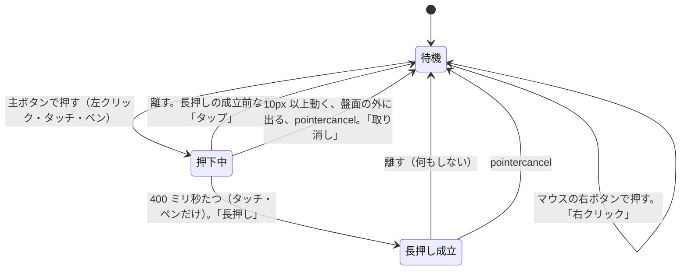

- 押している間に別の指で触れた場合、その指は無視する。最初に押したポインター（`pointerId`）だけを追う。
- 右クリックは、ボタンを押したとき（`pointerdown`）に判定する。
- ポインターが盤面の外に出たら（`pointerleave`）、取り消す。マウスで押したまま盤面の外に出てボタンを離すと、`pointerup` が盤面に届かず、押下中のまま残ってしまうからである。
- マウスの左ボタンには長押しがない（仕様書 4.1）。押し続けても「押下中」のままで、離せばタップになる。

### 8.2 タップでマスを開く

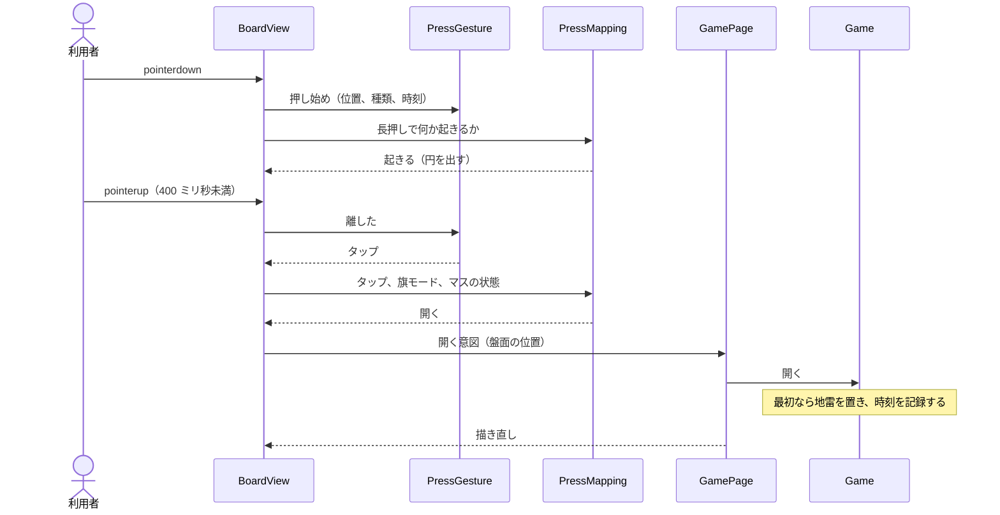

- `BoardView` は、表示の座標を `BoardPlacement` で盤面の座標に変えてから `GamePage` に伝える。`GamePage` と `Game` は、盤面の座標だけを扱う。

### 8.3 長押しで旗を立てる

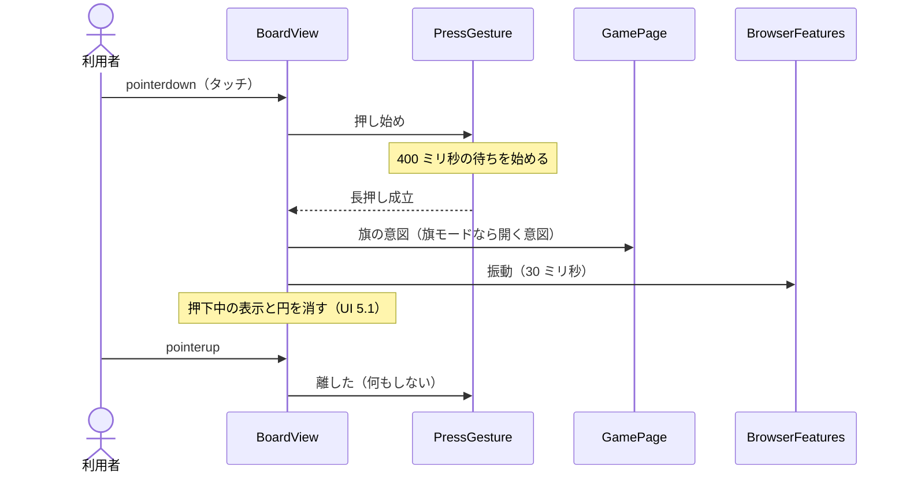

### 8.4 勝ったとき

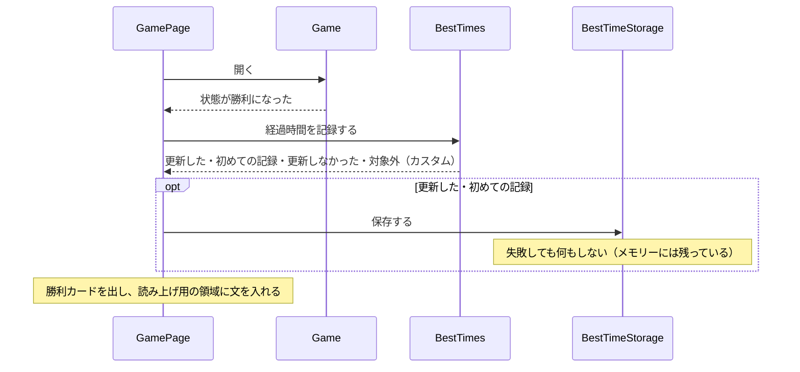

- 勝ちの効果音と演出は、ほかの操作と同じ流れ（8.6）で出す（1.1.0）。

### 8.5 画面の大きさや向きが変わったとき

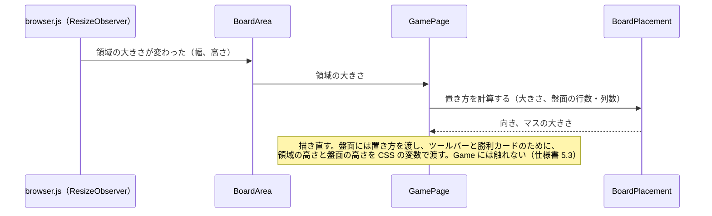

- 1.1.0 で、置き方を計算するのを `BoardArea` から `GamePage` に移した（7.1）。難易度を変えたときは、`GamePage` が、覚えている領域の大きさと新しい難易度から計算し直す。

- 領域の大きさは、`BoardArea` の要素そのものを `ResizeObserver` で監視して得る。上バーと横バーの切り替えは CSS が行い（9.2）、C# は切り替えの結果として決まった領域の大きさだけを使う。こうすると、レイアウトの規則（UI 3.1）が CSS と C# に二重に書かれない。
- UI デザイン 3.2 の「W」「H」は、この領域の大きさから盤面の枠（3px × 2）を引いたものになる。

### 8.6 操作の結果から効果音と演出を出す（1.1.0）

タップで 0 のマスを開き、連鎖した場合を示す。旗の操作、コード、キーボードの操作も同じ流れである。

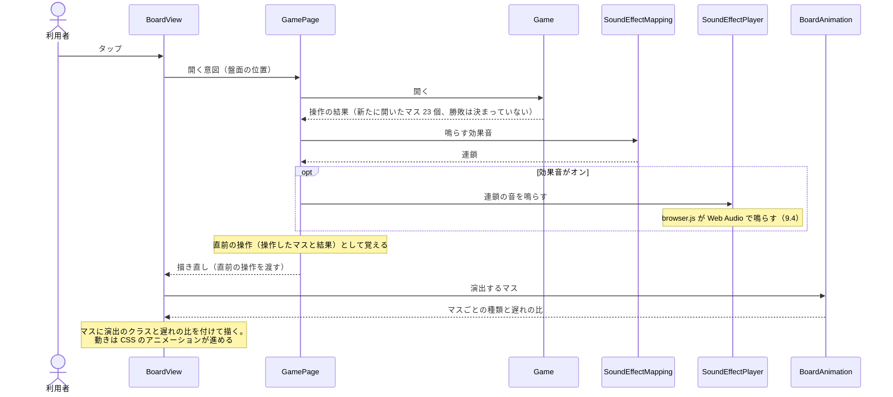

- 音は、描き直しの前に鳴らし始める。音も押したマスの変化も遅れなしで始まるので、操作から最初の変化までの時間（仕様書 6.2）は延びない。
- 長押しで行った操作の音も、この流れで `GamePage` が鳴らす。`BoardView` は、今までどおり振動だけを受け持つ（8.3）。長押しの成立そのものの音はない（仕様書 4.4）。
- 距離は、盤面の座標でのマスの中心どうしの距離で求める。表示で縦と横を入れ替えても、2 つのマスの距離は変わらないので、UI デザイン 10.7 の「表示している向きでの距離」と同じ値になる。表示の座標に変える必要はない。
- 新しいゲームを始めたら、直前の操作を消す。演出のクラスがすべて外れるので、演出はその場で終わる（仕様書 5.7）。
- 演出の途中で次の操作をしたら、直前の操作が新しい操作に置き換わる。前の操作の演出のクラスは外れ、そのマスはすぐに最後の見た目になる（14 章の決定 9）。ただし、何も起きなかった操作（旗の数が合わないコードなど）では置き換えず、前の演出はそのまま続く。
- 演出の途中で描き直しても（押下中の表示など）、演出のクラスと変数は変わらないので、アニメーションは最初からやり直さずに続く。

### 8.7 効果音を鳴らせるようにする（1.1.0）

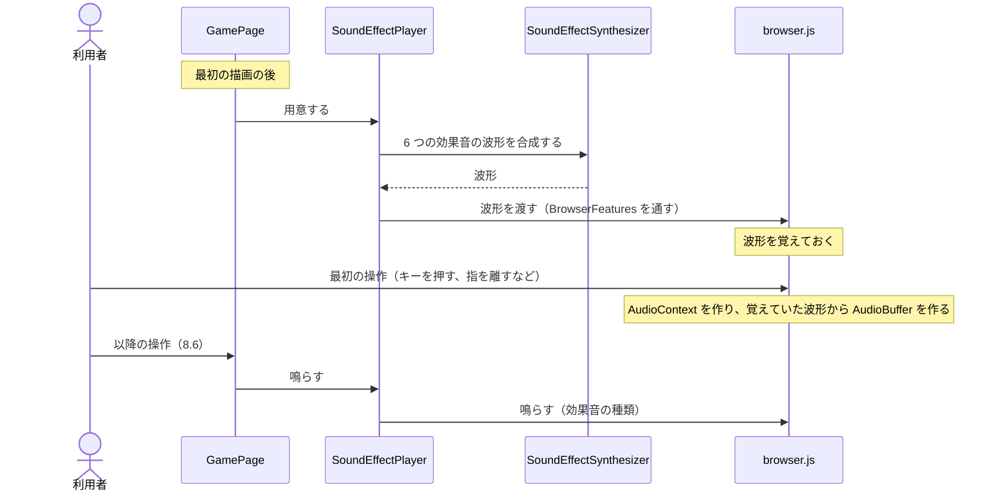

- 合成は、最初の描画の後に 1 回だけ行う。最初の表示を遅らせず、最初の操作の音を待たせないためである。効果音がオフでも用意しておき、オンに戻したときにすぐ鳴らせるようにする。
- 利用者の操作を受けて `AudioContext` を動かすのは、JavaScript の側で行う（9.4）。

## 9. ブラウザーとの境界

### 9.1 JavaScript を使うもの

CLAUDE.md のとおり、JavaScript は必要なときに限る。使うのは次の 6 つ（1.1.0 で 2 つ加えた）で、すべて `wwwroot/js/browser.js`（ES モジュール）に置き、C# からは `BrowserFeatures` だけが呼ぶ。

| 機能 | JavaScript が要る理由 | 失敗したとき |
|------|------------------------|--------------|
| 盤面の領域の大きさの監視（`ResizeObserver`） | 要素の大きさの変化を Blazor だけでは受け取れない | — |
| 振動（`navigator.vibrate`） | Blazor に振動の機能がない | 何もしない（iOS の Safari など、対応していない端末では呼ばない。仕様書 4.4） |
| localStorage の読み書き | Blazor に localStorage の機能がない | 読めないときは「記録なし」、書けないときは何もしない（仕様書 3.8） |
| 盤面での矢印キーと Space の既定の動作の抑止 | Blazor の `:preventDefault` は、キーごとに切り替えられない。盤面のキーをすべて止めると Tab キーで盤面から出られなくなる | — |
| 効果音の再生（Web Audio。1.1.0） | Blazor に音を鳴らす機能がない | 何もしない（Web Audio がない、再生に失敗した。ゲームは続ける） |
| 利用者の操作で、効果音を鳴らせる状態にする（1.1.0） | ブラウザーは、利用者の操作のイベントの処理の中で動かした `AudioContext` でなければ、音を出さない（調査書 8.7）。Blazor のイベントの処理は .NET を通ってから JavaScript を呼ぶので、その中で動かすと「操作の最中」と見なされないおそれがある | 鳴らない（ゲームは続ける） |

- localStorage、振動、効果音（1.1.0）の例外は、`browser.js` の中で受け止め、C# には結果（値、なし）だけを返す。C# 側で JavaScript の例外を扱う箇所を作らないためである。
- `browser.js` は、`IJSRuntime` の `import` で読み込む。GitHub Pages のサブパス（`/Shos.Minesweeper/`）でも読み込めることを、実装のときに確かめた（16 章）。

### 9.2 JavaScript を使わずに済ませるもの

| 機能 | 方法 |
|------|------|
| 右クリックのメニューを出さない | `@oncontextmenu:preventDefault` |
| 長押しの文字選択・コールアウト、ダブルタップのズームを出さない | CSS（`user-select: none`、`-webkit-touch-callout: none`、`touch-action: manipulation`） |
| フォーカスを動かす | Blazor の `ElementReference.FocusAsync()` |
| ダイアログの外を操作できなくし、フォーカスを閉じ込める | ダイアログの外の要素に `inert` を付ける。`inert` の要素にはフォーカスが入らず、スクリーンリーダーからも隠れるので、フォーカスを閉じ込める処理を書かずに済む |
| 上バーと横バーの切り替え | CSS のメディアクエリー（UI 3.1 の条件）で、ツールバーの置き場所（上か左か）を切り替える。ツールバーの中の並べ方（横に並べるか縦に並べるか）は、各部品が置き場所の縦長・横長をコンテナークエリーで見て決める。ページの CSS が部品の中のクラス名に踏み込まずに済む（docs/reviews/code-review.md の区切り 4 の指摘 1） |
| マスの大きさの反映 | `BoardView` が CSS の変数（`--cell-size`）を設定し、CSS のグリッドで並べる |
| 長押しの円の位置 | `LongPressRing` は、画面に固定した層（`position: fixed`）に描く。盤面の領域がスクロールするときも、領域の端で円が切れないようにするためである。円の中心は、押したときのポインターのイベントの値から求める。`ClientX − OffsetX`（`Y` も同じ）がマスの左上の画面上の位置になるので、それにマスの大きさの半分を足す。イベントの対象が必ずマスの要素になるように、マスの中の数字やアイコンには `pointer-events: none` を指定する |
| 長押しの円が満ちるアニメーション、旗やカードのアニメーション、動きを減らす設定 | CSS のアニメーションと `prefers-reduced-motion` |
| 演出（0 の連鎖の広がり、負け、勝ち。1.1.0） | CSS のアニメーション。`BoardView` が、演出するマスに、種類を表すクラスと、開始の遅れの比（0〜1）を入れた CSS の変数を付ける。CSS が「比 × その演出の最大の遅れ」で `animation-delay` を決め、遅れの間は `animation-fill-mode: backwards` で最初の見た目（未開放のタイル）を保つ。時間の値（UI 10.7 の 150、400、300 ミリ秒など）は CSS だけに置くので、実機での調整（UI 10.9）で C# を変えずに済む。動きを減らす設定では、CSS がアニメーションを止め、結果がすぐ見える |
| ツールバーを盤面のすぐ上に置く（上バー。1.1.0） | `GamePage` が、盤面の領域の高さと盤面の高さ（枠を含む）を CSS の変数で渡す。CSS が、ツールバーを「(領域の高さ − 盤面の高さ) ÷ 2」（0 未満なら 0）だけ下にずらす。盤面は領域の中央にあるので、これでツールバーと盤面のまとまりが縦の中央に来る。ずらすのは `translate` で、レイアウトは変えないので、領域の大きさの測り方（UI 3.2）は変わらない（UI 10.4）。ずらしたツールバーは盤面の領域の上に重なるので、重なりの順でツールバーを上にし、押せなくならないようにする |
| 勝利カードの置き場所（1.1.0） | 盤面の領域の中に、上端から下端の 8px 上までの縦の並びを置き、「盤面の下端 + 8px」の高さの詰め物（縮められる）とカードを並べる。余白が足りれば、詰め物はそのままで、カードは盤面の下に来る。足りなければ、詰め物が縮んで、カードは領域の下端に寄る（UI 10.5）。盤面の下端は、上と同じ 2 つの変数から求める。カードの高さを C# で知らずに済む |
| ダークモード | CSS の `prefers-color-scheme` |

HTML の `<dialog>` 要素の `showModal()` は、フォーカスの閉じ込めを任せられるが、呼ぶのに JavaScript が要る。`inert` なら Blazor の属性だけで済むので、こちらを使う。

### 9.3 CSS の構成

| ファイル | 内容 |
|----------|------|
| `wwwroot/css/app.css` | 配色のトークン（UI 4.1。1.1.0 で `board` と `shadow` を加えた。UI 10.2。CSS のカスタム プロパティ）、ライトとダークの切り替え、ページ全体の決まり（ボタンの基本の見た目、フォーカスの枠。UI 2.2、6.3）、読み込み中とエラーの表示 |
| 各コンポーネントの `*.razor.css` | そのコンポーネントの見た目（CSS の分離） |

CSS の分離を使うので、`index.html` でコメントアウトされている `Shos.Minesweeper.styles.css` の `<link>` を有効にする（CLAUDE.md の「構成とポイント」）。

### 9.4 効果音の再生（1.1.0）

**波形の渡し方**

- C# で合成した波形（-1〜1 の小数の並び）を、バイト列（`byte[]`）にして、効果音ごとに一度だけ JavaScript に渡す。Blazor は `byte[]` を、Base64 にせず `Uint8Array` として渡す（調査書 8.7）。
- JavaScript は、受け取ったバイト列を `Float32Array` として読み、`AudioContext.createBuffer` で作った `AudioBuffer` に書き込む（調査書 8.7 の 1 つ目の方法）。
- WAV の形式にして `decodeAudioData` で読む方法は、採らない。形式への変換を C# に足すことになり、読み込みが非同期なので、最初の操作の直後に鳴らす音が間に合わないおそれがある。
- 合成のサンプリング周波数は、C# の側で決めた固定の値にする（値はクラス設計で決める）。`AudioBuffer` は `AudioContext` と違うサンプリング周波数でも作れ、鳴らすときにブラウザーが変換するので、端末のサンプリング周波数を C# に知らせなくてよい。

**鳴らし方**

- 鳴らすたびに `AudioBufferSourceNode` を作って `start()` する。前の音を止めずに重ねて鳴る（仕様書 5.6）。
- 音量は、合成のときに波形に掛けておく（6.2 の `SoundEffectSynthesizer`）。JavaScript の側で音量を変えない。
- `AudioContext` は、ページに 1 つだけ作り、閉じない。

**利用者の操作で鳴らせる状態にする**

- HTML の仕様で、利用者の操作と見なされるのは、キーを押したとき（`keydown`）、マウスのボタンを押したとき（マウスの `pointerdown`、`mousedown`）、指やペンを離したとき（タッチとペンの `pointerup`、`touchend`）である。指やペンで触れたとき（タッチとペンの `pointerdown`）は含まれない。
- そこで `browser.js` は、`document` で、利用者の操作と見なされるイベント（`keydown`、マウスの `pointerdown`、タッチとペンの `pointerup`、`touchend`）を捕捉の段階（Blazor の処理より前）で受け、そのたびに、`AudioContext` がまだなければ作り、動いていなければ（`suspended`、iOS の `interrupted`）`resume()` する。電話などで止まった後も、次の操作で鳴るようになる。
- タッチとペンの `pointerdown` では作らない。利用者の操作と見なされない時点で作ると、`AudioContext` が止まった状態で作られ、ブラウザーによってはコンソールに警告が出るからである。
- この結果、タッチの端末でページを開いて最初の操作が長押しのときは、長押しが成立して旗を立てる時点では、まだ指を離していないので、その旗の音は鳴らない。2 回目の操作からは鳴る（14 章の決定 7）。

**iOS の消音スイッチ**

- `navigator.audioSession` は設定しない。Web Audio だけを使うページの既定の扱い（ambient）のままにして、消音スイッチに従う（仕様書 5.6）。

## 10. 永続化

| 項目 | 内容 |
|------|------|
| 保存するもの | 初級・中級・上級のベストタイム（整数の秒）と、効果音のオンとオフ（1.1.0）だけ（仕様書 6.4） |
| 保存先 | localStorage のキー。ベストタイムは `Shos.Minesweeper.BestTimes`。効果音の設定のキーと値の形は、クラス設計で決める（1.1.0） |
| 形式 | JSON。難易度ごとの秒数。記録のない難易度は含めない。形式の読み書きは GameLogic の `BestTimesJson` が受け持ち、次に作る WPF 版とコンソール版も同じ形式を使う（保存先は各アプリが決める） |
| 読むとき | ページを開いたときに 1 回だけ読み、`BestTimes` を作る。値が読めない、形式が違う、範囲（0〜999）の外、のときは、その値を「記録なし」として扱う。効果音の設定も、ページを開いたときに 1 回だけ読み、読めないときはオンにする（仕様書 5.6。1.1.0） |
| 書くとき | ベストタイムを更新したときに、全体を書く。効果音の設定は、切り替えたときに書く（1.1.0） |
| 保存できないとき | 何もしない。`GamePage` が持つ `BestTimes` はメモリーにあるので、ページを開いている間は記録が残る（仕様書 3.8）。効果音の設定も同じである（1.1.0） |

形式の版（バージョン）は持たない。形式を変える必要が出たときに、読めない値を「記録なし」として扱う規則で古い形式を捨てられるからである。

効果音の設定の形式は、WPF 版と共有しない（1.1.0）。オンかオフかの 1 つだけで、共有する形式を定めるほどの中身がないからである。WPF 版の設定の保存先と形式は、WPF 版の一巡で決める。

## 11. エラーの扱い

| 場所 | 扱い |
|------|------|
| GameLogic の公開メソッド | 盤面の外の位置など、前提を満たさない引数には、ガード節で例外（`ArgumentOutOfRangeException` など）を投げる。正しく作られた UI からは起きないので、起きたらプログラムの誤りである |
| カスタムの入力 | 例外ではなく、`Difficulty` の検証の結果として返す。利用者の入力の誤りは、プログラムの誤りではないからである |
| localStorage、振動、効果音（1.1.0） | 失敗しても、ゲームを続ける（9.1） |
| それ以外の予期しない例外 | テンプレートのエラーの表示（`#blazor-error-ui`。UI 2.5 で文言を日本語にする）に任せる |

## 12. テストの方針

| 対象 | テストの種類 | 確かめ方 |
|------|--------------|----------|
| GameLogic | xUnit | 地雷の位置を直接与えて盤面を作り、開く・連鎖・コード・勝敗を確かめる。時刻は `TimeProvider` の偽物で進める。保存の形式は、読めない値や範囲の外の値を表で確かめる。操作の結果（新たに開いたマス、旗、何も起きなかった、勝敗）も、盤面の絵と期待値で確かめる（1.1.0） |
| Presentation | xUnit | 押し方と旗モードとマスから決まる操作と、文言を、入力と期待値の表で確かめる |
| Presentation の効果音の部品（1.1.0） | xUnit（`Presentation.Tests`） | 操作の結果から決まる効果音を、入力と期待値の表で確かめる。合成した波形は、長さ、最大の振幅、始まりと終わりが 0 に近いこと（雑音が出ないこと）、同じ入力から同じ波形になること、を確かめる |
| Input、Display | xUnit | 入力と期待する判定の表で確かめる。`PressGesture` の長押しは、時刻を進めて確かめる。`BoardAnimation` は、盤面の絵と直前の操作から、演出の種類と遅れの比を確かめる（1.1.0） |
| `BestTimeStorage`、`SoundSettingStorage`（1.1.0）、`SoundEffectPlayer`（1.1.0） | bUnit の JavaScript interop の偽物 | どのキーで読み書きし、読めないときは記録なし（効果音はオン）になることを確かめる（形式そのものは GameLogic のテストで確かめる）。効果音は、用意のときに 6 つの波形を渡し、鳴らすときに種類を渡すことを確かめる |
| コンポーネント | bUnit | 描いた結果（マスの見た目、ARIA の名前）、クリックとキーボードの操作、ダイアログの開閉とフォーカスを確かめる。1.1.0 では、操作ごとに鳴らす効果音（オフなら鳴らさない）、効果音 ボタンの状態、マスの演出のクラスと変数、ツールバーと勝利カードのための CSS の変数も確かめる |

- 音の聞こえ方と、演出とレイアウトの見え方は、自動のテストでは確かめない。ブラウザーと実機で確かめる（工程 13、15。1.1.0）。

**テストのための差し替え口**

| 差し替えるもの | 本番 | テスト | 理由 |
|----------------|------|--------|------|
| 時刻 | `TimeProvider.System` | 時刻を自由に進められる偽物 | 経過時間と長押しを、待たずに確かめるため |
| 地雷を置く場所の選び方 | 乱数（`Random.Shared`）で選ぶ | 位置を直接与える | どの盤面になるかを、テストで決めるため。種（シード）を固定した乱数で盤面を再現する方法は、配置の方法を変えるとテストが壊れるので使わない |

- 時刻の偽物には、Microsoft の `Microsoft.Extensions.TimeProvider.Testing` パッケージの `FakeTimeProvider` を使う（17 章）。
- `dotnet test` と、1 件だけテストを実行する方法は、CLAUDE.md の「コマンド」に書いた。

## 13. 公開

- `dotnet publish -c Release` で出力した `wwwroot` を、GitHub Pages に置く（仕様書 7）。
- サブパス（`/Shos.Minesweeper/`）に合わせるため、公開するときに `index.html` の `<base href>` を書き換える。ソースの `<base href="/" />` は変えない。ローカルで `dotnet run` したときに動くようにするためである。
- GitHub Pages が `_framework` フォルダーを配るように、`.nojekyll` を置く（調査書 8.5）。
- 1.1.0 では、プロジェクトは増えない。効果音はプログラムで合成するので、公開するファイルも増えない。
- 具体的な手順は、リリース準備（工程 14）で決めた。GitHub Actions のワークフロー（`.github/workflows/deploy.yml`）を手動で起動し、テスト、発行、`<base href>` の書き換え、`404.html` と `.nojekyll` の配置を行う（docs/06-release.md）。

## 14. 仕様書・UI デザインを補う決定

| # | 決定 | 理由 |
|---|------|------|
| 1 | 10px 以上動いたら取り消す規則を、マウスにも当てはめる | 仕様書 4.4 は「指が」と書いているが、マウスで押したまま別のマスに動かしたときの扱いが決まっていない。同じ規則にすれば、`PressGesture` の判定が 1 つで済む |
| 2 | マウスの右クリックは、ボタンを押したとき（`pointerdown`）に旗を立てる | `contextmenu` のイベントは、タッチの長押しでも起きるので、右クリックの判定に使えない |
| 3 | 押している間に別の指で触れても、無視する | 仕様書と UI デザインに決まりがない。最初の指だけを追えば、判定が単純になる |

1.1.0 で加えた決定:

| # | 決定 | 理由 |
|---|------|------|
| 4 | 演出の距離は、盤面の座標で求める | 縦と横を入れ替えても距離は変わらないので、UI デザイン 10.7 の「表示している向きでの距離」と同じ値になる。座標を変える手間が要らない |
| 5 | 演出の時間の値は CSS だけに置き、C# は開始の遅れの比（0〜1）だけを渡す | 時間の値を C# と CSS に二重に書かない。実機での調整を CSS だけで行える |
| 6 | 効果音を鳴らせる状態にするのは JavaScript の側で、利用者の操作と見なされるイベント（9.4）のたびに行う | 調査書 8.7。Blazor の処理の中では、操作の最中と見なされないおそれがある。iOS で止まった `AudioContext` も、次の操作で動かせる |
| 7 | タッチの端末で、ページを開いて最初の操作が長押しのときは、その操作の効果音が鳴らなくてよい | ブラウザーは、指を離すまで利用者の操作と見なさない（9.4）。仕様書 5.6 の「最初の操作から鳴らす」の、避けられない例外である。タップ、マウス、キーボードの最初の操作では鳴る |
| 8 | 効果音の波形は、最初の描画の後に 1 回だけ合成して JavaScript に渡す。効果音がオフでも用意する | 最初の表示を遅らせず、最初の操作の音を待たせない。オンに戻したときに、すぐ鳴らせる |
| 9 | 演出の途中で次の操作をしたら、前の操作の演出は終える（すぐに最後の見た目にする）。何も起きなかった操作では終えない | 演出するのは直前の操作だけにする。演出を重ねると、同時に動くマスが増えて何が起きたかが分かりにくくなり、描き方も複雑になる。仕様書 5.7 の「演出の間も操作を受け付ける」は満たす |
| 10 | 長押しで行った操作の効果音は、ほかの操作と同じく `GamePage` が鳴らす | 仕様書 4.4 のとおり、長押しの成立そのものの音はない。操作の結果から音を決める流れを 1 つにできる |

## 15. 作らないもの

| 作らないもの | 理由 |
|--------------|------|
| `Game`、`Board` などのインターフェイス | 実装は 1 つだけで、テストでも本物を使う。インターフェイスを作ると、読む対象が増えるだけである |
| ベストタイムの保存のインターフェイス | `BestTimes`（規則）と `BestTimeStorage`（保存）を分けたので、規則のテストに保存の偽物は要らない。保存のテストは、JavaScript interop の偽物で行う |
| 状態管理のライブラリ（Fluxor など）、イベントの仕組み | 画面は 1 つで、状態の持ち主は `GamePage` にまとまっている。引数とイベントで足りる |
| マスごとのコンポーネント | まず `BoardView` の中でマスを描く。遅いと分かったときに分ける（7.3） |
| 多言語対応の仕組み | 画面の言語は日本語だけである（仕様書 5.5） |
| 旗モードの保存 | 保存するのはベストタイムと効果音の設定だけである（仕様書 6.4。1.1.0 で効果音の設定を加えた） |
| 効果音を鳴らすインターフェイス（Web 版と WPF 版の再生を同じ形にする抽象。1.1.0） | 鳴らし方はアプリごとに違い、共有すべき部分（鳴らす音を決める、波形を作る）は Presentation にある。Presentation の部品は自分で音を鳴らさないので、アプリに実装させる口も要らない。Web 版の実装は 1 つで、テストは JavaScript interop の偽物で確かめる |
| WAV の形式への変換（1.1.0） | Web 版では要らない（波形をそのまま渡す。9.4）。WPF 版の一巡で要ると分かったときに、Presentation に足す |
| 効果音の部品のための別のプロジェクト（1.1.0） | Presentation に置く（4 章。ユーザーの決定） |
| 音のファイル（1.1.0） | 音はプログラムで合成する（仕様書 5.6） |
| `Game` の「直前の操作」の状態（1.1.0） | 演出のためだけの状態になる。操作の結果は戻り値で返す（6.1） |
| 演出の進み具合を C# で管理する仕組み（タイマー、演出の終わりを待つ処理。1.1.0） | CSS のアニメーションで足りる。描き直しを増やさない（7.3） |
| 音量の調整（1.1.0） | 仕様書 9 章。端末の音量に従う |
| `<dialog>` のための JavaScript | `inert` で足りる（9.2） |

## 16. リスクと後の工程で確かめること

| リスク・確認事項 | 確かめる工程 |
|------------------|--------------|
| iOS の Safari で、長押しのときに文字選択やコールアウトが出ないか。Android の Chrome で、長押しのときに `contextmenu` や `pointercancel` が起きて長押しが途切れないか | 工程 13（工程 11 では、ユーザーの判断で実機の確認を工程 13 にまとめた） |
| 上級の盤面での操作から描き直しまでが、スマートフォンで 100 ミリ秒以内か（仕様書 6.2） | 工程 13 |
| `browser.js` を、サブパス（`/Shos.Minesweeper/`）に置いたときにも読み込めるか。.NET 10 の静的ファイルのフィンガープリントと `import` の組み合わせで問題がないか | 工程 11 で、公開用のビルドをサブパスに置いた静的サーバーで確かめた（docs/reviews/code-review.md の区切り 7）。GitHub Pages そのもので工程 16 に確かめる |
| 初回の読み込みの大きさ。必要なら、トリミングの設定やカルチャー情報を含めない設定（`InvariantGlobalization`）を検討する | 工程 14 |
| 効果音の合成にかかる時間（1.1.0）。WebAssembly の .NET は、ネイティブより遅い。最初の描画の後の 1 回だが、スマートフォンで長いと、最初の操作の応答を待たせる。長いときは、サンプリング周波数を下げるか、効果音ごとに初めて鳴らすときに合成する | 工程 11 で計る。工程 13 で実機で確かめる |
| C# から渡したバイト列を `Float32Array` として読めるか（1.1.0）。`Uint8Array` の先頭の位置が 4 バイトの境界にないと、そのままでは読めない。複写してから読めば避けられる | 工程 11 |
| C# で合成した音と、試聴のページ（docs/sounds-preview.html。Web Audio の部品で鳴らす）の音が、同じに聞こえるか（1.1.0）。とくに負けの音の雑音とフィルター | 工程 11 で聞き比べ、違えば、試聴のページを C# の合成に合わせる |
| iOS の Safari で、最初の操作から鳴るか、消音スイッチで消えるか、電話などの後に鳴らなくならないか（1.1.0） | 工程 13、15（実機。ユーザー） |
| 演出と効果音を入れても、上級の盤面の操作が 100 ミリ秒以内か（受け入れ基準 19。1.1.0） | 工程 13 |

## 17. ユーザーに確認した点

| 点 | 決定 | 見送った案 |
|----|------|------------|
| テストで時刻を進めるための偽物 | Microsoft の `Microsoft.Extensions.TimeProvider.Testing` パッケージ（`FakeTimeProvider`）をテストプロジェクトに入れる。.NET の `TimeProvider` と同じチームが作っており、タイマーを含めて時刻を進められる | テストプロジェクトに偽物を自作する。時刻を返すだけなら短いが、長押しの待ち（タイマー）まで偽装すると、自作のコードが増える |

設計書の提出時にこの点を確認事項として挙げ、ユーザーは個別の回答をせずに工程を承認した。仕様書レビューの前例（docs/reviews/02-spec-review.md）に従い、推した案どおりに確定した（docs/reviews/04-architecture-review.md）。

1.1.0 で確認した点:

| 点 | 決定 | 見送った案 |
|----|------|------------|
| 効果音の部品の置き場所 | **ユーザーの指示で、Presentation に置く。ただし、Presentation は効果音の実装に依存しない**（4 章） | 新しいクラスライブラリ SoundEffects と、そのテストプロジェクトを加える（設計書の初めの案） |
| 共有する GameLogic の公開 API の変更 | `Game` の盤面の操作（開く・旗）が、戻り値なしから、操作の結果を返す形に変わる（6.1） | 画面が操作の前と後の盤面を比べる。`Game` に直前の操作を持たせる |
| タッチの最初の操作が長押しのときの効果音 | 鳴らなくてよいとする（14 章の決定 7。ブラウザーの制限で避けられない） | — |

設計書の提出時にこの 3 点を確認事項として挙げた。ユーザーは 1 点目に指示を出し、残りの 2 点には個別の回答をせずに工程を承認したので、前例に従い、推した案どおりに確定した（docs/reviews/04-architecture-review.md の「1.1.0 のレビュー」）。
