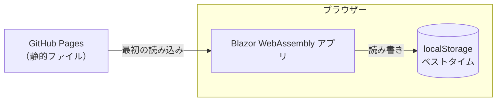
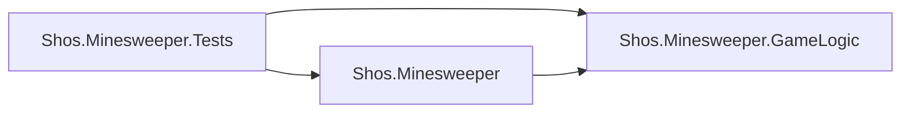
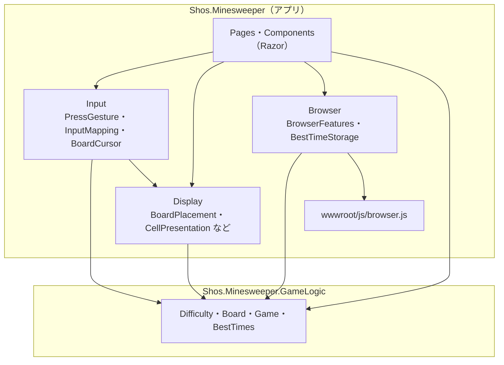
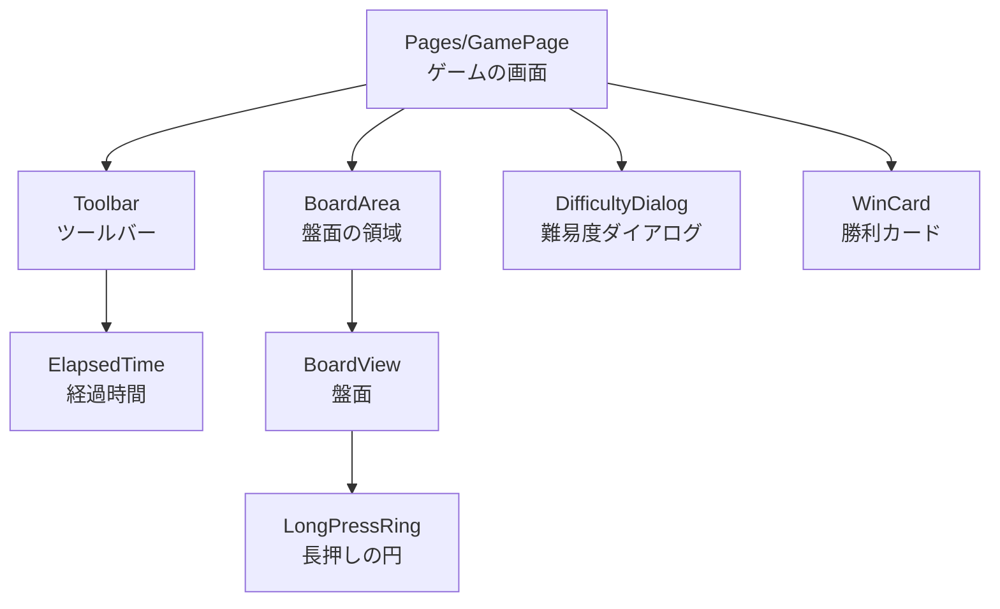
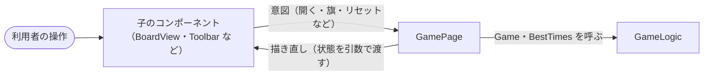
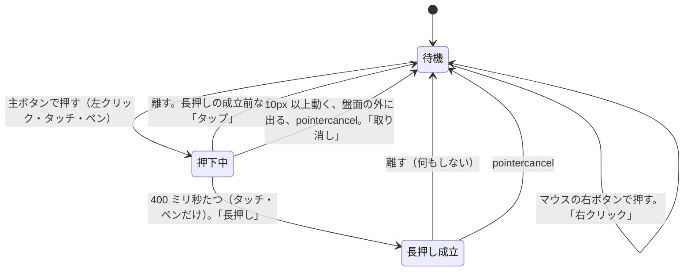
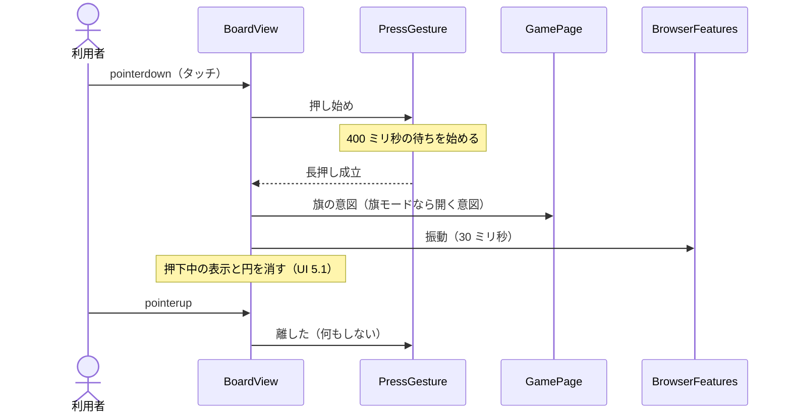
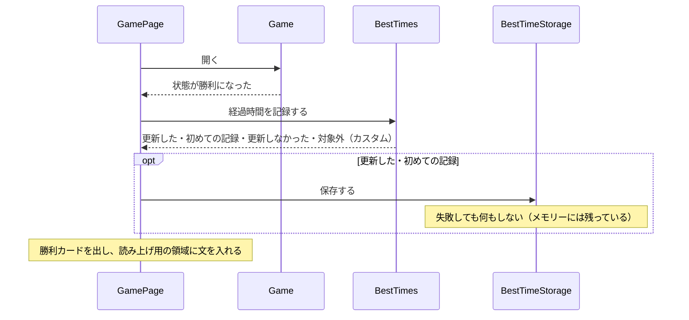
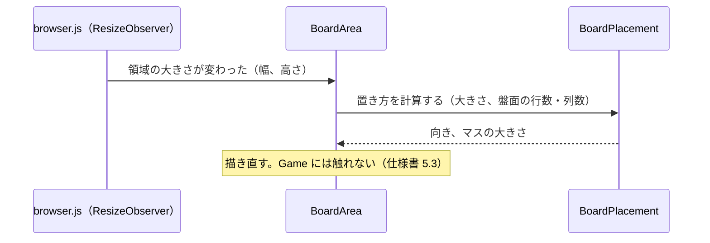

# マインスイーパー アーキテクチャー設計書

| 項目 | 内容 |
|------|------|
| 工程 | 7. アーキテクチャー設計書作成 |
| 作成日 | 2026-09-25 |
| 状態 | レビュー指摘を反映済み（docs/reviews/04-architecture-review.md）。クラス設計で改めた点を反映済み（docs/reviews/05-class-design-review.md） |
| 入力 | docs/02-spec.md（仕様書）、docs/03-ui-design.md（UI デザイン）、CLAUDE.md（開発環境・設計方針） |

## 1. 概要

仕様書と UI デザインで決めたものを、どの単位に分けて作り、単位どうしをどうつなぐかを定める。この文書で決めるのは、プロジェクトの構成、層と依存の向き、主な型とコンポーネントの責務、状態の持ち主、ブラウザーとの境界、テストの方針である。各型の公開メンバーや細かい型（列挙型など）は、クラス設計書（docs/05-class-design.md）で決める。

### 1.1 設計の方針

| 方針 | 内容 |
|------|------|
| 関心事で分ける | 先に関心事を列挙し（3 章）、関心事ごとに置き場所を決める。クラスの一覧はその結果である |
| ゲームのルールは UI を知らない | ルールは別のクラスライブラリに置き、Blazor にもブラウザーにも依存させない（CLAUDE.md の設計方針）。依存の向きはコンパイラーに守らせる |
| 表示と入力の判断も C# のクラスにする | 盤面の向きとマスの大きさ、タップと長押しの判定、操作の割り当ては、画面の部品から切り離した C# のクラスにして、xUnit で確かめられるようにする |
| JavaScript は最小限 | Blazor と CSS でできることは、JavaScript を使わない。JavaScript が要るものは 1 つのファイルにまとめ、C# の窓口も 1 つにする（9 章） |
| 差し替え口はテストが求めるものだけ | 時刻、乱数（地雷の配置）は、テストで固定する必要があるので差し替えられるようにする。それ以外の抽象（インターフェイスなど）は作らない（15 章） |

## 2. システムの構成

サーバー側の処理はない。GitHub Pages が静的ファイルを配り、あとはすべてブラウザーの中で動く（仕様書 6.4、7）。



- 通信は、最初にアプリを読み込むときだけである。テンプレートが登録している `HttpClient`（`Program.cs`）は使わないので、実装のときに削除する。

## 3. 関心事と置き場所

仕様書と UI デザインから、関心事を次のように列挙した。「置き場所」の列は 4 章の構成を指す。

| # | 関心事 | 内容 | 仕様書・UI デザイン | 置き場所 |
|---|--------|------|---------------------|----------|
| 1 | 難易度 | 初級〜上級の値、カスタムの範囲と検証 | 仕様 3.1 | GameLogic: `Difficulty` |
| 2 | 盤面 | マス、地雷、周囲の地雷の数、開く・連鎖・旗・コード | 仕様 3.3〜3.5 | GameLogic: `Board` |
| 3 | 1 回のゲームの進行 | 状態（未開始・プレイ中・勝利・敗北）、最初に開いたときの地雷の配置、勝敗の判定、残り地雷数、経過時間 | 仕様 3.2、3.6、3.7 | GameLogic: `Game` |
| 4 | ベストタイムの規則 | 初級〜上級だけ、短いときだけ更新、更新の結果 | 仕様 3.8 | GameLogic: `BestTimes` |
| 5 | ベストタイムの保存 | localStorage への読み書き、保存できないときはメモリーだけ | 仕様 3.8、6.4 | アプリ: `BestTimeStorage` |
| 6 | 押す操作の判定 | タップ・長押し・取り消しの判定（400 ミリ秒、10px）、マウスとタッチの違い | 仕様 4.1、4.4 | アプリ: `PressGesture` |
| 7 | 操作の割り当て | 入力（タップ・長押し・右クリック）と旗モードとマスの状態から、「開く」「旗」「何もしない」を決める | 仕様 4.1、4.3、UI 5.2 | アプリ: `InputMapping` |
| 8 | キーボードの選択中のマス | 矢印キーでの移動、盤面に入ったときの位置 | 仕様 4.5 | アプリ: `BoardCursor` |
| 9 | 盤面の置き方 | 盤面の向き（入れ替えるか）、マスの大きさ、表示の座標と盤面の座標の変換 | 仕様 5.2、UI 3.2 | アプリ: `BoardPlacement`（スクロールは CSS） |
| 10 | ブラウザーの機能 | 領域の大きさの監視、振動、localStorage、キーでのスクロールの抑止 | 仕様 4.4、4.5、5.3 | アプリ: `BrowserFeatures` と `browser.js` |
| 11 | 画面の描画と画面の部品 | ツールバー、盤面、ダイアログ、勝利カード、読み上げ | UI 2 章、4〜6 章 | アプリ: Razor コンポーネント |
| 12 | 見た目 | 配色、レイアウトの切り替え（上バー・横バー）、アニメーション | UI 3、4、5 章 | アプリ: CSS |

関心事 6〜9 は画面に関わるが、計算と判定だけで、画面の部品を必要としない。そこで Razor コンポーネントから切り離し、ふつうの C# のクラスにする。コンポーネントは、これらのクラスの結果を描くことと、イベントを渡すことだけを受け持つ。

## 4. ソリューションとプロジェクトの構成

```text
Shos.Minesweeper.slnx
├─ Shos.Minesweeper.GameLogic/        クラスライブラリ（net10.0）。ゲームのルール
│   ├─ Difficulty.cs
│   ├─ Board.cs
│   ├─ Game.cs
│   └─ BestTimes.cs                   ほかの小さな型はクラス設計で決める
├─ Shos.Minesweeper/                  Blazor WebAssembly アプリ（既存）
│   ├─ Pages/GamePage.razor           唯一のページ（ルートは "/"）。ゲームの画面。テンプレートの Home.razor の名前を変える
│   ├─ Components/                    画面の部品（6.3）
│   ├─ Input/                         PressGesture, InputMapping, BoardCursor
│   ├─ Display/                       BoardPlacement, CellPresentation, DifficultyNames, Announcements
│   ├─ Browser/                       BrowserFeatures, BestTimeStorage
│   ├─ Layout/MainLayout.razor        既存。@Body だけを描く
│   └─ wwwroot/
│       ├─ css/app.css                配色のトークン、ページ全体のスタイル
│       ├─ js/browser.js              JavaScript の機能（9 章）
│       └─ index.html
└─ Shos.Minesweeper.Tests/            テストプロジェクト（xUnit ＋ bUnit）
    ├─ GameLogic/                     GameLogic のテスト
    ├─ Input/、Display/、Browser/     アプリの C# クラスのテスト
    └─ Components/                   コンポーネントのテスト（bUnit）
```

プロジェクトの参照は次のとおりである。



**ゲームのルールを別のプロジェクトにする理由**

- 「ルールは UI に依存しない」という方針を、コンパイラーで守れる。GameLogic のプロジェクトは Blazor のパッケージを参照しないので、UI の型を使うとビルドが通らない。
- 同じプロジェクトのフォルダーで分ける案も考えた。ファイルは 1 つ少なくて済むが、依存の向きを人が見張り続けることになる。プロジェクトを 1 つ増やす手間は一度きりなので、プロジェクトを分ける。

**テストプロジェクトを 1 つにする理由**

- `dotnet test` を 1 回実行すれば、すべてのテストが走る。
- GameLogic のテストと、アプリのテストで、テストプロジェクトを分ける案も考えた。GameLogic のテストが bUnit を参照しなくて済むが、分けても得るものがほとんどない。テストはフォルダーで分ける。

**名前**

- `GameLogic` は、CLAUDE.md の「ゲームロジック」をそのまま名前にした。要求の語彙をコードでも使うためである。
- アプリのフォルダー名に `Layout` は使わない。既存の `Layout/`（Blazor のレイアウト）と意味がぶつかるからである。盤面の置き方のクラスは `Display/` に置く。

## 5. 層と依存の向き



依存の規則は次のとおりである。

| 単位 | 依存してよいもの | 依存しないもの |
|------|------------------|----------------|
| GameLogic | .NET の基本ライブラリだけ（`TimeProvider`、`Random` など） | Blazor、JavaScript、アプリのすべて |
| Input | GameLogic（マスの状態を見るため）、`TimeProvider`、Display（`BoardCursor` が `BoardPlacement` を使うため） | Blazor、JavaScript |
| Display | GameLogic の値の型（盤面の座標、マスの見せ方、難易度など。表示の判断の入力として使う） | Blazor、JavaScript |
| Browser | GameLogic（`BestTimes` を保存するため）、`IJSRuntime` | コンポーネント |
| Pages・Components | 上のすべて | — |

- 矢印は一方向で、逆向きの依存（GameLogic がアプリを知る、Input がコンポーネントを知る）はない。
- GameLogic は、盤面の縦と横を入れ替えて表示することを知らない。入れ替えは表示だけの話で、ルールとは独立しているからである。座標の変換は `BoardPlacement` が受け持つ。

## 6. 各単位の責務

型の名前は、要求の語彙（仕様書の用語）に合わせた。公開メンバーはクラス設計で決める。

### 6.1 GameLogic

| 型 | ひとことで言うと | 持たないもの |
|----|------------------|--------------|
| `Difficulty` | 難易度（種類、幅、高さ、地雷数）。初級〜上級の値と、カスタムの値の検証を持つ | 画面の文言（「5〜30 の整数を…」は UI が組み立てる。範囲の値は `Difficulty` から得る） |
| `Board` | 盤面。マスの状態、地雷、周囲の地雷の数を持ち、開く（0 の連鎖を含む）、旗、コードを行う | 勝敗の判断、時刻、地雷を置く場所の選び方 |
| `Game` | 1 回のゲーム。状態の遷移、最初に開いたときの地雷の配置、勝敗、残り地雷数、経過時間を受け持つ | 難易度の選択、ベストタイム、旗モード |
| `BestTimes` | 初級〜上級のベストタイムと、その更新の規則。更新したか、初めての記録か、を返す | 保存の方法 |

- 盤面の位置を表す小さな型（行と列）や、マスの状態、ゲームの状態を表す型は、クラス設計で決める。
- `Game` は、地雷を置く場所の選び方を外から受け取る（テストのための差し替え口。12 章）。本番では乱数で選ぶ。
- `Game` は、時刻を `TimeProvider` から得る。経過時間は「開始した時刻との差」で計算するので（仕様書 3.7）、タブが裏にあっても正しい。

### 6.2 アプリの C# クラス

| 型 | フォルダー | ひとことで言うと |
|----|------------|------------------|
| `PressGesture` | Input | 1 回の「押して離す」を、タップ・長押し・取り消しのどれかに判定する |
| `InputMapping` | Input | 入力の種類と旗モードとマスの状態から、行う操作（開く・旗・何もしない）を決める。長押しの円を出すかどうかも、ここで決まる（UI 5.2） |
| `BoardCursor` | Input | キーボードで選択しているマスの位置。位置は盤面の座標で持つ。矢印キーの方向は、`BoardPlacement` で盤面の方向に変えてから動かす |
| `BoardPlacement` | Display | 盤面の領域の大きさと盤面の行数・列数から、向きとマスの大きさを決める。表示の座標と盤面の座標を変換する。スクロールが要るかどうかは決めない（盤面の領域の CSS を `overflow: auto` にして任せる） |
| `CellPresentation` | Display | マスの見た目（CSS のクラス、アイコン）と読み上げの名前を決める |
| `DifficultyNames`、`Announcements` | Display | 難易度の表示名と、読み上げ用の領域で知らせる文 |
| `BrowserFeatures` | Browser | `browser.js` の関数を呼ぶ窓口。JavaScript を呼ぶのはこのクラスだけである |
| `BestTimeStorage` | Browser | `BestTimes` を localStorage に読み書きする。保存できないときは何もしない（メモリーの `BestTimes` だけが残る） |

- `PressGesture` と `InputMapping` を分けたのは、変更理由が違うからである。長押しの判定時間や移動の許容量を変えるときは `PressGesture` だけを、旗モードでの割り当てを変えるときは `InputMapping` だけを直す。
- `PressGesture` の長押しの待ち時間は、`TimeProvider` で計る。テストでは時刻を進めて確かめる。
- `BoardCursor` が盤面の座標で位置を持つのは、画面の向きが変わって盤面の縦と横が入れ替わっても、同じマスを選んだままにするためである。表示の座標で持つと、入れ替わったときに別のマスを指してしまう。
- `CellPresentation`、`DifficultyNames`、`Announcements` はクラス設計で加えた。公開メンバーと、ほかの小さな型はクラス設計書（docs/05-class-design.md）にある。

### 6.3 コンポーネント



| コンポーネント | 責務 |
|----------------|------|
| `GamePage` | 画面全体の状態の持ち主（7.1）。子からの操作の意図を受けて `Game` を呼び、勝ったらベストタイムを更新して保存し、勝利カードと読み上げを出す |
| `Toolbar` | 難易度ボタン、残り地雷数、リセット ボタン（顔）、経過時間、旗モード ボタンを描き、押されたことを `GamePage` に伝える |
| `ElapsedTime` | 経過時間を表示する。250 ミリ秒ごとに経過時間を確かめ、表示する秒が変わったときだけ自分を描き直す（7.3） |
| `BoardArea` | 盤面の領域。大きさの変化を受け取り、`BoardPlacement` を計算し直して、子の内容（`BoardView`）に渡す。盤面が収まらないときは、この領域がスクロールする |
| `BoardView` | マスを描き、ポインターとキーボードのイベントを受けて、`PressGesture`・`InputMapping`・`BoardCursor` を使い、「この位置を開く」「この位置の旗」という意図を `GamePage` に伝える。押下中の表示もここで持つ |
| `LongPressRing` | 長押しの進行の円を、押したマスの位置に重ねて描く。押下を追っている `BoardView` の子にする |
| `DifficultyDialog` | 難易度の選択とカスタムの入力。入力の検証は `Difficulty` に任せ、誤りの文言を表示する |
| `WinCard` | 勝利カード。タイムとベストタイムの更新の結果を表示する |

アイコン（SVG）などの小さな部品は、クラス設計で決める。

### 6.4 組み立て（`Program.cs`）

依存性の注入（DI）に登録するのは、次の 3 つだけである。

| 登録するもの | 有効期間 | 使う側 |
|--------------|----------|--------|
| `TimeProvider`（本番は `TimeProvider.System`） | シングルトン | `GamePage`（`Game` を作るときに渡す）、`BoardView`（`PressGesture` に渡す）、`ElapsedTime`（経過時間を確かめるタイマー） |
| `BrowserFeatures` | スコープ | `BoardArea`、`BoardView`、`BestTimeStorage` |
| `BestTimeStorage` | スコープ | `GamePage` |

- Blazor WebAssembly では、スコープの有効期間はアプリの実行中ずっと続く（シングルトンと同じになる）。
- `Game`、`BestTimes`、`PressGesture`、`BoardCursor`、`BoardPlacement` は、DI に登録しない。状態を持つ持ち主のコンポーネント（7.1）が `new` で作る。持ち主が 1 つに決まっており、差し替える必要があるのは中で使う `TimeProvider` だけだからである。
- 地雷を置く場所の本番の選び方（乱数）は、GameLogic が既定として持つ。`GamePage` は既定のまま使い、テストだけが別の選び方を渡す。
- テンプレートが登録している `HttpClient` は削除する（2 章）。
- bUnit のテストでは、`TimeProvider` の代わりに `FakeTimeProvider` を登録し、JavaScript の呼び出しは bUnit の偽物で受ける。

## 7. 状態と更新の流れ

### 7.1 状態の持ち主

| 状態 | 持ち主 | 理由 |
|------|--------|------|
| 現在のゲーム（`Game`） | `GamePage` | ツールバーと盤面の両方が表示に使う |
| 現在の難易度 | `GamePage` | リセットで同じ難易度を使い、ダイアログにも渡す |
| 旗モード | `GamePage` | ツールバーのボタンと盤面の両方が使う。リセットしても保つ（仕様書 4.3） |
| ベストタイム（`BestTimes`） | `GamePage` | ダイアログと勝利カードが表示に使う |
| 難易度ダイアログ・勝利カードの表示の有無 | `GamePage` | 難易度ダイアログを表示している間だけ、ほかの部分を `inert` にする（9.2）。勝利カードはモードレスなので（UI 2.4）、ほかの部分を `inert` にしない |
| 押している間の状態（`PressGesture`）、押下中のマス | `BoardView` | 盤面の中だけで使う |
| 選択中のマス（`BoardCursor`） | `BoardView` | 盤面の中だけで使う |
| 盤面の置き方（`BoardPlacement`） | `BoardArea` | 領域の大きさを知るのは `BoardArea` だけである |

- ゲームの状態を持つのは `Game` だけにする。コンポーネントは `Game` の状態を読んで描くだけで、コピーを持たない。
- 旗モードは保存しない。ページを開き直すとオフに戻る（保存するのはベストタイムだけ。仕様書 6.4）。

### 7.2 一方向の流れ

状態は親から子へ引数で渡し、操作は子から親へイベント（`EventCallback`）で伝える。



- `Game` から画面へ知らせる仕組み（イベントなど）は作らない。Blazor は、イベントを処理した後にコンポーネントを描き直すので、描き直しのときに `Game` の状態を読めば足りる。

### 7.3 描き直しの範囲

仕様書 6.2 の性能の目標（上級で 100 ミリ秒以内）のために、次の 2 つを初めから守る。

- **経過時間は、`ElapsedTime` だけを描き直す。** 1 秒ごとに `GamePage` を描き直すと、480 マスの盤面も毎秒描き直すことになるからである。
- **`BoardView` は、状態が変わらないポインターのイベントでは描き直さない。** `pointermove` は多いときに 1 秒に 100 回以上起きるが、ほとんどは 10px 未満の移動で、状態を変えない。

これ以外の最適化（マスを 1 つずつのコンポーネントにして変わったマスだけを描くなど）は、工程 12 で実機で計ってから、必要なら行う。


### 7.4 後片付け

コンポーネントが破棄されるときに、次のものを止める（`IDisposable` または `IAsyncDisposable`）。止めないと、破棄された後もタイマーや監視が動き続け、.NET のオブジェクトが解放されないからである。

| コンポーネント | 止めるもの |
|----------------|------------|
| `BoardArea` | `ResizeObserver` の監視と、JavaScript に渡した .NET の参照（`DotNetObjectReference`） |
| `BoardView` | 長押しの待ち |
| `ElapsedTime` | 経過時間を確かめるタイマー |

画面は 1 つだけなので、実際に破棄されるのはページを閉じるときくらいだが、テスト（bUnit）ではテストのたびに作って破棄するので、ここで決めておく。

## 8. 主な処理の流れ

### 8.1 押す操作の判定

`PressGesture` の状態の遷移を次に示す。



- 押している間に別の指で触れた場合、その指は無視する。最初に押したポインター（`pointerId`）だけを追う。
- 右クリックは、ボタンを押したとき（`pointerdown`）に判定する。
- ポインターが盤面の外に出たら（`pointerleave`）、取り消す。マウスで押したまま盤面の外に出てボタンを離すと、`pointerup` が盤面に届かず、押下中のまま残ってしまうからである。
- マウスの左ボタンには長押しがない（仕様書 4.1）。押し続けても「押下中」のままで、離せばタップになる。

### 8.2 タップでマスを開く


- `BoardView` は、表示の座標を `BoardPlacement` で盤面の座標に変えてから `GamePage` に伝える。`GamePage` と `Game` は、盤面の座標だけを扱う。

### 8.3 長押しで旗を立てる



### 8.4 勝ったとき



### 8.5 画面の大きさや向きが変わったとき



- 領域の大きさは、`BoardArea` の要素そのものを `ResizeObserver` で監視して得る。上バーと横バーの切り替えは CSS が行い（9.2）、C# は切り替えの結果として決まった領域の大きさだけを使う。こうすると、レイアウトの規則（UI 3.1）が CSS と C# に二重に書かれない。
- UI デザイン 3.2 の「W」「H」は、この領域の大きさから盤面の枠（3px × 2）を引いたものになる。

## 9. ブラウザーとの境界

### 9.1 JavaScript を使うもの

CLAUDE.md のとおり、JavaScript は必要なときに限る。使うのは次の 4 つで、すべて `wwwroot/js/browser.js`（ES モジュール）に置き、C# からは `BrowserFeatures` だけが呼ぶ。

| 機能 | JavaScript が要る理由 | 失敗したとき |
|------|------------------------|--------------|
| 盤面の領域の大きさの監視（`ResizeObserver`） | 要素の大きさの変化を Blazor だけでは受け取れない | — |
| 振動（`navigator.vibrate`） | Blazor に振動の機能がない | 何もしない（iOS の Safari など、対応していない端末では呼ばない。仕様書 4.4） |
| localStorage の読み書き | Blazor に localStorage の機能がない | 読めないときは「記録なし」、書けないときは何もしない（仕様書 3.8） |
| 盤面での矢印キーと Space の既定の動作の抑止 | Blazor の `:preventDefault` は、キーごとに切り替えられない。盤面のキーをすべて止めると Tab キーで盤面から出られなくなる | — |

- localStorage と振動の例外は、`browser.js` の中で受け止め、C# には結果（値、なし）だけを返す。C# 側で JavaScript の例外を扱う箇所を作らないためである。
- `browser.js` は、`IJSRuntime` の `import` で読み込む。GitHub Pages のサブパス（`/Shos.Minesweeper/`）でも読み込めることを、実装のときに確かめる（16 章）。

### 9.2 JavaScript を使わずに済ませるもの

| 機能 | 方法 |
|------|------|
| 右クリックのメニューを出さない | `@oncontextmenu:preventDefault` |
| 長押しの文字選択・コールアウト、ダブルタップのズームを出さない | CSS（`user-select: none`、`-webkit-touch-callout: none`、`touch-action: manipulation`） |
| フォーカスを動かす | Blazor の `ElementReference.FocusAsync()` |
| ダイアログの外を操作できなくし、フォーカスを閉じ込める | ダイアログの外の要素に `inert` を付ける。`inert` の要素にはフォーカスが入らず、スクリーンリーダーからも隠れるので、フォーカスを閉じ込める処理を書かずに済む |
| 上バーと横バーの切り替え | CSS のメディアクエリー（UI 3.1 の条件） |
| マスの大きさの反映 | `BoardView` が CSS の変数（`--cell-size`）を設定し、CSS のグリッドで並べる |
| 長押しの円の位置 | `LongPressRing` は、画面に固定した層（`position: fixed`）に描く。盤面の領域がスクロールするときも、領域の端で円が切れないようにするためである。円の中心は、押したときのポインターのイベントの値から求める。`ClientX − OffsetX`（`Y` も同じ）がマスの左上の画面上の位置になるので、それにマスの大きさの半分を足す。イベントの対象が必ずマスの要素になるように、マスの中の数字やアイコンには `pointer-events: none` を指定する |
| 長押しの円が満ちるアニメーション、旗やカードのアニメーション、動きを減らす設定 | CSS のアニメーションと `prefers-reduced-motion` |
| ダークモード | CSS の `prefers-color-scheme` |

HTML の `<dialog>` 要素の `showModal()` は、フォーカスの閉じ込めを任せられるが、呼ぶのに JavaScript が要る。`inert` なら Blazor の属性だけで済むので、こちらを使う。

### 9.3 CSS の構成

| ファイル | 内容 |
|----------|------|
| `wwwroot/css/app.css` | 配色のトークン（UI 4.1。CSS のカスタム プロパティ）、ライトとダークの切り替え、ページ全体のレイアウト（上バーと横バー）、読み込み中とエラーの表示 |
| 各コンポーネントの `*.razor.css` | そのコンポーネントの見た目（CSS の分離） |

CSS の分離を使うので、`index.html` でコメントアウトされている `Shos.Minesweeper.styles.css` の `<link>` を有効にする（CLAUDE.md の「構成とポイント」）。

## 10. 永続化

| 項目 | 内容 |
|------|------|
| 保存するもの | 初級・中級・上級のベストタイム（整数の秒）だけ（仕様書 6.4） |
| 保存先 | localStorage の 1 つのキー（`Shos.Minesweeper.BestTimes`） |
| 形式 | JSON。難易度ごとの秒数。記録のない難易度は含めない |
| 読むとき | ページを開いたときに 1 回だけ読み、`BestTimes` を作る。値が読めない、形式が違う、範囲（0〜999）の外、のときは、その値を「記録なし」として扱う |
| 書くとき | ベストタイムを更新したときに、全体を書く |
| 保存できないとき | 何もしない。`GamePage` が持つ `BestTimes` はメモリーにあるので、ページを開いている間は記録が残る（仕様書 3.8） |

形式の版（バージョン）は持たない。形式を変える必要が出たときに、読めない値を「記録なし」として扱う規則で古い形式を捨てられるからである。

## 11. エラーの扱い

| 場所 | 扱い |
|------|------|
| GameLogic の公開メソッド | 盤面の外の位置など、前提を満たさない引数には、ガード節で例外（`ArgumentOutOfRangeException` など）を投げる。正しく作られた UI からは起きないので、起きたらプログラムの誤りである |
| カスタムの入力 | 例外ではなく、`Difficulty` の検証の結果として返す。利用者の入力の誤りは、プログラムの誤りではないからである |
| localStorage、振動 | 失敗しても、ゲームを続ける（9.1） |
| それ以外の予期しない例外 | テンプレートのエラーの表示（`#blazor-error-ui`。UI 2.5 で文言を日本語にする）に任せる |

## 12. テストの方針

| 対象 | テストの種類 | 確かめ方 |
|------|--------------|----------|
| GameLogic | xUnit | 地雷の位置を直接与えて盤面を作り、開く・連鎖・コード・勝敗を確かめる。時刻は `TimeProvider` の偽物で進める |
| Input、Display | xUnit | 入力と期待する判定の表で確かめる。`PressGesture` の長押しは、時刻を進めて確かめる |
| `BestTimeStorage` | bUnit の JavaScript interop の偽物 | 読めない値、範囲の外の値、書けない場合を確かめる |
| コンポーネント | bUnit | 描いた結果（マスの見た目、ARIA の名前）、クリックとキーボードの操作、ダイアログの開閉とフォーカスを確かめる |

**テストのための差し替え口**

| 差し替えるもの | 本番 | テスト | 理由 |
|----------------|------|--------|------|
| 時刻 | `TimeProvider.System` | 時刻を自由に進められる偽物 | 経過時間と長押しを、待たずに確かめるため |
| 地雷を置く場所の選び方 | 乱数（`Random.Shared`）で選ぶ | 位置を直接与える | どの盤面になるかを、テストで決めるため。種（シード）を固定した乱数で盤面を再現する方法は、配置の方法を変えるとテストが壊れるので使わない |

- 時刻の偽物には、Microsoft の `Microsoft.Extensions.TimeProvider.Testing` パッケージの `FakeTimeProvider` を使う（17 章）。
- `dotnet test` と、1 件だけテストを実行する方法は、テストプロジェクトを作ったときに CLAUDE.md の「コマンド」に書く。

## 13. 公開

- `dotnet publish -c Release` で出力した `wwwroot` を、GitHub Pages に置く（仕様書 7）。
- サブパス（`/Shos.Minesweeper/`）に合わせるため、公開するときに `index.html` の `<base href>` を書き換える。ソースの `<base href="/" />` は変えない。ローカルで `dotnet run` したときに動くようにするためである。
- GitHub Pages が `_framework` フォルダーを配るように、`.nojekyll` を置く（調査書 8.5）。
- 具体的な手順（手作業か GitHub Actions か）は、リリース準備（工程 14）で決める。

## 14. 仕様書・UI デザインを補う決定

| # | 決定 | 理由 |
|---|------|------|
| 1 | 10px 以上動いたら取り消す規則を、マウスにも当てはめる | 仕様書 4.4 は「指が」と書いているが、マウスで押したまま別のマスに動かしたときの扱いが決まっていない。同じ規則にすれば、`PressGesture` の判定が 1 つで済む |
| 2 | マウスの右クリックは、ボタンを押したとき（`pointerdown`）に旗を立てる | `contextmenu` のイベントは、タッチの長押しでも起きるので、右クリックの判定に使えない |
| 3 | 押している間に別の指で触れても、無視する | 仕様書と UI デザインに決まりがない。最初の指だけを追えば、判定が単純になる |

## 15. 作らないもの

| 作らないもの | 理由 |
|--------------|------|
| `Game`、`Board` などのインターフェイス | 実装は 1 つだけで、テストでも本物を使う。インターフェイスを作ると、読む対象が増えるだけである |
| ベストタイムの保存のインターフェイス | `BestTimes`（規則）と `BestTimeStorage`（保存）を分けたので、規則のテストに保存の偽物は要らない。保存のテストは、JavaScript interop の偽物で行う |
| 状態管理のライブラリ（Fluxor など）、イベントの仕組み | 画面は 1 つで、状態の持ち主は `GamePage` にまとまっている。引数とイベントで足りる |
| マスごとのコンポーネント | まず `BoardView` の中でマスを描く。遅いと分かったときに分ける（7.3） |
| 多言語対応の仕組み | 画面の言語は日本語だけである（仕様書 5.5） |
| 旗モードや設定の保存 | 保存するのはベストタイムだけである（仕様書 6.4） |
| `<dialog>` のための JavaScript | `inert` で足りる（9.2） |

## 16. リスクと後の工程で確かめること

| リスク・確認事項 | 確かめる工程 |
|------------------|--------------|
| iOS の Safari で、長押しのときに文字選択やコールアウトが出ないか。Android の Chrome で、長押しのときに `contextmenu` や `pointercancel` が起きて長押しが途切れないか | 工程 11（実装の区切りで実機を使う）、工程 12 |
| 上級の盤面での操作から描き直しまでが、スマートフォンで 100 ミリ秒以内か（仕様書 6.2） | 工程 12 |
| `browser.js` を、サブパス（`/Shos.Minesweeper/`）に置いたときにも読み込めるか。.NET 10 の静的ファイルのフィンガープリントと `import` の組み合わせで問題がないか | 工程 11（最初に JavaScript を使う区切り）、工程 14 |
| 初回の読み込みの大きさ。必要なら、トリミングの設定やカルチャー情報を含めない設定（`InvariantGlobalization`）を検討する | 工程 14 |

## 17. ユーザーに確認した点

| 点 | 決定 | 見送った案 |
|----|------|------------|
| テストで時刻を進めるための偽物 | Microsoft の `Microsoft.Extensions.TimeProvider.Testing` パッケージ（`FakeTimeProvider`）をテストプロジェクトに入れる。.NET の `TimeProvider` と同じチームが作っており、タイマーを含めて時刻を進められる | テストプロジェクトに偽物を自作する。時刻を返すだけなら短いが、長押しの待ち（タイマー）まで偽装すると、自作のコードが増える |

設計書の提出時にこの点を確認事項として挙げ、ユーザーは個別の回答をせずに工程を承認した。仕様書レビューの前例（docs/reviews/02-spec-review.md）に従い、推した案どおりに確定した（docs/reviews/04-architecture-review.md）。
