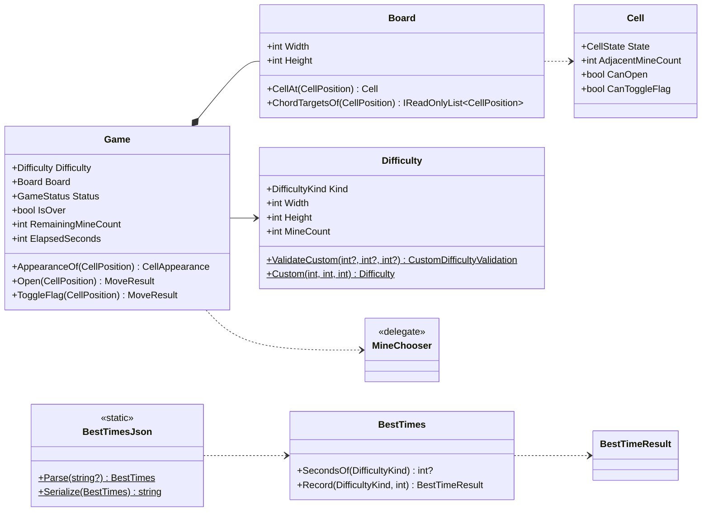
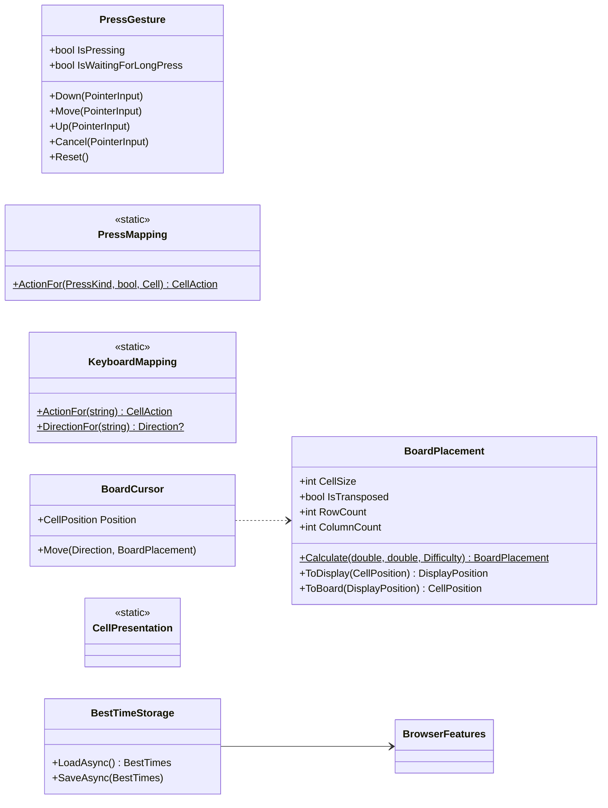
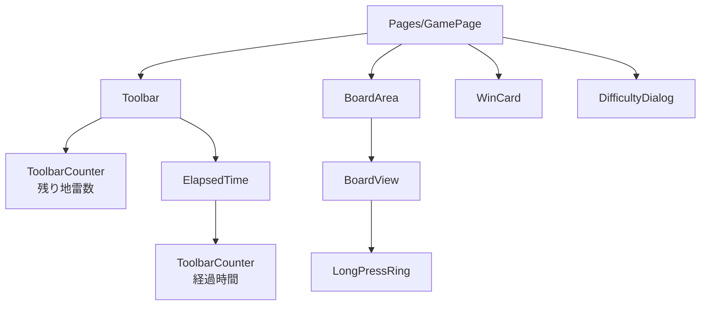
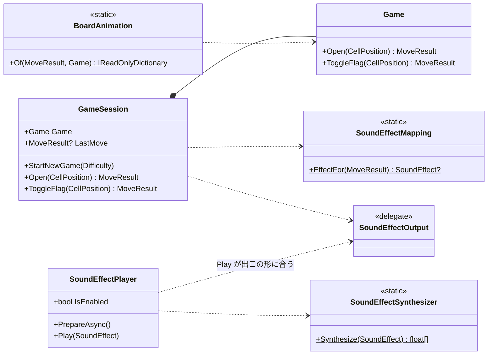

# マインスイーパー クラス設計書

| 項目 | 内容 |
|------|------|
| 工程 | 9. クラス設計書作成 |
| 作成日 | 2026-09-25 |
| 状態 | レビュー指摘を反映済み（docs/reviews/05-class-design-review.md）。工程 12 で、WPF 版・コンソール版と共有する部品を Presentation に移した（docs/reviews/code-review.md の工程 12 の R5）。この変更を含めてレビューをやり直し、指摘を反映した（docs/reviews/05-class-design-review.md の「再レビュー」）。リファクタリングのやり直し（docs/reviews/code-review.md の RR1〜RR4）で、`BestTimesJson` を GameLogic に移し、`InputMapping` の名前を `PressMapping` に改めた。1.1.0 の改訂（操作の結果、効果音、`GameSession`、演出、置き方）を 12 章に書いた（2026-09-26）。1.1.0 のレビューを待っている |
| 入力 | docs/04-architecture.md（アーキテクチャー設計書）、docs/02-spec.md（仕様書）、docs/03-ui-design.md（UI デザイン）。1.1.0 では、アーキテクチャー設計書の 1.1.0 の改訂と、UI デザイン 10 章 |

## 1. 概要

アーキテクチャー設計書で決めた単位ごとに、型の公開メンバー、小さな型（列挙型・値の型）、コンポーネントの引数とイベントを定める。あわせて、テストの組み立て方と、実装（工程 11）の区切りの案を示す。

各メンバーの実装（アルゴリズム）は、判断が要るものだけを書く。メンバーの細かい実装は工程 11 でテストファーストで決める。

**改訂（1.1.0）**: アーキテクチャー設計書の 1.1.0 の改訂を、型とメンバーに落とした。加える型と変えるメンバーは 12 章にまとめ、1〜11 章の該当する箇所には「（1.1.0。12.x）」と書いて 12 章を指した。

### 1.1 設計の方針

| 方針 | 内容 |
|------|------|
| 使う側から決める | 呼び出す側のコードを先に書き、そこで自然に読める名前と引数を公開メンバーにした。内部のデータの持ち方は名前に出さない |
| 盤面を変えられるのは `Game` だけ | `Board` の盤面を変える操作は `internal` にする。UI は `Game` を通してしか盤面を変えられず、「勝敗が決まったら操作を受け付けない」「最初に開いたときに地雷を置く」を飛ばせない。この決まりをコンパイラーに守らせる |
| 値の組に名前を付ける | 行と列、下限と上限のように、いつも組で現れる値には型を作る。盤面の座標（`CellPosition`）と表示の座標（`DisplayPosition`）は別の型にして、取り違えるとコンパイルが通らないようにする |
| 規則は情報を持つ者に置く | 「このマスに『開く』が効くか」はマス（`Cell`）が、「このマスをどう見せるか」はゲームの状態を知る `Game` が答える |
| 継承はしない | クラスは `sealed` にする。インターフェイスは作らない（アーキテクチャー設計書 15 章） |
| 共有できる部品は Presentation か GameLogic に置く | 次に作る WPF 版とコンソール版でも形が変わらない表示と入力の部品（表示の文言、押し方からの操作の割り当て）は、UI の技術に依存しない `Shos.Minesweeper.Presentation` に置く。ベストタイムの保存の形式（`BestTimesJson`）は、表示でも入力でもないので、GameLogic の `BestTimes` のそばに置く（アーキテクチャー設計書 4 章） |

### 1.2 用語と名前の対応

仕様書の用語を、そのままコードの語彙にする。

| 用語 | 名前 |
|------|------|
| マス、盤面 | `Cell`、`Board` |
| 盤面の上の位置（行・列） | `CellPosition`（`Row`、`Column`） |
| 表示している向きでの位置 | `DisplayPosition` |
| 難易度（初級・中級・上級・カスタム） | `Difficulty`、`DifficultyKind`（`Beginner`・`Intermediate`・`Expert`・`Custom`） |
| 幅、高さ、地雷数 | `Width`、`Height`、`MineCount` |
| 未開放、旗、開放済み | `CellState`（`Closed`・`Flagged`・`Opened`） |
| 数字（周囲 8 マスの地雷の数） | `AdjacentMineCount` |
| 開く、旗を立てる・外す、コード | `Open`、`ToggleFlag`、`ChordTargetsOf`（コードで開く範囲） |
| 未開始、プレイ中、勝利、敗北 | `GameStatus`（`NotStarted`・`Playing`・`Won`・`Lost`） |
| 残り地雷数、経過時間 | `RemainingMineCount`、`ElapsedSeconds` |
| 地雷、踏んだ地雷、誤った旗 | `CellAppearance`（`Mine`・`ExplodedMine`・`WrongFlag`） |
| ベストタイム | `BestTimes` |
| タップ、長押し、右クリック | `PressKind`（`Tap`・`LongPress`・`RightClick`） |
| 旗モード | `IsFlagMode` |
| 盤面の置き方、縦と横の入れ替え、マスの大きさ | `BoardPlacement`、`IsTransposed`、`CellSize` |
| 選択中のマス | `BoardCursor.Position` |
| 1 回の盤面の操作（手）とその結果、起きたこと（1.1.0） | `MoveResult`、`MoveOutcome`（`NoChange`・`Opened`・`FlagPlaced`・`FlagRemoved`） |
| 効果音（開く、連鎖、旗を立てる・外す、負け、勝ち。1.1.0） | `SoundEffect`（`Open`・`Chain`・`FlagPlaced`・`FlagRemoved`・`Lost`・`Won`） |
| 音の出口、1 回のゲームの進め方、直前の操作（1.1.0） | `SoundEffectOutput`、`GameSession`、`GameSession.LastMove` |
| 演出（1.1.0） | `CellAnimation`、`BoardAnimation` |

- 位置は 0 から数える。画面や読み上げに出す「3 行 5 列」は 1 から数えるので、読み上げの名前を作るところ（`CellPresentation`）で 1 を足す。
- 盤面の大きさは、仕様書 3.1 に合わせて「幅（`Width`）＝列の数」「高さ（`Height`）＝行の数」と呼ぶ。表示している向きの行数と列数は `BoardPlacement` の `RowCount`・`ColumnCount` と呼び、盤面の幅・高さと区別する。

## 2. 型の一覧

名前空間はフォルダーに合わせる（`Shos.Minesweeper.GameLogic`、`Shos.Minesweeper.Input` など）。

| 置き場所 | 型 | 種類 | ひとことで言うと |
|----------|----|------|------------------|
| GameLogic | `CellPosition` | record struct | 盤面の上のマスの位置（行と列） |
| | `DifficultyKind` | enum | 難易度の種類 |
| | `AllowedRange` | record struct | 入力できる値の範囲（下限と上限） |
| | `Difficulty` | record | 難易度（種類、幅、高さ、地雷数）と、カスタムの値の検証 |
| | `CustomDifficultyValidation` | record struct | カスタムの値のうち、どれが誤っているか |
| | `CellState` | enum | マスの状態（未開放・旗・開放済み） |
| | `Cell` | record struct | 1 つのマスの状態と数字。「開く」「旗」が効くかを答える |
| | `Board` | class | 盤面。マスを開き（0 の連鎖とコードを含む）、旗を立てる |
| | `GameStatus` | enum | ゲームの状態 |
| | `CellAppearance` | enum | プレイヤーに見せるマスの姿（敗北後の地雷や誤った旗を含む） |
| | `MineChooser` | delegate | 候補の中から、地雷を置く位置を選ぶ方法 |
| | `Game` | class | 1 回のゲーム |
| | `BestTimeOutcome` | enum | ベストタイムを記録した結果の種類 |
| | `BestTimeResult` | record struct | ベストタイムを記録した結果と、それまでの記録 |
| | `BestTimes` | class | 初級〜上級のベストタイムと、その更新の規則 |
| | `BestTimesJson` | static class | ベストタイムの保存の形式（JSON）の読み書き |
| Presentation | `DifficultyNames` | static class | 難易度の表示名（「初級」など） |
| | `Announcements` | static class | 新しいゲームと勝敗を知らせる文 |
| | `PressKind` | enum | 判定した押し方 |
| | `CellAction` | enum | マスに行う操作（何もしない・開く・旗） |
| | `PressMapping` | static class | 押し方と旗モードとマスから、行う操作を決める |
| Input | `PointerInput` | record struct | ポインターのイベントのうち、押し方の判定に要る値 |
| | `PressGesture` | class | 1 回の「押して離す」を、タップ・長押し・右クリックに判定する |
| | `KeyboardMapping` | static class | キーボードのキー（DOM のキー名）から、行う操作と矢印の方向を決める |
| | `Direction` | enum | 矢印キーの方向 |
| | `BoardCursor` | class | キーボードで選択しているマス |
| Display | `DisplayPosition` | record struct | 表示している向きでのマスの位置（行と列） |
| | `BoardPlacement` | record | 盤面の置き方（向き、マスの大きさ）と、座標の変換 |
| | `IconKind` | enum | アイコンの種類 |
| | `CellPresentation` | static class | マスの見た目（CSS のクラス、アイコン）と読み上げの名前を決める |
| Browser | `BrowserFeatures` | class | `browser.js` の関数を呼ぶ窓口 |
| | `BestTimeStorage` | class | `BestTimes` を localStorage に読み書きする |
| Components・Pages | `GamePage` ほか 9 個 | Razor | 5 章 |

アーキテクチャー設計書で名前を挙げていない型（`Cell`、`CellAppearance`、`PointerInput`、`DisplayPosition`、`CellPresentation`、`DifficultyNames`、`Announcements` など）は、この設計で足した。足した理由は各節に書く。`KeyboardMapping` と `BestTimesJson` は、工程 12 で共有する部品を分けたときに足した（4.2、3.7）。

Presentation の型は、節を分けずに、使われ方の近い 4.2（`PressKind`・`CellAction`・`PressMapping`）と 4.3（`DifficultyNames`・`Announcements`）で説明する。見出しに「Presentation」と書く。

1.1.0 で加える型と変える型は、12.1 の一覧にある。

## 3. GameLogic

### 3.1 クラス図



`Game` と `BestTimes` は互いを知らない。勝ったときに経過時間を `BestTimes` に渡すのは `GamePage` である（アーキテクチャー設計書 8.4）。

### 3.2 `CellPosition`

```csharp
public readonly record struct CellPosition(int Row, int Column);
```

- 盤面の座標だけを表す。表示の座標は `DisplayPosition`（4.3）で、別の型にする。
- 範囲（盤面の中か）は持たない。範囲を知るのは `Board` で、盤面の外の位置を渡されたら `Board` と `Game` のガード節が `ArgumentOutOfRangeException` を投げる（アーキテクチャー設計書 11 章）。

### 3.3 `Difficulty` と関連する型

```csharp
public enum DifficultyKind { Beginner, Intermediate, Expert, Custom }

public readonly record struct AllowedRange(int Minimum, int Maximum)
{
    public bool Contains(int value);
}

public sealed record Difficulty
{
    public static Difficulty Beginner { get; }        // 9×9、地雷 10
    public static Difficulty Intermediate { get; }    // 16×16、地雷 40
    public static Difficulty Expert { get; }          // 30×16、地雷 99
    public static IReadOnlyList<Difficulty> Presets { get; }  // 上の 3 つ。難易度ダイアログの行の順

    public static AllowedRange WidthRange { get; }    // 5〜30
    public static AllowedRange HeightRange { get; }   // 5〜24
    public static AllowedRange MineCountRange(int width, int height);  // 1〜（幅×高さ − 9）。前提: 幅と高さが範囲の中
    public static AllowedRange? FindMineCountRange(int? width, int? height);  // 幅か高さが誤っていれば null

    public static CustomDifficultyValidation ValidateCustom(int? width, int? height, int? mineCount);
    public static Difficulty Custom(int width, int height, int mineCount);  // 前提: ValidateCustom が IsValid を返す値

    public DifficultyKind Kind { get; }
    public int Width { get; }
    public int Height { get; }
    public int MineCount { get; }
}

public readonly record struct CustomDifficultyValidation(bool IsWidthValid, bool IsHeightValid, bool IsMineCountValid)
{
    public bool IsValid => IsWidthValid && IsHeightValid && IsMineCountValid;
}
```

- コンストラクターは `private` にし、プロパティに `init` を持たせない。値を作る道は、初級〜上級の 3 つと `Custom` だけになり、`with` 式でも範囲の外の値を作れない。
- `record` なので値で比べられる。難易度ダイアログのチェックの印は `Kind` で比べる。
- `ValidateCustom` の引数が `int?` なのは、「整数でない」（UI で数に変換できなかった）入力も、範囲の外と同じ誤りとして扱うためである（仕様書 3.1）。`null` はその欄の誤りになる。
- 地雷数の上限は、幅と高さが決まらないと決まらない。そこで、幅か高さが誤っているときは、地雷数は下限（1 以上）だけを確かめる（9 章の決定 1）。
- 上限の式にある 9 は、「最初に開いたマスとその周囲 8 マス」の数である（仕様書 3.3）。定数に名前を付け、コメントでその理由を書く。
- `Custom` は、前提を満たさない値に `ArgumentOutOfRangeException` を投げる。利用者の入力の誤りは `ValidateCustom` で先に見つけるので、ここで投げたらプログラムの誤りである（アーキテクチャー設計書 11 章）。

呼び出す側（`DifficultyDialog`）は次のように使う。

```csharp
var validation = Difficulty.ValidateCustom(width, height, mineCount);
if (!validation.IsValid)
{
    ShowErrors(validation);   // 誤りの欄に文を出し、最初の誤りの欄にフォーカスを移す
    return;
}
await OnSelect.InvokeAsync(Difficulty.Custom(width!.Value, height!.Value, mineCount!.Value));
```

### 3.4 `Board`、`Cell`、`CellState`

```csharp
public enum CellState { Closed, Flagged, Opened }

public readonly record struct Cell(CellState State, int AdjacentMineCount)
{
    public bool IsOpenedNumber => State == CellState.Opened && AdjacentMineCount > 0;
    public bool CanOpen => State == CellState.Closed || IsOpenedNumber;   // 仕様書 3.4 の「開く」で何か起きるか
    public bool CanToggleFlag => State != CellState.Opened;               // 仕様書 3.4 の「旗」で何か起きるか
}

public sealed class Board
{
    internal Board(int width, int height);

    public int Width { get; }
    public int Height { get; }
    public Cell CellAt(CellPosition position);
    public IReadOnlyList<CellPosition> ChordTargetsOf(CellPosition position);

    // ここから下は Game だけが使う
    internal int FlagCount { get; }
    internal bool HasOpenedMine { get; }
    internal bool AreAllSafeCellsOpened { get; }
    internal IEnumerable<CellPosition> AllPositions { get; }
    internal bool HasMineAt(CellPosition position);
    internal IEnumerable<CellPosition> NeighborsOf(CellPosition position);
    internal void PlaceMines(IReadOnlyCollection<CellPosition> positions);
    internal void Open(CellPosition position);           // 1.1.0 で、新たに開いたマスを返す形に変える（12.2）
    internal void ToggleFlag(CellPosition position);
    internal void FlagAllMines();
}
```

**`Cell` を作った理由**

- マスの状態と数字は、いつも組で使う（「開いた数字のマスか」の判断に両方が要る）。組に名前を付け、仕様書 3.4 の表（どの操作がどのマスで効くか）を `CanOpen`・`CanToggleFlag` として `Cell` に置いた。この表を知るのは `Cell` だけになる。
- `Cell` は値のスナップショットで、`Board` の中の持ち方とは関係がない。テストでは `new Cell(CellState.Opened, 2)` のように直接作れるので、`PressMapping` のテストに盤面が要らない。
- `CellAt` は、開いていないマスの `AdjacentMineCount` を 0 として返す。開いていないマスの数字を渡すと、UI から地雷の位置を割り出せてしまい、「地雷の位置は UI に公開しない」（3.5 の `AppearanceOf`）が守られないからである。

**`Board` の操作の中身**

| 操作 | 中身 |
|------|------|
| `Open` | 未開放なら開く。開いたマスが 0 なら、周囲の未開放のマス（旗でないもの）を連鎖して開く。開いた数字のマスなら、周囲の旗の数が数字と等しいときに `ChordTargetsOf` のマスをすべて開く（コード）。それ以外は何もしない（仕様書 3.4、3.5） |
| `ToggleFlag` | 未開放と旗を入れ替える。開放済みには何もしない |
| `ChordTargetsOf` | 開いた数字のマスなら、周囲の未開放のマス（旗でないもの）。そうでなければ空。コードで開く範囲と、押下中の表示の範囲（UI デザイン 5.1）の両方に使い、定義を 1 か所にする |
| `FlagAllMines` | 旗のない地雷のマスに旗を立てる（勝ったとき。仕様書 3.6） |

- 地雷のマスを開いたときも、状態を `Opened` にする。コードで一度に 2 つ以上の地雷を開くこともあるので、「踏んだ地雷」を 1 つの位置として持たずに、「地雷があって開いたマス」で表す（9 章の決定 8）。
- 連鎖は、再帰ではなく待ち行列で広げる。カスタムの最大（30×24）でも深い再帰にならないようにするためである。
- 内部では、マスの状態・地雷・数字を 1 次元の配列で持ち、位置から添字への変換を 1 か所のメソッドに閉じ込める。

**盤面を変える操作を `internal` にした理由**

`Game` は `Board` を公開する（UI が盤面を描くため）。盤面を変える操作まで公開すると、UI が `game.Board.Open(...)` と書けてしまい、勝敗の判定や時刻の記録を飛ばせる。`internal` にすれば、盤面を変える道は `Game` だけになる。`Board` のテストは `Game` を通して行う（7 章）。

### 3.5 `Game` と関連する型

```csharp
public enum GameStatus { NotStarted, Playing, Won, Lost }

public enum CellAppearance { Closed, Flagged, Opened, Mine, ExplodedMine, WrongFlag }

public delegate IReadOnlyCollection<CellPosition> MineChooser(IReadOnlyList<CellPosition> candidates, int mineCount);

public sealed class Game
{
    public const int MaxElapsedSeconds = 999;

    public Game(Difficulty difficulty, TimeProvider timeProvider, MineChooser? chooseMines = null);
    public static IReadOnlyCollection<CellPosition> ChooseMinesRandomly(IReadOnlyList<CellPosition> candidates, int mineCount);

    public Difficulty Difficulty { get; }
    public Board Board { get; }
    public GameStatus Status { get; }
    public bool IsOver { get; }               // 勝利か敗北
    public int RemainingMineCount { get; }    // 地雷数 − 旗の数。マイナスになりうる
    public int ElapsedSeconds { get; }        // 0〜999

    public CellAppearance AppearanceOf(CellPosition position);
    public MoveResult Open(CellPosition position);         // 1.1.0 で戻り値を加えた（12.2）
    public MoveResult ToggleFlag(CellPosition position);   // 1.1.0 で戻り値を加えた（12.2）
}
```

**`Open` の流れ**

```csharp
public void Open(CellPosition position)
{
    // ガード節: 盤面の中であること、勝敗が決まっていないこと
    if (!Board.CellAt(position).CanOpen) return;
    if (Status == GameStatus.NotStarted) Start(position);  // 地雷を置き、始めた時刻を記録する
    Board.Open(position);
    if (Board.HasOpenedMine) End(GameStatus.Lost);
    else if (Board.AreAllSafeCellsOpened) Win();           // 旗のない地雷に旗を立ててから終える
}
```

- `Game` は 1 回のゲームで、未開始に戻ることはない。リセットと難易度の変更（仕様書 3.2 の図で未開始に戻る矢印）は、`GamePage` が新しい `Game` を作ることで表す（1.1.0 からは `GameSession` が作る。12.4）。
- 未開始のうちに旗のマスを「開く」と、何も起きない。地雷も置かない。
- `Start` は、盤面のすべての位置から「開いたマスとその周囲」を除いたものを候補にして、`MineChooser` に地雷の位置を選ばせる。「最初に開いたマスの周りには地雷を置かない」という規則は `Game` が持ち、差し替えられるのは「候補の中からどれを選ぶか」だけである。テストで偽の選び方を渡しても、規則は本物のまま確かめられる。
- 選ばれた位置が候補に含まれない、数が地雷数と違う、重複がある場合は、ガード節で `InvalidOperationException` を投げる。テストで盤面を与えるときの書き誤りも、ここで見つかる。
- 最初に開いただけで勝つこともある（仕様書 3.2）。このときは開始と終了の時刻が同じなので、経過時間は 0 秒になる。

**勝敗が決まった後の操作**

`Open` と `ToggleFlag` は、勝敗が決まった後に呼ばれたら `InvalidOperationException` を投げる。「勝利・敗北のあとは盤面の操作を受け付けない」（仕様書 3.2）は、UI（`BoardView`）が勝敗の後に操作を送らないことで守り、`Game` はそれを前提として確かめる。こうすると、`GamePage` は「`Open` の後に `Status` が `Won` なら、いま勝った」と判断できる（既に勝っていたゲームに `Open` が届くことはない）。

**経過時間**

- 始めた時刻と終えた時刻を `TimeProvider.GetTimestamp()` で記録し、`TimeProvider.GetElapsedTime` で差を求める。時計の時刻ではなく経過を測る値なので、端末の時計を変えられても狂わない。
- `ElapsedSeconds` は、未開始なら 0、プレイ中なら今との差、終わったら終えた時刻との差を、秒の整数（切り捨て）で返し、999 で止める（仕様書 3.7）。読むたびに計算するので、タブが裏にあっても正しい。

**`AppearanceOf`（マスの見せ方）**

仕様書 3.6 の「勝利と敗北の表示」の規則を、ここに置く。地雷の位置を知っているのは GameLogic だけなので、UI には地雷があるかどうかを公開せず、見せ方だけを返す。

| マスの状態 | 地雷 | 敗北していないとき | 敗北した後 |
|------------|------|--------------------|------------|
| 開放済み | なし | `Opened` | `Opened` |
| 開放済み | あり | （起きない） | `ExplodedMine` |
| 旗 | あり | `Flagged` | `Flagged` |
| 旗 | なし | `Flagged` | `WrongFlag` |
| 未開放 | あり | `Closed` | `Mine` |
| 未開放 | なし | `Closed` | `Closed` |

勝ったときは `Win` が地雷のマスに旗を立てるので、地雷のマスは `Flagged` になる。

**地雷を置く場所の選び方**

- 本番の選び方は `ChooseMinesRandomly` で、候補を `Random.Shared.Shuffle` で並べ替えて先頭から地雷数だけ取る（一様ランダム。仕様書 3.3）。
- 名前の付いた delegate（`MineChooser`）にしたのは、差し替え口が 1 つのメソッドだけだからである。インターフェイスとクラスを作るより読む対象が少なく、`Func<IReadOnlyList<CellPosition>, int, IReadOnlyCollection<CellPosition>>` と書くより意図が読める。

### 3.6 `BestTimes` と関連する型

```csharp
public enum BestTimeOutcome { NotEligible, FirstRecord, Updated, NotUpdated }

public readonly record struct BestTimeResult(BestTimeOutcome Outcome, int? PreviousSeconds)
{
    public bool IsNewBest => Outcome is BestTimeOutcome.FirstRecord or BestTimeOutcome.Updated;
}

public sealed class BestTimes
{
    public BestTimes();
    public BestTimes(IReadOnlyDictionary<DifficultyKind, int> secondsByKind);  // 前提: カスタムを含まない。値は 0〜999

    public int? SecondsOf(DifficultyKind kind);                  // 記録がなければ null
    public BestTimeResult Record(DifficultyKind kind, int seconds);
}
```

`Record` の結果は、勝利カードの表（UI デザイン 2.4）の行にそのまま対応する。

| 場合 | `Outcome` | `PreviousSeconds` | 勝利カードの表示 |
|------|-----------|-------------------|------------------|
| カスタム | `NotEligible` | `null` | 行を出さない |
| 初めての記録 | `FirstRecord` | `null` | ベストタイムを記録しました |
| 短くなった | `Updated` | それまでの記録 | ベストタイム更新！（これまで {n} 秒） |
| 短くならなかった（同じ値を含む） | `NotUpdated` | 今の記録 | ベスト {n} 秒 |

- 「カスタムは記録しない」（仕様書 3.8）の判断は、`BestTimes.Record` が行う。アーキテクチャー設計書 8.4 の図では `GamePage` が難易度で分けているが、ベストタイムの規則を 1 か所に集めるために、ここに移した（9 章の決定 A4）。
- `GamePage` は `IsNewBest` のときだけ保存する。

### 3.7 `BestTimesJson`

```csharp
public static class BestTimesJson
{
    public static BestTimes Parse(string? json);        // 読めない値は「記録なし」として捨てる。例外は投げない
    public static string Serialize(BestTimes bestTimes);
}
```

- 形式は、難易度の種類の名前をキーにした JSON である（例: `{"Beginner":23,"Intermediate":98}`）。記録のない難易度は書かない（アーキテクチャー設計書 10 章）。
- 保存の形式（`BestTimesJson`）と保存先（Web アプリでは `BestTimeStorage`。4.4）を分けたのは、WPF 版とコンソール版が、保存先（ファイルなど）は違っても同じ形式を使うためである（工程 12 の R5）。
- 形式の中身は `BestTimes`・`Difficulty.Presets`・`Game.MaxElapsedSeconds` という GameLogic の型と値だけでできているので、GameLogic に置く（アーキテクチャー設計書 4 章）。使うのは .NET の基本ライブラリの `System.Text.Json` だけなので、GameLogic は UI の技術に依存しないままである。工程 12 の R5 では Presentation に作ったが、アーキテクチャー設計書の再レビューで GameLogic に移すと決め（docs/reviews/04-architecture-review.md の再レビューの指摘 1）、リファクタリングのやり直し（RR1）で移した。
- `Parse` は、`null`（読めない・値がない）、JSON でない、キーが初級〜上級の名前でない、値が整数でない、0〜`Game.MaxElapsedSeconds` の外、のどれかに当たる値を捨て、残りから `BestTimes` を作る。何も残らなければ、記録のない `BestTimes` になる。
- `Serialize` は、`Difficulty.Presets` の順に `SecondsOf` を読み、記録のあるものだけを書く。公開するときのトリミングで壊れないように、リフレクションを使わず `Utf8JsonWriter` で書く。
- 上限の 999 は `Game.MaxElapsedSeconds` を使い、値を二重に書かない。

## 4. Presentation とアプリの C# クラス

### 4.1 クラス図



`PressMapping` は Presentation、ほかは Web アプリの型である。

依存の向きは、アーキテクチャー設計書 5 章の表から次の 2 点を改める（9 章の決定 A1）。

- Display は GameLogic の値の型（`CellPosition`、`CellAppearance`、`Difficulty`、`BestTimeResult` など）を使う。座標の変換（`BoardPlacement`）が盤面の座標の型を受け取り、マスの見た目（`CellPresentation`）が `CellAppearance` を受け取るためである。Blazor と JavaScript には、これまでどおり依存しない。
- Input の `BoardCursor` は、Display の `BoardPlacement` を使う。表示の向きで動かすためで、アーキテクチャー設計書 6.2 の記述どおりである。

### 4.2 Input

#### `PointerInput`、`PressKind`（Presentation）、`PressGesture`

```csharp
public readonly record struct PointerInput(long PointerId, string PointerType, long Button, double ClientX, double ClientY);

public enum PressKind { Tap, LongPress, RightClick }

public sealed class PressGesture : IDisposable
{
    public static readonly TimeSpan LongPressDelay = TimeSpan.FromMilliseconds(400);
    public const double CancelDistance = 10;   // px

    public PressGesture(TimeProvider timeProvider, Action<PressKind> recognized);

    public bool IsPressing { get; }             // 押下中（長押しの成立前）。押下中の表示と顔に使う
    public bool IsWaitingForLongPress { get; }  // タッチかペンで押下中。長押しの円に使う

    public void Down(PointerInput input);       // pointerdown
    public void Move(PointerInput input);       // pointermove
    public void Up(PointerInput input);         // pointerup
    public void Cancel(PointerInput input);     // pointercancel、pointerleave
    public void Reset();                        // 追っている押下を捨てる（新しいゲームになったとき）
    public void Dispose();                      // 長押しの待ちを止める
}
```

- `PointerInput` は、Blazor の `PointerEventArgs` から、判定に要る値だけを写したものである。Input は Blazor に依存しない（アーキテクチャー設計書 5 章）ので、`PointerEventArgs` を直接は受け取らない。`PointerType`（`"mouse"`・`"touch"`・`"pen"`）と `Button`（0 が主ボタン、2 が右ボタン）は DOM の値のまま持ち、その意味を読み解くのは `PressGesture` だけにする。「マウスとタッチの違い」はこのクラスの関心事だからである。
- 判定した押し方は、コンストラクターで受け取った `recognized` を呼んで知らせる。長押しはタイマーで起きるので、タップと右クリックも同じ道で知らせ、受け取る側の処理を 1 つにする。
- 長押しの待ちは `TimeProvider.CreateTimer` で作る。テストでは `FakeTimeProvider.Advance` で時刻を進めると、タイマーがその場で動く。

状態と遷移（アーキテクチャー設計書 8.1 の図を、メソッドに当てはめたもの）:

| 今の状態 | 受け取るもの | 次の状態 | 知らせる押し方 |
|----------|--------------|----------|----------------|
| 待機 | `Down`: マウスの主ボタン | 押下中（長押しなし） | — |
| 待機 | `Down`: タッチ・ペンの主ボタン | 押下中（長押しを待つ） | — |
| 待機 | `Down`: マウスの右ボタン | 待機 | `RightClick` |
| 待機 | `Down`: それ以外のボタン（中ボタンなど） | 待機 | —（無視する） |
| 押下中 | 400 ミリ秒たつ（長押しを待つときだけ） | 長押し成立 | `LongPress` |
| 押下中 | `Up` | 待機 | `Tap` |
| 押下中 | `Move`: 押した位置から 10px 以上 | 待機 | —（取り消し） |
| 押下中・長押し成立 | `Cancel` | 待機 | — |
| 長押し成立 | `Up` | 待機 | —（二重に操作しない。仕様書 4.1） |
| 押下中・長押し成立 | 別のポインターの `Down`・`Move`・`Up`・`Cancel` | そのまま | —（最初のポインターだけを追う） |

#### `CellAction`、`PressMapping`（Presentation）、`KeyboardMapping`

```csharp
// Presentation（WPF 版・コンソール版でも同じ規則）
public enum CellAction { None, Open, ToggleFlag }

public static class PressMapping
{
    public static CellAction ActionFor(PressKind press, bool isFlagMode, Cell cell);
}

// Web アプリの Input（DOM のキー名に依存する）
public static class KeyboardMapping
{
    public static CellAction ActionFor(string key);       // Space・Enter は Open、F は ToggleFlag、ほかは None（仕様書 4.5）
    public static Direction? DirectionFor(string key);    // 矢印キーの方向。ほかは null
}
```

- キーボードの割り当て（仕様書 4.5）は、区切り 5 で操作の割り当てのクラス（当時の名前は `InputMapping`）に集めて表でテストするようにした（docs/reviews/code-review.md の区切り 5 の指摘 1）。工程 12 でこのクラスを Presentation に移すときに、キーの名前が DOM の `KeyboardEvent.key` の値である部分だけを、Web アプリの `KeyboardMapping` に分けた（同じく工程 12 の R5）。残ったクラスは押し方だけを扱うので、名前を `PressMapping` に改めた（リファクタリングのやり直しの RR4）。WPF は `Key`、コンソールは `ConsoleKey` でキーを受けるので、キーの受け方は各アプリに置く。表でテストすることは変わらない。

仕様書 4.1 の表と、仕様書 3.4 の表の 2 段で決める。

1. 押し方と旗モードから、行う操作を決める。

   | 押し方 | 通常のモード | 旗モード |
   |--------|--------------|----------|
   | `Tap` | `Open` | `ToggleFlag`（開いた数字のマスなら `Open`＝コード） |
   | `RightClick` | `ToggleFlag` | `ToggleFlag` |
   | `LongPress` | `ToggleFlag` | `Open` |

2. その操作がマスに効かなければ（`Cell.CanOpen`・`Cell.CanToggleFlag` が偽なら）、`None` にする。

- 「開いた数字のマスはコード」の例外はタップだけに当てはまる。通常のモードで開いた数字のマスを長押しすると、`ToggleFlag` になり、開放済みには効かないので `None` になる（UI デザイン 5.2 の「円を出さない」場合）。
- `None` は、長押しの円を出すかどうか（押し始めに `LongPress` で問い合わせる）と、振動させるかどうかに使う。
- 静的クラスにしたのは、状態を持たない表の引き当てだからである。

#### `Direction`、`BoardCursor`

```csharp
public enum Direction { Up, Down, Left, Right }

public sealed class BoardCursor
{
    public CellPosition Position { get; }   // 初めは左上 (0, 0)
    public void Move(Direction direction, BoardPlacement placement);
}
```

- `Move` は、位置を表示の座標に変え、表示の向きで 1 マス動かし、盤面の座標に戻す。表示の端では動かない（9 章の決定 2）。
- 位置を盤面の座標で持つのは、画面の向きが変わっても同じマスを選んだままにするためである（アーキテクチャー設計書 6.2）。
- 新しいゲームになったら、`BoardView` が新しい `BoardCursor` を作る。選択中のマスは左上に戻る（9 章の決定 3）。

### 4.3 Display

#### `DisplayPosition`、`BoardPlacement`

```csharp
public readonly record struct DisplayPosition(int Row, int Column);

public sealed record BoardPlacement
{
    public const int MinCellSize = 20;
    public const int MaxCellSize = 48;
    public const int FrameWidth = 3;    // 盤面の枠の太さ（px）

    public static BoardPlacement Calculate(double areaWidth, double areaHeight, Difficulty difficulty);

    public int CellSize { get; }
    public bool IsTransposed { get; }
    public int RowCount { get; }        // 表示している向きの行数
    public int ColumnCount { get; }     // 表示している向きの列数
    public int BoardHeight { get; }     // 1.1.0。盤面の表示の高さ（枠を含む。12.5）

    public DisplayPosition ToDisplay(CellPosition position);
    public CellPosition ToBoard(DisplayPosition position);
    public bool Contains(DisplayPosition position);
}
```

- `Calculate` は UI デザイン 3.2 の手順どおりに計算する。領域の大きさから枠（`FrameWidth` × 2）を引いて W と H を求め、そのままの向きと入れ替えた向きで min(W ÷ 列数, H ÷ 行数) を比べ、大きいほう（同じなら入れ替えない）を切り捨てて 20〜48 に収める。
- 盤面の大きさは `Difficulty` から得る。テストでは `Difficulty.Expert` などをそのまま渡せる。
- 入れ替えは行と列を入れ替えるだけなので、`ToDisplay` と `ToBoard` は同じ規則（入れ替えるなら行と列を交換する）になる。2 つのメソッドに分けたのは、型で向きを取り違えないようにするためである。
- **スクロールの要否は持たない。** 盤面の領域の CSS を `overflow: auto` にしておけば、20px のマスで収まらないときだけスクロールできるようになる。C# で要否を決めると、CSS と同じ判断を二重に書くことになる（9 章の決定 A2）。
- 枠の太さ 3px は、`BoardView` が CSS の変数（`--frame-width`）で CSS に渡す。計算と見た目で値が食い違わないように、C# の定数を元にする。

#### `IconKind`、`CellPresentation`

```csharp
public enum IconKind
{
    Mine, ExplodedMine, Flag, WrongFlag, Shovel,
    FaceNormal, FaceSurprised, FaceWon, FaceLost,
    Clock, Star, Check, Warning, Chevron, Close,
    SoundOn, SoundOff    // 1.1.0（12.5）
}

public static class CellPresentation
{
    public static string CssClassOf(CellAppearance appearance, int adjacentMineCount);
    public static IconKind? IconOf(CellAppearance appearance);
    public static string NumberTextOf(CellAppearance appearance, int adjacentMineCount);   // 開いた数字のマスだけ "3" など。ほかは空
    public static string AccessibleNameOf(DisplayPosition position, CellAppearance appearance, int adjacentMineCount);
}
```

| `CellAppearance` | CSS のクラス | アイコン | 読み上げの名前（例: 3 行 5 列） |
|------------------|--------------|----------|--------------------------------|
| `Closed` | `closed` | なし | 3 行 5 列、未開放 |
| `Flagged` | `flagged` | `Flag` | 3 行 5 列、旗 |
| `Opened`（0） | `opened` | なし | 3 行 5 列、空白 |
| `Opened`（1〜8） | `opened n1`〜`opened n8` | なし（数字を出す） | 3 行 5 列、2 |
| `Mine` | `mine` | `Mine` | 3 行 5 列、地雷 |
| `ExplodedMine` | `exploded` | `ExplodedMine` | 3 行 5 列、踏んだ地雷 |
| `WrongFlag` | `wrong-flag` | `WrongFlag` | 3 行 5 列、誤った旗 |

- `IconKind` の値は、そのアイコンを使う区切り（8 章）で、絵と一緒に足す。
- 押下中（`pressed`）と選択中（`selected`）のクラスは、マスの見せ方とは別に `BoardView` が足す。
- **このクラスを作った理由**: アーキテクチャー設計書レビューの「残る課題」で、`BoardView` がマスの見た目まで受け持つかを判断することになっていた。見た目と読み上げの名前は、UI デザイン（4.2、6.4）が変わったときに変わり、入力の流れとは変更理由が違う。そこで `BoardView` から出して、表で xUnit のテストをできるようにした。
- 踏んだ地雷（爆発の形の上に地雷）と誤った旗（旗の上に ×）は、2 つのアイコンを重ねずに 1 つのアイコンとして描く。マスの中身を 1 つの要素にしておくと、マスの描き方が単純になる。

#### `DifficultyNames`、`Announcements`（Presentation）

```csharp
public static class DifficultyNames
{
    public static string Of(DifficultyKind kind);   // 初級、中級、上級、カスタム
}

public static class Announcements
{
    public const string Lost = "ゲームオーバー。地雷を開きました。";
    public static string NewGame(Difficulty difficulty);                    // 新しいゲーム、初級、9×9、地雷 10。
    public static string Won(int seconds, BestTimeResult bestTime);        // クリア。45 秒。ベストタイムを更新しました。
}
```

- 難易度の表示名は、ツールバー、難易度ダイアログ、読み上げの 3 か所で使うので、1 か所に置く。WPF 版とコンソール版でも同じ文言を使うので、Presentation に置く。
- `Won` の後半は、`BestTimeResult` で出し分ける: `Updated` は「ベストタイムを更新しました。」、`FirstRecord` は「ベストタイムを記録しました。」、`NotUpdated` は「ベスト {n} 秒。」、`NotEligible` は何も付けない（UI デザイン 6.4）。
- 新しいゲームの文は、UI デザイン 6.4 の「9 行 9 列」を「9×9」に改めた（9 章の決定 6。11 章）。

### 4.4 Browser

#### `BrowserFeatures` と `browser.js`

```csharp
public sealed class BrowserFeatures(IJSRuntime jsRuntime) : IAsyncDisposable
{
    public ValueTask<IAsyncDisposable> ObserveSizeAsync(ElementReference element, Func<double, double, Task> resized);
    public ValueTask VibrateAsync(int milliseconds);
    public ValueTask<string?> ReadStorageAsync(string key);   // 読めない・値がないときは null
    public ValueTask WriteStorageAsync(string key, string value);
    public ValueTask SuppressKeyScrollingAsync(ElementReference element);
    public ValueTask DisposeAsync();
}
```

| C# のメソッド | `browser.js` の関数 | 中身 |
|---------------|---------------------|------|
| `ObserveSizeAsync` | `observeSize(element, receiver)` | `ResizeObserver` で要素の内側の大きさを監視し、変わるたびに .NET の `resized` を呼ぶ。戻り値を破棄すると、監視を止めて .NET の参照（`DotNetObjectReference`）を解放する |
| `VibrateAsync` | `vibrate(milliseconds)` | `navigator.vibrate` があるときだけ呼ぶ |
| `ReadStorageAsync` | `readStorage(key)` | localStorage から読む。例外は受け止めて `null` を返す |
| `WriteStorageAsync` | `writeStorage(key, value)` | localStorage に書く。例外は受け止めて何もしない |
| `SuppressKeyScrollingAsync` | `suppressKeyScrolling(element)` | 要素の `keydown` で、矢印キーと Space の既定の動作（スクロール）を止める。Tab は止めない |

- `browser.js` は、最初に使うときに `import("./js/browser.js")` で読み込み、モジュールの参照を持ち続ける。相対パスなので、`<base href>` がサブパスでも読み込める（アーキテクチャー設計書 16 章のリスクは、工程 11 で確かめる）。
- 監視は `SizeObservation`（`public sealed class`。コンストラクターは `internal`）で表す。JavaScript から呼ばれる `NotifyResized` を持つ。bUnit のテストでは、この `NotifyResized` を呼んで、大きさの変化をブラウザーの代わりに知らせる。
- `ObserveSizeAsync` が `IAsyncDisposable` を返すのは、監視を止める手順（JavaScript の監視の停止と .NET の参照の解放）を利用者に見せないためである。`BoardArea` は受け取ったものを破棄するだけで済む（アーキテクチャー設計書 7.4）。

#### `BestTimeStorage`

```csharp
public sealed class BestTimeStorage(BrowserFeatures browser)
{
    public const string StorageKey = "Shos.Minesweeper.BestTimes";
    public Task<BestTimes> LoadAsync();                 // BestTimesJson.Parse(localStorage の値)
    public Task SaveAsync(BestTimes bestTimes);         // localStorage に BestTimesJson.Serialize(bestTimes) を書く
}
```

- 保存先（localStorage のキー）との読み書きだけを受け持ち、形式は GameLogic の `BestTimesJson`（3.7）に任せる。
- `SaveAsync` は、書けなくても何もしない（`BrowserFeatures` が例外を受け止める）。

## 5. コンポーネント

### 5.1 構成

アーキテクチャー設計書 6.3 の構成に、小さな部品（`ToolbarCounter`、`Icon`）を加え、`LongPressRing` を `BoardView` の子に移した（9 章の決定 A3）。



- `Icon` は、ツールバー、マス、ダイアログ、カードのどこでも使う。図には描かない。
- `BoardView` は、`BoardArea` の子の内容（`RenderFragment<BoardPlacement>`）として `GamePage` が書く（1.1.0 で、置き方を `GamePage` が求めて渡す形に改めた。12.7）。`BoardArea` は置き方を求めて子に渡すだけで、`BoardView` の引数とイベントは `GamePage` と `BoardView` の間で直接やり取りする（docs/reviews/05-class-design-review.md の指摘 2）。
- `LongPressRing` を `BoardView` の子にしたのは、円を出すかどうか、どこに出すかを決めるのが、押下を追っている `BoardView` だからである。`BoardArea` の子にすると、押下の状態を `BoardArea` に上げるイベントが要る。円は画面に固定した層（`position: fixed`）に描くので、DOM の上でどこに置いても、盤面の領域の端で切れない。

### 5.2 各コンポーネント

#### `GamePage`（`Pages/GamePage.razor`、ルート `/`）

1.1.0 で、`Game` の代わりに `GameSession` を持ち、置き方、効果音、演出の受け渡しを加えた（12.7）。

| 項目 | 内容 |
|------|------|
| 注入 | `TimeProvider`、`BestTimeStorage` |
| 持つ状態 | `Game game`、`bool isFlagMode`、`BestTimes bestTimes`、`bool isDifficultyDialogOpen`、`bool isWinCardOpen`、`BestTimeResult winBestTime`、`bool isPressing`、`string announcement`、`Toolbar` の参照 |
| 初期化 | 初級の `Game` と、記録のない `BestTimes` を作る。続けて `BestTimeStorage.LoadAsync` で読んだものに差し替える。ページを開いたときは読み上げない（9 章の決定 7） |
| 描くもの | 見えない見出し（`h1`「マインスイーパー」）、`PageTitle`、`Toolbar`、`BoardArea`、勝利カード、難易度ダイアログ、読み上げ用の領域（`aria-live="polite"`） |

主な処理:

```csharp
async Task OpenCellAsync(CellPosition position)
{
    game.Open(position);
    if (game.Status == GameStatus.Won) await ShowWinAsync();
    else if (game.Status == GameStatus.Lost) Announce(Announcements.Lost);
}

async Task ShowWinAsync()
{
    winBestTime = bestTimes.Record(game.Difficulty.Kind, game.ElapsedSeconds);
    if (winBestTime.IsNewBest) await bestTimeStorage.SaveAsync(bestTimes);
    isWinCardOpen = true;
    Announce(Announcements.Won(game.ElapsedSeconds, winBestTime));
}
```

| 受け取る意図 | 処理 |
|--------------|------|
| 開く（`BoardView` から） | `OpenCellAsync` |
| 旗（`BoardView` から） | `game.ToggleFlag` |
| 押下中が変わった（`BoardView` から） | `isPressing` を変える（顔の表示） |
| 難易度ボタン | 難易度ダイアログを開く。ツールバーと盤面の領域に `inert` を付ける |
| 難易度を選んだ（ダイアログから） | その難易度で新しいゲームを始め、ダイアログを閉じ、難易度ボタンにフォーカスを戻す |
| ダイアログを閉じた | ダイアログを閉じ、難易度ボタンにフォーカスを戻す |
| リセット、もう一度（勝利カードから） | 同じ難易度で新しいゲームを始める。勝利カードからなら、カードを閉じてリセット ボタンにフォーカスを移す |
| 勝利カードを閉じた | カードを閉じ、リセット ボタンにフォーカスを移す |
| 旗モード ボタン | `isFlagMode` を反転する（新しいゲームでも保つ。仕様書 4.3） |

- フォーカスは、描き直しの後（`OnAfterRenderAsync`）に移す。難易度ダイアログを閉じた直後はツールバーにまだ `inert` が付いていて、その場で移しても効かないためである。
- 盤面の領域と勝利カードは、`board-region` の中に置く。勝利カードは、その中央に重ねる。
- 新しいゲームを始めるときは、`new Game(difficulty, timeProvider)` を作り直し、`isPressing` を偽にし、勝利カードを閉じ、`Announcements.NewGame` を読み上げる。`isPressing` を戻すのは、盤面を押している間に別の指でリセット ボタンを押した場合に、顔が「驚き」のまま残らないようにするためである（`BoardView` は新しいゲームで押下を捨てる）。
- 同じ文を続けて読み上げる場合（同じ難易度で 2 回続けてリセットしたときなど）に読み上げが起きるように、前と同じ文なら末尾に見えない文字（U+200B）を足して、読み上げ用の領域の中身を変える。
- `BestTimes` は区切り 5 からメモリーの中で持ち、勝ったときの読み上げの文に使う。ブラウザーへの保存（`BestTimeStorage`）は区切り 6 で加える。

盤面の部分は次のように書く。

```razor
<BoardArea Difficulty="game.Difficulty" Context="placement">
    <BoardView Game="game" Placement="placement" IsFlagMode="isFlagMode"
               OnOpen="OpenCellAsync" OnToggleFlag="ToggleFlag" OnPressingChanged="SetPressing" />
</BoardArea>
```

#### `Toolbar`

1.1.0 で、効果音 ボタンを加えた（12.7）。

| 項目 | 内容 |
|------|------|
| 引数 | `Game Game`、`bool IsPressing`、`bool IsFlagMode` |
| イベント | `OnDifficultyClick`、`OnResetClick`、`OnFlagModeClick`（いずれも `EventCallback`） |
| 公開メソッド | `FocusDifficultyButtonAsync()`、`FocusResetButtonAsync()`（`GamePage` がフォーカスを戻すため） |
| 描くもの | 難易度ボタン（`DifficultyNames.Of`）、残り地雷数（`ToolbarCounter`）、リセット ボタン（顔）、`ElapsedTime`、旗モード ボタン（`aria-pressed`）。ツールチップ（`title`）は UI デザイン 2.2 のとおり |

顔は、`Game.Status` と `IsPressing` から決める: 勝利なら `FaceWon`、敗北なら `FaceLost`、押下中なら `FaceSurprised`、それ以外は `FaceNormal`。

**上バーと横バーの切り替え**: 切り替えの条件（メディアクエリー）は `GamePage.razor.css` の 1 か所に置き、`GamePage` はツールバーを置く場所（`toolbar-area`）を上か左に置くだけにする。`toolbar-area` を CSS のコンテナー（`container-type: size`）にし、`Toolbar` と `ToolbarCounter` は、置き場所が縦長（`@container (orientation: portrait)`）かどうかで自分の並べ方を決める。ページの CSS が部品の中のクラス名に踏み込まずに済む（docs/reviews/code-review.md の区切り 4 の指摘 1）。

#### `ToolbarCounter`

| 項目 | 内容 |
|------|------|
| 引数 | `IconKind Icon`、`int Value`、`string AccessibleName`、`string? Class`（置く場所ごとのクラス。`remaining-mines`・`elapsed-time`） |
| 描くもの | アイコンと数字。数字が 4 文字（-100 以下）のときは、幅に収まるように小さくするクラスを付ける（UI デザイン 2.2）。読み上げの名前は見えない文字で置き、見える数字は `aria-hidden` にする。数字はインバリアント カルチャーで書く（マイナスを「-」にするため） |

残り地雷数と経過時間で、数字の書式を 1 か所にするための部品である。

#### `ElapsedTime`

| 項目 | 内容 |
|------|------|
| 引数 | `Game Game` |
| 注入 | `TimeProvider` |
| 描くもの | `ToolbarCounter`（`Clock`、`Game.ElapsedSeconds`、「経過時間 {n} 秒」） |
| 後片付け | タイマーを止める（`IDisposable`） |

- 250 ミリ秒ごとに `Game.ElapsedSeconds` を読み、前に描いた秒と違うときだけ `StateHasChanged` で描き直す（`ShouldRender` は使わない。変わったときだけ描き直しを求めれば足りる）。1 秒ごとのタイマーでは、秒の変わり目とタイマーの周期がずれて、表示が最大 1 秒遅れるからである（9 章の決定 A5）。描き直すのは、これまでどおり 1 秒に 1 回である。

#### `BoardArea`

1.1.0 で、置き方を求めるのをやめ、領域の大きさを `GamePage` に知らせる形に改めた（12.7）。

| 項目 | 内容 |
|------|------|
| 引数 | `Difficulty Difficulty`、`RenderFragment<BoardPlacement> ChildContent`（盤面。置き方を受け取って描く） |
| 注入 | `BrowserFeatures` |
| 持つ状態 | 領域の要素の参照、最後に受け取った大きさ、`BoardPlacement?`、大きさの監視（`IAsyncDisposable`） |
| 後片付け | 大きさの監視を破棄する（`IAsyncDisposable`） |

- 最初の描画の後（`OnAfterRenderAsync`）に、`ObserveSizeAsync` で自分の要素を監視する。大きさを受け取ったら `BoardPlacement.Calculate` で置き方を求め、描き直す。
- 引数が変わったとき（難易度が変わったとき）は、最後に受け取った大きさで置き方を求め直す。
- 置き方が決まるまで（最初の大きさを受け取るまで）は、子の内容を描かない。
- `BoardArea` は `Game` も旗モードも知らない。仕事は「盤面の領域の大きさを測り、置き方を求めて、子に渡す」だけである。

#### `BoardView`

1.1.0 で、直前の操作の演出を加えた（12.7）。

| 項目 | 内容 |
|------|------|
| 引数 | `Game Game`、`BoardPlacement Placement`、`bool IsFlagMode` |
| イベント | `OnOpen`、`OnToggleFlag`（`EventCallback<CellPosition>`）、`OnPressingChanged`（`EventCallback<bool>`） |
| 注入 | `TimeProvider`、`BrowserFeatures` |
| 持つ状態 | `PressGesture`、押したマスの位置（`CellPosition?`）、長押しの円（中心と操作。出さないときは `null`）、`BoardCursor`、前回の `Game`（新しいゲームになったかを知るため）、盤面の要素の参照 |
| 定数 | 長押しの成立時の振動 30 ミリ秒（UI デザイン 5.2） |
| 後片付け | `PressGesture` を破棄する（長押しの待ちを止める） |

描くもの:

- 盤面の要素: `role="grid"`、名前「盤面、{RowCount} 行 {ColumnCount} 列」、`tabindex="0"`、`aria-activedescendant`（選択中のマスの `id`）、CSS の変数 `--cell-size` と `--frame-width`、旗モードなら `flag-mode` のクラス。右クリックのメニューは `@oncontextmenu:preventDefault` で止める。
- 表示の行ごとに `role="row"` の要素、その中にマス（`role="gridcell"`）を並べる。各マスは、表示の位置を `Placement.ToBoard` で盤面の位置に変え、`Game.AppearanceOf` と `Game.Board.CellAt` から `CellPresentation` でクラス・中身・名前を決める。マスの `id` は盤面の位置から作る（`cell-{行}-{列}`）。
- 選択中のマスには `selected` のクラスを付ける。枠は、盤面の要素が `:focus-visible` のときだけ CSS で出す（UI デザイン 6.3）。C# でキーボードのフォーカスかどうかを追わずに済む。
- 押下中のマスには `pressed` のクラスを付ける。押したマスが未開放ならそのマス、そうでなければ `Board.ChordTargetsOf` のマスである（UI デザイン 5.1）。
- 長押しの円（`LongPressRing`）。

イベントの受け方:

| DOM のイベント | 受ける要素 | 処理 |
|----------------|------------|------|
| `pointerdown` | マス | 勝敗が決まっていたら何もしない。押したマスを覚えて `PressGesture.Down`。長押しを待つなら、`PressMapping.ActionFor(LongPress, …)` が `None` でないときだけ円を出す。円の中心は `ClientX − OffsetX + CellSize ÷ 2`（`Y` も同じ。アーキテクチャー設計書 9.2） |
| `pointermove` | 盤面 | `PressGesture.Move` |
| `pointerup` | 盤面 | `PressGesture.Up` |
| `pointercancel`、`pointerleave` | 盤面 | `PressGesture.Cancel` |
| `keydown` | 盤面 | 下の表 |

`pointerdown` だけをマスで受けるのは、どのマスを押したかを知るためである（Blazor のイベントの引数には、イベントの対象の要素が含まれない）。ほかのイベントは盤面の要素で受ける。`pointerleave` は子の要素から伝わらないイベントなので、盤面の要素で受けると「盤面の外に出た」ときだけ届く（アーキテクチャー設計書 8.1）。

`PressGesture` が押し方を知らせてきたら（`recognized`）、次のようにする。タイマーから呼ばれることがあるので、`InvokeAsync` で描画の流れに戻してから行う。タイマーからの呼び出しは Blazor のイベントではないので、扱い終えたら `StateHasChanged` で描き直しを求める。例外は `DispatchExceptionAsync` で Blazor のエラーの表示に渡す（捨てない）。

1. 長押しの円を消す。勝敗が決まっていたら、ここで終える（`Game` の前提を守るため。3.5）。
2. `PressMapping.ActionFor(押し方, IsFlagMode, 押したマスの Cell)` で操作を決める。
3. 長押しで、操作が `None` でなければ、`BrowserFeatures.VibrateAsync(30)` で振動させる（9 章の決定 9）。
4. `Open` なら `OnOpen`、`ToggleFlag` なら `OnToggleFlag` に、押したマスの位置を渡す。

キーボード（仕様書 4.5）:

| キー | 処理 |
|------|------|
| 矢印キー | `BoardCursor.Move`（勝敗が決まった後も動かせる。9 章の決定 5） |
| Space、Enter | 勝敗が決まっていなければ、選択中のマスで `OnOpen` |
| F | 勝敗が決まっていなければ、選択中のマスで `OnToggleFlag` |

キーから方向と操作を決めるのは `KeyboardMapping`（`DirectionFor`・`ActionFor`）で、`BoardView` はその結果で上の処理を行う。

- 矢印キーと Space でページがスクロールしないように、最初の描画の後に `SuppressKeyScrollingAsync` を呼ぶ（アーキテクチャー設計書 9.1）。
- 押下中かどうか（`PressGesture.IsPressing`）が変わったときだけ、`OnPressingChanged` を呼んで描き直す。`pointermove` のように状態を変えないイベントでは、`ShouldRender` で描き直しを止める（アーキテクチャー設計書 7.3）。
- `Game` の引数が別のゲームに変わったら、`PressGesture.Reset()` を呼び、押したマスと円を消し、`BoardCursor` を作り直す。

#### `LongPressRing`

| 項目 | 内容 |
|------|------|
| 引数 | `double CenterX`、`double CenterY`（画面の座標）、`int CellSize`、`CellAction Action` |
| 描くもの | 直径 max(`CellSize` × 2.5, 64px) の 3 層の輪と、輪の上端のアイコン（`Open` ならスコップ、`ToggleFlag` なら旗）。`aria-hidden="true"` |

輪が満ちるアニメーション（400 ミリ秒）は CSS で行う。要素が描かれた時点でアニメーションが始まるので、C# は時間を扱わない。アニメーションの長さは、`PressGesture.LongPressDelay` を CSS の変数（`--duration`）で渡し、判定と見た目で値が食い違わないようにする。位置や大きさの数は、端末の言語によらず小数点が「.」になるように、インバリアント カルチャーで書き出す。

#### `DifficultyDialog`

| 項目 | 内容 |
|------|------|
| 引数 | `Difficulty Current`、`BestTimes BestTimes` |
| イベント | `OnSelect`（`EventCallback<Difficulty>`）、`OnClose`（`EventCallback`） |
| 持つ状態 | 幅・高さ・地雷数の入力欄の文字列（初期値は `Current` の値）、最後の検証の結果（`CustomDifficultyValidation?`）、各入力欄と各行の要素の参照 |
| 描くもの | UI デザイン 2.3 のとおり。行ごとに `DifficultyNames.Of`、大きさ、地雷数、`BestTimes.SecondsOf`。範囲の表示は `Difficulty.WidthRange`・`HeightRange`・`MineCountRange` から作る |

- 入力欄の文字列は、`int.TryParse` で変換できなければ `null` として `ValidateCustom` に渡す。
- 地雷数の範囲の表示は、`Difficulty.FindMineCountRange` が範囲を返せばその値を、`null`（幅か高さが誤っている）なら「1〜（幅×高さ − 9）」を出す。誤りの文も同じ範囲の表示を使う（「{範囲} の整数を入力してください」）。「幅と高さが正しいときだけ上限が決まる」という規則は、`FindMineCountRange` の 1 か所に置き、`ValidateCustom` もこれを使う（docs/reviews/code-review.md の区切り 6 の指摘 1）。
- 3 つの入力欄は、欄の状態（入力中の文字列、誤りの有無、要素の参照）を小さなクラス（`CustomField`）にまとめ、同じ書き方で描く。
- 開いたときは、現在の難易度の行にフォーカスを移す。カスタムのゲーム中なら、「幅」の入力欄に移す（9 章の決定 4）。
- Esc キー、× ボタン、幕を押したら `OnClose` を呼ぶ。

#### `WinCard`

1.1.0 で、大きさと置き場所を改めた（12.7）。

| 項目 | 内容 |
|------|------|
| 引数 | `int Seconds`、`BestTimeResult BestTime` |
| イベント | `OnPlayAgain`、`OnClose`（`EventCallback`） |
| 描くもの | UI デザイン 2.4 のとおり。ベストタイムの行は 3.6 の表で出し分ける。`role="dialog"`、名前は見出し「クリア！」 |

- 最初の描画の後に、見出し（`tabindex="-1"`）にフォーカスを移す。
- Esc キーで `OnClose` を呼ぶ。

#### `Icon`

| 項目 | 内容 |
|------|------|
| 引数 | `IconKind Kind` |
| 描くもの | 24×24 の座標で描いた SVG を、その場に書き出す。`aria-hidden="true"`、`focusable="false"`、`data-kind`（アイコンの種類。テストで顔などを見分けるため）。大きさと色は、置く場所の CSS で決める |

旗の形と地雷の形は、それぞれ 2 つのアイコン（旗と誤った旗、地雷と踏んだ地雷）で使うので、`FlagShape`・`MineShape` という引数のない小さな部品に分け、同じ形を 1 か所に置く。

SVG の `<symbol>` を 1 か所に定義して `<use href="#…">` で参照する方法は使わない。ページの `<base href>` をサブパスにすると、`#…` だけの参照がページとは別の URL として解釈され、アイコンが出ないおそれがあるからである。

### 5.3 既存のファイルの変更

| ファイル | 変更 |
|----------|------|
| `Pages/Home.razor` | `Pages/GamePage.razor` に名前を変える（アーキテクチャー設計書 4 章） |
| `Program.cs` | `HttpClient` の登録を消し、次の 3 つを登録する（1.1.0 で 2 つ加える。12.8） |
| `_Imports.razor` | `Shos.Minesweeper.Components`、`.GameLogic`、`.Presentation`、`.Input`、`.Display`、`.Browser` の `@using` を足す。使わなくなる `System.Net.Http` などは消す |
| `App.razor`、`Layout/MainLayout.razor`、`Pages/NotFound.razor` | 変えない |

```csharp
builder.Services.AddSingleton(TimeProvider.System);
builder.Services.AddScoped<BrowserFeatures>();
builder.Services.AddScoped<BestTimeStorage>();
```

## 6. エラーの扱い

アーキテクチャー設計書 11 章を、メンバーに当てはめる。

| メンバー | 前提を満たさないとき |
|----------|----------------------|
| `Board`、`Game` の位置を受け取るメンバー | 盤面の外なら `ArgumentOutOfRangeException` |
| `Game.Open`、`Game.ToggleFlag` | 勝敗が決まった後なら `InvalidOperationException` |
| `Game` の地雷の配置 | 選ばれた位置が候補の外、数が違う、重複がある、なら `InvalidOperationException` |
| `Difficulty.Custom`、`Difficulty.MineCountRange` | 範囲の外の値なら `ArgumentOutOfRangeException` |
| `BestTimes` のコンストラクター、`BestTimes.Record` | カスタムを含む辞書、0〜999 の外の秒なら `ArgumentOutOfRangeException`（`Record` のカスタムは誤りではなく `NotEligible`） |
| `BestTimesJson.Parse`、`BestTimeStorage.LoadAsync` | 例外を投げない。読めない値は捨てる（何も読めなければ記録なし） |

## 7. テストの設計

### 7.1 テストプロジェクト

テストは次の 3 つのテストプロジェクトと、その共通の補助のプロジェクト（すべて `net10.0`）に分ける。使うパッケージは、xUnit、bUnit、`Microsoft.Extensions.TimeProvider.Testing`（`FakeTimeProvider`）である。版は工程 11 で、その時点の最新の安定版にする。

| プロジェクト | 中身 | 参照 |
|--------------|------|------|
| `Shos.Minesweeper.GameLogic.Tests` | GameLogic のテスト（xUnit） | GameLogic、TestSupport |
| `Shos.Minesweeper.Presentation.Tests` | Presentation のテスト（xUnit） | Presentation |
| `Shos.Minesweeper.Tests` | Web アプリの C# クラスとコンポーネントのテスト（xUnit ＋ bUnit） | Web アプリ、TestSupport |
| `Shos.Minesweeper.TestSupport` | テストの共通の補助（`TestGames`。クラスライブラリ。比べるために xUnit の `Assert` だけを使う） | GameLogic |

- 初めは 1 つのプロジェクトにしていた。Web 版の公開の後に WPF 版とコンソール版を作ると決めたので、GameLogic のテストがどのアプリにも依存しないように、工程 12（リファクタリング）で分けた（アーキテクチャー設計書 4 章、docs/reviews/code-review.md の工程 12 の R1）。

- 工程 11 の時点の最新の安定版は xUnit v3（`xunit.v3` 4.0.1）で、.NET 10 の SDK では Microsoft.Testing.Platform で動かす必要がある。そこで、リポジトリ直下に `global.json` を置いてこのモードを選び、VSTest 用のパッケージ（`Microsoft.NET.Test.Sdk`、`xunit.runner.visualstudio`）は入れない（docs/reviews/code-review.md の区切り 1）。

```text
Shos.Minesweeper.GameLogic.Tests/      DifficultyTests, BoardTests, GameTests, BestTimesTests, BestTimesJsonTests
Shos.Minesweeper.Presentation.Tests/   DifficultyNamesTests, AnnouncementsTests, PressMappingTests
Shos.Minesweeper.TestSupport/          TestGames（補助）
Shos.Minesweeper.Tests/
├─ AppTestContext.cs  Web アプリのテストの共通の準備（DI、時刻の偽物、JavaScript の偽物、ポインターのイベントを作る補助など）
├─ Input/        PressGestureTests, KeyboardMappingTests, BoardCursorTests
├─ Display/      BoardPlacementTests, CellPresentationTests
├─ Browser/      BestTimeStorageTests
└─ Components/   GamePageTests, ToolbarTests, ElapsedTimeTests, BoardAreaTests, BoardViewTests, BoardViewPointerTests,
                 BoardViewKeyboardTests, DifficultyDialogTests, WinCardTests, HostPageTests
```

### 7.2 盤面を絵で書く補助

GameLogic のテストでは、盤面を文字の絵で与え、結果も絵で比べる。テストを読んだだけで、どの盤面で何を確かめているかが分かるようにするためである。この補助（`TestGames`）は `Shos.Minesweeper.TestSupport` に置き、アプリのテスト（盤面を決めたいコンポーネントのテスト）でも使う。

```csharp
var game = TestGames.FromPicture("""
    *....
    .....
    .....
    .....
    ....*
    """);                                // * が地雷。Custom(5, 5, 2) と、その位置を返す MineChooser で作る
game.Open(new CellPosition(2, 2));   // 0 の連鎖で地雷でないマスがすべて開き、勝つ
Assert.Equal(GameStatus.Won, game.Status);
Assert.Equal("""
    F1...
    11...
    .....
    ...11
    ...1F
    """, TestGames.PictureOf(game));    // # 未開放、F 旗、. 空白、1〜8 数字、* 地雷、X 踏んだ地雷、x 誤った旗
```

- `TestGames.FromPicture` は、`FakeTimeProvider` を引数で受け取れるようにする（経過時間のテストのため）。
- `Board` のテストも、`Game` を通してこの補助で行う（3.4）。

### 7.3 主なテストの観点

| テストクラス | 主な観点 |
|--------------|----------|
| `DifficultyTests` | 初級〜上級の値。`ValidateCustom` の境界（幅 4・5・30・31、高さ 4・5・24・25、地雷数 0・1・上限・上限＋1）、`null`、幅が誤りのときの地雷数。`Custom` のガード節 |
| `BoardTests` | 開く、0 の連鎖（旗で止まる）、コード（旗の数が等しい・等しくない・誤った旗で地雷を開く）、旗の切り替え、`ChordTargetsOf`、盤面の外の位置 |
| `GameTests` | 状態の遷移（仕様書 3.2 の図のうち、未開始・プレイ中・勝利・敗北の間の矢印。未開始に戻る矢印は `GamePageTests` で確かめる）、最初に開いたマスが 0 になる（端・角・中央。`ChooseMinesRandomly` の本物で繰り返す）、未開始の旗、残り地雷数（マイナスを含む）、勝利の自動の旗、最初の一手で勝つ場合、`AppearanceOf` の表、経過時間（切り捨て、999 で止まる、勝敗で止まる）、勝敗の後の操作のガード節 |
| `BestTimesTests` | 3.6 の表のすべての行。同じ値では更新しない |
| `PressGestureTests` | 4.2 の状態の表のすべての行。399 ミリ秒と 400 ミリ秒、9.9px と 10px の境界 |
| `PressMappingTests` | 押し方 3 × モード 2 × マス（未開放・旗・数字・0）のすべての組み合わせ |
| `KeyboardMappingTests` | Space・Enter・F・ほかのキーの操作、4 つの矢印キーの方向、矢印でないキーは方向なし |
| `BoardCursorTests` | 4 方向、端で止まる、入れ替えた表示での方向、向きが変わっても同じマス |
| `BoardPlacementTests` | UI デザイン 3.3 の表の値（画面の大きさから、UI デザイン 3.2 の式で領域の大きさを求めて渡す）、入れ替えの同点、20 と 48 で止まる、座標の変換 |
| `CellPresentationTests` | 4.3 の表のすべての行 |
| `AnnouncementsTests` | 新しいゲームの文、勝利の文（`BestTimeOutcome` の 4 つ）、敗北の文 |
| `BestTimesJsonTests` | 保存の形式。記録なし（`null`）、読めない値・形式の違い・範囲の外・カスタム、書く形式、書いたものを読み直せること |
| `BestTimeStorageTests` | bUnit の JavaScript interop の偽物で、どのキーで読み書きするか、値がない（保存が禁止されている）ときは記録なしになること。読めない形式の値は `BestTimesJsonTests` で確かめる |
| コンポーネントのテスト | bUnit で、描いた結果（マスのクラスと名前、顔、残り地雷数）、クリック・タッチ・キーボードの操作から `Game` が変わること、ダイアログの開閉と `inert`、フォーカスの移動、勝利カードの表示、読み上げの文 |

- bUnit のテストでは、`TimeProvider` に `FakeTimeProvider` を登録し、`BrowserFeatures` は本物を登録して、その先の JavaScript の呼び出しを bUnit の偽物で受ける。
- 盤面を決めたいコンポーネントのテストのために、`GamePage` の外から `Game` を渡す口は作らない。`BoardView` と `Toolbar` は引数で `Game` を受け取るので、`TestGames` で作った `Game` を渡して確かめる。`GamePage` のテストは、盤面によらない操作（リセット、旗モード、ダイアログ）と、乱数の盤面でも結果が決まる操作（最初の一手で 0 が開く）に絞る。

## 8. 実装の区切り（案）

工程 11 は、次の区切りで進め、区切りごとにコードレビューを行う（CLAUDE.md）。1.1.0 の区切りは 12.10 にある。前の区切りの上に積むので、各区切りの終わりには、アプリが動き、全テストが Green である。

| # | 区切り | 主な型 | 終わったときにできること |
|---|--------|--------|--------------------------|
| 1 | テストの土台とゲームのルール | GameLogic のすべての型、`TestGames`、テストプロジェクト | `dotnet test` でルールを確かめられる。CLAUDE.md の「コマンド」にテストの実行方法を書く |
| 2 | 盤面の表示 | `BoardPlacement`、`CellPresentation`、`Icon`、`BrowserFeatures`（大きさの監視）、`BoardArea`、`BoardView`（描画だけ）、`GamePage` の骨組み | 初級の盤面が、画面の大きさに合わせて表示される |
| 3 | マウスとタッチの操作 | `PressGesture`、`PressMapping`、`LongPressRing`、振動、右クリック | マウスとタッチで遊べる。実機で長押しを確かめる（アーキテクチャー設計書 16 章） |
| 4 | ツールバー | `Toolbar`、`ToolbarCounter`、`ElapsedTime` | 残り地雷数、顔、経過時間、リセット、旗モードが動く |
| 5 | キーボードと読み上げ | `BoardCursor`、キーのスクロールの抑止、`Announcements`、マスの名前 | キーボードだけで遊べる。勝敗が読み上げられる |
| 6 | 難易度とベストタイム | `DifficultyNames`、`DifficultyDialog`、`BestTimeStorage`、`WinCard` | 難易度を変えられ、ベストタイムが残る |
| 7 | ページ全体の仕上げ | `app.css` の配色のトークン、`index.html`（言語、題名、読み込み中とエラーの文言、`theme-color`）、動きを減らす設定 | UI デザインのとおりの見た目になる |

## 9. 前の成果物を補う・改める決定

### 9.1 仕様書・UI デザインを補う決定

| # | 決定 | 理由 |
|---|------|------|
| 1 | カスタムの地雷数は、幅と高さが範囲の中のときだけ上限を確かめる。幅か高さが誤っているときは、下限（1 以上）だけを確かめる | 上限は幅と高さから決まるので、幅か高さが誤っていると決まらない。誤りは幅か高さの欄に示せば足りる |
| 2 | 矢印キーで盤面の端を越えようとしたら、動かない（反対側に回り込まない） | 仕様書 4.5 に決まりがない。回り込むと、端にいることが分かりにくくなる |
| 3 | 新しいゲームを始めたら、選択中のマスを左上に戻す | 難易度が変わると、前の位置が盤面の外になることがある。常に左上に戻せば、規則が 1 つで済む |
| 4 | カスタムのゲーム中に難易度ダイアログを開いたら、「幅」の入力欄にフォーカスを置く | UI デザイン 6.3 は「現在の難易度の行」に置くと定めるが、カスタムには行がない |
| 5 | 勝敗が決まった後も、矢印キーで選択中のマスを動かせる。Space、Enter、F は何もしない | 敗北した盤面を、スクリーンリーダーで確かめられるようにするため。盤面の操作を受け付けない（仕様書 3.2）のは、開くと旗だけである |
| 6 | 新しいゲームの読み上げを「新しいゲーム、初級、9×9、地雷 10。」にする（UI デザイン 6.4 の「9 行 9 列」を改める） | 盤面を縦と横で入れ替えて表示しているとき、盤面の名前（表示の向きの行数と列数）と食い違う。難易度ダイアログと同じ「幅×高さ」の書き方なら、向きによらない |
| 7 | ページを開いたときは「新しいゲーム」を読み上げない | 利用者が新しいゲームを始めたときの知らせだからである。ページを開いたときは、ページの題名と盤面の名前で足りる |
| 8 | コードで 2 つ以上の地雷を開いたら、それらをすべて「踏んだ地雷」として表示する | 仕様書 3.5 と UI デザイン 4.2 は、踏んだ地雷が 1 つの場合しか書いていない。開いた地雷はどれも利用者が開いたものである |
| 9 | 長押しが成立しても何も起きないマスでは、振動させない | 円を出さないマス（UI デザイン 5.2）で振動させると、何かが起きたと誤解させる |

### 9.2 アーキテクチャー設計書を改める点

工程 10 のレビューで確かめ、アーキテクチャー設計書に反映した（docs/reviews/05-class-design-review.md）。

| # | 改める点 | アーキテクチャー設計書の場所 | 理由 |
|---|----------|------------------------------|------|
| A1 | Display は GameLogic の値の型を使う。Input の `BoardCursor` は Display の `BoardPlacement` を使う | 5 章の表 | 4.1 |
| A2 | スクロールの要否は `BoardPlacement` で決めず、盤面の領域の CSS（`overflow: auto`）に任せる | 3 章の #9、6.2 | 4.3。同じ判断を CSS と C# に二重に書かないため |
| A3 | `LongPressRing` は `BoardView` の子にする | 6.3 の図 | 5.1 |
| A4 | 「カスタムは記録しない」は `BestTimes.Record` が判断する | 8.4 の図 | 3.6 |
| A5 | 経過時間は 250 ミリ秒ごとに確かめ、秒が変わったときだけ描き直す | 6.3、7.3、7.4 | 5.2 の `ElapsedTime` |
| A6 | Display に `CellPresentation`、`DifficultyNames`、`Announcements`、`IconKind` を加える（`DifficultyNames` と `Announcements` は、工程 12 の R5 で Presentation に移した） | 4 章、6.2 | 4.3 |

## 10. 作らないもの

| 作らないもの | 理由 |
|--------------|------|
| テストから `Board` を直接作る口（`InternalsVisibleTo`） | `Game` を通して盤面を与えれば、`Board` の規則を確かめられる（7.2）。テストのためだけに内部を公開しない |
| 地雷があるかどうかを UI に教える公開メンバー | UI が要るのは見せ方（`AppearanceOf`）だけである |
| `Game` から画面へ知らせるイベント | アーキテクチャー設計書 7.2 のとおり。勝敗は `Open` の後に `Status` を読めば分かる |
| 矢印キーの方向を盤面の方向に変えるメソッド | 位置を表示の座標に変えてから動かせば、方向の変換は要らない（4.2） |
| スクロールの要否の計算 | CSS に任せる（4.3） |
| 押下中のマスの集合を返すクラス | 未開放ならそのマス、そうでなければ `ChordTargetsOf` の 1 行で済む |
| 全角数字の入力の受け付け（カスタム） | 仕様書にない。スマートフォンでは `inputmode="numeric"` で半角の数字のキーボードが出る。全角で入力した場合は、範囲の外と同じ誤りの文が出る |
| 文言をまとめたリソース | 画面の言語は日本語だけである（仕様書 5.5）。複数の場所で使う文言（難易度の表示名）だけを 1 か所に置いた |

## 11. ユーザーに確認した点

| 点 | 決定 | 見送った案 |
|----|------|------------|
| 新しいゲームの読み上げの文言（9.1 の決定 6） | 「新しいゲーム、初級、9×9、地雷 10。」に改め、UI デザイン 6.4 もそのように直す | UI デザインのとおり「9 行 9 列」とし、盤面を入れ替えて表示しているときは盤面の名前と行と列が逆になることを受け入れる |

設計書の提出時にこの点を確認事項として挙げ、ユーザーは個別の回答をせずに工程を承認した。仕様書レビューの前例（docs/reviews/02-spec-review.md）に従い、推した案どおりに確定した（docs/reviews/05-class-design-review.md）。

## 12. 改訂（1.1.0）

アーキテクチャー設計書の 1.1.0 の改訂（1 章の 5 つの変更と、レビューで決めた `GameSession` と音の出口）を、型とメンバーに落とす。

### 12.1 加える型と変える型

| 置き場所 | 型 | 種類 | 加える・変える | ひとことで言うと |
|----------|----|------|----------------|------------------|
| GameLogic | `MoveOutcome` | enum | 加える | 1 回の盤面の操作で起きたことの種類 |
| | `MoveResult` | record struct | 加える | 1 回の盤面の操作の結果（操作したマス、起きたこと、新たに開いたマス、操作の後のゲームの状態） |
| | `Board`、`Game` | class | 変える | 盤面の操作が結果を返す |
| Presentation | `SoundEffect` | enum | 加える | 効果音の種類 |
| | `SoundEffectMapping` | static class | 加える | 操作の結果から、鳴らす効果音を決める |
| | `SoundEffectSynthesizer` | static class | 加える | 効果音の波形を合成する |
| | `SoundEffectOutput` | delegate | 加える | 音の出口。効果音を 1 つ受け取って鳴らす |
| | `GameSession` | class | 加える | 1 回のゲームの進め方 |
| Display | `BoardAreaSize` | record struct | 加える | 盤面の領域の大きさ（幅と高さ） |
| | `BoardPlacement` | record | 変える | 盤面の表示の高さ（`BoardHeight`）を加える |
| | `CellAnimationKind` | enum | 加える | マスの演出の種類 |
| | `CellAnimation` | record struct | 加える | 1 つのマスの演出（種類と開始の遅れの比） |
| | `BoardAnimation` | static class | 加える | 直前の操作から、マスごとの演出を決める |
| | `IconKind` | enum | 変える | `SoundOn`・`SoundOff` を加える |
| | `CellPresentation` | static class | 変える | 演出の CSS のクラスを加える |
| Browser | `BrowserFeatures` | class | 変える | 効果音を渡す・鳴らすメソッドを加える |
| | `SoundEffectPlayer` | class | 加える | Web 版の音の出口。オンとオフを持つ |
| | `SoundSettingStorage` | class | 加える | 効果音のオンとオフを localStorage に読み書きする |
| Components・Pages | `GamePage`、`Toolbar`、`BoardArea`、`BoardView`、`WinCard`、`Icon` | Razor | 変える | 12.7 |



`GameSession`、`SoundEffectOutput`、`SoundEffectMapping`、`SoundEffectSynthesizer` は Presentation、`SoundEffectPlayer` と `BoardAnimation` は Web アプリ、`Game` は GameLogic の型である。

### 12.2 GameLogic: 操作の結果

```csharp
public enum MoveOutcome { NoChange, Opened, FlagPlaced, FlagRemoved }

public readonly record struct MoveResult(
    CellPosition Position,                        // 操作したマス
    MoveOutcome Outcome,                          // 起きたこと
    IReadOnlyList<CellPosition> OpenedPositions,  // 新たに開いたマス。Opened のときだけ 1 つ以上
    GameStatus Status);                           // 操作の後のゲームの状態

public sealed class Game
{
    public MoveResult Open(CellPosition position);
    public MoveResult ToggleFlag(CellPosition position);
}

public sealed class Board
{
    internal IReadOnlyList<CellPosition> Open(CellPosition position);   // 新たに開いたマスを返す
}
```

| 操作 | 起きたこと | `Outcome` | `OpenedPositions` |
|------|------------|-----------|-------------------|
| `Open` | 1 つ以上のマスが開いた（1 マス、0 の連鎖、コード。最初の一手、勝ち、負けを含む） | `Opened` | 新たに開いたマス |
| `Open` | 何も開かなかった（`Cell.CanOpen` が偽、旗の数が合わないコード、開くマスが残っていないコード） | `NoChange` | 空 |
| `ToggleFlag` | 未開放に旗を立てた | `FlagPlaced` | 空 |
| `ToggleFlag` | 旗を外した | `FlagRemoved` | 空 |
| `ToggleFlag` | 開放済みのマス（何も起きない） | `NoChange` | 空 |

- **名前**: `MoveOutcome`（種類）と `MoveResult`（種類と、その値）は、`BestTimeOutcome` と `BestTimeResult`（3.6）と同じ組み立てにした。仕様書の「操作」は、押し方やツールバーの操作も含む広い語で、Presentation の `CellAction`（マスに行う操作）とも紛らわしい。そこで、盤面に対する 1 回の手を、ゲームの語として定着している Move と呼ぶ。
- 勝ったときに `Win` が自動で立てる旗は、`OpenedPositions` に含めない。開いたマスではないからである。勝ったことは `Status` が `Won` であることで分かる。
- `OpenedPositions` の順は決めない（使う側は、操作したマスからの距離で並べる。12.5）。
- `Status` は操作の後の `Game.Status` と同じ値である。結果の中に持たせたのは、鳴らす効果音（12.3）を、結果だけから決められるようにするためである。勝敗が決まった後の操作は例外になる（3.5）ので、`Status` が `Won` か `Lost` の結果は、必ず「その操作で勝敗が決まった」ことを表す。
- `Board.Open` は、連鎖の待ち行列で開くたびに、そのマスを一覧に加えて返す。`Board.ToggleFlag` は変えない。`Game.ToggleFlag` は、操作の前と後のマスの状態から `Outcome` を決める。
- 結果を作るのは `Game` の中だけなので、結果を作る静的メソッド（`MoveResult.NoChange` など）は作らない。

### 12.3 Presentation: 効果音

```csharp
public enum SoundEffect { Open, Chain, FlagPlaced, FlagRemoved, Lost, Won }

public static class SoundEffectMapping
{
    public static SoundEffect? EffectFor(MoveResult move);   // 鳴らさないときは null
}

public static class SoundEffectSynthesizer
{
    public const int SampleRate = 44100;                     // 1 秒あたりのサンプル数
    public static float[] Synthesize(SoundEffect effect);    // -1〜1 の波形。モノラル
}
```

`SoundEffectMapping.EffectFor` の表（仕様書 5.6）。上の行から順に当てはめる。

| 操作の結果 | 効果音 |
|------------|--------|
| `Status` が `Won` | `Won` |
| `Status` が `Lost` | `Lost` |
| `Outcome` が `Opened` で、開いたマスが 1 つ | `Open` |
| `Outcome` が `Opened` で、開いたマスが 2 つ以上 | `Chain` |
| `Outcome` が `FlagPlaced` | `FlagPlaced` |
| `Outcome` が `FlagRemoved` | `FlagRemoved` |
| `Outcome` が `NoChange` | なし（`null`） |

- 効果音の名前は、それを鳴らす出来事の名前（`MoveOutcome` と `GameStatus`）にそろえた。0 の連鎖とコードの音は、コードの中の「連鎖」（`Board` の連鎖の処理）に合わせて `Chain` と呼ぶ。
- `EffectFor` の名前は、同じ Presentation の `PressMapping.ActionFor` と同じ形にした。

**`SoundEffectSynthesizer` の合成**

- 各効果音を、音の部品（音色、始まりの時刻、長さ、始まりと終わりの周波数、最大振幅）の並びとして、クラスの中の表に持つ。表の 1 行が UI デザイン 10.6 の表の 1 つの音に当たり、値を読み比べられるようにする。部品の型はクラスの中だけで使う（`private`）。
- 音色は、正弦波、三角波、雑音の 3 つである。雑音は、決まった値の種で作った `Random` で作り、同じ効果音には毎回同じ波形を返す（テストで確かめられる）。
- 周波数（雑音では低域通過の境の周波数）は、始まりの値から終わりの値へ、指数関数で変える。音量は、4 ミリ秒で最大振幅まで上げ、部品の終わりに向けて指数関数で下げる。どちらも、試聴のページ（docs/sounds-preview.html）の Web Audio の指定（`exponentialRampToValueAtTime`）と同じ形である。
- 雑音の低域通過は、Web Audio の `BiquadFilterNode`（`lowpass`）と同じ式（Audio EQ Cookbook の低域通過の式。Q は Web Audio の既定の 1）で、サンプルごとに境の周波数を変えて計算する。試聴のページと同じ音にするためである。
- 部品を足し合わせ、全体の音量 0.8 を掛ける。どの効果音も、足し合わせた最大が 1 を超えない（最大の組み合わせは負けの 0.3 ＋ 0.35）ので、1 に収める処理は置かず、テストで超えないことを確かめる。
- 波形の長さは、部品の終わりの最大（勝ちなら 0.65 秒）× `SampleRate` を切り上げたサンプル数にする。
- サンプリング周波数を 44100 にしたのは、音の定番の値で、WPF 版の再生の方法でもそのまま使えるからである。Web 版では、ブラウザーが `AudioContext` の周波数に変換する（アーキテクチャー設計書 9.4）。合成が遅ければ下げる（同 16 章）。

### 12.4 Presentation: `GameSession` と音の出口

```csharp
public delegate void SoundEffectOutput(SoundEffect effect);

public sealed class GameSession
{
    public GameSession(Difficulty difficulty, TimeProvider timeProvider,
                       SoundEffectOutput? playSoundEffect = null, MineChooser? chooseMines = null);

    public Game Game { get; }               // 現在のゲーム
    public MoveResult? LastMove { get; }    // 直前の操作。何も起きなかった操作では変わらない。新しいゲームで null

    public void StartNewGame(Difficulty difficulty);
    public MoveResult Open(CellPosition position);
    public MoveResult ToggleFlag(CellPosition position);
}
```

`Open` と `ToggleFlag` は、どちらも次のことをする。

1. `Game` の同じ名前の操作を呼び、結果を受け取る。
2. 結果が `NoChange` なら、そのまま返す（直前の操作を置き換えず、音も鳴らさない。アーキテクチャー設計書 14 章の決定 9）。
3. 結果を `LastMove` にする。
4. `SoundEffectMapping.EffectFor` が効果音を返したら、音の出口に渡す。
5. 結果を返す。

- **音の出口の既定**: `playSoundEffect` を省略すると、何もしない出口（`_ => { }`）を使う。共通の側は、出口が本物か何もしないものかを見分けず、常に呼ぶ（アーキテクチャー設計書 4 章）。
- **delegate にした理由**: 出口の操作は「効果音を 1 つ鳴らす」だけである。`Game` が地雷の選び方を `MineChooser`（3.5）で受け取るのと同じく、名前の付いた delegate にした。`Action<SoundEffect>` より意図が読め、インターフェイスとクラスより読む対象が少ない。C# のイベント（`event`）にしなかったのは、受け取る側が複数いることはなく、コンストラクターで受け取れば、何に依存しているかがコンストラクターを見るだけで分かるからである。
- **音の出口の約束**: 出口は、呼ばれたらすぐに返す（アーキテクチャー設計書 14 章の決定 12）。オンとオフは出口の中身が持つ（同じく決定 11）。
- `chooseMines` は、新しいゲームを始めるたびに `Game` に渡す。本番では省略し（乱数）、テストでは盤面の絵から作った選び方を渡す（12.9）。
- 勝敗が決まった後に `Open` や `ToggleFlag` を呼ぶと、`Game` が `InvalidOperationException` を投げる（3.5）。`GameSession` は、それをそのまま伝える。
- 持たないもの（ベストタイム、読み上げの文、効果音のオンとオフ、旗モード、盤面の置き方）は、アーキテクチャー設計書 6.2 のとおりである。
- 名前の Session は「難易度を選んでから、何回も新しいゲームを始めながら遊び続ける、ひと続きの遊び」を表す。1 回の `Game` より長く、ページを開いている間ずっと 1 つである。

### 12.5 Display

```csharp
public readonly record struct BoardAreaSize(double Width, double Height);

public sealed record BoardPlacement
{
    public int BoardHeight { get; }   // RowCount × CellSize + FrameWidth × 2（表示の向きでの、枠を含む盤面の高さ）
}

public enum CellAnimationKind { Reveal, Explode, MineAppear, WrongFlagAppear, FlagBounce }

public readonly record struct CellAnimation(CellAnimationKind Kind, double Wave);   // Wave: 開始の遅れの比（0〜1）

public static class BoardAnimation
{
    public static IReadOnlyDictionary<CellPosition, CellAnimation> Of(MoveResult move, Game game);
}

public static class CellPresentation
{
    public static string CssClassOf(CellAnimationKind kind);   // 1.1.0 で加える
}
```

`BoardAnimation.Of` の規則（UI デザイン 10.7）:

| 演出するマス | 条件 | 種類 | 遅れの比 |
|--------------|------|------|----------|
| 新たに開いたマスのうち、見せ方が `ExplodedMine` のマス | 負けた操作 | `Explode` | 0 |
| 新たに開いたマス（上のマスを除く） | いつも | `Reveal` | d ÷ dmax（新たに開いたマスの中で） |
| 見せ方が `Mine` のマス | `Status` が `Lost` | `MineAppear` | d ÷ dmax（`Mine` のマスの中で） |
| 見せ方が `WrongFlag` のマス | `Status` が `Lost` | `WrongFlagAppear` | 1 |
| 見せ方が `Flagged` のマス | `Status` が `Won` | `FlagBounce` | d ÷ dmax（旗のマスの中で） |

- d は、操作したマス（`MoveResult.Position`）の中心からそのマスの中心までの距離（マスの数で数える、ユークリッド距離）で、盤面の座標で求める（アーキテクチャー設計書 14 章の決定 4）。dmax が 0（演出するマスが操作したマスだけ）なら、比は 0 にする。
- 旗の操作（`FlagPlaced`・`FlagRemoved`）では、空を返す。旗が広がる演出は、今までどおり CSS が `flagged` のクラスで行う。
- 表にないマスは、辞書に入れない。`BoardView` は、辞書にあるマスにだけ演出のクラスと変数を付ける。
- 時間の長さと遅れの最大（150、400、300 ミリ秒）は持たない。CSS だけが持つ（アーキテクチャー設計書 14 章の決定 5）。

| `CellAnimationKind` | CSS のクラス | CSS での遅れと動き（UI デザイン 10.7） |
|---------------------|--------------|----------------------------------------|
| `Reveal` | `reveal` | 比 × 150 ミリ秒遅れて、未開放のタイルの見た目から開いた見た目へ 100 ミリ秒で変わる。数字は後半で現れる |
| `Explode` | `explode` | 遅れなしで、爆発の形を 120% から 100% に 150 ミリ秒で縮める |
| `MineAppear` | `mine-appear` | 比 × 400 ミリ秒遅れて、地雷のアイコンが 0% から 100% に 150 ミリ秒で広がる |
| `WrongFlagAppear` | `wrong-flag-appear` | 比 × 400 ミリ秒（比は 1 なので 400 ミリ秒）遅れて、× が現れる |
| `FlagBounce` | `flag-bounce` | 比 × 300 ミリ秒遅れて、旗のアイコンがマスの 20% だけ上に跳ねて戻る（300 ミリ秒） |

- 遅れの間は、`animation-fill-mode: backwards` で最初の見た目を保つ。`Reveal` と `MineAppear` の最初の見た目は、未開放のタイルである（9.1 の決定 10）。
- `FlagBounce` は、`flagged` のクラスの旗が広がる演出と同じ要素（旗のアイコン）の `animation` を上書きする。自動で立てた旗に 2 つの動きが重ならない（UI デザイン 10.7）。
- 動きを減らす設定では、どの演出のクラスもアニメーションをしない（`prefers-reduced-motion`）。

`IconKind` に `SoundOn`（スピーカーと 2 本の音の弧）と `SoundOff`（スピーカーと ×）を加える（UI デザイン 10.3）。

`BoardAreaSize` は、`BoardArea` が `GamePage` に知らせる大きさである。幅と高さは、いつも組で渡すので型にした（1.1 の「値の組に名前を付ける」）。`BoardPlacement.Calculate` の引数は変えない（幅と高さを分けて渡す。12.12）。

### 12.6 Browser

```csharp
public sealed class BrowserFeatures(IJSRuntime jsRuntime) : IAsyncDisposable
{
    // 1.1.0 で加える
    public ValueTask LoadSoundAsync(string name, byte[] samples, int sampleRate);
    public ValueTask PlaySoundAsync(string name);
}

public sealed class SoundEffectPlayer(BrowserFeatures browser)
{
    public bool IsEnabled { get; set; } = true;   // 効果音のオンとオフ
    public Task PrepareAsync();                   // 6 つの効果音を合成して JavaScript に渡す。2 回目からは何もしない
    public void Play(SoundEffect effect);         // SoundEffectOutput の形。IsEnabled が偽なら何もしない
}

public sealed class SoundSettingStorage(BrowserFeatures browser)
{
    public const string StorageKey = "Shos.Minesweeper.SoundEffects";
    public Task<bool> LoadAsync();                // "off" なら偽。それ以外（値がない、読めない）は真
    public Task SaveAsync(bool isEnabled);        // "on" か "off" を書く
}
```

| C# のメソッド | `browser.js` の関数 | 中身 |
|---------------|---------------------|------|
| `LoadSoundAsync` | `loadSound(name, samples, sampleRate)` | 受け取った `Uint8Array` を複写して `Float32Array` にし（4 バイトの境界に合わせるため。アーキテクチャー設計書 16 章）、名前で覚える。`AudioContext` があれば、その場で `AudioBuffer` を作る。最初の呼び出しで、利用者の操作のイベントの受け口を `document` に付ける |
| `PlaySoundAsync` | `playSound(name)` | その名前の `AudioBuffer` があれば、`AudioBufferSourceNode` を作って鳴らす。なければ（利用者がまだ操作していない、Web Audio がない）何もしない。例外は受け止める |
| （C# からは呼ばない） | 利用者の操作のイベントの受け口 | `keydown`、マウスの `pointerdown`、タッチとペンの `pointerup`、`touchend` を捕捉の段階で受ける。`AudioContext` がなければ作り、覚えている波形から `AudioBuffer` を作る。動いていなければ `resume()` する（アーキテクチャー設計書 9.4）。`AudioContext` がないブラウザーでは何もしない |

- `SoundEffectPlayer.PrepareAsync` は、`SoundEffect` のすべての値について、`SoundEffectSynthesizer.Synthesize` の波形をバイト列にし（`MemoryMarshal.AsBytes`。WebAssembly もブラウザーも、並びはリトルエンディアンで同じ）、効果音の名前（`"Open"` など）と `SampleRate` とともに `LoadSoundAsync` で渡す（9.1 の決定 15）。
- `SoundEffectPlayer.Play` は、`PlaySoundAsync` の完了を待たない（音の出口の約束。12.4）。Blazor WebAssembly では、JavaScript の関数はこの呼び出しの中で動き始めるので、音は描き直しの前に鳴り始める。失敗は JavaScript の側で受け止めるので、待たなくても例外が .NET に残らない。
- `SoundEffectPlayer.IsEnabled` の初期値は真（仕様書 5.6 の既定）で、`GamePage` がページを開いたときに `SoundSettingStorage.LoadAsync` の値を入れる。
- `SoundSettingStorage` は、`BestTimeStorage`（4.4）と同じ形にした。値を `"on"`・`"off"` の文字にしたのは、localStorage を開いて読んだときに意味が分かるからである（9.1 の決定 14）。

### 12.7 コンポーネント

**`GamePage`**

| 項目 | 1.1.0 の内容 |
|------|--------------|
| 注入 | `TimeProvider`、`BestTimeStorage`、`SoundEffectPlayer`、`SoundSettingStorage` |
| 持つ状態 | `Game game` を `GameSession session` に置き換える。`BoardAreaSize? areaSize` を加える。ほかは変えない。効果音のオンとオフは `SoundEffectPlayer.IsEnabled` が持つ |
| 初期化 | `new GameSession(Difficulty.Beginner, TimeProvider, SoundEffectPlayer.Play)` を作る。ベストタイムに続けて、`SoundSettingStorage.LoadAsync` の値を `SoundEffectPlayer.IsEnabled` に入れる |
| 最初の描画の後 | `SoundEffectPlayer.PrepareAsync()` を呼ぶ（アーキテクチャー設計書 14 章の決定 8） |

```csharp
// 置き方は、領域の大きさと現在の難易度から、描くたびに求める（持ち主を 1 つにし、値を二重に持たない）
BoardPlacement? Placement
    => areaSize is { } size ? BoardPlacement.Calculate(size.Width, size.Height, session.Game.Difficulty) : null;

async Task OpenCellAsync(CellPosition position)
{
    var move = session.Open(position);
    if (move.Status == GameStatus.Won) await ShowWinAsync();
    else if (move.Status == GameStatus.Lost) Announce(Announcements.Lost);
}

void ToggleFlag(CellPosition position) => session.ToggleFlag(position);

async Task ToggleSoundAsync()
{
    SoundEffectPlayer.IsEnabled = !SoundEffectPlayer.IsEnabled;
    await SoundSettingStorage.SaveAsync(SoundEffectPlayer.IsEnabled);
}
```

- 新しいゲームを始めるときは、`new Game(...)` の代わりに `session.StartNewGame(difficulty)` を呼ぶ。直前の操作も消える。
- `BoardPlacement.Calculate` は、上級でも数回の割り算で済むので、描くたびに求めてよい。
- 盤面の部分:

```razor
<div class="game" style="@LayoutVariables">
    ...
    <div class="board-region" inert="@isDifficultyDialogOpen">
        <BoardArea OnResized="SetAreaSize">
            @if (Placement is { } placement)
            {
                <BoardView Game="session.Game" LastMove="session.LastMove" Placement="placement" IsFlagMode="isFlagMode"
                           OnOpen="OpenCellAsync" OnToggleFlag="ToggleFlag" OnPressingChanged="SetPressing" />
            }
        </BoardArea>
        ...
    </div>
</div>
```

- `LayoutVariables` は、大きさが分かっていれば `--board-area-height: {領域の高さ}px; --board-height: {BoardHeight}px` を、インバリアント カルチャーで書く。分かる前は空にする。CSS は、この 2 つからツールバーをずらす量と、勝利カードの置き場所を求める（アーキテクチャー設計書 9.2）。

**`Toolbar`**

- 引数に `bool IsSoundEnabled`、イベントに `OnSoundClick`（`EventCallback`）を加える。
- 旗モード ボタンの後に、効果音 ボタンを置く: `class="sound"`、`aria-label="効果音"`、`aria-pressed`（オンなら `true`）、`title` は「効果音（オン）」か「効果音（オフ）」、アイコンは `SoundOn` か `SoundOff`（UI デザイン 10.3）。

**`BoardArea`**

| 項目 | 1.1.0 の内容 |
|------|--------------|
| 引数 | `RenderFragment? ChildContent`（盤面）。`Difficulty` と `RenderFragment<BoardPlacement>` をやめる |
| イベント | `OnResized`（`EventCallback<BoardAreaSize>`） |
| 持つ状態 | 領域の要素の参照、大きさの監視（`IAsyncDisposable`） |

- 仕事は「盤面の領域の大きさを測り、`GamePage` に知らせる」だけになる。置き方が決まるまで盤面を描かない判断は、`GamePage` の `Placement` が `null` かどうかで行う。

**`BoardView`**

- 引数に `MoveResult? LastMove` を加える。
- 持つ状態に、演出を計算した操作（`MoveResult?`）と、その結果の辞書を加える。`OnParametersSet` で `LastMove` が前と違うとき（値で比べる）だけ `BoardAnimation.Of` を呼び直す（アーキテクチャー設計書 7.3）。`LastMove` が `null` なら空の辞書にする。
- マスが辞書にあれば、`CellPresentation.CssClassOf(kind)` のクラスを足し、`style="--wave: {比}"`（インバリアント カルチャー）を付ける。

**`WinCard`**

- 引数とイベントは変えない。
- カードを、盤面の領域いっぱいの透明な置き場（縦の並び。下端から 8px 上まで）の中に描き、カードの前に、高さ「(`--board-area-height` ＋ `--board-height`) ÷ 2 ＋ 8px」の縮められる詰め物を置く（アーキテクチャー設計書 9.2）。置き場は `pointer-events: none` にし、カードだけ `auto` にする。置き場が盤面の上に重なっても、盤面を押せるようにするためである。
- 幅は「盤面の領域の幅 − 16px」と 360px の小さいほう。余白と行の間は UI デザイン 10.5 のとおり。

**`Icon`**

- `SoundOn`・`SoundOff` の SVG を加える。

**CSS**

| ファイル | 1.1.0 で加えるもの |
|----------|--------------------|
| `wwwroot/css/app.css` | トークン `board` と `shadow`（ライトとダーク）、ボタンの角の半径 10px と押している間の縮み（UI デザイン 10.2） |
| `GamePage.razor.css` | 上バーのときだけ、ツールバーを `max(0px, (var(--board-area-height) − var(--board-height)) ÷ 2)` だけ下にずらし（`translate`）、重なりの上にする（10.4） |
| `Toolbar.razor.css`、`ToolbarCounter.razor.css` | 帯、残り地雷数と経過時間の面、効果音 ボタン、画面の幅ごとの寸法（10.2、10.3） |
| `BoardView.razor.css` | 板とタイルの形（10.2）、12.5 の演出のクラス |
| `WinCard.razor.css` | 大きさと置き場所（10.5） |

### 12.8 `Program.cs`

```csharp
builder.Services.AddScoped<SoundEffectPlayer>();
builder.Services.AddScoped<SoundSettingStorage>();
```

`GameSession` は登録しない。`GamePage` が作る（アーキテクチャー設計書 6.4）。

### 12.9 テスト

- `Shos.Minesweeper.Presentation.Tests` は、`TestSupport` を参照する。`GameSession` のテストで盤面を決めるためである（9.2 の A7）。
- `TestGames` に、盤面の絵から難易度と地雷の選び方を作るメソッドを加える（`DifficultyOf(picture)`、`MineChooserOf(picture)`）。今の `FromPicture` は、この 2 つを使う形に整える。`GameSession` のテストは、`new GameSession(TestGames.DifficultyOf(picture), time, played.Add, TestGames.MineChooserOf(picture))` のように作る（`played` は、渡された効果音を覚える `List<SoundEffect>`）。

| テストクラス | 主な観点 |
|--------------|----------|
| `GameTests`（足す） | 12.2 の表のすべての行。最初の一手、0 の連鎖、コード、負け（コードで 2 つの地雷を開く場合を含む）、勝ち（自動の旗は `OpenedPositions` に含まない）、未開始の旗 |
| `SoundEffectMappingTests` | 12.3 の表のすべての行 |
| `SoundEffectSynthesizerTests` | 6 つの効果音の長さ（UI デザイン 10.6 の長さ × `SampleRate`）、最大の振幅（0 より大きく、最大振幅 × 0.8 以下）、最初と最後のサンプルが 0 に近い、同じ効果音から同じ波形 |
| `GameSessionTests` | 操作ごとに出口に渡った効果音、何も起きなかった操作では渡らず `LastMove` も変わらない、勝敗が決まった操作では勝ちか負けだけ、新しいゲームで `LastMove` が `null`、出口を渡さなくても同じ操作が進む |
| `BoardAnimationTests` | 12.5 の表のすべての行。遅れの比（操作したマスで 0、最も遠いマスで 1）、1 マスだけ開いたときは 0、旗の操作では空 |
| `BoardPlacementTests`（足す） | `BoardHeight`（入れ替えたときは表示の行数で求める） |
| `CellPresentationTests`（足す） | 演出の種類ごとの CSS のクラス |
| `SoundEffectPlayerTests` | `PrepareAsync` で、6 つの効果音が名前、サンプリング周波数、バイト数（サンプル数 × 4）とともに渡る。2 回目は渡らない。`Play` で `playSound` が呼ばれる。`IsEnabled` が偽なら呼ばれない |
| `SoundSettingStorageTests` | 読み書きのキー。`"off"` で偽、値がない・ほかの値で真。書く値 |
| `GamePageTests`（足す） | 盤面の操作で `playSound` が呼ばれる。効果音 ボタンで切り替わり、保存される。保存した設定がボタンに出る。大きさが分かると CSS の変数が付く |
| `ToolbarTests`（足す） | 効果音 ボタンの `aria-pressed`、`title`、アイコン。押すと `OnSoundClick` |
| `BoardViewTests`（足す） | 直前の操作に応じた演出のクラスと `--wave`。押下中の描き直しでは変わらない。新しいゲームで消える |
| `BoardAreaTests`（改める） | 大きさの変化を `OnResized` で知らせる |
| `WinCardTests`（足す） | 置き場と詰め物の構造 |

- 音の聞こえ方、演出と置き方の見え方は、自動のテストでは確かめない（アーキテクチャー設計書 12 章）。工程 11 の区切り 2 で試聴のページと聞き比べ、工程 13 で実機で確かめる。

### 12.10 実装の区切り（1.1.0）

各区切りの終わりには、アプリが動き、全テストが Green である。

| # | 区切り | 主な型 | 終わったときにできること |
|---|--------|--------|--------------------------|
| 1 | 操作の結果 | `MoveOutcome`、`MoveResult`、`Game`・`Board` の変更 | 操作の結果を GameLogic のテストで確かめられる。画面は 1.0.0 のまま |
| 2 | 効果音の部品 | `SoundEffect`、`SoundEffectMapping`、`SoundEffectSynthesizer` | 波形をテストで確かめられる。合成にかかる時間を計り、試聴のページと聞き比べる（アーキテクチャー設計書 16 章） |
| 3 | 1 回のゲームの進め方 | `GameSession`、`SoundEffectOutput`、`TestGames` の変更、`GamePage` の置き換え | `GamePage` が `GameSession` を通して遊べる。まだ鳴らない（出口を渡さない） |
| 4 | ブラウザーで鳴らす | `browser.js`、`BrowserFeatures`、`SoundEffectPlayer`、`SoundSettingStorage`、効果音 ボタン、`IconKind` | 効果音が鳴り、ボタンで消せて、設定が残る |
| 5 | 見た目の洗練 | `app.css`、`Toolbar`、`ToolbarCounter`、`BoardView` の CSS、docs/images/cell-states.svg | UI デザイン 10.2、10.3 の見た目になる |
| 6 | 置き方 | `BoardAreaSize`、`BoardPlacement.BoardHeight`、`BoardArea`、`GamePage` の CSS の変数、`WinCard` | ツールバーが盤面に付き、勝利カードが盤面を隠さない（UI デザイン 10.4、10.5） |
| 7 | 演出 | `CellAnimationKind`、`CellAnimation`、`BoardAnimation`、`CellPresentation`、`BoardView` の演出、CSS のアニメーション | UI デザイン 10.7 の演出が見える。動きを減らす設定では出ない |

### 12.11 前の成果物を補う・改める決定（1.1.0）

仕様書・UI デザインを補う決定（9.1 の続き）:

| # | 決定 | 理由 |
|---|------|------|
| 10 | 地雷が現れる演出（`MineAppear`）でも、遅れの間は未開放のタイルの見た目にする | UI デザイン 10.7 は、連鎖についてだけ書いている。地雷が順に現れるように見せるには、現れる前は未開放に見えている必要がある |
| 11 | 誤った旗の × の遅れの比は 1 にする（地雷の最大の遅れと同じ） | UI デザイン 10.7 の「最後の地雷と同時」を、時間の値を CSS に 1 つだけ置いて表すため |
| 12 | 勝った操作で開いたマスにも、開く演出（`Reveal`）をする | UI デザイン 10.7 の表は、勝ちでは旗だけを挙げている。勝った操作でも 0 の連鎖は起きるので、そこだけ開く演出がなくなるのを避ける |
| 13 | 効果音の波形は、サンプリング周波数 44100 で合成する | 音の定番の値で、WPF 版でもそのまま使える（12.3） |
| 14 | 効果音の設定は、キー `Shos.Minesweeper.SoundEffects` に `"on"` か `"off"` で保存する。`"off"` 以外（値がない、読めない）はオンとして扱う | 仕様書 5.6 の既定はオン。読めない値を既定に戻す扱いは、ベストタイムと同じである |
| 15 | JavaScript には、効果音を `SoundEffect` の名前（`"Open"` など）で渡す | JavaScript の側に番号との対応を持たずに済み、調べるときにも読める |

アーキテクチャー設計書を改める点（9.2 の続き。工程 10 のレビューで確かめて反映する）:

| # | 改める点 | アーキテクチャー設計書の場所 | 理由 |
|---|----------|------------------------------|------|
| A7 | `Presentation.Tests` が `TestSupport` を参照する | 4 章の構成と参照の図 | `GameSession` のテストで盤面を決めるため（12.9） |
| A8 | `BoardArea` から `GamePage` へ、盤面の領域の大きさを `BoardAreaSize` で知らせる | 6.3、8.5 | 値の組に名前を付ける方針（1.1）。12.5 |

### 12.12 作らないもの（1.1.0）

| 作らないもの | 理由 |
|--------------|------|
| `MoveResult` を作る静的メソッド（`NoChange` など） | 結果を作るのは `Game` の中の 2 つの操作だけである（12.2） |
| `MoveResult` の「何かが起きたか」を表すプロパティ | 使うのは `GameSession` の 1 か所だけで、`Outcome == MoveOutcome.NoChange` と書けば読める |
| `BoardPlacement.Calculate` の引数を `BoardAreaSize` に変えること | 既存の呼び出しとテストを書き換えるだけで、読みやすさは変わらない |
| 合成した波形のキャッシュ | 合成するのは、`PrepareAsync` の 1 回だけである |
| 演出が終わったことを C# で知る仕組み | 演出のクラスは、次の操作か新しいゲームまで残してよい。CSS のアニメーションは 1 回で終わる |
| WAV への変換、音の出口のインターフェイス | アーキテクチャー設計書 15 章 |

### 12.13 ユーザーに確認する点（1.1.0）

ない。名前（`MoveResult`、`SoundEffect`、`GameSession` など）と 12.11 の決定は、レビュー（工程 10）で確かめる。
