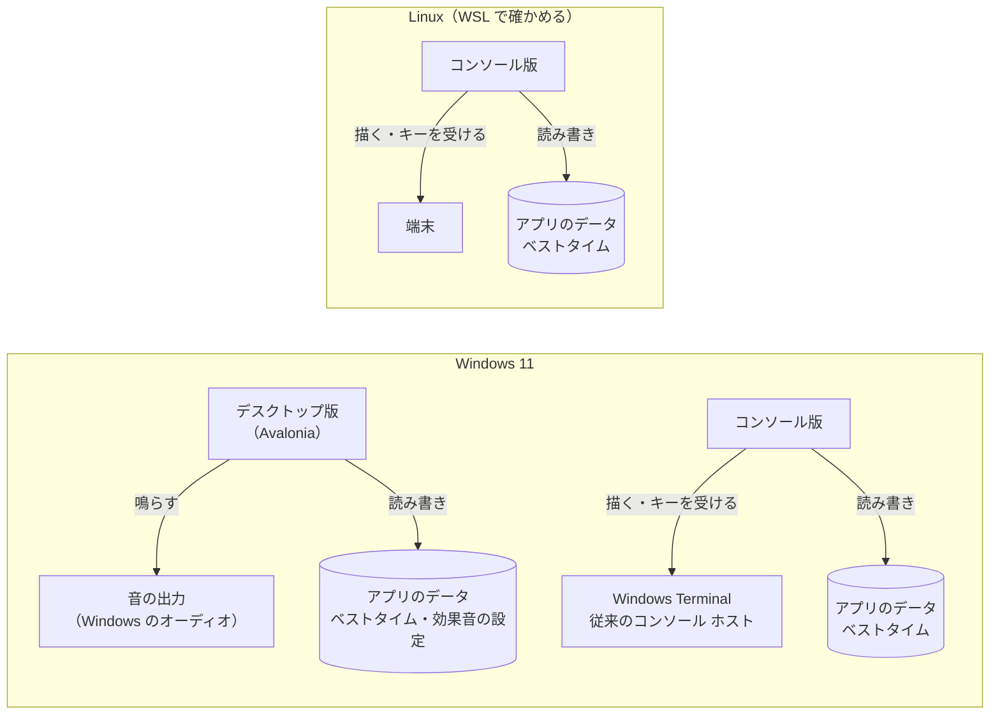
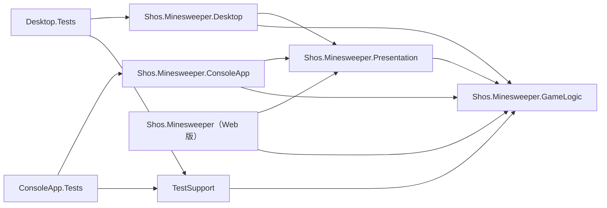
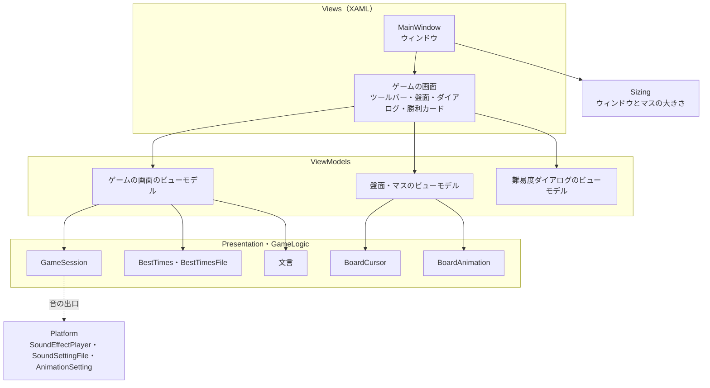
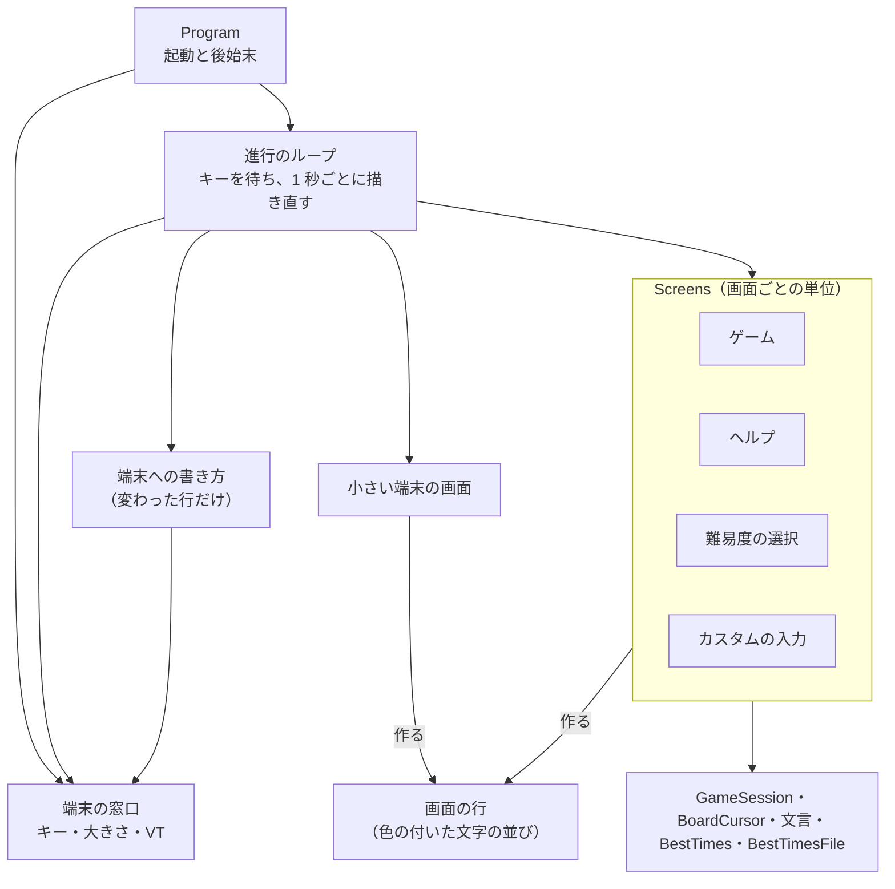
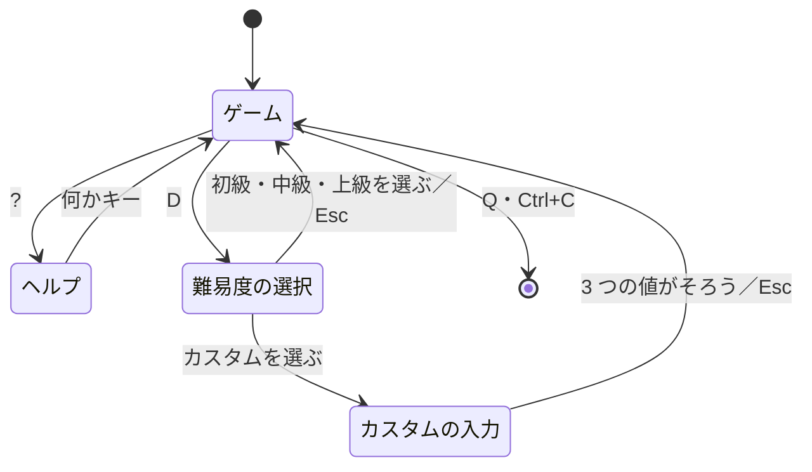

# マインスイーパー デスクトップ版・コンソール版 アーキテクチャー設計書

| 項目 | 内容 |
|------|------|
| 工程 | 7. アーキテクチャー設計書作成（デスクトップ版・コンソール版の一巡） |
| 作成日 | 2026-09-27 |
| 状態 | 工程 7 をユーザーが承認した（2026-09-27）。アーキテクチャー設計書レビュー（docs/desktop-console/reviews/04-architecture-review.md）の指摘を反映し、工程 8 をユーザーが承認した（2026-09-27）。クラス設計で決めた改める点（docs/desktop-console/05-class-design.md の 9.2 の A1〜A5）を、工程 10 のレビューで確かめて反映した |
| 入力 | docs/desktop-console/02-spec.md（仕様書）、docs/desktop-console/03-ui-design.md（UI デザイン）、docs/desktop-console/01-research.md（調査書）、Web 版のアーキテクチャー設計書（docs/04-architecture.md）、CLAUDE.md |

## 1. 概要

仕様書と UI デザインで決めたものを、どの単位に分けて作り、単位どうしをどうつなぐかを定める。この文書で決めるのは、プロジェクトの構成、共有の部品に移すもの、層と依存の向き、各版の主な型の責務と状態の持ち主、端末と OS との境界、永続化、エラーの扱い、テストと公開の方針である。各型の公開メンバーと細かい型は、クラス設計書（docs/desktop-console/05-class-design.md）で決める。

Web 版のアーキテクチャー設計書を「Web 版 設計 6.2」のように指す。

### 1.1 設計の方針

Web 版の設計の方針（Web 版 設計 1.1）をそのまま引き継ぐ。関心事を先に列挙する、ゲームのルールは UI を知らない、差し替え口はテストが求めるものと版ごとに中身が違うものだけ、などである。この一巡で加える方針は次のとおりである。

| 方針 | 内容 |
|------|------|
| 共有するのは、2 つ目の利用者が来たものだけ | Web アプリに残していた部品（調査書 2.2）のうち、デスクトップ版かコンソール版が同じ意図で使うものだけを Presentation に移す。使う版が 1 つだけのものは、その版に置く（6 章） |
| 画面の判断は、画面の部品から切り離す | デスクトップ版はビューモデル（画面の状態と操作を持つ C# のクラス）に、コンソール版は「状態から画面の行を作る」関数に、判断を置く。どちらも Avalonia や端末なしで xUnit で確かめられる（12 章） |
| ライブラリは最小限 | デスクトップ版は Avalonia と、効果音を重ねて鳴らすためのライブラリ（NAudio。ユーザーの確認が要る。17 章）だけを使う。MVVM や端末の UI のライブラリは使わない（15 章） |
| 実行環境で変わるものは、最初の区切りで確かめる | Linux の上で発行した Windows 向けの実行ファイル、ヘッドレスのテストと xUnit v3 の 4 系の組み合わせ、ナレーター、端末の VT の解釈などは、テストでは分からない。実装の最初の区切りで、本物の環境で確かめる（11 章。CLAUDE.md の「実行環境での確認」） |

## 2. システムの構成

どちらの版もサーバーと通信しない（仕様書 6.2）。利用者の PC の中だけで動く。



## 3. 関心事と置き場所

Web 版の関心事（Web 版 設計 3 章の 1〜20）のうち、ゲームのルール（1〜4）、操作の結果（14）、効果音の規則と合成（15、16）、1 回のゲームの進め方（20）は、そのまま共有の部品を使う。この一巡で置き場所を決める関心事は次のとおりである。「置き場所」の列は 4 章の構成を指す。

| # | 関心事 | 内容 | 仕様書・UI デザイン | 置き場所 |
|---|--------|------|---------------------|----------|
| 1 | カーソル | キーボードで選んでいるマスの位置。矢印で動かし、端で止まる | 仕様 4.3、5.3 | Presentation: `BoardCursor`、`Direction`（Web アプリから移す） |
| 2 | 演出の順序 | 直前の操作から、演出するマス・種類・遅れの比を決める | 仕様 4.7、UI 2.10 | Presentation: `BoardAnimation` など（Web アプリから移す） |
| 3 | マスの読み上げの名前 | 「3 行 5 列、未開放」など | 仕様 4.8、UI 2.11 | Presentation（Web アプリの `CellPresentation` から、文を作る部分を移す） |
| 4 | 画面の文言 | 勝利カード、ツールバーの名前、難易度の選択の文、入力の誤りの文 | UI 2.12、3.11 | Presentation（Web アプリの Razor に直接書いていたものを移す） |
| 5 | マスの大きさの範囲と盤面の枠 | 下限 20、上限 48、枠 3 | 仕様 4.4、UI 2.2 | Presentation（Web アプリの `BoardPlacement` の定数を移す） |
| 6 | ベストタイムのファイル | ベストタイムを、形式（`BestTimesJson`）のままファイルに読み書きする。失敗しても遊べる | 仕様 6.2 | GameLogic: `BestTimesFile`（新設） |
| 7 | キーの割り当て | Avalonia のキー、端末のキーから、行う操作と方向を決める | 仕様 4.3、5.3 | 各版（キーの型が違う） |
| 8 | ウィンドウとマスの大きさ | 盤面に合わせたウィンドウの大きさ、ウィンドウに合わせたマスの大きさ | 仕様 4.4、UI 2.2 | デスクトップ版 |
| 9 | 画面の状態と操作 | ゲームの画面、ツールバー、盤面、難易度ダイアログ、勝利カードの状態と操作 | 仕様 4 章、UI 2 章 | デスクトップ版: ビューモデル |
| 10 | 見た目 | 配色、マスの形、アイコン、演出の動き、書体 | UI 2.7〜2.10 | デスクトップ版: XAML の資源とスタイル |
| 11 | 効果音の再生と設定 | 合成した音を重ねて鳴らす、オンとオフ、設定の保存 | 仕様 4.6 | デスクトップ版: `SoundEffectPlayer`、`SoundSettingFile` |
| 12 | OS の設定 | 「アニメーション効果」、ライト・ダーク | 仕様 4.5、4.7 | デスクトップ版（ライト・ダークは Avalonia） |
| 13 | 画面の中身 | ゲーム、ヘルプ、難易度の選択、カスタムの入力、端末が小さいときの画面の行を作る | 仕様 5 章、UI 3 章 | コンソール版: 画面ごとの単位 |
| 14 | 端末の制御 | 代替画面、カーソル、色（`NO_COLOR`）、キーの読み取り、大きさ、元に戻す | 仕様 5.2、5.9、UI 3.9、3.10 | コンソール版: 端末の窓口 |
| 15 | 進行のループ | キーを待ちながら 1 秒ごとに描き直す | 仕様 5.2、UI 3.1 | コンソール版 |

関心事 1〜6、8、13 は、計算と判断だけで、画面の部品も端末も要らない。ふつうの C# のクラスにして xUnit で確かめる。

## 4. ソリューションとプロジェクトの構成

```text
Shos.Minesweeper.slnx
├─ Shos.Minesweeper.GameLogic/          （既存）ゲームのルール。BestTimesFile を足す
├─ Shos.Minesweeper.Presentation/       （既存）アプリで共有する部品。6 章の部品を移す
├─ Shos.Minesweeper/                    （既存）Web 版。移した部品を Presentation から使うように直す
├─ Shos.Minesweeper.Desktop/            デスクトップ版（Avalonia のアプリ、net10.0-windows。区切り 7 で改めた。クラス設計書 9.2 の A6）
│   ├─ App.axaml、Program.cs            アプリの起動、テーマ、組み立て
│   ├─ Views/                          ウィンドウと画面の部品（XAML）
│   ├─ ViewModels/                     画面の状態と操作
│   ├─ Input/                          キーの割り当て
│   ├─ Sizing/                         ウィンドウとマスの大きさの計算
│   ├─ Platform/                       効果音の再生、設定のファイル、OS の設定（アニメーション効果）
│   └─ Assets/                         配色、アイコン、アプリのアイコン
├─ Shos.Minesweeper.ConsoleApp/         コンソール版（コンソールのアプリ、net10.0）
│   ├─ Program.cs                      起動、端末の準備と後始末
│   ├─ Screens/                        画面ごとの単位（ゲーム、ヘルプ、難易度の選択、カスタムの入力、小さい端末）
│   ├─ Rendering/                      画面の行（色の付いた文字の並び）と、端末への書き方
│   └─ Terminal/                       端末の窓口（キー、大きさ、VT の制御）
├─ Shos.Minesweeper.Desktop.Tests/      デスクトップ版のテスト（xUnit v3）
├─ Shos.Minesweeper.ConsoleApp.Tests/   コンソール版のテスト（xUnit v3）
├─ （既存のテストのプロジェクト）         GameLogic.Tests、Presentation.Tests、Tests、TestSupport
```

フォルダーの細かい分け方と型の一覧は、クラス設計で決める。



#### 版ごとにプロジェクトを分ける理由

- デスクトップ版とコンソール版は、別々の実行ファイルとして配る（仕様書 7.1）。1 つのプロジェクトから両方は作れない。
- どちらも Web 版のプロジェクトを参照しない。共有するものは Presentation と GameLogic を通す。

#### 名前

- デスクトップ版は `Shos.Minesweeper.Desktop` とする。仕様書の「デスクトップ版」をそのまま名前にした。技術の名前（Avalonia）を入れないのは、名前に実装を漏らさないためである（技術を変えても名前が嘘をつかない）。
- コンソール版は `Shos.Minesweeper.ConsoleApp` とする。`Shos.Minesweeper.Console` にすると、名前空間 `Shos.Minesweeper.Console` が .NET の `System.Console` クラスを隠し、このプロジェクトの中で `Console.ReadKey` などと書けなくなる（名前空間の `Console` が先に見つかる）。仕様書の「コンソール版」に最も近く、ぶつからない名前にした。
- テストのプロジェクトは、既存と同じく「対象のプロジェクト名 + `.Tests`」とする。
- デスクトップ版の大きさの計算のフォルダーは、`Layout` ではなく `Sizing` とする。Avalonia の `Layout`（コントロールの大きさと位置を決める仕組み）と、名前は同じで意味が違うからである（Web 版で Blazor の `Layout` を避けたのと同じ理由。Web 版 設計 4 章）。

#### 使うパッケージ

| プロジェクト | パッケージ | 理由 |
|--------------|------------|------|
| Desktop | Avalonia、Avalonia.Desktop、Avalonia.Themes.Fluent（MIT。12.1 系） | 画面の技術（ユーザーの決定） |
| Desktop | NAudio の再生の部品（MIT） | 効果音を重ねて鳴らす（仕様書 4.6）。**導入はユーザーの確認が要る**（17 章） |
| Desktop.Tests | xUnit v3（既存と同じ版）。Avalonia.Headless.XUnit は使わない（11 章の #1 の結果） | 12 章 |
| ConsoleApp、ConsoleApp.Tests | 追加なし（`System.Console` と xUnit v3） | 5.11 の調査で、ライブラリなしで作れると判断した（15 章） |

## 5. 層と依存の向き

| 単位 | 依存してよいもの | 依存しないもの |
|------|------------------|----------------|
| GameLogic | .NET の基本ライブラリだけ（`BestTimesFile` のファイルの読み書きを含む） | UI の技術、アプリのすべて |
| Presentation | GameLogic、.NET の基本ライブラリ | Blazor、Avalonia、`System.Console`、効果音の実装、アプリのすべて |
| Desktop のビューモデルと計算のクラス | GameLogic、Presentation、`TimeProvider`、音の出口などの差し替え口、Avalonia の値の型と列挙型（`Size`、`PixelRect`、`Key`。クラス設計 9.2 の A2） | Avalonia のコントロール、`Dispatcher`、`Application`、NAudio、ファイル（差し替え口を通す） |
| Desktop の Views | ビューモデル、Avalonia | NAudio |
| Desktop の Platform | NAudio、Win32（アニメーション効果の設定）、ファイル | Views、ビューモデル |
| ConsoleApp の Screens と Rendering | GameLogic、Presentation、`TimeProvider` | `System.Console`（端末の窓口を通す） |
| ConsoleApp の Terminal | `System.Console`、Win32（VT の解釈を有効にする） | Screens |

- 矢印は一方向で、共有の部品（GameLogic、Presentation）がアプリを知ることはない。
- ビューモデルとコンソールの画面の単位は、Avalonia や端末に依存しない。そのため、ヘッドレスのテスト（11 章）が使えなくても、判断のほとんどを xUnit だけで確かめられる。

## 6. 共有の部品の変更

### 6.1 Presentation と GameLogic に移すもの

調査書 2.2 の候補を、この一巡で使う版の数で判断した。2 つ目の利用者が来たもの（SKILL の判断ルール 1。「同じ分岐がすでに 2 箇所目に現れた」）だけを移す。

| 部品 | 今の置き場所 | 移す先 | 使う版 | Web 版の変更 |
|------|--------------|--------|--------|--------------|
| `BoardCursor`、`Direction` | Web: Input | Presentation | Web、デスクトップ、コンソール | カーソルは盤面の座標で動かすようにする。表示の向きの方向から盤面の方向への変換（縦と横を入れ替えているとき、上↔左、下↔右）は、Web 版の `BoardPlacement` が受け持つ |
| `BoardAnimation`、`CellAnimation`、`CellAnimationKind` | Web: Display | Presentation | Web、デスクトップ | 名前空間を変えるだけ。演出の種類を CSS のクラスにする部分（`CellPresentation`）は Web に残る |
| マスの読み上げの名前（`CellPresentation.AccessibleNameOf` の文を作る部分） | Web: Display | Presentation | Web、デスクトップ | `CellPresentation` の CSS のクラスとアイコンの部分は残し、名前は Presentation を呼ぶ |
| 画面の文言（UI 2.12、3.11 で、Web 版の Razor に直接書いていたもの） | Web: Razor | Presentation | Web、デスクトップ、コンソール（一部） | Razor は Presentation の文言を使う。どの文言をどの型にまとめるかは、クラス設計で決める |
| マスの大きさの範囲（20〜48）と盤面の枠（3） | Web: `BoardPlacement` の定数 | Presentation | Web、デスクトップ | `BoardPlacement` は Presentation の値を使う。計算（縦と横を入れ替えるかの判断）は Web に残す |
| ベストタイムのファイル（新設の `BestTimesFile`） | —（新設） | GameLogic | デスクトップ、コンソール | なし |

- Web 版の振る舞いは変えない。移す前後で、Web 版の既存のテスト（bUnit を含む）が Green のままであることを確かめる（CLAUDE.md の「リファクタリング」と同じ考え方）。移すときは、移すだけの手順と、デスクトップ版・コンソール版の機能を足す手順を分ける。
- Web 版は公開し直さない。振る舞いが変わらないので、次に Web 版を公開するときに含まれればよい。
- 移したことは、Web 版の設計書（docs/04-architecture.md、docs/05-class-design.md）の該当する箇所に、変えたことと参照先を書き足す（CLAUDE.md の「開発手順」）。
- Presentation のプロジェクト ファイルのコメント（「Blazor、WPF、コンソール」）を、今の中身に合わせて改める（調査書 7 章）。

#### `BestTimesFile` を GameLogic に置く理由

- ベストタイムのファイルの読み書きは、デスクトップ版とコンソール版で同じ意図（形式は `BestTimesJson`、読めなければ記録なし、書けなくても遊べる。仕様書 6.2）である。2 つの版に同じコードを書くと、同じ意図が重複する。
- 置き場所の候補は GameLogic と Presentation だった。Presentation は「表示と入力の部品」で、保存はそのどちらでもない。GameLogic には保存の形式（`BestTimesJson`）があり、その形式でファイルに読み書きするのは、そのすぐ隣の関心事である（情報を持つ者に置く）。使うのは .NET の基本ライブラリのファイルの操作だけで、GameLogic の依存の規則（5 章）も変わらない。
- ファイルの場所（パス）は各アプリが決めて渡す。GameLogic は、どのアプリのファイルかを知らない。
- 新しいプロジェクト（保存の部品）を作る案は採らない。20 行ほどのクラスのためにプロジェクトを 2 つ（本体とテスト）増やすことになる。

### 6.2 移さないもの

| 部品 | 移さない理由 |
|------|--------------|
| キーの割り当て（Web 版の `KeyboardMapping`） | キーの型が 3 つの版で違う（DOM のキー名、Avalonia の `Key`、`ConsoleKey`）。共有するには、キーを表す型を新しく作って各版で変換することになり、読む対象が増えるだけで、各版の数行の表は減らない。規則（仕様書の表）は各版の表に書く |
| 盤面の置き方の計算（Web 版の `BoardPlacement` の縦と横の入れ替え） | 入れ替えるのは Web 版だけである（仕様書 4.4）。定数だけを移す（6.1） |
| 勝ったときの流れ（ベストタイムを記録し、更新したら保存し、読み上げる） | 記録の規則は `BestTimes.Record` にすでにある。残るのは、各版の保存先と知らせ方（読み上げ、勝利カード、状態の行）をつなぐ数行で、版ごとに違う。1.1.0 の設計で `GameSession` に移すかを保留にしていた（Web 版 設計 6.2）が、3 つの版の流れを見て、移さないと決めた |
| 効果音のオンとオフ | 鳴らす版（Web、デスクトップ）の音の出口の中身が持つ（Web 版 設計 6.2 と同じ） |
| 入力の文字列を整えること | `InputText` はすでに Presentation にある。そのまま使う |

## 7. デスクトップ版

### 7.1 構造

画面（XAML の Views）と、画面の状態と操作（ビューモデル）を分ける MVVM の形にする（調査書 4.2）。



- ビューモデルは、`INotifyPropertyChanged` で変化を Views に知らせる。これを楽に書くためのライブラリ（CommunityToolkit.Mvvm）は使わず、小さな仕組みを自分で書く（15 章）。
- Views は、バインディングで値を表示し、操作をビューモデルのメソッドに渡すだけにする。判断は持たない（Web 版 設計 6.3 の「`GamePage` は判断を持たず、つなぐだけ」と同じ考え方）。
- バインディングは、コンパイル済みのバインディング（`x:DataType`）にする。誤りをビルドで見つけられる（調査書 4.2）。

### 7.2 各単位の責務

型の名前は、要求と UI デザインの語彙に合わせた。確定はクラス設計で行う。

| 単位 | ひとことで言うと |
|------|------------------|
| ゲームの画面のビューモデル | 画面全体の状態の持ち主。`GameSession` を、効果音の出口を渡して作る。新しいゲーム、難易度の選択、勝ったときのベストタイムの記録と保存、勝利カード、読み上げの文、効果音のオンとオフを受け持つ（Web 版の `GamePage` に当たる） |
| 盤面のビューモデルとマスのビューモデル | マスごとの見せ方（`CellAppearance`、数字、演出、読み上げの名前）と、カーソル（`BoardCursor`）。押された・キーを押されたという意図を、ゲームの画面のビューモデルに伝える |
| 難易度ダイアログのビューモデル | 難易度の行（ベストタイムつき）、カスタムの入力欄、入力の検証（`Difficulty` と `InputText`）、誤りの文 |
| ウィンドウとマスの大きさの計算（Sizing） | 盤面の行数・列数から、既定のマスの大きさ（32）のウィンドウの中身の大きさを求める。盤面の領域の大きさから、マスの大きさ（20〜48）を求める（UI 2.2 の式） |
| キーの割り当て（Input） | Avalonia の `Key` から、行う操作（開く・旗）と方向を決める。F2 もここで決める |
| `SoundEffectPlayer`（Platform） | デスクトップ版の音の出口の中身。6 つの効果音の波形を `SoundEffectSynthesizer` で合成しておき、求められた効果音を、前の音を止めずに重ねて鳴らす。オンとオフは持たない（ゲームの画面のビューモデルが持ち、オフなら音の出口に渡さない。ビューモデルを NAudio に依存させないため。クラス設計 9.2 の A1）。鳴らす仕組みの失敗は、鳴らし始めるときのものも、再生の途中のもの（別のスレッドで起きる）も受け止め、鳴らないだけにする（仕様書 4.6。10 章）。合成と再生の準備は、ウィンドウを表示した後に行う（最初の表示を遅らせない。Web 版 設計 14 章の決定 8 と同じ） |
| `SoundSettingFile`（Platform） | 効果音のオンとオフを、ファイルに読み書きする。読めなければオン、書けなくても何もしない |
| アニメーション効果の設定（Platform） | OS の「アニメーション効果」がオンかを返す。Windows では `SystemParametersInfo`（`SPI_GETCLIENTAREAANIMATION`）で読む |
| Views（XAML） | ウィンドウ、ツールバー、盤面、マス、難易度ダイアログ、勝利カード、読み上げのライブ リージョン。見た目（配色、形、アイコン、演出の動き）を持つ |

### 7.3 状態の持ち主と流れ

- 状態の持ち主は、ゲームの画面のビューモデルである。`GameSession`（と、その中の `Game`）、ベストタイム、勝利カードと難易度ダイアログを開いているか、読み上げの文を持つ。
- 流れは一方向にする。Views の操作 → ビューモデルのメソッド → `GameSession` など → ビューモデルの値が変わる → 変化の通知 → Views が描き直す。
- マスのビューモデルは、盤面の操作の後に、変わったマスの値だけを更新する（新たに開いたマスと旗のマス。操作の結果に含まれる）。全マスを毎回作り直さない。上級とカスタムの最大で、描き直しを 100 ミリ秒以内に保つためである（仕様書 6.1）。ただし、勝敗が決まったとき（地雷の表示と自動の旗が変わる）と、新しいゲームを始めたときは、全マスを更新する。
- 経過時間は、Views の側の Avalonia の `DispatcherTimer` が 250 ミリ秒ごとにビューモデルの「経過時間を確かめる」メソッドを呼び、ビューモデルは秒が変わったときだけ変化を知らせる（Web 版の `ElapsedTime` と同じ間隔）。タイマーをビューモデルに置かないのは、`DispatcherTimer` が Avalonia の UI のスレッドを前提にしており、ビューモデルが Avalonia に依存して xUnit だけでは確かめられなくなるからである（5 章）。テストでは、時刻を進めてからこのメソッドを呼ぶ。
- 演出は、盤面の操作の結果から `BoardAnimation` で決め、マスのビューモデルに「演出の種類と遅れの比」を渡す。動きと時間は Views（XAML のアニメーション）が持つ（Web 版で CSS が持つのと同じ分け方。Web 版 設計 14 章の決定 5）。演出をするかは、盤面の操作のたびにアニメーション効果の設定を読んで決める（UI 2.10 の「開いたまま変えても次の演出から従う」）。

### 7.4 入力

- **ポインター**: 盤面の Views がポインターのイベントを受ける。左ボタン（タッチとペンのタップを含む）は `PressKind.Tap`、右ボタンは `PressKind.RightClick` として、`PressMapping` で操作を決める（旗モードはないので、いつも通常のモード）。長押しは作らない（仕様書 4.3）。押下中の表示と顔の「驚き」は、押している間だけビューモデルの値で示す。
- **キーボード**: 各マスを、キーボードのフォーカスを受けられる部品にする。盤面は Tab の移動先を 1 つにし、矢印キーで `BoardCursor` を動かし、カーソルのマスにフォーカスを移す。
  - カーソルとフォーカスを一致させるのは、ナレーターが、フォーカスのあるマスの名前（「3 行 5 列、未開放」）をそのまま読むからである（仕様書 4.8 の「必ず行う」を、標準の仕組みで満たす）。
  - マウスでマスを押したときも、そのマスにフォーカス（カーソル）を移す。その後に矢印キーを押すと、押したマスから動く。フォーカスの枠は、キーボードでフォーカスを移したときだけ出す（UI 2.11 の「カーソルの枠は、キーを押すまで出さない」）。
  - 盤面を表として読ませること（目標）は、盤面とマスのオートメーション ピアで Grid と GridItem を返せるかを、最初の区切りで確かめてから決める（11 章）。
- **F2**: ウィンドウでキーを受け、難易度ダイアログを開いていなければ、新しいゲームを始める（UI 2.11）。

### 7.5 見た目

- テーマは Avalonia の Fluent を使い、ライト・ダークは OS の設定に従わせる（既定の動き）。
- 配色は、Web 版のトークン（Web 版 UI 4.1、10.2）と同じ名前と値の資源を、ライトとダークのそれぞれに定義する。
- アイコンは、Web 版の SVG と同じ座標のベクター（パスのデータ）で描く。
- 書体は Yu Gothic UI を指定する（UI 2.8）。
- **Web 版と同じ値を 2 か所に書くことについて**: 配色の値と演出の時間は、Web 版では CSS に、デスクトップ版では XAML に書くことになる。形式が違うので、1 か所から両方を作る仕組み（生成など）は、得るものに比べて大きい。そこで、**2 か所に書き、値が一致することをテストで確かめる**。テストは Web 版の CSS（`app.css` と演出の CSS）とデスクトップ版の資源のファイルを読んで、トークンごとの値を比べる。アイコンの形は、写真で見比べて確かめる（UI 5 章）。

### 7.6 効果音

- 音の出口の中身（`SoundEffectPlayer`）は、`GameSession` に渡すデリゲートである（Web 版と同じ形）。`GameSession` は、デスクトップ版で動いていることを知らない。
- 重ねて鳴らすために、NAudio の再生の部品を使う（17 章で確認）。合成した波形（44,100 Hz、モノラル、-1〜1）を、そのまま NAudio に渡す。鳴らすたびに新しい再生を始め、前の再生を止めない。細かい使い方はクラス設計で決める。
- 再生は NAudio の別のスレッドで進むので、再生の途中の失敗（音の出力の機器が外された、など）は、鳴らし始めた呼び出しでは受け止められない。NAudio が再生の終わりに知らせる失敗も `SoundEffectPlayer` の中で受け止め、ほかのスレッドに例外を投げさせない（10 章）。受け止め方は、クラス設計で NAudio の仕組みを確かめて決める。
- NAudio の再生の部品は Windows 専用だが、.NET Standard 2.0 なので Linux の上でもビルドできる（調査書 4.6）。テストでは、音の出口を偽物にして、どの効果音が渡されたかだけを確かめる。音は鳴らさない。

### 7.7 組み立て

- DI のコンテナーは使わない。起動の処理（`App` の初期化）で、`TimeProvider.System`、`BestTimesFile`（パスを渡す）、`SoundSettingFile`、`SoundEffectPlayer`、アニメーション効果の設定を作り、ゲームの画面のビューモデルに渡す。
- 組み立てる相手が数個で、差し替えが要るのはテストのときだけだからである。Web 版は Blazor の DI を使ったが、それは Blazor のコンポーネントが DI から受け取る作りだからである。Avalonia にはその前提がない。

## 8. コンソール版

### 8.1 構造



- **画面ごとの単位**（Screens）が、キーを受けて状態を変えることと、今の状態から画面の行（Frame）を作ることを受け持つ。端末には触らない。画面の単位は共通のインターフェイス（`IScreen`）を実装し、キーを受けたら次に出す画面を返す。今の画面と端末が小さいときの扱いは、画面の移り変わりの単位（`ScreenNavigator`）が受け持つ（クラス設計 9.2 の A4）。インターフェイスを作るのは、実装が 3 つ（ゲーム、ヘルプ、難易度の選択）あるからで、15 章の「端末の窓口のインターフェイス」とは別のものである。
- **画面の行**（Frame）は、行ごとの「色の付いた文字の並び」である。色は `ConsoleColor`（前景・背景）と反転の有無で表す。画面の単位はいつも色を付けて作り、`NO_COLOR` のときに色を書かないのは、端末への書き方（Writer）の 1 か所で行う（クラス設計 9.2 の A3）。
- **端末への書き方**（Writer）が、前回の Frame と比べて、変わった行だけを端末に書く。行を書いた後に「行の残りを消す」VT のシーケンスを書くので、文字の表示の幅を数えずに済む（日本語の 2 升の文字があっても、前の行の残りが残らない）。
- **端末の窓口**（Terminal）だけが `System.Console` と VT のシーケンスを使う。

### 8.2 進行のループ

1 つのスレッドで、次を繰り返す（調査書 5.7。複数のスレッドから描くと画面が崩れるため）。

1. 端末の大きさを読み、今の画面に必要な大きさ（その画面の行数と、キーの案内の行の幅の 76 列。ゲームの画面では UI 3.2 の表と同じ）と比べる。足りなければ、小さい端末の画面を出す。端末の大きさが前と変わっていたら、次に書くときに画面を消してすべての行を書き直す（端末が行を詰め直すことがあるため。クラス設計 9.2 の A5）。
2. キーが来ていれば（`Console.KeyAvailable`）、すべて読み、今の画面の単位に渡す。
3. 今の画面の単位から Frame を作り、Writer で書く（変わった行がなければ何も書かない）。
4. 短い時間（30 ミリ秒）待つ。

- 待つ時間を 30 ミリ秒にするのは、キーから画面の反映まで 100 ミリ秒以内（仕様書 6.1）に余裕をもって収め、経過時間の秒の変わり目も遅れずに描くためである。待つ間に CPU をほとんど使わない。
- 経過時間は、Frame を作るたびに `Game.ElapsedSeconds` を読む。秒が変わったときだけ上の行が変わるので、書くのは 1 秒に 1 行になる。
- キーを読む別のスレッドを置く案（調査書 5.7）は採らない。スレッドの間で状態を渡す仕組みが要り、描く場所を 1 つに保つ工夫も増える。

### 8.3 画面の単位と移り変わり



- 端末が今の画面に対して小さいとき（UI 3.8）は、その画面の上に、小さい端末の画面が重なる。受けるキーは D、Q、Ctrl+C だけで、端末が広がれば元の画面に戻る（仕様書 5.5）。D で開く難易度の選択の画面は、ゲームの画面より行が少ないので、盤面が収まらない端末でも出せる。そこで小さい難易度を選べる（クラス設計 9.2 の A5）。
- 「ゲーム」の単位が、`GameSession`、`BoardCursor`、ベストタイムを持つ。ヘルプと難易度の選択を開いている間も、`Game` は経過時間を計り続ける（仕様書 5.7）。
- カスタムの入力の行の編集（文字を足す、Backspace、Esc、Enter）は、この単位が自分で行う。`Console.ReadLine` を使わないのは、Esc を受けられず、入力の間に経過時間の表示とループが止まるからである。

### 8.4 端末の制御

| 場面 | すること |
|------|----------|
| 起動 | Windows では、出力の VT の解釈を有効にする（`SetConsoleMode` で `ENABLE_VIRTUAL_TERMINAL_PROCESSING`。調査書 5.3）。出力の文字コードを UTF-8 にする。代替画面に切り替え、カーソルを隠す。`Console.TreatControlCAsInput` を有効にして、Ctrl+C をキーとして受ける |
| 描く | VT のシーケンスで、カーソルの位置、色（16 色）、反転、行の残りの消去を書く。1 回の書き込みにまとめる |
| 終わる（Q、Ctrl+C、例外） | `finally` で、色を既定に戻し、カーソルを表示し、代替画面を抜ける（仕様書 5.9）。VT の解釈と文字コードの設定も元に戻す |

- Ctrl+C をキーとして受けるのは、ほかのキーと同じ道で終わらせ、後始末を 1 か所（`finally`）にまとめるためである。`Console.CancelKeyPress` で受ける案は、別のスレッドで呼ばれるので採らない。
- 端末の大きさの変化は、ループのたびに `Console.WindowWidth`、`Console.WindowHeight` を読んで知る（8.2）。`SIGWINCH` のシグナルは使わない（Windows と Linux で同じ方法で済む。調査書 5.5）。
- `NO_COLOR` は、起動のときに環境変数を読む。

## 9. 永続化

| 版 | 保存するもの | ファイル |
|----|--------------|----------|
| デスクトップ版 | ベストタイム | `{LocalApplicationData}/Shos.Minesweeper/Desktop/best-times.json` |
| デスクトップ版 | 効果音のオンとオフ | `{LocalApplicationData}/Shos.Minesweeper/Desktop/sound.json` |
| コンソール版 | ベストタイム | `{LocalApplicationData}/Shos.Minesweeper/ConsoleApp/best-times.json` |

- `{LocalApplicationData}` は `Environment.SpecialFolder.LocalApplicationData` である（Windows は `%LOCALAPPDATA%`、Linux は `$HOME/.local/share`。調査書 5.8）。
- 版ごとにフォルダーを分けるので、ベストタイムは共有されない（仕様書 6.2）。
- ベストタイムの形式は `BestTimesJson` のままにする。読めないファイル（壊れている、ないなど）は、記録なしとして扱う（`BestTimesJson.Parse` と同じ）。
- 書くときにフォルダーがなければ作る。書けないとき（権限がないなど）は何もせず、メモリーの記録だけが残る（仕様書 6.2）。
- 書く途中でアプリや PC が止まると、ファイルが壊れ、次の起動では、それまでのすべての記録が「記録なし」になる。書くのは数十バイトで一瞬のことで、起きる見込みは低いので、これを受け入れ、一時ファイルを経由した書き換えなどはしない（Web 版の localStorage も、同じ扱いである）。
- 保存は、ベストタイムを更新したときと、効果音を切り替えたときだけ行う（Web 版と同じ）。

## 10. エラーの扱い

1.1.0 の B1 の教訓（設計で決めた境界の外に例外が出た）から、例外を受け止める場所を、ここで決めた場所だけにする。

| 起きること | 受け止める場所 | 受け止めた後 |
|------------|----------------|--------------|
| カスタムの入力の誤り | 例外にしない。`Difficulty` の検証の結果として返す（Web 版 設計 11 章と同じ） | 誤りの文を出して、入力し直させる |
| ベストタイム・設定のファイルが読めない、書けない | `BestTimesFile`、`SoundSettingFile` | 記録なし・既定の設定で続ける。書けなければメモリーだけ（9 章） |
| 音を鳴らす仕組みの失敗（音の出力の機器がない、再生の途中で外された、など） | `SoundEffectPlayer`（鳴らし始めるときと、再生のスレッドでの失敗の両方。7.6） | 鳴らないだけで続ける（仕様書 4.6） |
| アニメーション効果の設定が読めない | アニメーション効果の設定を読む単位 | 演出をする（既定の値）とみなして続ける |
| 上のほかの例外（プログラムの誤り） | 受け止めない | デスクトップ版: .NET の既定の動きで、アプリを終える。コンソール版: `finally` で端末を元に戻してから終える（例外の内容は、元の画面に戻った後の端末に出る） |

- プログラムの誤りによる例外を受け止めて続けると、壊れた状態のゲームを遊ばせることになる。Web 版も、予期しない例外はテンプレートのエラーの表示（「エラーが発生しました。」と再読み込み）に任せ、受け止めて続ける仕組みは作っていない（Web 版 設計 11 章）。
- デスクトップ版で、アプリを終える前に「エラーが発生しました」と見せるか（UI デザイン 5 章から送られた事項）は、見せないことにする。見せるには、自前のメッセージの窓を作ることになり（Avalonia にはない）、その窓のコードも誤りうる。起きるのはプログラムの誤りのときだけで、工程 13 のテストで潰す。
- `Dispatcher.UIThread.UnhandledException`（調査書 4.10）は、上の方針のため使わない。

## 11. 実行環境の差と、確かめる時期

テストでは分からない、実行環境で変わるものを、実装の最初の区切りで確かめる（CLAUDE.md の「実行環境での確認」）。結果によって、この設計を見直す。

| # | 確かめること | 確かめ方 | 合わなかったときの手 |
|---|--------------|----------|----------------------|
| 1 | Avalonia.Headless.XUnit が、xUnit v3 の 4 系と Microsoft.Testing.Platform で動くか | 1 件の画面のテストを書いて、`dotnet test` で動かす（Windows と Linux） | 画面のテストは作らず、ビューモデルのテストと実機の確認で補う（12 章）。xUnit を 3 系に留めたテストのプロジェクトは作らない（テストの版が 2 つになり、読む人が迷う）。**結果（区切り 1）: 動かなかった**（テストを見つける段階で `MissingMethodException`）。この手に従った（docs/desktop-console/reviews/code-review.md の区切り 1） |
| 2 | Linux の上で `win-x64` の自己完結の単一ファイルを発行し、Windows で動くか | GitHub Actions の Ubuntu か WSL で発行し、Windows で起動する | 描画のネイティブのライブラリの読み込みを確かめる（調査書 6.1）。直せなければユーザーに相談する（条件に関わるため）。**結果（区切り 1）: 動いた**（WSL で発行し、Windows でウィンドウが出た） |
| 3 | ナレーターが、マスの名前とライブ リージョンの文を読むか。盤面を表として読ませられるか | 実機でナレーターを動かす | 表として読めなければ、既知の制約にする（仕様書 4.8） |
| 4 | NAudio で、効果音が重なって鳴るか。最初の音が遅れないか | 実機で鳴らす | 17 章の確認の結果による。**区切り 7**: NAudio 3.1.0 の音の出力が Windows 向けの対象にしか入らないので、デスクトップ版の対象を `net10.0-windows` にした（ユーザーの決定。クラス設計書 9.2 の A6）。発行した実行ファイルで音の出力が開くこと（`winmm.dll` と `AUDIOSES.DLL` が読み込まれる）までを確かめた。重なって聞こえるか、遅れないかは、ユーザーが聞いて確かめる |
| 5 | 従来のコンソール ホストで VT の解釈が効くか。WSL の Linux で代替画面、色、キーが効くか。日本語の入力（IME）で入れた全角の数字が、キーとして届くか（カスタムの入力） | 実機で動かす | VT が効かない環境は対象外にする（仕様書 5.1 の端末は、どれも VT に対応している見込み） |
| 6 | 配る実行ファイルで、全角の数字が半角に整えられるか（インバリアント モードでない） | 発行した実行ファイルでカスタムに「２０」を入れる | 設定を直す（仕様書 3 章）。**結果: 動いた**（区切り 4 で、コンソール版の Linux 向けの発行物。区切り 6 で、デスクトップ版の Windows 向けの発行物に「２０」「　１０」「１０ 」を入れ、20×10・地雷 10 になった。docs/desktop-console/reviews/code-review.md） |
| 7 | WSL の Linux に ICU が入っているか | 発行した実行ファイルを起動する | リリースノートに要るものを書く（仕様書 5.1。13 章） |
| 8 | 題名の帯の明暗、書体（Yu Gothic UI）、DPI の違うモニター | 実機で見る | UI デザインの 5 章のとおり |

## 12. テストの方針

| テストのプロジェクト | 確かめるもの | 使う仕組み |
|----------------------|--------------|------------|
| GameLogic.Tests | `BestTimesFile`（一時フォルダーで、読めない・書けない場合も） | xUnit |
| Presentation.Tests | 移した部品（カーソル、演出、読み上げの名前、文言、大きさの範囲）。移す前のテストを一緒に移す | xUnit |
| Tests（Web 版） | 移した後も振る舞いが変わらないこと（既存のテストをそのまま通す） | xUnit、bUnit |
| Desktop.Tests | ビューモデル（操作、勝敗、ベストタイム、ダイアログの検証、効果音の出口に渡したもの、演出の値）、ウィンドウとマスの大きさの計算、キーの割り当て、設定のファイル、配色と演出の時間が Web 版と一致すること（7.5） | xUnit。画面のテストは作らない（11 章の #1 の結果） |
| ConsoleApp.Tests | 画面の単位（キーを渡して、状態と Frame の行を確かめる）、Writer（前の Frame と比べて書く行）、小さい端末の判定、カスタムの入力の編集 | xUnit |

- 時刻は `FakeTimeProvider`、盤面は `TestSupport` の `TestGames` で決める（既存と同じ）。
- テストのための差し替え口は、時刻、地雷の置き方、音の出口、保存のファイルのパス、アニメーション効果の設定、端末の大きさとキー（コンソール版の画面の単位は、キーと大きさを引数で受け取るので、端末の窓口を差し替えなくてよい）である。
- 全テストは、リポジトリ直下の `dotnet test` の 1 回で、Windows でも Linux でも走る（仕様書 8.1 の基準 9）。
- 実際の見た目と音、端末での見え方は、実機で確かめる（11 章、工程 13）。

## 13. 公開

- 発行は Linux（GitHub Actions の Ubuntu）の上で行う（仕様書 7.1）。デスクトップ版は `win-x64`、コンソール版は `win-x64` と `linux-x64` の、自己完結の単一ファイルにする。デスクトップ版は、描画のネイティブのライブラリを含めるため `IncludeNativeLibrariesForSelfExtract` を使う（調査書 6.1）。
- Web 版の公開のワークフロー（`deploy.yml`）は変えない。ソリューションにデスクトップ版とコンソール版が加わっても、Ubuntu の上の `dotnet test` はそのまま通る見込みである（11 章の #1、#2 で確かめる）。
- デスクトップ版とコンソール版の公開は、別のワークフローにする。Web 版と同じく手動で起動し、テスト、発行、zip にまとめて、GitHub Releases に置く（仕様書 7.2、7.4）。ワークフローの細部とタグの付け方は、リリース準備（工程 14）で決める。
- Linux 版は、利用者の Linux の ICU を使う（インバリアント モードにしない。仕様書 5.1、3 章）。ICU をアプリに含めない。多くの Linux には入っており、含めると発行物が大きくなる。要ることをリリースノートに書く。

## 14. 仕様書・UI デザインを補う決定

| # | 決定 | 理由 | 節 |
|---|------|------|----|
| 1 | コンソール版のプロジェクト名は `ConsoleApp` にする | `Console` にすると、名前空間が `System.Console` を隠す | 4 |
| 2 | 共有するのは、2 つ目の利用者が来た部品だけ。キーの割り当てと、勝ったときの流れは移さない | 6 章 | 6 |
| 3 | ベストタイムのファイルの読み書き（`BestTimesFile`）を GameLogic に置く | 形式（`BestTimesJson`）の隣の関心事で、2 つの版が同じ意図で使う | 6.1 |
| 4 | デスクトップ版は MVVM にし、ライブラリなしで書く | 判断をビューモデルに置けば、ヘッドレスのテストがなくても xUnit で確かめられる | 7.1 |
| 5 | デスクトップ版のカーソルは、マスのキーボードのフォーカスと一致させる | ナレーターがフォーカスのあるマスの名前を読む | 7.4 |
| 6 | 配色と演出の時間は Web 版と 2 か所に書き、一致をテストで確かめる | 形式が違い、1 か所から作る仕組みは大きすぎる | 7.5 |
| 7 | コンソール版は 1 つのスレッドのループで、30 ミリ秒ごとにキーと大きさを確かめる | 描く場所を 1 つにし、スレッドの間の受け渡しを作らない | 8.2 |
| 8 | コンソール版は、変わった行だけを書き、行の残りを VT で消す | ちらつきを防ぎ、文字の表示の幅を数えずに済む | 8.1 |
| 9 | 例外を受け止めるのは、保存、音、アニメーション効果の設定だけ。ほかはアプリを終える（コンソール版は端末を戻してから） | 壊れた状態で遊ばせない。受け止める場所を決めておく（1.1.0 の B1） | 10 |
| 10 | Linux 版は ICU を含めず、利用者の ICU を使う | 多くの Linux に入っている。含めると大きくなる | 13 |
| 11 | 設定とベストタイムのファイルは、版ごとのフォルダーに置く | 仕様書 6.2（共有しない） | 9 |
| 12 | デスクトップ版の経過時間のタイマーは Views に置き、ビューモデルのメソッドを呼ぶ | ビューモデルを Avalonia に依存させない | 7.3 |
| 13 | デスクトップ版で、マウスで押したマスにもカーソルを移す | 矢印キーで、押したマスから続けて動ける | 7.4 |

## 15. 作らないもの

| 作らないもの | 理由 |
|--------------|------|
| MVVM のライブラリ（CommunityToolkit.Mvvm） | 変化の通知の仕組みは小さく、自分で書ける。ライブラリの導入には確認が要り、読む人が覚えることも増える |
| 端末の UI のライブラリ（Spectre.Console、Terminal.Gui） | マウスを使わず（仕様書 5.3）、画面は行を並べるだけなので、`System.Console` と VT のシーケンスで足りる |
| 端末の窓口のインターフェイス | 画面の単位がキーと大きさを引数で受け取り、Frame を返すので、テストで端末を差し替える必要がない |
| DI のコンテナー | 組み立てる相手が数個で、テストでは手で渡せる（7.7） |
| 例外を受け止めてエラーを見せる仕組み | 10 章 |
| 配色とアイコンを 1 か所から Web 版とデスクトップ版に作る仕組み | 7.5 |
| キーの型を表す共通の型 | 6.2 |
| ICU の同梱、Native AOT、トリミング | 13 章、仕様書 7.1 |
| xUnit v3 の 3 系に留めたテストのプロジェクト | 11 章の #1 |

## 16. リスク

| リスク | 見込み | 手当て |
|--------|--------|--------|
| ヘッドレスのテストが xUnit v3 の 4 系で動かない | 中（拡張の API が変わった。調査書 4.9） | 判断をビューモデルに置いたので、画面のテストがなくても多くを確かめられる（11 章 #1） |
| Linux の上で発行した Windows 向けの実行ファイルが、描画のライブラリを読めない | 低〜中（報告がある。調査書 6.1） | 最初の区切りで確かめる（11 章 #2） |
| マスごとのコントロール（最大 720）で描き直しが遅い | 低（変わったマスだけを更新する。7.3） | 実機で計る。遅ければ、盤面を自分で描く形（調査書 4.2）を検討する |
| ナレーターで盤面を表として読めない | 中 | 仕様書 4.8 のとおり、目標にとどめ、既知の制約にできる |
| 移した部品で Web 版の振る舞いが変わる | 低（既存のテストがある） | 移すだけの手順を分け、Web 版の全テストを通す（6.1） |

## 17. ユーザーに確認する点

| # | 確認すること | 推す案 | 推す理由と、ほかの案 |
|---|--------------|--------|----------------------|
| 1 | デスクトップ版で **NAudio**（MIT のライブラリ）を導入してよいか | 導入する | 仕様書 4.6 の「重ねて鳴らす」を満たす最も小さな手段である。.NET に付いている `SoundPlayer` は重ねて鳴らせない。ほかの案は、Win32 の音の API（winmm）を自分で呼ぶことで、ライブラリは増えないが、音のデータの受け渡しと後始末のコードを自分で書き、確かめることになる。**回答（2026-09-28、区切り 7 の前に改めて確かめた）: 導入する** |
| 2 | ヘッドレスのテストが xUnit v3 の 4 系で動かなかったときに、画面のテストを作らないことでよいか | 作らない | ビューモデルのテストと実機の確認で補う。テストの版を 2 つにすると、読む人とビルドの設定が複雑になる |
