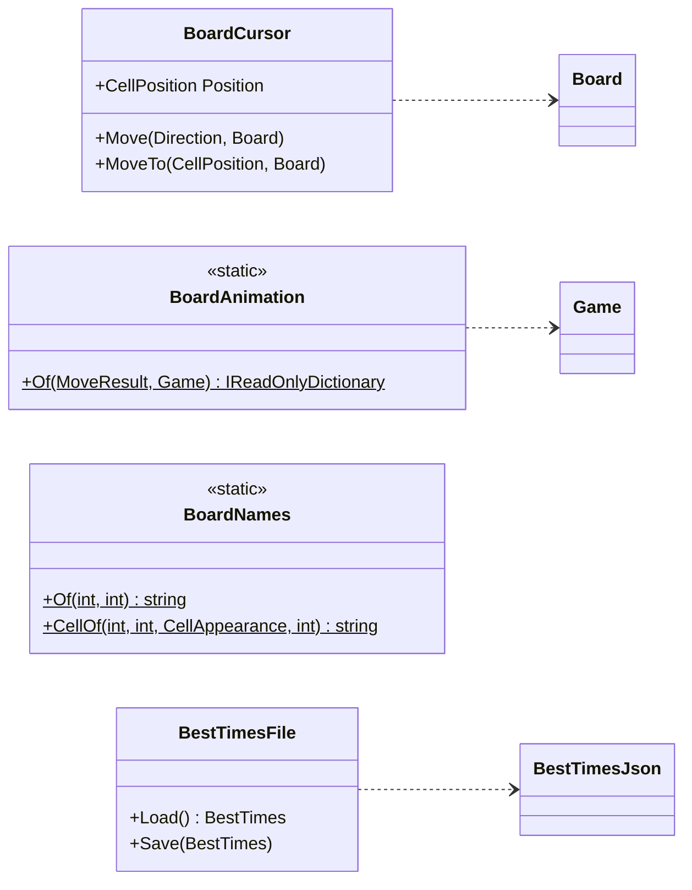
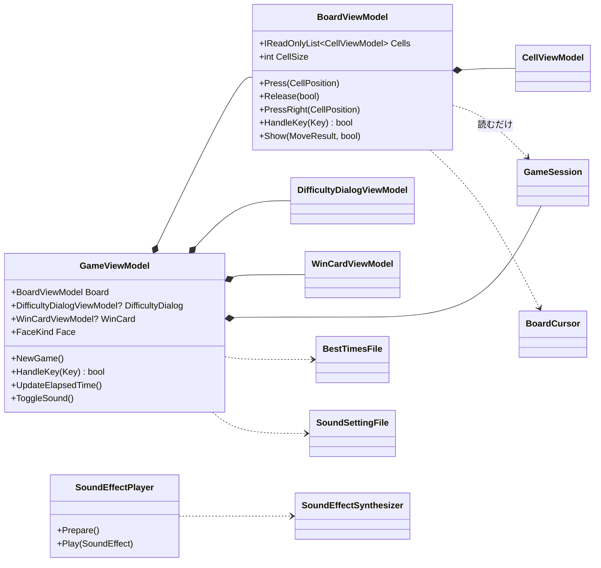
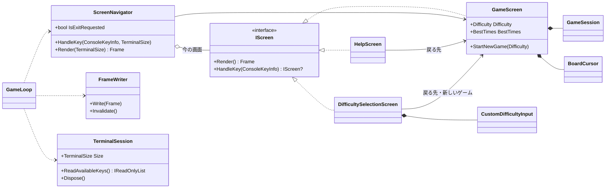

# マインスイーパー デスクトップ版・コンソール版 クラス設計書

| 項目 | 内容 |
|------|------|
| 工程 | 9. クラス設計書作成（デスクトップ版・コンソール版の一巡） |
| 作成日 | 2026-09-27 |
| 状態 | 工程 9 をユーザーが承認した（2026-09-27）。確認事項 1（カーソル）はユーザーが決めた（11 章）。クラス設計書レビュー（docs/desktop-console/reviews/05-class-design-review.md）の指摘を反映し、工程 10 をユーザーが承認した（2026-09-27） |
| 入力 | docs/desktop-console/04-architecture.md（アーキテクチャー設計書）、docs/desktop-console/02-spec.md（仕様書）、docs/desktop-console/03-ui-design.md（UI デザイン）、Web 版のクラス設計書（docs/05-class-design.md）、今のコード |

## 1. 概要

アーキテクチャー設計書で決めた単位ごとに、型の公開メンバー、小さな型（列挙型・値の型）、型どうしのつなぎ方を定める。あわせて、テストの組み立て方と、実装（工程 11）の区切りの案を示す。

各メンバーの実装は、判断が要るものだけを書く。細かい実装は工程 11 でテストファーストで決める。

文書は次のように指す。この一巡のアーキテクチャー設計書は「アーキ 7.3」、仕様書は「仕様書 4.3」、UI デザインは「UI 2.2」。Web 版のクラス設計書は「Web 版 クラス 12.4」、アーキテクチャー設計書は「Web 版 設計 6.2」、UI デザインは「Web 版 UI 2.3」。

### 1.1 設計の方針

Web 版のクラス設計の方針（Web 版 クラス 1.1。使う側から決める、値の組に名前を付ける、規則は情報を持つ者に置く、継承はしない）を引き継ぐ。この一巡で加える方針は次のとおりである。

| 方針 | 内容 |
|------|------|
| 判断を持つ型は、画面の部品と端末に触らない | デスクトップ版のビューモデルと大きさの計算は、Avalonia の値の型と列挙型（`Size`、`PixelRect`、`Key`）だけを使い、コントロール、`Dispatcher`、`Application` を使わない。そのため、Avalonia を起動せずに xUnit で確かめられる。コンソール版の画面の単位は、`System.Console` を使わず、キーを受けて `Frame` を返す（アーキ 5 章。9.2 の A2） |
| 値は持ち主に 1 つだけ置く | ツールバーの数字やマスの見せ方は、`GameSession` の `Game` から、読むたびに求める。ビューモデルは値を写して持たず、操作の後に「変わったかもしれない」と知らせる（4.2）。例外は、表示している経過時間の秒だけである |
| インターフェイスは、実装が 2 つ以上あるものだけ | 作るのは、コンソール版の画面の単位（`IScreen`。実装が 3 つ）だけである。音の出口とアニメーション効果の設定は、Web 版の `SoundEffectOutput`、`MineChooser` と同じくデリゲートで受ける |
| 基底クラスを作らない | ビューモデルの変化の通知（`INotifyPropertyChanged`）も、基底クラスにまとめず、各クラスに 2 行ずつ書く（4.2。SKILL の判断ルール 9） |

### 1.2 用語と名前の対応

Web 版の対応（Web 版 クラス 1.2）に、この一巡の用語を加える。

| 用語 | 名前 |
|------|------|
| ゲームの画面のビューモデル | `GameViewModel` |
| 盤面・マスのビューモデル | `BoardViewModel`、`CellViewModel` |
| 難易度ダイアログ、難易度の行、カスタムの入力欄 | `DifficultyDialogViewModel`、`DifficultyRowViewModel`、`CustomFieldViewModel` |
| 勝利カード | `WinCardViewModel` |
| 顔（リセット ボタンのアイコン）の表情 | `FaceKind`（`Normal`・`Surprised`・`Won`・`Lost`） |
| ウィンドウとマスの大きさ | `WindowSizing` |
| OS の「アニメーション効果」 | `AnimationEffects` |
| 盤面の寸法（マスの大きさの範囲、盤面の枠） | `BoardDimensions` |
| 読み上げの名前（盤面、マス） | `BoardNames` |
| 画面の単位（コンソール版） | `IScreen`、`GameScreen`、`HelpScreen`、`DifficultySelectionScreen` |
| 端末が小さいときの画面 | `TerminalTooSmallScreen` |
| 画面の行、1 画面分の行 | `FrameLine`、`Frame` |
| 色の付いた文字の並び、文字の色 | `StyledText`、`TextStyle` |
| 端末への書き方 | `FrameWriter` |
| 端末の窓口、端末の大きさ（列と行） | `TerminalSession`、`TerminalSize`（`Columns`、`Rows`） |
| マスの記号 | `CellGlyphs` |

- 行と列は、Web 版と同じく 0 から数える。読み上げと画面に出す「3 行 5 列」は 1 から数えるので、`BoardNames` で 1 を足す。
- 「キーの割り当て」は、3 つの版とも `KeyboardMapping` と呼ぶ（名前空間で分ける）。同じ概念なので同じ名前にし、キーの型だけが版ごとに違う（アーキ 6.2）。

## 2. 型の一覧

名前空間はフォルダーに合わせる（`Shos.Minesweeper.Desktop.ViewModels`、`Shos.Minesweeper.ConsoleApp.Screens` など）。共有の部品の変更は 3.1 に、デスクトップ版は 4.1 に、コンソール版は 5.1 に、型ごとの一覧を置く。

| プロジェクト | 加える型の数 | 主な型 |
|--------------|--------------|--------|
| GameLogic | 1 | `BestTimesFile` |
| Presentation | 移す 5、加える 6 | `BoardCursor`、`Direction`、`BoardAnimation`、`BoardNames`、`BoardDimensions`、画面の文言（4 つ） |
| Web 版 | 変える | `BoardPlacement`、`CellPresentation`、`BoardView` ほかの Razor |
| Desktop | 約 20 | `GameViewModel`、`BoardViewModel`、`WindowSizing`、`SoundEffectPlayer`、Views |
| ConsoleApp | 約 20 | `GameScreen`、`ScreenNavigator`、`FrameWriter`、`TerminalSession` |

## 3. 共有の部品（GameLogic、Presentation）

アーキ 6.1 で移すと決めた部品を、型とメンバーに落とす。**Web 版の振る舞いは変えない。** 移す手順は、Web 版の既存のテスト（bUnit を含む）を Green に保ったまま行い、デスクトップ版・コンソール版の機能を足す手順とは分ける（8 章の区切り 2）。

### 3.1 型と変更の一覧

| 置き場所 | 型 | 種類 | 移す・加える・変える | ひとことで言うと |
|----------|----|------|----------------------|------------------|
| GameLogic | `BestTimesFile` | class | 加える | ベストタイムを、保存の形式のままファイルに読み書きする |
| | `Board` | class | 変える | 盤面の中の位置かを答える `Contains` を公開する（3.2） |
| Presentation | `Direction` | enum | 移す（Web: Input） | 盤面の向きでの、上下左右 |
| | `BoardCursor` | class | 移して変える（Web: Input） | キーボードで選んでいるマス。盤面の座標で動く |
| | `CellAnimationKind`、`CellAnimation`、`BoardAnimation` | enum、record struct、static class | 移す（Web: Display） | 直前の操作から、マスごとの演出を決める |
| | `BoardNames` | static class | 加える（Web の `CellPresentation` から） | 盤面とマスの読み上げの名前 |
| | `BoardDimensions` | static class | 加える（Web の `BoardPlacement` の定数から） | マスの大きさの範囲と盤面の枠の太さ |
| | `ToolbarTexts` | static class | 加える（Web の Razor から） | ツールバーの文言 |
| | `DifficultyDialogTexts` | static class | 加える（同上） | 難易度ダイアログの文言 |
| | `CustomDifficultyTexts` | static class | 加える（同上） | カスタムの入力の文言（欄の名前、範囲、誤り） |
| | `WinCardTexts` | static class | 加える（同上） | 勝利カードの文言 |



### 3.2 `Direction`、`BoardCursor`

```csharp
namespace Shos.Minesweeper.Presentation;

public enum Direction { Up, Down, Left, Right }   // 盤面の向きでの方向

public sealed class BoardCursor
{
    public CellPosition Position { get; private set; } = new(0, 0);

    public void Move(Direction direction, Board board);   // 盤面の向きで 1 マス動かす。盤面の端では動かない（回り込まない）
    public void MoveTo(CellPosition position, Board board);   // そのマスに移す。マウスで押したマス（アーキ 14 章の決定 13）
}

public sealed class Board   // GameLogic。変えるのは次の 1 つだけ
{
    public bool Contains(CellPosition position);   // 盤面の中の位置か（今は非公開）
}
```

- **盤面の座標で動かす**（アーキ 6.1）。Web 版では、表示の向きで動かしていた（引数が `BoardPlacement`）。縦と横を入れ替えるのは Web 版だけなので、表示の向きの方向を盤面の向きの方向に変えるのは、Web 版の `BoardPlacement.ToBoard(Direction)` が受け持つ（3.8）。
- 盤面の大きさは `Board`（`Width`、`Height`）から読む。`Game.Board` を渡す。
- `MoveTo` は、前提条件（盤面の中の位置）をガード節で確かめ、外なら `ArgumentOutOfRangeException` を投げる。`BoardCursor` は 3 つの版が使う公開の型で、外の位置を黙って受け取ると、離れた場所の `Board.CellAt` で例外になるからである（クラス設計書レビューの指摘 3）。
- 盤面の中かの判定は、`Board.Contains` を公開して、`Move`（端で止まる）と `MoveTo`（ガード節）の両方で使う。規則が `Board` の 1 か所に残る。
- **新しいゲームでは、カーソルを左上に戻す**（ユーザーの決定、2026-09-27。11 章）。3 つの版とも、新しいゲームで `BoardCursor` を作り直す（Web 版と同じ）。`BoardCursor` に戻すメソッドは作らない。

### 3.3 演出（`BoardAnimation` など）

`CellAnimationKind`、`CellAnimation`、`BoardAnimation` を、名前とメンバーを変えずに Presentation に移す（Web 版 クラス 12.5）。変えるのは名前空間と、`CellAnimation` のコメント（「CSS が最大の遅れを掛ける」を「各版が演出ごとの最大の遅れを掛ける。Web 版は CSS、デスクトップ版は `CellAnimationTimings`」）だけである。

### 3.4 `BoardNames`

```csharp
public static class BoardNames
{
    public static string Of(int rowCount, int columnCount);   // 「盤面、9 行 9 列」
    public static string CellOf(int row, int column, CellAppearance appearance, int adjacentMineCount);   // 「3 行 5 列、未開放」
}
```

- `CellOf` は、Web 版の `CellPresentation.AccessibleNameOf` の文を作る部分を移したものである。状態の名前（「未開放」「旗」「空白」「3」「地雷」「踏んだ地雷」「誤った旗」）の表も一緒に移す。
- `row` と `column` は、**表示している向き**での 0 から数えた行と列である。Web 版は表示の位置（`DisplayPosition`）の行と列を、デスクトップ版は盤面の位置（縦と横を入れ替えないので同じ）の行と列を渡す。
- 引数が 4 つあるのは、行と列を `DisplayPosition` や `CellPosition` で受けると、どちらの座標かを Presentation が決めることになるからである。`DisplayPosition` は Web 版だけの概念（入れ替え）なので、Presentation には移さない。
- 盤面の名前（`Of`）は、Web 版の `BoardView` の `aria-label` に直接書いていた文である。デスクトップ版の盤面の名前（UI 2.11）と同じ文なので、一緒に置く。
- 名前は、`DifficultyNames` と同じ「〜の名前を返す」形にした。

### 3.5 画面の文言

Web 版の Razor に直接書いていた文言のうち、デスクトップ版も同じ文を使うもの（アーキ 6.1）を、画面の要素ごとに 4 つの型に分けて置く。1 つの型にまとめないのは、要素ごとに変わる理由（ツールバーの見直し、ダイアログの見直し）が違うからである。

```csharp
public static class ToolbarTexts
{
    public const string DifficultyToolTip = "難易度を変える";
    public const string NewGame = "新しいゲーム";                        // リセット ボタンの名前とツールチップ
    public const string SoundEffects = "効果音";                        // 効果音 ボタンの名前
    public static string DifficultyButtonNameOf(DifficultyKind kind);   // 「難易度、初級」
    public static string RemainingMinesOf(int count);                   // 「残り地雷 10」
    public static string ElapsedTimeOf(int seconds);                    // 「経過時間 12 秒」
    public static string SoundEffectsToolTipOf(bool isEnabled);         // 「効果音（オン）」「効果音（オフ）」
}

public static class DifficultyDialogTexts
{
    public const string Title = "難易度";
    public const string Close = "閉じる";
    public const string StartCustom = "カスタムで始める";
    public static string SizeOf(Difficulty difficulty);   // 「9×9・地雷 10」
    public static string BestTimeOf(int? seconds);        // 「ベスト 23 秒」。記録がなければ「記録なし」
}

public static class CustomDifficultyTexts
{
    public const string Width = "幅";
    public const string Height = "高さ";
    public const string MineCount = "地雷数";
    // 範囲の式「1〜（幅×高さ − 9）」は、MineCountRangeOf の中だけで使うので公開しない（区切り 2 で決めた）
    public static string RangeOf(AllowedRange range);                   // 「5〜30」
    public static string MineCountRangeOf(int? width, int? height);     // 範囲が決まれば「1〜71」、決まらなければ「1〜（幅×高さ − 9）」
    public static string InvalidValueOf(string rangeText);              // 「5〜30 の整数を入力してください」
}

public static class WinCardTexts
{
    public const string Title = "クリア！";
    public const string PlayAgain = "もう一度";
    public const string Close = "閉じる";
    public static string TimeOf(int seconds);                    // 「タイム 45 秒」
    public static string? BestTimeOf(BestTimeResult bestTime);   // ベストタイムの行。カスタム（NotEligible）は null（行を出さない）
}
```

- `CustomDifficultyTexts.MineCountRangeOf` は、Web 版の `DifficultyDialog.RangeTextOf` の地雷数の部分（幅か高さが誤っていれば式で示す。UI デザイン 2.3）を移したものである。文言だけでなく、どちらを出すかの判断も、デスクトップ版で同じになるからである。
- コンソール版が使うのは、`CustomDifficultyTexts`（欄の名前、範囲、誤りの文）と、既存の `DifficultyNames`、`Announcements` だけである。コンソール版の難易度の選択の行（「ベスト  23 秒」と列をそろえる）や上の行は、端末に合わせた書式なので、コンソール版に置く（UI 3.3、3.7）。
- 範囲の式「1〜（幅×高さ − 9）」には幅があいまいな「×」を含むが、コンソール版では幅と高さを先に確かめるので、この文を出すことはない（5.7）。
- Web 版だけの文言（旗モード、ページの題名、見つからないページ）は、Web 版に残す。
- 「閉じる」は、難易度ダイアログと勝利カードの両方にある。同じ語だが、別のボタンの文言で、変わる理由が別なので、1 つにまとめない。

### 3.6 `BoardDimensions`

```csharp
public static class BoardDimensions
{
    public const int MinCellSize = 20;   // マスの大きさの下限（論理的な px）
    public const int MaxCellSize = 48;   // 上限
    public const int FrameWidth = 3;     // 盤面の枠の太さ
}
```

- Web 版の `BoardPlacement` の定数を移したもの（アーキ 6.1）。`BoardPlacement` は、定数を消してこの型を使う。
- マスの大きさを領域に合わせる計算は移さない。Web 版は縦と横を入れ替えるかの判断と一体になっていて（入れ替える前と後の大きさを比べる）、共有すると Web 版の判断の順が変わるからである。デスクトップ版は `WindowSizing`（4.8）で計算する。

### 3.7 `BestTimesFile`（GameLogic）

```csharp
public sealed class BestTimesFile(string path)
{
    public BestTimes Load();                  // 読めなければ（ない、読めない、壊れている）記録なし
    public void Save(BestTimes bestTimes);    // フォルダーがなければ作る。書けなければ何もしない
}
```

- 形式は `BestTimesJson` のまま（アーキ 9 章）。壊れた中身は `BestTimesJson.Parse` が記録なしにする。
- 受け止める例外は、ファイルの読み書きの失敗（`IOException` とその派生、`UnauthorizedAccessException`）だけである。パスの誤り（`ArgumentException` など）はプログラムの誤りなので受け止めない（アーキ 10 章）。
- パスは各アプリが決めて渡す（アーキ 6.1）。
- 名前は、GameLogic の `BestTimes`・`BestTimesJson` とそろえた。Web 版の `BestTimeStorage`（localStorage）とは、保存先が違うので名前も違う。

### 3.8 Web 版の変更

| 場所 | 変更 |
|------|------|
| `Input/BoardCursor.cs`、`Input/Direction.cs` | Presentation に移す。Web 版の `Input` からは消える |
| `Display/BoardAnimation.cs`、`CellAnimation.cs`、`CellAnimationKind.cs` | Presentation に移す |
| `Display/BoardPlacement.cs` | 定数を消し、`BoardDimensions` を使う。`public Direction ToBoard(Direction direction)` を加える（入れ替えているときは、上→左、下→右、左→上、右→下。入れ替えていなければそのまま） |
| `Display/CellPresentation.cs` | `AccessibleNameOf` と状態の名前の表を消す（`BoardNames.CellOf` に移る） |
| `Components/BoardView.razor` | `cursor.Move(Placement.ToBoard(direction), Game.Board)`。盤面とマスの `aria-label` は `BoardNames` を使う。枠は `BoardDimensions.FrameWidth` |
| `Components/Toolbar.razor`、`ElapsedTime.razor`、`DifficultyDialog.razor`、`WinCard.razor` | 3.5 の文言の型を使う。旗モードの文言は残す |
| `_Imports.razor` | 移した型のための `@using` を確かめる（Presentation はすでにある） |
| Presentation の csproj のコメント | 「Blazor、WPF、コンソール」を今の中身に合わせる（アーキ 6.1） |

- 描かれる HTML は 1 文字も変えない。bUnit のテストが、そのまま Green であることで確かめる。特に `WinCard` のベストタイムの行は、`class` の値（`best-time new`・`best-time`）を今と同じにする。
- Web 版の設計書（docs/04-architecture.md、docs/05-class-design.md）の該当する箇所に、移したことと参照先（この章）を書き足す（CLAUDE.md の「開発手順」）。区切り 2 で行う。
- テストも移す: `BoardCursorTests`、`BoardAnimationTests`、`CellPresentationTests` の名前の部分を Presentation.Tests に。Web 版には `BoardPlacementTests` に方向の変換を足す（7.2）。

### 3.9 移さなかった候補

設計の中で、2 つ目の利用者が来ると分かったが、移さないと決めたもの。

| 候補 | 移さない理由 |
|------|--------------|
| 顔の表情の規則（勝ち・負け・押下中・ふつう） | Web 版では、表情を `IconKind` で選んでいる（Razor の中の 4 行）。共有すると、Presentation に表情の型を作り、Web 版で `IconKind` に対応させることになり、対応の表が規則と同じ長さになる。デスクトップ版は `FaceKind`（4.3）で同じ規則を書く |
| 数字を出すかの判断（開いたマスで、1 以上） | どの版も、見せ方（`CellAppearance`）ごとに描き方を分ける中の 1 行である（Web 版の `CellPresentation`、デスクトップ版の `CellViewModel.Number`、コンソール版の `CellGlyphs`）。取り出すと、見せ方の分岐が 2 か所に分かれる |
| `PressGesture`（押し方の判定） | デスクトップ版には長押しがなく、左ボタンはふつうのボタンと同じ「押したマスの上で離したら」で判定する（9.1 の決定 1）。判定の中身が違う |

## 4. デスクトップ版

### 4.1 型の一覧とクラス図

| フォルダー | 型 | 種類 | ひとことで言うと |
|------------|----|------|------------------|
| ViewModels | `GameViewModel` | class | 画面全体の状態の持ち主。盤面の操作を進め、勝敗、ベストタイム、ダイアログ、読み上げを受け持つ |
| | `FaceKind` | enum | 顔の表情 |
| | `BoardViewModel` | class | 盤面の表示（マス、カーソル、押下中、マスの大きさ）と、押し方とキーからの操作の意図 |
| | `CellViewModel` | class | 1 つのマスの見せ方 |
| | `DifficultyDialogViewModel` | class | 難易度ダイアログの状態と、カスタムの値の検証 |
| | `DifficultyRowViewModel` | class | 初級〜上級の 1 行 |
| | `CustomFieldViewModel` | class | カスタムの入力欄 1 つ |
| | `WinCardViewModel` | class | 勝利カードに出す文 |
| Input | `KeyboardMapping` | static class | Avalonia のキーから、行う操作、方向、新しいゲームのキーかを決める |
| Sizing | `WindowSizing` | static class | 盤面に合わせたウィンドウの中身の大きさ、盤面の領域に合わせたマスの大きさ、画面に収まるウィンドウの位置 |
| Platform | `SoundEffectPlayer` | class | 効果音を重ねて鳴らす（音の出口の中身） |
| | `SoundSettingFile` | class | 効果音のオンとオフをファイルに読み書きする |
| | `AnimationEffects` | static class | OS の「アニメーション効果」がオンかを読む |
| | `DataFilePaths` | static class | 保存するファイルのパス |
| Views | `MainWindow`、`ToolbarView`、`BoardView`、`CellView`、`DifficultyDialogView`、`WinCardView` | XAML と code-behind | 4.10 |
| | `CellAnimationTimings` | static class | 演出の長さと遅れの最大（Web 版の CSS と同じ値） |
| （直下） | `App`、`Program` | class | 起動、テーマ、組み立て（4.12） |



`GameViewModel` と `SoundEffectPlayer` は、互いを知らない。App が、`SoundEffectPlayer.Play` を音の出口として `GameViewModel` に渡す（4.12）。

### 4.2 変化の通知

各ビューモデルは、`INotifyPropertyChanged` を直接実装する。

```csharp
public event PropertyChangedEventHandler? PropertyChanged;

void Notify(params string[] propertyNames)
{
    foreach (var name in propertyNames)
        PropertyChanged?.Invoke(this, new(name));
}
```

- プロパティの多くは、`GameSession.Game` などから読むたびに求める（1.1 の「値は持ち主に 1 つだけ」）。操作の後に、変わりうるプロパティの名前を `Notify` に渡す。値を比べて変わったものだけを知らせることはしない。Avalonia が読み直すだけで、手間は小さい。
- 通知の仕組みを基底クラス（`ObservableObject` のようなもの）にまとめない。まとめる目的は 2 行の再利用だけで、SKILL の判断ルール 9（再利用だけが目的の継承はしない）に当たる。通知するクラスは 5 つである。

### 4.3 `GameViewModel`

Web 版の `GamePage` に当たる。

```csharp
public sealed class GameViewModel : INotifyPropertyChanged
{
    public GameViewModel(TimeProvider timeProvider, BestTimesFile bestTimesFile, SoundSettingFile soundSettingFile,
                         SoundEffectOutput playSoundEffect, Func<bool> areAnimationEffectsEnabled, MineChooser? chooseMines = null);

    public event Action? DifficultySelected;   // 難易度ダイアログで難易度を選んだ。Views がウィンドウの大きさを決め直す

    public BoardViewModel Board { get; }
    public Difficulty Difficulty { get; }                 // 今のゲームの難易度

    // ツールバー（文は ToolbarTexts）
    public string DifficultyName { get; }                 // 「初級」
    public string DifficultyButtonName { get; }           // 「難易度、初級」
    public int RemainingMineCount { get; }
    public string RemainingMinesName { get; }             // 「残り地雷 10」
    public int ElapsedSeconds { get; }                    // 表示している秒
    public string ElapsedTimeName { get; }                // 「経過時間 12 秒」
    public FaceKind Face { get; }
    public bool IsSoundEnabled { get; }
    public string SoundEffectsToolTip { get; }            // 「効果音（オン）」

    public DifficultyDialogViewModel? DifficultyDialog { get; }   // 開いていなければ null
    public WinCardViewModel? WinCard { get; }                     // 出していなければ null
    public string Announcement { get; }                           // ライブ リージョンの文

    public void NewGame();              // リセット ボタン、勝利カードの「もう一度」
    public bool HandleKey(Key key);     // ウィンドウで受けたキー（F2）。扱ったら true
    public void UpdateElapsedTime();    // Views のタイマーが 250 ミリ秒ごとに呼ぶ
    public void ToggleSound();
    public void OpenDifficultyDialog();
    public void CloseWinCard();
}

public enum FaceKind { Normal, Surprised, Won, Lost }
```

#### 作るときにすること

1. `bestTimesFile.Load()` でベストタイムを、`soundSettingFile.Load()` で効果音のオンとオフを読む（小さいファイルなので、その場で読む）。
2. `new GameSession(Difficulty.Beginner, timeProvider, PlayIfEnabled, chooseMines)` を作る。`PlayIfEnabled` は「`IsSoundEnabled` なら `playSoundEffect` に渡す」音の出口である（9.2 の A1）。
3. `new BoardViewModel(session, Request, NotifyFace)` を作る。
4. 起動のときは、新しいゲームを読み上げない（Web 版 クラス 9.1 の決定 7）。

**盤面の操作**（`BoardViewModel` から `Request(CellAction, CellPosition)` で受ける）

1. `Open` なら `session.Open`、`ToggleFlag` なら `session.ToggleFlag` を呼ぶ。
2. `Board.Show(move, withAnimation: areAnimationEffectsEnabled())` を呼ぶ。設定は操作のたびに読む（UI 2.10 の「開いたまま変えても次の演出から従う」。アーキ 7.3）。
3. 勝ったら: `bestTimes.Record` で記録し、更新したら `bestTimesFile.Save`。`WinCard` を作り、`Announcements.Won` を読み上げる。負けたら: `Announcements.Lost` を読み上げる。
4. ツールバーのプロパティ（残り地雷数、経過時間、顔）を知らせる。

#### そのほかの操作

| 操作 | すること |
|------|----------|
| `NewGame` | 同じ難易度で新しいゲームを始め（`session.StartNewGame`、`Board.ShowNewGame`）、勝利カードを閉じ、`Announcements.NewGame` を読み上げる |
| `HandleKey` | `KeyboardMapping.IsNewGameKey` で、難易度ダイアログを開いていなければ `NewGame`（UI 2.11。勝利カードも閉じる） |
| `UpdateElapsedTime` | `Game.ElapsedSeconds` が表示している秒と違うときだけ、秒を更新して `ElapsedSeconds`・`ElapsedTimeName` を知らせる（Web 版の `ElapsedTime` と同じ考え方。アーキ 7.3） |
| `ToggleSound` | `IsSoundEnabled` を反転し、`soundSettingFile.Save` で保存する。オンに戻しても鳴らさない（UI 2.10） |
| `OpenDifficultyDialog` | `new DifficultyDialogViewModel(Difficulty, bestTimes, SelectDifficulty, CloseDifficultyDialog)` を `DifficultyDialog` にする |
| 難易度を選んだ（ダイアログから） | その難易度で新しいゲームを始めて読み上げ、ダイアログを閉じ、`DifficultySelected` を起こす。今と同じ難易度でも同じ（Web 版 UI 8 章の決定 7） |
| `CloseWinCard` | `WinCard` を `null` にする |

- 顔は `Game.Status` と `Board.IsPressing` から求める（勝ち → `Won`、負け → `Lost`、押下中 → `Surprised`、ほか → `Normal`）。Web 版の `Toolbar.Face` と同じ規則である（3.9）。
- 同じ文を続けて読み上げるときは、Web 版と同じく、見えない文字（ゼロ幅スペース）を足して中身を変える。ライブ リージョンが、中身が変わったときだけ読むからである（Avalonia で同じ振る舞いかは、11 章 #3 で確かめる）。
- `Difficulty` は、ウィンドウの大きさを決め直すために Views が読む。`DifficultySelected` をイベントにしたのは、値が同じ難易度を選んだときも、ウィンドウを盤面に合わせ直すためである（プロパティの変化の通知では、値が同じだと伝わらない）。
- **コンストラクターの引数が 6 つある**。どれも、テストで差し替える外のもの（時刻、2 つのファイル、音の出口、OS の設定、地雷の置き方）で、呼ぶのは App とテストだけである。まとめる型を作っても、中身がばらばらで名前が付かない（SKILL の判断ルール 10 の目安を超える理由）。
- 持たないもの: 盤面の置き方の計算（`WindowSizing`）、押し方の判定（`BoardViewModel`）、ファイルの形式（`BestTimesFile`、`SoundSettingFile`）、文言（Presentation）。アーキテクチャー設計書レビューの残る課題（つなぐ以外の判断を持っていないか）に対しては、残る判断は「勝ったら記録し、更新したら保存する」「F2 はダイアログの間は効かない」「顔の表情」の 3 つで、どれも画面全体の状態（ダイアログ、勝敗、押下中）を知る者にしか決められない。

### 4.4 `BoardViewModel`、`CellViewModel`

Web 版の `BoardView` に当たる。

```csharp
public sealed class BoardViewModel : INotifyPropertyChanged
{
    public BoardViewModel(GameSession session, Action<CellAction, CellPosition> requestAction, Action pressingChanged);

    public IReadOnlyList<CellViewModel> Cells { get; }   // 行の順、行の中は列の順
    public int RowCount { get; }
    public int ColumnCount { get; }
    public string AccessibleName { get; }                // 「盤面、9 行 9 列」（BoardNames.Of）
    public int CellSize { get; }                         // 20〜48。領域の大きさが分かるまでは既定の 32
    public CellPosition CursorPosition { get; }          // カーソルのマス（キーボードのフォーカスを置くマス）
    public bool IsPressing { get; }

    public void SetAreaSize(Size areaSize);              // 盤面の領域の大きさが変わった
    public void Press(CellPosition position);            // 左ボタン（タッチ、ペン）を押した
    public void Release(bool isOverPressedCell);         // 離した。押したマスの上で離したか
    public void CancelPress();                           // 押している間にポインターを失った
    public void PressRight(CellPosition position);       // 右ボタンを押した
    public bool HandleKey(Key key);                      // 盤面で受けたキー。扱ったら true

    public void Show(MoveResult move, bool withAnimation);   // 盤面の操作の結果を見せる（GameViewModel が呼ぶ）
    public void ShowNewGame();                               // 新しいゲームの盤面を見せる（同上）
}

public sealed class CellViewModel : INotifyPropertyChanged
{
    public CellPosition Position { get; }
    public CellAppearance Appearance { get; }     // Game.AppearanceOf
    public int Number { get; }                    // 見せ方が Opened のときの数字。それ以外と 0 のマスは 0
    public string AccessibleName { get; }         // BoardNames.CellOf
    public bool IsPressed { get; }                // 押下中の表示
    public bool IsFlagJustPlaced { get; }         // 直前の操作で旗を立てた（旗が広がる演出。9.1 の決定 4）
    public CellAnimation? Animation { get; }      // 直前の操作の演出
}
```

**押し方**（仕様書 4.3。旗モードはないので、`PressMapping` にはいつも `isFlagMode: false` を渡す）

| 操作 | すること |
|------|----------|
| `Press` | カーソルを押したマスに移す（`MoveTo`。フォーカスは、押したことで Avalonia がそのマスに移す）。勝敗が決まっていなければ、押下中にする。押下中の表示の範囲は、未開放ならそのマス、開いた数字のマスならコードで開く範囲（Web 版の `BoardView.PressedCells` と同じ）。`pressingChanged` を呼ぶ |
| `Release` | 押下中でなければ何もしない。押下中を解き、`pressingChanged` を呼ぶ。押したマスの上で離したなら、`PressMapping.ActionFor(PressKind.Tap, false, マス)` の操作を `requestAction` に渡す（`None` なら渡さない） |
| `CancelPress` | 押下中を解く。操作はしない |
| `PressRight` | カーソルを押したマスに移す。勝敗が決まっていなければ、`PressKind.RightClick` の操作を渡す（押した瞬間に旗。Web 版と同じ） |
| `HandleKey` | 矢印なら、`BoardCursor.Move` でカーソルを動かす（勝敗が決まった後も動かせる。Web 版 クラス 9.1 の決定 5）。Space・Enter・F なら、勝敗が決まっていなければ、カーソルのマスに操作を渡す |

**見せ方の更新**（アーキ 7.3）

- `Show` は、`move.Outcome` が `NoChange` なら何もしない（前の演出も止めない。Web 版と同じ）。そうでなければ、
  1. 前の操作で演出を付けたマスの `Animation` と `IsFlagJustPlaced` を消す。
  2. 勝敗が決まった操作なら全マスを、そうでなければ操作したマスと新たに開いたマスを、`Refresh` する（見せ方、数字、名前を知らせ直す）。
  3. `withAnimation` なら、`BoardAnimation.Of(move, game)` の演出を各マスに付け、旗を立てた操作（`FlagPlaced`）なら、そのマスの `IsFlagJustPlaced` を立てる。付けたマスを覚えておく。
- `ShowNewGame` は、盤面の行数か列数が変わったら `Cells` を作り直し、変わらなければ全マスを `Refresh` する。押下中と演出を消し、カーソルを左上に戻す（`BoardCursor` を作り直す。3.2）。
- マスは 1 次元の並び（行 × 列数 + 列）で持ち、位置からマスを引く計算はこのクラスの中の 1 か所に置く（simplicity.md の「座標変換は一箇所に」）。
- `CellViewModel` の値を変えるメンバー（`Refresh`、`IsPressed` などの設定）は `internal` にし、`BoardViewModel` だけが使う。
- `CellSize` は `WindowSizing.CellSizeToFit(領域の大きさ, 難易度)` で求める。`SetAreaSize` と `ShowNewGame` で求め直して知らせる。
- `requestAction` を 1 つのデリゲートにしたのは、`PressMapping` が返す `CellAction` がそのまま意図の名前になっているからである（開くと旗で 2 つに分けると、どちらも同じ形の受け渡しになる）。

### 4.5 `DifficultyDialogViewModel`、`DifficultyRowViewModel`、`CustomFieldViewModel`

Web 版の `DifficultyDialog` に当たる（UI 2.5、Web 版 UI 2.3）。

```csharp
public sealed class DifficultyDialogViewModel : INotifyPropertyChanged
{
    public DifficultyDialogViewModel(Difficulty current, BestTimes bestTimes, Action<Difficulty> select, Action close);

    public IReadOnlyList<DifficultyRowViewModel> Rows { get; }   // 初級・中級・上級
    public CustomFieldViewModel Width { get; }
    public CustomFieldViewModel Height { get; }
    public CustomFieldViewModel MineCount { get; }
    public bool IsCustomCurrent { get; }                         // 今の難易度がカスタムか（開いたときのフォーカスの置き場所）

    public void Select(DifficultyRowViewModel row);
    public CustomFieldViewModel? StartCustom();   // 正しければ選んで null。誤りがあれば、欄に誤りを示し、最初の誤った欄を返す
    public void Close();
}

public sealed class DifficultyRowViewModel
{
    public Difficulty Difficulty { get; }
    public string Name { get; }           // 「初級」
    public string SizeText { get; }       // 「9×9・地雷 10」
    public string BestTimeText { get; }   // 「ベスト 23 秒」「記録なし」
    public bool IsCurrent { get; }        // チェックの印
}

public sealed class CustomFieldViewModel : INotifyPropertyChanged
{
    public CustomFieldViewModel(string label, int initialValue, Func<string> rangeText);

    public string Label { get; }         // 「幅」
    public string Text { get; set; }     // 入力欄の文字列（双方向のバインディング）
    public int? Value { get; }           // Text を InputText.Normalize で整えてから読む。整数でなければ null
    public string RangeText { get; }     // 「5〜30」。地雷数は、幅と高さの値から
    public bool IsInvalid { get; }
    public string? ErrorText { get; }    // 誤りのときだけ「5〜30 の整数を入力してください」
}
```

- 入力欄の初期値は今の盤面の値（Web 版 UI 8 章の決定 3）。
- `StartCustom` は、`Difficulty.ValidateCustom(Width.Value, Height.Value, MineCount.Value)` で確かめ、各欄の `IsInvalid` を決める。正しければ `select(Difficulty.Custom(...))` を呼ぶ。誤った欄へのフォーカスの移動は Views が行う（戻り値の欄）。フォーカスは画面の部品の仕事だからである。
- 地雷数の範囲の文は、幅と高さの `Value` から `CustomDifficultyTexts.MineCountRangeOf` で求める。幅か高さの `Text` が変わったら、ダイアログが地雷数の欄の `RangeText` と `ErrorText` を知らせ直す（幅と高さの欄の変化の通知を受ける）。
- 入力は、Web 版と違い、C# の `InputText.Normalize` で整える。デスクトップ版はブラウザーではない .NET で動き、ICU を使う（CLAUDE.md の「設計方針」。11 章 #6 は、発行した実行ファイルで確かめる）。
- `DifficultyRowViewModel` は、開いている間に値が変わらないので、通知を実装しない。
- `DifficultyDialogViewModel` のコンストラクターの引数は 4 つある。ダイアログに要る値（今の難易度、ベストタイム）と、結果の返し先（選んだ、閉じた）で、呼ぶのは `GameViewModel` とテストだけである。Web 版の `DifficultyDialog` の引数とイベント（`Current`、`BestTimes`、`OnSelect`、`OnClose`）と同じ組である。
- ボタンは、Avalonia のメソッドへのバインディング（`Command="{Binding Close}"` のように、`ICommand` を実装せずにメソッドを指す）で呼ぶ。コンパイル済みのバインディングでも使えるかは、区切り 5 で確かめる。

### 4.6 `WinCardViewModel`

```csharp
public sealed class WinCardViewModel(int seconds, BestTimeResult bestTime)
{
    public string TimeText { get; }          // WinCardTexts.TimeOf
    public string? BestTimeText { get; }     // WinCardTexts.BestTimeOf。null なら行を出さない
    public bool IsNewBest { get; }           // 星のアイコンを出す（BestTimeResult.IsNewBest）
}
```

見出しとボタンの文言は定数なので、XAML から `x:Static` で `WinCardTexts` を指す。「もう一度」は `GameViewModel.NewGame`、「閉じる」は `GameViewModel.CloseWinCard` を呼ぶ。

### 4.7 `KeyboardMapping`

```csharp
public static class KeyboardMapping
{
    public static CellAction ActionFor(Key key);      // Space・Enter → Open、F → ToggleFlag、ほか → None
    public static Direction? DirectionFor(Key key);   // 矢印キー。ほか → null
    public static bool IsNewGameKey(Key key);         // F2
}
```

Web 版の `KeyboardMapping` と同じ形にした（名前と戻り値）。キーの型だけが違う（アーキ 6.2）。修飾キー（Ctrl など）は見ない（Web 版と同じ）。

### 4.8 `WindowSizing`

```csharp
public static class WindowSizing
{
    public const int DefaultCellSize = 32;
    public const double ContentMargin = 16;     // ツールバーと盤面のまとまりの周りの余白
    public const double ToolbarHeight = 52;
    public const double ToolbarGap = 4;         // ツールバーと盤面の間
    public const double MinToolbarWidth = 368;
    public const double MaxToolbarWidth = 480;
    public static Size MinContentSize { get; } = new(400, 320);

    public static Size ContentSizeOf(Difficulty difficulty);                  // 既定のマスの大きさで、盤面とツールバーが収まる中身の大きさ
    public static int CellSizeToFit(Size boardArea, Difficulty difficulty);   // 盤面の領域に収まる最大の整数の大きさ（20〜48）
    public static PixelRect KeepWithin(PixelRect window, PixelRect workArea); // 左上を保ち、はみ出すなら動かす。大きすぎれば縮める
}
```

- `ContentSizeOf` は UI 2.2 の式（幅「max(盤面の幅, 368) + 32」、高さ「盤面の高さ + 52 + 4 + 32」。盤面は「マス × 32 + 枠 3 × 2」）。初級 400×382、中級 550×606、上級 998×606 をテストで確かめる。
- `CellSizeToFit` は「min((幅 − 6) ÷ 列数, (高さ − 6) ÷ 行数) の切り捨てを、20〜48 に収める」。
- `KeepWithin` は、ウィンドウの外枠（題名の帯を含む）の矩形と、画面の作業領域を、同じ単位（物理的な px）で受ける。論理的な大きさから物理的な大きさへの変換（拡大率）は Views が行う。
- 余白、ツールバーの高さ、間、最小の大きさは、XAML も `x:Static` でこの型の値を使う（計算と見た目で、同じ数字を 2 か所に書かない）。XAML の属性の型（`Thickness` など）に合わせた値が要れば、この型に足す。

### 4.9 Platform

```csharp
public sealed class SoundEffectPlayer : IDisposable
{
    public void Prepare();                   // 6 つの波形を合成し、音の出力を開く。2 回目からは何もしない
    public void Play(SoundEffect effect);    // SoundEffectOutput の形。準備の前と、出力を開けないときは何もしない
    public void Dispose();
}

public sealed class SoundSettingFile(string path)
{
    public bool Load();                      // "off" ならオフ。それ以外（ない、読めない、壊れている）はオン
    public void Save(bool isEnabled);        // 書けなければ何もしない
}

public static partial class AnimationEffects
{
    public static bool AreEnabled();         // OS の「アニメーション効果」。読めなければ true
}

public static class DataFilePaths
{
    public static string BestTimes { get; }      // {LocalApplicationData}/Shos.Minesweeper/Desktop/best-times.json
    public static string SoundSetting { get; }   // {LocalApplicationData}/Shos.Minesweeper/Desktop/sound.json
}
```

**`SoundEffectPlayer`**（NAudio の導入は、区切り 7 でパッケージを加える前に、ユーザーに改めて確かめる。アーキ 17 章）

- 音の出力は NAudio の `WaveOutEvent`（NAudio.WinMM）を 1 つ開き、`MixingSampleProvider`（NAudio.Core。44,100 Hz、モノラル、浮動小数点）をつなぐ。ミキサーは入力がなくても無音を出し続ける設定（`ReadFully`）にし、出力を止めない。
- `Play` は、合成しておいた波形を読む小さな `ISampleProvider`（クラスの中だけの型）を作り、ミキサーの入力に足す。前の音を止めずに重なる（仕様書 4.6）。鳴り終わった入力は、ミキサーが外す。
- 最初の音の遅れ（出力のバッファーの長さ）は、区切り 7 で実機で計って決める（アーキ 11 章 #4）。
- **失敗の受け止め**（アーキ 7.6、10 章）:
  - 出力を開く・鳴らすときの NAudio の失敗（`MmException`。音の出力の機器がないなど）は、`Prepare` と `Play` の中で受け止め、出力を持たない状態にする。
  - 再生の途中の失敗は、NAudio が再生のスレッドで受け止め、`PlaybackStopped` の引数（`StoppedEventArgs.Exception`）で知らせる。`SoundEffectPlayer` はこれを受けて「出力が止まった」と覚えるだけにし、例外を投げない（どのスレッドで呼ばれても安全な形にする）。次の `Play` で、出力を開き直す。機器が戻れば、また鳴る。
  - それ以外の例外は、プログラムの誤りとして受け止めない。受け止める型を `MmException` に絞ったことは、区切り 7 で NAudio の実際の例外を確かめて見直す。
- オンとオフは持たない。`GameViewModel` が持つ（9.2 の A1）。`SoundEffectPlayer` は「鳴らす」だけになる。

**`SoundSettingFile`**: 形式は JSON の `{"SoundEffects":"on"}`・`{"SoundEffects":"off"}` とする。値を Web 版の localStorage と同じ `"on"`・`"off"` にし、`"off"` 以外をオンとして扱う規則もそろえる（Web 版 クラス 12.11 の決定 14）。受け止める例外は、`BestTimesFile` と同じファイルの失敗と、JSON として読めないとき（`JsonException`）である。

**`AnimationEffects`**: `SystemParametersInfo`（`SPI_GETCLIENTAREAANIMATION`）を `LibraryImport` で呼ぶ。呼び出しが失敗を返したら `true`（演出をする）とする（アーキ 10 章）。例外にはならない。ビューモデルには `AnimationEffects.AreEnabled` をデリゲートとして渡すので、テストは Windows の API を呼ばない。

### 4.10 Views

| View | 見た目 | code-behind ですること |
|------|--------|------------------------|
| `MainWindow` | 中身の配置（ツールバー、盤面の領域、勝利カード、難易度ダイアログの幕、ライブ リージョン）。題名「マインスイーパー」 | 経過時間のタイマー（`DispatcherTimer`、250 ミリ秒ごとに `UpdateElapsedTime`。アーキ 14 章の決定 12）。起動のときと `DifficultySelected` のとき、最大化していなければ、`WindowSizing` でウィンドウの大きさと位置を決め直す。F2（ウィンドウの `KeyDown` で `HandleKey`）。フォーカスの移動（下の表） |
| `ToolbarView` | ツールバーの 5 つの要素。効果音 ボタンは `ToggleButton` にし、`IsChecked` を `IsSoundEnabled` に結ぶ（オンかオフかを、トグル ボタンの状態としてナレーターに伝える。UI 2.11） | なし（バインディングだけ） |
| `BoardView` | 盤面の枠と、マスの並び（`ItemsControl` と `UniformGrid`）。下限のマスでも収まらなければスクロール | 盤面の領域の大きさの変化を `SetAreaSize` に、キーを `HandleKey` に渡す。矢印キーでカーソルが動いたら、`FocusCursorCell` で `CursorPosition` のマスへ、キーボードの移動として（`NavigationMethod.Directional`）フォーカスを移す（下の段落） |
| `CellView` | 1 つのマス（タイル、数字、アイコン、フォーカスの枠） | ポインターの押す・離す・失うを `BoardViewModel` に渡す（離したときは、押したマスの上かを求めて渡す）。`Animation` と `IsFlagJustPlaced` が変わったら演出を始める |
| `DifficultyDialogView` | 幕とダイアログ | 開いたときのフォーカス、Esc と幕のクリックで `Close`、`StartCustom` が返した欄へのフォーカス |
| `WinCardView` | 勝利カード | 出したときに見出しにフォーカスを移す（Web 版 UI 2.4）。Esc で `CloseWinCard` |

**フォーカス**（UI 2.11、Web 版 UI 2.4、6.3）

| 場面 | フォーカスを置く場所 |
|------|----------------------|
| 起動したとき | 盤面（カーソルのマス）。枠はキーを押すまで出さない（`:focus-visible` の見た目） |
| 勝利カードを出したとき | カードの見出し |
| 勝利カードを閉じたとき（「もう一度」、「閉じる」、Esc、F2） | リセット ボタン |
| 難易度ダイアログを開いたとき | 今の難易度の行。カスタムのゲーム中なら「幅」の欄（Web 版 クラス 9.1 の決定 4） |
| 難易度ダイアログを閉じたとき（選んだとき、閉じたとき） | 難易度 ボタン |

- 盤面は Tab の移動先を 1 つにし（`KeyboardNavigation.TabNavigation="Once"`）、盤面に入ったときにカーソルのマスへフォーカスが行くようにする（アーキ 7.4）。
- **カーソルのマスへフォーカスを移す処理は、`BoardView` の 1 つのメソッド（`FocusCursorCell`）だけ**にする（クラス設計書レビューの指摘 1）。キーでカーソルが動いたときは、このメソッドでキーボードの移動としてフォーカスを移し、フォーカスの枠（`:focus-visible`）を出す。マウスで押したときは、押したことによるフォーカスに任せ、枠を出さない（UI 2.11）。どちらの操作で動いたかを知っているのは、キーを受けた View とポインターを受けた `CellView` だからである。呼ぶのは、矢印キーを受けた `BoardView` と、F2 で新しいゲームを始めたときに盤面にフォーカスがあった場合の `MainWindow`（カーソルは左上に戻る）の 2 か所である。Avalonia の `:focus-visible` が、この移し方で付くかは区切り 5 で確かめる。
- 難易度ダイアログを開いている間は、ツールバーと盤面を `IsEnabled="False"` にして、フォーカスもクリックも届かないようにする。ダイアログの中は Tab を循環させる。Web 版の `inert` と違い、読み上げの木からは消えない。これで足りるかは、ナレーターで確かめる（11 章 #3）。
- 盤面を表として読ませる部品（盤面とマスのオートメーション ピア。Grid と GridItem）は、11 章 #3 の結果で Avalonia が対応していると分かったときだけ加える（10 章）。

### 4.11 資源と見た目

| ファイル | 中身 |
|----------|------|
| `Assets/Colors.axaml` | 配色のトークン。ライトとダークの `ThemeDictionaries` に、Web 版の `app.css` と同じ名前（`page`、`cell-closed`、`number-1` など）と値の `Color` を置く（アーキ 7.5） |
| `Assets/Icons.axaml` | アイコンの形。Web 版の SVG と同じ座標（24×24）の `StreamGeometry`（地雷、旗、顔 4 つ、時計、下向きの山形、×、チェック、警告、星、効果音のオンとオフ） |
| `Assets/Styles.axaml` | ツールバー、ボタン、マス、ダイアログ、勝利カードのスタイル。書体は Yu Gothic UI（UI 2.8） |
| `Views/CellAnimationTimings.cs` | 演出の長さと遅れの最大（下の表） |

```csharp
public static class CellAnimationTimings
{
    public static readonly TimeSpan FlagPlanted = TimeSpan.FromMilliseconds(150);          // 旗が広がる
    public static readonly TimeSpan Reveal = TimeSpan.FromMilliseconds(100);               // タイルが消えて数字が出る
    public static readonly TimeSpan RevealMaxDelay = TimeSpan.FromMilliseconds(150);
    public static readonly TimeSpan Explode = TimeSpan.FromMilliseconds(150);
    public static readonly TimeSpan Appear = TimeSpan.FromMilliseconds(150);               // 地雷と誤った旗が現れる
    public static readonly TimeSpan AppearMaxDelay = TimeSpan.FromMilliseconds(400);
    public static readonly TimeSpan FlagBounce = TimeSpan.FromMilliseconds(300);
    public static readonly TimeSpan FlagBounceMaxDelay = TimeSpan.FromMilliseconds(300);
}
```

- 演出の動き（どの部品の、何を、どう変えるか）は Web 版 クラス 12.5 の表のとおりで、`CellView` が Avalonia のアニメーションで行う。遅れは「`CellAnimation.DelayRatio` × 最大の遅れ」、遅れの間は最初の見た目を保つ（Web 版の `backwards`）。
- 演出の時間を XAML でなく C# に置くのは、遅れがマスごとに違い（比 × 最大）、演出を code-behind で組み立てるからである。
- **Web 版と一致することのテスト**（アーキ 7.5）: `Colors.axaml` と Web 版の `app.css` のトークンを、ライトとダークのそれぞれで比べる。`CellAnimationTimings` と Web 版の `BoardView.razor.css` の `animation` の長さと遅れを比べる。どちらのファイルも、テストのプロジェクトにリンクして出力のフォルダーに写し、パスをたどらずに読む（7.2）。

### 4.12 組み立て（`App`）

```csharp
public override void OnFrameworkInitializationCompleted()
{
    var soundEffectPlayer = new SoundEffectPlayer();
    var viewModel = new GameViewModel(TimeProvider.System,
                                      new BestTimesFile(DataFilePaths.BestTimes),
                                      new SoundSettingFile(DataFilePaths.SoundSetting),
                                      soundEffectPlayer.Play,
                                      AnimationEffects.AreEnabled);
    var window = new MainWindow { DataContext = viewModel };
    // 効果音の準備は、最初の表示を遅らせないように、ウィンドウを表示した後に行う（アーキ 7.2）
    window.Opened += (_, _) => Dispatcher.UIThread.Post(soundEffectPlayer.Prepare, DispatcherPriority.Background);
    desktop.Exit += (_, _) => soundEffectPlayer.Dispose();
    desktop.MainWindow = window;
}
```

DI のコンテナーは使わない（アーキ 7.7）。

## 5. コンソール版

### 5.1 型の一覧とクラス図

| フォルダー | 型 | 種類 | ひとことで言うと |
|------------|----|------|------------------|
| Rendering | `TextStyle` | record struct | 文字の色（前景、背景）と反転 |
| | `StyledText` | record struct | 同じ色の文字の並び |
| | `FrameLine` | class | 画面の 1 行（色の付いた文字の並びの列） |
| | `Frame` | class | 1 画面分の行と、文字のカーソルを出す行 |
| | `FrameWriter` | class | 前回と違う行だけを端末に書く |
| | `VirtualTerminalSequences` | static class | VT のシーケンス（カーソルの位置、色、行の残りの消去、代替画面） |
| Terminal | `TerminalSize` | record struct | 端末の大きさ（列と行） |
| | `TerminalSession` | class | 端末を使う間の準備と後始末、キーと大きさの読み取り |
| | `WindowsConsoleMode` | static class | Windows のコンソールで、VT の解釈を有効にし、元に戻す |
| Screens | `IScreen` | interface | 画面の単位。キーを受けて次の画面を返し、今の状態を `Frame` にする |
| | `ScreenNavigator` | class | 今の画面、端末が小さいときの画面、どの画面でも効くキー（Ctrl+C） |
| | `GameScreen` | class | ゲームの画面。1 回のゲームの進め方、カーソル、ベストタイムを持つ |
| | `BoardLines` | static class | 盤面を、枠とカーソルの角かっこを含む行にする |
| | `CellGlyphs` | static class | マスの見せ方から、記号と色を決める |
| | `KeyboardMapping` | static class | キーから、方向、マスの操作、画面の操作を決める |
| | `GameCommand` | enum | ゲームの画面の操作（新しいゲーム、難易度、ヘルプ、終わる） |
| | `HelpScreen` | class | キーの一覧 |
| | `DifficultySelectionScreen` | class | 難易度の選択 |
| | `CustomDifficultyInput` | class | カスタムの値を 1 行ずつ尋ねる |
| | `LineEditor` | class | 1 行の文字の入力（文字を足す、Backspace） |
| | `TerminalTooSmallScreen` | static class | 端末が小さいときの画面 |
| （直下） | `GameLoop` | static class | 進行のループ（キーを読み、画面を書き、30 ミリ秒待つ） |
| | `Program` | — | 組み立てと、端末の後始末 |



### 5.2 Rendering

```csharp
public readonly record struct TextStyle(ConsoleColor? Foreground = null, ConsoleColor? Background = null, bool IsReversed = false);
// null の色は、端末の既定の色

public readonly record struct StyledText(string Text, TextStyle Style = default);

public sealed class FrameLine
{
    public FrameLine(params IEnumerable<StyledText> parts);
    public IReadOnlyList<StyledText> Parts { get; }
    public string Text { get; }          // 色を除いた文字。テストで UI デザインの図と比べる
}

public sealed class Frame(IReadOnlyList<FrameLine> lines, int? cursorRow = null)
{
    public IReadOnlyList<FrameLine> Lines { get; }
    public int? CursorRow { get; }       // 文字のカーソルを出す行（0 から）。その行の末尾に置く。null なら隠す
}

public sealed class FrameWriter(TextWriter output, bool usesColor)
{
    public void Write(Frame frame);      // 前回の Frame と違う行だけを書く
    public void Invalidate();            // 次の Write で、画面を消してすべての行を書く
}
```

#### `FrameWriter.Write`

1. 各行を、VT のシーケンスを含む文字列にする（色のシーケンス、文字、色を既定に戻すシーケンス）。
2. 前回の文字列と違う行だけ、「その行の先頭へカーソルを移す」「行の文字列」「行の残りを消す（`ESC[K`）」を書く。前回より行が減ったら、減った行を消す（アーキ 8.1）。
3. `CursorRow` があれば、その行を最後にもう一度書き（行の残りを消すシーケンスはカーソルを動かさないので、カーソルは文字の直後に残る）、カーソルを出す。なければカーソルを隠す。何も書かなかったときは、これもしない。
4. まとめて 1 回で書き、`Flush` する（アーキ 8.4）。

- **文字の表示の幅を数えない。** 行の残りを消すことと、カーソルを行の末尾に置くことで、全角の文字（日本語の文言、IME で入れた全角の数字）が何升を占めるかを知らずに済む。
- **`NO_COLOR` は、ここだけで扱う**（`usesColor` が偽なら、色と反転のシーケンスを書かない）。画面の単位は、いつも色を付けて `Frame` を作る（9.2 の A3）。
- `Invalidate` は、端末の大きさが変わったときに `GameLoop` が呼ぶ。端末は、大きさが変わると行を詰め直すことがあり、前回と比べた差分が画面と合わなくなるからである（9.1 の決定 6）。

```csharp
public static class VirtualTerminalSequences
{
    public const string EnterAlternateScreen = "\e[?1049h";
    public const string LeaveAlternateScreen = "\e[?1049l";
    public const string HideCursor = "\e[?25l";
    public const string ShowCursor = "\e[?25h";
    public const string ClearScreen = "\e[2J";
    public const string ClearToEndOfLine = "\e[K";
    public const string ResetStyle = "\e[0m";
    public static string MoveCursorTo(int row, int column);   // 0 から数えた行と列
    public static string StyleOf(TextStyle style);            // 16 色の前景（30〜37、90〜97）、背景（40〜47、100〜107）、反転（7）
}
```

- 名前は、Microsoft の文書の「Console Virtual Terminal Sequences」に合わせた（VT と略さない）。
- `FrameWriter` と `TerminalSession` の両方が使う。端末を知らない文字列の定数なので、Rendering に置く（Terminal から Rendering への参照になる。逆向きはない）。

### 5.3 Terminal

```csharp
public readonly record struct TerminalSize(int Columns, int Rows)
{
    public bool IsAtLeast(TerminalSize required);   // 列も行も、必要な大きさ以上か
}

public sealed class TerminalSession : IDisposable
{
    public static TerminalSession Open();          // 端末を準備する（下の表）
    public TextWriter Output { get; }              // 端末に書く口（FrameWriter に渡す）
    public TerminalSize Size { get; }              // Console.WindowWidth・WindowHeight
    public IReadOnlyList<ConsoleKeyInfo> ReadAvailableKeys();   // 来ているキーをすべて読む。キーがなければ待たずに空
    public void Dispose();                         // 準備を元に戻す
}

internal static partial class WindowsConsoleMode
{
    public static uint? EnableVirtualTerminalOutput();   // 元のモード。Windows でないとき、失敗したときは null
    public static void Restore(uint originalMode);
}
```

| `Open` ですること | `Dispose` で戻すこと |
|-------------------|----------------------|
| Windows なら、出力の VT の解釈を有効にする（`WindowsConsoleMode`） | 元のモードに戻す |
| 出力の文字コードを UTF-8 にする（`Console.OutputEncoding`） | 元の文字コードに戻す |
| `Console.TreatControlCAsInput` を真にする | 元の値に戻す |
| 代替画面に入り、カーソルを隠す | 色を既定に戻し、カーソルを出し、代替画面を抜ける |

- `Program` が `using` で使う。例外で終わるときも、`Dispose` が端末を戻してから、例外が元の画面に出る（アーキ 8.4、10 章）。
- `Output` は、標準出力のストリームに UTF-8（BOM なし）で書く `StreamWriter` で、自動で `Flush` しない（`FrameWriter` が 1 画面ごとに `Flush` する）。`Open` と `Dispose` の VT のシーケンスも `Output` に書く（`Console.Out` と混ぜると、書く順が入れ替わりうる）。
- `ReadAvailableKeys` は、`Console.KeyAvailable` が真の間、`Console.ReadKey(intercept: true)` で読む。`intercept` を真にしないと、読んだキーが画面に出る（クラス設計書レビューの指摘 2）。
- Linux の端末で、キーを読んでいない間（30 ミリ秒待つ間や描く間）に打った文字が画面に出ないかは、区切り 1 で確かめる（アーキ 11 章 #5 の一部）。出るときの手は 5.9 に書く。
- 端末の窓口のインターフェイスは作らない（アーキ 15 章）。画面の単位と `FrameWriter` は、`TerminalSession` を知らない。

### 5.4 `IScreen`、`ScreenNavigator`

```csharp
public interface IScreen
{
    Frame Render();                               // 今の状態の画面
    IScreen? HandleKey(ConsoleKeyInfo key);       // 次に出す画面（そのままなら this）。終わるなら null
}

public sealed class ScreenNavigator(GameScreen game)
{
    public bool IsExitRequested { get; }
    public void HandleKey(ConsoleKeyInfo key, TerminalSize size);
    public Frame Render(TerminalSize size);
}
```

- **インターフェイスを作る理由**: 実装が 3 つ（ゲーム、ヘルプ、難易度の選択）あり、`ScreenNavigator` がそれらを同じ形で切り替える。種類ごとの振る舞い（キーの意味と描き方）を、各画面が自分で答える形である（object-design.md の「種類を増やす → 多態」）。今ある種類のための形で、先回りではない（simplicity.md の YAGNI の点検表の「実装が一つしかないインターフェイス」に当たらない）。
- **必要な端末の大きさ**は、今の画面の `Frame` の行数と 76 列である（9.1 の決定 7）。76 はキーの案内の行の幅で、`GameScreen.KeyGuideColumns` として案内の行の定数の隣に置き、`ScreenNavigator` はそれを使う（案内の行を変えたときに、離れた場所の数を直し忘れないため。クラス設計書レビューの指摘 5）。ゲームの画面では、盤面の行数 + 6 行になる（UI 3.2）。ヘルプと難易度の選択は、ゲームの画面より行が少ないので、盤面が収まらない端末でも出せる。
- `Render`: 今の画面の `Frame` が端末に収まれば、それを返す。収まらなければ `TerminalTooSmallScreen.Render(必要な大きさ, 今の大きさ)` を返す（アーキ 8.3）。
- `HandleKey`:
  1. Ctrl+C（`KeyboardMapping.IsInterrupt`）なら、終わる。どの画面でも効く（仕様書 5.9）。
  2. 今の画面が収まらないなら、D で `new DifficultySelectionScreen(game)` にし、Q で終わる。ほかのキーは受けない（仕様書 5.5）。
  3. 収まるなら、今の画面の `HandleKey` に渡し、返った画面にする。`null` なら終わる。
- `HandleKey` が次の画面を返す形にしたのは、画面の移り変わり（アーキ 8.3 の図）を、移る元の画面が自分で決められるからである。`ScreenNavigator` は、どの画面からどこへ移るかを知らない。

### 5.5 `GameScreen` とその部品

```csharp
public sealed class GameScreen : IScreen
{
    public const string KeyGuide = "矢印/HJKL 移動  Space 開く  F 旗  N 新しいゲーム  D 難易度  ? ヘルプ  Q 終了";   // UI 3.6
    public const int KeyGuideColumns = 76;            // KeyGuide の表示の幅（升）。必要な端末の幅になる（5.4）

    public GameScreen(TimeProvider timeProvider, BestTimesFile bestTimesFile, MineChooser? chooseMines = null);

    public Difficulty Difficulty { get; }             // 今のゲームの難易度（難易度の選択が使う）
    public BestTimes BestTimes { get; }               // 同上
    public void StartNewGame(Difficulty difficulty);  // 難易度の選択が呼ぶ

    public Frame Render();
    public IScreen? HandleKey(ConsoleKeyInfo key);
}

public static class BoardLines
{
    public static IReadOnlyList<FrameLine> Of(Game game, CellPosition cursor);   // 上の枠、行ごとのマス、下の枠
}

public static class CellGlyphs
{
    public static StyledText Of(CellAppearance appearance, int adjacentMineCount);   // 1 文字と色（UI 3.4 の表）
}

public static class KeyboardMapping
{
    public static Direction? DirectionFor(ConsoleKeyInfo key);   // 矢印、H・J・K・L
    public static CellAction ActionFor(ConsoleKeyInfo key);      // Space・Enter → Open、F → ToggleFlag
    public static GameCommand CommandFor(ConsoleKeyInfo key);    // N、D、?、Q
    public static bool IsInterrupt(ConsoleKeyInfo key);          // Ctrl+C
}

public enum GameCommand { None, NewGame, SelectDifficulty, ShowHelp, Quit }
```

#### `GameScreen`

- 作るときに、`bestTimesFile.Load()` でベストタイムを読み、`new GameSession(Difficulty.Beginner, timeProvider, playSoundEffect: null, chooseMines)` を作る。音の出口は渡さない（効果音を鳴らさない。CLAUDE.md の「目的」）。
- `HandleKey` の順:
  1. `DirectionFor` があれば、カーソルを動かす（勝敗が決まった後も。UI 3.4）。
  2. `CommandFor` が `NewGame` なら同じ難易度で新しいゲーム（カーソルは左上に戻る。3.2）、`SelectDifficulty` なら `new DifficultySelectionScreen(this)`、`ShowHelp` なら `new HelpScreen(this)`、`Quit` なら `null` を返す。
  3. 勝敗が決まっていなければ、`ActionFor` の操作をカーソルのマスに行う。勝ったら、ベストタイムを記録し、更新したら保存する（Web 版の勝ったときの流れ。アーキ 6.2）。
- `Render` の行（UI 3.1、3.2）: 上の行、空行、`BoardLines.Of`、状態の行、キーの案内の行。行数は盤面の行数 + 6 になる。
  - 上の行: 難易度の名前（`DifficultyNames`）、盤面の大きさ（`{幅}x{高さ}`）、残り地雷数、経過時間を、UI 3.3 の書式で。経過時間は描くたびに `Game.ElapsedSeconds` を読む（アーキ 8.2）。
  - 状態の行（UI 3.5）: 未開始は「マスを開くと始まります。」、プレイ中は空、勝利は `Announcements.Won` に「N で新しいゲーム。」を続けた文（緑）、敗北は `Announcements.Lost` に同じ文を続けた文（赤）。勝利の文のために、勝ったときの `BestTimeResult` を覚えておく。
  - キーの案内の行は定数 `KeyGuide`（UI 3.6）。
- 状態の行の文とキーの案内の行は、コンソール版だけの文言なので、`GameScreen` に置く。

**`BoardLines`**（UI 3.2、3.4）

- 1 行は「`|`、マスごとに（区切りの 1 升 + 記号の 1 升）、区切りの 1 升、`|`」。区切りの升は、カーソルのマスの左なら `[`、右なら `]`、ほかは空白である。
- カーソルのマスの記号は、`CellGlyphs` の色に反転を重ねる。
- 上下の枠は「`+`、`-` を（2 × 列数 + 1）個、`+`」。

**`CellGlyphs`**: UI 3.4 の表（未開放 `#` DarkGray、旗 `F` Red、0 は空白、1〜8 の数字と色、地雷 `*`、踏んだ地雷 `@` White と DarkRed の背景、誤った旗 `X` Yellow）。

**`KeyboardMapping`**（コンソール版）

- 英字は `ConsoleKeyInfo.Key`（`ConsoleKey.H` など）で見る。大文字と小文字を区別しない（仕様書 5.3）。`?` は `ConsoleKey` に決まった値がない（キーボードの配列で違う）ので、`KeyChar` で見る。その文字は `InputText.Normalize` で整えてから比べ、IME がオンのままの全角の「？」も受ける（区切り 4 で決めた。CLAUDE.md の「設計方針」）。
- Ctrl+C は、`Key` が `C` で修飾に Ctrl があるとき、または `KeyChar` が `\u0003` のときとする。Windows と Linux で届き方が違いうるので、両方を見る。Linux での届き方は区切り 1 で確かめる（アーキ 11 章 #5）。
- 名前と形は、Web 版とデスクトップ版の `KeyboardMapping` にそろえ、コンソール版だけの画面の操作を `CommandFor` に分けた。

### 5.6 `HelpScreen`

```csharp
public sealed class HelpScreen(GameScreen game) : IScreen
{
    public Frame Render();                          // UI 3.6 のヘルプ
    public IScreen? HandleKey(ConsoleKeyInfo key);  // どのキーでも game に戻る
}
```

ヘルプを開いている間も、`game` のゲームの経過時間は進む（仕様書 5.7）。ヘルプには経過時間を出さないので、描き直しは起きない。

### 5.7 `DifficultySelectionScreen`、`CustomDifficultyInput`、`LineEditor`

```csharp
public sealed class DifficultySelectionScreen(GameScreen game) : IScreen
{
    public Frame Render();                          // UI 3.7。カスタムの入力中は、その行を下に足し、文字のカーソルを出す
    public IScreen? HandleKey(ConsoleKeyInfo key);
}

public sealed class CustomDifficultyInput(Difficulty current)
{
    public bool IsCancelled { get; }                 // Esc でやめた
    public Difficulty? Entered { get; }              // 3 つの値がそろった
    public IReadOnlyList<FrameLine> Lines { get; }   // 見出し、答えた行、今尋ねている行、誤りの行
    public int PromptLineIndex { get; }              // Lines の中の、今尋ねている行
    public void HandleKey(ConsoleKeyInfo key);
}

public sealed class LineEditor
{
    public string Text { get; }
    public void HandleKey(ConsoleKeyInfo key);       // 制御文字でない文字を足す。Backspace で最後の 1 文字を消す
    public void Clear();
}
```

**`DifficultySelectionScreen.HandleKey`**（UI 3.7）

| 状態 | キー | すること |
|------|------|----------|
| 選択中 | 1〜4 | その行を選ぶ |
| | ↑・↓ | 選択の位置（`>`）を動かす。端で止まる |
| | Enter | 選択の位置の行を選ぶ |
| | Esc | 選ばずに `game` に戻る |
| カスタムの入力中 | どれでも | `CustomDifficultyInput.HandleKey` に渡し、やめたら `game` に戻り、そろったら `game.StartNewGame` をして `game` に戻る |

- 初級・中級・上級を選んだら、`game.StartNewGame` をして `game` に戻る。カスタムを選んだら、`new CustomDifficultyInput(game.Difficulty)` を始める。
- 開いたときの選択の位置は今の難易度の行（カスタムなら 4 行目）で、その行の末尾に「（今の難易度）」を付ける。ベストタイムは `game.BestTimes` から、列をそろえて書く（UI 3.7）。
- 1〜4 のキーの文字は `InputText.Normalize` で整えてから読み、IME がオンのままの全角の数字でも選べるようにする（区切り 4 で決めた）。

**`CustomDifficultyInput.HandleKey`**（UI 3.7）

| キー | すること |
|------|----------|
| Enter | `InputText.Normalize(editor.Text)` が空なら、今の盤面の値（`[ ]` の中）にする。整数で、範囲（幅 `Difficulty.WidthRange`、高さ `Difficulty.HeightRange`、地雷数 `Difficulty.MineCountRange(幅, 高さ)`）の中なら、その値を答えにして次を尋ねる。そうでなければ、誤りの行を `CustomDifficultyTexts.InvalidValueOf` にし、入力を消す（同じ行で尋ね直す）。3 つそろったら `Entered` を `Difficulty.Custom(...)` にする |
| Esc | `IsCancelled` を立てる |
| ほか | `LineEditor` に渡す |

- 尋ねる行は、2 升下げて「`{欄の名前}（{範囲}）[{今の値}]: {入力}`」とする（UI 3.7）。欄の名前と範囲は `CustomDifficultyTexts` を使う。地雷数を尋ねるときは、幅と高さが決まっているので、範囲はいつも数で示せる（3.5）。
- 誤りの行は 1 行だけで、正しい値を入れたら消す（UI 3.7）。
- 入力の長さに上限は設けない（仕様書と UI デザインにないため）。
- 全角の数字は、`LineEditor` にはそのまま入り、Enter のときに `InputText.Normalize` で半角になる（仕様書 3 章）。IME で入れた全角の数字がキーとして届くかは、区切り 4 で確かめる（アーキ 11 章 #5）。

### 5.8 `TerminalTooSmallScreen`

```csharp
public static class TerminalTooSmallScreen
{
    public static Frame Render(TerminalSize required, TerminalSize actual);
}
```

UI 3.8 の文を、狭い端末でも読めるように、30 升ほどの短い行に分けて出す（9.1 の決定 5）。

```text
端末の画面を広げてください。
このゲームには
76 列 x 30 行 が要ります。
（今は 80 列 x 24 行）

D 難易度  Q 終了
```

### 5.9 `GameLoop`、`Program`

```csharp
public static class GameLoop
{
    public static void Run(TerminalSession terminal, ScreenNavigator navigator, FrameWriter writer);
}
```

1 つのスレッドで、終わるまで次を繰り返す（アーキ 8.2）。

1. 端末の大きさを読む。前回と違えば `writer.Invalidate()`。
2. 来ているキーをすべて `navigator.HandleKey` に渡す。終わると決まったら抜ける。
3. `writer.Write(navigator.Render(大きさ))`。
4. 30 ミリ秒待つ。

```csharp
// Program.cs
var bestTimesPath = Path.Combine(Environment.GetFolderPath(Environment.SpecialFolder.LocalApplicationData),
                                 "Shos.Minesweeper", "ConsoleApp", "best-times.json");
var usesColor = string.IsNullOrEmpty(Environment.GetEnvironmentVariable("NO_COLOR"));
using var terminal = TerminalSession.Open();
var game = new GameScreen(TimeProvider.System, new BestTimesFile(bestTimesPath));
GameLoop.Run(terminal, new ScreenNavigator(game), new FrameWriter(terminal.Output, usesColor));
```

`GameLoop` は、端末と時間の待ちだけを扱い、判断を持たない。テストは `ScreenNavigator` 以下で行い、`GameLoop` は実機で確かめる。

- 区切り 1 で、キーを読んでいない間に打った文字を Linux の端末が画面に出すと分かったら（5.3）、手順 2 でキーを 1 つ以上読んだときに `writer.Invalidate()` を呼び、画面全体を書き直す。キーを押したときだけなので、書く量は問題にならない。出なければ、この手は入れない。

## 6. エラーの扱い

アーキ 10 章の境界を、型と例外の種類に落とす。

| 起きること | 受け止める型 | 受け止める例外 | 受け止めた後 |
|------------|--------------|----------------|--------------|
| カスタムの入力の誤り | `DifficultyDialogViewModel`、`CustomDifficultyInput` | 例外にしない（`Difficulty.ValidateCustom`、範囲の確かめ、`int.TryParse`） | 誤りの文を出して入力し直させる |
| ベストタイムのファイル | `BestTimesFile` | `IOException`（派生を含む）、`UnauthorizedAccessException` | 記録なし、または書かずに続ける |
| 効果音の設定のファイル | `SoundSettingFile` | 同上と `JsonException` | オン、または書かずに続ける |
| 音の出力 | `SoundEffectPlayer` | `MmException`（開く・鳴らす）。再生の途中の失敗は `PlaybackStopped` の引数で受ける | 鳴らないだけで続け、次に鳴らすときに開き直す |
| アニメーション効果の設定 | `AnimationEffects` | 例外にならない（API の戻り値で失敗を知る） | 演出をする |
| 上のほか | 受け止めない | — | デスクトップ版は .NET の既定の動きで終わる。コンソール版は `TerminalSession.Dispose` が端末を戻してから終わる |

- 勝敗が決まった後の盤面の操作（`Game` が `InvalidOperationException` を投げる）は、ビューモデルと `GameScreen` が勝敗を確かめてから呼ぶので起きない。起きたらプログラムの誤りである。

## 7. テストの設計

### 7.1 テストのプロジェクト

| プロジェクト | 参照 | パッケージ |
|--------------|------|------------|
| `Shos.Minesweeper.Desktop.Tests`（加える。区切り 5 で作る） | Desktop、TestSupport | xUnit v3、Microsoft.Extensions.TimeProvider.Testing（既存と同じ版）。Avalonia.Headless.XUnit は使わない（区切り 1 の確認で、xUnit v3 の 4 系では動かなかった。アーキ 11 章 #1。docs/desktop-console/reviews/code-review.md の区切り 1） |
| `Shos.Minesweeper.ConsoleApp.Tests`（加える） | ConsoleApp、TestSupport | xUnit v3、Microsoft.Extensions.TimeProvider.Testing |

- 盤面は `TestGames.DifficultyOf(絵)` と `TestGames.MineChooserOf(絵)` で決める（既存の補助）。
- Desktop.Tests は、Web 版の `wwwroot/css/app.css`、`Components/BoardView.razor.css` と、デスクトップ版の `Assets/Colors.axaml` をリンクして出力のフォルダーに写す（4.11）。
- どちらも Windows と Linux の `dotnet test` で動く。Windows の API（`AnimationEffects`、NAudio）を呼ぶテストは作らない。

### 7.2 主なテストクラス

| プロジェクト | テストクラス | 主な観点 |
|--------------|--------------|----------|
| GameLogic.Tests | `BestTimesFileTests` | 書いて読むと同じ記録、ファイルがない・壊れているときは記録なし、フォルダーがなければ作る、書けないとき（フォルダーの場所にファイルがあるなど）に例外が出ない |
| | `BoardTests`（足す） | `Contains`（四隅の内側と外側） |
| Presentation.Tests | `BoardCursorTests`（Web から移して改める） | 4 方向、端で止まる、`MoveTo`、`MoveTo` に盤面の外を渡すと例外 |
| | `BoardAnimationTests`（Web から移す） | 今のテストのまま |
| | `BoardNamesTests`（Web の `CellPresentationTests` の名前の部分を移す） | マスの状態ごとの名前、盤面の名前 |
| | `ToolbarTextsTests`、`DifficultyDialogTextsTests`、`CustomDifficultyTextsTests`、`WinCardTextsTests` | 引数のある文言。地雷数の範囲の出し分け、勝利カードのベストタイムの行の出し分け（4 つの結果） |
| Tests（Web 版） | `BoardPlacementTests`（足す） | `ToBoard(Direction)`（入れ替えたとき、入れ替えないとき） |
| | 既存のすべて | 変えずに Green（振る舞いが変わらないこと） |
| Desktop.Tests | `GameViewModelTests` | 勝ったら記録して保存し、勝利カードと読み上げ。負けの読み上げ。効果音: 盤面の操作で出口に渡る、オフなら渡らない、切り替えを保存する。F2: 新しいゲーム、勝利カードを閉じる、ダイアログの間は効かない。経過時間: 秒が変わったときだけ知らせる。難易度の選択で `DifficultySelected`。顔の表情 |
| | `BoardViewModelTests` | 押下中の範囲（未開放、コード）、押したマスの上で離すと開く、外で離すと取り消し、右ボタンで旗、勝敗の後は押下中にならない、カーソルの移動とマウスで押したマスへの移動、新しいゲームでカーソルが左上に戻る、キー、変わったマスだけ知らせる、演出の付け方（設定がオフなら付けない、何も起きない操作では前の演出を消さない）、旗を立てた演出、マスの大きさ |
| | `DifficultyDialogViewModelTests` | 行の中身（ベストタイム、今の難易度）、カスタムの検証（全角の数字と前後の空白を含む）、地雷数の範囲の文の追従、最初の誤った欄 |
| | `WindowSizingTests` | 初級 400×382、中級 550×606、上級 998×606、マスの大きさ（上限、下限、切り捨て）、作業領域に収める（動かす、縮める） |
| | `KeyboardMappingTests` | キーの表 |
| | `SoundSettingFileTests` | `"off"` で偽、ない・壊れている・ほかの値で真、書いて読む |
| | `WebStyleConsistencyTests` | 配色のトークン（ライト、ダーク）と演出の時間が Web 版と同じ（アーキ 7.5） |
| ConsoleApp.Tests | `GameScreenTests` | 初級の最初の画面が UI 3.2 の図と同じ行（キーの案内の行を含む）、キーごとの動き、新しいゲームでカーソルが左上に戻る、状態の行（未開始、勝利、敗北）、勝ったときのベストタイムの保存、画面の移り変わり（`?`、`D`、`Q` で `null`） |
| | `BoardLinesTests`、`CellGlyphsTests` | 角かっこ（左端、右端の列）、反転、記号と色の表 |
| | `KeyboardMappingTests` | 大文字と小文字、HJKL、`?`、Ctrl+C の 2 つの届き方 |
| | `DifficultySelectionScreenTests` | 1〜4、矢印と Enter、Esc、今の難易度の印とベストタイムの列 |
| | `CustomDifficultyInputTests` | Enter だけで今の値、全角の数字、範囲の外で誤りの行と尋ね直し、誤りの行は 1 行、Esc、3 つそろう |
| | `LineEditorTests` | 文字を足す、Backspace、制御文字を足さない |
| | `ScreenNavigatorTests` | Ctrl+C はどの画面でも終わる、小さい端末では D と Q だけ、必要な大きさ（行数と 76 列） |
| | `FrameWriterTests` | 違う行だけを書く、行の残りを消す、減った行を消す、`NO_COLOR` で色のシーケンスがない、カーソルの行を最後に書く、`Invalidate` の後はすべて書く |
| | `TerminalTooSmallScreenTests` | 必要な大きさと今の大きさの文 |

- 画面の見た目、音、端末での見え方は、自動のテストでは確かめない。区切りごとに実機で確かめる（CLAUDE.md の「実行環境での確認」、アーキ 11 章）。

## 8. 実装の区切り

各区切りの終わりには、アプリが動き、全テストが Green で、その区切りで確かめる実行環境の事項（アーキ 11 章の #）を確かめてある。

| # | 区切り | 主な型 | 終わったときにできること | 実行環境の確認 |
|---|--------|--------|--------------------------|----------------|
| 1 | 骨組みと実行環境 | 3 つのプロジェクト（Desktop、ConsoleApp、ConsoleApp.Tests。Desktop.Tests は、テストの対象ができる区切り 5 で作る。区切り 1 の結果）、空のウィンドウ、`TerminalSession`（代替画面に 1 行出して、キーで戻る） | ソリューションがビルドでき、全テストが Windows と Linux で走る。発行した実行ファイルが動く | #1（ヘッドレス）、#2（Linux の上で発行して Windows で動く）、#5 の一部（VT、代替画面、Ctrl+C の届き方、キーを読んでいない間の打鍵が画面に出ないか）、#7（WSL の ICU） |
| 2 | 共有の部品の移動 | 3 章のすべて。Web 版の変更と設計書への書き足し | Web 版が前と同じに動き、Web 版の全テストが Green | Web 版をブラウザーで動かし、キーボードの操作と読み上げの名前が変わらないことを確かめる |
| 3 | コンソール版のゲームの画面 | Rendering、`GameScreen`、`BoardLines`、`CellGlyphs`、`KeyboardMapping`、`ScreenNavigator`、`TerminalTooSmallScreen`、`GameLoop` | 初級で遊べ、ベストタイムが残る。端末が小さいと知らせる | #5（Windows Terminal、従来のコンソール ホスト、WSL で見え方と色、`NO_COLOR`） |
| 4 | コンソール版のヘルプと難易度 | `HelpScreen`、`DifficultySelectionScreen`、`CustomDifficultyInput`、`LineEditor` | すべての難易度で遊べる | #5（IME の全角の数字）、#6（発行した実行ファイルで「２０」） |
| 5 | デスクトップ版の盤面とツールバー | `GameViewModel`（ダイアログと勝利カードを除く）、`BoardViewModel`、`CellViewModel`、`KeyboardMapping`、`WindowSizing`、`MainWindow`、`ToolbarView`、`BoardView`、`CellView`、配色とアイコン | 初級をマウスとキーボードで遊べる。ウィンドウの大きさに合わせてマスが変わる | #3（ナレーターでマスの名前、ライブ リージョン、効果音 ボタンの状態、表として読めるか）、#8（見た目、書体、DPI）。Avalonia の `:focus-visible`（キーでカーソルを動かしたときに枠が出るか）とメソッドへのバインディング |
| 6 | デスクトップ版の難易度と勝利 | `DifficultyDialogViewModel`、`DifficultyRowViewModel`、`CustomFieldViewModel`、`WinCardViewModel`、`DataFilePaths`、ダイアログとカードの View、ウィンドウの大きさの決め直し | すべての難易度で遊べ、ベストタイムが残る | #6（発行した実行ファイルで「２０」） |
| 7 | デスクトップ版の効果音と演出 | `SoundEffectPlayer`、`SoundSettingFile`、`AnimationEffects`、`CellAnimationTimings`、演出、`WebStyleConsistencyTests` | 効果音が重なって鳴り、切り替えが残る。演出が見え、アニメーション効果をオフにすると出ない | #4（NAudio。パッケージを加える前にユーザーに確かめる） |

- 区切り 1 を最初にするのは、確かめる結果で設計が変わりうるものを、先に確かめるためである（アーキ 11 章）。
- CLAUDE.md の「開発環境」「コマンド」「コードの現状」は、区切り 1 でプロジェクトを加えたときに書き足す（アーキテクチャー設計書レビューの残る課題）。
- 区切りごとのコードレビューは、docs/desktop-console/reviews/code-review.md に書く。

## 9. 前の成果物を補う・改める決定

### 9.1 仕様書・UI デザインを補う決定

| # | 決定 | 理由 |
|---|------|------|
| 1 | デスクトップ版の左ボタンは、押したマスの上で離したときだけ開く。外で離したら取り消す | 仕様書 4.3 は「押し続けてから離しても左クリック」とだけ決めている。Windows のボタンと同じ動きにした。Web 版の「10px 動いたら取り消す」は、タッチの指の揺れのための規則で、デスクトップ版はタッチに特別には対応しない（仕様書 4.3） |
| 2 | デスクトップ版の右ボタンは、押した瞬間に旗を立てる・外す | Web 版の `PressGesture` と同じ |
| 3 | デスクトップ版で、勝利カードを F2 で閉じたときも、フォーカスをリセット ボタンに移す | カードの見出しにあったフォーカスの行き先がなくなるため。ほかの閉じ方（Web 版 UI 2.4）とそろえた |
| 4 | デスクトップ版の、旗が広がる演出（150 ミリ秒）も、アニメーション効果がオフなら出さない | Web 版では `prefers-reduced-motion` がすべての演出を止める（Web 版 UI 5.7）。旗の演出は `BoardAnimation` の外にあるので、明示した |
| 5 | コンソール版の、端末が小さいときの文を、決まった位置で短い行に分けて出す | UI 3.8 は「端末の幅で折り返してよい」としている。幅を数えて折り返すには、全角の文字の升の数を数えることになる（5.2）。決まった位置で分ければ、30 升より広い端末で読める |
| 6 | コンソール版で、端末の大きさが変わったら、画面を消してすべての行を書き直す | 端末が行を詰め直すと、変わった行だけを書く方法では画面が崩れるため（5.2） |
| 7 | コンソール版の必要な端末の大きさは、今の画面の行数と 76 列とする | ゲームの画面では UI 3.2 の表と同じになる。ヘルプと難易度の選択は行が少ないので、盤面が収まらない端末でも出せる。小さい端末で D を押して小さい難易度を選べる（仕様書 5.5）ようにするため、難易度の選択の画面は、小さい端末の画面に隠れてはいけない |
| 8 | デスクトップ版の効果音の設定のファイルは、`{"SoundEffects":"on"}` か `"off"` の JSON とし、`"off"` 以外はオンとする | Web 版の値と規則にそろえた（4.9） |
| 9 | 3 つの版とも、新しいゲームを始めたら、カーソルを左上に戻す。仕様書 4.3 と 5.3 を改めた | ユーザーの決定（2026-09-27）。仕様書は「Web 版と同じ」を理由にしていたが、Web 版は新しいゲームで左上に戻している（Web 版 クラス 9.1 の決定 3）。仕様書の「前に選んでいたマス」は、盤面にフォーカスが戻ったときの規則（Web 版の仕様書 4.5）を読み違えたものだった |

### 9.2 アーキテクチャー設計書を改める点

工程 10 のレビューで確かめ、アーキテクチャー設計書に反映した（2026-09-27）。

| # | 改める点 | アーキテクチャー設計書の場所 | 理由 |
|---|----------|------------------------------|------|
| A1 | デスクトップ版の効果音のオンとオフは、`GameViewModel` が持つ。`SoundEffectPlayer` は鳴らすだけにする | 7.2 の `SoundEffectPlayer` と「ゲームの画面のビューモデル」の行 | `SoundEffectPlayer` がオンとオフを持つと、ビューモデルが切り替えるために `SoundEffectPlayer`（NAudio に依存する型）を知ることになり、5 章の「ビューモデルは NAudio に依存しない」と食い違う。ビューモデルが持てば、音の出口を偽物にしたテストで、オフなら渡らないことを確かめられる。`GameSession` がオンとオフを知らないこと（Web 版 設計 6.2）は変わらない |
| A2 | ビューモデルと大きさの計算は、Avalonia の値の型と列挙型（`Size`、`PixelRect`、`Key`）を使ってよい。使わないのは、コントロール、`Dispatcher`、`Application` | 5 章の表 | 5 章は「Avalonia のコントロールに依存しない」とだけ書いていた。値の型を使っても、Avalonia を起動せずにテストできることは変わらない。キーの割り当てと大きさの計算を、Avalonia の型のまま書ける |
| A3 | `NO_COLOR` のときに色を付けないのは、`FrameWriter` の 1 か所で行う。画面の単位はいつも色を付けて作る | 8.1 の「画面の行」の段落 | 画面の単位ごとに `NO_COLOR` を見ると、同じ判断が画面の数だけ並ぶ（5.2） |
| A4 | コンソール版の画面の単位は、`IScreen` を実装し、次の画面を返す。移り変わりと端末が小さいときの扱いは `ScreenNavigator` が受け持つ | 8.1 の図、8.3、15 章 | 15 章の「作らないもの」は端末の窓口のインターフェイスで、画面の単位のインターフェイスは実装が 3 つある（5.4） |
| A5 | コンソール版の必要な端末の大きさは、今の画面の行数と 76 列で決める。端末の大きさが変わったら、すべての行を書き直す | 8.2 の手順 1、8.3 | 9.1 の決定 6、7 |

## 10. 作らないもの

| 作らないもの | 理由 |
|--------------|------|
| ビューモデルの基底クラス | 再利用だけが目的の継承になる（4.2。SKILL の判断ルール 9） |
| `ICommand` の実装 | Avalonia は、バインディングでメソッドを呼べる（4.5） |
| ツールバーのビューモデル | ツールバーの値は `GameViewModel` の数個のプロパティで、分けると、顔（押下中）と経過時間の知らせの受け渡しが増える |
| 顔の表情、数字を出すかの判断、押し方の判定の共有 | 3.9 |
| 画面の文言の「閉じる」を 1 つにまとめること | 3.5 |
| `DisplayPosition` を Presentation に移すこと | 縦と横を入れ替えるのは Web 版だけである（3.4） |
| ファイルの読み書きの共通の部品（`BestTimesFile` と `SoundSettingFile` の、読めない・書けないときの扱い） | 共有するには、GameLogic に汎用のファイルの部品を置くことになり、GameLogic の概念（ゲームのルールと保存の形式）から外れる。それぞれ 10 行ほどである |
| `SoundEffectPlayer` のインターフェイス | ビューモデルは音の出口（デリゲート）を受け取るので、テストで差し替えられる（Web 版 クラス 12.4 と同じ） |
| 文字の表示の幅を数える仕組み | 行の残りを消すことと、カーソルを行の末尾に置くことで、数えずに済む（5.2） |
| 画面ごとの「必要な大きさ」のメンバー | `Frame` の行数から求める（5.4） |
| カスタムの入力の長さの上限 | 仕様書と UI デザインにない（5.7） |
| 盤面を表として読ませるオートメーション ピア | Avalonia が Grid のパターンに対応していると、区切り 5 で確かめられたときだけ加える（4.10。仕様書 4.8 の「目標」） |
| 端末の窓口のインターフェイス、DI のコンテナー、MVVM と端末の UI のライブラリ | アーキ 15 章 |

## 11. ユーザーに確認する点

| # | 確認すること | 推す案 | 推す理由と、ほかの案 |
|---|--------------|--------|----------------------|
| 1 | **新しいゲームを始めたときのカーソルの位置**。仕様書 4.3（デスクトップ版）と 5.3（コンソール版）は「前に選んでいたマスを保つ（Web 版の仕様書 4.5 と同じ）」としているが、Web 版は、新しいゲームでカーソルを左上に戻している（Web 版 クラス 9.1 の決定 3）。Web 版の仕様書 4.5 の「前に選んでいたマス」は、盤面にフォーカスが戻ったときの規則だった。仕様書の「Web 版と同じ」は読み違いである | **3 つの版とも、新しいゲームで左上に戻す**（Web 版の実際の動きに合わせ、仕様書の 2 か所を直す） | 仕様書が「Web 版と同じ」を理由にしているので、Web 版の実際の動きに合わせるのが意図に沿う。難易度が変わると前の位置が盤面の外になりうるが、いつも左上に戻せば規則が 1 つで済む（Web 版の理由と同じ）。ほかの案は、仕様書の文のとおりに保つこと。その場合、小さい難易度に変えたときに盤面の中に収める規則を足し、Web 版とは動きが違う |
| 2 | NAudio の導入（アーキ 17 章の確認事項 1 の続き） | 導入する | 設計はこの案で進めた。パッケージを加えるのは区切り 7 で、その前に改めて確かめる |

- **確認事項 1 の回答**（2026-09-27）: 「仕様書は『Web 版と同じ』を理由にしているので、Web 版の実際の動きに合わせる」。推した案のとおり、3 つの版とも新しいゲームで左上に戻す（9.1 の決定 9）。仕様書 4.3 と 5.3 を改めた。
- 確認事項 2 は、区切り 7 の前に確かめる。
