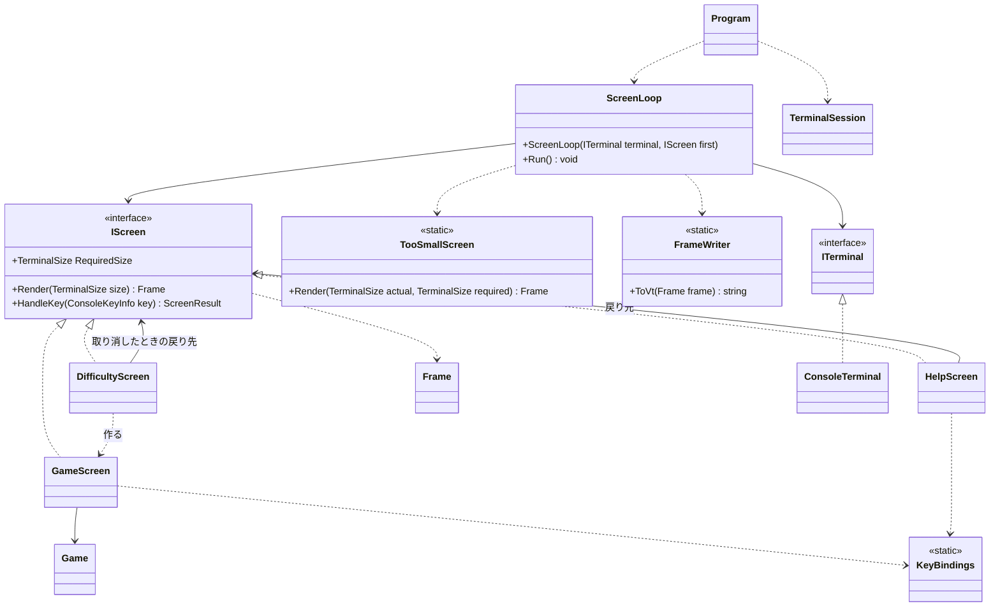
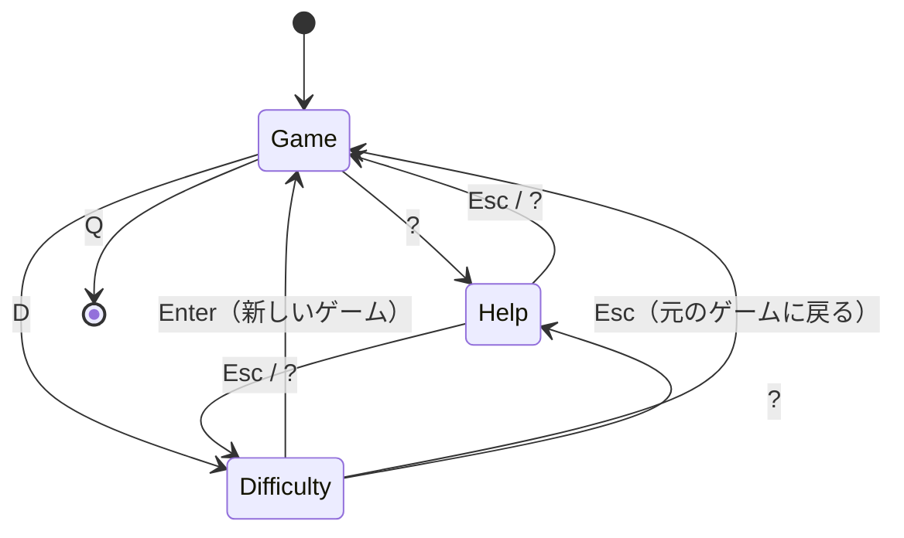

# T1: コンソール版の画面まわりの型の設計

## 0. 置いた仮定

ユーザーに聞けないので、次のように仮定して進めた。

| # | 仮定 |
|---|------|
| A1 | ルールのライブラリには `Game`（`Open(Position)`、`ToggleFlag(Position)`、`State`（Playing / Won / Lost）、`RemainingMines`、`Board`）と `Board`（`Rows`、`Columns`、`this[Position]` でマスの状態を返す）がある。経過時間は `Game` が持っていないので、画面の側で測る。 |
| A2 | 難易度は `Difficulty`（初級 9×9・10、中級 16×16・40、上級 16×30・99）で、ルールのライブラリにある。カスタムの入力は課題の 3 つの画面に入っていないので、作らない（6 章）。 |
| A3 | 画面の文言は日本語である。日本語は端末で 2 桁を使うので、表示の幅を数える処理が要る。盤面は ASCII の記号だけで描く。 |
| A4 | Windows 11 の端末（Windows Terminal と conhost）と Linux の端末は VT のシーケンスを解釈する。Windows で VT の出力が無効な場合の対処は `TerminalSession` の中に閉じ込める（5 章）。 |
| A5 | 操作はキーボードだけである。マウスは使わない。 |

## 1. 方針（設計の理由の要点）

1. **画面は「状態 → 描く内容（`Frame`）」と「キー → 次の画面」の 2 つの純粋な処理にする。** 画面の型は `Console` に触れない。だから xUnit で、状態とキーを与えて、返った `Frame` の文字と次の画面を確かめられる。これが「画面の単位で単体テストしたい」の答えである。
2. **`Console` に触れるのは、薄い 2 つの型（`ConsoleTerminal`、`TerminalSession`）だけにする。** ここはテストしない代わりに、判断を持たせない（読む・書く・大きさを返す、だけ）。
3. **VT のシーケンスを作るのは `FrameWriter` の 1 か所だけにする。** 画面の型はエスケープ シーケンスを知らない。`FrameWriter` は `Frame` から文字列を作る純粋な関数なので、これもテストできる。
4. **「端末が小さすぎる」は、画面の遷移ではなく、描く時の判断にする。** 画面は自分が要る大きさ（`RequiredSize`）を答えるだけで、足りないときにループが代わりに「端末を大きくしてください」を描く。こうすると、端末を大きくし直したときに、元の画面の状態がそのまま戻る（遷移で行き来させると、戻り先を覚える仕組みが要る）。
5. **時刻は `TimeProvider` で受け取る。** 経過時間の表示を、テストで時刻を決めて確かめるため。.NET の標準の型なので、ライブラリは増えない（テストでは `GetUtcNow` を上書きした小さな偽物を自分で書く）。

## 2. 型の一覧

| 型 | 種類 | 責務 | テスト |
|----|------|------|--------|
| `Program` | static class | 端末の準備と後始末を張り、最初の画面でループを回す | しない（配線だけ） |
| `ScreenLoop` | class | 端末の大きさを見て描き、キーを待って画面に渡し、次の画面に替える。終わるまで繰り返す | 偽の `ITerminal` で |
| `IScreen` | interface | 1 つの画面の契約（要る大きさ、描く、キーを受ける） | — |
| `GameScreen` | sealed class | 1 回のゲーム（`Game`、カーソル、開始時刻）を持ち、盤面・残り地雷数・経過時間・結果を描く | する |
| `DifficultyScreen` | sealed class | 難易度の一覧と選択中の行を持ち、決めたら新しい `GameScreen` を返す | する |
| `HelpScreen` | sealed class | キーの説明を描き、閉じたら元の画面を返す | する |
| `TooSmallScreen` | static class | 「端末を大きくしてください」と、今の大きさ・要る大きさを描く | する |
| `ScreenResult` | readonly record struct | キーを受けた結果（同じ画面のまま / 別の画面へ / 終了） | — |
| `KeyBindings` | static class | キーと操作（`GameCommand`）の対応表。`GameScreen` とヘルプの文言が同じ表を使う | する |
| `GameCommand` | enum | ゲームの画面の操作（上下左右、開く、旗、新しいゲーム、難易度、ヘルプ、終了） | — |
| `Frame` / `FrameBuilder` | sealed class | 描く内容。行ごとの、色の付いた文字の並び | する |
| `Span` / `Style` | readonly record struct | 文字列とその見た目（前景色、太字、反転） | — |
| `TextWidth` | static class | 文字列の端末での表示の幅（全角は 2） | する |
| `FrameWriter` | static class | `Frame` を VT のシーケンスの文字列にする | する |
| `ITerminal` | interface | 端末の大きさ、キーを待つ、文字列を書く | — |
| `ConsoleTerminal` | sealed class | `ITerminal` を `System.Console` で実装する | しない（薄い） |
| `TerminalSession` | sealed class, `IDisposable` | 代替の画面バッファー、カーソルの非表示、Ctrl+C の扱いを始め、必ず元に戻す | 手で確かめる |
| `TerminalSize` | readonly record struct | 幅と高さ。`Contains(TerminalSize)` で足りるかを答える | する |

## 3. 型の関係



画面の行き来は次のとおりである。



- ヘルプは、開いた画面（ゲームか難易度）を戻り先として受け取る。どの画面からでも開けて、戻ったときに元の状態が残る。
- 難易度の画面は、取り消したときの戻り先（元のゲームの画面）を受け取る。元のゲームは続けられる。
- 小さすぎる画面は遷移の外にある（1 の 4）。

## 4. 主なシグネチャ

### 4.1 画面の契約

```csharp
public interface IScreen
{
    /// この画面を描くのに要る端末の大きさ。ゲームの画面では難易度で変わる。
    TerminalSize RequiredSize { get; }

    /// size は RequiredSize を満たすことを呼ぶ側が保証する（満たさないときは呼ばない）。
    Frame Render(TerminalSize size);

    ScreenResult HandleKey(ConsoleKeyInfo key);
}

public readonly record struct ScreenResult
{
    public static ScreenResult Stay { get; }
    public static ScreenResult Quit { get; }
    public static ScreenResult GoTo(IScreen next);

    public IScreen? Next { get; }      // GoTo のときだけ
    public bool IsQuit { get; }
}
```

`HandleKey` が `IScreen?`（null が終了）を返す形も考えたが、null の意味を読み手が覚える必要があるので、名前の付いた 3 つの結果にした。画面の積み重ね（スタック）の仕組みは作らない。戻り先が要るのはヘルプと難易度の 2 つだけで、コンストラクターで受け取れば足りる。

### 4.2 各画面

```csharp
public sealed class GameScreen : IScreen
{
    public GameScreen(Difficulty difficulty, TimeProvider clock);
    // テスト用に盤面を決めて始める。Game を外から渡せるようにしておく。
    public GameScreen(Game game, TimeProvider clock);

    public TerminalSize RequiredSize { get; }   // 盤面の列×2＋枠、行＋見出し2行＋案内1行
    public Frame Render(TerminalSize size);     // 盤面は size の中央に置く
    public ScreenResult HandleKey(ConsoleKeyInfo key);

    // テストで状態を確かめるための読み取り専用
    public Position Cursor { get; }
    public Game Game { get; }
}

public sealed class DifficultyScreen : IScreen
{
    public DifficultyScreen(Difficulty current, IScreen cancelTarget, TimeProvider clock);
    public int SelectedIndex { get; }
    // ↑↓ で選ぶ、Enter で new GameScreen(選んだ難易度) へ、Esc で cancelTarget へ
}

public sealed class HelpScreen : IScreen
{
    public HelpScreen(IScreen returnTarget);
    // 文言は KeyBindings.Describe() から作る
}

public static class TooSmallScreen
{
    public static Frame Render(TerminalSize actual, TerminalSize required);
}
```

- **経過時間**: `GameScreen` は最初にマスを開いたときに `clock.GetUtcNow()` を開始時刻として持ち、勝敗が決まったときに終了時刻を持つ。`Render` は「終了時刻か今」と開始時刻の差を描く。表示は 999 秒で止める。
- **カーソル**: 盤面の外に出ない（端で止まる。回り込みはしない）。カーソルのマスは `Style.Inverse` で描く。
- **盤面の記号**（色だけに頼らない）: 未開放 `#`、旗 `F`、開放済みの空白 `.`、数字 `1`〜`8`、地雷 `*`、誤った旗 `X`。1 マスを 2 桁（空白＋記号）にして、縦横の見た目の比を近づける。上級（30 列）で幅 62、高さ 20 程度になり、80×24 に収まる。

### 4.3 キーの対応

```csharp
public enum GameCommand { Up, Down, Left, Right, Open, Flag, NewGame, ChooseDifficulty, Help, Quit }

public static class KeyBindings
{
    public static GameCommand? ToCommand(ConsoleKeyInfo key);
    public static IReadOnlyList<(string Keys, string Description)> Describe();
}
```

矢印と WASD で移動、Space か Enter で開く、F で旗、N で新しいゲーム、D で難易度、? でヘルプ、Q で終了とする。対応表を 1 か所に置くのは、ヘルプに書くキーと実際に効くキーが食い違わないようにするためである。

### 4.4 描く内容と VT

```csharp
public readonly record struct Style(TerminalColor Foreground = TerminalColor.Default, bool Bold = false, bool Inverse = false);
public readonly record struct Span(string Text, Style Style);

public sealed class Frame
{
    public TerminalSize Size { get; }
    public IReadOnlyList<IReadOnlyList<Span>> Lines { get; }
    public string PlainText(int line);   // テストで行の文字だけを比べる
}

public sealed class FrameBuilder
{
    public FrameBuilder(TerminalSize size);
    public FrameBuilder Write(int line, int column, string text, Style style = default);
    public FrameBuilder WriteCentered(int line, string text, Style style = default);
    public Frame Build();
}

public static class TextWidth
{
    public static int Of(string text);   // 東アジアの全角の範囲を 2、それ以外を 1 と数える
}

public static class FrameWriter
{
    /// カーソルを左上に置き、各行を「スタイル＋文字＋行末まで消す（CSI K）」で書き、
    /// 最後に画面の残りを消す（CSI J）。スタイルは変わったときだけ SGR を出す。
    public static string ToVt(Frame frame);
}
```

### 4.5 端末

```csharp
public readonly record struct TerminalSize(int Width, int Height)
{
    public bool Contains(TerminalSize required);
}

public interface ITerminal
{
    TerminalSize Size { get; }
    /// timeout の間にキーが来たら true。来なければ false（経過時間を描き直すため）。
    bool TryReadKey(TimeSpan timeout, out ConsoleKeyInfo key);
    void Write(string vt);
}

public sealed class ConsoleTerminal : ITerminal { /* Console.WindowWidth/Height, KeyAvailable, ReadKey(true), Out.Write */ }

public sealed class TerminalSession : IDisposable
{
    public static TerminalSession Start();  // 代替の画面バッファー（CSI ?1049h）、カーソル非表示（CSI ?25l）、TreatControlCAsInput = true
    public void Dispose();                  // 逆の順で戻す（CSI ?25h、CSI ?1049l、SGR のリセット）
}
```

### 4.6 ループ

```csharp
public sealed class ScreenLoop
{
    public ScreenLoop(ITerminal terminal, IScreen first);
    public void Run();
}
```

`Run` の 1 回りは次のとおりである。

1. `terminal.Size` を読む。`size.Contains(screen.RequiredSize)` なら `screen.Render(size)`、そうでなければ `TooSmallScreen.Render(size, screen.RequiredSize)` で `Frame` を作る。
2. `FrameWriter.ToVt(frame)` の文字列が前回と同じなら書かない。違えば 1 回の `Write` で書く（ちらつきを抑える）。
3. `TryReadKey(200 ミリ秒)` でキーを待つ。来なければ 1 に戻る（経過時間と端末の大きさの変化は、これで拾う）。
4. 小さすぎる間は、Q と Ctrl+C（終了）だけを受け、ほかのキーは捨てる。見えない盤面を操作させないためである。
5. Ctrl+C はどの画面でも終了にする。それ以外は `screen.HandleKey(key)` の結果に従う。

`Program` は次の形である。

```csharp
using var session = TerminalSession.Start();
new ScreenLoop(new ConsoleTerminal(), new GameScreen(Difficulty.Beginner, TimeProvider.System)).Run();
```

`using` により、例外で抜けても端末が元に戻る。

## 5. テストの形

| 対象 | 確かめ方の例 |
|------|--------------|
| `GameScreen` | 盤面を決めた `Game` と偽の時計で作り、`HandleKey(→)` の後の `Cursor`、`HandleKey(Space)` の後のマスの状態、`Render` の行の `PlainText` に `010`（残り地雷数）や `005`（時計を 5 秒進めた後）が出ること、`?` で `HelpScreen` への `GoTo` が返ること |
| `DifficultyScreen` | ↓ と Enter で、中級の `GameScreen` への `GoTo` が返ること。Esc で渡した戻り先が返ること |
| `HelpScreen` | `KeyBindings.Describe()` のすべての行が描かれること。Esc で戻り先が返ること |
| `TooSmallScreen` / `ScreenLoop` | 偽の `ITerminal`（大きさとキーの列を決め、書かれた文字列を貯める）で、40×10 のときに「端末を大きくしてください」が書かれ、大きさを 80×24 に替えるとゲームの画面が書かれること。小さい間の Space でゲームが変わらないこと |
| `FrameWriter` | 1 行の `Frame` から、期待する SGR・CSI K・CSI J を含む文字列ができること |
| `TextWidth` | `"abc"` は 3、`"端末"` は 4 |

`ConsoleTerminal` と `TerminalSession` は `Console` をそのまま呼ぶだけなので、単体テストせず、Windows 11 の Windows Terminal と Linux の端末で動かして確かめる（大きさを変える、Ctrl+C で抜けた後に端末が元に戻る、など）。Windows で VT の出力が無効な端末があれば、その対処（コンソールのモードの設定）は `TerminalSession.Start` の中だけに足す。

## 6. 作らないことにしたもの

| 作らないもの | 理由 |
|--------------|------|
| 前回との差分だけを書く描画 | 盤面は最大で 30×16 で、画面全体を 1 回の `Write` で書いても十分に速い。変わらなければ書かない（4.6 の 2）ので、1 秒に 1 回程度しか書かない。ちらつきが実際に見えたら `FrameWriter` の中で足せる |
| 画面の積み重ね（ナビゲーターやスタック） | 戻り先が要るのは 2 つの画面だけで、コンストラクターで受け取れば足りる |
| 部品（ボタン、リストなど）の汎用の枠組み、レイアウトの仕組み | 画面は 3 つと固定の 1 つだけ。`FrameBuilder` の `Write` と `WriteCentered` で描ける |
| 盤面のスクロール | 端末が狭いときは「端末を大きくしてください」を出す、と課題で決まっている |
| 描画用の別のスレッドやタイマー | キーを待つ時間に上限を付けたループ（4.6 の 3）で、経過時間を描き直せる。スレッドをまたぐ状態の共有を避けられる |
| カスタムの難易度の入力 | 課題の 3 つの画面に入っていない（A2）。足すときは `DifficultyScreen` の一覧に 1 行と、入力の画面を 1 つ足す |
| マウス、色のテーマ、設定のファイル、ベストタイム | 課題に求められていない |
| DI のコンテナー | 組み立ては `Program` の 1 行で済む |
| `ITerminal` の Windows 用・Linux 用の 2 つの実装 | .NET の `System.Console` と VT で両方に同じコードが動く。違いが出たら `TerminalSession` の中で分ける |
