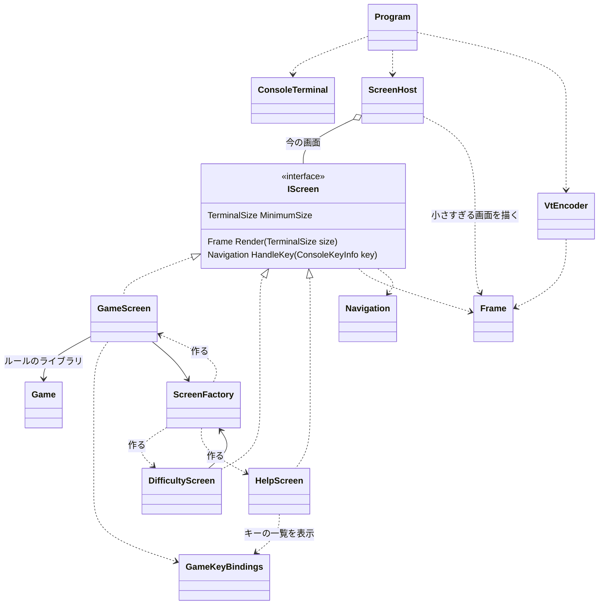

# T1 コンソール版の画面まわりの型の設計

## 0. 置いた仮定

質問できないため、次の仮定を置いて設計した。

| # | 仮定 |
|---|------|
| A1 | ルールのライブラリには、`Game`（`Board Board`、`GameState State`（`Ready`/`Playing`/`Won`/`Lost`）、`int RemainingMines`、`Open(Position)`、`ToggleFlag(Position)`、`Chord(Position)`）、`Board`（`Width`、`Height`、`this[Position]` で `Cell`）、`Cell`（`IsOpen`、`IsFlagged`、`IsMine`、`AdjacentMines`）、`Position`、`Difficulty`（初級・中級・上級の 3 つの既定値と、幅・高さ・地雷の数）がある。`new Game(Difficulty)` で始められ、盤面を決めたゲームもテストのために作れる |
| A2 | 経過時間はルールのライブラリが持たない。画面の側で測る |
| A3 | 難易度はこの課題では初級・中級・上級の 3 つとする（カスタムは課題に書かれていないので入れない。入れるときは難易度の画面に入力欄を足す） |
| A4 | 操作はキーボードだけ（マウスは使わない）。カーソルを矢印キー（と h/j/k/l）で動かし、Space/Enter で開く、F で旗、C（または開いた数字で Space）で周りを開く、R でやり直し、D で難易度、? でヘルプ、Q で終了 |
| A5 | ヘルプを見ている間も時間は進む（止める仕組みを足さない） |
| A6 | 画面の文言は日本語。全角の文字は端末で 2 桁を占める |

## 1. 全体の考え方

テストしたいのは「どのキーで何が起きるか」と「何が描かれるか」である。そこで、**画面は端末に触らず、描く内容を `Frame`（文字と色の格子）として返し、次に行く先を `Navigation` として返す**だけにする。端末への書き出しと VT のシーケンスへの変換は、画面の外の 2 つの型に分ける。

```
キー ──▶ ScreenHost ──▶ IScreen.HandleKey ──▶ Navigation（留まる / 移る / 終わる）
端末の大きさ ──▶ ScreenHost.Render ──▶ IScreen.Render ──▶ Frame ──▶ VtEncoder.Encode ──▶ string ──▶ ConsoleTerminal.Write
```

- 単体テストの対象: `Frame`、`TextWidth`、`VtEncoder`、`ScreenHost`、3 つの画面、`GameKeyBindings`。すべて `Console` に触らない純粋な型なので、xUnit でそのまま確かめられる。
- 単体テストの対象外: `ConsoleTerminal` と `Program` の回し方（数行）。本物の端末（Windows Terminal、Linux の端末）で動かして確かめる。



## 2. 型の一覧

### 2.1 描く内容（端末に依存しない）

**`readonly record struct TerminalSize(int Width, int Height)`**
- 端末の桁数と行数。
- `bool CanContain(TerminalSize required)` … 幅も高さも足りるか。

**`enum TerminalColor`** … VT の 16 色（`Default`、`Black`、`Red`、…、`BrightWhite`）。SGR の 30〜37・90〜97 に対応する。256 色や RGB は使わない（どの端末でも同じに見えるように）。

**`readonly record struct CellStyle(TerminalColor Foreground, TerminalColor Background, bool Bold = false, bool Inverse = false)`**
- `static CellStyle Default`。
- カーソルの位置は `Inverse` で表す（色だけに頼らない）。

**`sealed class Frame`** … 1 画面ぶんの文字と色の格子。
- `Frame(TerminalSize size)`（空白で埋める）
- `TerminalSize Size { get; }`
- `void Write(int row, int column, string text, CellStyle style)` … 全角は 2 桁を占め、右隣の桁を「続き」として印を付ける。はみ出た分は切り捨てる（例外にしない。小さすぎる画面のメッセージが端末より長い場合もあるため）。
- `void WriteCentered(int row, string text, CellStyle style)` … よく使う中央寄せ。
- `string RowText(int row)` … 行の文字列（続きの桁は飛ばす）。テストの確かめに使う。
- `CellStyle StyleAt(int row, int column)` … テストで色・反転を確かめる。
- 内部は `(char Glyph, CellStyle Style, bool IsContinuation)` の 2 次元配列。

**`static class TextWidth`**
- `static int Of(char c)` / `static int Of(string text)` … 端末での桁数。CJK・全角の範囲を 2、それ以外を 1 とする。
- 盤面には「幅があいまいな文字」（■、・、● など。端末と言語の設定で 1 桁にも 2 桁にもなる）を使わず、ASCII だけを使う。これで Windows と Linux で盤面の桁がずれない。

**`readonly record struct Navigation`** … キーを受けた後の行き先。
- `static Navigation Stay` … 今の画面に留まる。
- `static Navigation To(IScreen next)` … 別の画面に移る。
- `static Navigation Quit` … アプリを終える。
- `IScreen? Next { get; }`、`bool IsQuit { get; }`。
- `null` を「終了」の意味に使わず、名前で分ける（読み手が取り違えないように）。

### 2.2 画面

**`interface IScreen`**
- `TerminalSize MinimumSize { get; }` … この画面を描くのに要る大きさ。ゲームの画面は難易度で変わる。
- `Frame Render(TerminalSize size)` … 前提: `size.CanContain(MinimumSize)`。`ScreenHost` が保証する。
- `Navigation HandleKey(ConsoleKeyInfo key)`
- キーは `System.ConsoleKeyInfo` をそのまま受ける。コンストラクターで作れるのでテストで困らず、自前のキーの型は要らない。

**`sealed class GameScreen : IScreen`** … 遊ぶ画面。
- `GameScreen(Game game, Difficulty difficulty, ScreenFactory screens, TimeProvider time)`
- 責務: カーソルの位置を持つ、キーを `GameKeyBindings` で操作に変えて `Game` を呼ぶ、残りの地雷の数・経過時間・勝ち負けの表示・盤面を `Frame` に描く、経過時間を測る。
- 経過時間: 最初に開いたときに `time.GetTimestamp()` を覚え、勝ち負けが決まったら止める。`TimeProvider` は .NET の標準の型なので、自前の時計の型は作らない。テストでは `TimeProvider` を継承した小さな偽物（`GetTimestamp` を返すだけ）を使う。
- 盤面の描き方: 1 マスを 2 桁（文字 + 空白）で描き、縦横の比を正方形に近づける。未開放 `.`、旗 `F`、地雷 `*`、誤った旗 `X`、開いた空白 ` `、数字 `1`〜`8`（数字ごとに色も付けるが、文字で区別できる）。カーソルのマスは反転。
- `MinimumSize` = 幅 `max(Board.Width * 2 + 2, 見出しの幅)`、高さ `Board.Height + 5`（見出し 1、罫線 2、状態の行 1、キーの案内 1）。
- 行き先: `R` → `To(screens.Game(difficulty))`、`D` → `To(screens.Difficulty(returnTo: this))`、`?` → `To(screens.Help(returnTo: this))`、`Q` → `Quit`、その他 → `Stay`。
- カーソルの移動と盤面の文字の決め方は、今はこの型の private メソッドに置く（`Render` と `HandleKey` を通してテストできる）。大きくなったら切り出す。

**`sealed class DifficultyScreen : IScreen`** … 難易度を選ぶ画面。
- `DifficultyScreen(ScreenFactory screens, IScreen returnTo)`
- 責務: 3 つの難易度の一覧（名前、幅×高さ、地雷の数）と選択中の行を描く。上下で選び、Enter で `To(screens.Game(選んだ難易度))`、Esc で `To(returnTo)`（遊んでいたゲームに戻る）。1/2/3 で直接選べる。

**`sealed class HelpScreen : IScreen`** … ヘルプの画面。
- `HelpScreen(IScreen returnTo)`
- 責務: ルールの短い説明と、`GameKeyBindings.All` から作ったキーの一覧を描く。Esc・?・Q で `To(returnTo)`。
- キーの一覧を手で書かず `GameKeyBindings` から作るので、キーを変えてもヘルプが古くならない。
- スクロールは作らない。`MinimumSize` を中身から計算し、それより小さい端末では「大きくしてください」を出す。

**`enum GameCommand`** … `MoveUp`、`MoveDown`、`MoveLeft`、`MoveRight`、`Open`、`ToggleFlag`、`Chord`、`Restart`、`ChooseDifficulty`、`ShowHelp`、`Quit`。

**`static class GameKeyBindings`**
- `static GameCommand? Find(ConsoleKeyInfo key)` … キーから操作へ。大文字・小文字を区別しない。
- `static IReadOnlyList<KeyBinding> All` … `record KeyBinding(string KeysLabel, string Description, GameCommand Command)`。ヘルプの表示と、画面の下の案内に使う。
- 押し方と説明を 1 か所に置くことが目的である。

**`sealed class ScreenFactory`** … 画面を作る。依存（`TimeProvider`、ゲームの作り方）をここに集める。
- `ScreenFactory(TimeProvider time, Func<Difficulty, Game> newGame)`
- `IScreen Game(Difficulty difficulty)`、`IScreen Difficulty(IScreen returnTo)`、`IScreen Help(IScreen returnTo)`
- これがないと、難易度の画面が `TimeProvider` などを知る必要が出る。テストでは `newGame` に盤面を決めたゲームを返す関数を渡す。
- インターフェースにはしない（実装は 1 つで、テストでも本物を使える）。

### 2.3 画面の切り替えと「小さすぎる」

**`sealed class ScreenHost`** … 今の画面を持ち、キーと描画を振り分ける。
- `ScreenHost(IScreen first)`
- `IScreen Current { get; }`、`bool IsFinished { get; }`
- `void HandleKey(ConsoleKeyInfo key)`
  - Ctrl+C はどの画面でも終了（`Console.TreatControlCAsInput = true` にして、キーとして受ける。後始末を確実に行うため）。
  - 端末が今の画面に小さすぎる間は、`Q` での終了だけを受け、ほかのキーは捨てる（見えない盤面を操作させない）。
  - それ以外は `Current.HandleKey` に渡し、`Navigation` に従って `Current` を替えるか終える。
  - そのために、最後に `Render` に渡された大きさを覚えておく。
- `Frame Render(TerminalSize size)`
  - `size.CanContain(Current.MinimumSize)` なら `Current.Render(size)`。
  - 足りなければ、「端末を大きくしてください」、今の大きさと要る大きさ（例: `いま 50×12 / 必要 62×21`）、「Q: 終了」を中央に描いた `Frame` を返す。
- 「小さすぎる」は画面（`IScreen`）にせず、ここで描く。どの画面の上にも重なる状態で、大きくすれば元の画面にそのまま戻るからである。画面にすると、戻り先を覚える仕組みが要る。

### 2.4 端末（ここだけが `System.Console` に触る）

**`static class VtEncoder`**
- `static string Encode(Frame frame)` … `Frame` を 1 つの文字列の VT のシーケンスに変える。純粋な関数なのでテストできる。
  - 各行を `ESC[{行};1H` で位置を決めて書き、行末の空白は省いて `ESC[K` で消す。最後に `ESC[0m` と `ESC[J`（下の残りを消す）。
  - 改行を使わないので、右下の桁まで書いても画面がスクロールしない。
  - 色は、前の桁と違うときだけ SGR（`ESC[...m`）を出す。
  - 端末が大きくなったとき、前の描画の残りは `ESC[K` と `ESC[J` で消える。

**`sealed class ConsoleTerminal : IDisposable`**
- `static ConsoleTerminal Open()` … 準備: 出力を UTF-8 にする、Windows では標準出力に `ENABLE_VIRTUAL_TERMINAL_PROCESSING` を立てる（`SetConsoleMode` の P/Invoke。ライブラリではない）、代替画面 `ESC[?1049h`、カーソルを隠す `ESC[?25l`、`TreatControlCAsInput = true`。
- `TerminalSize Size { get; }` … `Console.WindowWidth` / `WindowHeight`。
- `bool TryReadKey(out ConsoleKeyInfo key)` … `KeyAvailable` を見て、あれば `ReadKey(intercept: true)`。
- `void Write(string vt)` … 1 回の `Write` と `Flush` で書く（ちらつかないように）。
- `Dispose()` … 後始末: カーソルを戻し、代替画面を抜け、コンソールのモードと設定を元に戻す。`Program` は `using` と `try/finally` で必ず呼ぶ。

**`Program`（回し方）**

```csharp
using var terminal = ConsoleTerminal.Open();
var screens = new ScreenFactory(TimeProvider.System, d => new Game(d));
var host = new ScreenHost(screens.Game(Difficulty.Beginner));
string? shown = null;
while (!host.IsFinished)
{
    while (terminal.TryReadKey(out var key)) host.HandleKey(key);
    var vt = VtEncoder.Encode(host.Render(terminal.Size));
    if (vt != shown) { terminal.Write(vt); shown = vt; }   // 変わったときだけ書く
    Thread.Sleep(50);
}
```

- 約 50 ms ごとに、キー、端末の大きさ、経過時間の表示の変化を見る。大きさが変われば `Frame` が変わり、文字列が変わるので描き直される。経過時間も 1 秒ごとに文字列が変わって描き直される。
- 端末の大きさの変化の通知（Linux の SIGWINCH など）は使わない。Windows と Linux で同じ方法で済み、どのみちキーと時間のために回しているからである。

## 3. テストの例（xUnit）

| 対象 | 例 |
|------|----|
| `Frame` | 全角の文字列を書くと、`RowText` が元の文字列になり、2 桁を占める／右端を越えた分は切り捨てられる |
| `TextWidth` | `'あ'` は 2、`'A'` は 1 |
| `VtEncoder` | 1 行の `Frame` が `ESC[1;1H...ESC[K` を含む／同じ色が続くと SGR を繰り返さない／改行を含まない |
| `GameScreen` | 右矢印でカーソルが動き、反転の位置が変わる／右端でそれ以上動かない／Space で開くと数字が描かれる／地雷を開くと負けの表示と `*` が出る／偽の `TimeProvider` を 3 秒進めると `003` と描かれる／勝った後は時間が進まない／`?` で `HelpScreen` への `Navigation` を返す |
| `DifficultyScreen` | 下・Enter で中級の `GameScreen` に移り、その `MinimumSize` が中級の盤面に合う／Esc で `returnTo` に戻る |
| `HelpScreen` | `GameKeyBindings.All` のすべての説明が描かれている／Esc で `returnTo` に戻る |
| `ScreenHost` | 上級で 40×20 のとき「端末を大きくしてください」と要る大きさが描かれる／その間 Space を押しても盤面は変わらない／大きくすると元のゲームの画面に戻る／Ctrl+C と Q で `IsFinished` |

## 4. 作らないことにしたもの

| 作らないもの | 理由 |
|--------------|------|
| 端末のインターフェース（`ITerminal`）と偽の端末 | テストの継ぎ目を `Frame` と `Navigation` に置いたので、`Console` に触るのは `ConsoleTerminal` と数行の回し方だけになった。そこは偽物で確かめても意味が薄く、本物の端末で確かめる |
| 差分の描画（前の `Frame` と比べて変わった桁だけ書く） | 最大でも 1 画面は数千字で、`ESC[H` からの描き直しを 1 回の `Write` で行えばちらつかない。変わらないときは文字列の比較で書かない |
| 画面のスタック（Push/Pop） | 戻り先はヘルプと難易度の画面の 1 段だけなので、`returnTo` を渡せば済む |
| 自前のキーの型・時計の型 | `ConsoleKeyInfo` と `TimeProvider` が標準にあり、テストでも作れる |
| カーソルや盤面の描き方の別の型（`BoardCursor`、`BoardView` など） | 使うのは `GameScreen` だけで、`GameScreen` を通してテストできる。ほかの画面や別の版で要るようになったら切り出す |
| ヘルプのスクロール、画面の文言の多言語化、色のテーマの設定、マウス、カスタムの難易度、効果音、演出 | 課題の要求にない（A3、A4） |
| 大きさの変化の通知の購読 | 50 ms ごとの確認で足り、OS ごとの違いを持ち込まない |
