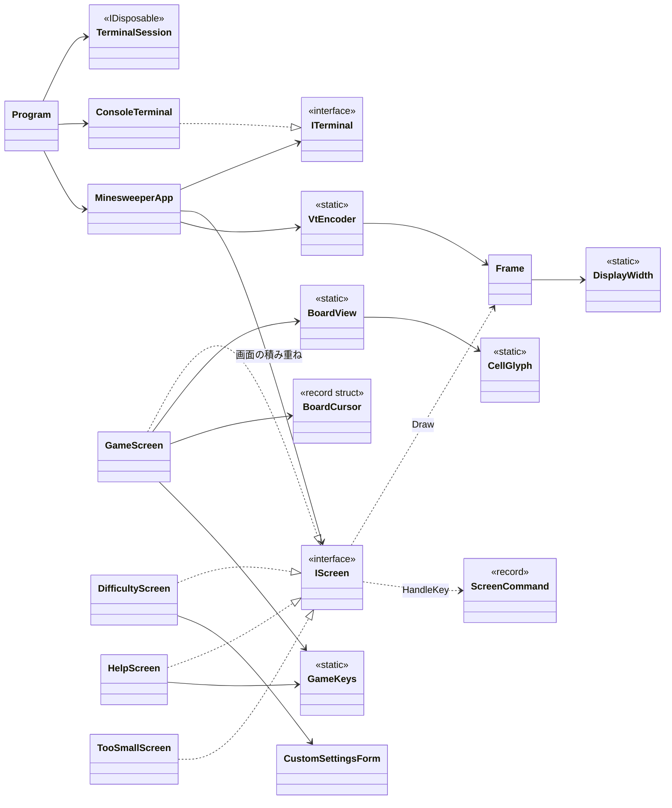
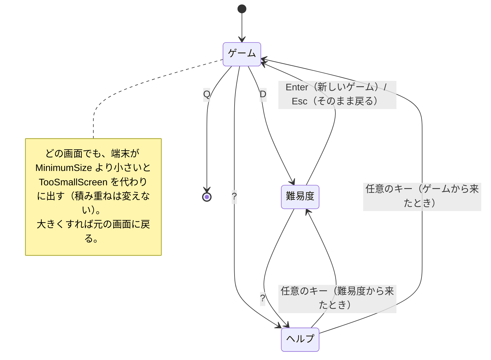

# T1 コンソール版の画面まわりの型の設計

## 1. 仮定

課題に書かれていないことは、次のように仮定した。

- ルールのライブラリには、少なくとも次がある。`GameSettings`（列数・行数・地雷数。初級・中級・上級の定数と、カスタムの範囲の検証 `GameSettings.TryCreate(int, int, int, out GameSettings)`）、`Game`（`Open(column, row)`、`ToggleFlag(column, row)`、`OpenAround(column, row)`、`State`（Ready / Playing / Won / Lost）、`RemainingMines`、`Board`）、`Board`（`Columns`、`Rows`、`this[column, row]` でマスの状態を返す）。地雷の配置の乱数は `Game` を作る側が決められる。
- 経過時間は `Game` が持たない。画面の側で `TimeProvider` から測る。
- 画面の文言は日本語である。画面の大きさの単位は端末の「列（セル）」で、日本語の全角文字は 2 列を使う。
- 盤面は 1 マスを 2 列（記号 1 文字と空白）で描き、記号は ASCII だけにする（`.` 未開放、`F` 旗、`*` 地雷、`X` 誤った旗、`1`〜`8`、空白）。
- 操作は矢印キー（と hjkl）でカーソルを動かし、Space/Enter で開く、F で旗、A で周りを開く、R でやり直し、D で難易度、?（または H）でヘルプ、Q で終了。
- 端末の大きさが変わったことは、キー入力を待つ間に大きさを見に行って知る（250 ms ごと）。
- Windows 11 の端末（Windows Terminal と従来のコンソール）で VT のシーケンスを使えるように、起動時に出力のモードに `ENABLE_VIRTUAL_TERMINAL_PROCESSING` を立てる（kernel32 の P/Invoke。外部のライブラリではない）。

## 2. 全体の構成

考え方は一つで、**「画面は、キーを受けて次にすることを返し、決まった大きさの `Frame`（文字と装飾の格子）に自分を描くだけ」** にする。端末に触れる（大きさを読む、キーを読む、VT のシーケンスを書く）のは、端（`ConsoleTerminal`、`TerminalSession`、`VtEncoder`）だけに置く。こうすると、画面の単位は `Frame` とキーだけで xUnit から確かめられる。



依存の向きは、`Program` → `MinesweeperApp` → 各画面 → `Frame` とルールのライブラリ、である。画面は `System.Console` にも VT のシーケンスにも依存しない。画面どうしも互いを知らない（遷移は `ScreenCommand` というデータで表し、`MinesweeperApp` が解釈する）。

## 3. 型の一覧

### 3.1 端末の境界（単体テストの対象外。実際の端末で確かめる）

```csharp
// 端末の準備と後始末。Dispose で必ず元に戻す。
sealed class TerminalSession : IDisposable
{
    public static TerminalSession Start();   // UTF-8、VT の有効化（Windows）、代替画面 ESC[?1049h、カーソルを隠す ESC[?25l、TreatControlCAsInput = true
    public void Dispose();                   // 逆の順で戻す（カーソルを出す、代替画面を抜ける、コンソールのモードを戻す）
}

// 画面の外の世界。MinesweeperApp はこれだけを通して端末に触る。
interface ITerminal
{
    TerminalSize Size { get; }
    ConsoleKeyInfo? ReadKey(TimeSpan timeout);   // timeout までに押されなければ null
    void Write(string text);
}

sealed class ConsoleTerminal : ITerminal   // System.Console による実装（KeyAvailable を短い間隔で見る）
```

- `TerminalSession` は `Program.Main` の `using` で使い、例外で落ちても端末を戻す。Ctrl+C はキーとして受け（`TreatControlCAsInput`）、終了の操作として扱うので、シグナルで途中で抜けて端末が壊れたままになることがない。

### 3.2 描画の単位（純粋。テストする）

```csharp
readonly record struct TerminalSize(int Width, int Height)
{
    public bool CanHold(TerminalSize required);  // Width >= required.Width && Height >= required.Height
}

enum TextStyle { Normal, Emphasis, Cursor, Hidden, Number1, Number2, /* … */ Number8, Flag, Mine, WrongFlag, Error }

// 決まった大きさの文字の格子。画面はここに描き、端末には描かない。
sealed class Frame : IEquatable<Frame>
{
    public Frame(TerminalSize size);
    public TerminalSize Size { get; }
    public void Write(int column, int row, string text, TextStyle style = TextStyle.Normal); // はみ出した分は切り捨てる
    public void WriteCentered(int row, string text, TextStyle style = TextStyle.Normal);
    public IReadOnlyList<string> ToLines();          // 装飾を除いた各行（テストで絵として比べる）
    public TextStyle StyleAt(int column, int row);
    public bool Equals(Frame? other);                 // 前回と同じなら書き直さないために使う
}

static class DisplayWidth
{
    public static int Of(string text);   // 全角（East Asian Width の W/F）を 2、それ以外を 1 として数える
}

// Frame を VT のシーケンスの文字列に変える。端末に書くのは呼び出し側。
static class VtEncoder
{
    public static string Encode(Frame frame);  // 各行を ESC[{row};1H で位置を決めて書き、装飾が変わる所だけ SGR を出し、最後に ESC[0m
}
```

- 全角文字は `Frame` の中で 2 セルを占め、2 セル目は「前の文字の続き」として持つ。これで、日本語の文言の中央寄せや、はみ出しの切り捨てが列の数で正しくなる。
- 色は `TextStyle` という意味の名前で持ち、SGR の数値への対応は `VtEncoder` の 1 か所に置く。画面は色の番号を知らない。

### 3.3 画面の共通の形

```csharp
interface IScreen
{
    TerminalSize MinimumSize { get; }            // これより小さい端末では描けない
    ScreenCommand HandleKey(ConsoleKeyInfo key);
    void Draw(Frame frame);                      // frame は端末と同じ大きさ。MinimumSize 以上であることは呼び出し側が保証する
}

// 画面がキーを受けた結果、次にすること。閉じた集合。
abstract record ScreenCommand
{
    public sealed record None : ScreenCommand;                 // その画面のまま（描き直すだけ）
    public sealed record ShowHelp : ScreenCommand;
    public sealed record ShowDifficulty : ScreenCommand;
    public sealed record Back : ScreenCommand;                 // 一つ前の画面に戻る
    public sealed record NewGame(GameSettings Settings) : ScreenCommand;
    public sealed record Quit : ScreenCommand;
}
```

- `Draw` は `TimeProvider` などの「今」を引数に取らない。時間に左右されるのはゲームの画面だけなので、そこだけがコンストラクターで `TimeProvider` を受ける。

### 3.4 アプリの進行

```csharp
sealed class MinesweeperApp
{
    public MinesweeperApp(GameScreen game);          // 積み重ねの底は常にゲームの画面
    public bool Handle(ConsoleKeyInfo key, TerminalSize size); // false なら終了
    public Frame Render(TerminalSize size);          // 今の画面（小さすぎれば TooSmallScreen）を描いた Frame
    public void Run(ITerminal terminal);             // 下のループ
}
```

`Run` は次だけを行う（ここは薄く保ち、判断は `Handle` と `Render` に置く）。

```
last = null
loop:
    size  = terminal.Size
    frame = Render(size)
    if frame != last: terminal.Write(VtEncoder.Encode(frame)); last = frame
    key = terminal.ReadKey(250 ms)
    if key != null and not Handle(key, size): break
```

- 画面は `Stack<IScreen>` で持つ。底が `GameScreen`、その上に `DifficultyScreen` や `HelpScreen` が載る（難易度の画面からヘルプを開いて、戻ると難易度の画面に戻る）。
- `ScreenCommand` の解釈: `ShowHelp` → `HelpScreen` を積む。`ShowDifficulty` → 今の設定で `DifficultyScreen` を積む。`Back` → 一つ降ろす（底は降ろさない）。`NewGame(s)` → 底まで降ろして `game.StartNew(s)`。`Quit` → `false` を返す。
- 画面を作るのは `MinesweeperApp` だけである。画面どうしは互いを作らないので、画面を単体で作ってテストできる。
- 経過時間の表示は、キーがなくても 250 ms ごとに `Render` し、前回と違うときだけ書く。これで 1 秒ごとに時間が進み、ちらつきも出ない。

### 3.5 各画面

```csharp
sealed class GameScreen : IScreen
{
    public GameScreen(GameSettings settings, Func<GameSettings, Game> createGame, TimeProvider clock);
    public GameSettings Settings { get; }
    public void StartNew(GameSettings settings);
    public TerminalSize MinimumSize { get; }         // BoardView.SizeFor(列, 行) に状態の行と操作の案内の行を足した大きさ
    public ScreenCommand HandleKey(ConsoleKeyInfo key);
    public void Draw(Frame frame);                   // 上: 残り地雷・経過時間・状態（勝ち/負け）、中: 盤面、下: 主な操作の案内
}

readonly record struct BoardCursor(int Column, int Row)
{
    public BoardCursor Move(int dColumn, int dRow, int columns, int rows);   // 盤面の端で止める
}

enum GameAction { MoveUp, MoveDown, MoveLeft, MoveRight, Open, ToggleFlag, OpenAround, Restart, ShowDifficulty, ShowHelp, Quit }

// ゲームの画面のキーの割り当てと、その説明。ヘルプもここから文言を取る。
static class GameKeys
{
    public static GameAction? ToAction(ConsoleKeyInfo key);
    public static IReadOnlyList<(string Keys, string Description)> Descriptions { get; }
}

// 盤面の描画。画面の配置（どこに置くか）は GameScreen が決める。
static class BoardView
{
    public static TerminalSize SizeFor(int columns, int rows);   // 1 マス 2 列 + 枠
    public static void Draw(Frame frame, int left, int top, Board board, GameState state, BoardCursor cursor);
}

// 1 マスの見た目（記号と装飾）。状態の組み合わせを表で確かめるために分ける。
static class CellGlyph
{
    public static (char Symbol, TextStyle Style) For(CellState cell, GameState state);  // 負けた後は地雷・誤った旗を見せる
}
```

```csharp
sealed class DifficultyScreen : IScreen
{
    public DifficultyScreen(GameSettings current);   // 今の難易度に選択を合わせて開く
    public TerminalSize MinimumSize { get; }
    public ScreenCommand HandleKey(ConsoleKeyInfo key); // ↑↓ で選ぶ、Enter で NewGame(…)。カスタムを選ぶとフォームに入る。Esc で Back（フォーム中はフォームを抜ける）、? で ShowHelp
    public void Draw(Frame frame);
}

// カスタムの 3 つの欄（幅・高さ・地雷数）の入力と検証。
sealed class CustomSettingsForm
{
    public CustomSettingsForm(GameSettings initial);
    public void Type(char c);            // 数字だけを受ける（全角の数字も、下の正規化で半角になる）
    public void Backspace();
    public void NextField();             // Tab / ↓
    public void PreviousField();         // Shift+Tab / ↑
    public bool TrySubmit(out GameSettings settings, out string? error); // Trim().Normalize(FormKC) の後に解釈し、範囲は GameSettings.TryCreate に任せる
    public int FocusedField { get; }
    public IReadOnlyList<string> Texts { get; }
}

sealed class HelpScreen : IScreen
{
    public HelpScreen();                               // ルールの要約と GameKeys.Descriptions を並べる
    public TerminalSize MinimumSize { get; }           // 文言の最も長い行の表示幅と行数から計算する
    public ScreenCommand HandleKey(ConsoleKeyInfo key); // Q は Quit、それ以外は Back
    public void Draw(Frame frame);
}

// 端末が小さすぎるときの画面。積み重ねには入れず、Render と Handle のたびに差し替える。
sealed class TooSmallScreen : IScreen
{
    public TooSmallScreen(TerminalSize current, TerminalSize required);
    public TerminalSize MinimumSize => new(1, 1);
    public ScreenCommand HandleKey(ConsoleKeyInfo key); // Q・Esc・Ctrl+C は Quit、D は ShowDifficulty、それ以外は None
    public void Draw(Frame frame);  // 「端末を大きくしてください」「今 W×H / 必要 W×H」「D: 難易度  Q: 終了」。幅が足りなければ切り詰める
}
```

## 4. 画面の行き来



## 5. 端末が小さすぎるとき

- `MinesweeperApp` は、`Render` と `Handle` の最初に、積み重ねの一番上の画面の `MinimumSize` と端末の大きさを比べる。足りなければ、その画面の代わりに `TooSmallScreen(今, 必要)` を使う。画面そのものは「足りる大きさで描く」ことだけを考えればよく、小さい場合の分岐を各画面に書かない。
- 大きさを直せないとき（上級やカスタムの大きな盤面が画面に入らない）のために、`TooSmallScreen` から D で難易度の画面を開ける。難易度の画面は小さいので、たいていの端末で出せる。
- 大きさは 250 ms ごとに見るので、端末の大きさを変えれば、キーを押さなくても画面が切り替わる。大きさが変わったら、画面の全体を書き直す（前回の `Frame` と大きさが違うので `Equals` が偽になり、そのまま全体を書く）。

## 6. テストの方針（xUnit）

| 対象 | 確かめ方 |
|------|----------|
| `Frame` | 書いた文字列が `ToLines()` に出る。はみ出しの切り捨て。全角が 2 列を占め、行の端で半分にならない |
| `DisplayWidth` | ASCII、全角、半角カナの幅 |
| `VtEncoder` | 小さな `Frame` を変換した文字列に、位置の指定と SGR が期待どおりに入る（数件だけ） |
| `CellGlyph` | マスの状態 × ゲームの状態の表（`[Theory]`） |
| `BoardCursor` | 端で止まる |
| `GameKeys` | キーから操作への割り当て。`Descriptions` がすべての `GameAction` を説明している |
| `GameScreen` | 盤面を決めた `Game` を `createGame` で渡し、キーを送って `Draw` した `ToLines()` を文字の絵と比べる。自作の小さな `TimeProvider` の派生（`GetUtcNow` を返すだけ）で経過時間を進める。D/?/Q が対応する `ScreenCommand` を返す |
| `DifficultyScreen` / `CustomSettingsForm` | Enter で `NewGame` の設定。全角の数字の入力、範囲外のときのエラーの文言 |
| `HelpScreen` | 任意のキーで `Back`、`MinimumSize` が文言より小さくない |
| `TooSmallScreen` | 文言と、Q/D/その他のキーの結果 |
| `MinesweeperApp` | `Handle` と `Render` だけで遷移を確かめる（ゲーム → 難易度 → ヘルプ → 戻る、`NewGame` で底に戻る、小さい端末で `TooSmallScreen` が出て大きくすると戻る）。`Run` は、偽の `ITerminal`（キーの列を返し、書かれた文字列をためる）で、終了のキーで抜けることを 1 件だけ確かめる |

`TerminalSession` と `ConsoleTerminal` は `System.Console` を薄く包むだけなので単体テストせず、Windows Terminal、Windows の従来のコンソール、Linux の端末（GNOME 端末など）で実際に動かして確かめる（VT の有効化、終了時・例外時の後始末、Esc キーの受け方、大きさを変えたときの切り替え）。

## 7. 設計の理由

1. **描くことと書くことを分けた。** 画面が VT のシーケンスや `Console` を直接使うと、テストで出力を文字列として読み解くことになり、テストが壊れやすい。`Frame` に描かせれば、テストは「画面の絵」を行の文字列として比べられる。VT への変換は `VtEncoder` の 1 か所で、そこだけを少数のテストで押さえればよい。
2. **遷移をデータで返す。** `HandleKey` が次の画面のインスタンスや副作用ではなく `ScreenCommand` を返すので、画面は他の画面を知らず、テストは戻り値を比べるだけで済む。画面は 3 つで増える予定もないので、汎用の「任意の画面を開く」コマンドではなく、閉じた集合にした。
3. **小さすぎる場合を 1 か所で扱う。** 各画面は `MinimumSize` を宣言するだけにし、判定と差し替えは `MinesweeperApp` が行う。各画面に同じ分岐が散らばらない。
4. **キーの割り当てと説明を同じ場所（`GameKeys`）に置く。** ヘルプの説明と実際の割り当てが食い違うことを防ぐ。
5. **盤面は ASCII だけで描く。** `■` や罫線の文字は East Asian Width が「曖昧」で、日本語の設定の端末では 2 列に描かれることがあり、盤面の桁がずれる。日本語の文言（全角）は幅が決まっているので `DisplayWidth` で数えられるが、曖昧な文字は端末によって違うので使わない。
6. **全体の書き直しと「同じなら書かない」だけにした。** 最大の盤面でも 80×24 程度の文字数で、全体を 1 回の `Write` で書けばちらつかない。差分の描画は、この大きさでは要らない。
7. **時間は `TimeProvider` から取る。** .NET に標準であり、テストでは数行の派生で時刻を決められる。

## 8. 作らないことにしたもの

| 作らないもの | 理由 |
|--------------|------|
| 汎用の部品の仕組み（ウィジェット、レイアウトのエンジン、フォーカスの管理） | 画面は 3 つで、入力の欄があるのはカスタムの 3 つだけ。`Frame.Write` と `WriteCentered` で足りる |
| 差分だけを書く描画 | 上の 6。性能の問題が実機で見えたら、`VtEncoder` に前回の `Frame` を渡す形で足せる（画面側は変わらない） |
| 盤面のスクロール（端末より大きい盤面の一部を見せる） | 小さすぎる画面と難易度の変更で足りる。スクロールは、カーソルの追従、表示位置の管理が増え、テストの数も増える |
| マウスの入力 | 課題はキーでの行き来を求めている。VT のマウスの報告は端末ごとの差が大きい |
| 大きさの変化のイベント（SIGWINCH、Windows のバッファーのイベント） | OS ごとに別の実装が要る。250 ms ごとに大きさを見れば、同じことが 1 つの書き方でできる |
| 色なしの端末への切り替え、配色の設定 | 状態は記号で区別しており、色がなくても遊べる。VT を使えない古い端末は対象にしない（Windows 11 と Linux の端末は VT に対応している） |
| Unicode の East Asian Width の完全な表 | 画面に出す文字は、こちらが決めた文言（ASCII、ひらがな・カタカナ・漢字、全角の記号）だけなので、主な全角の範囲を数えれば足りる。利用者の入力は数字だけ |
| ベストタイム、効果音、多言語 | 課題の範囲の外。必要になったら、`GameScreen` の状態の行や `HelpScreen` の文言に足す形で入る |
