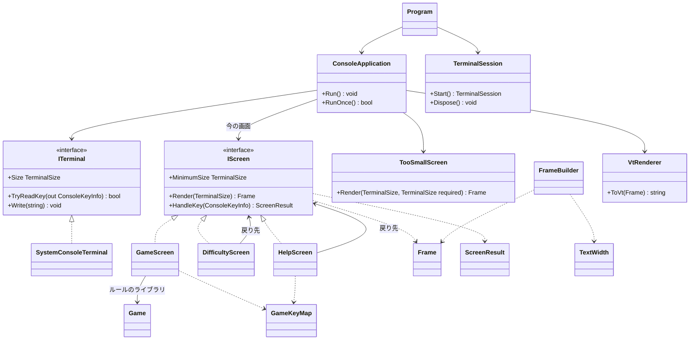

# 課題 T1: コンソール版の画面まわりの型の設計

## 0. 置いた仮定

課題に書かれていないことは、次のように仮定した。

1. ゲームのルールのライブラリには、`Game`（1 回のゲーム。開く・旗・状態・経過時間の元になる開始時刻）、`Board`（マスの状態）、`Difficulty`（幅・高さ・地雷数。初級・中級・上級の既定値あり）がある。`Game` は `Difficulty` と乱数から作れ、`Open(x, y)`、`ToggleFlag(x, y)`、`State`（Playing / Won / Lost）を持つ。
2. 難易度を選ぶ画面は、初級・中級・上級とカスタム（幅・高さ・地雷数を数字で入力）を扱う。
3. 操作はキーボードだけ（マウスは扱わない）。カーソルキーで動かし、Space/Enter で開き、F で旗、R でやり直し、D で難易度、? でヘルプ、Q で終了。ヘルプと難易度の画面は Esc で元の画面に戻る。
4. 画面の文言は日本語を含む。全角文字は端末で 2 桁を占めるので、桁の計算が要る。
5. 端末の大きさが変わったことを知る仕組みは、.NET の `System.Console` にはポータブルなものがない（Linux の SIGWINCH は `PosixSignalRegistration` で SIGWINCH を扱えないバージョンもある）。そのため、ループで `Console.WindowWidth/Height` を定期的に読んで比べる。
6. Windows 11 の既定の端末（Windows Terminal）は VT のシーケンスを解釈する。古い conhost で VT の処理が無効な場合は、端末の準備の 1 か所だけで有効にする（下の `TerminalSession`）。

## 1. 全体の形

「画面は、大きさとキーを受けて、描くもの（`Frame`）と次の行き先（`ScreenResult`）を返すだけの純粋な型」にし、`Console` に触るのは端末の型だけに閉じ込める。これで、画面の単位を xUnit で、端末なしで確かめられる。



依存の向きは、`Program` → `ConsoleApplication` → 画面 → ルールのライブラリの一方向である。画面は `Console` も `ConsoleApplication` も知らない。

## 2. 型の一覧

### 2.1 値の型（描くもの・大きさ・行き先）

| 型 | 種類 | 責務 |
|----|------|------|
| `TerminalSize` | `readonly record struct TerminalSize(int Width, int Height)` | 端末の桁数と行数。`bool Contains(TerminalSize required)` で、必要な大きさが入るかを答える |
| `TextStyle` | `enum`（`Normal, Dim, Emphasis, Reverse, Number1`…`Number8, Flag, Mine, Error` など） | 文字の見た目の意味。VT の色の番号は持たない（色の割り当ては `VtRenderer` だけが知る） |
| `Span` | `readonly record struct Span(string Text, TextStyle Style)` | 同じ見た目の文字の並び |
| `Frame` | `sealed class`（不変） | 1 画面分の内容。`IReadOnlyList<IReadOnlyList<Span>> Lines`、`TerminalSize Size`、`(int X, int Y)? Cursor`（画面の中のカーソルを見せる位置。なければ隠す）。テスト用に `string PlainText(int line)` を持つ（見た目を除いた文字だけ） |
| `ScreenResult` | `abstract record` と派生（`Stay`、`Show(IScreen Next)`、`Quit`） | キーを受けた後の行き先。`Stay` と `Quit` は単一の値（`ScreenResult.Stay`、`ScreenResult.Quit`）で、`Show` だけが次の画面を持つ |

`ScreenResult` を列挙型と「次の画面」の組にしないのは、「`Show` なのに次の画面がない」という組を型で作れないようにするためである。

### 2.2 画面

```csharp
public interface IScreen
{
    TerminalSize MinimumSize { get; }            // この画面を描くのに要る大きさ
    Frame Render(TerminalSize size);              // size は MinimumSize 以上で呼ばれる（事前条件）
    ScreenResult HandleKey(ConsoleKeyInfo key);
}
```

| 型 | 責務 | 主なメンバー |
|----|------|--------------|
| `GameScreen` | 1 回のゲームの表示と操作。盤面、残り地雷数、経過時間、状態（勝ち・負け）、キーの案内 1 行を描く。カーソルの位置を持つ | `GameScreen(Difficulty difficulty, Func<Difficulty, Game> newGame, TimeProvider clock)`。`MinimumSize` は盤面の幅・高さから計算する（1 マス 2 桁＋枠＋上下の情報行）。キーは `GameKeyMap.ToAction` で `GameAction` に直してから処理する。D で `Show(new DifficultyScreen(this, ...))`、? で `Show(new HelpScreen(this))`、Q で `Quit` |
| `DifficultyScreen` | 難易度の一覧（初級・中級・上級・カスタム）とカスタムの入力欄を描き、選ばれたら新しいゲームの画面に移る | `DifficultyScreen(IScreen returnTo, Difficulty current, Func<Difficulty, IScreen> startGame)`。↑↓で選び、Enter で `Show(startGame(選んだ難易度))`、Esc で `Show(returnTo)`。カスタムの入力は数字と Backspace だけを受け、範囲外なら欄の下に理由を出して移らない（範囲の判断はライブラリの `Difficulty` の検証を使い、画面では重ねて書かない） |
| `HelpScreen` | 操作の一覧とルールの短い説明を描く | `HelpScreen(IScreen returnTo)`。Esc と ? で `Show(returnTo)`。操作の一覧は `GameKeyMap.Descriptions` から作る |
| `TooSmallScreen` | 「端末を大きくしてください」と、今の大きさ・要る大きさを描く | `static Frame Render(TerminalSize actual, TerminalSize required)`。キーは受けない（Q/Ctrl+C の終了は `ConsoleApplication` が扱う）。`IScreen` は実装しない |

`TooSmallScreen` を `IScreen` にしないのは、これは「移動先の画面」ではなく、今の画面が描けない間の代わりの表示だからである。画面の切り替えの状態（今の画面）は変えず、端末が大きくなればそのまま元の画面が見える。`IScreen` にすると「小さすぎる画面から戻る先」を持たせる必要が出て、状態が二重になる。

### 2.3 キーの割り当て

```csharp
public enum GameAction { MoveUp, MoveDown, MoveLeft, MoveRight, Open, ToggleFlag, Restart, ChooseDifficulty, ShowHelp, Quit }

public static class GameKeyMap
{
    public static GameAction? ToAction(ConsoleKeyInfo key);
    public static IReadOnlyList<KeyDescription> Descriptions { get; }   // record KeyDescription(string Keys, string Meaning)
}
```

割り当てと、ヘルプに出す説明を 1 か所の表に置く。ゲームの画面とヘルプの画面が別々に書くと、キーを変えたときにヘルプだけ古くなるからである。難易度の画面のキー（↑↓、Enter、Esc、数字）は、その画面の中だけで閉じているので、この表には入れない。

### 2.4 描く部品

| 型 | 責務 | 主なメンバー |
|----|------|--------------|
| `FrameBuilder` | `Frame` を組み立てる。行の追加、中央寄せ、指定の桁から書く。全角を 2 桁として数え、幅からはみ出る分は切る | `FrameBuilder(TerminalSize size)`、`Write(int x, int y, string text, TextStyle style = Normal)`、`WriteCentered(int y, string text, TextStyle style = Normal)`、`SetCursor(int x, int y)`、`Frame Build()` |
| `TextWidth` | 文字列が端末で占める桁数を返す | `static int Of(string text)`。東アジアの全角・幅広の範囲（CJK、かな、全角英数など）を 2、それ以外を 1 とする。結合文字や絵文字の厳密な扱いはしない（画面の文言に使わないので） |
| `VtRenderer` | `Frame` を VT のシーケンスの文字列にする。純粋な関数 | `static string ToVt(Frame frame)`。先頭でカーソルを左上に移し（`ESC[H`）、行ごとに書いて行末を消し（`ESC[K`）、最後に残りの行を消す（`ESC[J`）。`TextStyle` を SGR（`ESC[...m`）に割り当てる。カーソルを見せる／隠す（`ESC[?25h` / `ESC[?25l`）もここで出す |

画面全体の消去（`ESC[2J`）を毎回しないのは、ちらつきを避けるためである。上から書き直して行末と残りを消せば、前の内容は残らない。

### 2.5 端末とループ

```csharp
public interface ITerminal
{
    TerminalSize Size { get; }
    bool TryReadKey(out ConsoleKeyInfo key);   // 押されていなければすぐ false を返す
    void Write(string text);
}

public sealed class SystemConsoleTerminal : ITerminal { /* Console.WindowWidth/Height、Console.KeyAvailable + ReadKey(true)、Console.Out.Write */ }

public sealed class TerminalSession : IDisposable
{
    public static TerminalSession Start(ITerminal terminal);
    // 開始: 代替の画面バッファー（ESC[?1049h）、カーソルを隠す、Console.TreatControlCAsInput = true、出力の文字コードを UTF-8、
    //       Windows で VT の処理が無効なら有効にする（仮定 6）
    // 終了: 逆の順に戻す（色を戻す ESC[0m、カーソルを見せる、元の画面バッファー ESC[?1049l）
}

public sealed class ConsoleApplication
{
    public ConsoleApplication(ITerminal terminal, IScreen firstScreen);
    public void Run();        // RunOnce が false を返すまで、短い間隔（例: 50ms）で繰り返す
    public bool RunOnce();    // 1 回分: キーを 1 つ処理 → 大きさを読む → 描く。Quit なら false
}
```

`ConsoleApplication.RunOnce` の中身:

1. `TryReadKey` でキーがあれば、Ctrl+C なら終了。そうでなければ今の画面の `HandleKey` に渡し、`Show` なら今の画面を差し替え、`Quit` なら false を返す。
2. `terminal.Size` を読む。今の画面の `MinimumSize` が入らなければ `TooSmallScreen.Render`、入れば今の画面の `Render` で `Frame` を作る。小さすぎる間もキーは今の画面に渡す（Q で終われるように）。ただし描けていないマスを開く操作が起きないよう、小さすぎる間は Q と Ctrl+C 以外のキーを捨てる。
3. `VtRenderer.ToVt(frame)` の結果が前回と同じなら書かない。違えば `Write` する。

経過時間の表示は、キーがなくても毎回の `Render` で `TimeProvider` から計算されるので、秒が変わったときだけ前回と違う文字列になり、書き出される。大きさが変わったときも同じ仕組みで描き直される。専用のタイマーやイベントは作らない。

`Program` は `TerminalSession` を `using` で開始し、`ConsoleApplication(new SystemConsoleTerminal(), new GameScreen(Difficulty.Beginner, ...)).Run()` を呼ぶだけにする。例外で落ちても `Dispose` で端末を元に戻す。入力がリダイレクトされているとき（`Console.IsInputRedirected`）は、始める前にメッセージを出して終わる。

## 3. テストの方針

| 対象 | 確かめ方 |
|------|----------|
| 各画面 | `new GameScreen(...)` に固定の盤面を作る `newGame` と `FakeTimeProvider` を渡し、`HandleKey` で操作して、`Render(size).PlainText(n)` の文字列と `ScreenResult` の型を確かめる。例: D で `Show` になり、次が `DifficultyScreen` である。Esc で戻り先と同じインスタンスに戻る |
| `MinimumSize` と小さすぎる表示 | 上級の盤面の `MinimumSize` の値。`TooSmallScreen.Render` に文言と大きさが入っていること |
| `GameKeyMap` | すべての `GameAction` に説明があること（ヘルプの抜けを防ぐ） |
| `TextWidth`、`FrameBuilder` | 全角の桁数、中央寄せの位置、幅を超えた文字の切り捨て |
| `VtRenderer` | 小さな `Frame` を与え、期待する VT の文字列と一致すること |
| `ConsoleApplication` | キーの列と大きさを差し替えられる偽の `ITerminal`（テストのプロジェクトに置く）で、`RunOnce` を呼び、画面の切り替え、小さすぎる間のキーの無視、同じ内容を二度書かないこと、Q で false を返すことを確かめる |

`SystemConsoleTerminal` と `TerminalSession` は `Console` に直に触る薄い層なので単体テストはせず、Windows 11 と Linux の実際の端末で動かして確かめる。

## 4. 設計の理由

- **画面を「大きさ → `Frame`」「キー → `ScreenResult`」の純粋な型にした**: テストしたい単位が画面なので、画面から `Console` を外すのが最も効く。`Frame` という中間の値を置くことで、テストは VT の文字列ではなく「何行目に何が書いてあるか」を比べられる。
- **画面の切り替えを戻り値にした**: 画面が `ConsoleApplication` を呼んで切り替えると、画面がループを知ることになり、テストにループが要る。戻り値なら、画面のテストだけで行き先を確かめられる。
- **戻り先はコンストラクターで渡す**: 画面は 3 つで、戻る先は「直前の画面」だけである。汎用の画面のスタックは要らない。ゲームの画面のインスタンスを渡すので、ヘルプから戻ってもゲームの途中の状態がそのまま残る。
- **小さすぎる判断は `ConsoleApplication` の 1 か所**: 各画面が自分で判断すると、同じ分岐が 3 か所に重なる。各画面は自分に要る大きさ（`MinimumSize`）だけを答える。
- **色は意味（`TextStyle`）で持ち、VT の番号は `VtRenderer` だけ**: 画面のテストが色の番号に縛られず、配色を変えても画面のコードは変わらない。
- **定期的に読んで比べる方式**: 大きさの変化と時計の進みを同じループで扱え、OS ごとの仕組み（SIGWINCH、Windows のコンソールのイベント）に分けずに済む。

## 5. 作らないことにしたもの

| 作らないもの | 理由 |
|--------------|------|
| 汎用の UI の部品の枠組み（ウィジェット、レイアウトの計算、フォーカスの管理） | 画面は 3 つで、置き方は各画面の中で直接書ける。部品の枠組みは 3 画面には重い |
| 画面のスタック・ルーター | 戻り先は常に 1 つ前の画面で、コンストラクターで渡せば足りる |
| マスごとの差分描画 | 盤面は上級でも 30×16 で、1 画面を書いても数 KB である。前回と同じなら書かないだけで、ちらつきと負荷は十分に抑えられる。遅さが実際に見えたら、そのとき `VtRenderer` の中で行う（画面の型は変わらない） |
| 大きさの変化のイベント（SIGWINCH、Windows のコンソールの入力イベント） | ポータブルでなく、OS ごとのコードが要る。定期的に読めば足りる |
| マウスの入力 | 課題はキーで行き来すると定めている。VT のマウスの報告は端末ごとの差が大きい |
| 色のテーマの切り替え、設定ファイル | 求められていない |
| 画面ごとのキーの割り当て表の共通化（難易度の画面のキーまで表にする） | ヘルプに出すのはゲームの操作だけで、難易度の画面のキーはその画面の中で完結する |
| DI コンテナー、非同期の入力ループ | 組み立ては `Program` の数行で済み、入力は 1 本のループで足りる |
| 絵文字・結合文字の厳密な桁数 | 画面の文言に使わない。使うことになったら `TextWidth` だけを直す |
