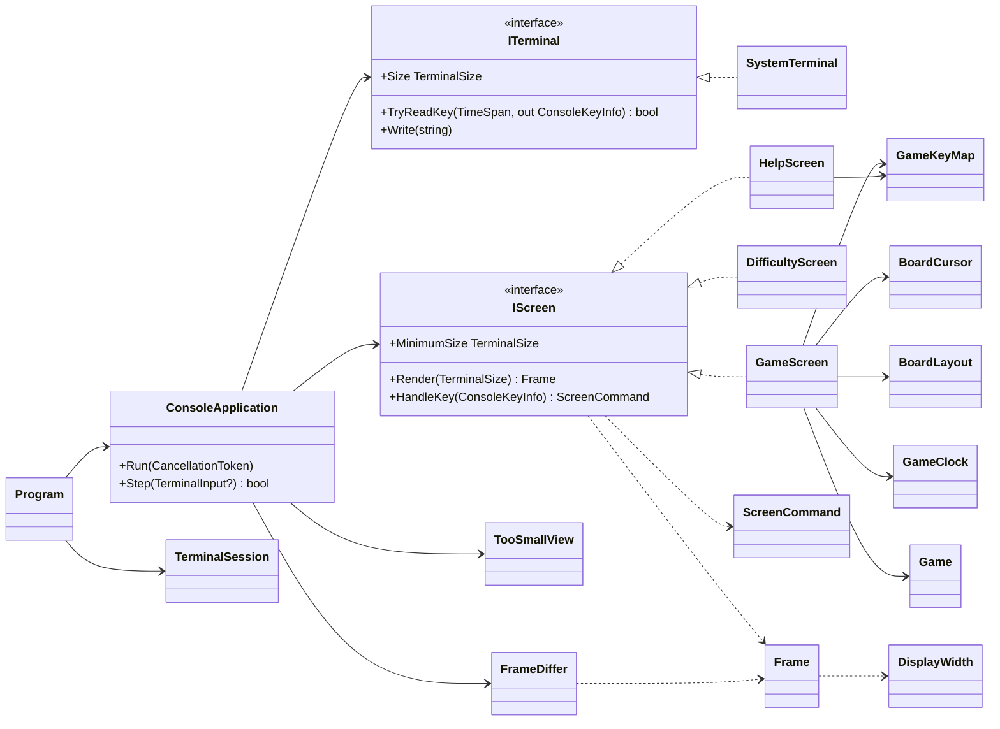
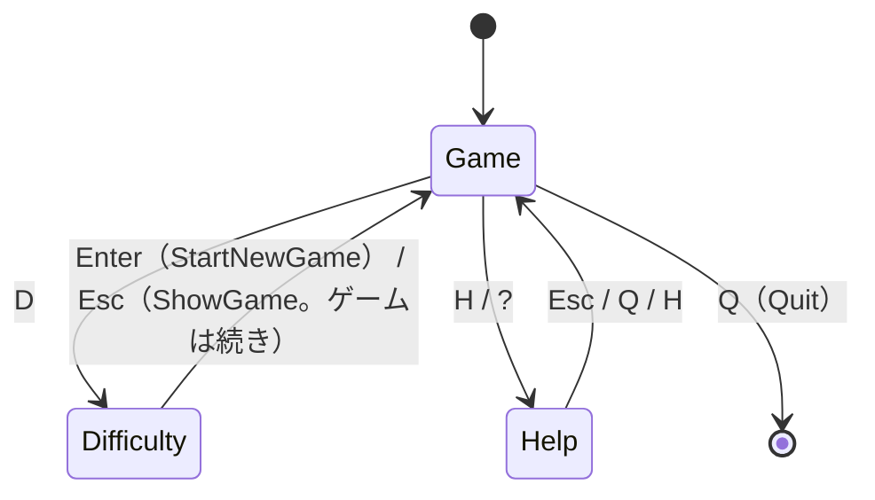

# T1 コンソール版の画面の設計

## 0. 置いた仮定

質問ができないので、次のように仮定した。

| # | 仮定 |
|---|------|
| A1 | ゲームのライブラリには `Difficulty`（初級・中級・上級。行数・列数・地雷数を持つ）、`Game`（`Open(row, column)`、`ToggleFlag(row, column)`、`State`＝Playing/Won/Lost、`RemainingMines`、`Board`）、`Board`（`Rows`、`Columns`、各マスの状態を読む手段）がある。経過時間はライブラリになく、コンソール版が測る（あれば、それを使って `GameClock` を作らない） |
| A2 | 難易度はプリセットの 3 つだけ。カスタム（数値の入力）は課題に無いので作らない |
| A3 | 操作はキーボードだけ（矢印キーで移動、Space で開く、F で旗、N で新しいゲーム、D で難易度、H/? でヘルプ、Q/Esc で戻る・終わる） |
| A4 | 対象の端末は Windows Terminal（と conhost）、Linux の一般的な端末。どれも VT のシーケンス（色、カーソル移動、代替画面）を解釈できる |
| A5 | 画面の文言は日本語。したがって全角文字の表示幅（2 桁）を扱う必要がある |

## 1. 設計の骨格

中心の考えは一つだけである。**画面は「状態と端末の大きさ」から「フレーム（文字と色の格子）」を作る純粋な計算にし、端末への書き込みとキーの読み取りは外側の薄い層に押し出す。** こうすると、xUnit では画面の型を `new` して、キーを渡し、できたフレームの文字列を確かめるだけで済む。本物の `Console` は、テストで触らない最外殻の 2 つの型（`SystemTerminal`、`TerminalSession`）だけが使う。



層は 3 つに分ける。

| 層 | 型 | 本物の端末に触れるか | テスト |
|----|----|----|----|
| 描画の部品 | `Frame`、`Cell`、`CellStyle`、`TerminalSize`、`DisplayWidth`、`FrameDiffer` | 触れない | xUnit で直接 |
| 画面 | `IScreen`、`GameScreen`、`DifficultyScreen`、`HelpScreen`、`TooSmallView`、`ScreenCommand`、`GameKeyMap`、`BoardCursor`、`BoardLayout`、`GameClock` | 触れない | xUnit で直接 |
| 進行と端末 | `ConsoleApplication`（触れない。`ITerminal` 経由）、`ITerminal`、`SystemTerminal`、`TerminalSession`、`Program` | `SystemTerminal`・`TerminalSession` だけ触れる | `ConsoleApplication` は偽の `ITerminal` で。`SystemTerminal`・`TerminalSession` は実機で確かめる |

## 2. 描画の部品

### 2.1 `TerminalSize`

```csharp
public readonly record struct TerminalSize(int Columns, int Rows)
{
    public bool Contains(TerminalSize required); // Columns >= required.Columns && Rows >= required.Rows
}
```

端末の大きさと、画面が要る最小の大きさの両方をこの型で表す。「小さすぎるか」の判定は `Contains` の 1 か所に置く。

### 2.2 `CellStyle` と `Cell`

```csharp
public enum TerminalColor { Default, Red, Green, Yellow, Blue, Magenta, Cyan, White, Gray /* 16 色の範囲 */ }

public readonly record struct CellStyle(TerminalColor Foreground = TerminalColor.Default,
                                        TerminalColor Background = TerminalColor.Default,
                                        bool Bold = false, bool Inverse = false)
{
    public static CellStyle Plain { get; }
}

public readonly record struct Cell(string Text, CellStyle Style); // Text は 1 字（書記素）。全角の右半分は Text = "" の続きのマス
```

色は 16 色に限る（Windows の conhost を含め、どの端末でも同じに見えるため）。フレームは色の「意味」ではなく「値」を持つ。数字ごとの色などの意味づけは、画面の側（`GameScreen` の中の小さな表）で決める。

### 2.3 `DisplayWidth`

```csharp
public static class DisplayWidth
{
    public static int Of(string text);          // 表示の桁数（全角 = 2、半角 = 1、結合文字 = 0）
    public static int Of(Rune rune);
}
```

日本語の文言を中央に置く・はみ出しを切るために、表示の桁数が要る。東アジアの幅の「W/F」を 2、ほかを 1 と数える、表で引くだけの小さな関数にする。幅の決まらない文字（「A（曖昧）」の ■ ● など）は、端末と言語の設定で 1 桁にも 2 桁にもなるので、**盤面とフレームの罫線には使わない**（ASCII だけで描く）ことで、この問題そのものを避ける。

### 2.4 `Frame`

```csharp
public sealed class Frame
{
    public Frame(TerminalSize size);
    public TerminalSize Size { get; }

    public void Write(int column, int row, string text, CellStyle style); // はみ出した分は切る。全角が最後の桁にかかるときは空白にする
    public void WriteCentered(int row, string text, CellStyle style);

    public Cell this[int column, int row] { get; }
    public string RowText(int row);           // テスト用にも、差分の計算にも使う（右端の空白を含む）
    public override string ToString();        // 全行を改行でつないだもの。テストの期待値を文字の絵で書ける
}
```

画面が作る結果である。座標の外への書き込みは例外にせず切る。こうしておくと、どの画面も「小さい端末で壊れる」ことがなく、小さいときの扱いは `ConsoleApplication` の一か所で決められる。

### 2.5 `FrameDiffer`

```csharp
public static class FrameDiffer
{
    // previous が null（初回、または端末の大きさが変わったとき）なら画面を消して全行を書く。
    // そうでなければ、内容の変わった行だけを「カーソルを行頭へ移す + 行を書き直す」VT のシーケンスにする。
    public static string Render(Frame? previous, Frame current);
}
```

フレームを VT のシーケンスの文字列に変える純粋な関数である。出力が文字列なので、「1 マス変えたら 1 行だけ書き直す」「色が変わるところで SGR を出し、行末で `ESC[0m` に戻す」ことを xUnit で確かめられる。1 回の書き込みにまとめて `ITerminal.Write` に渡すので、ちらつきも抑えられる。

差分は**行の単位**にとどめる（マスの単位の差分にしない）。盤面の大きさ（上級でも 16 行）なら行の単位で十分速く、実装が小さいため。

## 3. 画面

### 3.1 `IScreen` と `ScreenCommand`

```csharp
public interface IScreen
{
    TerminalSize MinimumSize { get; }          // この画面が崩れずに描ける最小の大きさ
    Frame Render(TerminalSize size);           // size は MinimumSize 以上で呼ばれる（契約）
    ScreenCommand HandleKey(ConsoleKeyInfo key);
}

public abstract record ScreenCommand
{
    public sealed record Stay : ScreenCommand;                           // 画面はそのまま（中の状態は変わりうる）
    public sealed record ShowGame : ScreenCommand;                        // ゲームの画面に戻る（ゲームは続き）
    public sealed record ShowDifficulty : ScreenCommand;
    public sealed record ShowHelp : ScreenCommand;
    public sealed record StartNewGame(Difficulty Difficulty) : ScreenCommand;
    public sealed record Quit : ScreenCommand;
}
```

画面は**次にどこへ行くかを「値」で返すだけ**で、ほかの画面を知らない。画面の切り替えは `ConsoleApplication` が行う。これで各画面は単独で `new` してテストでき、「D を押すと `ShowDifficulty` が返る」と書くだけで遷移を確かめられる。

画面の間の遷移は次のとおりである。



### 3.2 `GameScreen`

```csharp
public sealed class GameScreen : IScreen
{
    public GameScreen(Difficulty difficulty, GameKeyMap keys, TimeProvider time);

    public Difficulty Difficulty { get; }
    public void StartNew(Difficulty difficulty);   // 新しい Game を作り、カーソルと時計を戻す
    public TerminalSize MinimumSize { get; }        // BoardLayout.RequiredSize(difficulty) から
    public Frame Render(TerminalSize size);
    public ScreenCommand HandleKey(ConsoleKeyInfo key);
}
```

責務: 1 回のゲームの進め方（キー → 操作 → `Game` の呼び出し）と、その描画。ルールの判断はしない（開けてよいか、勝ったかは `Game` が決める）。

描画の中身: 上の行に残り地雷数・経過時間・難易度、中央に盤面、下の行に状態（プレイ中／勝ち／負け）とキーの短い案内。マスは 1 マスを 2 桁（`" ."`, `" 3"`, `" F"`, `" *"`）で描き、カーソルのあるマスは `Inverse` にする。色だけに頼らないように、旗・地雷・誤った旗は文字も変える（`F`、`*`、`X`）。

`TimeProvider` を受け取るのは、テストで時刻を進めて「経過時間 00:05」を確かめるためである（偽の `TimeProvider` はテストの中に数行で書ける。パッケージを足さない）。

### 3.3 `GameKeyMap`

```csharp
public enum GameAction { MoveUp, MoveDown, MoveLeft, MoveRight, Open, ToggleFlag, NewGame, ShowDifficulty, ShowHelp, Quit }

public sealed class GameKeyMap
{
    public static GameKeyMap Default { get; }
    public GameAction? Find(ConsoleKeyInfo key);                       // 割り当てのないキーは null
    public IReadOnlyList<(string Keys, GameAction Action)> Bindings { get; } // ヘルプの画面の表示に使う
}
```

キーの割り当てを 1 か所の表にする。ヘルプの画面はこの表から文言を作るので、**キーを変えたのにヘルプが古いまま、ということが起きない**。Windows と Linux で `ConsoleKeyInfo` の中身（`KeyChar` と `Key`）が違うことがあるので、表は `Key` と `KeyChar` の両方で引く。その差を吸収するのもこの型の責務である。

### 3.4 `BoardCursor`

```csharp
public readonly record struct BoardCursor(int Row, int Column)
{
    public BoardCursor Move(int deltaRow, int deltaColumn, int rows, int columns); // 盤面の端で止める
}
```

不変の値にして、`GameScreen` が持ち替える。端で止まるか回り込むかの決まりをここだけに置く（端で止める、とした）。

### 3.5 `BoardLayout`

```csharp
public static class BoardLayout
{
    public const int CellWidth = 2;
    public static TerminalSize RequiredSize(Difficulty difficulty); // 盤面 + 枠 + 上下の情報の行
    public static (int Column, int Row) Origin(TerminalSize size, Difficulty difficulty); // 盤面を中央に置く左上
    public static (int Column, int Row) ToScreen(BoardCursor cell, (int Column, int Row) origin);
}
```

盤面の寸法の計算を `GameScreen` の描画から分ける。「上級（30 列）は 64 桁 × 20 行が要る」のような数をテストで直接確かめられ、`MinimumSize` と描画が同じ計算を使うので食い違わない。

### 3.6 `GameClock`

```csharp
public sealed class GameClock
{
    public GameClock(TimeProvider time);
    public void Start();       // 最初にマスを開けたとき
    public void Stop();        // 勝ち・負けのとき
    public void Reset();
    public TimeSpan Elapsed { get; }
}
```

「最初に開けてから数え、終わったら止める」という決まりだけを持つ。表示は 999 秒で頭打ちにする（`GameScreen` の側の書式）。

### 3.7 `DifficultyScreen`

```csharp
public sealed class DifficultyScreen : IScreen
{
    public DifficultyScreen(IReadOnlyList<Difficulty> choices);
    public void Open(Difficulty current);           // 開くたびに、今の難易度に選択を合わせる
    public TerminalSize MinimumSize { get; }
    public Frame Render(TerminalSize size);
    public ScreenCommand HandleKey(ConsoleKeyInfo key); // ↑↓ / 1〜3 で選ぶ、Enter で StartNewGame、Esc で ShowGame
}
```

### 3.8 `HelpScreen`

```csharp
public sealed class HelpScreen : IScreen
{
    public HelpScreen(GameKeyMap keys);
    public TerminalSize MinimumSize { get; }         // 最も長い行の幅と行数から
    public Frame Render(TerminalSize size);
    public ScreenCommand HandleKey(ConsoleKeyInfo key); // Esc / Q / H で ShowGame。ほかは Stay
}
```

ヘルプはスクロールさせない。キーの一覧とルールの要点が 1 画面に収まる量にとどめ、`MinimumSize` をその大きさにする（収まらない端末では「大きくしてください」になる）。

### 3.9 `TooSmallView`

```csharp
public static class TooSmallView
{
    // 「端末を大きくしてください」と、今の大きさ・要る大きさ（例: 50×15 → 64×20）を出す。どんな大きさでも描ける（はみ出しは Frame が切る）
    public static Frame Render(TerminalSize actual, TerminalSize required);
}
```

これは `IScreen` にしない。画面の間の遷移の一つではなく、**どの画面にも被さる状態**だからである。遷移の表に「小さすぎる」を入れると、3 つの画面それぞれから行き来を書くことになり、戻る先も覚えなければならない。`ConsoleApplication` の描画の手前で、次の 1 行の判定にする。

```csharp
var frame = size.Contains(current.MinimumSize)
    ? current.Render(size)
    : TooSmallView.Render(size, current.MinimumSize);
```

小さすぎる間のキーは、Q（終わる）と Ctrl+C のほかは無視する。見えない盤面を操作させないためである。端末を大きくすれば、元の画面がそのまま戻る（状態を捨てていないため）。

## 4. 進行と端末

### 4.1 `ITerminal`

```csharp
public interface ITerminal
{
    TerminalSize Size { get; }
    bool TryReadKey(TimeSpan timeout, out ConsoleKeyInfo key); // timeout の間にキーが無ければ false
    void Write(string text);
}
```

`Console` の面のうち、この画面が使う 3 つだけに絞った境界である。テストでは、キーの列と大きさを決めておき、書き込まれた文字列を記録する偽物を使う。

### 4.2 `SystemTerminal`

`ITerminal` の本物。`Console.WindowWidth/WindowHeight`、`Console.KeyAvailable` と `Console.ReadKey(intercept: true)`、`Console.Out.Write` を使う。`TryReadKey` は短い間隔（20 ms）で `KeyAvailable` を見て、timeout まで待つ。

### 4.3 `TerminalSession`

```csharp
public sealed class TerminalSession : IDisposable
{
    public static TerminalSession Begin(); // VT を有効にする（Windows の conhost では SetConsoleMode）、UTF-8、代替画面 ESC[?1049h、カーソルを隠す ESC[?25l、TreatControlCAsInput
    public void Dispose();                 // 逆の順で元に戻す（例外で終わっても using で必ず戻る）
}
```

端末の準備と後始末を 1 か所に集める。後始末を忘れると、終了後の端末がカーソルの消えた代替画面のままになるので、`Program` では `using` で囲む。Ctrl+C は `TreatControlCAsInput = true` にしてキーとして受け、`Quit` と同じ扱いにする（`CancelKeyPress` の別スレッドから後始末をするより単純で確実なため）。

### 4.4 `ConsoleApplication`

```csharp
public sealed class ConsoleApplication
{
    public ConsoleApplication(ITerminal terminal, GameScreen game, DifficultyScreen difficulty, HelpScreen help);

    public void Run();                      // Step が false を返すまで回す
    public bool Step();                     // 1 回分: キーを待つ（最大 250 ms）→ 渡す → 描く。Quit なら false
    internal IScreen Current { get; }       // テストで今の画面を確かめる
}
```

責務: 画面の切り替え（`ScreenCommand` を解釈する唯一の場所）、「小さすぎる」の判定、前のフレームとの差分の書き込み。

ループは次の形にする。

1. `terminal.TryReadKey(250ms)` でキーを待つ。キーがあれば `Current.HandleKey` に渡し、返った `ScreenCommand` で画面を替える（`StartNewGame` なら `game.StartNew(d)` のあとゲームの画面へ、`ShowDifficulty` なら `difficulty.Open(game.Difficulty)`）。
2. `terminal.Size` を読み、前と違えば前のフレームを捨てる（全体を描き直す）。
3. フレームを作り、`FrameDiffer.Render(previous, frame)` が空でなければ書く。

250 ms ごとに必ず描き直しを試みるので、経過時間の表示と端末の大きさの変化は、特別な仕組みなしに反映される。変わらなければ差分は空で、何も書かない。

## 5. テストの方針

| 型 | 確かめ方の例 |
|----|--------------|
| `Frame`、`DisplayWidth` | 全角を最後の桁に書くと空白になる、はみ出しを切る、`ToString()` が期待の文字の絵と一致する |
| `FrameDiffer` | 初回は画面を消して全行、1 行だけ変えるとその行のカーソル移動と中身だけ、色の変わり目の SGR |
| `GameScreen` | 盤面を決めた `Game`（ライブラリのテストの補助、または地雷の配置を渡せる作り方）で、Space → そのマスが開いた絵、D → `ShowDifficulty`、時刻を 5 秒進める → `00:05` |
| `BoardLayout` | 各難易度の `RequiredSize` |
| `DifficultyScreen`、`HelpScreen` | ↓↓Enter → `StartNewGame(上級)`、Esc → `ShowGame`、ヘルプに `GameKeyMap` の全部の割り当てが出る |
| `ConsoleApplication` | 偽の `ITerminal` で: 大きさを小さくすると「端末を大きくしてください」が書かれ、戻すとゲームの画面に戻る、小さい間の Space は盤面を変えない、Q で `Step` が false |
| `SystemTerminal`、`TerminalSession` | 単体テストしない。Windows Terminal・conhost・Linux の端末で起動と終了を実機で確かめる（終了後に端末が元に戻るか、Ctrl+C で終えたときも含めて） |

## 6. 作らないことにしたもの

| 作らないもの | 理由 |
|--------------|------|
| 汎用のウィジェットやレイアウトの仕組み（ボタン、パネル、入れ子の配置） | 画面は 3 つで形も決まっている。`Frame.Write` と `WriteCentered`、`BoardLayout` の計算で足りる。4 つ目の画面や入力欄が要るようになってから考える |
| 画面のスタック（戻る先の履歴） | 難易度もヘルプも、戻る先は必ずゲームの画面である。`ShowGame` で足りる |
| 「小さすぎる」を画面の一つにすること | 3.9 のとおり、遷移ではなく被さる状態なので、判定の 1 行にした |
| マスの単位の差分描画、ダブルバッファの独自の仕組み | 行の単位の差分で十分速い。遅さを測ってから考える |
| 端末の大きさの変化の通知（SIGWINCH、Windows のイベント） | Windows と Linux で仕組みが違い、`PosixSignalRegistration` にも WINCH の扱いに差がある。250 ms ごとに大きさを読めば足りる |
| 非同期のイベントループ、別スレッドの時計 | 1 本のループと待ち時間つきのキーの読み取りで、時計の表示も大きさの変化も扱える。スレッドの競合を持ち込まない |
| マウス操作 | 課題にない。VT のマウスの報告は端末ごとの差が大きい |
| 256 色・TrueColor、配色の切り替え | conhost を含めて同じに見える 16 色にとどめる |
| 曖昧な幅の記号（■ ● ▲ など）での盤面 | 端末と言語の設定で幅が変わり、盤面の桁がずれる。ASCII で描く |
| カスタムの難易度の入力 | 課題にない（仮定 A2）。作るときは `DifficultyScreen` に入力の状態を足す |
| DI コンテナー、設定ファイル | 組み立ては `Program` の数行で済む |
| ベストタイムの保存、効果音、演出 | 課題にない |
| `ITerminal` の上の抽象（`IRenderer`、`IInputSource` などへの分割） | 偽物を 1 つ書けば足りる大きさなので、1 つのインターフェースにした |
