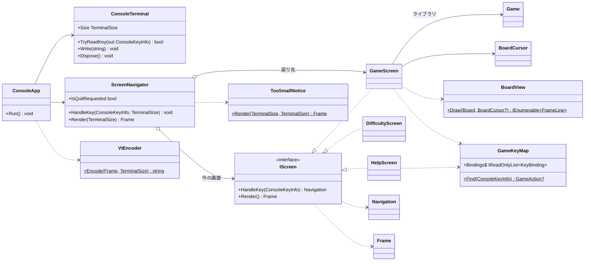

# コンソール版マインスイーパー: 画面まわりの型の設計

## 0. 何を作るか

- **Why**: 端末で遊べるマインスイーパーを作る。画面は xUnit で確かめたい。
- **What**: 「押されたキー → 画面の状態が変わる → 今の画面を文字で描く → 端末に書く」の流れを、次の 2 つに分ける。
  - **判断**（どの画面を出すか、キーで何が起きるか、何を描くか）: 端末に触らない純粋な型にして、xUnit で確かめる。
  - **入出力**（キーを読む、端末の大きさを読む、VT のシーケンスを書く、後始末）: `Console` に触る型を 1 つにして、薄く保つ。この型は実際に端末で動かして確かめる。
- 画面ごとの型が「描くもの」を文字と**意味の付いたスタイル**（例: 「数字の 3」「旗」「カーソル」）で返すので、テストでは VT のシーケンスを読み解かずに、表示される文字とスタイルを確かめられる。

## 1. 置いた仮定

ユーザーに確認できないので、次の仮定を置いて進めた。

| # | 仮定 | 違ったときに変わる箇所 |
|---|------|------------------------|
| A1 | ゲームのルールのライブラリには、`Game`（`Open(row, column)`、`ToggleFlag(row, column)`、`State`（進行中・勝ち・負け）、`Board`、`RemainingMines`）、`Board`（`Rows`、`Columns`、`this[row, column]` でマスの状態）、`Difficulty`（初級・中級・上級の定義）がある。時間は計らない | `GameScreen` と `BoardView` の中だけ |
| A2 | 難易度は、あらかじめ決まった 3 つから選ぶ。カスタムの入力はない（課題に書かれていないので） | `DifficultyScreen` だけ |
| A3 | ヘルプの画面と難易度の画面は、ゲームの画面から開き、閉じるとゲームの画面に戻る。ヘルプを見ている間もゲームの状態は残る | `ScreenNavigator` だけ |
| A4 | 端末が小さいときは、案内だけを出し、キーは終了のキーのほかは無視する（見えない盤面を操作させないため） | `ScreenNavigator` だけ |
| A5 | Windows 11 の既定の端末（Windows Terminal）と Linux の端末は、VT のシーケンスを解釈する。古い conhost で VT を有効にする必要があれば、`ConsoleTerminal` の中に閉じ込める（実機での確認が要る） | `ConsoleTerminal` だけ |
| A6 | 盤面のマスは ASCII の文字と色で描く。日本語の文言（ヘルプ、案内）は全角で 2 桁を占めるものとして幅を数える | `TextWidth` だけ |

## 2. 関心事と、それに対応する型

先に関心事を挙げ、その結果として型を決めた。

| 関心事 | 型 | ひとことで言うと |
|--------|----|------------------|
| 描く中身（文字とスタイルの並び）と、その大きさ | `Frame`、`FrameLine`、`StyledText`、`TextStyle`、`TerminalSize` | 画面 1 枚分の表示内容 |
| 1 つの画面のキーへの反応と描画 | `IScreen`（`GameScreen`、`DifficultyScreen`、`HelpScreen`） | 画面 |
| 画面から画面への移り方の要求 | `Navigation` | 画面の移り方の要求 |
| 今どの画面を出すか、端末が小さいときの案内への切り替え | `ScreenNavigator` | 画面を切り替える |
| 端末が小さいときの案内の文言 | `TooSmallNotice` | 「端末を大きくしてください」の画面 |
| 盤面の描き方 | `BoardView` | 盤面を描く |
| 盤面の上のカーソルの動き | `BoardCursor` | 盤面の上のカーソル |
| ゲームのキーの割り当て（ゲームの画面とヘルプの画面で共有） | `GameKeyMap`、`GameAction` | キーの割り当て表 |
| 文字列の表示の幅（全角は 2 桁） | `TextWidth` | 表示の幅を数える |
| `Frame` を VT のシーケンスに変える | `VtEncoder` | VT に書き換える |
| 端末の入出力と後始末 | `ConsoleTerminal` | 端末 |
| 全体の繰り返し | `ConsoleApp` | アプリの繰り返し |

## 3. 型の間の関係



依存の向きは、入出力（`ConsoleApp`、`ConsoleTerminal`）→ 判断（`ScreenNavigator`、各画面）→ ゲームのルール（ライブラリ）の一方向である。画面の型は `Console` を知らず、ライブラリは画面を知らない。

## 4. 型ごとのシグネチャと責務

### 4.1 描く中身

```csharp
public readonly record struct TerminalSize(int Width, int Height)
{
    public bool Contains(TerminalSize other) => other.Width <= Width && other.Height <= Height;
}

// 意味で表すスタイル。色や反転への対応は VtEncoder だけが知る
public enum TextStyle { Normal, Title, Hidden, Opened, Number1, Number2, /* … */ Number8,
                        Flag, Mine, WrongFlag, Cursor, Selected, Won, Lost, Hint }

public sealed record StyledText(string Text, TextStyle Style);

public sealed record FrameLine(IReadOnlyList<StyledText> Parts)
{
    public string Text { get; }               // Parts の文字をつないだもの（テストで使う）
    public int Width { get; }                 // TextWidth.Of(Text)
    public static FrameLine Plain(string text, TextStyle style = TextStyle.Normal);
}

public sealed record Frame(IReadOnlyList<FrameLine> Lines)
{
    public TerminalSize Size { get; }         // 幅 = 最も長い行の表示の幅、高さ = 行の数
}

public static class TextWidth
{
    public static int Of(string text);        // 全角（東アジアの幅が W・F の文字）を 2 桁と数える
}
```

- `Frame` は「画面 1 枚に何を出すか」だけを表す。**必要な端末の大きさは `Frame.Size` から求める**。画面ごとに「最小の大きさ」を別に宣言させると、描く中身と宣言がずれうる（同じ知識が 2 か所）ので、描いたものから数える（Once And Only Once）。
- `TextWidth` は、日本語の文言の幅を正しく数えるための本質的な複雑さを 1 か所に閉じ込める。

### 4.2 画面

```csharp
public interface IScreen
{
    Navigation HandleKey(ConsoleKeyInfo key);
    Frame Render();
}

public abstract record Navigation
{
    public sealed record Stay : Navigation;
    public sealed record OpenHelp : Navigation;
    public sealed record OpenDifficulty : Navigation;
    public sealed record Back : Navigation;                        // ゲームの画面に戻る
    public sealed record StartGame(Difficulty Difficulty) : Navigation;
    public sealed record Quit : Navigation;
}
```

- 画面は「次にどの画面のオブジェクトにするか」を返さずに、**移り方の要求**（`Navigation`）を返す。画面が別の画面を作ると、ヘルプの画面がゲームの画面の作り方（`Game` と `TimeProvider`）を知ることになるからである。どの画面を作り、どれを残すかは `ScreenNavigator` だけが決める。
- `ConsoleKeyInfo` は構造体で、テストで `new ConsoleKeyInfo('f', ConsoleKey.F, false, false, false)` と作れるので、自前のキーの型は作らない。

```csharp
public sealed class GameScreen(Game game, TimeProvider time) : IScreen
{
    public Difficulty Difficulty { get; }      // 難易度の画面の初期の選択に使う
    public Navigation HandleKey(ConsoleKeyInfo key);  // GameKeyMap で GameAction に変え、カーソルの移動・開く・旗・移り方に振り分ける
    public Frame Render();                     // 状態の行（残り地雷数・経過時間）+ BoardView.Draw + 案内の行（勝ち・負け・「? でヘルプ」）
}
```

- 責務: 1 回のゲームをキーで操作し、その様子を描く。ルールの判定（開けたら何が起きるか、勝ち負け）は `Game` に任せる（Expert）。
- 経過時間は `TimeProvider` から読む。テストでは `TimeProvider` を継承した小さな偽物で時刻を進める（時刻の差し替えは、テストという最初の利用者が必要としているので、YAGNI に当たらない）。最初にマスを開けたときに計り始め、勝ち負けで止める。

```csharp
public readonly record struct BoardCursor(int Row, int Column)
{
    public BoardCursor Move(GameAction direction, int rows, int columns);  // 盤面の端で止まる
}

public static class BoardView
{
    public static IEnumerable<FrameLine> Draw(Board board, BoardCursor? cursor);  // 1 マスを 2 桁（記号 + 空白）で描き、カーソルのマスは Cursor のスタイル
}
```

- `BoardView` は「盤面の状態 → 行の並び」という変換なので、状態を持たない静的な関数にした。負けた後の地雷や誤った旗の出し方も、マスの状態から決まるのでここに置く。
- `BoardCursor` は、端での止まり方を名前の付いた 1 か所にして、`GameScreen` を短く保つために分けた。

```csharp
public enum GameAction { MoveUp, MoveDown, MoveLeft, MoveRight, Open, ToggleFlag,
                         NewGame, ChooseDifficulty, ShowHelp, Quit }

public sealed record KeyBinding(string KeyLabel, GameAction Action, string Description, Func<ConsoleKeyInfo, bool> Matches);

public static class GameKeyMap
{
    public static IReadOnlyList<KeyBinding> Bindings { get; }
    public static GameAction? Find(ConsoleKeyInfo key);
}
```

- どのキーで何をするかという知識は、ゲームの画面（キーを解釈する）とヘルプの画面（キーを説明する）の 2 か所で要る。表を 1 つにして、キーを変えたときにヘルプが嘘をつかないようにした。

```csharp
public sealed class DifficultyScreen(Difficulty current) : IScreen
{
    public Navigation HandleKey(ConsoleKeyInfo key);  // ↑↓で選ぶ、Enter → StartGame(選んだ難易度)、Esc → Back
    public Frame Render();                            // 3 つの難易度（大きさと地雷の数）、選んでいる行は Selected
}

public sealed class HelpScreen : IScreen
{
    public Navigation HandleKey(ConsoleKeyInfo key);  // Esc・?・Enter → Back、ほかは Stay
    public Frame Render();                            // 遊び方の短い説明 + GameKeyMap.Bindings の一覧
}
```

`DifficultyScreen` の中の ↑↓・Enter・Esc は、この画面の中だけの割り当てなので `GameKeyMap` に入れず、画面の最下行に案内を出す。

### 4.3 画面の切り替え

```csharp
public sealed class ScreenNavigator(Func<Difficulty, GameScreen> createGame, Difficulty initial)
{
    public bool IsQuitRequested { get; }
    public void HandleKey(ConsoleKeyInfo key, TerminalSize terminal);  // 小さすぎるときは終了のキーだけを受ける
    public Frame Render(TerminalSize terminal);                        // 今の画面の Frame が入らなければ TooSmallNotice
}

public static class TooSmallNotice
{
    public static Frame Render(TerminalSize actual, TerminalSize required);
    // 「端末を大きくしてください」「今: 40×12 / 必要: 64×22」「q で終了」
}
```

- 責務: 今出す画面を決める。持つのは「今の画面」と「戻り先のゲームの画面」の 2 つだけで、`Navigation` を受けて入れ替える（`StartGame` なら `createGame` で新しいゲームの画面を作る。Creator）。
- 「入るかどうか」は、今の画面の `Render().Size` と端末の大きさを比べて決める。`HandleKey` にも端末の大きさを引数で渡すのは、「最後に描いたときの大きさ」を内部に覚えさせる暗黙の順序の依存を避けるためである。
- `GameScreen` を作る関数を受け取るのは、テストで盤面の決まったゲーム（地雷の位置を固定したもの）を渡すためである。

### 4.4 入出力（テストしない薄い層）

```csharp
public static class VtEncoder
{
    public static string Encode(Frame frame, TerminalSize terminal);
    // カーソルを左上へ → 行ごとに SGR で色を付けて書き、行末を消す → 残りの行を消す。端末の幅と高さで切り詰める
}

public sealed class ConsoleTerminal : IDisposable
{
    public static ConsoleTerminal Open();     // 代替の画面バッファーに切り替え、カーソルを隠し、UTF-8 にし、Ctrl+C をキーとして受ける
    public TerminalSize Size { get; }         // Console.WindowWidth / WindowHeight
    public bool TryReadKey(out ConsoleKeyInfo key);  // Console.KeyAvailable を見てから読む（待たない）
    public void Write(string vt);
    public void Dispose();                    // 元の画面バッファー、カーソル、色を戻す
}

public static class ConsoleApp
{
    public static void Run(ConsoleTerminal terminal, ScreenNavigator navigator);
    // 約 50 ミリ秒ごとに: キーがあれば HandleKey → Render → Encode → 前回と違えば Write。終了の要求で抜ける
}
```

- 端末の大きさの変化にも経過時間の表示にも、同じ「一定の間隔で描き直す」繰り返しで応える。前回と同じ文字列なら書かないので、ちらつきと無駄な出力を避けられる。
- `Program` は `using var terminal = ConsoleTerminal.Open();` で後始末を保証する（例外で抜けても端末を戻す）。
- `VtEncoder` は純粋な関数なので、必要なら xUnit で「SGR が入る」「幅で切り詰める」を確かめられる。

## 5. テストの例（xUnit）

| 対象 | 確かめること |
|------|--------------|
| `GameScreen` | 矢印でカーソルが動き、端で止まる / Space で開くとそのマスが数字になる / 地雷を開くと案内の行が負けになり、地雷が `Mine` のスタイルで出る / `?` で `OpenHelp`、`q` で `Quit` を返す / 偽の `TimeProvider` を 3 秒進めると経過時間が 3 になる |
| `DifficultyScreen` | ↓ と Enter で `StartGame(中級)` / Esc で `Back` |
| `HelpScreen` | `GameKeyMap.Bindings` の説明がすべて描かれる / Esc で `Back` |
| `ScreenNavigator` | `?` でヘルプに移り、Esc でゲームの画面に戻っても盤面が残っている / 難易度を選ぶと新しいゲームになる / 端末が小さいと `TooSmallNotice` を描き、そのときの矢印キーは盤面を動かさない |
| `BoardView`、`BoardCursor`、`TextWidth` | マスの状態ごとの記号とスタイル / 全角の幅 |

## 6. 作らないことにしたもの

| 作らないもの | 理由 |
|--------------|------|
| 端末のインターフェイス（`ITerminal`）と偽の端末 | 判断をすべて `ScreenNavigator` と画面に移したので、端末の層に残るのは入出力だけである。実装が 1 つしかないインターフェイスは読む対象を増やすだけ（YAGNI）。この層は実際の端末で動かして確かめる |
| 自前のキー入力の型 | `ConsoleKeyInfo` がテストで作れるので要らない |
| 画面の基底クラス | 3 つの画面で共通の処理がない。共通にしたくなったら合成で持たせる |
| 画面の履歴（スタック） | 戻り先はゲームの画面だけ（仮定 A3）。ヘルプを難易度の画面からも開くようになったら入れる |
| 差分の描画、二重のバッファー | 1 枚分の文字列を前回と比べるだけで、ちらつきは抑えられる見込み。遅いと分かったら、計ってから入れる |
| 端末の大きさの変化のイベント（SIGWINCH など） | Windows と Linux で仕組みが違う。一定の間隔で大きさを読むだけで足りる |
| カスタムの難易度の入力、マウス操作、色のテーマの設定、画面の中央寄せ、効果音、ベストタイム | 課題に書かれていない。要るなら足す |
| 両押し（数字のマスで周りを開く）のキー | ライブラリにその操作があるかが分からない（A1）。あれば `GameAction` に 1 つ足し、`GameKeyMap` に 1 行足すだけで済む |

## 7. 設計の理由のまとめ（捨てた案とのトレードオフ）

- **画面が `Frame` を返す案 vs 画面が `Console` に直接書く案**: 直接書くと、テストで端末を差し替え、VT のシーケンスを読み解く必要がある。`Frame` を返せば、テストは文字とスタイルを見るだけで済み、端末への書き方は `VtEncoder` の 1 か所に閉じる。代わりに `Frame` の型が 4 つ増えるが、どれも「表示の内容」という 1 つの概念の部品である。
- **スタイルを意味で表す案 vs 色で表す案**: `TextStyle.Number3` のように意味で持つと、テストが配色に左右されず、配色を変えても `VtEncoder` だけを直せばよい。
- **`Navigation` を返す案 vs 次の画面のオブジェクトを返す案**: 後者は画面どうしが作り方を知り合う。前者なら画面の組み合わせは `ScreenNavigator` の `switch` 1 か所に集まる。
- **`IScreen` を置く理由**: 実装が今 3 つあり、`ScreenNavigator` がそれを区別せずに扱う（多態）。将来のための抽象ではない。
- **必要な大きさを `Frame.Size` から求める理由**: 描く中身と「最小の大きさ」の宣言がずれることがない。1 回のキーで `Render` を 2 回呼ぶ（入るかを確かめるのと描くのと）が、盤面は最大でも数百マスなので問題にならない見込みである（遅ければ計ってから直す）。

## 8. 判断が要る点・確かめられていないこと

- 仮定 A1〜A6。特に、ライブラリの `Game` の実際の API（両押しの有無、時間を持つか）と、ヘルプを難易度の画面からも開くか（A3）。
- 古い conhost（Windows Terminal でない端末）で遊ばせるか。遊ばせるなら、VT を有効にする処理を `ConsoleTerminal` に足し、実機で確かめる（A5）。
- 端末の大きさが足りないときに、ゲームの時間を止めるか（今の設計では止めない）。
- この文書は設計だけで、コードのビルドやテストは実行していない。
