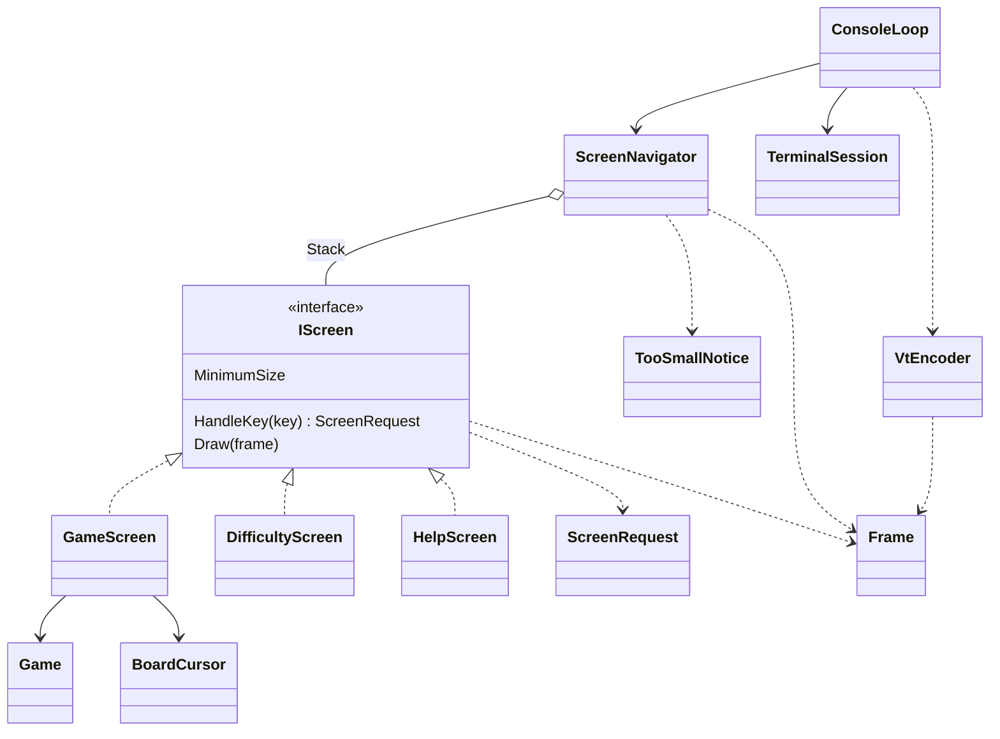

# コンソール版マインスイーパーの画面まわりの型の設計

判断の基準: sustainable-code-jp（作業の種類は「設計の相談」。modeling.md、object-design.md、型の名前を決めるので naming.md、インターフェイスを新しく作るので simplicity.md を読んだ）。

## 1. 何を作るか（What）と仮定

**What**: キーを受けて画面を切り替え、今の画面を端末に描く。画面は 3 つ（ゲーム、難易度の選択、ヘルプ）。端末が画面より小さいときは、「端末を大きくしてください」を代わりに出す。画面ごとの判断（キーの意味、何を描くか）は、端末がなくても xUnit で確かめられるようにする。

**作らないもの**: ゲームのルール（`Board`、`Game` にある）、マウス操作、カスタムの難易度。

課題文に書かれていないので、次のように仮定した。

| # | 仮定 |
|---|------|
| A1 | ゲームのロジックには `Difficulty`（初級・中級・上級。盤面の幅・高さ・地雷数を持つ）、`Game`（`Open(pos)`、`ToggleFlag(pos)`、`State`、`RemainingMines`、`Board`）、`Board`（位置ごとのマスの状態）がある。経過時間は `Game` が持たないとして、画面の側が `TimeProvider` から計算する（`Game` が持っていれば、それを使う） |
| A2 | 難易度は初級・中級・上級の 3 つ。カスタム（幅・高さ・地雷数の入力）は課題文にないので作らない |
| A3 | キーの割り当て: 矢印でカーソル移動、Space/Enter で開ける、F で旗、N で新しいゲーム、D で難易度の選択、? でヘルプ、Q で終了。難易度の画面では ↑↓ で選び、Enter で決め、Esc で戻る。ヘルプはどのキーでも戻る。Ctrl+C も終了（キーとして受ける） |
| A4 | ヘルプは、ゲームの画面と難易度の画面の両方から開け、閉じると開いた画面に戻る |
| A5 | 端末が小さすぎるとき、受けるキーは Q（終了）だけにする。見えない盤面を操作させないため |
| A6 | 盤面のマスには ASCII の文字だけを使う（下の 5.3） |

## 2. 関心事の列挙

クラスは、先に関心事を挙げ、その結果として決めた。

| 関心事 | 変わる理由 | 受け持つ型 |
|--------|------------|------------|
| 画面の行き来（今どの画面か、戻り先はどこか） | 画面の増減、遷移の仕様 | `ScreenNavigator` |
| 各画面の、キーの意味と描く内容 | 画面ごとの UI の仕様 | `GameScreen`、`DifficultyScreen`、`HelpScreen` |
| 端末が小さいときの表示 | 案内の文言 | `TooSmallNotice` |
| 1 画面分の文字と色（どの位置に何を描くか） | ほぼ変わらない（全角の幅の扱いだけ） | `Frame`、`TextStyle`、`DisplayWidth` |
| 文字と色を VT のシーケンスに直す | 端末の制御の方法 | `VtEncoder` |
| 端末の準備と後始末、キーの読み取りと書き出しのループ | OS・端末の差 | `TerminalSession`、`ConsoleLoop` |
| ゲームのルール | ルール | 既存の `Game`、`Board`（この設計では変えない） |

依存の向きは、上から下へ一方向にする。画面は `Frame` に描くだけで、VT のシーケンスも `System.Console` も知らない。

## 3. 型の一覧と主なシグネチャ

### 3.1 画面

```csharp
// 画面の共通の契約。実装は 3 つある。
interface IScreen
{
    TerminalSize MinimumSize { get; }            // この画面を描くのに要る端末の大きさ
    ScreenRequest HandleKey(ConsoleKeyInfo key); // キーを受けて、画面の行き来の要求を返す
    void Draw(Frame frame);                      // 今の状態を frame に描く
}

readonly record struct TerminalSize(int Width, int Height)
{
    public bool Contains(TerminalSize other);    // other が収まるか
}
```

- **責務**: 「1 つの画面の、キーの受け方と描き方」。
- `HandleKey` は、画面の中の状態（カーソル、選んでいる難易度）を変え、行き来について画面の外への要求を返す。どの画面に移るかは決めない（決めるのは `ScreenNavigator`）。そうすると、画面は互いを知らずに済む。
- キーは .NET の `ConsoleKeyInfo` をそのまま受ける。テストで `new ConsoleKeyInfo(' ', ConsoleKey.Spacebar, false, false, false)` と作れるので、自前のキーの型は作らない。

```csharp
// 画面が行き来について求めること。閉じた種類の集まり（判別共用体の代わり）。
abstract record ScreenRequest
{
    public sealed record None : ScreenRequest;                        // 画面の中で済んだ
    public sealed record ShowHelp : ScreenRequest;
    public sealed record ChooseDifficulty : ScreenRequest;
    public sealed record Back : ScreenRequest;                        // 開く前の画面に戻る
    public sealed record StartGame(Difficulty Difficulty) : ScreenRequest;
    public sealed record Quit : ScreenRequest;
}
```

`StartGame` だけが値（難易度）を持つので、enum ではなく record にした。

```csharp
sealed class GameScreen(Game game, TimeProvider time) : IScreen
{
    public TerminalSize MinimumSize { get; }   // 難易度の盤面の幅・高さ + 状態の行 + キーの案内
    public ScreenRequest HandleKey(ConsoleKeyInfo key);
    public void Draw(Frame frame);             // 状態の行（残り地雷数・経過時間）、盤面、勝敗の表示、キーの案内
}

readonly record struct BoardCursor(int Column, int Row)
{
    public BoardCursor Move(int dx, int dy, int width, int height);   // 盤面の端で止まる
}
```

- **責務**: 「1 回のゲームを、キーで遊べるように見せる」。
- `GameScreen` が持つ状態は `Game` とカーソルだけである。開ける・旗を立てるは `Game` に任せる。
- `N` は `StartGame(今の難易度)` を返す。新しい `GameScreen` を作るのは `ScreenNavigator` の仕事にする（生成は、保持する側に置く。GRASP の Creator）。
- マスの状態から文字と色を決める処理は、`GameScreen` の private メソッド `static (char, TextStyle) AppearanceOf(...)` にする。長くなったら、そのときに型に出す。
- 経過時間は `TimeProvider` から取る。テストでは `GetUtcNow` を上書きした小さな偽物を渡す（判断ルール 3。時刻の差し替えは YAGNI 違反ではない）。

```csharp
sealed class DifficultyScreen(Difficulty current) : IScreen
{
    public ScreenRequest HandleKey(ConsoleKeyInfo key);  // ↑↓: None、Enter: StartGame(選んだもの)、Esc: Back、?: ShowHelp
    public void Draw(Frame frame);
}

sealed class HelpScreen : IScreen
{
    public ScreenRequest HandleKey(ConsoleKeyInfo key);  // どのキーでも Back
    public void Draw(Frame frame);
}
```

`DifficultyScreen` は今の難易度を最初に選んだ状態で開く。ヘルプの `MinimumSize` は、文言の最も長い行の表示幅と行数から計算する（手で書いた数と文言がずれないように）。

### 3.2 画面の行き来

```csharp
sealed class ScreenNavigator
{
    public ScreenNavigator(Difficulty difficulty, TimeProvider time);   // ゲームの画面から始める

    public bool IsQuitRequested { get; }
    public void HandleKey(ConsoleKeyInfo key, TerminalSize terminal);
    public Frame Draw(TerminalSize terminal);
}
```

- **責務**: 「今の画面を決めて、キーを渡し、描く」。
- 画面を `Stack<IScreen>` に持つ。一番下は常に `GameScreen` である。
  - `ShowHelp`、`ChooseDifficulty` → 新しい画面を積む
  - `Back` → 1 つ降ろす（一番下のゲームは降ろさない）
  - `StartGame(d)` → 全部降ろし、新しい `GameScreen` を積む
  - `Quit` → `IsQuitRequested = true`
- 端末が小さいかどうかの判断もここに置く。「今の画面を見せる」のに、その画面が収まるかは欠かせないからである。`!terminal.Contains(current.MinimumSize)` のとき、`Draw` は `TooSmallNotice` を描き、`HandleKey` は Q だけを受ける（A5）。端末の大きさは引数で受けるので、テストで小さな端末を作れる。

```csharp
static class TooSmallNotice
{
    public static void Draw(Frame frame, TerminalSize required);
    // 「端末を大きくしてください」と、要る大きさ（例: 62×22 以上）と今の大きさを出す
}
```

`TooSmallNotice` は画面ではない（行き来の対象にならず、キーも受けない）ので、`IScreen` にしない。

### 3.3 1 画面分の文字と色

```csharp
readonly record struct TextStyle(ConsoleColor? Foreground = null, ConsoleColor? Background = null, bool Inverse = false);

sealed class Frame(TerminalSize size)
{
    public TerminalSize Size { get; }
    public void Write(int column, int row, string text, TextStyle style = default); // 外にはみ出した分は切り捨てる
    public string LineAt(int row);                  // テストで文字だけを比べるため
    public TextStyle StyleAt(int column, int row);
}

static class DisplayWidth
{
    public static int Of(char character);   // 全角は 2、それ以外は 1
    public static int Of(string text);
}
```

- **責務**: 「1 画面分の、どの桁に何の文字をどの色で置くか」。
- 全角の文字（ヘルプや案内の日本語）は 2 桁を占める。この幅の計算は `Frame.Write` と `DisplayWidth` の中に閉じ込め、画面の側には考えさせない（本質的な複雑さを 1 か所に封じ込める）。
- テストは `frame.LineAt(3)` を `"| 1 . F # |"` のような文字列と比べて書ける。VT のシーケンスを読み解かずに済む。

### 3.4 端末との境界

```csharp
static class VtEncoder
{
    public static string Encode(Frame frame);   // カーソルを左上へ + 各行（SGR で色） + 色の解除
}

sealed class TerminalSession : IDisposable
{
    public static TerminalSession Start();      // UTF-8 の出力、代替画面、カーソルを隠す、Ctrl+C をキーとして受ける
    public TerminalSize Size { get; }           // Console.WindowWidth / WindowHeight
    public void Dispose();                      // 代替画面を出て、カーソルと色を元に戻す
}

sealed class ConsoleLoop(ScreenNavigator navigator, TerminalSession terminal)
{
    public void Run();
}
```

`ConsoleLoop.Run` の流れ:

```csharp
string? shown = null;
while (!navigator.IsQuitRequested)
{
    if (Console.KeyAvailable)
        navigator.HandleKey(Console.ReadKey(intercept: true), terminal.Size);
    var text = VtEncoder.Encode(navigator.Draw(terminal.Size));
    if (text != shown) { Console.Write(text); shown = text; }  // 前と違うときだけ書く
    else Thread.Sleep(50);
}
```

- 書き直すきっかけ（キー、端末の大きさの変化、経過時間の秒の変化）を一つずつ検出せず、「描いた結果が前と違えば書く」の 1 つにまとめた。きっかけごとの判定がなくなり、書き直し漏れも起きない。盤面は最大でも 30×16 マスなので、50 ミリ秒ごとに `Frame` を作っても負担は小さい（遅いと分かったら、計ってから直す）。
- 1 画面を 1 回の `Console.Write` で書くので、ちらつきを抑えられる。
- `Program.Main` は、入力がリダイレクトされていれば（`Console.IsInputRedirected`）メッセージを出して終わり、そうでなければ `using var session = TerminalSession.Start(); new ConsoleLoop(new ScreenNavigator(Difficulty.Beginner, TimeProvider.System), session).Run();` とする。

## 4. 型の間の関係



`System.Console` に触るのは `TerminalSession` と `ConsoleLoop` だけである。それより上（画面、`ScreenNavigator`、`Frame`、`VtEncoder`）は端末なしで動く。

## 5. 設計の理由

### 5.1 `IScreen` を作った理由
実装が今すでに 3 つあり、`ScreenNavigator` がどの画面かを区別せずにキーを渡して描く。多態で置き換える分岐が実際にあるので、先回りの抽象ではない（判断ルール 1）。共通の処理を持つ基底クラスは作らない（共通の処理がなく、継承で再利用するものもないため）。

### 5.2 画面は「要求」を返し、行き来は `ScreenNavigator` が決める
画面が次の画面を自分で作ると、`HelpScreen` は戻り先を、`DifficultyScreen` は `GameScreen` の作り方を知ることになり、画面どうしが絡み合う。要求を返す形にすると、遷移の規則は `ScreenNavigator` の 1 か所に集まり（Once And Only Once）、画面のテストは「このキーでこの要求が返る」だけで済む。

### 5.3 盤面は ASCII、日本語は案内だけ
罫線や ●■※ などの「東アジアの幅が曖昧な文字」は、Windows の端末と Linux の端末（とそのフォントの設定）で 1 桁か 2 桁かが食い違い、盤面の列がずれる。盤面は ASCII（`#` 未開放、`.` 空き、`1`〜`8`、`F` 旗、`*` 地雷、`X` 誤った旗）で描き、色だけに頼らずに状態を区別できるようにする。全角は、幅がはっきり 2 の日本語の文だけに使う（正しさ: 実行環境の差）。

### 5.4 テストの範囲

| 対象 | 確かめること |
|------|--------------|
| `GameScreen` | 矢印でカーソルが動き端で止まる、Space で開く、F で旗、D/?/N/Q で要求が返る、描いた行（盤面・残り地雷数・勝敗） |
| `DifficultyScreen` | ↑↓ で選択が動く、Enter で `StartGame(選んだもの)`、Esc で `Back` |
| `HelpScreen` | どのキーでも `Back`、`MinimumSize` が文言に収まる |
| `ScreenNavigator` | 遷移（積む、降ろす、ゲームは降ろさない、`StartGame` で入れ替える）、ヘルプから戻り先へ戻る、小さい端末で `TooSmallNotice` を描き Q 以外を無視する |
| `Frame`、`DisplayWidth` | はみ出しの切り捨て、全角が 2 桁を占める |
| `VtEncoder` | 色が SGR に直る、最後に色を解除する |
| `BoardCursor` | 端で止まる |

`TerminalSession` と `ConsoleLoop` は単体テストしない。薄く保ち、Windows 11（Windows Terminal）と Linux の端末で実際に動かして確かめる（大きさを変えたとき、終わったときに端末が元に戻るか、Ctrl+C で終わったときも戻るか）。

## 6. 作らないことにしたもの

| 作らないもの | 理由 |
|--------------|------|
| 端末のインターフェイス（`ITerminal` など） | 判断は `ScreenNavigator` と画面にあり、端末の大きさは引数で、キーは `ConsoleKeyInfo` で渡せるので、単体テストに差し替えが要らない。実装が 1 つだけのインターフェイスは YAGNI 違反になる |
| 前の画面との差分だけを書く描画 | 1 画面を 1 回で書けばちらつきは抑えられる。遅さが計って分かってから入れる |
| 汎用のウィジェット（ラベル、パネル、レイアウトの仕組み） | 画面は 3 つで、`Frame.Write` で足りる |
| 画面の基底クラス | 共通の処理がない。再利用だけのための継承になる |
| キーの割り当ての設定、色のテーマ | 要求にない |
| 自前のキーの型 | `ConsoleKeyInfo` をテストで作れる |
| 端末の大きさの変化の通知（Linux の SIGWINCH など） | 「描いた結果が前と違えば書く」ループで拾えるので、OS ごとの仕組みが要らない |
| カスタムの難易度の入力、マウス操作 | 課題文にない（A2） |

## 7. 判断が要る点・確かめること

- A3 のキーの割り当てと A5（小さいときは Q だけを受ける）は仮の決めである。仕様として決めてほしい。
- Windows で古いコンソール（conhost）を使うと、VT のシーケンスが有効になっていないことがある。Windows 11 の既定の Windows Terminal では有効である。conhost も対象にするなら、`TerminalSession.Start` で VT の処理を有効にする（`SetConsoleMode` の P/Invoke）必要があるかを実機で確かめる。
- 経過時間を `Game` が持っているなら（A1）、`GameScreen` の `TimeProvider` は要らなくなる。
