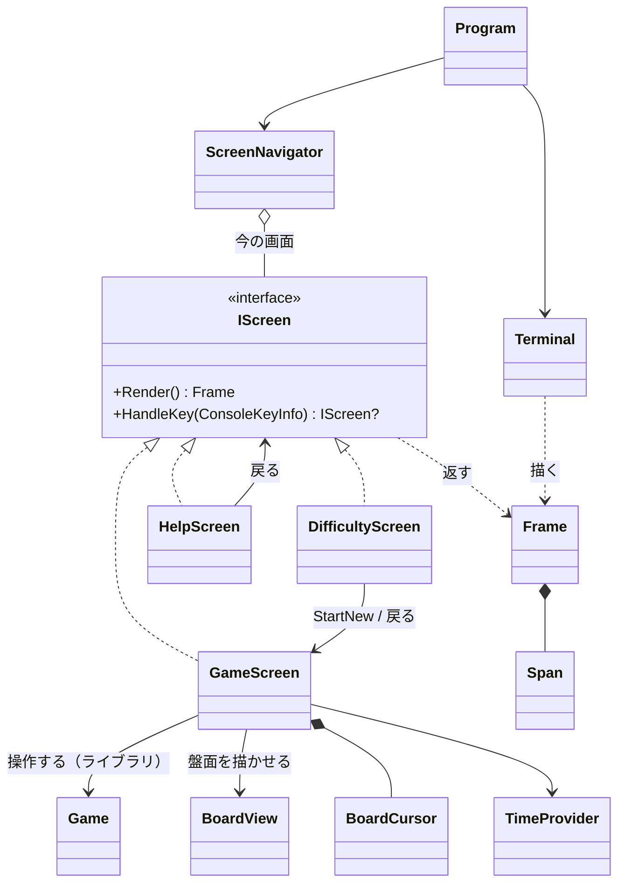

# コンソール版の画面まわりの型の設計

作業の種類は「設計の相談」とした。そのため、スキルの表に従って modeling.md と object-design.md を読んだ。インターフェイス（`IScreen`）を新しく作るので、simplicity.md も読んだ。

## 0. 何を作るか（What の言い直し）と置いた仮定

What: 「今の画面を端末に描き、押されたキーを今の画面に渡し、画面から次の画面を受け取る」。端末が画面より小さいときは、画面の代わりに「端末を大きくしてください」を描く。

画面の単位は、**入出力をしない純粋な部品**にする。キー（`ConsoleKeyInfo`）を受け取って次の画面を返し、描く内容（`Frame`）を返すだけにする。VT のシーケンスと `System.Console` に触れるのは `Terminal` の 1 か所だけにする。こうすると、画面の単位は xUnit でそのままテストできる。

ユーザーに質問できないので、次の仮定を置いた（違っていれば、該当する箇所だけを直せばよい）。

| # | 仮定 |
|---|------|
| A1 | ルールのライブラリには、おおよそ次の公開の操作がある: `Game(Difficulty)`、`game.Board`、`game.State`（Playing / Won / Lost）、`game.RemainingMines`、`game.Difficulty`、`game.Open(Position)`、`game.ToggleFlag(Position)`。盤面は `board.Width`、`board.Height`、`board[Position]`（開いたか・旗か・地雷か・周りの地雷の数）を持つ。`Difficulty` には初級・中級・上級の定義がある |
| A2 | 経過時間はライブラリが持たず、画面の側で計る（ライブラリが持っているなら、そちらを使って `TimeProvider` を外す） |
| A3 | 画面の文言は日本語である。盤面の記号は ASCII（`#` 未開放、`F` 旗、`*` 地雷、`.` 空白、`1`〜`8`）にする。East Asian Width が Ambiguous の文字（`○`、`×` など）は、端末によって幅が 1 か 2 か変わるので使わない |
| A4 | 難易度は初級・中級・上級の 3 つを選ぶ。課題に書かれていないので、カスタム（幅・高さ・地雷数の入力）は作らない |
| A5 | 操作はキーボードだけで行う（矢印で移動、Space で開く、F で旗、R でやり直し、D で難易度、H / ? でヘルプ、Q で終了）。マウスは使わない |
| A6 | 端末が小さい間は、Q（終了）の他のキーは無視する。見えない盤面を操作させないためである |

## 1. 関心事の列挙と、それに対応する型

クラスの一覧は、関心事を列挙した結果として決めた（object-design.md の「関心事の列挙が先」）。

| 関心事（変更理由） | 型 | ひとことで言うと |
|---|---|---|
| 端末との入出力（VT、ReadKey、大きさ、準備と後始末） | `Terminal` | 端末 |
| 描く内容の表現（文字と色の役割） | `Frame`、`Span`、`Tone` | 描く内容 |
| 大きさの比較 | `TerminalSize` | 大きさ |
| 今どの画面か、端末に合うかの判断 | `ScreenNavigator` | 画面の切り替え役 |
| 画面の約束（描く・キーを受ける） | `IScreen` | 画面 |
| ゲームの操作と表示の組み立て | `GameScreen` | ゲームの画面 |
| 盤面の見た目（記号・色・カーソルの強調） | `BoardView` | 盤面の見た目 |
| 盤面の上のカーソル | `BoardCursor` | カーソル |
| 難易度の選択 | `DifficultyScreen` | 難易度を選ぶ画面 |
| 操作の説明 | `HelpScreen` | ヘルプの画面 |

変更要求と修正先の対応（「ひとつの変更 → ひとつの修正」を確かめるため）:

| 変更要求 | 修正先 |
|---|---|
| 数字の色や記号を変える | `BoardView`（色の実際の値は `Terminal` の `Tone` → SGR の表） |
| キーの割り当てを変える | その画面の `HandleKey` だけ |
| ヘルプの文言を変える | `HelpScreen` だけ |
| 「小さすぎる」画面の文言を変える | `ScreenNavigator` だけ |
| VT の代わりに別の出力方法にする／チラつきを抑える | `Terminal` だけ（画面は `Frame` しか知らない） |
| 画面を 1 つ足す | 新しい `IScreen` の実装と、そこへ移るキーを持つ画面だけ |

## 2. 型とシグネチャ

### 2.1 描く内容: `Tone`、`Span`、`Frame`、`TerminalSize`

```csharp
// 色そのものではなく「何を表す文字か」という役割。SGR への対応は Terminal だけが知る
public enum Tone { Default, Title, Hint, Unopened, Number1, /* … */ Number8, Flag, Mine, WrongFlag, Exploded }

// 同じ見た目の文字の並び。Highlighted はカーソルの位置（反転表示）
public readonly record struct Span(string Text, Tone Tone = Tone.Default, bool Highlighted = false)
{
    public int Width { get; }            // 表示の幅（全角は 2 桁）。DisplayWidth.Of(Text)
}

// 1 画面分の描く内容。VT のシーケンスを含まない
public sealed class Frame
{
    public Frame(IReadOnlyList<IReadOnlyList<Span>> lines);
    public static Frame FromText(params string[] lines);   // 色のない画面（ヘルプ、小さすぎる画面）用
    public IReadOnlyList<IReadOnlyList<Span>> Lines { get; }
    public TerminalSize Size { get; }                      // 幅 = 行の表示の幅の最大、高さ = 行数
    public string ToPlainText();                           // テストで見た目を文字として比べるため
}

public readonly record struct TerminalSize(int Width, int Height)
{
    public bool FitsIn(TerminalSize available);            // Width と Height の両方が収まるか
}

internal static class DisplayWidth
{
    public static int Of(string text);                     // East Asian Wide / Fullwidth を 2、それ以外を 1
}
```

- 画面は、色を VT のシーケンスとして文字列に埋め込まず、`Tone` という**役割**で返す。埋め込むと、(1) テストが `\e[31m` のような記号の比較になり、(2) 幅の計算がシーケンスを飛ばす処理を要し、(3) VT の知識が全画面に散る。役割で返せば、VT の知識は `Terminal` の 1 か所に閉じる。
- `Frame.Size` があるので、各画面が「必要な大きさ」を別に宣言しなくてよい。描いた内容の大きさがそのまま必要な大きさである（Once And Only Once。盤面の大きさを変えても、必要な大きさの計算を直す箇所がない）。
- 日本語の文言があるので、幅の計算（`DisplayWidth`）は省けない本質的な複雑さである。`Span.Width` の内側に閉じ込める。A3 のとおり Ambiguous の文字を使わないので、Wide と Fullwidth の範囲を数えるだけで足りる。

### 2.2 画面の約束: `IScreen`

```csharp
public interface IScreen
{
    Frame Render();

    // 次に表示する画面を返す。同じ画面に留まるときは this、アプリを終えるときは null
    IScreen? HandleKey(ConsoleKeyInfo key);
}
```

- 実装は今の時点で 3 つ（ゲーム、難易度、ヘルプ）ある。そのため、このインターフェイスは「実装が一つしかない先回りの抽象」ではない（simplicity.md の YAGNI の点検）。`ScreenNavigator` は、画面の種類で分岐せずに今の画面に仕事を任せられる。
- 画面を移ることを「次の画面を返す」で表す。こうすると、画面の移り方が各画面の `HandleKey` の戻り値として見え、テストでは `Assert.IsType<HelpScreen>(screen.HandleKey(H))` と書ける。
- キーは `ConsoleKeyInfo` をそのまま使う。テストで `new ConsoleKeyInfo(' ', ConsoleKey.Spacebar, false, false, false)` と作れるので、独自のキーの型は要らない。
- `Render` は端末の大きさを受け取らない。画面は端末の大きさを知らない。大きさとの突き合わせは `ScreenNavigator` の仕事である。

### 2.3 画面の切り替え役: `ScreenNavigator`

```csharp
public sealed class ScreenNavigator
{
    public ScreenNavigator(IScreen first);
    public bool IsRunning { get; }                         // HandleKey が null を受け取ったら false

    // 今の画面の Frame。端末に収まらなければ「端末を大きくしてください」の Frame
    public Frame Render(TerminalSize terminal);

    // 収まらない間は Q だけを受け付ける（A6）。収まっていれば今の画面に渡し、戻り値の画面に切り替える
    public void HandleKey(ConsoleKeyInfo key, TerminalSize terminal);
}
```

小さすぎるときの表示は、次の内容の `Frame.FromText` にする（`ScreenNavigator` の private static メソッド）。

```
端末を大きくしてください
必要な大きさ: 幅 38 × 高さ 22
今の大きさ:   幅 30 × 高さ 18
Q: 終了
```

- 「端末を大きくしてください」は、ゲームの画面とは違い、キーで行き来する画面ではない。今の画面の**上にかぶせる**表示である。今の画面を捨てずに、端末が大きくなったら元の画面（ゲームの途中の状態）に戻る必要がある。だから `IScreen` にせず、`Render` の中の判断にした。
- `ScreenNavigator` は入出力をしないので、「小さい端末では案内を出す」「小さい間は Space で盤面が開かない」「大きくなったら元の画面に戻る」を、端末なしで単体テストできる。

### 2.4 ゲームの画面: `GameScreen`、`BoardView`、`BoardCursor`

```csharp
public sealed class GameScreen : IScreen
{
    public GameScreen(Difficulty difficulty, TimeProvider clock);
    public Frame Render();                         // 見出し（残り地雷数・経過秒・勝敗）＋ BoardView ＋ 操作の案内
    public IScreen? HandleKey(ConsoleKeyInfo key); // 矢印 / Space / F / R / D / H・? / Q
    public void StartNew(Difficulty difficulty);   // 新しい Game を作り、カーソルと時計を戻す
}

public static class BoardView
{
    // 盤面の各行を Span の並びにする。1 マスは 2 桁（記号＋空白）
    public static IReadOnlyList<IReadOnlyList<Span>> Render(Game game, BoardCursor cursor);
}

public readonly record struct BoardCursor(int Column, int Row)
{
    public BoardCursor MovedBy(int columns, int rows, Board board);   // 盤面の端で止まる
    public Position ToPosition();
}
```

- `GameScreen` の仕事は「キーをゲームの操作に変え、表示を組み立てる」である。マスの記号と色（開いた数字は `Tone.NumberN`、負けたときの地雷と誤った旗など）は、見た目の都合で変わり、キーの割り当てとは別の理由で変わる。そのため `BoardView` に分けた。`BoardView` は状態を持たない変換なので static にする（object-design.md の「OO を絶対化しない」。モデルの状態から描画の並びへの変換）。
- 経過時間は `TimeProvider` から取る（A2）。`TimeProvider` を差し替えられると、テストで「10 秒後に 10 と表示される」を確かめられる。テストの補助には `GetUtcNow` を上書きした小さな偽物を書き、パッケージは足さない。時計を差し替えられるようにするのは、スキルの判断ルール 3（テスト容易性）による。先回りの抽象ではない。
- 難易度の画面で選んだ結果は、`GameScreen.StartNew` で受け取る。`Game` を作るのは `GameScreen` だけにする（GRASP の Creator）。こうすると、難易度の画面に `TimeProvider` を素通しで渡さずに済む。
- R（やり直し）は `StartNew(game.Difficulty)` を呼び、`this` を返す。

### 2.5 難易度の画面とヘルプの画面

```csharp
public sealed class DifficultyScreen : IScreen
{
    public DifficultyScreen(GameScreen returnTo, Difficulty current);  // 今の難易度に選択を合わせて開く
    public Frame Render();                          // 初級 / 中級 / 上級（幅×高さ・地雷数）、選択中を強調
    public IScreen? HandleKey(ConsoleKeyInfo key);  // ↑↓: 選ぶ、Enter: returnTo.StartNew(選択) して returnTo、Esc: returnTo、Q: null
}

public sealed class HelpScreen : IScreen
{
    public HelpScreen(IScreen returnTo);
    public Frame Render();                          // 操作の一覧（Frame.FromText）
    public IScreen? HandleKey(ConsoleKeyInfo key);  // Q: null、それ以外: returnTo
}
```

- 戻り先は、開いた画面が自分自身を渡す。そのため、画面の履歴（スタック）は要らない。移り方は「ゲーム ⇄ 難易度」「ゲーム ⇄ ヘルプ」の 2 通りしかない。
- `DifficultyScreen` は、抽象の `IScreen` ではなく `GameScreen` を受け取る。難易度を選んだ結果を渡す先は、ゲームの画面しかないからである。

### 2.6 端末: `Terminal`（テストしない、薄い殻）

```csharp
public sealed class Terminal : IDisposable
{
    public static Terminal Open();                  // 代替画面 ?1049h、カーソルを隠す ?25l、自動の折り返しを止める ?7l、
                                                    // Windows では VT の処理を有効にする、TreatControlCAsInput = true
    public TerminalSize Size { get; }               // Console.WindowWidth / WindowHeight
    public bool TryReadKey(TimeSpan wait, out ConsoleKeyInfo key);   // KeyAvailable を見て、待つ間に来なければ false
    public void Draw(Frame frame);                  // Tone → SGR にして 1 本の文字列を作り、前回と同じなら書かない
    public void Dispose();                          // Open で変えたものをすべて戻す
}
```

`Program` はつなぐだけである。

```csharp
using var terminal = Terminal.Open();
var navigator = new ScreenNavigator(new GameScreen(Difficulty.Beginner, TimeProvider.System));
while (navigator.IsRunning)
{
    terminal.Draw(navigator.Render(terminal.Size));
    if (terminal.TryReadKey(TimeSpan.FromMilliseconds(100), out var key))
        navigator.HandleKey(key, terminal.Size);
}
```

- 端末の大きさの変化と経過秒の更新は、どちらも 100 ms ごとに描き直すことで扱う。大きさの変化のイベント（Linux の SIGWINCH など）は、OS ごとに扱いが違う。一方、ポーリングは両方の OS で同じように動く。`Draw` は、作った文字列が前回と同じなら書かない。そのため、描き直す回数が多くても端末はちらつかない。
- 自動の折り返しを止めておく。こうすると、画面より狭い端末でも、案内の行があふれて表示が崩れない（あふれた分は切れる）。
- Ctrl+C はキーとして受け取り、終了として扱う（`TreatControlCAsInput`）。こうすると、Ctrl+C で終えたときも、必ず `Dispose` を通って端末が元に戻る。

## 3. 型の関係



依存の向き: `Terminal` → `Frame` ← 画面 → ルールのライブラリ。画面は `Terminal` を知らず、`Frame` は VT を知らない。逆向きの依存はない。

## 4. 単体テストで確かめること（xUnit）

| 対象 | 主なテスト |
|---|---|
| `GameScreen` | Space でカーソルのマスが開く／F で旗が付き、残り地雷数が 1 減る／矢印が盤面の端で止まる／H で `HelpScreen`、D で `DifficultyScreen` が返る／Q で null が返る／地雷を開くと負けの表示になり、誤った旗が `Tone.WrongFlag` になる／偽の時計を 10 秒進めると 10 と表示される |
| `BoardView` | 未開放・旗・数字 1〜8・地雷の記号と `Tone`／カーソルの位置だけが `Highlighted` |
| `DifficultyScreen` | ↓ と Enter で、戻り先の `GameScreen` が中級の盤面になる／Esc で難易度が変わらずに戻る |
| `HelpScreen` | 任意のキーで戻り先が返る／Q で null |
| `ScreenNavigator` | 小さい端末では案内の `Frame` になり、必要な大きさと今の大きさが出る／小さい間の Space で盤面が開かない／大きくなると元の画面の途中の状態が出る／Q で `IsRunning` が false |
| `Frame`、`DisplayWidth` | 全角を 2 桁と数える／`Size` が最も長い行の幅と行数になる |

盤面を決めて置くには、ルールのライブラリのテストで使っている「地雷の配置を指定する作り方」があれば、それを使う。なければ、`GameScreen` の内部のコンストラクターで `Game` を受け取れるようにする（テストのための差し替え口）。`Terminal` と `Program` は単体テストせず、Windows 11 の Windows Terminal と Linux の端末で実際に動かして確かめる。確かめるのは、端末の準備と後始末、大きさの変化、Ctrl+C である。

## 5. 作らないことにしたもの（引き算）

| 作らないもの | 理由 |
|---|---|
| `ITerminal` インターフェイス | 実装は `Terminal` の 1 つしかない。判断はすべて `ScreenNavigator` と画面の側に移したので、`Terminal` を偽物に差し替えて確かめたいことが残っていない（YAGNI）。ループのテストが必要になったら入れる |
| 画面の基底クラス（`ScreenBase`） | 3 つの画面に、共有したい処理がない。共通のキー（Q で終了）は、各画面の 1 行の分岐で足りる。共有だけを目的にした継承はしない（判断ルール 9） |
| 画面の履歴（スタック）や、汎用のナビゲーションの仕組み | 移り方は 2 通りだけで、戻り先を渡せば足りる |
| 独自のキーの型、キー割り当ての設定 | `ConsoleKeyInfo` をテストで作れる。割り当てを変えたいという要求はない |
| 前回との差分だけを描く処理 | 全体を 1 本の文字列で書き、同じなら書かない、で足りると見込んでいる。ちらつきが実際に見えたら、計測してから `Terminal` の中だけで足す（判断ルール 5） |
| 端末の大きさの変化のイベント | ポーリングで両方の OS に対応できる |
| カスタムの難易度の入力、マウス操作、色のテーマ、多言語 | 課題にない（A4、A5）。カスタムを足すときは、`DifficultyScreen` に入力の状態を足すか、入力の画面を 1 つ足す |
| 文言の中の VT のシーケンス | 役割（`Tone`）で返し、VT は `Terminal` だけが知る |

## 6. ユーザーの判断が要る点

- A1（ルールのライブラリの公開の操作）と A2（経過時間の置き場所）。ライブラリの実際の形によって、`BoardView` の引数と、`GameScreen` の時計の扱いが変わる。
- A4（カスタムの難易度を作らない）と A6（端末が小さい間は Q の他のキーを無視する）は、仕様の解釈である。
- `IScreen.HandleKey` の「null で終了」は、型が小さく済む代わりに、意味を契約（コメント）で補っている。null の意味が読み手に伝わりにくいと判断するなら、`Stay` / `GoTo(IScreen)` / `Quit` の 3 つの値を持つ小さな型にする。
