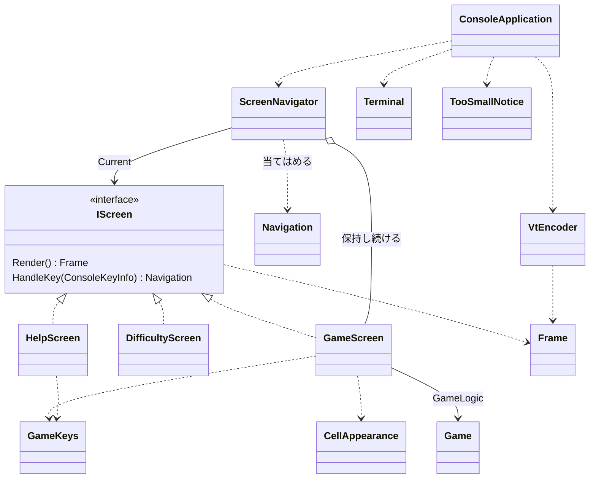

# コンソール版の画面まわりの型の設計

## 0. 何を作るか（What の言い直し）と仮定

What: 「端末に今の画面を描き、押されたキーをその画面に渡し、画面の求めに応じて画面を切り替える」。画面は、ゲーム・難易度の選択・ヘルプの 3 つ。端末が画面より小さいときは、画面の代わりに「端末を大きくしてください」を描く。

置いた仮定（課題に書かれていないので、こう決めて進めた）:

- A1. GameLogic には `Game`（開く・旗を立てる・勝敗・残り地雷数）、`Board`（セルの状態）、`Difficulty`（初級・中級・上級のプリセット）がある。経過時間は `Game` が持たないとし、画面の側で測る。
- A2. 難易度の選択とヘルプは、どちらもゲームの画面から開き、閉じるとゲームの画面に戻る（画面の行き来はゲームを中心にした星形）。ヘルプを閉じたとき、遊んでいたゲームはそのまま続く。
- A3. 難易度の画面はプリセットから選ぶだけとする。カスタム（幅・高さ・地雷数の入力）は課題にないので作らない。
- A4. 表示の文字は、1 文字が端末の 1 桁を占めるもの（ASCII と罫線など）を使う。日本語の文言を出すなら、表示幅の計算（全角は 2 桁）を `FrameLine.Width` の 1 か所に封じる。
- A5. Windows 11 の端末（Windows Terminal）は VT のシーケンスを解釈する。古い conhost で有効になっているかは、実機で確かめる（下の 6 章）。
- A6. 画面が小さい間は、キーは「終了」だけを受け付け、他は捨てる。

## 1. 関心事の列挙（クラスはその結果）

| 関心事 | 変わる理由 | 置き場所 |
|---|---|---|
| 各画面に何を描き、キーで何をするか | 画面ごとの見た目・操作の変更 | `GameScreen`、`DifficultyScreen`、`HelpScreen` |
| 画面の間の行き来 | 画面の増減、戻り先の変更 | `ScreenNavigator`、`Navigation` |
| ゲームのキーの割り当て（操作とヘルプの説明の両方が使う） | キーの変更 | `GameKeys`、`GameCommand` |
| セルの状態 → 文字と見た目の対応表 | 盤面の見た目の変更 | `CellAppearance` |
| 描く内容（端末に依存しない文字と見た目の並び） | ほぼ変わらない（値） | `Frame`、`FrameLine`、`TextRun`、`TextStyle`、`TerminalSize` |
| 描く内容 → VT のシーケンスの変換（中央寄せ、色、消去） | 色やエスケープの変更 | `VtEncoder` |
| 「小さすぎる」ときの画面 | 文言の変更 | `TooSmallNotice` |
| 本物の端末（`System.Console`）の準備・後始末・入出力 | OS・端末の差 | `Terminal` |
| 主ループ（描く → キーを待つ → 渡す） | ほぼ変わらない | `ConsoleApplication` |

要点は「画面は `System.Console` に触らず、描く内容を値（`Frame`）として返す」ことである。これで画面の単位は、端末なしに xUnit で「このキーを渡すと、この行にこの文字が出る」と確かめられる。

## 2. 型の一覧（名前・シグネチャ・責務）

### 2.1 描く内容（値）

```csharp
readonly record struct TerminalSize(int Width, int Height)
{
    bool CanContain(TerminalSize other);           // other.Width <= Width && other.Height <= Height
}

enum TextStyle { Plain, Title, Hint, Unopened, Opened, Number1, /* … */ Number8, Flag, Mine, ExplodedMine, WrongFlag }

readonly record struct TextRun(string Text, TextStyle Style, bool IsSelected = false);  // IsSelected はカーソル（反転表示）

sealed class FrameLine
{
    FrameLine(IReadOnlyList<TextRun> runs);
    IReadOnlyList<TextRun> Runs { get; }
    string Text { get; }                           // 見た目を除いた文字（テストで使う）
    int Width { get; }                             // 表示幅（A4 の封じ込め先）
}

sealed class Frame
{
    Frame(IReadOnlyList<FrameLine> lines);
    IReadOnlyList<FrameLine> Lines { get; }
    TerminalSize Size { get; }                     // 幅 = 最も長い行、高さ = 行数
}
```

- `Frame` は「端末に依存しない、1 画面分の文字と見た目」。
- `Frame.Size` が、その画面に要る端末の大きさそのものである。各画面に「最小の大きさ」を別に持たせず、描いた結果から決める（Once And Only Once。上級の盤面の幅が変わっても、判定を直す場所がない）。
- `TextStyle` は色の名前ではなく意味の名前にする。色の割り当ては `VtEncoder` だけが知る。

### 2.2 画面

```csharp
interface IScreen
{
    Frame Render();
    Navigation HandleKey(ConsoleKeyInfo key);
}

sealed class GameScreen(Difficulty difficulty, TimeProvider time) : IScreen
{
    Frame Render();                                // 残り地雷数・経過時間・盤面・キーの案内
    Navigation HandleKey(ConsoleKeyInfo key);      // GameKeys で GameCommand に直し、Game に伝える
}

sealed class DifficultyScreen(Difficulty current) : IScreen
{
    Frame Render();                                // プリセットの一覧、選択中を反転
    Navigation HandleKey(ConsoleKeyInfo key);      // ↑↓ で選ぶ、Enter → StartGame、Esc → BackToGame
}

sealed class HelpScreen : IScreen
{
    Frame Render();                                // ルールの要約と GameKeys.Descriptions
    Navigation HandleKey(ConsoleKeyInfo key);      // Esc・H など → BackToGame
}
```

ひとことで言うと:
- `GameScreen`: 1 回のゲームを表示し、キーの操作をゲームに伝える。カーソルの位置と経過時間（最初に開いたときから勝敗が決まるまで）もここに持つ。
- `DifficultyScreen`: 難易度を選ばせる。
- `HelpScreen`: 遊び方とキーを見せる。

`IScreen` は、実装がいま 3 つあり、`ScreenNavigator` と主ループがそれらを同じ扱いで描き・キーを渡すので入れる（実装が一つしかない抽象ではない）。基底クラスは作らない（共通の処理がなく、再利用のための継承になるため）。

### 2.3 画面の行き来

```csharp
abstract record Navigation
{
    sealed record Stay : Navigation;
    sealed record ShowHelp : Navigation;
    sealed record ShowDifficulty : Navigation;
    sealed record BackToGame : Navigation;
    sealed record StartGame(Difficulty Difficulty) : Navigation;
    sealed record Quit : Navigation;
}

sealed class ScreenNavigator(Difficulty initial, TimeProvider time)
{
    IScreen Current { get; }
    bool IsQuitRequested { get; }
    void HandleKey(ConsoleKeyInfo key);            // Current.HandleKey の結果を当てはめる
}
```

- 画面は「次にどこへ行きたいか」を値で返すだけで、他の画面を作ったり知ったりしない。画面の生成と、ゲームの画面を保持して戻る責務は `ScreenNavigator` に集める（Creator）。
- `StartGame` だけが難易度を運ぶので、列挙型と null になりうる難易度の組ではなく、閉じた record の階層にした（`switch` の式で漏れなく扱える）。
- ヘルプを閉じたときに同じゲームへ戻れるように、`ScreenNavigator` は `GameScreen` を 1 つ保持し続ける（A2）。

### 2.4 キーの割り当てと見た目の表

```csharp
enum GameCommand { MoveUp, MoveDown, MoveLeft, MoveRight, Open, ToggleFlag, NewGame, ChooseDifficulty, ShowHelp, Quit }

static class GameKeys
{
    GameCommand? Find(ConsoleKeyInfo key);
    IReadOnlyList<(string Keys, string Description)> Descriptions { get; }
}

static class CellAppearance
{
    TextRun Of(Cell cell, bool isGameOver, bool isSelected);   // 未開放・数字 1〜8・旗・地雷・誤った旗…
}
```

- キーの割り当ては、`GameScreen` の操作と `HelpScreen` の説明の 2 か所が使う。どちらかに直書きすると、キーを変えたときにヘルプが嘘をつくので、1 か所の表にした（Once And Only Once）。
- `CellAppearance` は状態の組み合わせが多い表なので、`GameScreen` から出して、表だけを網羅的にテストする。

### 2.5 端末への出力

```csharp
static class TooSmallNotice
{
    Frame Create(TerminalSize required, TerminalSize actual);  // 「端末を大きくしてください（必要 60×24、今 40×20）」
}

static class VtEncoder
{
    string Encode(Frame frame, TerminalSize terminal);         // 中央寄せ、SGR で色、行末と残りの行の消去
}

sealed class Terminal : IDisposable
{
    static Terminal Open();                        // 代替画面へ切り替え、カーソルを隠す、TreatControlCAsInput = true
    TerminalSize Size { get; }                     // Console.WindowWidth / WindowHeight
    ConsoleKeyInfo? ReadKey(TimeSpan timeout);     // KeyAvailable を見て待つ。時間切れは null（時計の更新のため）
    void Write(string text);
    void Dispose();                                // 代替画面を抜け、カーソルを戻す（例外でも finally で必ず）
}

static class ConsoleApplication
{
    void Run(Terminal terminal, ScreenNavigator navigator);
}
```

`ConsoleApplication.Run` のループ（擬似コード）:

```csharp
var lastOutput = "";
while (!navigator.IsQuitRequested)
{
    var size = terminal.Size;
    var frame = navigator.Current.Render();
    var shown = size.CanContain(frame.Size) ? frame : TooSmallNotice.Create(frame.Size, size);
    var output = VtEncoder.Encode(shown, size);
    if (output != lastOutput) { terminal.Write(output); lastOutput = output; }   // 変わったときだけ書く（ちらつき防止）

    if (terminal.ReadKey(TimeSpan.FromMilliseconds(200)) is not { } key) continue;
    if (shown == frame || GameKeys.Find(key) == GameCommand.Quit) navigator.HandleKey(key);   // A6
}
```

端末の大きさは毎回読み直すので、大きさが変わったときの通知（SIGWINCH など）の仕組みは要らない。

## 3. 型の間の関係



依存の向きは一方向である: `ConsoleApplication` → `ScreenNavigator` → 各画面 → `Frame`・GameLogic。`System.Console` に触るのは `Terminal` だけ、VT のシーケンスを知るのは `VtEncoder` と `Terminal`（代替画面の切り替え）だけである。画面は端末も VT も知らない。

## 4. テストの方針（xUnit）

`ConsoleKeyInfo` はコンストラクターで作れ、`TimeProvider` は `GetUtcNow` を上書きした小さな偽物を作れるので、端末なしで次を確かめられる。

| 対象 | 例 |
|---|---|
| `GameScreen` | 右矢印でカーソルが動き、`Render` の該当の行で反転の `TextRun` が移る。Space で開くと数字が出る。最初に開いてから偽の時計を 5 秒進めると「005」。地雷を開いたら時計が止まる。D で `ShowDifficulty`、H で `ShowHelp`、Q で `Quit` |
| `DifficultyScreen` | ↓ と Enter で `StartGame(中級)`。Esc で `BackToGame` |
| `HelpScreen` | `GameKeys.Descriptions` の各行が出る。Esc で `BackToGame` |
| `ScreenNavigator` | H → `HelpScreen`、Esc → 同じ `GameScreen` のインスタンスに戻る（遊んでいた盤面が残る）。難易度で Enter → 新しい `GameScreen` |
| `CellAppearance` | 状態ごとの文字と `TextStyle`（`[Theory]` で表を網羅） |
| `TooSmallNotice` / `TerminalSize` | 幅だけ足りない・高さだけ足りない・ちょうど、の境界 |
| `VtEncoder` | 中央寄せの位置、色の SGR、行末の消去。文字列を比べる |

`Terminal` と `ConsoleApplication.Run` は単体テストをせず、Windows 11 と Linux の端末で実際に動かして確かめる（下の 6 章）。どちらも判断を持たない薄い層にしてあり、判断は `ScreenNavigator` と `VtEncoder` に寄せてある。

## 5. 作らないことにしたもの

- **`ITerminal` などの端末の抽象**: 判断を `ScreenNavigator`・`VtEncoder`・`TooSmallNotice` に移したので、差し替えてまで確かめたい振る舞いが `Run` に残らない。実装は 1 つだけなので YAGNI 違反になる。主ループをテストしたい必要が出てきたら（例: 分岐が増えた）、そのとき入れる。
- **画面の基底クラス `ScreenBase`**: 共通の処理がなく、再利用のための継承になる。
- **汎用の画面スタック（戻る履歴）**: 行き来はゲームを中心にした星形だけなので（A2）、`ScreenNavigator` がゲームの画面を 1 つ持てば足りる。画面が入れ子で開くようになったら考える。
- **セル単位の差分描画**: 1 画面分の文字列を作り、前回と変わったときだけ全体を書く。上級でも数千字で、ちらつきが問題になるまで最適化しない（計測してから）。
- **カスタムの難易度の入力、マウス、色のテーマ・設定ファイル、多言語**: 課題にない（冷蔵庫にキリン）。
- **経過時間の専用クラス（`GameClock` など）**: いまは `GameScreen` の中の 2 つの時刻（開始・終了）で足りる。ベストタイムの記録など、他から使う必要が出たら切り出す。
- **端末の大きさの変更の通知**: 毎回 `Console.WindowWidth` を読むので不要。

## 6. 正しさで気をつける点（実行環境で確かめること）

- **後始末**: 例外や Ctrl+C でも代替画面とカーソルを戻す。`Terminal` を `using` で持ち、`TreatControlCAsInput = true` にして Ctrl+C をキーとして受け、`Quit` に割り当てる（`GameKeys`）。
- **入力のリダイレクト**: `Console.KeyAvailable` はリダイレクトされた入力では例外になる。`Terminal.Open` で `Console.IsInputRedirected` を見て、メッセージを出して終わる。
- **Windows の VT**: Windows Terminal では動くが、古い conhost では VT の処理が有効でないことがある（A5）。Windows 11 の実機で確かめ、要るなら `Terminal.Open` の中で有効にする（その処理は `Terminal` の中に閉じる）。
- **Linux の `Console.WindowWidth`**: 端末によっては 0 を返すことがある。`TerminalSize` の 0 は「小さすぎる」として扱われるので落ちはしないが、実機で確かめる。
- **表示幅**: A4 に反する文字（全角、絵文字）を使うと中央寄せと「小さすぎる」の判定がずれる。使うなら `FrameLine.Width` を直す。

## 7. ユーザーの判断が要る点

- A2（ヘルプ・難易度はゲームからだけ開き、ゲームへ戻る）と A3（カスタムなし）でよいか。変えると `Navigation` と `ScreenNavigator` の形が変わる。
- A6（小さすぎる間は終了だけ受け付ける）でよいか。時計はその間も進む。
- 経過時間を `Game`（GameLogic）が持っているなら、`GameScreen` の時計は要らなくなる。
