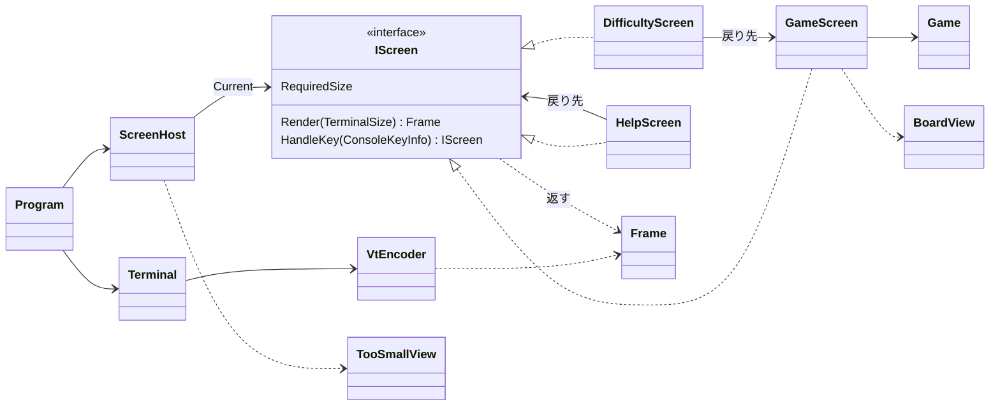

# T1 コンソール版の画面まわりの型の設計

## 1. 何を作るか（What の言い直し）と置いた仮定

What: 「今どの画面にいるかを保ち、キーを受けてその画面に操作させ、画面の中身を端末の大きさに合わせて描く」部分を作る。描く中身を決めること（純粋な計算）と、端末に書くこと（I/O）を分け、前者を xUnit で確かめる。

仮定（問題文に書かれていないので置いたもの。違っていれば直す）:

- A1. ルールのライブラリには、少なくとも次がある: `Difficulty`（初級・中級・上級）、`Game`（`Board`、状態（進行中・勝ち・負け）、残りの地雷の数を持ち、`Open(position)`、`ToggleFlag(position)` がある）、`Board`（幅・高さ・各マスの状態）、マスの位置の型（ここでは `CellPosition` と呼ぶ）。名前が違えばライブラリの名前に合わせる。
- A2. 難易度は初級・中級・上級の 3 つから選ぶ。カスタム（幅・高さ・地雷数の入力）は問題文にないので作らない。
- A3. 経過時間を表示する。時刻は `TimeProvider` で受け取る（テストで時刻を差し替えるため）。ライブラリが経過時間を持っているなら、それを使い、`TimeProvider` は要らない。
- A4. 操作はキーボードだけ。マウスは使わない。
- A5. キーの割り当て（仮）: ゲームの画面は矢印でカーソル、Space/Enter で開く、F で旗、N で同じ難易度の新しいゲーム、D で難易度の画面、H または ? でヘルプ。難易度の画面は上下で選び Enter で決定、Esc で戻る（1〜3 で直接選んでもよい）。ヘルプは Esc か H で戻る。Q と Ctrl+C はどの画面でも終了。
- A6. Windows 11 の既定の端末（Windows Terminal）と Linux の端末は VT のシーケンスを解釈する。古い conhost で VT が無効な場合の対処（VT を有効にする API を呼ぶ）は、確かめてから足す。
- A7. 端末の大きさが変わったことを知らせる仕組みは .NET の `Console` にないので、キーの待ち受けを短い間隔（100ms 程度）で区切り、そのたびに大きさを読み直す。この区切りは経過時間の表示の更新にも使う。
- A8. 全角文字（日本語の文言）は端末で 2 桁を占める。幅を数えるのは 1 か所（`DisplayWidth`）にまとめる。

## 2. 関心事の列挙（クラスはその結果）

| 関心事 | 変わる理由 | 置き場所 |
|---|---|---|
| 各画面の見た目と、その画面でのキーの意味 | 画面のレイアウト、キーの割り当て | `GameScreen`、`DifficultyScreen`、`HelpScreen`（`IScreen`） |
| 盤面のマスの描き方（記号と色） | マスの見た目 | `BoardView` |
| 今どの画面か、端末が小さすぎるときの差し替え、終了 | 画面の行き来の決まり | `ScreenHost` |
| 「端末を大きくしてください」の表示 | その画面の文言・配置 | `TooSmallView` |
| 描く中身（端末に依存しない形） | — （データ） | `Frame`、`Line`、`Span`、`Tone`、`TerminalSize` |
| 描く中身を VT の文字列に変える | 色の付け方、消去・カーソル移動のシーケンス | `VtEncoder` |
| 端末の準備・後始末、キーを読む、大きさを読む、書く | OS・端末の差 | `Terminal` |
| 起動と主のループ | — | `Program` |

## 3. 型の一覧（仕事をひとことで）と主なシグネチャ

### 3.1 描く中身（データ。I/O を持たない）

```csharp
public readonly record struct TerminalSize(int Width, int Height)
{
    public bool CanHold(TerminalSize required);   // 幅も高さも required 以上か
}

public enum Tone { Default, Dim, Number1, Number2, /* … */ Number8, Flag, Mine, WrongFlag, Accent }

public sealed record Span(string Text, Tone Tone = Tone.Default, bool IsHighlighted = false);  // 同じ見た目の文字の並び

public sealed record Line(IReadOnlyList<Span> Spans)                // 画面の 1 行
{
    public string Text { get; }        // 見た目を除いた文字（テストの主な確かめ先）
    public int Width { get; }          // 端末上の桁数（DisplayWidth で数える）
}

public sealed class Frame                                          // 端末 1 画面分の描く中身
{
    public static Frame Create(TerminalSize size, IEnumerable<Line> lines); // size に収まるように行・桁を切る
    public TerminalSize Size { get; }
    public IReadOnlyList<Line> Lines { get; }
}

public static class DisplayWidth { public static int Of(string text); }  // 全角を 2 桁として数える
```

- `Frame` は「端末に何を出すか」だけを持つ。各画面はこれを返し、端末には触れない。はみ出しの切り取りを `Frame.Create` の 1 か所で行うので、画面の側は大きさの端を気にせずに行を並べられる（端末に幅を超えて書くと折り返して崩れるので、切り取りは必須）。
- `Line.Text` があるので、テストは `Assert.Equal("残り地雷: 10", frame.Lines[0].Text)` のように文字で確かめられる。色は `Span.Tone` で確かめる。

### 3.2 画面

```csharp
public interface IScreen                        // 端末の 1 画面分の表示と、その画面でのキーの意味
{
    TerminalSize RequiredSize { get; }          // この画面を崩さずに描くのに要る大きさ
    Frame Render(TerminalSize size);            // 今の状態を描く中身にする（副作用なし）
    IScreen HandleKey(ConsoleKeyInfo key);      // キーを受け、次に出す画面を返す（留まるなら this）
}

public sealed class GameScreen : IScreen        // 1 回のゲームを遊ぶ画面
{
    public GameScreen(Game game, TimeProvider clock);
    public Difficulty Difficulty { get; }       // 難易度の画面が初期の選択に使う
    // HandleKey: 矢印でカーソル移動、Space/Enter で game.Open、F で game.ToggleFlag、
    //            N で new GameScreen(新しい Game)、D で new DifficultyScreen(this)、H/? で new HelpScreen(this)
    // Render: 状態の行（残り地雷・経過時間・勝ち負け）+ BoardView.Render(...) + 操作の案内の行
}

public sealed class DifficultyScreen : IScreen  // 難易度を選ぶ画面
{
    public DifficultyScreen(GameScreen current);   // Esc で current に戻る。選択の初期値は current.Difficulty
    // HandleKey: 上下で選択を動かす（this を返す）、Enter で new GameScreen(new Game(選んだ難易度), clock)
}

public sealed class HelpScreen : IScreen        // 遊び方とキーの一覧を見せる画面
{
    public HelpScreen(IScreen returnTo);        // Esc/H で returnTo を返す
}

public static class BoardView                   // 盤面とカーソルを行の並びにする
{
    public static IReadOnlyList<Line> Render(Board board, CellPosition cursor, GameState state);
    public static TerminalSize SizeOf(Board board);   // GameScreen.RequiredSize の計算に使う
}

public static class TooSmallView                // 「端末を大きくしてください」の画面を描く
{
    public static Frame Render(TerminalSize actual, TerminalSize required);  // 今の大きさと要る大きさも添える
}
```

- カーソルの位置は `GameScreen` の private なフィールド（`CellPosition`）にし、盤面の中に収める処理は private メソッドにする。カーソルは今 `GameScreen` しか使わないので、別の型にはしない。
- 画面が戻り先（`returnTo`、`current`）を持つので、ヘルプや難易度の画面から戻ってもゲームの途中の状態がそのまま残る。

### 3.3 画面の行き来

```csharp
public sealed class ScreenHost                  // 今の画面を保ち、キーと描画をその画面に取り次ぐ
{
    public ScreenHost(IScreen first);
    public bool HasQuit { get; }
    public Frame Render(TerminalSize size);     // size が Current.RequiredSize を入れられなければ TooSmallView.Render
    public void HandleKey(ConsoleKeyInfo key);  // Q / Ctrl+C なら HasQuit = true。端末が小さすぎる間は他のキーを捨てる
                                                // それ以外は Current = Current.HandleKey(key)
    public IScreen Current { get; }             // テストで今の画面を確かめるため
}
```

- 「小さすぎる間は終了のキーのほかは捨てる」のは、見えていない画面を操作させないためである。そのため `HandleKey` は最後に描いた大きさを覚えておく（`Render` の引数を保持する）。

### 3.4 端末（I/O。単体テストしない）

```csharp
public static class VtEncoder                   // Frame を端末に書く VT の文字列にする（純粋な関数。テストする）
{
    public static string Encode(Frame frame);   // カーソルを左上へ、行ごとに SGR で色を付け、行末まで消す
}

public sealed class Terminal : IDisposable      // 端末の準備と後始末、読み書き
{
    public static Terminal Open();              // UTF-8、代替画面バッファ、カーソル非表示、TreatControlCAsInput = true
    public TerminalSize Size { get; }           // Console.WindowWidth / WindowHeight
    public bool TryReadKey(TimeSpan timeout, out ConsoleKeyInfo key);  // KeyAvailable を見て待つ
    public void Show(Frame frame);              // VtEncoder.Encode の結果が前回と同じなら書かない（ちらつき防止）
    public void Dispose();                      // 色の解除、カーソル表示、代替画面バッファを抜ける
}
```

### 3.5 主のループ（`Program`）

```csharp
using var terminal = Terminal.Open();
var host = new ScreenHost(new GameScreen(new Game(Difficulty.Beginner), TimeProvider.System));
while (!host.HasQuit)
{
    terminal.Show(host.Render(terminal.Size));
    if (terminal.TryReadKey(TimeSpan.FromMilliseconds(100), out var key))
        host.HandleKey(key);
}
```

`using` で、例外で抜けても端末を元に戻す。

## 4. 型の間の関係



依存の向き: 画面の側（`ScreenHost`、各画面、`BoardView`）は `Frame` とルールのライブラリだけに依存し、`Console` にも VT にも依存しない。`Console` に触れるのは `Terminal` だけ、VT のシーケンスを知るのは `VtEncoder` だけである。

## 5. テストの方針（xUnit）

`ConsoleKeyInfo` は `new ConsoleKeyInfo('\0', ConsoleKey.RightArrow, false, false, false)` のように作れるので、キーの抽象は作らずにそのまま渡す。

| 対象 | 確かめること（例） |
|---|---|
| `GameScreen` | 右矢印でカーソルが動き、盤面の右端では止まる／Space でカーソルのマスが開き `Render` の行に数字が出る／F で旗が立ち残り地雷が 1 減る／D で `DifficultyScreen`、H で `HelpScreen` が返る／負けの後は開く操作が効かない／経過時間は `FakeTimeProvider` を進めて確かめる |
| `DifficultyScreen` | 初期の選択が今の難易度／下矢印と Enter で中級の `GameScreen` が返る（`Difficulty` で確かめる）／Esc で元の `GameScreen` と同じインスタンスが返る |
| `HelpScreen` | Esc で `returnTo` が返る／キーの一覧の行がある |
| `ScreenHost` | 画面の遷移が `Current` に反映される／小さい `TerminalSize` を渡すと「端末を大きくしてください」の行を含む `Frame` が返る／小さすぎる間は矢印を捨て、Q だけ効く／Ctrl+C で `HasQuit` |
| `BoardView` | 各マスの状態（未開放・空・1〜8・旗・地雷・誤った旗）の記号と `Tone`、カーソルの位置だけ `IsHighlighted` |
| `Frame`、`DisplayWidth` | 幅を超える行と、高さを超える行が切られる／全角が 2 桁で数えられ、全角の途中で切れない |
| `VtEncoder` | 行ごとにカーソル移動と行末の消去が入る／`Tone` が SGR に変わり、行の終わりで色が戻る |

盤面を決めたゲームは、ルールのライブラリのテストの補助（地雷の位置を指定して `Game` を作る方法）を使う（A1 の範囲で、あると仮定）。

`Terminal` と `Program` は単体テストせず、Windows 11 と Linux の端末で実際に動かして確かめる（準備と後始末、大きさを変えたときの切り替え、Ctrl+C で端末が元に戻ること）。

## 6. 設計の理由

- **中身を決めることと書くことを分けた。** 画面の単位をテストしたいという要求に対して、各画面が `Console` に書くのではなく `Frame` を返す形にした。これで画面は「状態 → 描く中身」「キー → 次の画面」という副作用のない関数になり、端末なしで確かめられる。I/O は `Terminal` の薄い層に閉じ込めた（本質的に環境に依存する部分の封じ込め）。
- **`IScreen` のインターフェイスは入れた。** 実装が最初から 3 つあり（ゲーム・難易度・ヘルプ）、それぞれの描き方とキーの意味が違う。`ScreenHost` で画面の種類ごとに `switch` を書く代わりに、各画面が「自分で答える」形にした。画面を 1 つ足すときは、新しい型を足し、どこかの画面の `HandleKey` から返すだけで、`ScreenHost` は変わらない。
- **画面の遷移は「次の画面を返す」形にした。** 遷移の決まりが各画面の中で読み切れ、テストでは戻り値を見るだけでよい。戻り先は画面が持つので、画面の積み重ね（スタック）の仕組みは要らない。
- **「端末が小さすぎる」は画面ではなく `ScreenHost` の判断にした。** これはどの画面にいても起こり、戻る先は常に今の画面である。`IScreen` の一つにすると、各画面の `HandleKey` が「小さすぎる画面」に移る処理を持つことになり、同じ判断が 3 か所に散らばる。要る大きさは画面ごとに違う（ゲームの画面は難易度で変わる）ので、各画面が `RequiredSize` で答える（Expert）。
- **盤面の描き方を `BoardView` に分けた。** 「マスの見た目」と「ゲームの画面のキーの意味・配置」は変わる理由が違う。マスの 8 種類程度の状態の対応表は、それだけで確かめたい。
- **経過時間と大きさの変化のために、キーの待ち受けを区切った（A7）。** 別スレッドのタイマーや、大きさの変化のイベントは使わない。1 本のループで「描く → 少し待ってキーを読む」を繰り返すだけで、描画が 1 か所からしか起こらない。変わっていないときは `Terminal.Show` が書かないので、ちらつかない。

変更の見通しと、直す場所:

| 変更 | 直す場所 |
|---|---|
| マスの記号や色を変える | `BoardView`（色の SGR は `VtEncoder`） |
| キーの割り当てを変える | その画面の `HandleKey` だけ（終了のキーは `ScreenHost`） |
| 画面を足す（例: ベストタイムの画面） | 新しい `IScreen` と、そこへ移る画面の `HandleKey` |
| 端末の扱いの差（conhost の VT の有効化など） | `Terminal` だけ |

## 7. 作らないことにしたもの（引き算）

- **`ITerminal` などの端末の抽象**: 実装が 1 つしかなく、テストで差し替えたい判断（遷移・小さすぎるときの扱い）はすべて `ScreenHost` と各画面にある。`Program` のループは 5 行で、差し替えてまで確かめる判断を持たない。YAGNI。
- **独自のキーの型・キーの抽象**: `ConsoleKeyInfo` はテストで作れるので、そのまま使う。
- **キーの割り当ての設定（ファイルや表）**: 要求にない。割り当ては各画面のコードにある。
- **画面の基底クラス**: 3 つの画面に共通の処理がない。共通の処理が出てきても、継承ではなく部品（`BoardView` のような静的な関数）で共有する。
- **画面のスタック・ナビゲーターの汎用の仕組み**: 戻る深さが 1 段しかなく、戻り先を画面が持てば足りる。
- **マス単位の差分の描画**: 盤面は最大でも上級（30×16）で、1 画面分の文字列を書き直しても十分速いと見込む。前回と同じなら書かない、だけにした。遅さが実際に見えたら、計測してから差分を考える。
- **カスタムの難易度、マウス、効果音、ベストタイム、多言語対応、色のテーマ**: 問題文にない（A2、A4）。
- **カーソルの型（`BoardCursor` など）**: 使うのが `GameScreen` だけなので、private なフィールドとメソッドにした。2 つ目の利用者（別の画面や別の UI）が出たら切り出す。
- **大きさの変化の通知（シグナル `SIGWINCH` や Windows のイベント）**: .NET の `Console` で共通に扱えず、ループでの読み直しで足りる（A7）。

## 8. 判断を仰ぎたい点

- 端末が小さすぎる間に、終了以外のキーを捨てる（見えない画面を操作させない）としたが、受け付け続ける方がよいか。
- A5 のキーの割り当て、とくに終了を Q にするか（誤って押しやすい。終了の前に確かめるか）。
- A3: 経過時間をライブラリが持つか、画面の側で `TimeProvider` から数えるか（ライブラリの `Game` の形しだい）。
- A6: 古い conhost で起動された場合に VT を有効にする処理を入れるか（Windows 11 の既定の端末で足りるなら入れない）。
