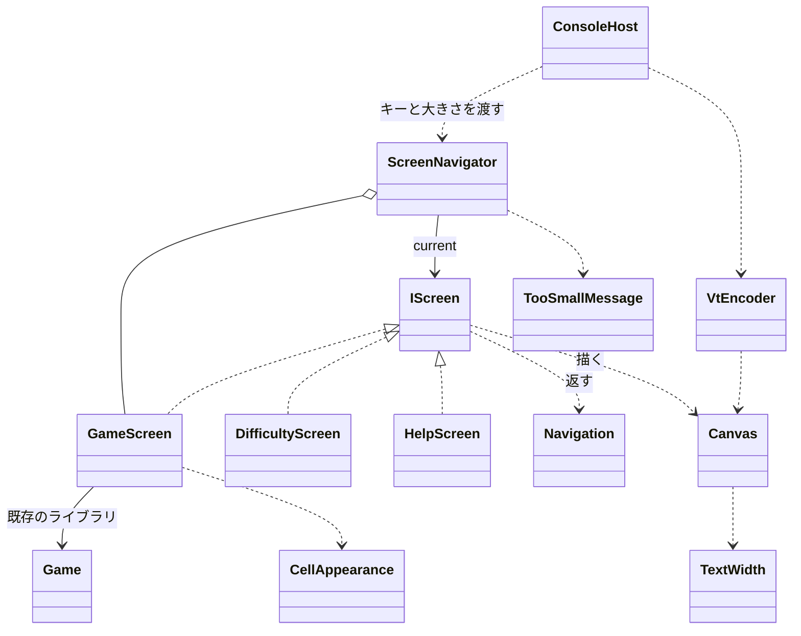

# コンソール版マインスイーパー: 画面まわりの型の設計

判断の基準として、スキル C の「設計の相談」の行に従い、modeling.md と object-design.md を読んだ。インターフェイスを 1 つ新しく作るので、simplicity.md も読んだ。

## 1. What の言い直し（何を作り、何を作らないか）

- **作るもの**: 3 つの画面（ゲーム、難易度の選択、ヘルプ）と、「端末を大きくしてください」の表示。キーで画面を切り替える仕組み。画面の内容を VT のシーケンスに変えて端末に書く部分。
- **テストしたいもの**: 各画面の「キーを受けたらどうなるか」と「何を描くか」。xUnit から、端末なしで確かめたい。
- **ゲームのルール**（`Board`、`Game`）は既存のライブラリにあり、テストも済んでいる。画面の側ではルールを判定しない。

### 置いた仮定（質問できないため）

| # | 仮定 |
|---|---|
| A1 | ライブラリの API は次の形とする: `Game(Difficulty)`、`game.Open(Position)`、`game.ToggleFlag(Position)`、`game.State`（Playing / Won / Lost）、`game.RemainingMines`、`game.Board`、`game.Difficulty`。`Board.Rows`、`Board.Columns`、`board[Position]` は `Cell` を返し、`Cell` は開いたか、旗、地雷、周りの地雷の数を持つ。`Difficulty` には定義済みの一覧（`Difficulty.All`: 初級・中級・上級）がある。形が違うときは、`GameScreen` と `CellAppearance` の中だけを合わせればよい。 |
| A2 | 経過時間を表示する。時間はライブラリが持たず、画面の側で `TimeProvider` から数える（ライブラリが持つなら、そちらを使う）。 |
| A3 | キーの割り当て。ゲーム画面: 矢印でカーソルを動かす、Space で開く、F で旗、D で難易度の選択、H か ? でヘルプ、N で新しいゲーム、Q で終了。難易度の画面: 上下で選ぶ、Enter で決める、Esc で戻る。ヘルプの画面: Esc か H で戻る。Ctrl+C でも終了する。 |
| A4 | カスタムの難易度（幅・高さ・地雷の数の入力）はない。課題は「難易度を選ぶ画面」なので、定義済みの中から選ぶだけとする。 |
| A5 | 端末が小さすぎる間は、終了のキー（Q、Ctrl+C）だけを受け付け、ほかのキーは捨てる。見えない盤面を操作させないためである。 |
| A6 | 画面の文言は日本語。全角の文字は 2 桁を占める。 |
| A7 | Windows 11 の既定の端末（Windows Terminal）は VT に対応していると考える。古いコンソール ホストで VT が効くかは、実機で確かめる項目とする。 |

## 2. 関心事の列挙（ここからクラスが決まる）

| 関心事 | 変更理由 | 担当する型 |
|---|---|---|
| どの画面を出すか、画面をどう切り替えるか、小さすぎるときの差し替え | 画面の流れを変える | `ScreenNavigator` |
| 各画面のキーの解釈と描く内容 | その画面の操作や見た目を変える | `GameScreen`、`DifficultyScreen`、`HelpScreen` |
| 画面から画面への指示 | 切り替えの種類を足す | `Navigation` |
| マスの状態からの文字と色 | マスの見た目を変える | `CellAppearance` |
| 1 画面分の文字と色を、全角の幅を含めて置く | 描き方の約束（はみ出しを切る、全角の扱い） | `Canvas`、`TextStyle`、`TextWidth` |
| 画面の内容から VT のシーケンスへの変換 | 端末に書く方式を変える | `VtEncoder` |
| 本物の端末の準備・後始末、キーの読み取り、大きさの確認、書き込み | OS や端末の差 | `ConsoleHost` |
| 端末の大きさ | — | `TerminalSize` |

**方針（Testable）**: 判断はすべて純粋な型（`ScreenNavigator` 以下）に置き、`System.Console` に触れるのは `ConsoleHost` だけにする。画面は「キー → `Navigation`」と「大きさ → `Canvas`」の 2 つの操作だけを持つので、テストはキー（`ConsoleKeyInfo` はそのまま `new` できる）を渡して、返った `Navigation` と `Canvas` の文字を見るだけで済む。

## 3. 型の一覧とシグネチャ

### 3.1 画面の切り替え

```csharp
// 今の画面を決め、キーと描画をその画面に取り次ぐ
public sealed class ScreenNavigator
{
    public ScreenNavigator(Difficulty initial, TimeProvider time);

    public bool IsQuitRequested { get; }

    // 小さすぎるときは終了のキーだけを受ける（A5）ので、大きさも受け取る
    public void HandleKey(ConsoleKeyInfo key, TerminalSize size);

    // 小さすぎるときは TooSmallMessage を、そうでなければ今の画面を描く
    public Canvas Render(TerminalSize size);
}
```

- 持つもの: `GameScreen game`（ヘルプや難易度の画面を開いている間も、ゲームは残す）と `IScreen current`。
- `Navigation` の解釈: `Back` → `current = game`、`ShowHelp` → `new HelpScreen()`、`ShowDifficulty` → `new DifficultyScreen(game.Difficulty)`、`StartGame(d)` → `game = new GameScreen(new Game(d), time)` にして `current = game`、`Quit` → `IsQuitRequested = true`。
- GameScreen を作るのは、それを持つ Navigator の仕事にする（Creator）。

```csharp
// 画面から Navigator への指示
public abstract record Navigation
{
    public sealed record Stay : Navigation;
    public sealed record Back : Navigation;
    public sealed record ShowHelp : Navigation;
    public sealed record ShowDifficulty : Navigation;
    public sealed record StartGame(Difficulty Difficulty) : Navigation;
    public sealed record Quit : Navigation;
    // 使う側は Navigation.Stay.Instance のような静的なインスタンスで受け渡す
}
```

画面は Navigator を知らず、「次にどうしたいか」を値で返すだけにする。依存が画面 → Navigator の向きに生まれないので、画面を単独でテストできる。

### 3.2 画面

```csharp
public interface IScreen
{
    TerminalSize MinimumSize { get; }            // これより小さいと TooSmallMessage に替える
    Navigation HandleKey(ConsoleKeyInfo key);
    Canvas Render(TerminalSize size);            // size は MinimumSize 以上で呼ばれる
}
```

```csharp
// 1 回のゲームの操作と表示。ルールの判定は Game に任せる
public sealed class GameScreen : IScreen
{
    public GameScreen(Game game, TimeProvider time);
    public Difficulty Difficulty { get; }        // 難易度の画面の初期選択と、N での再開に使う
    // IScreen の実装。カーソルの位置（行・列）はこのクラスの private なフィールドに置く
}
```

- 描く内容: 1 行目に残りの地雷の数・経過時間・状態（勝ち・負け）、盤面（1 マスを 2 桁で、カーソルのマスは反転）、最後の行にキーの案内。盤面は端末の中央に置く。
- `MinimumSize` と `Render` は、同じ private な定数（1 マスの幅、上下の行の数）から計算する（Once And Only Once）。
- 経過時間は `Game` が始まった時刻（最初に開いた時刻）と `time.GetUtcNow()` の差で出す（A2）。

```csharp
public sealed class DifficultyScreen : IScreen
{
    public DifficultyScreen(Difficulty current);   // 今の難易度を選んだ状態で開く
    // 上下で選択、Enter → StartGame(選んだ難易度)、Esc → Back
}

public sealed class HelpScreen : IScreen
{
    // 文言の固定の行を描くだけ。Esc か H → Back
    // MinimumSize は、いちばん長い行の表示の幅と行の数
}

// 「端末を大きくしてください」。どこからも移れない画面なので IScreen にはしない
public static class TooSmallMessage
{
    public static Canvas Render(TerminalSize actual, TerminalSize required);
    // 今の大きさと要る大きさも出す。端末が文言より狭いときは Canvas が切る
}

// マスの状態から、表示する文字と色を決める
public static class CellAppearance
{
    public static (string Text, TextStyle Style) Of(Cell cell, GameState state);
    // 負けた後は地雷と誤った旗を見せる、など状態で変わる分もここで決める
}
```

### 3.3 描画の土台

```csharp
public readonly record struct TerminalSize(int Columns, int Rows)
{
    public bool IsAtLeast(TerminalSize required);
}

public readonly record struct TextStyle(ConsoleColor? Foreground, ConsoleColor? Background, bool Inverse);

// 1 画面分の文字と色。全角は 2 桁を占め、範囲の外に出る分は切る
public sealed class Canvas
{
    public Canvas(TerminalSize size);
    public TerminalSize Size { get; }
    public void Write(int column, int row, string text, TextStyle style = default);
    public void WriteCentered(int row, string text, TextStyle style = default);
    public string RowText(int row);                // テストで文字を見るため
    public TextStyle StyleAt(int column, int row); // テストで色を見るため
}

public static class TextWidth
{
    public static int Of(string text);   // 全角 2、半角 1（A6）
}

// Canvas を VT のシーケンスに変える（純粋な関数）
public static class VtEncoder
{
    public static string Encode(Canvas canvas);
    // カーソルを左上へ動かし（ESC[H）、行ごとに色が変わるところでだけ SGR を出す。
    // 最後の行は改行しない（画面が上に送られないように）
}
```

全角の幅と画面の外に出る分の切り方は、本質的な複雑さなので `Canvas` の中に閉じ込める。画面の側は、座標と文字列を渡すだけで済む。

### 3.4 本物の端末

```csharp
// 端末の準備と後始末、読み取りと書き込みのループ。テストせず、実機で確かめる
public static class ConsoleHost
{
    public static void Run(ScreenNavigator navigator);
}
```

- 準備: `Console.OutputEncoding = UTF8`、`Console.TreatControlCAsInput = true`（Ctrl+C もキーとして受けて、後始末を必ず通す）、代替スクリーン `ESC[?1049h`、カーソルを隠す `ESC[?25l`。
- ループ: 約 50 ミリ秒ごとに、`KeyAvailable` ならキーを 1 つ読んで `HandleKey` に渡す。そのたびに `Render(今の大きさ)` を `VtEncoder.Encode` し、**前回に書いた文字列と違うときだけ**書く。キー、端末の大きさの変化、経過時間の秒の変化を、この一つの仕組みで扱える。大きさの変化のイベントは OS によって有無が違うので、使わずに毎回の確認で済ませる。
- 後始末（`finally`）: カーソルを戻し、代替スクリーンを抜ける。

## 4. 型の間の関係



依存は、端末 → Navigator → 画面 → ライブラリの一方向である。`System.Console` を知るのは `ConsoleHost` だけである。

## 5. 設計の理由

1. **判断を端末から離す**: 端末の I/O を差し替えるためのインターフェイスではなく、判断する型そのものを I/O のない形（キー → `Navigation`、大きさ → `Canvas`）にした。これでテストに偽の端末が要らず、`ConsoleHost` は薄いまま残る。
2. **`IScreen` を置く理由**: 実装が今 3 つあり（ゲーム、難易度、ヘルプ）、Navigator は「今の画面」を種類で分岐せずに扱う必要がある。多態のためのインターフェイスで、将来への備えではない（simplicity.md の YAGNI の点検に当たらない）。
3. **`Navigation` を値で返す**: 画面が Navigator を呼び返すと、依存が循環し、画面のテストに Navigator が要る。値で返せば、テストは返った値を比べるだけで済む。
4. **小さすぎるときの判定を Navigator に置く**: どの画面にも共通の決まり（`MinimumSize` と比べて差し替える）なので、1 か所に置く。要る大きさは、その情報を持つ各画面が答える（Expert）。
5. **ゲームを残したままヘルプや難易度の画面を開く**: 「ヘルプを見て戻ったら盤面が消えていた」ことにならないように、`GameScreen` を Navigator が持ち続ける。画面の積み重ね（スタック）は、今の遷移（ゲームから開いてゲームに戻る）には要らない。
6. **マスの見た目を `CellAppearance` に分ける**: 見た目の変更（記号や色）は、キーの操作の変更とは理由が違う。純粋な関数なので、状態ごとの表をテストで押さえやすい。
7. **全部を描き、違うときだけ書く**: 差分の描画（変わったマスだけを書く）は複雑さのわりに効き目が分からない。1 画面の文字列を比べるだけで、無駄な書き込みとちらつきの多くは防げる。

## 6. テストの例（xUnit）

- `ScreenNavigator`: D のキーで難易度の画面が描かれる／難易度の画面で Esc を押すとゲームに戻り、盤面が残っている／上級を選ぶと盤面が上級の大きさになる／端末が小さいと「端末を大きくしてください」が描かれ、Space を押しても盤面が変わらない／小さい間も Q で終了する。
- `GameScreen`: 矢印でカーソルが動き、端では止まる／Space でカーソルのマスが開く（盤面を決められる `Game` を使う）／F で旗が立ち、残りの数が減る／勝ったら勝ちの表示と N の案内が出る／`TimeProvider` の偽物を進めると経過時間が変わる。
- `DifficultyScreen`: 開いたときは今の難易度を選んでいる／Enter で `StartGame(選んだ難易度)` を返す。
- `CellAppearance`: 各状態（未開放、旗、数字 1〜8、地雷、誤った旗）の文字と色。
- `Canvas` / `TextWidth`: 全角が 2 桁を占める／右端を越える分と、全角の文字の半分がはみ出す分は切る。
- `VtEncoder`: 色が変わるところでだけ SGR を出す／最後の行に改行がない。
- `ConsoleHost` は単体テストせず、Windows 11 の Windows Terminal と Linux の端末で動かして確かめる（大きさの変更、Ctrl+C の後始末、全角の表示、A7）。

## 7. 作らないことにしたもの

| 作らないもの | 理由 |
|---|---|
| 端末を包むインターフェイス（`ITerminal` など）と偽の端末 | 判断を I/O のない型に置いたので、テストに差し替える口が要らない。`ConsoleHost` に判断が増えてテストが必要になったら入れる。 |
| 差分の描画 | 上の 5 の 7。ちらつきや遅さを実機で確かめてから考える。 |
| 画面のスタックや、汎用のルーター | 遷移は「ゲームから開き、ゲームに戻る」だけである。 |
| 画面の基底クラス | 共通の処理がほとんどなく、再利用のためだけの継承になる。 |
| カスタムの難易度の入力（A4）、ヘルプのスクロール、マウスの操作、色のテーマの設定、ベストタイム、多言語化 | 課題にない。 |
| 端末の大きさの変化のイベントへの対応 | OS によって有無が違う。ループで毎回大きさを見れば足りる。 |
| 独自のキーの型 | `ConsoleKeyInfo` はテストの中で作れるので、包む理由がない。 |
| カーソルの独立した型 | 今は `GameScreen` の中の 2 つの値と端で止める処理だけである。別の画面が使うようになったら切り出す。 |

## 8. ユーザーの判断が要る点

- A3 のキーの割り当てと、A5（小さすぎる間はキーを捨てる）でよいか。
- 経過時間をライブラリと画面のどちらで数えるか（A2）。ライブラリの `Game` の API の実際の形（A1）。
- 古いコンソール ホストにも対応するか（A7）。対応するなら、`ConsoleHost` で VT の処理を有効にする OS の呼び出しが要る。
