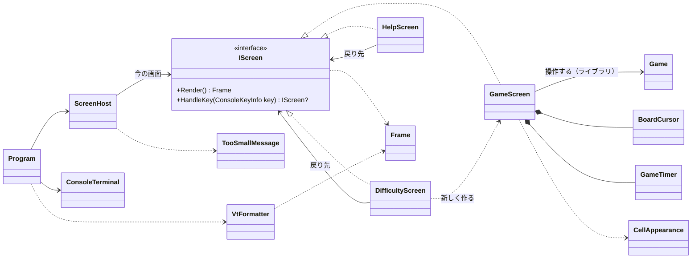

# コンソール版の画面まわりの型の設計

作業の種類は「設計の相談」とし、スキル C の modeling.md、object-design.md と、interface を新しく作るので simplicity.md を読んで判断した。

## 0. 何を作るか（What）と仮定

**What**: 3 つの画面（ゲーム、難易度の選択、ヘルプ）と「端末を大きくしてください」の表示を、次の二つに分けて作る。
- 純粋な部分: 画面の状態を「フレーム（文字と色の並び）」に変え、キーを受けて次の画面を決める。xUnit で端末なしに確かめる。
- 薄い端末の部分: フレームを VT のシーケンスで書き出し、キーと端末の大きさを読む。`System.Console` に触るのはここだけで、実行して確かめる。

**仮定**（質問できないので置いたもの。違えば直す）
1. ゲームのルールのライブラリには、少なくとも `Game`（`new Game(Difficulty)`、`Open(Position)`、`ToggleFlag(Position)`、状態 `GameState`、残り地雷数）、`Board`（幅・高さ、マスの状態）、`Difficulty`（初級・中級・上級）がある。名前が違えば、`GameScreen` と `CellAppearance` の中だけを合わせる。
2. ライブラリは時計を持たない。経過時間は画面の側で数える（ライブラリが持つなら `GameTimer` は作らない）。
3. 難易度は初級・中級・上級の 3 つだけ。カスタムは課題にないので入れない（入れるときは `DifficultyScreen` に入力欄を足し、画面は増やさない）。
4. 画面の文言は日本語。なので、全角の文字は 2 桁として幅を数える。
5. 端末が小さすぎる間は、終了のキーだけを受け、ほかのキーは捨てる（見えない盤面を操作させない）。
6. 配置は固定で、端末の大きさに合わせて並べ替えない。必要な大きさは、描いたフレームの大きさそのものとする。
7. 操作のキー（案）: ゲームは矢印でカーソル移動、Space/Enter で開く、F で旗、N で新しいゲーム、D で難易度、? でヘルプ、Q で終了。難易度は ↑↓ と Enter、Esc で戻る。ヘルプは何かのキーで戻る。Ctrl+C でもどこからでも終了する。

## 1. 関心事と型の対応

先に関心事を挙げ、その結果として型を決めた。

| 関心事 | 型 | ひとことで言うと |
|---|---|---|
| 画面の共通の約束 | `IScreen` | キーを受けて次の画面を返し、自分をフレームに描く |
| ゲームの操作と表示 | `GameScreen` | 1 回のゲームをキーで遊ばせる画面 |
| 盤面の上の選択位置 | `BoardCursor` | 盤面の中に留まるカーソル |
| マスの見た目 | `CellAppearance` | マスの状態を文字と色に変える |
| 経過時間 | `GameTimer` | 最初に開いてから終わるまでの時間を数える |
| 難易度の選択 | `DifficultyScreen` | 難易度を選ばせて新しいゲームを始める画面 |
| ヘルプ | `HelpScreen` | 操作の説明を見せて元の画面に戻る画面 |
| 今の画面と端末の大きさの仲立ち | `ScreenHost` | 今の画面を持ち、端末に見せるフレームを決める |
| 小さすぎるときの表示 | `TooSmallMessage` | 「端末を大きくしてください」のフレームを作る |
| 描いた結果 | `Frame`、`FrameLine`、`TextRun`、`TextStyle` | 端末に出す前の、文字と色の並び |
| 大きさ | `TerminalSize` | 桁数と行数の組 |
| 表示の幅 | `TextWidth` | 文字列が端末で何桁を占めるか |
| VT への変換 | `VtFormatter` | フレームを VT のシーケンスの文字列にする |
| 端末の入出力 | `ConsoleTerminal` | 端末の準備と後始末、キーと大きさの読み取り、書き出し |
| 起動とループ | `Program` | 上のものをつなぎ、キーを待って描き直し続ける |

## 2. 型の関係



依存の向き: 画面 → ライブラリ（`Game`）、画面 → `Frame`。`Frame` と画面は `System.Console` を知らない（`ConsoleKeyInfo` と `ConsoleColor` は値の型として使うだけで、端末には触らない）。`System.Console` に触るのは `ConsoleTerminal` だけである。

## 3. 型ごとの主なシグネチャと責務

### 3.1 画面

```csharp
interface IScreen
{
    Frame Render();
    /// 次に見せる画面を返す。自分のままなら this、終了なら null。
    IScreen? HandleKey(ConsoleKeyInfo key);
}
```
- 画面の行き来は、`HandleKey` が次の画面を返すことで表す。行き来の表（どの画面からどこへ行くか）は、各画面が自分の分だけを知る。

```csharp
sealed class GameScreen(Game game, TimeProvider clock) : IScreen
{
    public Difficulty Difficulty { get; }          // 難易度の画面の初期選択に使う
    public Frame Render();                          // 残り地雷数・経過時間・状態、盤面、キーの案内
    public IScreen? HandleKey(ConsoleKeyInfo key);  // 移動・開く・旗・N・D・?・Q
}
```
- キーをゲームの操作に割り当て、結果を描く。ルールの判断（開いたら連鎖する、勝ち負け）は `Game` に任せ、自分では判断しない（Expert）。
- `D` で `new DifficultyScreen(Difficulty, returnTo: this, clock)`、`?` で `new HelpScreen(returnTo: this)` を返す。自分を戻り先として渡すので、戻ったときにゲームの途中の状態がそのまま残る。

```csharp
readonly record struct BoardCursor(int Column, int Row)
{
    public BoardCursor Move(int dx, int dy, int width, int height);   // 盤面の端で止まる
}

static class CellAppearance
{
    public static TextRun Of(CellView cell, bool isCursor);   // CellView はライブラリのマスの状態（仮定 1）
}

sealed class GameTimer(TimeProvider clock)
{
    public void Start();              // 最初に開いたときに呼ぶ。2 回目以降は何もしない
    public void Stop();               // 勝ち・負けで呼ぶ
    public TimeSpan Elapsed { get; }
}
```
- `BoardCursor` を分けたのは、端で止まる計算を `GameScreen` のキーの分岐から外し、単独で確かめるため。
- `CellAppearance` を分けたのは、配色と記号（数字の色、旗、地雷、誤った旗、カーソルの反転）が「見た目の変更」という別の変更理由を持つため。記号は ASCII（`#`、`F`、`*`、`X`、`1`〜`8`、`.`）にする。`■` や `○` などは端末によって 1 桁にも 2 桁にもなる（East Asian Ambiguous）ので盤面には使わない（正しさ: 実行環境の差）。
- `GameTimer` は `TimeProvider` を受け取る。時刻の差し替えはテストが今すでに必要としているので、YAGNI 違反ではない（判断ルール 3）。`TimeProvider` は BCL の型なので、ライブラリを足さない。テストでは `TimeProvider` の派生を 1 つテストの側に書いて、`GetUtcNow` を進める。

```csharp
sealed class DifficultyScreen(Difficulty current, IScreen returnTo, TimeProvider clock) : IScreen
{
    public Frame Render();                          // 3 つの難易度と、盤面の大きさ・地雷数、選択中の印
    public IScreen? HandleKey(ConsoleKeyInfo key);  // ↑↓ で選択、Enter で new GameScreen(new Game(選択), clock)、Esc で returnTo
}

sealed class HelpScreen(IScreen returnTo) : IScreen
{
    public Frame Render();                          // 操作の説明（固定の文言）
    public IScreen? HandleKey(ConsoleKeyInfo key);  // Ctrl+C / Q は null、ほかは returnTo
}
```

### 3.2 仲立ちと、小さすぎるとき

```csharp
sealed class ScreenHost(IScreen first)
{
    public IScreen Current { get; }
    /// 今の画面のフレーム。端末に収まらなければ「端末を大きくしてください」のフレーム。
    public Frame FrameFor(TerminalSize terminal);
    /// キーを今の画面に渡して切り替える。終了なら false。小さすぎる間は終了のキーだけを受ける。
    public bool HandleKey(ConsoleKeyInfo key, TerminalSize terminal);
}

static class TooSmallMessage
{
    public static Frame For(TerminalSize actual, TerminalSize required);
    // 「端末を大きくしてください」「必要: 62 × 20 / 現在: 40 × 15」「Q で終了」
}
```
- 「小さすぎるか」は、描いたフレームの大きさ `Frame.Size` と端末の大きさを比べて決める。各画面に「必要な大きさ」を別に持たせないので、配置を変えても必要な大きさの計算を直す箇所がない（Once And Only Once）。難易度で盤面の大きさが変わっても、そのまま正しい。
- ループの判断（小さすぎるときのキーの扱い、終了）を `Program` ではなく `ScreenHost` に置いたのは、端末なしで xUnit で確かめられるようにするため。

### 3.3 フレーム

```csharp
readonly record struct TerminalSize(int Width, int Height);

readonly record struct TextStyle(ConsoleColor? Foreground = null, ConsoleColor? Background = null, bool Reverse = false, bool Bold = false);
readonly record struct TextRun(string Text, TextStyle Style = default);

sealed class FrameLine(IReadOnlyList<TextRun> runs)
{
    public IReadOnlyList<TextRun> Runs { get; }
    public string Text { get; }     // 色を除いた文字だけ（テストで比べる）
    public int Width { get; }       // TextWidth で数えた桁数
}

sealed class Frame(IReadOnlyList<FrameLine> lines)
{
    public IReadOnlyList<FrameLine> Lines { get; }
    public TerminalSize Size { get; }                 // 最も広い行の桁数 × 行数
    public bool FitsIn(TerminalSize terminal);
}

static class TextWidth
{
    public static int Of(string text);   // 全角（East Asian Wide / Fullwidth）を 2 桁、それ以外を 1 桁
}
```
- 画面は VT のシーケンスを直接書かず、`Frame` を返す。テストは `Lines[i].Text` と `Runs` の `Style` を比べればよく、エスケープ シーケンスの文字列を読まずに済む。
- 色は `ConsoleColor` を使う（VT の 16 色に対応する BCL の型。新しい列挙型を作らない）。

### 3.4 端末

```csharp
static class VtFormatter
{
    /// 左上に戻り、各行を SGR 付きで書き、端末の幅で切り、行末と下の残りを消す文字列。
    public static string Format(Frame frame, TerminalSize terminal);
}

sealed class ConsoleTerminal : IDisposable
{
    public static ConsoleTerminal Open();       // UTF-8、代替画面 ESC[?1049h、カーソル非表示、Ctrl+C をキーとして受ける。Windows では VT の処理を有効にする
    public TerminalSize Size { get; }           // Console.WindowWidth / WindowHeight
    public ConsoleKeyInfo? ReadKey(TimeSpan timeout);   // KeyAvailable を見て、なければ待つ
    public void Write(string vt);
    public void Dispose();                      // 色の既定・カーソル表示・代替画面の解除を必ず戻す
}
```
- `VtFormatter` は純粋な関数なので単体テストする（切り詰め、全角の幅、SGR の出し方）。
- `ConsoleTerminal` は `System.Console` をそのまま包むだけで、判断を持たない。単体テストはせず、Windows 11（Windows Terminal と従来のコンソール）と Linux の端末で実行して確かめる。

### 3.5 ループ（`Program.Main` の形）

```csharp
using var terminal = ConsoleTerminal.Open();
var host = new ScreenHost(new GameScreen(new Game(Difficulty.Beginner), TimeProvider.System));
var shown = "";
while (true)
{
    var size = terminal.Size;
    var vt = VtFormatter.Format(host.FrameFor(size), size);
    if (vt != shown) { terminal.Write(vt); shown = vt; }         // 変わったときだけ書いて、ちらつきを抑える
    if (terminal.ReadKey(TimeSpan.FromMilliseconds(100)) is { } key && !host.HandleKey(key, size)) break;
}
```
- 100 ms ごとに描き直しを試みるので、経過時間の表示と端末の大きさの変化は、キーを押さなくても反映される。

## 4. 単体テストの例（xUnit）

| 対象 | テストの例 |
|---|---|
| `BoardCursor` | 左端で左に動かしても 0 のまま／右下の角で止まる |
| `CellAppearance` | 数字 3 は `"3"` とその色／誤った旗は `X`／カーソルのマスは Reverse |
| `GameTimer` | 開く前は 0／Start から 5 秒進めると 5 秒／Stop の後は進まない |
| `GameScreen` | → キーでカーソルが 1 つ右に動く（`Render` の反転の位置で確かめる）／Space で `Game` のマスが開く／`?` で `HelpScreen` が返り、そこでキーを押すと同じ `GameScreen` に戻る／Q で null |
| `DifficultyScreen` | ↓ と Enter で中級の `GameScreen` が返る／Esc で戻り先がそのまま返る |
| `HelpScreen` | 任意のキーで戻り先／Q で null |
| `ScreenHost` | 端末が盤面より狭いと「端末を大きくしてください」のフレーム／そのとき矢印キーは画面に渡らない／Q で false |
| `Frame`、`TextWidth` | 「あa」の幅は 3／最も広い行で `Size.Width` が決まる／`FitsIn` の境界（ちょうど同じ大きさは収まる） |
| `VtFormatter` | 端末より長い行を幅で切る（全角の途中で切らない）／スタイルが変わるところにだけ SGR が入る |

盤面を決めたい `GameScreen` のテストは、ライブラリの `Game` を地雷の位置を指定して作れることを仮定する（できなければ、ライブラリのテスト用の作り方に合わせる）。

## 5. 設計の理由（捨てた案とのトレードオフ）

- **画面を `IScreen` の多態にした**: 画面は 3 つあり、それぞれ違う状態（ゲームとカーソル、選択中の難易度、戻り先だけ）と違うキーを持つ。実装がすでに 3 つあるので、実装が 1 つだけのインターフェイスではない。捨てた案は「画面の種類の enum と、`Program` の中の switch」で、描画とキー処理の 2 か所に同じ分岐が並ぶ。
- **次の画面を返り値にした（`IScreen?`、null で終了）**: 画面の行き来を、呼び出し側に状態を持たせずに表せる。捨てた案は `Stay / GoTo / Quit` の結果の型で、明示的だが型が 1 つ増える。終了は 1 種類しかないので、null 許容の参照型（コンパイラーが確かめる）で足りると判断した。
- **戻り先をコンストラクターで渡した**: ヘルプと難易度は「開いた画面に戻る」だけなので、汎用の画面のスタックは要らない。
- **描画を `Frame` に分けた**: テストで比べたいのは「何が、どこに、どの色で出るか」であり、エスケープ シーケンスの文字列ではない。VT の知識は `VtFormatter` の 1 か所に閉じる。
- **端末の抽象（`ITerminal`）を作らなかった**: 判断はすべて `ScreenHost` と画面にあり、`ConsoleTerminal` は判断を持たない薄い包みなので、差し替えてテストする必要がない。ループの確認は実行で行う。

## 6. 作らないことにしたもの

| 作らないもの | 理由 |
|---|---|
| `ITerminal` と偽の端末 | 上のとおり。判断が端末の側に増えたら入れる |
| 画面の基底クラス `ScreenBase` | 共通の処理を使い回すためだけの継承になる。共通なのは「Q で終了」の 1 行程度 |
| 画面のスタック・ナビゲーターの汎用の仕組み | 戻り先は 1 段だけ |
| 画面ごとの「必要な大きさ」のプロパティ | `Frame.Size` から分かる |
| 端末の大きさに合わせた配置の切り替え・スクロール | 要求は「小さすぎるときにメッセージを出す」だけ（仮定 6） |
| 差分描画（変わったマスだけ書く） | 盤面は最大でも数十×数十の文字で、全体を書き直して足りる。書く文字列が前と同じなら書かないことで、ちらつきを抑える |
| SIGWINCH など、大きさの変化の通知 | 100 ms ごとに大きさを読めば足りる |
| キー割り当ての設定・色のテーマの設定 | 要求にない |
| マウスの入力、カスタムの難易度 | 要求にない（仮定 3） |
| 非同期・スレッドの時計 | 1 本のループで、キーを待つ間に時刻を読めば足りる |

## 7. 実機で確かめること（単体テストでは分からない点）

- Windows の従来のコンソール（conhost）で、VT の処理が有効になっているか（`Open` で `SetConsoleMode` の `ENABLE_VIRTUAL_TERMINAL_PROCESSING` を立てる必要があるか）。
- 日本語の文言の幅が、Windows Terminal、conhost、Linux の端末で 2 桁になり、枠や行末がずれないか。
- 例外で落ちたときと Ctrl+C のときに、`Dispose` でカーソルと代替画面が元に戻るか。
- `Console.KeyAvailable` と `ReadKey` で、矢印キーが Linux の端末でも 1 つのキーとして読めるか。

## 8. ユーザーの判断が要る点

- 仮定 1〜7（とくに、小さすぎる間のキーの扱い、カスタムの難易度を入れないこと、キーの割り当て）。
- 終了の表し方を null にするか、結果の型を作るか（5 章）。
