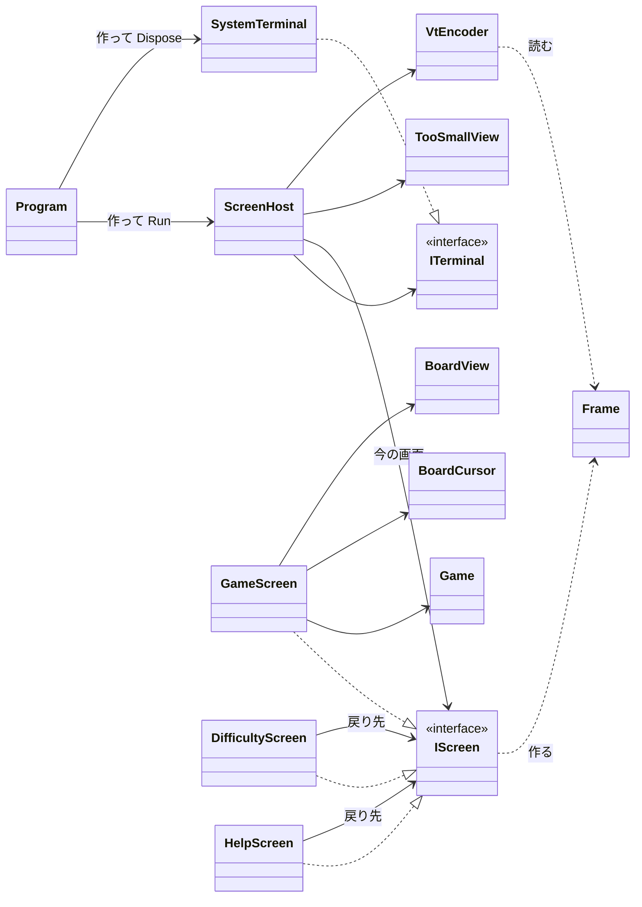

# T1 コンソール版の画面まわりの型の設計

判断の基準: スキル C（sustainable-code-jp）。作業の種類は「設計の相談」なので、modeling.md と object-design.md を読んだ。端末の差し替え口（インターフェイス）と画面のインターフェイスを新しく作るので、simplicity.md も読んだ。

## 1. 何を作るか（What の言い直し）

「ゲームの状態とキー入力から、端末に出す画面を決め、それを VT のシーケンスで描く」部分を設計する。ゲームのルール（`Board`、`Game`）はでき上がっていてテストもあるので、そのまま使う。この設計では変えない。

置いた仮定（ユーザーに聞けないので、仮定を置いて進めた）:

| # | 仮定 | 根拠・影響 |
|---|------|-----------|
| A1 | 難易度は初級、中級、上級の 3 つから選ぶ。カスタム（数値を打ち込む）は入れない | 課題に書かれていない。カスタムを入れるなら、文字を打ち込む画面の部品が要る（7 章） |
| A2 | `Game` は盤面（`Board`）、状態（遊んでいる、勝ち、負け）、開く・旗の操作、残りの地雷の数を公開している。経過時間は、時計を外から渡せる（`TimeProvider` など）形で `Game` が持っている | ルールの側がテスト済みなので、時間も差し替えられると仮定した。そうでなければ、`GameScreen` に `TimeProvider` を渡す |
| A3 | 端末は Windows 11 の Windows Terminal と、Linux の一般的な端末（どちらも VT を解釈する） | 旧来のコンソール ホスト（conhost）で VT が有効かは、実機で確かめる（8 章） |
| A4 | Q はどの画面でも終了にする。それ以外のキーの意味は画面ごとに決める | 3 つの画面のどれにも、文字を打ち込む欄がないので（A1）、Q が衝突しない |
| A5 | 勝ち・負けは、別の画面にせずにゲームの画面の状態の行で知らせる | 課題に書かれている画面は 3 つだけ |
| A6 | 端末の大きさが変わったら、キーを押さなくても描き直す。経過時間の表示も 1 秒ごとに描き直す | 「端末を大きくしてください」は、端末を大きくしたら、キーを押さなくても消えるべきだから |

## 2. 関心事の列挙と、それに対応する型

クラスの一覧を先に決めずに、関心事を先に並べた。

| 関心事 | 変わる理由 | 型 |
|--------|-----------|----|
| 端末との入出力（キーを読む、文字を書く、大きさを知る、始まりと後始末） | OS・端末の違い | `ITerminal`、`SystemTerminal` |
| 何を表示するか（画面の中身。文字と意味の上での見た目） | 画面のレイアウト、文言 | `Frame`、`FrameLine`、`Span`、`TextStyle` |
| 表示を VT のシーケンスに直す（色、カーソルの位置） | 配色、VT の使い方 | `VtEncoder` |
| 画面ごとのキーの意味と、その画面の状態 | 画面ごとの操作 | `IScreen`、`GameScreen`、`DifficultyScreen`、`HelpScreen` |
| 盤面を文字で描く（マスの状態 → 文字と見た目） | 盤面の見た目 | `BoardView` |
| ゲームの画面のカーソル（位置と、盤面の外に出ない動き） | カーソルの動き | `BoardCursor` |
| 端末が小さすぎるときの表示 | 案内の文言 | `TooSmallView` |
| 画面の行き来と、描き直しの繰り返し | 実行の流れ | `ScreenHost` |
| 端末の大きさ（幅と高さ、入るかどうかの判定） | — | `TerminalSize` |

## 3. 型の関係



依存の向きは一方向である。画面（`IScreen` の実装）は `Frame` を作るだけで、端末も VT も知らない。VT を知っているのは `VtEncoder` と `SystemTerminal` だけ、`Console` を知っているのは `SystemTerminal` だけである。

## 4. 型ごとの責務とシグネチャ

C# 13 / .NET 10 の書き方で示す。本体は省く。

### 4.1 端末: `ITerminal`、`SystemTerminal`、`TerminalSize`

```csharp
public readonly record struct TerminalSize(int Width, int Height)
{
    public bool CanShow(TerminalSize required);   // 幅も高さも required 以上か
}

// 仕事: 端末との入出力の口。テストでは偽物に差し替える
public interface ITerminal
{
    TerminalSize Size { get; }
    ConsoleKeyInfo? TryReadKey();   // 押されたキーがなければ null（待たない）
    void Write(string text);        // VT のシーケンスを含む文字列をそのまま書く
}

// 仕事: System.Console で ITerminal を実現し、端末の準備と後始末をする
public sealed class SystemTerminal : ITerminal, IDisposable
{
    public SystemTerminal();   // 代替画面に切り替え、カーソルを隠し、Ctrl+C をキーとして受ける
    public void Dispose();     // 代替画面から戻し、カーソルを表示する（例外で抜けても Program の using で呼ぶ）
}
```

- `TryReadKey` を待たない形にしたのは、端末の大きさの変化と経過時間を、キーがなくても描き直すためである（A6）。待つのは `ScreenHost` の繰り返しの側で行う。
- キーは `ConsoleKeyInfo` をそのまま使う。コンストラクターで作れるのでテストで困らず、自前のキーの型は要らない。

### 4.2 表示の中身: `Frame`、`FrameLine`、`Span`、`TextStyle`

```csharp
// 見た目は「意味」で表す。色の番号は VtEncoder だけが知る
public enum TextStyle { Normal, Emphasis, Hidden, Opened, Number1, /* … */ Number8, Flag, Mine, WrongFlag, Cursor }

public readonly record struct Span(string Text, TextStyle Style);

public sealed record FrameLine(IReadOnlyList<Span> Spans)
{
    public string PlainText { get; }   // 見た目を除いた文字だけ（テストで比べる）
}

// 仕事: 1 回の描画で端末に出す中身（行の並び）
public sealed record Frame(IReadOnlyList<FrameLine> Lines)
{
    public IReadOnlyList<string> PlainText { get; }
}
```

- 画面が VT のシーケンスを直接組み立てると、テストがエスケープの文字を比べることになり、読めなくなる。そこで「何を表示するか」（`Frame`）と「それを VT で書く」（`VtEncoder`）を分けた。テストは `PlainText` と、`Span` の `TextStyle` で比べる。
- 文字の見た目の幅（全角の文字は 2 列）は、`FrameLine` の中で数えずに、画面の最小の大きさの計算のところで考える。表示するのは主に ASCII だと仮定して、全角の文字を使う文言（日本語）の幅は `DisplayWidth` を 1 か所に置いて数える（4.6）。

### 4.3 VT への変換: `VtEncoder`

```csharp
// 仕事: Frame を、端末に書く VT のシーケンスの文字列に直す
public static class VtEncoder
{
    public static string Encode(Frame frame, TerminalSize size);
}
```

- 画面をいったん消す（`ESC[2J`）と、ちらつく。そのため、カーソルを左上に戻して（`ESC[H`）、各行を書いてから行の残りを消し（`ESC[K`）、最後に画面の残りを消す（`ESC[J`）。
- 入力が同じなら出力も同じになる関数なので、単体テストで確かめる（`TextStyle.Flag` が決めた色のシーケンスで囲まれる、など）。
- 前回との差分だけを書く仕組みは作らない（7 章）。

### 4.4 画面: `IScreen` と 3 つの実装

```csharp
// 仕事: 1 つの画面の状態を持ち、キーに応え、中身を描く
public interface IScreen
{
    TerminalSize MinimumSize { get; }   // これより小さい端末では描けない
    Frame Render();                     // 今の状態の中身
    IScreen HandleKey(ConsoleKeyInfo key);   // 次に表示する画面。留まるときは this
}
```

- `HandleKey` が次の画面を返す形にした。画面の行き来の決まり（どのキーでどこへ行くか、どこへ戻るか）は、その画面が一番よく知っているので、画面に置いた（Expert）。行き来を一か所の `switch` で決める型（画面の種類の列挙と、行き来の表）は作らない。
- インターフェイスを作るのは、実装が今 3 つあり、`ScreenHost` がどの画面かを区別せずに扱う（多態）からである。将来のための抽象ではない。

```csharp
// 仕事: 1 回のゲームを遊ぶ画面（盤面、残りの地雷、経過時間、勝ち負けの知らせ）
public sealed class GameScreen : IScreen
{
    public GameScreen(Difficulty difficulty, TimeProvider time);
    // 矢印キー: カーソルを動かす / Space・Enter: 開く / F: 旗 / N: 同じ難易度で新しいゲーム
    // D: DifficultyScreen へ（戻り先は this） / ?: HelpScreen へ（戻り先は this）
}

// 仕事: 難易度を選ぶ画面
public sealed class DifficultyScreen : IScreen
{
    public DifficultyScreen(Difficulty current, IScreen returnTo, TimeProvider time);
    // 上下: 選ぶ / Enter: new GameScreen(選んだ難易度, time) / Esc: returnTo
}

// 仕事: 操作の説明を見せる画面
public sealed class HelpScreen : IScreen
{
    public HelpScreen(IScreen returnTo);
    // Esc・?: returnTo（遊んでいたゲームにそのまま戻る）
}
```

- ヘルプや難易度の画面から戻ると、遊んでいたゲーム（`GameScreen` のインスタンス）にそのまま戻る。戻り先をコンストラクターで受け取るので、画面の積み重ね（スタック）を管理する型は要らない。
- 難易度の画面で難易度を選んだときは、新しい `GameScreen` を作る（Creator）。`TimeProvider` を渡すのはそのためだけである。
- `GameScreen.MinimumSize` は盤面の大きさから決まる（`BoardView.SizeOf(board)` に、上の状態の行と下のキーの案内の行を足す）。

### 4.5 盤面の描き方とカーソル: `BoardView`、`BoardCursor`

```csharp
// 仕事: 盤面を行の並びに描く（マスの状態 → 文字と見た目）
public static class BoardView
{
    public static IEnumerable<FrameLine> Render(Board board, BoardCursor cursor);
    public static TerminalSize SizeOf(Board board);   // 1 マスを 2 列で描く
}

// 仕事: 盤面の上のカーソルの位置と、盤面の外に出ない動き
public readonly record struct BoardCursor(int Row, int Column, int Rows, int Columns)
{
    public BoardCursor Move(int rowDelta, int columnDelta);   // 端で止まる
}
```

- `GameScreen` の中に全部置くと、キーの意味、カーソル、マスの見た目の 3 つが混ざる。マスの見た目（開いたマス、数字、旗、地雷、誤った旗）は、盤面の見た目が変わるときだけ変わるので、`BoardView` に分けた。
- 端末の中の目に見えるカーソルは使わず、カーソルのあるマスを `TextStyle.Cursor`（反転表示）で描く。こうすると、カーソルも `Frame` に入り、テストで確かめられる。

### 4.6 小さすぎる端末: `TooSmallView`

```csharp
// 仕事: 「端末を大きくしてください」の中身を作る
public static class TooSmallView
{
    public static Frame Render(TerminalSize actual, TerminalSize required);   // 今の大きさと、要る大きさも見せる
}
```

- これを `IScreen` にしなかったのは、行き来する画面ではなく、「今の画面が入らない」という表示の状態だからである。端末を大きくすれば、同じ画面（遊んでいたゲーム）がそのまま出るべきなので、画面の行き来に混ぜない。
- 小さすぎる間のキーは、Q（終了）の他は受けない。見えないまま盤面を操作させないためである。
- 案内の文言そのものが入らないほど小さい端末では、各行を端末の幅で切って出す（`VtEncoder` の側で、幅を超えた分を書かない）。文字の幅を数える `DisplayWidth(string)` は、ここと `MinimumSize` の計算で使うので、1 か所（`TerminalSize` の隣の static のメソッド）に置く。

### 4.7 行き来と繰り返し: `ScreenHost`

```csharp
// 仕事: 今の画面にキーを渡して行き来させ、中身が変わったら端末に描く
public sealed class ScreenHost
{
    public ScreenHost(ITerminal terminal, IScreen firstScreen);
    public IScreen Current { get; }
    public bool IsFinished { get; }

    public void Step();   // キーを 1 つ処理し（あれば）、描くものが変わっていれば描く
    public void Run();    // IsFinished まで Step を繰り返す（間に短く待つ）
}
```

- `Step` を公開して、テストでは `Run` を使わずに、偽の端末にキーを置いて `Step` を呼ぶ。待つ時間の扱いは `Run` だけに閉じ込める。
- 描くかどうかは、前回に書いた文字列（`VtEncoder` の出力）と比べて決める。こうすると、端末の大きさの変化も経過時間の変化も、同じ比べ方で拾える。
- Q を受けたら `IsFinished` にする（A4）。Q の扱いを各画面に書かないので、どの画面でも同じになる。
- 描く中身は、`terminal.Size.CanShow(Current.MinimumSize)` なら `Current.Render()`、そうでなければ `TooSmallView.Render(...)` である。

### 4.8 入口: `Program`

```csharp
using var terminal = new SystemTerminal();
new ScreenHost(terminal, new GameScreen(Difficulty.Beginner, TimeProvider.System)).Run();
```

入力がリダイレクトされているとき（`Console.IsInputRedirected`）は、`SystemTerminal` を作る前に、理由を出して終わる。

## 5. 設計の理由（まとめ）

1. **テストできる形**: 画面の単位（`GameScreen` など）は、端末に触れずに「キー → 次の画面」「状態 → `Frame`」を返すだけにした。xUnit では `ConsoleKeyInfo` を作って `HandleKey` を呼び、`Render().PlainText` を比べる。時計は `TimeProvider` で差し替える。端末を差し替える口（`ITerminal`）は、本物の実装が 1 つしかないが、テストが 2 つ目の利用者として差し替えを必要としているので作った（スキルの判断ルール 3）。
2. **変更を閉じ込める**: 変わる理由ごとに修正先が 1 つになるように分けた。

   | 変更 | 直すところ |
   |------|-----------|
   | 配色を変える | `VtEncoder` だけ |
   | マスの文字を変える | `BoardView` だけ |
   | ゲームの画面のキーを変える | `GameScreen` だけ |
   | 案内の文言を変える | `TooSmallView` だけ |
   | 端末の準備・後始末の違い（OS の差） | `SystemTerminal` だけ |
   | 画面を 1 つ増やす（例: ベストタイム） | 新しい `IScreen` と、そこへ行くキーのある画面だけ。`ScreenHost` は変わらない |

3. **引き算**: 画面の行き来は「次の画面を返す」だけで表し、行き来を管理する専用の型を作らなかった。小さすぎる表示は画面にせず、描く中身を選ぶ 1 つの条件にした。

## 6. 単体テストの例

| 対象 | テスト |
|------|--------|
| `BoardCursor` | 左上で左に動かしても位置が変わらない、右下で下に動かしても変わらない |
| `BoardView` | 旗のマスが `F` と `TextStyle.Flag` になる、数字 3 のマスが `3` と `Number3` になる、負けの後に誤った旗が `WrongFlag` になる、`SizeOf` が 9x9 の盤面で幅 18 になる |
| `GameScreen` | Space でカーソルのマスが開く、D で `DifficultyScreen` を返す、? で `HelpScreen` を返し Esc で同じ `GameScreen` に戻る、負けたら状態の行に負けの文言が出る、N で新しいゲームになる |
| `DifficultyScreen` | 下・Enter で中級の `GameScreen` を返す、Esc で戻り先を返す |
| `TooSmallView` | 今の大きさと要る大きさが文言に入る |
| `VtEncoder` | 先頭が `ESC[H`、各行の後に `ESC[K`、`Flag` の `Span` が決めた色で囲まれる |
| `ScreenHost`（偽の `ITerminal`） | 端末が小さいと案内を書く、大きくすると `Step` だけで（キーなしで）盤面を書く、小さい間は矢印キーを受けない、Q で `IsFinished`、中身が変わらなければ 2 回目の `Step` で何も書かない |

`SystemTerminal` は単体テストせず、Windows Terminal と Linux の端末で動かして確かめる。

## 7. 作らないことにしたもの

| 作らないもの | 理由 |
|-------------|------|
| カスタムの難易度と、文字を打ち込む部品 | 課題に書かれていない（A1）。要るなら `DifficultyScreen` に入力の状態を足し、Q を終了にする決まり（A4）を見直す |
| 画面のスタックや、行き来を管理する専用の型（`ScreenNavigator` など） | 戻り先はコンストラクターで渡せば足りる。行き来が 3 画面の範囲では、管理の型は読む対象を増やすだけ（YAGNI） |
| 画面の基底クラス（`ScreenBase`） | 共通の処理がない。再利用のためだけの継承になる |
| 前回との差分だけを書く描画 | 全体を書き直しても、左上から上書きすればちらつかないと見込んだ。遅い・ちらつくと実機で分かったら、`VtEncoder` の中だけで入れる |
| 自前のキーの型、キーの割り当ての設定 | `ConsoleKeyInfo` でテストでき、キーを変える要求がない |
| 配色のテーマ、マウスの操作、効果音、ベストタイム | 課題に書かれていない |
| 端末の大きさに合わせてレイアウトを変える（縮めて描くなど） | 課題は「小さすぎるときは案内を出す」だけ。入るかどうかで分けるだけにした |
| `ITerminal` の出力の抽象（行や色を受けるメソッド） | 端末には VT の文字列を書くだけでよい。色の知識は `VtEncoder` に 1 つだけ置く |

## 8. 検証できていないことと、実機で確かめること

- 設計だけで、コードは書いていない。ビルドもテストも行っていない。
- Windows の旧来のコンソール ホスト（conhost）で VT が解釈されるか。解釈されないなら、`SystemTerminal` のコンストラクターで VT の処理を有効にする必要がある（`SystemTerminal` の中だけで済む）。
- Linux の端末で `Console.WindowWidth`・`WindowHeight` が大きさの変化に追従するか。追従しないと、端末を大きくしても案内が消えない。
- 繰り返しの待ち時間（仮に 50〜100 ms）で、キーの反応とプロセッサーの負荷のつり合いがよいか。

## 9. ユーザーの判断が要る点

- A1（カスタムを入れるか）と A4（Q をどこでも終了にしてよいか）。カスタムを入れると、文字を打ち込む間は Q を終了にできないので、キーの決まりが変わる。
- A5（勝ち負けを状態の行で知らせるだけでよいか）。
