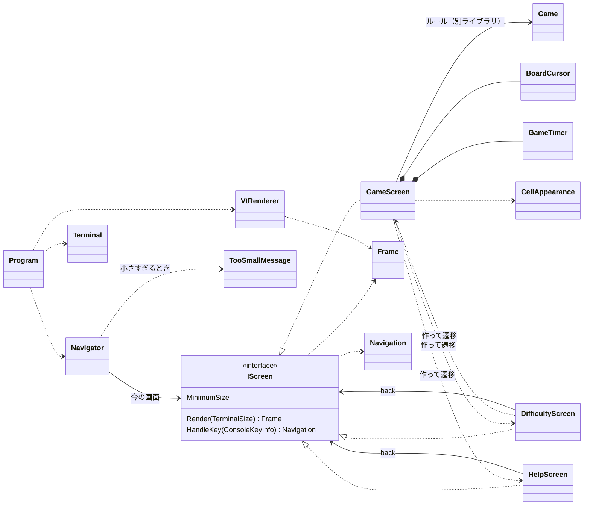

# コンソール版の画面まわりの型の設計

## 0. 課題の言い直しと仮定

**What**: 3 つの画面（ゲーム、難易度の選択、ヘルプ）と「端末を大きくしてください」の表示を、キーで行き来しながら描く。**画面の中身と、キーを受けたときにどうなるかを xUnit で確かめられる**形にする。

置いた仮定（質問できないため）:

| # | 仮定 |
|---|------|
| A1 | ゲームのルールのライブラリには、`Difficulty`（初級・中級・上級。行数・列数・地雷数を持つ）、`Game`（`Open(row, column)`、`ToggleFlag(row, column)`、`State` = 進行中・勝ち・負け、`RemainingMineCount`、`Board`）、`Board`（`Rows`、`Columns`、マスの状態を問い合わせる手段）がある。`Game` は、テストで地雷の位置を決められる作り方（`Board` を渡す、または `Random` を渡す）を持つ |
| A2 | 経過時間は `Game` が持っていない。コンソール版で数える（最初にマスを開けたときに始め、勝ち負けが決まったら止める） |
| A3 | 難易度はプリセットの 3 つだけを選ぶ。カスタムの入力は課題の 3 画面に入っていないので、この設計の外（後述の「作らないもの」） |
| A4 | 画面の文言は日本語。したがって全角の文字は端末で 2 桁を占め、幅の計算に要る |
| A5 | 操作はキーボードだけ（マウスなし）。キーの割り当ては次のとおり: 矢印でカーソル移動、Space/Enter で開ける、F で旗、N で新しいゲーム、D で難易度の選択、H または ? でヘルプ、Q で終了。難易度の画面では ↑↓ で選び Enter で決定、Esc で戻る。ヘルプでは Esc か H で戻る |
| A6 | Windows 11（Windows Terminal と既定のコンソール）と Linux の端末は VT のシーケンスを解釈する |
| A7 | 端末の大きさの変化は、イベントではなく、ループの一周ごとに `Console.WindowWidth/Height` を読み直して知る（`System.Console` にはサイズ変更のイベントがないため） |

## 1. 関心事の列挙（クラスはその結果）

| 関心事 | 変更理由 | 置き場所 |
|--------|----------|----------|
| 各画面に何を描くか | 画面のレイアウト・文言が変わる | `GameScreen`、`DifficultyScreen`、`HelpScreen` |
| 各画面でキーを受けたら何が起きるか（遷移を含む） | キーの割り当て、画面の行き来が変わる | 同上（`HandleKey`）と、結果を表す `Navigation` |
| 今どの画面を出すか、端末が小さすぎるときの差し替え | 遷移の仕組み、小さすぎるときの振る舞いが変わる | `Navigator` |
| 盤面のマスをどの文字・色で表すか | 見た目（記号、配色）が変わる | `CellAppearance` |
| カーソルの位置と、盤面の端での止まり方 | カーソルの動き方が変わる | `BoardCursor` |
| 経過時間を数える | タイマーの始まり・止まり方が変わる | `GameTimer` |
| 描いた結果（文字と装飾の並び）を表す | 表現できる装飾が増える | `Frame`、`TextRun`、`TextStyle`、`TerminalSize` |
| 文字の表示幅（全角 = 2 桁） | 幅の規則が変わる | `DisplayWidth` |
| 描いた結果を VT のシーケンスに変える | 端末の制御の仕方が変わる | `VtRenderer` |
| 端末の準備・後始末、キーの読み取り、大きさの取得 | OS・端末の違い | `Terminal` |
| 起動と一周ごとの繰り返し | ループの作り方が変わる | `Program`（`Main`） |

設計の芯: **画面は `Console` に一切触れない純粋なオブジェクトにする。** 画面は「大きさを受け取って `Frame`（描く内容）を返す」「キーを受け取って `Navigation`（次にどうするか）を返す」だけを行う。`Console` と VT に触れるのは `Terminal` と `VtRenderer` の出力先だけで、ループの `Program` は数行に保つ。こうすると、端末を差し替えるためのインターフェイスを作らなくても、テストの対象（画面、遷移、小さすぎる判定、VT への変換）はすべて `Console` なしで確かめられる。

## 2. 型の一覧（名前、責務、主なシグネチャ）

### 2.1 画面とその契約

```csharp
// 画面の契約。「大きさを受けて描く内容を返し、キーを受けて次にどうするかを返す」
public interface IScreen
{
    TerminalSize MinimumSize { get; }            // この画面を描くのに要る最小の大きさ
    Frame Render(TerminalSize size);             // 副作用なし。size は MinimumSize 以上で呼ばれる
    Navigation HandleKey(ConsoleKeyInfo key);    // 画面自身の状態を変え、次にどうするかを返す
}

// キーを受けた結果: その画面に留まる / 別の画面へ / アプリを終える
public abstract record Navigation
{
    public sealed record Stay : Navigation;
    public sealed record GoTo(IScreen Screen) : Navigation;
    public sealed record Quit : Navigation;

    public static readonly Navigation StayHere = new Stay();
    public static readonly Navigation Exit = new Quit();
    public static Navigation To(IScreen screen) => new GoTo(screen);
}
```

| 型 | ひとことで | 主なメンバー |
|----|------------|--------------|
| `GameScreen : IScreen` | 1 回のゲームを遊ばせる画面 | `GameScreen(Game game, TimeProvider clock)`。`MinimumSize` は盤面の列数・行数から決まる（1 マス 2 桁 + 上の情報行 + 下の操作の案内）。`HandleKey`: 矢印 → `cursor.Move`、Space/Enter → `game.Open`（初回に `timer.Start`、勝ち負けが決まったら `timer.Stop`）、F → `game.ToggleFlag`、N → 同じ難易度の新しい `GameScreen` へ、D → `DifficultyScreen` へ、H/? → `HelpScreen` へ、Q → 終了 |
| `DifficultyScreen : IScreen` | 難易度を選ばせる画面 | `DifficultyScreen(IScreen back, Difficulty current, TimeProvider clock)`。↑↓ で選択を動かし、Enter で `new GameScreen(new Game(selected), clock)` へ、Esc で `back` へ |
| `HelpScreen : IScreen` | 操作の説明を見せる画面 | `HelpScreen(IScreen back)`。Esc/H で `back` へ。`MinimumSize` は説明の文の幅と行数 |

`IScreen` を作る理由: 実装が今 3 つあり、`Navigator` はどの画面かを知らずに「描け」「キーを渡す」とだけ頼めばよい（種類による分岐を型の差し替えで表す）。実装が一つしかない先回りのインターフェイスではない。

遷移の置き場所: 「このキーでどこへ行くか」は各画面が決める（その画面が自分のキーの意味を知っている Expert）。戻り先は、ヘルプと難易度の画面がコンストラクターで `back` として受け取る。ゲームの画面は `back` として自分自身を渡すので、ヘルプから戻っても盤面とカーソルはそのままである。新しい画面を作るのは、その画面へ遷移させる画面である（Creator）。

### 2.2 どの画面を出すかと、小さすぎるときの差し替え

```csharp
// 今の画面を持ち、端末が小さすぎるときは案内に差し替える
public sealed class Navigator(IScreen first)
{
    public IScreen Current { get; private set; } = first;
    public bool IsFinished { get; private set; }

    public Frame Render(TerminalSize size);          // 小さすぎれば TooSmallMessage.Render、そうでなければ Current.Render
    public void HandleKey(ConsoleKeyInfo key, TerminalSize size);
    // 小さすぎるときは Q（終了）だけを受け、他は捨てる（盤面が見えないまま操作させないため）
    // それ以外は Current.HandleKey の結果の Navigation を当てる
}

// 「端末を大きくしてください」の表示。状態を持たない
public static class TooSmallMessage
{
    public static Frame Render(TerminalSize actual, TerminalSize required);
    // 「端末を大きくしてください」「いまの大きさ: 40×12 / 必要な大きさ: 63×21」「Q: 終了」を、
    // 入る範囲で描く（端末がさらに小さければ、入るところまで切り詰める）
}
```

小さすぎる表示を `IScreen` にしない理由: 画面の行き来の中の一つではなく、「今の画面を出せないとき」の差し替えである。遷移先として扱うと、大きくなったときに戻る先を覚える仕組みが要る。`Navigator` が描くたびに `size` と `Current.MinimumSize` を比べるだけなら、大きさを戻せば自然に元の画面が出る。

### 2.3 ゲームの画面の部品

```csharp
// カーソルの位置。盤面の端で止まる（回り込まない）。不変の値
public readonly record struct BoardCursor(int Row, int Column)
{
    public BoardCursor Move(int rowDelta, int columnDelta, int rows, int columns);
}

// 経過時間。最初に開けたときに始め、勝ち負けが決まったら止める。時刻は外から受ける
public sealed class GameTimer(TimeProvider clock)
{
    public void Start();                  // 2 回目以降の呼び出しは何もしない
    public void Stop();
    public TimeSpan Elapsed { get; }      // 始まる前は 0
}

// マスの状態から、表す文字と装飾を決める
public static class CellAppearance
{
    public static TextRun Of(Board board, int row, int column, GameState state);
    // 未開放 "·"、旗 "F"、開放済みの 0 は " "、1〜8 は数字（数字ごとに色）、
    // 負けたときの地雷 "*"、誤った旗 "X" など
}
```

`GameTimer` を `GameScreen` から分ける理由: 「いつ始まり、いつ止まるか」は描き方と独立に決まる規則で、時刻を差し替えて単体で確かめたい。時刻は .NET の `TimeProvider` を受ける（テストでは `GetUtcNow` を上書きした小さな派生クラスを使う。新しいパッケージは要らない）。

### 2.4 描く内容の表現と出力

```csharp
public readonly record struct TerminalSize(int Width, int Height)
{
    public bool Contains(TerminalSize other);   // Width も Height も other 以上か
}

public enum TextStyle { Normal, Dim, Emphasis, Cursor, Number1, /* … */ Number8, Flag, Mine, Won, Lost }

public readonly record struct TextRun(string Text, TextStyle Style);

// 1 画面分の描く内容。行ごとに装飾付きの文字の並びを持つ
public sealed class Frame
{
    public Frame(TerminalSize size, IReadOnlyList<IReadOnlyList<TextRun>> lines);
    public TerminalSize Size { get; }
    public IReadOnlyList<IReadOnlyList<TextRun>> Lines { get; }
    public string LineText(int row);           // 装飾を除いた文字だけ（テストで使う）
}

// 文字の表示幅。全角（東アジアの幅が W/F）は 2、それ以外は 1
public static class DisplayWidth
{
    public static int Of(string text);
}

// Frame を VT のシーケンスの文字列に変える。副作用なし
public static class VtRenderer
{
    public static string Render(Frame frame);
    // カーソルを左上へ（ESC[H）→ 行ごとに、装飾を SGR（ESC[...m）で付けて文字を並べ、
    // 行末を消す（ESC[K）→ 最後に下の余りを消す（ESC[J）。画面全体の消去（ESC[2J）は使わない（ちらつくため）
}

// 実際の端末。準備と後始末、大きさ、キーの読み取り、書き出し
public sealed class Terminal : IDisposable
{
    public static Terminal Open();              // UTF-8 の出力、代替画面（ESC[?1049h）、カーソルを隠す（ESC[?25l）
    public TerminalSize Size { get; }           // Console.WindowWidth / WindowHeight
    public bool TryReadKey(out ConsoleKeyInfo key);   // KeyAvailable を見て、あれば ReadKey(intercept: true)
    public void Write(string text);
    public void Dispose();                      // 装飾を戻し、カーソルを出し、代替画面を抜ける
}
```

### 2.5 ループ

```csharp
// Program.Main（テストしない。薄く保つ）
using var terminal = Terminal.Open();
var navigator = new Navigator(new GameScreen(new Game(Difficulty.Beginner), TimeProvider.System));
string? shown = null;
while (!navigator.IsFinished)
{
    var size = terminal.Size;
    var text = VtRenderer.Render(navigator.Render(size));
    if (text != shown) { terminal.Write(text); shown = text; }   // 変わったときだけ書く
    if (terminal.TryReadKey(out var key)) navigator.HandleKey(key, size);
    else Thread.Sleep(50);                                        // 経過時間と大きさの変化を拾う間隔
}
```

`Ctrl+C` で抜けたときも後始末が要るので、`Console.CancelKeyPress` で `e.Cancel = true` にして `Navigator` に終了を伝えるか、`TreatControlCAsInput = true` にして Ctrl+C を Q と同じに扱う（後者の方が単純なので後者を選ぶ）。

## 3. 型の関係



依存の向き: 画面 → ルールのライブラリ（逆向きはない）。画面は `Terminal` も `VtRenderer` も知らない。`Console` に触れるのは `Terminal` だけである。

## 4. テストの計画（xUnit。`Console` なしで動く）

| 対象 | 例 |
|------|----|
| `GameScreen` | 地雷の位置を決めた `Game` で作り、右矢印 → Space で `Render` の該当する行にその数字が出る／F で "F" が出て残り地雷数が 1 減る／H で `GoTo(HelpScreen)` が返る／地雷を開けると `Lost` の装飾と地雷が出る／`MinimumSize` が上級の盤面で期待の大きさ |
| `DifficultyScreen` | ↓ → Enter で、中級の盤面の `GameScreen` への `GoTo` が返る／Esc で `back` と同じインスタンスへの `GoTo` |
| `HelpScreen` | Esc で `back` へ／描いた行に各キーの説明がある |
| `Navigator` | 小さい大きさで `Render` すると「端末を大きくしてください」の行がある／小さいときは F を捨て、Q で `IsFinished`／大きさを戻すと元の画面が出る／`GoTo` で `Current` が変わる |
| `TooSmallMessage` | 1×1 のような極端に小さい大きさでも例外にならない（切り詰める） |
| `BoardCursor` | 左上で左・上に動かしても動かない／右下の端で止まる |
| `GameTimer` | 始まる前は 0／`Start` から 3 秒進めて 3 秒／`Stop` の後は進まない（`TimeProvider` の派生クラスで時刻を進める） |
| `CellAppearance` | 状態ごとの文字と装飾（表の形のテスト） |
| `DisplayWidth` | "abc" は 3、"端末" は 4 |
| `VtRenderer` | 装飾が変わるところにだけ SGR が入る／各行が ESC[K で終わる／先頭が ESC[H |

`Terminal` と `Program` はテストしない。本物の端末（Windows Terminal、Windows の既定のコンソール、Linux の端末）で動かして、描画、大きさの変化、後始末（終了後に端末が元に戻るか）を確かめる。

## 5. 作らないことにしたもの（引き算）

| 作らないもの | 理由 |
|--------------|------|
| `ITerminal` などの端末のインターフェイスと、その偽物 | 実装は `Terminal` の一つだけ。画面は `Console` に触れない純粋なオブジェクトなので、テストに差し替えが要らない。ループは数行で、判断は `Navigator` にある。ループ自体をテストしたくなったら、そのときに入れる |
| 画面の基底クラス（`ScreenBase`） | 共通の処理の再利用のための継承になる。3 つの画面で共通なのは契約だけで、インターフェイスで足りる |
| 画面のスタック（履歴）と汎用の「戻る」 | 戻り先は 1 段（ヘルプ → 元の画面、難易度 → ゲーム）だけ。コンストラクターの `back` で足りる |
| 差分の描画（前のフレームと比べて変わったセルだけを書く） | 画面は最大でも数十行・数十桁で、変わったときだけ全体を書き直せば十分に速い。ちらつきは ESC[2J を使わないことで避ける。遅いと計測されたら入れる |
| キー割り当ての表・設定ファイル・キーの付け替え | 要求にない。キーの意味は各画面の `HandleKey` の中の分岐で読める |
| マウス入力 | 要求にない（A5） |
| カスタム難易度の入力画面 | 課題の 3 画面にない（A3）。入れるなら、難易度の画面から遷移する 4 つ目の `IScreen` として足せ、既存の型は `DifficultyScreen` の分岐が 1 つ増えるだけで済む |
| ヘルプのページ送り・スクロール | 説明が端末に入らなければ「端末を大きくしてください」で足りる。説明が長くなったら考える |
| 独自のキーの型（`ConsoleKeyInfo` の包み） | `ConsoleKeyInfo` はテストでそのまま作れる（`new ConsoleKeyInfo('f', ConsoleKey.F, false, false, false)`） |
| 色のテーマ、多言語化 | 要求にない。文言は各画面の中の定数で持つ |
| サイズ変更のイベント（Linux の SIGWINCH など） | `System.Console` だけで作る制約の中では取れない。ループの一周（50 ms）ごとの読み直しで十分（A7） |

## 6. 判断が要る点・確かめること

- **ルールのライブラリの API（A1、A2）**: `Game` を地雷の位置を決めて作れるか、経過時間を持つか。持っていれば `GameTimer` は作らずにそれを使う。
- **小さすぎるときのキー**: Q 以外を捨てるとした。「盤面が見えないまま開けてしまう」ことを防ぐためだが、ヘルプへの移動などを許すかは仕様の判断である。
- **Windows の既定のコンソールでの VT（A6）**: 本物の端末で確かめる。解釈されない環境があれば、`Terminal.Open` で VT を有効にする処理（`SetConsoleMode`）を足すことになり、「ライブラリなし」の範囲で P/Invoke を使ってよいかの判断が要る。
- **全角の幅（A4）**: 罫線などの「幅があいまい（A）」な文字は端末によって 1 桁にも 2 桁にもなるので、画面の文字には使わない（記号は ASCII と、幅が確かな全角の日本語だけにする）。
