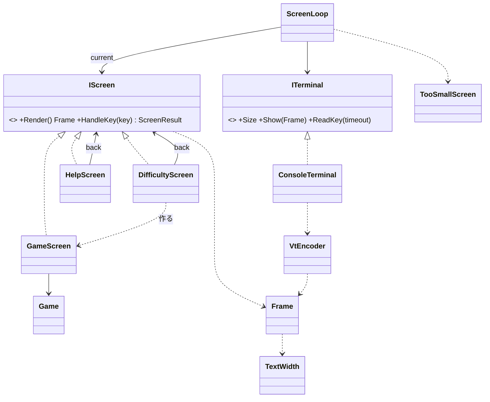

# T1 コンソール版の画面の設計

スキル（sustainable-code-jp）の分類では、この課題は「設計の相談」に当たる。そのため modeling.md と object-design.md を読んだ。インターフェイスを 2 つ新しく作るので、simplicity.md の YAGNI と「引き算の設計」の節も読んだ。

## 1. 何を作るか（What）と置いた仮定

**What**: 端末の中で、3 つの画面（ゲーム、難易度の選択、ヘルプ）をキーで行き来できるようにする。表示を作る部分（画面ごとの文字と色の並び）とキーの解釈は、端末がなくても xUnit で確かめられる形にする。端末が小さすぎて画面が収まらないときは、代わりに「端末を大きくしてください」を出す。

仮定（ユーザーには確かめていない）:

- A1: ルールのライブラリには次のものがある。`Game`（`new Game(Difficulty)` で作る。`Board`、`State`（遊んでいる／勝ち／負け）、`RemainingMines`、`Difficulty`、`Open(Position)`、`ToggleFlag(Position)` を持つ）、`Board`（`Rows`、`Columns`、`this[Position]` でマスの状態を返す）、`Difficulty`（初級・中級・上級のプリセット）。テストで地雷の位置を決めて `Game` を作る手段もある。名前が違えば、ライブラリの名前に合わせる。
- A2: 難易度はプリセットの 3 つだけにする。カスタムの入力は課題にないので、作らない。
- A3: 経過時間の表示は課題にないので、この設計には入れない（入れるときの変え方は 7 章に書く）。
- A4: 画面の文言は日本語で書く。全角の文字は端末の 2 桁を使う。
- A5: キーは次のとおりにする。矢印キーでカーソルを動かす。Space で開く、F で旗を立てる、N で新しいゲーム、D で難易度の画面、H でヘルプを開く。Esc はヘルプと難易度の画面から元の画面に戻り、Q はどの画面でもアプリを終える。
- A6: 画面を描き直すのは、キーが押されたときと、端末の大きさが変わったときだけにする。毎回、画面全体を描き直す（差分の描画はしない）。

## 2. 関心事の列挙（クラスはこの結果）

| 関心事 | 変更理由 | 受け持つ型 |
|---|---|---|
| 画面ごとの表示と、キーへの応答 | 画面の見た目、キーの割り当て | `GameScreen`、`DifficultyScreen`、`HelpScreen`（`IScreen`） |
| 画面の移り変わりと、大きさの判定 | 画面の切り替え方、小さすぎるときの扱い | `ScreenLoop`、`ScreenResult`、`TooSmallScreen` |
| 表示の中身（文字と意味付きの色） | 表示の単位の変更 | `Frame`、`Line`、`Span`、`Tone` |
| 表示の中身を VT のシーケンスに変えること | 配色、VT の書き方 | `VtEncoder` |
| 文字列が端末で何桁を使うか | 全角・半角の判定 | `TextWidth` |
| 本物の端末との入出力 | OS・端末の差 | `ITerminal`、`ConsoleTerminal` |

ゲームのルール（開く、旗、勝ち負けの判定）は、ライブラリの `Game` が持つ（Entity）。画面の側はルールを持たない（Boundary）。

## 3. 型とシグネチャ

```csharp
// ---- 画面（Boundary） ----
public interface IScreen
{
    Frame Render();                               // 今の状態を表示の中身にする（副作用なし）
    ScreenResult HandleKey(ConsoleKeyInfo key);   // キーに応え、次にどうするかを返す
}

public sealed class ScreenResult
{
    public static ScreenResult Stay { get; }      // この画面のまま
    public static ScreenResult Quit { get; }      // アプリを終える
    public static ScreenResult Show(IScreen next);
    public IScreen? Next { get; }                 // Show のときだけ値がある
    public bool IsQuit { get; }
}

public sealed class GameScreen(Game game) : IScreen
{
    // 状態: game、カーソルの位置（Position）
    public Frame Render();          // 1 行目: 残りの地雷数と状態、盤面、最後の行: キーの案内
    public ScreenResult HandleKey(ConsoleKeyInfo key);
    // 矢印: カーソルを動かす（盤面の端で止める）/ Space: game.Open / F: game.ToggleFlag
    // N: Show(new GameScreen(new Game(game.Difficulty)))
    // D: Show(new DifficultyScreen(game.Difficulty, this)) / H: Show(new HelpScreen(this)) / Q: Quit
}

public sealed class DifficultyScreen(Difficulty current, IScreen back) : IScreen
{
    public Frame Render();          // 3 つの難易度の一覧と、選んでいる行
    public ScreenResult HandleKey(ConsoleKeyInfo key);
    // 上下: 選ぶ / Enter: Show(new GameScreen(new Game(selected))) / Esc: Show(back) / Q: Quit
}

public sealed class HelpScreen(IScreen back) : IScreen
{
    public Frame Render();          // 遊び方とキーの一覧（決まった文言）
    public ScreenResult HandleKey(ConsoleKeyInfo key);   // Esc・H: Show(back) / Q: Quit
}

public static class TooSmallScreen
{
    public static Frame Render(TextSize required, TextSize actual);
    // 「端末を大きくしてください（必要: 幅 x 高さ / 今: 幅 x 高さ）。Q で終了」
}

// ---- 進行 ----
public sealed class ScreenLoop(ITerminal terminal, IScreen first)
{
    public void Run();              // Step が false を返すまで繰り返す
    internal bool Step();           // 1 回分: 必要なら描き、キーを 1 つ待って処理する。終えるなら false
}

// ---- 表示の中身 ----
public enum Tone { Plain, Heading, Hidden, Opened, Number1, /* … */ Number8, Flag, Mine, WrongFlag, Won, Lost }
public readonly record struct TextStyle(Tone Tone, bool Reversed = false);   // Reversed はカーソルと、選んでいる行
public readonly record struct Span(string Text, TextStyle Style);
public sealed record Line(IReadOnlyList<Span> Spans) { public string PlainText { get; } }
public readonly record struct TextSize(int Columns, int Rows)
{
    public bool FitsIn(TextSize area);
}

public sealed class Frame
{
    public IReadOnlyList<Line> Lines { get; }
    public void Add(params Span[] spans);
    public void Add(string text, Tone tone = Tone.Plain);
    public TextSize Size { get; }                 // 最も広い行の桁数（TextWidth で数える）と行数
    public IReadOnlyList<string> PlainLines { get; }   // テストで文字だけを比べるため
}

public static class TextWidth
{
    public static int Of(string text);            // 全角は 2 桁、それ以外は 1 桁
}

public static class VtEncoder
{
    public static string Encode(Frame frame);     // 画面の消去、ホーム、行ごとの SGR と文字、SGR のリセット
}

// ---- 端末 ----
public interface ITerminal
{
    TextSize Size { get; }
    void Show(Frame frame);
    ConsoleKeyInfo? ReadKey(TimeSpan timeout);    // 時間内に押されなければ null
}

public sealed class ConsoleTerminal : ITerminal, IDisposable
{
    public static ConsoleTerminal Open();         // 代替画面に切り替え、カーソルを隠し、UTF-8 にする（Windows では VT を有効にする）
    public void Dispose();                        // 元の画面とカーソルに戻す
    // Show は VtEncoder.Encode の結果を Console.Out に書く
    // ReadKey は Console.KeyAvailable を短い間隔で見て、timeout まで待つ
}
```

`Program.cs` は次の 2 行だけにする。

```csharp
using var terminal = ConsoleTerminal.Open();
new ScreenLoop(terminal, new GameScreen(new Game(Difficulty.Beginner))).Run();
```

### ScreenLoop.Step の流れ

1. `frame = current.Render()` で表示の中身を作る。
2. `frame.Size.FitsIn(terminal.Size)` でなければ、`TooSmallScreen.Render(frame.Size, terminal.Size)` を代わりに使う。
3. 画面の中身か端末の大きさが前回と変わったときだけ、`terminal.Show` で描く。
4. `terminal.ReadKey(200 ms)` でキーを待つ。時間内に押されなければ、何もせずに `true` を返す（次の回に大きさの変化を拾う）。
5. 小さすぎる画面のときは Q だけを受け付ける（ほかのキーは、見えない画面を操作することになるので無視する）。それ以外のときは `current.HandleKey(key)` を呼び、`Quit` なら `false` を返し、`Show(next)` なら `current = next` にする。

## 4. 型の間の関係



依存の向きは、画面 → 表示の中身（`Frame`）、端末 → `VtEncoder` → `Frame` の一方向である。`Frame` は VT のことを知らず、画面の型は端末のことを知らない。

## 5. 単体テストの当て方（xUnit）

| 対象 | 確かめ方 | テストの例 |
|---|---|---|
| 各画面 | 画面を作り、`HandleKey` を呼んでから、`Render().PlainLines` と `Lines` の `Tone` を比べる | 右矢印でカーソルの反転が 1 マス右に動く。右端では動かない。Space で開いたマスに数字が出る。地雷を開くと「負け」と出て、地雷が `Tone.Mine` になる。D は `DifficultyScreen` を返す。Esc で渡した `back` がそのまま返る |
| DifficultyScreen | Enter の結果の `Next` を `Render` し、盤面の大きさを見る | 下矢印を 1 回押して Enter を押すと、16×16 の盤面になる |
| ScreenLoop | 偽の `ITerminal`（大きさを決め、キーを列にして渡し、`Show` された `Frame` を記録する）で `Step` を回す | 端末が小さいと `TooSmallScreen` が出る。大きくすると元の画面に戻る。小さい間は Space を無視し、Q で終える。キーが来なければ描き直さない |
| VtEncoder | `Frame` を渡し、出てきた文字列を比べる | `Tone.Flag` の Span が、決めた SGR で囲まれる。最後に `ESC[0m` が付く |
| TextWidth | 文字列を渡す | `"ab"` は 2、`"旗"` は 2、`"残り 10"` は 7 |

`ConsoleTerminal` だけは、本物の端末（Windows Terminal と Linux の端末）で動かして確かめる。中身は Console の呼び出しを並べただけに留める。

## 6. 設計の理由（Why）

- **画面を `IScreen` の 3 つの実装にした**: 画面ごとに表示とキーの意味が違う。そこで、画面の種類で分けた switch を `ScreenLoop` に置かず、各画面が自分で答えるようにした（多態）。実装は最初から 3 つあるので、先回りの抽象ではない。キーの意味は、その画面の状態（カーソル、選んでいる行）を持つ画面が決める（Expert）。
- **画面の移り変わりを戻り値（`ScreenResult`）にした**: 画面が `ScreenLoop` を知らずに済み、「このキーでどの画面へ行くか」を戻り値だけで確かめられる。戻り先は、`back` としてコンストラクターで受け取る。ヘルプはゲームにも難易度の画面にも戻れて、画面の履歴を持つ仕組み（スタック）が要らない。
- **`Render` は `Frame` を返し、VT を書かない**: テストで見たいのは「何が、どの意味の色で出るか」であり、エスケープ シーケンスではない。意味（`Tone`）と色（SGR）を分けたので、配色を変えても `VtEncoder` の 1 か所を直せば済み、画面のテストは壊れない。
- **大きさの判定を `Frame.Size` からした**: 画面ごとに「必要な大きさ」を別に書くと、表示と必要な大きさの二か所を揃え続けることになる（Once And Only Once の違反）。描いた中身の大きさそのものを必要な大きさとみなせば、一か所で済む。小さすぎるかどうかの判断を `ScreenLoop` の 1 か所に置いたので、各画面は大きさを気にしない。
- **`Frame` は行の列にした（桁と行の二次元の配列にしなかった）**: 3 つの画面はどれも上から行を並べるだけで、任意の位置に描く必要がない。全角の文字の 2 桁は `TextWidth` の 1 か所に閉じ込め、画面の側には考えさせない（本質的な複雑さの封じ込め）。
- **`ITerminal` を置いた**: テストが最初の利用者で、偽の端末への差し替えを必要としている。時刻や入出力を差し替えられるようにするのは YAGNI の違反ではない（判断ルール 3）。操作は `ScreenLoop` が使う 3 つだけに絞った（ISP）。
- **`ReadKey` に待つ時間を付けた**: 端末の大きさが変わったことを、キーを待っている間にも拾うためである。Linux の SIGWINCH と Windows のイベントを別々に扱わず、短い間隔で大きさを見るだけにした。
- **端末の準備と後始末を `ConsoleTerminal.Open` と `Dispose` にした**: 例外で落ちたときも、`using` によって代替画面とカーソルが元に戻る。

## 7. 作らなかったもの

- **画面の履歴のスタックと、画面を切り替える仕組み（ナビゲーター）**: 戻り先は `back` の 1 つで足りる。画面の深さが 3 段を超えたら考える。
- **キーの割り当ての表（`KeyMap` などの設定）**: 割り当てを変える要求がない。今は各画面の `HandleKey` の switch で読める。
- **盤面の描画を別の型にすること（`BoardView` など）**: `GameScreen` の仕事は「1 回のゲームを見せて、キーで操作させる」の一言で言える。盤面を描く所がほかの画面にも要るようになったら、切り出す。
- **カーソルの型**: 端で止める計算が 1 か所しかないので、`GameScreen` の private メソッドに置く。
- **差分の描画（変わったマスだけを書き直す）**: 画面全体を書き直すのは、キーを押したときと大きさが変わったときだけにした。ちらつきが実機で問題になったら、そのときに測って考える。
- **経過時間の表示とタイマー（A3）**: 入れるときは、`GameScreen` に `TimeProvider`（BCL にあり、テストでは派生クラスで時刻を決められる）を渡す。`ScreenLoop` では、キーが来なくても 1 秒ごとに描き直すようにする。`ReadKey` はすでに待つ時間を受け取るので、`ITerminal` は変えずに済む。
- **カスタムの難易度の入力（A2）**、**マウスの入力**、**色を使えない端末への対応**: どれも課題にない。
- **`IScreen` の基底クラス**: 3 つの画面が共有するのは「Q で終える」だけで、これは各画面の 1 行で書ける。共通の処理を使い回すためだけに継承を作ることはしない。

## 8. ユーザーの判断が要る点

- 仮定 A1 のライブラリの形（特に、テストで地雷の位置を決める手段と `Game.Difficulty` の有無）。これで `GameScreen` のテストの書き方が変わる。
- 経過時間を表示するかどうか（A3）。表示するなら `TimeProvider` を渡すことと、1 秒ごとに描き直すことを足す。
- 小さすぎるときに Q だけを受け付けるという扱い（3 章の手順 5）。
- キーの割り当て（A5）。
