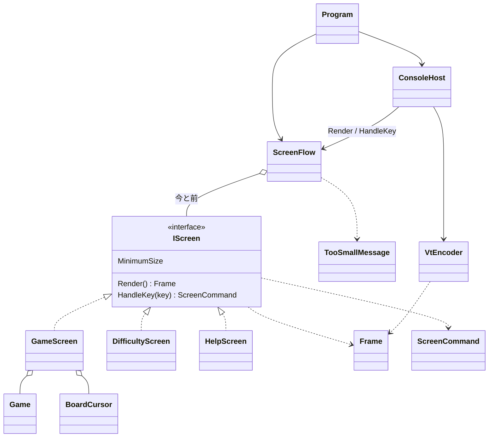

# コンソール版の画面まわりの型の設計

スキル sustainable-code-jp の「設計の相談」として行った。読んだのは、SKILL.md、object-design.md（必ず読む）、simplicity.md（`IScreen` を新しく作るため）である。

## 1. 作るもの・作らないもの（What の言い直し）

作るのは、3 つの画面（ゲーム、難易度の選択、ヘルプ）と「端末を大きくしてください」の表示である。キーで画面を行き来し、`System.Console` と VT のシーケンスだけで描く。画面の単位は、端末がなくても xUnit で確かめられるようにする。

設計の芯は次の 2 つである。

1. **画面は「何を描くか」（`Frame`）だけを返し、「どう書き出すか」（VT のシーケンス）は知らない。** そのため、テストは文字と表示の種類を比べるだけで済み、エスケープ シーケンスを読み解かなくてよい。
2. **画面はキーを受けて「次にどうしたいか」（`ScreenCommand`）を返すだけにし、画面の切り替えは 1 か所（`ScreenFlow`）に集める。** 画面どうしはお互いを知らない。

### 置いた仮定（ユーザーに確かめられないため）

- ルールのライブラリには次のものがあるとする。`Difficulty`（初級・中級・上級。行数・列数・地雷の数を持つ）、`new Game(Difficulty)`（地雷をランダムに置く）、配置を決めて作る手段（テスト済みのライブラリなので、テスト用にあると考える）、`Game.Open(row, column)`、`Game.ToggleFlag(row, column)`、`Game.State`（Playing / Won / Lost）、`Game.RemainingMines`、`Game.Board[row, column]`（開いたか、旗か、地雷か、周りの地雷の数）。
- 経過時間はライブラリでは測らず、画面の側で測るとする。
- 難易度は初級・中級・上級の 3 つとし、カスタム（数の入力）は作らない。課題に書かれていないためである。
- 起動したら、初級のゲームの画面から始める。
- キーの割り当ては次のとおりとする。

| 画面 | キー | 動き |
|------|------|------|
| ゲーム | 矢印 | カーソルを動かす（盤面の端で止まる） |
| ゲーム | Space / Enter | 開く |
| ゲーム | F | 旗を立てる・外す |
| ゲーム | R | 同じ難易度で始め直す |
| ゲーム | D | 難易度を選ぶ画面へ |
| ゲーム | ? / H | ヘルプへ |
| ゲーム | Q | 終了 |
| 難易度 | ↑↓ と Enter、または 1〜3 | 選んだ難易度で新しいゲームを始める |
| 難易度・ヘルプ | Esc | 前の画面（途中のゲーム）に戻る |
| 端末が小さいとき | Q | 終了（ほかのキーは受けない） |

- 端末は、Windows 11 の Windows Terminal と、Linux の一般的な端末（VT に対応したもの）とする。旧来の conhost で VT が無効な環境は対象にしない。これは実機で確かめる必要がある。

## 2. 関心事と型

先に関心事を挙げ、その結果として型を決めた。

| 関心事 | 型 | ひとことで言うと |
|--------|----|------------------|
| 描く内容 | `Frame`、`FrameLine`、`Span`、`TextStyle` | 1 画面ぶんの、表示の種類が付いた文字 |
| 端末の大きさ | `TerminalSize` | 端末の幅と高さ |
| 文字の幅 | `DisplayWidth` | 文字列が端末で何桁を占めるか |
| 画面の約束 | `IScreen` | 描けて、キーに応じられるもの |
| 各画面 | `GameScreen`、`DifficultyScreen`、`HelpScreen` | その画面の表示とキーの解釈 |
| 盤面のカーソル | `BoardCursor` | 盤面の中の選択中のマス |
| 画面の遷移 | `ScreenCommand`、`ScreenFlow` | キーから決まった遷移の要求と、今どの画面かの管理 |
| 端末が小さいとき | `TooSmallMessage` | 「端末を大きくしてください」の表示 |
| VT への変換 | `VtEncoder` | `Frame` を VT のシーケンスの文字列に変える |
| 端末との出入り | `ConsoleHost`、`Program` | 端末の準備・後始末と、キーを読んで描くループ |

`ConsoleHost` から上だけが `System.Console` に触る。それより下の型は、すべて端末なしでテストできる。

## 3. 型とシグネチャ

### 3.1 描く内容

```csharp
public readonly record struct TerminalSize(int Width, int Height)
{
    public bool CanShow(TerminalSize required)
        => Width >= required.Width && Height >= required.Height;
}

public enum TextStyle { Normal, Emphasis, Closed, Flag, Mine, WrongFlag, Number1, /* … */ Number8, Cursor }

public sealed record Span(string Text, TextStyle Style);

public sealed class FrameLine
{
    public FrameLine(IReadOnlyList<Span> spans);
    public IReadOnlyList<Span> Spans { get; }
    public string Text { get; }            // 表示の種類を除いた文字。テストで比べる
}

public sealed class Frame
{
    public Frame(IReadOnlyList<FrameLine> lines);
    public IReadOnlyList<FrameLine> Lines { get; }
    public TerminalSize Size { get; }      // 最も長い行の DisplayWidth と行数
    public override string ToString();     // 行の Text を改行でつないだもの。失敗したテストの表示に使う
}

public static class DisplayWidth
{
    public static int Of(string text);     // 全角の文字を 2、それ以外を 1 と数える
}
```

- `Frame.Size` が、ヘルプと難易度の画面の最小の大きさになる。画面ごとに寸法を手で書くと、文言を変えたときに食い違うためである（Once And Only Once）。
- `DisplayWidth` が要るのは、ヘルプなどの日本語の文字が端末では 2 桁を占めるためである（本質的な複雑さなので、ここに閉じ込める）。盤面のマスの記号は半角の文字だけにし、幅の計算が盤面に入り込まないようにする。

### 3.2 画面

```csharp
public interface IScreen
{
    TerminalSize MinimumSize { get; }
    Frame Render();
    ScreenCommand HandleKey(ConsoleKeyInfo key);
}

public sealed class GameScreen : IScreen
{
    public GameScreen(Game game, TimeProvider time);
    public Difficulty Difficulty { get; }
    public TerminalSize MinimumSize { get; }   // 盤面の列数 × 2 + 枠、行数 + 状態の行 + 操作の案内の行
    public Frame Render();                     // 残り地雷数・経過時間、盤面、勝敗のメッセージ、操作の案内
    public ScreenCommand HandleKey(ConsoleKeyInfo key);
}

public sealed class DifficultyScreen : IScreen
{
    public DifficultyScreen(Difficulty current);   // 今の難易度に選択を合わせて開く
    // MinimumSize、Render、HandleKey
}

public sealed class HelpScreen : IScreen
{
    // MinimumSize、Render、HandleKey（Esc で Back、Q で Quit）
}

public readonly record struct BoardCursor(int Row, int Column)
{
    public BoardCursor Move(int rowDelta, int columnDelta, int rows, int columns);  // 盤面の外には出ない
}
```

- `GameScreen` は `Game` を持ち、キーを `Game.Open` などに渡すだけで、ルールの判断はしない（役割は「プレイヤーのキーを受け付けて盤面を見せる」。ルールは `Game` に委ねる）。
- 経過時間は `TimeProvider` から取る。最初のマスを開いた時刻を覚え、`Render` のたびに差を出す。時刻は外から差し替えられないとテストできないので、差し替えられるようにするのは YAGNI に当たらない（判断ルール 3）。テストでは、`TimeProvider` を継承した小さな偽物を自分で書く（パッケージは足さない）。
- マスの見た目（記号と `TextStyle` の対応）は、`GameScreen` の private static のメソッド 1 つにまとめる。`Render` の結果を通してテストできるので、今は型を分けない。

### 3.3 遷移

```csharp
public abstract record ScreenCommand
{
    public static readonly ScreenCommand Stay;
    public static readonly ScreenCommand ShowHelp;
    public static readonly ScreenCommand ShowDifficulty;
    public static readonly ScreenCommand Back;
    public static readonly ScreenCommand Quit;
    public sealed record StartGame(Difficulty Difficulty) : ScreenCommand;
}

public sealed class ScreenFlow
{
    public ScreenFlow(TimeProvider time);          // 初級の GameScreen から始める
    public IScreen Current { get; }
    public bool IsFinished { get; }
    public Frame Render(TerminalSize size);        // 小さすぎれば TooSmallMessage、そうでなければ Current.Render()
    public void HandleKey(ConsoleKeyInfo key, TerminalSize size);  // 小さすぎるときは Q だけを受ける
}

public static class TooSmallMessage
{
    public static Frame Render(TerminalSize current, TerminalSize required);
    // 「端末を大きくしてください」「必要: 60×20 / 今: 40×12」「Q: 終了」
}
```

- `ScreenFlow` は「今の画面」と「ヘルプ・難易度を開く前の画面」を 1 つずつ持つ。`Back` で前の画面に戻すので、途中のゲームは消えない。`StartGame` のときは、`new Game(difficulty)` で `GameScreen` を作り直す（Creator: ゲームの画面を持つのは `ScreenFlow` なので、作るのも `ScreenFlow`）。R で始め直すのも、同じ `StartGame` の要求で表す。
- 大きさの判定を `ScreenFlow` に置いたのは、「今の画面を見せられるか」の判断に要る情報（今の画面の最小の大きさと、端末の大きさ）がそろうのがここだからである（Expert）。各画面は、自分の最小の大きさを答えるだけである。
- `HandleKey` が端末の大きさを受けるのは、小さすぎて盤面が見えない間に、見えないまま地雷を開いてしまわないようにするためである。「最後に `Render` した大きさ」を覚えておく形は、呼ぶ順番に頼る隠れた結合になるので、引数で渡す。

### 3.4 端末との出入り

```csharp
public static class VtEncoder
{
    public static string Encode(Frame frame);
    // カーソルを左上へ（ESC[H）→ 各行: SGR で色を付けた文字 + 行末まで消す（ESC[K）+ 改行 → 下を消す（ESC[J）
}

public sealed class ConsoleHost : IDisposable
{
    public ConsoleHost();      // UTF-8 にする、代替画面（ESC[?1049h）、カーソルを隠す、自動の折り返しを止める（ESC[?7l）
    public void Run(ScreenFlow flow);
    public void Dispose();     // 準備の逆順に戻す。例外と Ctrl+C（Console.CancelKeyPress）でも必ず通る
}
```

`Run` のループは次のとおりである。これより厚くしない。

```csharp
string? last = null;
while (!flow.IsFinished)
{
    var size = new TerminalSize(Console.WindowWidth, Console.WindowHeight);
    var text = VtEncoder.Encode(flow.Render(size));
    if (text != last) { Console.Out.Write(text); Console.Out.Flush(); last = text; }  // 同じ内容は書かず、ちらつかせない
    if (Console.KeyAvailable) flow.HandleKey(Console.ReadKey(intercept: true), size);
    else Thread.Sleep(50);   // 経過時間の更新と、端末の大きさの変化を拾うための間隔
}
```

- 自動の折り返しを止めるのは、端末が小さいときに長い行が折り返してスクロールし、画面が崩れるのを防ぐためである。行を切り詰める処理を書かずに済む。
- 端末の大きさの変化は、ループのたびに `Console.WindowWidth`・`WindowHeight` を読んで拾う。Windows と Linux で同じ方法が使える。

## 4. 型の間の関係



依存は上から下へ一方向である。画面は `ScreenFlow` も `ConsoleHost` も知らず、`Frame` は VT を知らない。

## 5. 設計の理由（4 つの問いと変更の見通し）

- **`IScreen` を作った理由**: 実装が今すでに 3 つあり、`ScreenFlow` と `ConsoleHost` は、どの画面かを区別せずに描いてキーを渡したい（多態。実装が 1 つだけのインターフェイスではない）。
- **`ScreenCommand` を返す形にした理由**: 画面が次の画面を自分で作ると、画面どうしが互いを知り、ゲームを残して戻る仕組みも各画面に散らばる。要求を値で返せば、画面のテストは「このキーでこの要求が返る」を見るだけで済み、遷移のテストは `ScreenFlow` だけで済む。
- **変更の要求と直す場所**（ひとつの変更 → ひとつの修正）:

| 変更の要求 | 直す場所 |
|------------|----------|
| 配色を変える | `VtEncoder` の `TextStyle` → SGR の対応表だけ |
| マスの記号を変える | `GameScreen` のマスの見た目のメソッドだけ |
| キーの割り当てを変える | その画面の `HandleKey` だけ |
| 画面を 1 つ足す（例: カスタムの入力） | 新しい `IScreen` の実装と、`ScreenCommand` の 1 件と、`ScreenFlow` の分岐の 1 件 |
| ヘルプの文言を変える | `HelpScreen` だけ（最小の大きさは `Frame.Size` から決まるので追随する） |

- **テストのしかた（xUnit）**:
  - `GameScreen`: 配置を決めた `Game` と偽の `TimeProvider` で作り、キーを渡してから `Render()` の `Lines[i].Text` と `Span.Style` を比べる。例: 矢印でカーソルが動き端で止まる、Space で開いた数字が出る、F で旗が立ち残り地雷数が減る、地雷を開くと負けのメッセージと誤った旗が出る、時間を進めると経過時間が変わる、R・D・? でそれぞれの要求が返る。
  - `DifficultyScreen`・`HelpScreen`: キーと返る要求、`MinimumSize` が一番長い行の幅に合うこと。
  - `ScreenFlow`: D → 難易度の画面、Esc → 同じゲームの画面に戻る（開いたマスが残っている）、難易度を選ぶ → その難易度の新しいゲーム、小さい端末では `TooSmallMessage` が出て Q 以外を受けない、Q で `IsFinished`。
  - `VtEncoder`・`DisplayWidth`・`BoardCursor`: 入力と出力の表で確かめる。
  - `ConsoleHost` は単体テストの対象にせず、Windows 11 と Linux の端末で実際に動かして確かめる（後始末、Ctrl+C、端末の大きさを変えたとき）。

## 6. 作らないことにしたもの

| 作らないもの | 理由 |
|--------------|------|
| 端末の抽象（`ITerminal` など） | 実装が `System.Console` の 1 つしかない。判断は `ScreenFlow` と画面に寄せたので、`ConsoleHost` のループは数行で、端末で動かして確かめれば足りる（YAGNI） |
| 差分の描画（変わったマスだけを書く） | 盤面は最大でも 30×16 で、全体を書き直しても十分に速い。同じ内容を書かないことで、ちらつきは防げる。遅さが測れたら入れる |
| 汎用のレイアウトや部品の仕組み（ボタン、枠の部品など） | 画面は 3 つで、それぞれ数行の組み立てで済む |
| 画面のスタック（何段でも戻れる） | 戻る先は「ヘルプ・難易度を開く前の画面」の 1 つで足りる |
| カスタムの難易度、マウスの入力、配色のテーマ、`NO_COLOR` への対応、多言語化 | 課題に書かれていない（冷蔵庫にキリン） |
| 端末の大きさの変化の通知（シグナルの処理） | ループで毎回大きさを読めば足り、Windows と Linux で同じ方法になる |
| 非同期のループや別のスレッドでの時計 | 50 ms ごとに見るだけで経過時間は 1 秒単位で正しく出る。スレッドを分けると後始末とテストが難しくなる |
| キーの割り当ての設定ファイル | 求められていない設定項目である |
| マスの見た目の型 | 今は `GameScreen` の中の 1 メソッドで足りる。`GameScreen` が大きくなったら分ける |

## 7. 確かめられていないこと・判断が要る点

- ルールのライブラリの API は仮定である（1 章）。実際の API に合わせて、`GameScreen` の中の呼び方だけが変わる。
- Windows 11 の旧来の conhost で VT が有効になるかは、実機で確かめる必要がある。無効な環境にも対応するかは、ユーザーの判断が要る（対応するなら、`ConsoleHost` の準備に 1 手足すだけで、他の型は変わらない）。
- キーの割り当て、起動時の難易度、端末が小さい間に Q 以外を受けないことは、仮定として決めた。
