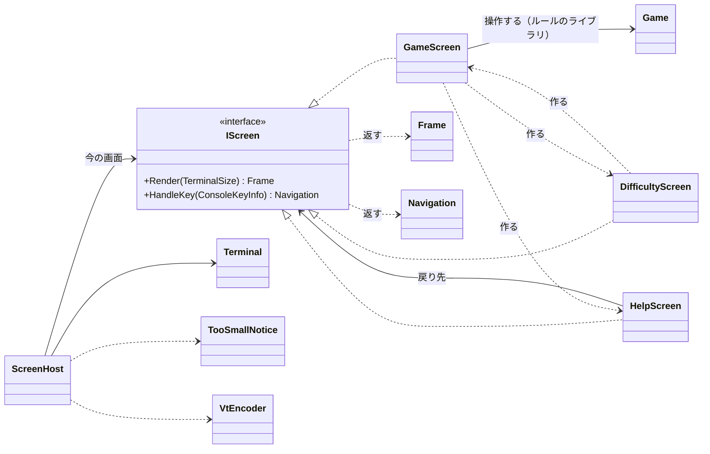

# コンソール版の画面まわりの型の設計

## 0. 何を作り、何を作らないか（What の言い直し）

キーボードで操作するコンソール版で、次の 4 つを表示する型を決める。

- ゲームの画面、難易度を選ぶ画面、ヘルプの画面の 3 つ。キーで行き来する
- 端末が小さすぎるときに出す「端末を大きくしてください」の案内

設計の軸は次の一つにする。**画面は「状態 → 描く内容（`Frame`）」と「キー → 次の画面（`Navigation`）」の二つの純粋な計算にし、端末に触るのは薄い `Terminal` だけにする。** そうすると、xUnit は端末なしで画面の単位を確かめられる。

### 置いた仮定（ユーザーに確かめられないので、仮定として進める）

| # | 仮定 |
|---|------|
| A1 | ルールのライブラリには、`Game`（`Open(row, column)`、`ToggleFlag(row, column)`、`State`（進行中・勝ち・負け）、`RemainingMines`、`Board` を持つ）と、`Difficulty`（初級・中級・上級の 3 つが定義済みで、行・列・地雷の数を持つ）がある。経過時間は `Game` が持たないので、画面の側で測る |
| A2 | 操作はキーボードだけにする（マウスは使わない）。マスはカーソルで選ぶ |
| A3 | キーの割り当て: 矢印キーでカーソルの移動、Space で開く、F で旗、R で新しいゲーム、D で難易度の画面、H（または ?）でヘルプ、Q でアプリの終了。難易度の画面は上下の矢印と Enter で選び、Esc で戻る。ヘルプの画面は、どのキーでも元の画面に戻る |
| A4 | 難易度は定義済みの 3 つだけにする。問題文にカスタムの難易度はないので作らない |
| A5 | 盤面の記号は半角の ASCII（`#` 未開放、`F` 旗、`*` 地雷、`1`〜`8`、`.` 空）を 1 マス 2 桁で並べる。全角の文字は案内とヘルプの文言にだけ出る |
| A6 | Windows 11 の既定の端末（Windows Terminal）も Linux の端末も VT のシーケンスを解釈する。旧来の conhost で VT を有効にする P/Invoke は「`System.Console` と VT だけ」の条件から外れるので使わない（検証できていない。7 章） |

## 1. 関心事と、対応する型

先に関心事を挙げ、その結果として型を決めた。

| 関心事 | 型 | ひとことで言うと |
|--------|----|------------------|
| 画面という単位 | `IScreen` | 描く内容を返し、キーに応じて次の画面を返す |
| ゲームの表示と操作 | `GameScreen` | 1 回のゲームを表示し、キーをゲームの操作に変える |
| 難易度の選択 | `DifficultyScreen` | 難易度を選ばせ、そのゲームの画面を作る |
| ヘルプ | `HelpScreen` | キーの一覧を表示し、元の画面に戻る |
| 画面の行き先 | `Navigation` | キーを受けた後に、どの画面へ行くか（とどまる・移る・終わる） |
| 描く内容 | `Frame`（`FrameLine`、`Span`、`TextStyle`） | 端末に依存しない、色付きの文字の行の並び |
| 文字の表示幅 | `DisplayWidth` | 文字列が端末で何桁を占めるか |
| 小さすぎる端末の案内 | `TooSmallNotice` | 収まらない描画を、案内の描画に替える |
| VT への変換 | `VtEncoder` | `Frame` を VT のシーケンスの文字列にする |
| 端末の入出力 | `Terminal` | 端末の大きさ・キー・書き込み・後始末 |
| 繰り返し | `ScreenHost` | キーを今の画面に渡し、今の画面を端末に描き続ける |

## 2. 型の間の関係



依存は一方向である。画面の型は `Frame` と `Navigation` を返すだけで、`Terminal`・`VtEncoder`・`Console` を知らない。`Console` を呼ぶのは `Terminal` だけである。

## 3. 各型のシグネチャと責務

### 3.1 画面

```csharp
interface IScreen
{
    Frame Render(TerminalSize size);          // size は、端末の大きさに合わせて中央に置くなどに使う
    Navigation HandleKey(ConsoleKeyInfo key);
}

readonly record struct TerminalSize(int Columns, int Rows);

sealed class Navigation
{
    public static Navigation Stay { get; }
    public static Navigation Quit { get; }
    public static Navigation To(IScreen next);
    public IScreen? Next { get; }             // To のときだけ非 null
    public bool Quits { get; }
}
```

- `IScreen` は、実装が 3 つ実際にあり、`ScreenHost` が種類を知らずに扱うための多態である（実装が一つのインターフェイスではない）。画面の行き来を `switch` で書く案は、行き先の知識が 1 か所に集まるが、画面を足すたびにその `switch` が育つ。画面ごとに「自分の次はどこか」を自分で答える方が、行き先の知識がその画面の中に閉じる。
- `HandleKey` の戻り値を `IScreen?`（null が終了、`this` がとどまる）にする案は捨てた。null と「同じインスタンス」に意味を持たせると、読み手が約束を覚えていないと読めない。`Navigation` なら、呼び出し側が `Stay`・`Quit`・`To` と名前で読める。

```csharp
sealed class GameScreen : IScreen
{
    public GameScreen(Difficulty difficulty, TimeProvider clock);
    public Frame Render(TerminalSize size);
    public Navigation HandleKey(ConsoleKeyInfo key);
}
```

- 責務: 1 回のゲームの表示（残りの地雷の数、経過時間、勝ち負けの表示、盤面、カーソル、下のキーの案内）と、キーからゲームの操作への変換。
- 状態: `Game`、カーソルの行と列、開始の時刻。R は新しい `Game` に取り替える（画面は同じインスタンスのまま）。
- 開く・旗を立てる・勝ち負けの判定はライブラリの `Game` に任せる。`GameScreen` は盤面の中身を書き換えない（状態の持ち主が変える）。
- カーソルの移動は、盤面の端で止める（回り込まない）。これは `GameScreen` の private メソッドにする。
- 時刻は `TimeProvider` で受け取る。経過時間の表示をテストで決めるための差し替え口で、テストが最初の利用者として必要とするので入れる（判断ルール 3）。テストでは `TimeProvider` を継承した小さな偽物を書く（`Microsoft.Extensions.TimeProvider.Testing` はライブラリの追加になるので、使うかは確認が要る）。
- H は `Navigation.To(new HelpScreen(returnTo: this))`、D は `Navigation.To(new DifficultyScreen(current, returnTo: this, clock))`、Q は `Navigation.Quit`。画面を作るのは、それを使う画面である（Creator）。

```csharp
sealed class DifficultyScreen : IScreen
{
    public DifficultyScreen(Difficulty current, IScreen returnTo, TimeProvider clock);
    public Frame Render(TerminalSize size);
    public Navigation HandleKey(ConsoleKeyInfo key);   // Enter → To(new GameScreen(選んだ難易度, clock))、Esc → To(returnTo)
}
```

- 責務: 3 つの難易度から一つを選ばせる。選んでいる行は `current` から始める。
- Esc で戻る先を `returnTo` で受け取るので、進行中のゲームは失われない。

```csharp
sealed class HelpScreen : IScreen
{
    public HelpScreen(IScreen returnTo);
    public Frame Render(TerminalSize size);
    public Navigation HandleKey(ConsoleKeyInfo key);   // どのキーでも To(returnTo)
}
```

- 責務: キーの一覧とルールの短い説明を表示する。戻り先を持つので、ゲームの画面からも難易度の画面からも（必要になれば）開ける。

### 3.2 描く内容

```csharp
enum TextStyle { Normal, Dim, Reverse, Number1, Number2, /* … */ Number8, Flag, Mine, WrongFlag, Won, Lost }

readonly record struct Span(string Text, TextStyle Style);

sealed class FrameLine
{
    public FrameLine(IReadOnlyList<Span> spans);
    public IReadOnlyList<Span> Spans { get; }
    public int Width { get; }                  // DisplayWidth で数えた桁
    public string PlainText { get; }           // 色を除いた文字
}

sealed class Frame
{
    public Frame(IReadOnlyList<FrameLine> lines);
    public IReadOnlyList<FrameLine> Lines { get; }
    public TerminalSize Size { get; }          // 最も長い行の桁と、行の数
    public bool FitsIn(TerminalSize terminal);
    public string PlainText { get; }           // 行を改行でつないだもの（テストで比べる）
}

static class DisplayWidth
{
    public static int Of(string text);         // 全角（CJK など）を 2 桁、それ以外を 1 桁と数える
}
```

- `TextStyle` は色そのもの（赤、青）ではなく、意味（数字の 1、旗、地雷、勝ち）で名付ける。配色を変えても画面の型は変わらず、`VtEncoder` の対応表だけが変わる。
- 収まるかどうかの判定は、大きさを知る `Frame` 自身が答える（Expert）。利用者が `Lines.Count` と各行の幅を取り出して比べない。
- `DisplayWidth` は、案内とヘルプに全角の文字が出る（A5）ので要る。桁を文字の数で数えると、「端末を大きくしてください」が 12 桁と数えられて、実際の 24 桁と食い違う。表示幅の決まりは本質的な複雑さなので、この 1 か所に封じ込める。

### 3.3 小さすぎる端末

```csharp
static class TooSmallNotice
{
    // 収まるならそのまま返し、収まらなければ「端末を大きくしてください」と、要る大きさ・今の大きさの案内を返す
    public static Frame ReplaceIfTooLarge(Frame wanted, TerminalSize terminal);
}
```

- 案内を `IScreen` にしない。案内はキーで行き来する画面ではなく、「今の画面が収まらない」という状態の表示だからである。案内を出している間も今の画面はそのまま残り、端末を大きくすると元の画面に戻る。
- 要る大きさは、画面ごとに別に宣言せず、描いた `Frame` の大きさから求める。上級の盤面の大きさと、それを描くのに要る大きさを、二か所に書かずに済む（Once And Only Once）。
- 案内を出している間のキーは、今の画面に渡さない（見えない盤面を操作させない）。Q だけは受けて終了する（仮定）。

### 3.4 端末

```csharp
static class VtEncoder
{
    // 左上に戻り、各行を書いて行末まで消し、残りの行を消す。端末の大きさを超える部分は切る
    public static string Encode(Frame frame, TerminalSize terminal);
}

sealed class Terminal : IDisposable
{
    public static Terminal Open();             // 代替画面へ切り替え、カーソルを隠し、TreatControlCAsInput などを設定する
    public TerminalSize Size { get; }          // Console.WindowWidth / WindowHeight
    public ConsoleKeyInfo? ReadKey(TimeSpan timeout);   // KeyAvailable を見て待つ。時間切れは null
    public void Write(string vt);
    public void Dispose();                     // 代替画面を戻し、カーソルを表示し、設定を元に戻す
}
```

- `VtEncoder` は純粋な関数なので、エスケープ シーケンスの組み立て（色、行末の消去、端での切り取り）を xUnit で確かめられる。
- 端での切り取りは、端末より大きい `Frame` を書いて行が折り返し、画面が流れるのを防ぐために要る。案内そのものが入らないほど小さな端末でも、崩れずに切れるだけになる。
- `Terminal` は `Console` を呼ぶだけの薄い型で、単体テストはしない。確かめるのは本物の端末（Windows Terminal と Linux の端末）で動かしてである。例外で終わっても端末が戻るように、`using` で必ず `Dispose` する。
- `ReadKey` の待ち時間は、経過時間の表示と端末の大きさの変化を拾うための周期（例: 200 ミリ秒）である。

### 3.5 繰り返し

```csharp
sealed class ScreenHost
{
    public ScreenHost(Terminal terminal);
    public void Run(IScreen first);
}
```

`Run` の中身は次の数行である。

```csharp
var screen = first;
while (true)
{
    var size = terminal.Size;
    var frame = TooSmallNotice.ReplaceIfTooLarge(screen.Render(size), size);
    terminal.Write(VtEncoder.Encode(frame, size));
    if (terminal.ReadKey(Tick) is not { } key) continue;
    var navigation = /* 案内中なら Q だけを受ける。そうでなければ */ screen.HandleKey(key);
    if (navigation.Quits) return;
    screen = navigation.Next ?? screen;
}
```

`Program.Main` は、`using var terminal = Terminal.Open();` の後に `new ScreenHost(terminal).Run(new GameScreen(Difficulty.Beginner, TimeProvider.System));` とするだけである。

## 4. 単体テストで確かめること

画面のテストは、画面を作り、キーを渡し、`Render` の `PlainText` か `Navigation` を確かめる形になる。端末も時刻も本物は要らない。

| 対象 | テストの例 |
|------|------------|
| `GameScreen` | Space を押すとカーソルのマスが開いて表示が変わる／右端で → を押してもカーソルが動かない／F で旗が立ち残りの数が 1 減る／偽の時計を 5 秒進めると「005」と表示される／地雷を開くと負けの表示になる／H で `HelpScreen` への `Navigation` を返す／Q で `Quit` |
| `DifficultyScreen` | 最初は今の難易度が選ばれている／↓ と Enter で中級の `GameScreen` へ移る／Esc で `returnTo` へ戻る |
| `HelpScreen` | どのキーでも `returnTo` へ戻る |
| `Frame`・`DisplayWidth` | 全角を 2 桁と数える／`FitsIn` の境界（ちょうど同じ大きさは収まる、1 桁足りないと収まらない） |
| `TooSmallNotice` | 収まるときは同じ `Frame` を返す／収まらないときは「端末を大きくしてください」と要る大きさ・今の大きさを含む |
| `VtEncoder` | 色の付いた `Span` が対応するシーケンスで囲まれる／端末の幅を超える部分が切られる |

盤面を決めて画面を作るために、テストはルールのライブラリで地雷の位置を決めた `Game` を作れる必要がある。それがライブラリにない場合は、`GameScreen` のコンストラクターで `Game` を受け取れるようにする（その場合 R で作り直す方法も受け取る必要があるので、ライブラリ側の対応を先に確かめる）。

## 5. 作らないことにしたもの

| 作らないもの | 理由 |
|--------------|------|
| `ITerminal`（端末のインターフェイス）と、その偽物 | 画面の型が端末を知らないので、画面のテストに端末の差し替えは要らない。`Terminal` は `Console` を呼ぶだけの薄い型で、差し替えて確かめる判断を持たない。実装が一つのインターフェイスは読む対象を増やすだけである（YAGNI）。繰り返しの判断（案内中は Q だけを受ける）をテストしたくなったら、その判断を `ScreenHost` の純粋な static メソッドに出す方を先に選ぶ |
| 前の描画との差分だけを書く仕組み | 盤面は最大でも数十行で、毎回全体を書き直しても十分速いはず。ちらつきが実際に見えたら、計測してから入れる |
| 画面の履歴のスタック（戻るの一般化） | 戻る先はヘルプと難易度の画面の 2 か所で、どちらも `returnTo` 一つで足りる |
| キーの割り当ての表（設定・変更できるキー） | 問題文にない。ヘルプの文言とキーの処理が二か所になるが、キーは 7 つで、変わる見通しがない。キーを変える・増やす要求が来たら、キーと説明の表を一つにしてヘルプと処理の両方から使う |
| マウスの入力 | A2。問題文にない |
| カスタムの難易度と、その入力の画面 | A4。問題文にない |
| 画面の基底クラス | 3 つの画面に共通の処理は、中央に置く計算くらいで、それは `Frame` の側の小さな関数で足りる。再利用だけのための継承はしない |
| 端末の大きさの変化のイベント（SIGWINCH） | Linux と Windows で仕組みが違う。キーを待つ周期ごとに大きさを見るだけで、同じ要求を満たせる |
| 終了の確認 | 問題文にない |

## 6. 変更の見通しと、閉じる場所

| 変更 | 直す場所 |
|------|----------|
| 配色を変える | `VtEncoder` の `TextStyle` から色への対応だけ |
| 盤面の記号を変える | `GameScreen` の描画だけ |
| 画面を一つ足す（例: ベストタイム） | 新しい `IScreen` の実装と、そこへ行くキーを持つ画面だけ。`ScreenHost` は変わらない |
| 端末の出し方を変える（例: 差分の描画） | `VtEncoder` と `Terminal` だけ。画面の型は変わらない |

## 7. 検証できていないこと・判断が要る点

- コードを書いていないので、ビルドもテストもしていない。この設計は、上の仮定のもとでの案である。
- Windows 11 の旧来の conhost で起動したときに VT が解釈されるかは確かめていない（A6）。解釈されない場合、P/Invoke で VT を有効にするかは「`System.Console` と VT だけ」の条件に関わるので、ユーザーの判断が要る。
- 経過時間をどこで測るか（A1）。ライブラリの `Game` が時間を持つなら、`GameScreen` の `TimeProvider` は要らなくなるか、`Game` に渡すものになる。
- テストで地雷の位置を決めた `Game` を作れるか（4 章の最後）。
- `Microsoft.Extensions.TimeProvider.Testing` を使うか、自作の偽の時計にするか。ライブラリの追加になるので確認が要る。
