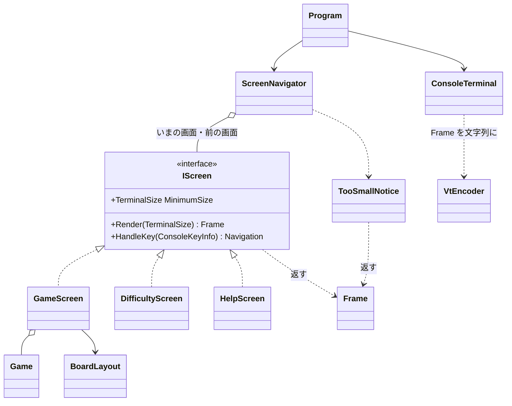

# T1 コンソール版の画面まわりの型の設計

スキル sustainable-code-jp（D）の「設計の相談」として、object-design.md（必ず読む）と simplicity.md（インターフェイスを新設するため）を読んで判断した。

## 1. What（作るものを言い直す）

- 3 つの画面（ゲーム、難易度の選択、ヘルプ）を、キーで行き来できるように描き、キーを受けて画面の状態を変える。
- 端末が画面に要る大きさより小さいときは、どの画面の代わりにも「端末を大きくしてください」を出す。
- 画面の単位（キーを受けたときの状態の変化と、描いた結果）を、端末なしに xUnit で確かめられるようにする。
- ルール（地雷の配置、開く、旗、勝敗）は既存の `Board`・`Game` に任せ、画面の側は持たない。

設計の柱は一つ: **画面は「端末に書く」のではなく「描いた結果（`Frame`）を返す」。** 端末に触るのは `ConsoleTerminal` 1 つだけにし、それ以外はすべて入力（`ConsoleKeyInfo`、端末の大きさ、時刻）から出力（`Frame`、次の画面への要求）を返す純粋な型にする。これで、テストは `Console` を差し替えずに書ける。

## 2. 置いた仮定

質問できないため、次を仮定した。どれも後で変えても影響が 1 つの型に閉じる。

| # | 仮定 | 影響する型 |
|---|---|---|
| A1 | ルールのライブラリに、難易度 `Difficulty`（初級・中級・上級の定義を含む）、`new Game(Difficulty)`、`Game` の状態（`Board` のマスの状態、勝敗、残りの地雷数）、操作（`Open(row, column)`、`ToggleFlag(row, column)`）がある | `GameScreen`、`ScreenNavigator` |
| A2 | `Game` は経過時間を持たない。経過時間は画面の側で `TimeProvider` から数える（持っているならそれを使い、`GameScreen` の時刻の扱いを消す） | `GameScreen` |
| A3 | 難易度の画面は既定の 3 つから選ぶだけ。カスタムの入力（数値の入力欄）は課題に書かれていないので作らない | `DifficultyScreen` |
| A4 | キーの割り当て: 矢印でカーソル移動、Space/Enter で開く、F で旗、R でやり直し、D で難易度の画面、H または ? でヘルプ、Esc で前の画面に戻る、Q（ゲームの画面）と Ctrl+C（どこでも）で終了 | 各画面、`ScreenNavigator` |
| A5 | 起動すると、初級のゲームの画面から始まる | `ScreenNavigator` |
| A6 | 端末が小さい間は、終了のキーだけを受け、他のキーは捨てる（見えない画面を操作させない） | `ScreenNavigator` |
| A7 | 表示の文言は日本語を含む（「端末を大きくしてください」）。全角の文字は端末の 2 桁を占める | `Frame` |
| A8 | Windows 11 の既定の端末（Windows Terminal）と Linux の端末は VT のシーケンスを解釈する。旧来の conhost では VT の処理を有効にする必要がありうるので、`ConsoleTerminal` の開始の処理で確かめる（実機で確認する項目） | `ConsoleTerminal` |

## 3. 型の一覧と責務（ひとことで言うと）

| 型 | ひとことで言うと | 関心事 | テスト |
|---|---|---|---|
| `TerminalSize` | 端末の桁数と行数 | 大きさの比較 | xUnit |
| `TextStyle` | 文字の色と強調 | 見た目 | （値のみ） |
| `Frame` | 1 画面ぶんの描いた結果（文字と見た目の格子） | 描画の結果の保持、全角の幅 | xUnit |
| `VtEncoder` | `Frame` を VT のシーケンスの文字列に変える | VT の書式 | xUnit |
| `IScreen` | 画面の契約（描く、キーを受ける、要る大きさ） | 画面の差し替え | — |
| `Navigation` | 画面がナビゲーターに出す要求（留まる、ヘルプへ、…） | 画面の行き来の語彙 | — |
| `GameScreen` | 1 回のゲームの表示と操作 | ゲームの画面 | xUnit |
| `BoardLayout` | 盤面のマスと端末の座標の対応 | 盤面の置き方 | xUnit |
| `DifficultyScreen` | 難易度の一覧と選択 | 難易度の画面 | xUnit |
| `HelpScreen` | 操作の説明 | ヘルプの画面 | xUnit |
| `TooSmallNotice` | 「端末を大きくしてください」の画面を描く | 小さすぎるときの案内 | xUnit |
| `ScreenNavigator` | いまの画面を持ち、キーと描画を振り分け、画面を切り替える | 画面の行き来 | xUnit |
| `ConsoleTerminal` | 端末の準備・後始末、キーを読む、大きさを知る、`Frame` を書く | 端末の I/O | 実機で確認 |
| `Program` | 端末とナビゲーターをつなぐループ | 起動 | 実機で確認 |

## 4. 型の関係



依存の向きは一方向: `Program` → `ConsoleTerminal` / `ScreenNavigator` → 画面 → `Frame`・`Game`。画面は端末も他の画面も知らない。

## 5. 主なシグネチャ

```csharp
// ---- 値 ----
public readonly record struct TerminalSize(int Width, int Height)
{
    public bool Covers(TerminalSize required);   // 幅も高さも required 以上か
}

public readonly record struct TextStyle(ConsoleColor Foreground, ConsoleColor Background, bool Reverse = false)
{
    public static TextStyle Default { get; }
}

// ---- 描いた結果 ----
public sealed class Frame
{
    public Frame(TerminalSize size);
    public TerminalSize Size { get; }
    public void Write(int row, int column, string text, TextStyle style);   // 全角は 2 桁。はみ出しは切り捨て
    public void WriteCentered(int row, string text, TextStyle style);
    public string LineAt(int row);                        // テスト用: 行の文字（全角の後ろ半分は含めない）
    public TextStyle StyleAt(int row, int column);        // テスト用: その桁の見た目
    public static int DisplayWidth(string text);          // 端末で占める桁数
}

public static class VtEncoder
{
    public static string Encode(Frame frame);   // 先頭にカーソルを左上へ、見た目が変わるところだけ SGR を出す
}

// ---- 画面 ----
public interface IScreen
{
    TerminalSize MinimumSize { get; }
    Frame Render(TerminalSize size);
    Navigation HandleKey(ConsoleKeyInfo key);
}

public abstract record Navigation
{
    public sealed record Stay : Navigation;
    public sealed record OpenHelp : Navigation;
    public sealed record OpenDifficulty : Navigation;
    public sealed record StartGame(Difficulty Difficulty) : Navigation;
    public sealed record Back : Navigation;
    public sealed record Quit : Navigation;
}

public sealed class GameScreen(Game game, TimeProvider time) : IScreen
{
    public TerminalSize MinimumSize { get; }   // BoardLayout.RequiredSize
    public Frame Render(TerminalSize size);    // 上に残りの地雷数・経過時間、中央に盤面、下にキーの案内
    public Navigation HandleKey(ConsoleKeyInfo key);   // 移動・開く・旗・やり直しは自分で処理して Stay
}

public sealed record BoardLayout(int Rows, int Columns)
{
    public const int CellWidth = 2;
    public TerminalSize RequiredSize { get; }                 // 盤面 + 枠 + 上下の行
    public (int Row, int Column) OriginOf(int cellRow, int cellColumn, TerminalSize size);  // 中央寄せした端末の座標
}

public sealed class DifficultyScreen(Difficulty current) : IScreen { /* 上下で選び Enter で StartGame、Esc で Back */ }
public sealed class HelpScreen : IScreen { /* どのキーでも Back（Q だけは Quit にしない。終了は Ctrl+C） */ }

public static class TooSmallNotice
{
    public static Frame Render(TerminalSize actual, TerminalSize required);   // 今の大きさと要る大きさも出す
}

// ---- 画面の行き来 ----
public sealed class ScreenNavigator(TimeProvider time)
{
    public bool IsQuitRequested { get; }
    public void HandleKey(ConsoleKeyInfo key, TerminalSize size);   // Ctrl+C は全画面共通で Quit。小さすぎる間は他を捨てる
    public Frame Render(TerminalSize size);    // 小さすぎれば TooSmallNotice、そうでなければいまの画面
}

// ---- 端末（ここだけが Console に触る）----
public sealed class ConsoleTerminal : IDisposable
{
    public static ConsoleTerminal Open();      // 代替の画面、カーソルを隠す、Ctrl+C を入力として受ける
    public TerminalSize Size { get; }
    public ConsoleKeyInfo? ReadKey(TimeSpan timeout);   // 時間内にキーがなければ null（経過時間の再描画のため）
    public void Draw(Frame frame);             // VtEncoder.Encode の結果を 1 回の Write で書く
    public void Dispose();                     // 画面・カーソル・色・入力の設定を元に戻す
}
```

`Program` のループ（全文ではなく形だけ）:

```csharp
using var terminal = ConsoleTerminal.Open();
var navigator = new ScreenNavigator(TimeProvider.System);
while (!navigator.IsQuitRequested)
{
    terminal.Draw(navigator.Render(terminal.Size));
    if (terminal.ReadKey(TimeSpan.FromMilliseconds(250)) is { } key)
        navigator.HandleKey(key, terminal.Size);
}
```

タイムアウトごとに描き直すので、経過時間の更新と端末の大きさの変化（小さすぎる画面への切り替えと戻り）を、同じ 1 本の道で扱える。

## 6. テストの形

端末なしに、キーを渡して `Frame` を調べる。

```csharp
[Fact]
public void TooSmallTerminalShowsNotice()
{
    var navigator = new ScreenNavigator(TimeProvider.System);
    var frame = navigator.Render(new TerminalSize(20, 5));
    Assert.Contains("端末を大きくしてください", Enumerable.Range(0, 5).Select(frame.LineAt));
}

[Fact]
public void HelpKeyOpensHelpAndEscapeReturnsToGame() { /* H → ヘルプの行、Esc → 盤面の行 */ }

[Fact]
public void ArrowRightMovesCursorHighlight() { /* GameScreen に → を渡し、StyleAt が Reverse になる桁が右へ移る */ }
```

- 時刻は `TimeProvider` を差し替える（テストのための差し替え口は YAGNI 違反ではない。判断ルール 3）。手で書いた小さな偽物か、`Microsoft.Extensions.TimeProvider.Testing` の `FakeTimeProvider` を使う（後者はテストだけのパッケージの導入なので、導入するかは確認事項）。
- 盤面は、`Game` を決まった配置で作れる手段が A1 のライブラリにある前提で、勝敗の表示も確かめる。
- `VtEncoder` は、小さな `Frame` から出る文字列（`\e[H`、SGR、改行の代わりのカーソル位置）を直接比べる。
- `ConsoleTerminal` と `Program` は xUnit の対象にしない。Windows 11 と Linux の端末で実際に動かして確かめる（開始と後始末、Ctrl+C、大きさの変化、全角の幅）。

## 7. Why（設計の理由と、捨てた案）

1. **画面は `Frame` を返す（端末に書かない）。** 捨てた案は「画面が `ITerminal` に書き、テストでは偽の端末を使う」。これだと、テストは偽の端末が受けた呼び出しの列を調べることになり、書く順や分け方を変えるだけで壊れる。`Frame` を返せば、テストは「何が見えるか」だけを調べられ、描く手順の変更に巻き込まれない。
2. **端末に触る型は `ConsoleTerminal` 1 つ。インターフェイスにしない。** 判断はすべてナビゲーターと画面にあり、ループは I/O を運ぶだけなので、`ITerminal` を作っても差し替える利用者（テスト）がいない。実装が一つしかないインターフェイスは YAGNI 違反として作らない。
3. **`IScreen` は作る。** 実装が 3 つ実際にあり、ナビゲーターは種類を区別せずに描画とキーを渡す（多態）。種類で分岐する switch をナビゲーターに育てないため。
4. **画面は次の画面を作らず、`Navigation` を返す。** 捨てた案は「`HandleKey` が次の `IScreen` を返す」。それだと、ゲームの画面が難易度の画面を作り、難易度の画面がゲームの画面を作る相互依存になり、「ヘルプから前の画面に戻る」ために画面が前の画面を覚えることになる。行き来の決まり（どこから来てどこへ戻るか、どの画面を作るか）は `ScreenNavigator` 1 か所に置く（Expert: いまの画面と前の画面を知っているのはナビゲーター）。`Navigation` は閉じた集合なので、ナビゲーターの `switch` 1 つで扱う。
5. **小さすぎる案内は画面ではなく、ナビゲーターが描画の直前に差し込む。** どの画面にいても同じ判断なので、各画面に持たせると同じ判断が 3 か所に並ぶ（Once And Only Once）。各画面は自分に要る大きさ（`MinimumSize`）だけを答える。ゲームの画面は難易度で大きさが変わるので、この形でないと判断できない。
6. **`BoardLayout` を分ける。** 盤面のマスと端末の座標の変換（セルの幅、枠、中央寄せ）は、この画面の本質的な複雑さであり、要る大きさと描画の両方が使う。1 か所に封じ込めて、`GameScreen` にはマスの状態から文字と色を選ぶことだけを残す。
7. **全角の幅は `Frame` に封じ込める。** 日本語の文言は 2 桁を占め、これを画面ごとに数えると中央寄せや切り捨てがずれる。`Frame.Write` と `DisplayWidth` の 1 か所で扱う。
8. **毎回、画面全体を描き直す（差分描画にしない）。** 画面は最大でも 80×25 程度で、1 回の `Write` にまとめればちらつかない。差分描画は、計測してちらつきや遅さが見えてから入れる。

変更の見通しに対して、直す場所は次のように 1 つずつに閉じる。

| 変更 | 直す場所 |
|---|---|
| 画面を 1 つ増やす | 新しい `IScreen`、`Navigation` の要求 1 つ、`ScreenNavigator` の分岐 1 つ |
| キーの割り当てを変える | その画面の `HandleKey`（全画面共通のキーは `ScreenNavigator`） |
| マスの見た目・幅を変える | `GameScreen` の選び方、`BoardLayout.CellWidth` |
| VT の書き方（色の数など）を変える | `VtEncoder` |
| 端末の準備・後始末を変える | `ConsoleTerminal` |

## 8. 作らないことにしたもの

- `ITerminal`（上の理由 2。ループをテストしたくなったら、そのときに入れる）
- 画面のスタック（何段でも戻れる履歴）。戻る先は「前の画面」1 つで足りる（ヘルプと難易度の画面は、ゲームの画面から開いて戻るだけ）
- 画面を作る Factory、キー割り当ての設定ファイル、色のテーマの設定
- 差分描画、ダブルバッファの仕組み（上の理由 8）
- カスタムの難易度の入力（A3）、マウス入力、効果音、ベストタイムの保存（課題に書かれていない）
- `IClock` などの自作の時刻の抽象（.NET の `TimeProvider` で足りる）
- 大きさの変化のイベント（`SIGWINCH` など）の購読。タイムアウトごとの描き直しで大きさも読み直すので要らない

## 9. ユーザーの判断が要る点

- A1〜A6 の仮定（特にキーの割り当て、カスタムの難易度を作らないこと、小さすぎる間のキーの扱い）
- テストで `FakeTimeProvider` のパッケージを使うか、偽物を手で書くか
- 旧来の conhost（Windows Terminal でない端末）も対象にするか。対象にするなら、`ConsoleTerminal.Open` で VT の処理を有効にする処理（Win32 の `SetConsoleMode`）が要る
- 全角の幅の判定は、ライブラリを使わないので、CJK・かな・全角形の範囲だけを 2 桁とする近似にする。表示の文言に他の幅の広い文字（絵文字など）を使わないことが前提になる
