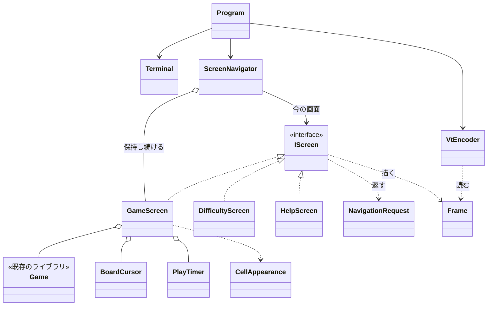

# コンソール版の画面まわりの型の設計

## 0. 何を作り、何を作らないか（What の言い直し）

- 作る: 3 つの画面（ゲーム、難易度の選択、ヘルプ）と、その間の行き来、端末が小さいときの案内、VT のシーケンスでの描画、端末の準備と後始末。
- 作らない: ゲームのルール（既存の `Board`、`Game` を使う）、汎用の UI フレームワーク（ウィジェット、レイアウト エンジン、差分描画）。
- 目標: 画面の単位を、端末なしに xUnit で確かめられること。

### 置いた仮定

課題に書かれていないので、次のように仮定した。

1. `Game` は `new Game(Difficulty)` で作れ、マスを開く・旗を切り替える操作と、各マスの状態、勝敗、残りの地雷の数を公開している。経過時間は持っていない（持っていれば、下の `PlayTimer` は作らない）。
2. 難易度は初級・中級・上級の 3 つから選ぶ。カスタムは文字の入力が要り、仕様がまだないので、この設計に入れない（入れるときは、難易度の選択画面の中に入力欄を足すことになる。8 章）。
3. 操作はキーボードだけで行う（マウスは使わない）。
4. 盤面のマスは ASCII の 1 文字で描く。日本語（全角）が出るのはヘルプと案内の文だけとする。
5. 端末の大きさが変わったことは、イベントではなく、ループのたびに大きさを読んで知る（.NET の `Console` には、Windows と Linux で共通に使える大きさの変更のイベントがないため）。

## 1. 関心事と、それに対応する型

クラスの一覧を先に決めず、関心事を先に挙げた。

| 関心事 | 型 | ひとことで言うと |
|---|---|---|
| 端末との入出力（キーを読む、大きさを知る、書く、準備と後始末） | `Terminal` | 端末 |
| 今どの画面を見せるか、画面の行き来、端末が小さいときの案内 | `ScreenNavigator` | 画面の行き来 |
| 1 つの画面の見た目と、キーへの応答 | `IScreen` と `GameScreen`、`DifficultyScreen`、`HelpScreen` | 画面 |
| 画面が行き来を頼む内容 | `NavigationRequest` | 画面から行き来への頼み |
| 描く内容（端末に依存しない、行と色付きの文字列） | `Frame`、`Span`、`TextStyle` | 1 回分の画面の中身 |
| 描く内容を VT のシーケンスに直す | `VtEncoder` | 画面の中身を VT の文字列にする |
| 盤面のカーソル | `BoardCursor` | 盤面の上の選択位置 |
| マスの状態からの見た目（文字と色） | `CellAppearance` | マスの見た目 |
| 経過時間 | `PlayTimer` | ゲームの時計 |
| 文字列の表示幅（全角は 2） | `DisplayWidth` | 表示幅 |
| 起動とメインループ | `Program` | 組み立てと繰り返し |

## 2. 型と主なシグネチャ

```csharp
// ---- 端末（副作用はここだけ） ----
sealed class Terminal : IDisposable
{
    public Terminal();                                  // 代替画面に切り替え、カーソルを隠し、Ctrl+C をキーとして受ける
    public TerminalSize Size { get; }                   // Console.WindowWidth / WindowHeight
    public bool TryReadKey(out ConsoleKeyInfo key);     // Console.KeyAvailable のときだけ読む（待たない）
    public void Write(string text);
    public void Dispose();                              // 元の画面に戻し、カーソルを出し、色を戻す
}

readonly record struct TerminalSize(int Width, int Height)
{
    public bool CanShow(TerminalSize required);         // 幅と高さがどちらも required 以上か
}

// ---- 画面の行き来（純粋。テストの中心） ----
sealed class ScreenNavigator
{
    public ScreenNavigator(Difficulty initial, TimeProvider time);
    public bool IsRunning { get; }
    public void HandleKey(ConsoleKeyInfo key, TerminalSize size);
    public Frame Render(TerminalSize size);             // 小さすぎれば案内、そうでなければ今の画面
}

// ---- 画面 ----
interface IScreen
{
    TerminalSize MinimumSize { get; }
    void Draw(Frame frame);
    NavigationRequest HandleKey(ConsoleKeyInfo key);
}

sealed class GameScreen : IScreen                       // Game と BoardCursor と PlayTimer を持つ
{
    public GameScreen(Game game, TimeProvider time);
    // ←↑→↓/hjkl: カーソル, Space/Enter: 開く, F: 旗, N: 新しいゲーム, D: 難易度, ?: ヘルプ
}

sealed class DifficultyScreen : IScreen                 // 選んでいる行だけを状態に持つ
{
    public DifficultyScreen(Difficulty current);
    // ↑↓: 選ぶ, Enter: 決める（NewGame）, Esc: 戻る（ReturnToGame）
}

sealed class HelpScreen : IScreen                       // 状態を持たない
{
    // Esc / ?: 戻る（ReturnToGame）
}

abstract record NavigationRequest
{
    public sealed record Stay : NavigationRequest;
    public sealed record ShowHelp : NavigationRequest;
    public sealed record ShowDifficulty : NavigationRequest;
    public sealed record ReturnToGame : NavigationRequest;
    public sealed record NewGame(Difficulty Difficulty) : NavigationRequest;
}

// ---- 描く内容（端末に依存しない） ----
sealed class Frame
{
    public void AddLine(params Span[] spans);
    public IReadOnlyList<IReadOnlyList<Span>> Lines { get; }
    public string TextOf(int line);                     // 色を除いた文字列。テストの確かめに使う
}

readonly record struct Span(string Text, TextStyle Style);
readonly record struct TextStyle(TextColor Color, bool Reversed = false);
enum TextColor { Default, Dim, Blue, Green, Red, DarkBlue, DarkRed, Cyan, Magenta, Yellow }

static class VtEncoder
{
    public static string Encode(Frame frame);           // ESC[H から各行を書き、行末と残りを消す（ESC[K、ESC[J）
}

// ---- 盤面の部品 ----
readonly record struct BoardCursor(int Row, int Column)
{
    public BoardCursor Move(int rowDelta, int columnDelta, int rows, int columns);  // 盤面の外には出ない
}

static class CellAppearance
{
    public static Span Of(/* 既存のマスの状態の型 */ CellState cell, bool isGameOver);  // '#', ' ', '1'..'8', 'F', '*', 'X'
}

sealed class PlayTimer
{
    public PlayTimer(TimeProvider time);
    public void Start();                                // 最初にマスを開いたとき
    public void Stop();                                 // 勝敗が決まったとき
    public TimeSpan Elapsed { get; }
}

static class DisplayWidth
{
    public static int Of(string text);                  // 全角（East Asian Wide/Fullwidth）を 2 と数える
}
```

`Program` のループは次の形である（テストしない薄い層）。

```csharp
using var terminal = new Terminal();
var navigator = new ScreenNavigator(Difficulty.Beginner, TimeProvider.System);
string? shown = null;
while (navigator.IsRunning)
{
    var size = terminal.Size;
    if (terminal.TryReadKey(out var key)) navigator.HandleKey(key, size);
    else Thread.Sleep(50);                              // 経過時間を進め、大きさの変化に気づくための間隔
    var output = VtEncoder.Encode(navigator.Render(size));
    if (output != shown) { terminal.Write(output); shown = output; }   // 変わらない画面は書かない（ちらつき防止）
}
```

## 3. 型の間の関係



依存の向きは一方向である。画面は端末を知らず、`Frame` に書くだけ。`Terminal` を知るのは `Program` だけ。

## 4. 振る舞いの決まり

- **行き来**: 画面はキーを受けて `NavigationRequest` を返すだけで、他の画面を作らない。画面を作り替えるのは `ScreenNavigator` だけ（Creator）。
  - `ShowHelp` → `HelpScreen`、`ShowDifficulty` → `new DifficultyScreen(今の難易度)`、`ReturnToGame` → 保持している `GameScreen` に戻る、`NewGame(d)` → `new GameScreen(new Game(d), time)` に替えて戻る。
  - ヘルプや難易度の選択から戻ったとき、遊んでいたゲームはそのまま続く（`GameScreen` を保持し続けるため）。ヘルプを見ている間も時計は止めない（仮定。止めるなら `GameScreen` に `Pause`/`Resume` を足す）。
- **どの画面でも効くキー**: Q と Ctrl+C で終了する。これは `ScreenNavigator` の 1 か所で扱い、各画面には書かない（Once And Only Once）。Ctrl+C をキーとして受けるのは、シグナルで落ちずに `Terminal.Dispose` の後始末を必ず通すためである。
- **端末が小さいとき**: `ScreenNavigator.Render` は、`size.CanShow(今の画面.MinimumSize)` が偽なら、今の画面の代わりに「端末を大きくしてください（必要: 幅 W×高さ H、今: w×h）」と「Q で終了」を描く。この間、Q と Ctrl+C のほかのキーは捨てる（見えない盤面を操作させないため）。大きくすれば、同じ画面にそのまま戻る。
  - 案内そのものが入らないほど小さい端末では、行を端末の幅と高さで切り詰めて描く（`VtEncoder` ではなく案内を作る側で切る）。
- **最小の大きさ**: 各画面が自分で答える（Expert）。`GameScreen` は盤面の列数×2（マスの間に空白）と、上の情報行・下の案内行から計算する。`HelpScreen` と `DifficultyScreen` は、自分の文の行数と `DisplayWidth.Of` の最大値から計算する。
- **描画**: 毎回、画面全体を `Frame` として作り直し、`VtEncoder` がカーソルを左上に戻して上書きする。前回と同じ文字列なら書かない。

## 5. 設計の理由

- **画面を「`Frame` を作る純粋な部品」にした**: 画面の単位を xUnit で確かめたい、という要求に直接答えるためである。テストは、`GameScreen` にキーを渡し、`Frame.TextOf(n)` で盤面の行を文字列として比べるだけでよく、端末もエスケープ シーケンスも出てこない。VT への変換は `VtEncoder` の 1 か所に閉じ、別にテストする。
- **`IScreen` は入れた**: 3 つの画面は、今の時点で実装が 3 つあり、持つ状態もキーの意味も違う。インターフェイスがないと、`ScreenNavigator` に「どの画面か」で分ける switch が、描画・キー・最小の大きさの 3 か所に現れる（同じ分岐の繰り返し）。実装が 1 つだけのインターフェイスではないので、YAGNI には当たらない。
- **`NavigationRequest` を戻り値にした**: 画面が `ScreenNavigator` を参照して切り替えを直接呼ぶと、画面どうしが互いを知り、相互の依存になる。戻り値にすると、画面は「何をしてほしいか」だけを言い、行き来の決まりは `ScreenNavigator` に集まる。テストでも、返った値を比べるだけで済む。
- **端末が小さいときの案内は画面にしなかった**: 行き来の先ではなく、「今の画面を見せられない」ことの表示なので、`ScreenNavigator.Render` の分岐 1 つで足りる。画面にすると、戻る先を覚える仕組みが要る。
- **`Frame` はセルの格子ではなく、行と `Span` の列にした**: 全角の文字が 1 マスに収まらない問題を、格子の計算に持ち込まないため。位置合わせは行の単位だけにし、表示幅が要るのは最小の大きさの計算（`DisplayWidth`）だけに限った。
- **時刻は `TimeProvider` で渡す**: 経過時間の表示をテストで決まった値にするためである（テストが最初の利用者として差し替えを必要としている）。.NET の標準の型なので、新しいインターフェイスは作らない。
- **`BoardCursor` と `CellAppearance` を分けた**: どちらも `GameScreen` の中に書けるが、カーソルの端での止まり方と、マスの状態ごとの文字と色は、それぞれ独立に変わりうる決まりで、表で確かめたいテストの対象である。分けると `GameScreen` は「キーを操作に割り当て、盤面を並べる」だけになる。

### 変更の見込みと、直す場所

| 変更 | 直す場所 |
|---|---|
| 画面を 1 つ足す（例: 記録の画面） | 新しい `IScreen` の実装と、`NavigationRequest` の場合を 1 つ、`ScreenNavigator` の対応を 1 行 |
| キーの割り当てを変える | その画面の `HandleKey` だけ |
| マスの文字や色を変える | `CellAppearance` だけ |
| 色の出し方を変える（256 色など） | `VtEncoder` だけ |
| 端末が小さいときの文言を変える | `ScreenNavigator` の案内を作るところだけ |

## 6. テストの方針

| 対象 | 確かめること |
|---|---|
| `GameScreen` | 地雷の位置を決めた `Game` を渡し、キーの列の後の `Frame` の行（盤面、残りの地雷の数、勝敗の表示）。F、?、D、N が返す `NavigationRequest`。`MinimumSize` が難易度で変わること |
| `DifficultyScreen` | ↑↓ と端での止まり方、Enter で `NewGame(選んだ難易度)`、Esc で `ReturnToGame` |
| `HelpScreen` | 戻るキーで `ReturnToGame`、`MinimumSize` が文の幅と行数に一致 |
| `ScreenNavigator` | 行き来（ヘルプから戻るとゲームが続いている、難易度を決めると新しいゲーム）、小さい端末で案内が出てキーが捨てられる、Q と Ctrl+C で `IsRunning` が偽 |
| `VtEncoder` | 色と反転の SGR、行末の消去、最後に `ESC[0m` で戻すこと |
| `BoardCursor`、`CellAppearance`、`PlayTimer`、`DisplayWidth` | 境界（四隅、全角と半角、開始前・停止後の時間）を表で |

`Terminal` と `Program` は単体テストをせず、Windows 11 の Windows Terminal と Linux の端末で実際に動かして確かめる（VT の有効化、代替画面、Ctrl+C の後の後始末、大きさを変えたときの再描画）。

## 7. 作らないことにしたもの

| 候補 | 作らない理由 |
|---|---|
| `ITerminal` インターフェイス | 端末を使うのは `Program` の薄いループだけで、画面はすべて端末なしにテストできる。差し替えたい利用者がいない。ループの振る舞い（行き来、案内）はもう `ScreenNavigator` にある |
| 前の画面との差分だけを書く描画 | 上級でも 30×16 のマスで、全体を書き直しても小さい。同じ内容を書かない 1 行の比較で、止まっているときのちらつきは防げる。計測してちらつきが見えたら入れる |
| 画面のスタック（任意の深さで戻る） | 行き来は「ゲーム ⇄ ヘルプ」「ゲーム ⇄ 難易度」だけで、戻る先はいつもゲームである。`GameScreen` を 1 つ保持すれば足りる |
| 画面の基底クラス | 3 つの画面に共通する処理がない。共通の処理ができても、再利用のための継承はせず、部品を持たせる |
| ウィジェットやレイアウトの仕組み（中央寄せ、枠、スクロール） | 要求にない。ヘルプは 1 画面に収まる前提で、収まらなければ「端末を大きくしてください」を出す |
| 大きさの変更のイベント、別スレッドでのキーの読み取り | ループのたびに大きさを読めば気づける。スレッドを足すと、状態の共有の問題を持ち込む |
| カスタムの難易度の入力、マウス、配色の設定、多言語 | 課題にない（仮定 2、3） |
| `PlayTimer` のライブラリへの移動 | 他の UI で要ることが分かってから移す（仮定 1。ライブラリがもう時間を持っていれば、作らずにそれを使う） |

## 8. 分かっていないこと・判断が要る点

- `Game` と `Difficulty` の実際の API（仮定 1）。マスの状態の型の名前に合わせて `CellAppearance.Of` の引数を決める。
- ヘルプや難易度の選択を見ている間、経過時間を止めるか（今の設計は止めない）。
- カスタムの難易度を入れるか。入れるなら、Q が「終了」と「文字の入力」でぶつかるので、入力中は `ScreenNavigator` の Q を効かせない決まりが要る。
- Windows で .NET が VT の処理を有効にしているかは、実機で確かめる。有効でなければ、`Terminal` のコンストラクターで `SetConsoleMode` を呼ぶ（その場合も `Terminal` の中に閉じる）。
