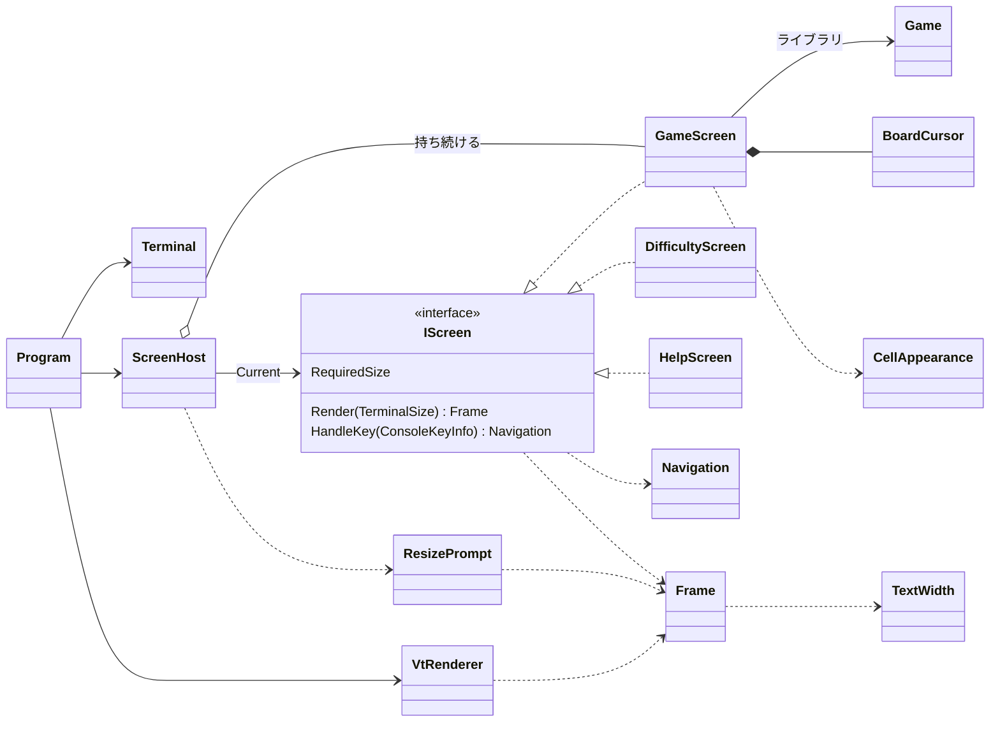

# T1: コンソール版の画面まわりの型の設計

スキル D の「作業規模に応じた適用の軽重」で、この課題を「設計の相談」に分類した。必ず読む object-design.md を読み、インターフェイスを 1 つ新しく作るので、simplicity.md も読んだ。

## 0. What（言い直し）と仮定

**What**: 3 つの画面（ゲーム、難易度の選択、ヘルプ）と「端末を大きくしてください」の表示を、端末に触らずに xUnit でテストできる形にする。そのうえで、キーで画面を行き来させ、VT のシーケンスで端末に描く。

課題に書かれていないことは、次のように仮定した（ユーザーには聞けないため）。

| # | 仮定 | 違ったときに変わる所 |
|---|------|------------------|
| A1 | ゲームのライブラリには `Game`（`Open(Position)`、`ToggleFlag(Position)`、`Reset()`、`State`、`RemainingMines`、`Board`）がある。`Board` には `Width`、`Height` と、マスの状態を返すインデクサーがある。既知の盤面の `Game` をテストで作れる | `GameScreen` の中だけ |
| A2 | 難易度は、ライブラリにある `Difficulty` の初級・中級・上級の 3 つから選ぶ。カスタム（数値の入力）は課題にないので作らない | `DifficultyScreen` の中だけ |
| A3 | `Game` は経過時間を持たない。時間の計測は `GameScreen` が、差し替えのできる `TimeProvider` で行う | `GameScreen` の中だけ |
| A4 | 画面の行き来は次のとおり。ゲームの画面で `H`/`?` を押すとヘルプ、`D` を押すと難易度、`Q` を押すと終了。ヘルプと難易度の画面で `Esc` を押すとゲームに戻る。難易度を決めると、その難易度で新しいゲームを始める | `Navigation` の種類と `ScreenHost` |
| A5 | 端末が小さい間は、ゲームを見えないまま操作しないように、`Q`（終了）のほかのキーは捨てる | `ScreenHost.HandleKey` |
| A6 | 文言は日本語（全角は 2 桁）。盤面の記号は ASCII（`#` `.` `1`〜`8` `F` `*` `X`）にし、端末によって幅が変わる記号（■ ● など）は使わない | `TextWidth` と `CellAppearance` |
| A7 | Windows 11 では、既定の端末（Windows Terminal）が VT を解釈する。P/Invoke で `SetConsoleMode` は呼ばない | `Terminal` だけ（実機で確かめる） |

## 1. 関心事の列挙（クラスはその結果）

| 関心事 | 変更理由の例 | 置き場所 |
|--------|-----------|--------|
| 今どの画面か、どう移るか | 画面が増える、行き来の順が変わる | `ScreenHost`、`Navigation` |
| 各画面の見た目と、キーへの反応 | 表示の配置、キーの割り当て | `GameScreen`、`DifficultyScreen`、`HelpScreen` |
| 端末が小さいときの表示 | 文言、中央に寄せるかどうか | `ResizePrompt` |
| マスの状態をどの記号・役割で見せるか | 記号の変更 | `CellAppearance` |
| 盤面上のカーソルの位置 | 移動の規則（端で止めるか、反対側に回るか） | `BoardCursor` |
| 描く内容（端末に依存しない、文字と役割の格子） | 全角の扱い | `Frame`、`TextWidth` |
| 役割から VT のシーケンスへの変換 | 配色、端末の差 | `VtRenderer` |
| 実際の端末の準備・後始末・入出力 | OS の差 | `Terminal` |
| 起動と主ループ | ポーリングの間隔 | `Program` |

中心にある方針は次のとおり。**画面は「端末の大きさ → `Frame`」と「キー → `Navigation`」の 2 つだけを受け持ち、端末には触らない。** そのため、テストは `Frame` の文字と役割を見れば足り、エスケープ シーケンスの文字列を比べなくて済む。

## 2. 型の一覧

### 2.1 画面の契約

```csharp
// 画面の仕事: 自分を描き、キーに応える。端末には触らない
public interface IScreen
{
    TerminalSize RequiredSize { get; }           // この画面を描くのに要る最小の大きさ
    Frame Render(TerminalSize size);             // size は RequiredSize 以上であることが前提
    Navigation HandleKey(ConsoleKeyInfo key);
}

// キーの結果として、画面の側から ScreenHost に頼む移り先。種類は閉じている
public abstract record Navigation
{
    public sealed record Stay : Navigation;
    public sealed record ShowHelp : Navigation;
    public sealed record ShowDifficulty : Navigation;
    public sealed record BackToGame : Navigation;
    public sealed record StartGame(Difficulty Difficulty) : Navigation;
    public sealed record Quit : Navigation;

    public static readonly Navigation None = new Stay();   // よく使う「そのまま」
}
```

- `IScreen` の実装はすでに 3 つある（ゲーム、難易度、ヘルプ）。`ScreenHost` はこれらを同じ形で呼ぶので、このインターフェイスは「将来のため」の抽象ではない（判断ルール 1: 2 つ目以降の実装がもう要求にある）。
- `ConsoleKeyInfo` はテストで `new ConsoleKeyInfo('o', ConsoleKey.O, false, false, false)` と作れるので、キーを包む型は作らない。

### 2.2 画面の切り替え

```csharp
// 仕事: 今の画面を持ち、今見せる Frame を決め、キーを今の画面に回して移る
public sealed class ScreenHost(TimeProvider time, Difficulty initial)
{
    public bool IsRunning { get; }
    public IScreen Current { get; }                      // テストで移り先を確かめる
    public Frame Render(TerminalSize size);              // 小さすぎれば ResizePrompt を返す
    public void HandleKey(ConsoleKeyInfo key, TerminalSize size);  // 小さい間は Q だけを受ける（A5）
}
```

- `GameScreen` を 1 つ持ち続け、ヘルプ・難易度の画面は開くたびに作る（Creator）。`BackToGame` では持っていた `GameScreen` に戻すので、ヘルプを見てもゲームは続く。`StartGame` では、新しい `Game` で `GameScreen` を作り直す。
- 「端末が小さいか」の判定を画面にさせずにここへ置く理由: 3 つの画面すべてに共通の規則で、どの画面にも同じ形で当てはまるからである（Once And Only Once）。画面は `RequiredSize` を答えるだけにする。

### 2.3 3 つの画面と、小さいときの表示

```csharp
// 仕事: 1 回のゲームを見せ、キーをゲームの操作に変える
public sealed class GameScreen(Game game, TimeProvider time) : IScreen
{
    public TerminalSize RequiredSize { get; }   // 盤面の幅・高さ + 状態の行 + 操作の案内の行
    public Frame Render(TerminalSize size);
    public Navigation HandleKey(ConsoleKeyInfo key);
    // 矢印キー → cursor.Move、Space/Enter → game.Open、F → game.ToggleFlag、
    // R → game.Reset、H/? → ShowHelp、D → ShowDifficulty、Q → Quit
}

// 仕事: 盤面の中のカーソルの位置を持つ。盤面の端では止まる
public readonly record struct BoardCursor(int Column, int Row)
{
    public BoardCursor Move(int deltaColumn, int deltaRow, int width, int height);
}

// 仕事: マスの状態を、記号と表示の役割に写す（ゲームの終わりでは地雷と誤った旗を見せる）
public static class CellAppearance
{
    public static (char Glyph, TextRole Role) Of(Cell cell, GameState state);
}

// 仕事: 難易度の一覧から 1 つを選ばせる
public sealed class DifficultyScreen(Difficulty current) : IScreen
{
    // ↑↓ で選択、Enter → StartGame(選んだ難易度)、Esc → BackToGame
}

// 仕事: 操作の説明を見せる
public sealed class HelpScreen : IScreen
{
    // Esc（と H/?）→ BackToGame
}

// 仕事: 「端末を大きくしてください」と、今の大きさ・要る大きさを中央に見せる
public static class ResizePrompt
{
    public static Frame Render(TerminalSize actual, TerminalSize required);
}
```

- `GameScreen` のレイアウトの数（盤面の左上の位置、状態の行の高さ）は、`RequiredSize` と `Render` の両方が使う。そのため、private な定数と 1 つの private メソッドに置き、2 か所で数え直さない。
- 盤面を描くのは `GameScreen` の private メソッドにする。今は盤面を描くのが `GameScreen` だけなので、別のクラスにしない。記号の対応表だけを `CellAppearance` に出す理由は、表だけを網羅してテストしたいからである（未開放、1〜8、旗、地雷、誤った旗、押した地雷）。
- `ResizePrompt` はキーを受けないので、`IScreen` にしない（静的な関数で足りる）。

### 2.4 描く内容と端末

```csharp
// 仕事: 端末の大きさ。要る大きさが収まるかを自分で答える（Expert）
public readonly record struct TerminalSize(int Width, int Height)
{
    public bool CanFit(TerminalSize required);
}

// 表示の役割。色ではなく意味を表し、色は VtRenderer が決める
public enum TextRole { Normal, Dim, Emphasis, Cursor, Hidden, Number1, /* … */ Number8, Flag, Mine, WrongFlag, Won, Lost }

// 仕事: 描く内容を、文字と役割の格子で持つ。全角は 2 桁を占める
public sealed class Frame(TerminalSize size)
{
    public TerminalSize Size { get; }
    public void Write(int row, int column, string text, TextRole role = TextRole.Normal);
    public void WriteCentered(int row, string text, TextRole role = TextRole.Normal);
    public string TextOf(int row);                 // テストで 1 行を文字として読む
    public TextRole RoleAt(int row, int column);   // テストで役割を読む
}

// 仕事: 文字列が端末で何桁を占めるかを数える（CJK・全角を 2、ほかを 1）
public static class TextWidth
{
    public static int Of(string text);
}

// 仕事: Frame を、画面全体を描き直す VT のシーケンスの 1 つの文字列にする
public static class VtRenderer
{
    public static string Render(Frame frame);   // 行ごとに ESC[r;1H で位置を決め、役割が変わる所で SGR を出す
}

// 仕事: 実際の端末の準備と後始末、大きさの読み取り、キーの読み取り、書き出し
public sealed class Terminal : IDisposable
{
    public static Terminal Enter();              // 代替画面へ切り替え、カーソルを隠し、TreatControlCAsInput = true にする
    public TerminalSize Size { get; }            // Console.WindowWidth / WindowHeight
    public bool TryReadKey(TimeSpan timeout, out ConsoleKeyInfo key);
    public void Write(string vt);
    public void Dispose();                       // SGR を戻し、カーソルを見せ、元の画面に戻す
}
```

### 2.5 主ループ（`Program`。単体テストの対象にしない薄い部分）

```csharp
using var terminal = Terminal.Enter();
var host = new ScreenHost(TimeProvider.System, Difficulty.Beginner);
var lastOutput = "";
while (host.IsRunning)
{
    var size = terminal.Size;
    var output = VtRenderer.Render(host.Render(size));
    if (output != lastOutput) { terminal.Write(output); lastOutput = output; }   // 変わらなければ書かず、ちらつかせない
    if (terminal.TryReadKey(TimeSpan.FromMilliseconds(200), out var key)) host.HandleKey(key, size);
}
```

200 ms ごとに描き直すので、経過時間の秒が進むことと、端末の大きさの変化（Linux の SIGWINCH を含む）を、同じ仕組みで拾える。

## 3. 型の関係



依存は一方向にしてある。画面 → `Frame` ← `VtRenderer` ← `Program` → `Terminal`。画面は `VtRenderer` も `Terminal` も知らないので、端末の差（Windows と Linux）は `Terminal` と `VtRenderer` の中に閉じる。

## 4. テストの形（xUnit）

| 対象 | テストの例 |
|------|----------|
| `GameScreen` | 既知の盤面で Space を押すと、`Frame.TextOf(盤面の行)` に数字が出る。F を押すとそのマスが `F`、`RoleAt` が `Flag` になる。H を押すと `ShowHelp` を返す。`TimeProvider` の偽物（`TimeProvider` から派生した数行のテスト用のクラス。パッケージは足さない）を 3 秒進めると、経過時間が `003` になる |
| `BoardCursor` | 左上から左へ動かしても (0,0) のまま、右下の端で止まる |
| `CellAppearance` | マスの状態ごとの記号と役割（表のテスト）。負けたときに誤った旗が `X` になる |
| `DifficultyScreen` | ↓↓ Enter で `StartGame(上級)` を返す。Esc で `BackToGame` を返す |
| `HelpScreen` | Esc で `BackToGame` を返す。説明の行が描かれている |
| `ScreenHost` | H → `Current is HelpScreen`、Esc → 元の `GameScreen` と同じインスタンスに戻る。`StartGame` → 別の `GameScreen` になる。小さい大きさを渡すと `Render` が `ResizePrompt` の文言を返し、O を押しても盤面が変わらない。Q で `IsRunning == false` になる |
| `ResizePrompt` | 中央の行に「端末を大きくしてください」があり、全角を 2 桁として中央に寄る |
| `Frame` / `TextWidth` | 全角 1 文字が 2 桁を占め、右端を越える文字は切られる |
| `VtRenderer` | 役割の切り替わりで SGR が出て、行末でリセットされる（代表の数件だけ） |
| `Terminal`、`Program` | 単体テストはしない。Windows Terminal と Linux の端末で実際に動かし、終了（Q と Ctrl+C）のあとに端末が元に戻ること、大きさを変えたときの表示を確かめる |

## 5. 設計の理由（捨てた案とのトレードオフ）

- **画面は `Frame` を返し、文字列は書かない**: `Console.Write` を画面が直接呼ぶ案では、テストに端末の偽物が要り、アサーションがエスケープ シーケンスの比較になって読めない。`Frame` の格子にすれば、テストは「何行目に何が書かれたか」「どの役割か」で書ける。
- **移り先は画面から「頼む」だけ（`Navigation`）**: 画面が次の画面を作って返す案（`IScreen HandleKey(...)`）では、ヘルプの画面がゲームの画面を知り、画面どうしが互いに依存する。`Navigation` にすれば、画面はほかの画面を知らず、行き来の規則が `ScreenHost` の 1 か所に集まる。移り先の種類は 6 つに閉じているので、`switch` で網羅できる。
- **`TextRole` は色ではなく意味**: テストが配色の変更に巻き込まれず、色の対応表は `VtRenderer` の 1 か所だけで済む（色だけに頼らないよう、記号も役割ごとに違えてある）。
- **全角の幅（`TextWidth`）は作る**: 文言が日本語なので、これがないと中央寄せと右端の切り捨てが崩れる。問題そのものが持つ複雑さなので、`Frame` の内側に封じ込めた。
- **`TimeProvider` の差し替えは作る**: 経過時間のテストが、すでに差し替えを要るため（判断ルール 3）。

## 6. 作らないことにしたもの

| 作らないもの | 理由 |
|------------|------|
| 画面のスタック（汎用の Push/Pop） | 行き来は「ゲームを中心に、ヘルプ・難易度へ行って戻る」だけで、深さは 1 段である。閉じた `Navigation` の方が読みやすい。YAGNI |
| `ITerminal` のインターフェイスと端末の偽物 | 判断はすべて `ScreenHost` と画面にあり、`Program` の主ループは数行である。実装が 1 つのインターフェイスを足すと、読む物が増えるだけになる。主ループは実機で確かめる |
| 画面の基底クラス | 共通の処理はない。共通なのは契約だけなので、インターフェイスで足りる |
| キーの割り当ての表・設定、キーを包む型 | 課題にない。`ConsoleKeyInfo` をそのまま使う |
| 差分の描き直し（変わったマスだけを書く） | 盤面は小さいので、全体を書いても遅くない。出力が前と同じなら書かないことで、ちらつきを抑える。遅いと測れてから考える |
| カスタムの難易度（数値の入力）、マウス、配色のテーマ、ベストタイム、演出 | 課題にない（冷蔵庫にキリン）。必要になったら、カスタムは `DifficultyScreen` の中に入力欄を足す形で入れる |
| あいまいな幅の文字（■ ● など）の扱い | 盤面を ASCII にして問題を避けた（A6） |
| Windows の `SetConsoleMode` の P/Invoke | 課題は `System.Console` と VT だけで作ることなので、Windows 11 の既定の端末に頼る（A7） |

## 7. 検証結果

これは設計だけで、コードは書いていない。ビルドとテストはしていない。上のシグネチャはコンパイルしていないので、`Navigation` の入れ子の record などは、実装のときに確かめる必要がある。

## 8. ユーザーの判断が要る点

- A2: カスタムの難易度が要るか。要る場合は、`DifficultyScreen` に入力欄が入り、数値の範囲の検証が加わる。
- A4、A5: 画面を行き来するキーの割り当てと、端末が小さい間にキーを捨てるかどうか。
- A7: 古いコンソール（conhost）でも動かすか。動かす場合は、`Terminal` に `SetConsoleMode` の P/Invoke が要り、「`System.Console` だけ」の制約と食い違う。
- A1、A3: ライブラリの `Game` の実際の API（経過時間を持つか、既知の盤面をテストで作れるか）。違えば、`GameScreen` の中だけが変わる。
