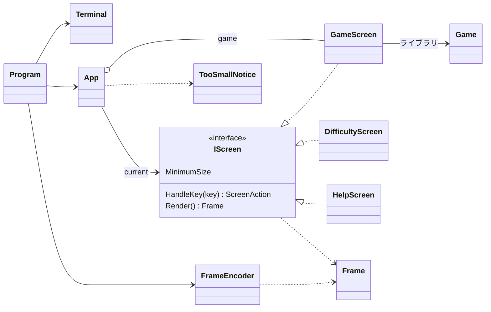

# T1: コンソール版の画面まわりの型の設計

作業の分類: 設計の相談（判断を伴う作業）。スキルの表に従い、object-design.md を全部読み、インターフェイスを新しく作るので simplicity.md も読んだ。

## 0. 何を作り、何を作らないか（What）

- 作るもの: 3 つの画面（ゲーム、難易度の選択、ヘルプ）、その間の行き来、端末が小さすぎるときの案内の画面、画面の内容を VT のシーケンスに変えて端末に書く部分、キーを読む・端末の大きさを読むループ。
- テストで確かめたいこと:「このキーを押すと、どの画面になり、ゲームに何が起きるか」「この大きさの端末に、何が描かれるか」。
- 方針（判断ルール 3）: 判断（キー → 操作、状態 → 画面の中身、大きさ → 案内を出すか）を、引数と戻り値だけの型に集める。`System.Console` を呼ぶ部分は薄い 1 か所（`Terminal` と `Program` のループ）に閉じ込めて、差し替え口（`IConsole` など）は作らない。

### 置いた仮定（ユーザーに聞けないため）

| # | 仮定 |
|---|------|
| A1 | ルールのライブラリには、`Difficulty`（初級・中級・上級）、`Game`（`Board`、`State` が 進行中/勝ち/負け、`RemainingMines`、`Open(Position)`、`ToggleFlag(Position)`、`Board[Position]` でマスの状態）がある。名前が違えば合わせる |
| A2 | 経過時間はライブラリが持たない。画面の側で `TimeProvider` から測る（ライブラリが持つなら、それを使い、`TimeProvider` は消す） |
| A3 | 難易度は 3 つの既定だけ。カスタム（幅・高さ・地雷数の入力）は課題に書かれていないので作らない |
| A4 | 表示の文言は日本語。全角の文字は端末で 2 桁を使うので、幅の計算が要る |
| A5 | キーの割り当て: 矢印でカーソル、Space/Enter で開く、F で旗、D で難易度の画面、H または ? でヘルプ、Esc で前の画面に戻る、Q で終わる |
| A6 | 盤面は左上から描く（中央寄せはしない） |

## 1. 関心事と、それに対応する型

関心事を先に並べ、そこから型を決めた（「関心事の列挙が先で、クラスはその結果」）。

| 関心事（変更理由） | 型 | ひとことで言うと |
|---|---|---|
| 画面の行き来（どの画面からどこへ行けるか） | `App` | 今の画面を持ち、キーを渡し、画面を切り替える |
| 1 つの画面の、キーへの反応と中身 | `IScreen` と、その実装の `GameScreen`・`DifficultyScreen`・`HelpScreen` | 画面 |
| 画面が次に求める行き先 | `ScreenAction` | 画面から `App` への頼みごと |
| 小さすぎる端末への案内 | `TooSmallNotice` | 「端末を大きくしてください」の中身を作る |
| 端末の大きさ | `TerminalSize` | 幅と高さ（桁と行） |
| 描く内容（色と文字） | `Frame`・`Span`・`Tone` | 端末に依存しない、1 画面分の文字と色合い |
| VT のシーケンスへの変換と配色 | `FrameEncoder` | `Frame` を VT の文字列にする |
| 文字列の表示の幅 | `TextWidth` | 全角を 2 桁と数える |
| 端末の入出力と、準備・後始末 | `Terminal` | `System.Console` の薄い包み |
| 読んで・描いて・待つの繰り返し | `Program`（`Main` と `Run`） | ループ |

## 2. 型とシグネチャ

名前空間は `Minesweeper.ConsoleApp`（`Console` にすると `System.Console` を隠すので避ける）。

### 2.1 画面の行き来

```csharp
// 画面の行き来の決まりは、ここ 1 か所に置く。画面どうしは互いを知らない
public sealed class App
{
    public App(Difficulty initial, TimeProvider clock);

    public bool IsFinished { get; }              // Q が押された
    public void HandleKey(ConsoleKeyInfo key);   // 小さすぎるときは、Q 以外を捨てる（見えない盤面を操作させない）
    public Frame Render(TerminalSize size);      // 小さすぎれば TooSmallNotice、そうでなければ今の画面
}
```

- 持つもの: `GameScreen game`（今のゲーム）と `IScreen current`（今の画面）。ヘルプや難易度の画面から「戻る」と、`game` に戻る。ゲームの状態（盤面、カーソル、経過時間）はそのまま残る。
- `ScreenAction` に応じて切り替える:

| ScreenAction | 行き先 |
|---|---|
| `Stay` | そのまま |
| `ShowHelp` | `new HelpScreen()` |
| `ShowDifficulty` | `new DifficultyScreen(game.Difficulty)`（今の難易度にカーソルを置く） |
| `Back` | `game` |
| `StartGame(Difficulty)` | `game = new GameScreen(new Game(difficulty), clock)`、`current = game` |
| `Quit` | `IsFinished = true` |

### 2.2 画面

```csharp
public interface IScreen
{
    TerminalSize MinimumSize { get; }            // この画面を描くのに要る大きさ
    ScreenAction HandleKey(ConsoleKeyInfo key);
    Frame Render();                              // MinimumSize 以上の端末に描く前提
}

public abstract record ScreenAction
{
    public static readonly ScreenAction Stay, ShowHelp, ShowDifficulty, Back, Quit;
    public sealed record StartGame(Difficulty Difficulty) : ScreenAction;
}
```

```csharp
// 1 回のゲームの画面: カーソル、キーからゲームへの操作、盤面と状態の行の描画
public sealed class GameScreen : IScreen
{
    public GameScreen(Game game, TimeProvider clock);
    public Difficulty Difficulty { get; }
    public TerminalSize MinimumSize { get; }     // 盤面の幅 × 2 桁と、案内の行の幅の大きい方 × (盤面の高さ + 状態の行 + 案内の行)
    public ScreenAction HandleKey(ConsoleKeyInfo key);
    public Frame Render();                       // 状態の行（残り地雷数、経過時間、勝ち/負け）、盤面、キーの案内
}

// 難易度の選択: 上下で選び、Enter で StartGame、Esc で Back
public sealed class DifficultyScreen : IScreen
{
    public DifficultyScreen(Difficulty current);
    ...IScreen のメンバー
}

// ヘルプ: 遊び方とキーの一覧。Esc・H・? で Back
public sealed class HelpScreen : IScreen
{
    ...IScreen のメンバー
}
```

- `GameScreen` が持つ状態は、`Game`（ルールの状態）と、カーソルの位置と、開始の時刻だけ。勝ち負けの判断はライブラリの `Game` に任せ（Expert）、画面は `Game` に `Open` / `ToggleFlag` を頼んで、結果を描くだけにする。
- マスの見た目（未開放 `·`、旗 `F`、数字、地雷 `*`、誤った旗 `X`。1 マスは 2 桁）は、`GameScreen` の private な表（`Span CellSpan(CellState state, bool isCursor)`）に置く。カーソルは反転（`Span.Highlighted`）で表し、色だけに頼らない。

### 2.3 小さすぎる端末

```csharp
public static class TooSmallNotice
{
    // 「端末を大きくしてください」と、今の大きさ・要る大きさを出す。案内そのものが入らない幅でも、切り詰めて描く
    public static Frame Render(TerminalSize actual, TerminalSize required);
}

public readonly record struct TerminalSize(int Width, int Height)
{
    public bool CanHold(TerminalSize required);  // 幅も高さも足りるか
}
```

`App.Render` の中身は、ほぼ次の 1 行になる。

```csharp
size.CanHold(current.MinimumSize) ? current.Render() : TooSmallNotice.Render(size, current.MinimumSize);
```

判断を画面ごとに書かずに `App` に置いたのは、「小さすぎたら案内を出す」が全画面で同じ意図だから（Once And Only Once）。各画面が知るのは、自分に要る大きさだけである。

### 2.4 描く内容と VT への変換

```csharp
public enum Tone { Normal, Unopened, Number1, Number2, /* … */ Number8, Flag, Mine, WrongFlag, Won, Lost, Hint }

public readonly record struct Span(string Text, Tone Tone = Tone.Normal, bool Highlighted = false);

public sealed class Frame
{
    public IReadOnlyList<IReadOnlyList<Span>> Lines { get; }
    public Frame AddLine(params Span[] spans);
}

public static class FrameEncoder
{
    // カーソルを左上へ → 各行を書いて行末まで消す → 残りの行を消す。Tone から SGR（色）への対応表はここだけにある
    public static string ToVt(Frame frame);
}

public static class TextWidth
{
    public static int Of(string text);           // 東アジアの全角の文字を 2 桁と数える
}
```

- 画面は `Frame`（何を、どの色合いで）を返すだけで、エスケープ シーケンスを知らない。配色を変えるときの修正先は `FrameEncoder` の表 1 か所（ひとつの変更 → ひとつの修正）。
- 色は具体的な色ではなく、意味（`Tone`）で指定する。テストは「この位置に `F` が `Tone.Flag` で描かれる」と書ける。

### 2.5 端末とループ（テストしない、薄い部分）

```csharp
// 準備（代替画面、カーソルを隠す、Ctrl+C をキーとして受ける）と、Dispose での後始末
public sealed class Terminal : IDisposable
{
    public TerminalSize Size { get; }            // Console.WindowWidth / WindowHeight
    public ConsoleKeyInfo? TryReadKey();         // KeyAvailable のときだけ ReadKey(intercept: true)
    public void Write(string vt);
    public void Dispose();                       // 代替画面を抜け、カーソルを戻し、色を戻す
}

static class Program
{
    static void Main();                          // using var terminal = new Terminal(); Run(terminal, new App(Difficulty.Beginner, TimeProvider.System));
    static void Run(Terminal terminal, App app); // 下のループ
}
```

ループ（約 100 ms ごと）:
1. キーがあれば `app.HandleKey`。`IsFinished` なら抜ける。
2. `app.Render(terminal.Size)` を `FrameEncoder.ToVt` にする。前回と同じ文字列なら書かない（ちらつきと無駄な出力を防ぐ。経過時間が変わる 1 秒ごとにだけ書くことになる）。
3. 大きさが前回と変わったときは、先に画面全体を消す（`ESC[2J`）。

後始末は `using` の `Dispose` で必ず行う。例外で抜けても端末を元に戻す。

## 3. 型の関係



依存の向きは一方向: `Program` → (`Terminal`, `App`, `FrameEncoder`) → 画面 → `Frame` と ライブラリ。画面どうしは互いを参照しない。`System.Console` に触れるのは `Terminal` だけ。

## 4. 設計の理由（Why）と、捨てた案

### 4.1 設計を問う 4 つの問いへの答え

1. **なぜこの単位か**: 「画面の行き来」「1 画面の反応と中身」「VT への変換」「端末の入出力」は、それぞれ独立に変わる（キーの割り当てを変えても VT の部分は変わらない。Windows と Linux の端末の差は `Terminal` と `FrameEncoder` に閉じる）。
2. **二つにまたがる処理**: 「難易度を選んで新しいゲームを始める」は、選択の画面とゲームの画面にまたがる。選ぶのは `DifficultyScreen`（`StartGame(d)` を返すだけ）、作り直すのは画面の行き来の持ち主の `App` とした。
3. **公開する操作**: `Program` のループが使う側として要るのは「キーを渡す」「今の大きさで描く」「終わったか」の 3 つだけなので、`App` の公開はそれだけにした。
4. **増やしたくなったとき**: 画面を 1 つ足す → 新しい `IScreen` の実装と、`ScreenAction` の 1 つと、`App` の切り替えの 1 行。配色を変える → `FrameEncoder` の表だけ。キーを変える → その画面だけ。

### 4.2 捨てた案とトレードオフ

| 捨てた案 | 捨てた理由 |
|---|---|
| `IConsole` を作り、画面が直接書く。テストでは偽の `IConsole` に書かせて出力を調べる | 判断を戻り値（`Frame`、`ScreenAction`）に寄せられるので、差し替え口は要らない（判断ルール 3）。偽の端末の出力をエスケープ シーケンスごと比べるテストは、見た目の小さな変更で壊れる |
| 画面が次の画面を自分で作る（`GameScreen` が `new HelpScreen(this)` を返す） | 画面どうしが互いを知り、行き来の決まりが 3 か所に散る。ヘルプから戻る先を保つためにも、`App` が `game` を持つ方が 1 か所で済む |
| `IScreen` を作らず、`App` で `enum` と `switch` にする | 描く・キー・要る大きさの 3 つを、それぞれ `switch` で分けることになり、同じ分岐が 3 か所に出る。実装が 3 つ実在するので、インターフェイスは当てずっぽうではない |
| 画面が VT の文字列を直接返す | 配色が画面ごとに散り、テストがエスケープ シーケンスを読むことになる |
| `ScreenAction` を `enum` にする | `StartGame` だけが難易度を運ぶ。`enum` にすると「選ばれた難易度」を別のプロパティで後から読むことになり、呼ぶ順番に依存する |
| 小さすぎる案内を `IScreen` の 1 つにする | キーを受けて行き先を決める画面ではなく、大きさで自動的に出入りする表示なので、画面の行き来に入れると `App` の状態が 1 つ増える。関数 1 つで済む |

## 5. 作らないことにしたもの

| 作らないもの | 理由（引き算の語彙） |
|---|---|
| カスタムの難易度の入力 | 課題にない（冷蔵庫にキリン）。要るなら `DifficultyScreen` に入力の状態を足す |
| 差分だけを書く描画（前の `Frame` とマスごとに比べる） | 性能の問題が計測されていない。「前回と同じ文字列なら書かない」だけで始め、ちらつきが見えたら計測して入れる |
| `IConsole`・`IClock` などの自前の差し替え口 | 上の 4.2。時刻は .NET の `TimeProvider` をそのまま使う（テストでは `GetUtcNow` を上書きした小さな派生を使い、パッケージは足さない） |
| キーの割り当ての設定ファイル、配色のテーマ | 要求にない設定項目（YAGNI） |
| 画面の基底クラス（共通の枠の描画など） | 再利用のための継承になる（判断ルール 9）。共通の部品が要るとわかったら、`Frame` を作る静的な補助にする |
| 盤面の中央寄せ、マウス操作、効果音、ベストタイム | 課題にない |
| 画面の遷移の履歴（スタック） | 戻り先はいつもゲームの画面なので、`game` の 1 つで足りる。ヘルプの上に難易度を重ねる、のような要求が来たら考える |
| `GameScreen` からの盤面の描画（`BoardView`）とキーの割り当て（`GameKeyMap`）の分離 | 今は両方とも「ゲームの画面」の変更理由の中にあり、小さい。`GameScreen` が大きくなったら、盤面の描画から切り出す（範囲外の気づきとして記録） |

## 6. テストの計画（xUnit）

`System.Console` を使わずに、すべて引数と戻り値で書ける。

| 対象 | 例 |
|---|---|
| `App` | ゲームで H → ヘルプの `Frame`。Esc → 元のゲームに戻り、カーソルと盤面が残る。難易度の画面で上級を選ぶ → 上級の新しいゲーム。Esc → 難易度は変わらない。Q → `IsFinished` |
| `App`（小さすぎ） | `MinimumSize` より 1 桁狭い → 案内の `Frame`。そのときの F や Space は無視される。大きくすると元の画面に戻る |
| `GameScreen` | 右矢印でカーソルが動き、右端で止まる。Space で `Game.Open` がカーソルの位置に効く。勝ち・負けの表示。経過時間（`TimeProvider` を進めて） |
| `GameScreen.MinimumSize` | 初級・上級の盤面の大きさから計算した値 |
| `DifficultyScreen`・`HelpScreen` | 上下の選択と端での止まり方、返す `ScreenAction` |
| `TooSmallNotice` | 今の大きさと要る大きさが文に入る。極端に狭くても、行が幅を超えない |
| `FrameEncoder` | `Tone.Flag` が決めた SGR になる。行末の消去、最後の色の戻し |
| `TextWidth` | ASCII は 1、ひらがな・漢字は 2 |

`Frame` を文字だけの行に変える補助（`frame.ToPlainLines()`）は、テストのプロジェクトに置く（本体では使わないので）。

## 7. 実行環境で確かめること・判断が要る点

- 実行環境の差: Windows 11 の Windows Terminal と Linux の端末で、代替画面・色・カーソルの非表示が効くこと、全角の文字の幅が `TextWidth` と一致すること、大きさの変更が `Console.WindowWidth` に反映されることを、本物の端末で確かめる。古い conhost では VT の処理が有効になっていない場合があり、そのときの扱いは未確認。
- 入力をリダイレクトしたとき（`Console.IsInputRedirected`）は、キーを読めないので、起動時に案内を出して終わる（`Program.Main` のガード節）。
- ユーザーの判断が要る点: キーの割り当て（A5）、カスタムの難易度が要るか（A3）、経過時間をライブラリが持つか（A2）。

## 8. 自己点検（object-design.md の 3 問）

- 変更理由は一つか: 行き来 → `App`、キーと画面の中身 → 各画面、配色と VT → `FrameEncoder`、端末の入出力 → `Terminal`、幅 → `TextWidth`。一つずつ別の型に対応する。
- 依存は抽象に向いているか: `App` は画面を `IScreen` として扱い、`GameScreen` の中身をたどらない（`Difficulty` だけを問い合わせる）。
- 名前は利用者の関心を表しているか: `FrameEncoder.ToVt`、`TerminalSize.CanHold` などは、何をしてくれるかを表し、内部の作り（文字列の連結、比較）は名前に入れていない。
