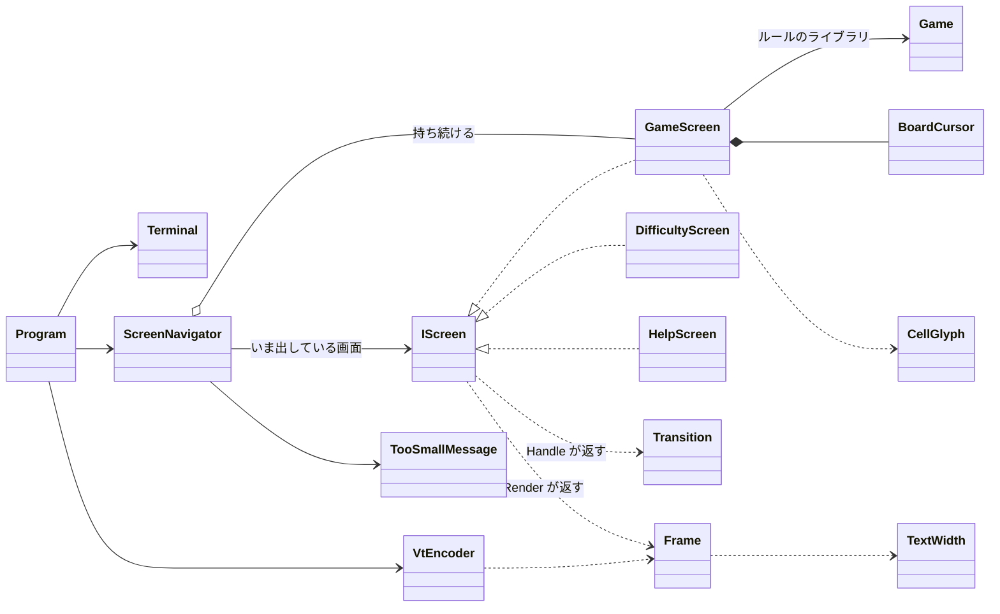

# T1 コンソール版の画面まわりの型の設計

使ったスキル: sustainable-code-jp（作業の種類は「設計の相談」）。読んだもの: object-design.md（必ず読む）。インターフェイスを 1 つ新しく作るので simplicity.md も読んだ。

## 0. 何を作るか（What）と置いた仮定

What: ゲームの画面、難易度を選ぶ画面、ヘルプの画面の 3 つを持ち、キーで行き来するコンソールアプリの表示と入力の部分。画面の判断（キーを受けて何が起きるか、何を描くか）は、端末に触らない純粋な型に置いて xUnit で確かめる。端末に触る部分（VT の出力、キーの読み取り、大きさの取得）は薄くして、テストでは差し替えない。

ユーザーに確認できないので、次の仮定を置いた。どれかが違えば、該当する型の中だけが変わる。

| # | 仮定 | 違ったときに変わる所 |
|---|------|------------------------|
| A1 | ルールのライブラリには `Game`（`Open(row, column)`、`ToggleFlag(row, column)`、`Board`、`Status`（Playing / Won / Lost）、`RemainingMines`）と、`Difficulty`（初級・中級・上級の定義。行数、列数、地雷の数）がある。テストでは地雷の位置を決めて `Game` を作れる | `GameScreen` の中 |
| A2 | `Game` は時刻を持たない。経過時間はコンソール版が数える（最初にマスを開けたときから、勝ち負けが決まるまで） | `GameScreen` の中 |
| A3 | 難易度は 3 つの既定の難易度だけ。カスタム（行数・列数・地雷の数の入力）は課題にないので作らない | `DifficultyScreen` の中 |
| A4 | 操作はキーボードだけ。矢印キーでカーソルを動かし、Space か Enter で開き、F で旗、N で同じ難易度の新しいゲーム、D で難易度の画面、H か ? でヘルプ、Q で終わる。難易度の画面とヘルプでは Esc で戻る | 各画面の `Handle` |
| A5 | 画面の文言は日本語。全角文字は端末で 2 桁を使うので、幅は表示の桁数で数える（あいまいな幅の文字は 1 桁とみなす） | `TextWidth` |
| A6 | 端末が小さすぎる間は、盤面が見えないので、Q（と Ctrl+C）以外のキーは無視する | `ScreenNavigator.Handle` |
| A7 | 画面は端末の左上から描く（中央に寄せない） | `Frame` を使う側 |

## 1. 関心事と型

関心事を先に並べ、それぞれを 1 つの型に対応させた。

| 関心事 | 型 | ひとことで言うと | テスト |
|--------|----|------------------|--------|
| どの画面を出していて、キーでどこへ移るか | `ScreenNavigator` | 画面の行き来を決める | xUnit |
| 1 つの画面のふるまい（キーを受ける、描く） | `IScreen` | 画面の契約 | — |
| ゲームの操作と表示 | `GameScreen` | 1 回のゲームを遊ばせる画面 | xUnit |
| カーソルの位置 | `BoardCursor` | 盤面の中に収まるカーソル | xUnit |
| マスの見た目 | `CellGlyph` | マスの状態を文字と色の意味に写す | xUnit |
| 難易度の選択 | `DifficultyScreen` | 難易度を選ばせる画面 | xUnit |
| 操作の説明 | `HelpScreen` | 操作を説明する画面 | xUnit |
| 端末が小さすぎるときの表示 | `TooSmallMessage` | 「端末を大きくしてください」を描く | xUnit |
| 画面が次にどこへ移りたいか | `Transition` | 画面から navigator への返事 | （上の型のテストで使う） |
| 描く内容（端末に依存しない） | `Frame`、`FrameLine`、`Span`、`Ink` | 1 画面分の文字と色の意味 | xUnit |
| 表示の桁数 | `TextWidth` | 文字列が端末で何桁を使うか | xUnit |
| 端末の大きさ | `TerminalSize` | 列数と行数の組 | xUnit |
| VT のシーケンスへの変換 | `VtEncoder` | `Frame` を端末に書く文字列にする | xUnit |
| 端末の入出力と後始末 | `Terminal` | 本物の端末を薄く包む | 端末で動かして確かめる |
| 繰り返し（描く → キーを待つ） | `Program`（`Main` と `Run`） | アプリを回す | 端末で動かして確かめる |

## 2. 型の間の関係



依存は一方向である。`Program` → `ScreenNavigator` → 各画面 → `Frame`・ルールのライブラリ。画面は `Terminal` も `VtEncoder` も知らない。`Frame` は VT のシーケンスを知らない（色は `Ink` という意味の名前で持ち、VT の色番号に写すのは `VtEncoder` だけ）。

## 3. 型ごとのシグネチャと責務

コードの全体ではなく、公開するものだけを示す。

### 3.1 画面の契約と画面の移り方

```csharp
// 画面の契約。3 つの画面が実装する。
interface IScreen
{
    Frame Render();                        // いまの状態を 1 画面分の内容にする（副作用なし）
    Transition Handle(ConsoleKeyInfo key); // キーを受けて自分の状態を変え、次にどこへ移りたいかを返す
}

// 画面から ScreenNavigator への返事。StartGame だけがデータを持つので record の階層にする。
abstract record Transition
{
    public static readonly Transition Stay           = new StayTransition();
    public static readonly Transition OpenHelp       = new OpenHelpTransition();
    public static readonly Transition OpenDifficulty = new OpenDifficultyTransition();
    public static readonly Transition Back           = new BackTransition();   // ゲームの画面へ戻る
    public static readonly Transition Quit           = new QuitTransition();
    public static Transition StartGame(Difficulty difficulty) => new StartGameTransition(difficulty);
}
sealed record StartGameTransition(Difficulty Difficulty) : Transition;
// StayTransition などはデータを持たない sealed record（省略）

// どの画面を出しているかと、画面の行き来を決める。
sealed class ScreenNavigator(Difficulty initialDifficulty, TimeProvider clock)
{
    public Frame Render(TerminalSize terminal);                // 小さすぎれば TooSmallMessage の Frame を返す
    public bool Handle(ConsoleKeyInfo key, TerminalSize terminal); // 終わるときは false
}
```

`ScreenNavigator` の中は、ゲームの画面 `game`（ヘルプや難易度の画面を開いても捨てない）と、いま出している画面 `current` の 2 つだけを持つ。`Handle` は `current.Handle(key)` の返事を 1 つの `switch` で解釈する。

| 返事 | すること |
|------|----------|
| `Stay` | 何もしない |
| `OpenHelp` | `current = new HelpScreen()` |
| `OpenDifficulty` | `current = new DifficultyScreen(game.Difficulty)`（いまの難易度を選んだ状態で開く） |
| `Back` | `current = game` |
| `StartGame(d)` | `game = GameScreen.Start(d, clock); current = game` |
| `Quit` | `false` を返す |

端末が小さすぎるかどうかは、`current.Render()` の `Frame` の大きさ（`frame.Size`）が端末に収まるか（`terminal.Contains(frame.Size)`）で決める。そのため、画面が「必要な大きさ」を別に申告する必要はない。小さすぎる間は、A6 のとおり Q だけを受ける。

### 3.2 3 つの画面

```csharp
sealed class GameScreen : IScreen
{
    public static GameScreen Start(Difficulty difficulty, TimeProvider clock);
    public Difficulty Difficulty { get; }
    public Frame Render();                       // 見出し（残りの地雷、経過時間、勝ち負け）＋盤面＋操作の 1 行
    public Transition Handle(ConsoleKeyInfo key);
}

readonly record struct BoardCursor(int Row, int Column)
{
    public BoardCursor Move(int rowDelta, int columnDelta, int rows, int columns); // 盤面の外には出ない
}

static class CellGlyph
{
    public static Span Of(Cell cell, GameStatus status); // 例: 未開放 "■"、旗 "F"、数字 "1"〜"8"、負けた後の地雷 "*" と誤った旗 "X"
}

sealed class DifficultyScreen(Difficulty selected) : IScreen
{
    public Frame Render();                       // 3 つの難易度の一覧（選んでいる行を Ink.Selected で）
    public Transition Handle(ConsoleKeyInfo key); // 上下で選び、Enter で StartGame(d)、Esc で Back
}

sealed class HelpScreen : IScreen
{
    public Frame Render();                       // 操作の一覧（決まった文言）
    public Transition Handle(ConsoleKeyInfo key); // Esc か H で Back。ほかのキーは Stay
}

static class TooSmallMessage
{
    public static Frame Render(TerminalSize actual, Size required); // 「端末を大きくしてください（いま 60×20、必要 70×24）」
}
```

- `GameScreen` の責務は「キーをゲームの操作に割り当てる」と「ゲームの状態を描く」である。ルール（開く、連鎖して開く、勝ち負け）は `Game` の仕事で、`GameScreen` は判断しない（Expert）。
- 経過時間は A2 のとおり `GameScreen` が数える。時刻は I/O なので、.NET の `TimeProvider` を外から受ける。テストでは `TimeProvider` を継承した小さな時計（`Advance` で進むもの）を使う。自前の時計のインターフェイスは作らない。
- 見た目の対応（`CellGlyph`）を分けたのは、表の形の判断で、盤面の描き方と別に変わりうるから（記号を変えても `GameScreen` が変わらない）。

### 3.3 描く内容と端末

```csharp
enum Ink { Normal, Dim, Selected, Cursor, Number1, /* … */ Number8, Flag, Mine, WrongFlag, Won, Lost }

readonly record struct Span(string Text, Ink Ink = Ink.Normal);
sealed record FrameLine(IReadOnlyList<Span> Spans) { public int Width { get; } } // Width は TextWidth で数える
sealed record Frame(IReadOnlyList<FrameLine> Lines)
{
    public Size Size { get; }                     // 幅は最も長い行の表示の桁数、高さは行数
    public string TextAt(int line);               // テストで文言を確かめるための、色を除いた文字列
}

readonly record struct Size(int Columns, int Rows);
readonly record struct TerminalSize(int Columns, int Rows)
{
    public bool Contains(Size content);
}

static class TextWidth
{
    public static int Of(string text); // 全角は 2、ほかは 1（A5）
}

static class VtEncoder
{
    public static string Encode(Frame frame); // ESC[H で左上へ → 各行を SGR で色付け＋ESC[K → 最後に ESC[J
}

sealed class Terminal : IDisposable
{
    public static Terminal Open();   // UTF-8 にする、代替画面 ESC[?1049h、カーソルを隠す ESC[?25l、
                                     // Ctrl+C をキーとして受ける（TreatControlCAsInput）、Windows では VT を有効にする
    public TerminalSize Size { get; }            // Console.WindowWidth / WindowHeight
    public bool TryReadKey(out ConsoleKeyInfo key); // KeyAvailable を見てから ReadKey(intercept: true)
    public void Write(string text);
    public void Dispose();           // カーソルを戻し、代替画面を抜け、色を戻す
}
```

### 3.4 繰り返し

```csharp
static void Run(Terminal terminal, ScreenNavigator navigator)
{
    string? shown = null;
    while (true)
    {
        var text = VtEncoder.Encode(navigator.Render(terminal.Size));
        if (text != shown) { terminal.Write(text); shown = text; } // 変わったときだけ書く（ちらつき防止）
        if (terminal.TryReadKey(out var key)) { if (!navigator.Handle(key, terminal.Size)) return; }
        else Thread.Sleep(100);                                     // 経過時間と端末の大きさの変化を拾う間隔
    }
}
```

`Main` は `using var terminal = Terminal.Open();` として `Run` を呼ぶだけである。例外で抜けても `Dispose` で端末を元に戻す。

## 4. 設計の理由

### 4.1 判断と I/O を分けた（テストのしやすさ）

画面の単位を xUnit で確かめたいという要求に対して、端末の差し替え口（`IConsole` のようなもの）は作らなかった。判断をすべて引数と戻り値の形に寄せられるからである。

- 入力: 画面は `ConsoleKeyInfo` を受ける。これはテストで `new ConsoleKeyInfo('f', ConsoleKey.F, false, false, false)` と作れる。
- 出力: 画面は `Frame` を返す。テストは `frame.TextAt(0)` の文言や、`Span` の `Ink` を見る。VT のシーケンスを文字列で比べるテストは `VtEncoder` の分だけで済む。
- 大きさ: `TerminalSize` を引数で渡す。
- 時刻: `TimeProvider`（.NET の標準の型）を渡す。

こうすると、I/O に触る `Terminal` と `Run` は数十行で判断を持たず、本物の端末で動かして確かめれば足りる（Windows 11 の Windows Terminal と Linux の端末で、表示、キー、終わったときの後始末、端末の大きさを変えたとき）。

### 4.2 `IScreen` を置いた理由

実装がいま 3 つあり、`ScreenNavigator` がいまの画面を区別せずに `Render` と `Handle` を呼ぶので、先回りの抽象ではない（実装が 1 つだけのインターフェイスには当たらない）。基底クラスにしなかったのは、3 つの画面に共有する処理がないからである。

### 4.3 画面は次の画面を作らず、`Transition` を返す

画面が次の画面を自分で作ると、ヘルプが「戻り先のゲームの画面」を持つ必要が出て、画面どうしが互いを知る。移り方を `ScreenNavigator` の 1 つの `switch` に集めると、「どのキーでどこへ行くか」を変える修正は、キーの割り当て（各画面の `Handle`）か、移り方（`ScreenNavigator`）の 1 か所で済む。遊んでいる途中のゲームを保つ責務も `ScreenNavigator` の 1 か所にある。

### 4.4 小さすぎる端末を画面の外で扱う

「端末を大きくしてください」は、どの画面でも同じ判断（中身が端末に収まるか）なので、3 つの画面に同じ判定を書かず、`ScreenNavigator.Render` の 1 か所で行う（Once And Only Once）。必要な大きさは、描いた `Frame` の大きさそのものなので、画面が別に申告すると同じ事実が 2 か所に書かれることになる。だから申告させない。`TooSmallMessage` は `Handle` を持たないので `IScreen` にしない（使わない操作への依存を強制しない）。

### 4.5 色は意味の名前で持つ

`Frame` が VT の色番号を持つと、画面のテストがエスケープ シーケンスを読むことになり、配色を変えるたびに画面のテストが壊れる。`Ink` という意味の名前にしておけば、配色の変更は `VtEncoder` の対応表の 1 か所で済む。

### 4.6 変更の例と、どこが変わるか

| 変更 | 変わる所 | 変わらない所 |
|------|----------|--------------|
| マスの記号や配色を変える | `CellGlyph`、`VtEncoder` の色の表 | 画面の移り方、ほかの画面 |
| キーの割り当てを変える | その画面の `Handle` | 描き方、`Terminal` |
| カスタムの難易度を足す | `DifficultyScreen`（入力の欄）と、必要なら新しい画面 1 つと `Transition` の 1 つ | `GameScreen`、`Frame`、`Terminal` |
| 盤面を中央に寄せる | `Run` か `VtEncoder`（`Frame` を置く位置） | 3 つの画面 |
| 画面を 1 つ足す | 新しい `IScreen` の実装、`Transition` の 1 つ、`switch` の 1 行 | 既存の画面 |

## 5. テストの方針（xUnit）

| 対象 | 確かめること（例） |
|------|--------------------|
| `ScreenNavigator` | H でヘルプへ、ヘルプで Esc を押すとゲームに戻り、盤面の状態は元のまま。D → Enter で新しいゲーム。Q で `false`。端末が小さいと「端末を大きくしてください」の `Frame` になり、Q 以外のキーでは状態が変わらない。大きくすると元の画面に戻る |
| `GameScreen` | 地雷の位置を決めた `Game` で、矢印キーでカーソルが動く、Space で開く、F で旗、地雷を開けると見出しが負けになる。時計を進めると経過時間が進み、勝ち負けが決まった後は止まる |
| `BoardCursor` | 端で止まる |
| `CellGlyph` | 状態ごとの文字と `Ink`（負けた後だけ地雷と誤った旗が見える） |
| `DifficultyScreen`、`HelpScreen` | 上下で選ぶ行が変わり、端で止まる。Enter で `StartGame(選んだ難易度)`、Esc で `Back` |
| `TooSmallMessage` | 文言に、いまの大きさと必要な大きさが出る |
| `Frame`、`TextWidth` | 全角を含む行の幅が 2 桁で数えられる |
| `VtEncoder` | 行ごとに ESC[K が付き、`Ink` が決まった SGR になり、最後に色を戻す |

## 6. 作らないことにしたもの

| 作らないもの | 理由 |
|--------------|------|
| 端末のインターフェイス（`IConsole`、`ITerminal`）とそのモック | 判断を `Frame` と `ConsoleKeyInfo` の形に寄せたので、I/O の側は差し替えずに薄く保てる。実装が 1 つだけのインターフェイスになる |
| 自前のキーの型や、キーをコマンドに変える表の層 | `ConsoleKeyInfo` はテストで作れる。キーの割り当ては各画面の `Handle` で読めば足りる |
| 画面の基底クラス | 共有する処理がない。再利用だけのための継承になる |
| 画面のスタック・汎用のルーター | 画面は 3 つで、深さは 1 段（ゲーム ↔ ヘルプ / 難易度）。「ゲームを保ち、いまの画面を 1 つ持つ」で足りる |
| 差分の描画（変わったマスだけを書く） | 盤面は上級でも 30×16 で、全体を書き直しても十分速いと見込む。ちらつきは、左上へ戻って上書きし、変わったときだけ書くことで抑える。遅いと分かったら計測してから `VtEncoder` の中だけで入れる |
| 画面が「必要な大きさ」を申告するプロパティ | `Frame` の大きさと同じ事実の重複になる |
| カスタムの難易度、マウス、効果音、ベストタイム、配色の設定 | 課題にない（A3）。足すときの変わる所は 4.6 のとおり |
| 端末の大きさの変化のイベント | 100 ミリ秒ごとの繰り返しで大きさを見直すので要らない（経過時間の表示のためにどのみち繰り返す） |
| 中央寄せ | 課題にない（A7） |

## 7. 確かめていないこと・判断が要る点

- `Game` と `Difficulty` の API は A1 の仮定である。実物の名前に合わせて `GameScreen` と `CellGlyph` の中を直す。
- Windows 11 で VT を有効にする処理（`SetConsoleMode` で ENABLE_VIRTUAL_TERMINAL_PROCESSING を立てる）は、Windows Terminal では不要だが、従来のコンソール ホストで動かす場合のために `Terminal.Open` に置いた。要るかどうかは実機で確かめる。
- 全角・あいまいな幅の文字（A5）の幅は、端末とフォントで変わりうる。盤面の記号に「■」のようなあいまいな幅の文字を使うと、端末によって桁がずれるおそれがあるので、記号は実機で決める（ずれるなら ASCII にする）。
- 端末が小さすぎる間に Q 以外のキーを無視する（A6）のは、仕様の解釈である。ユーザーの判断が要る。
- 小さすぎる端末の中で、「端末を大きくしてください」の文言そのものも収まらないほど小さい場合は、折り返しに任せる（対処しない）。
