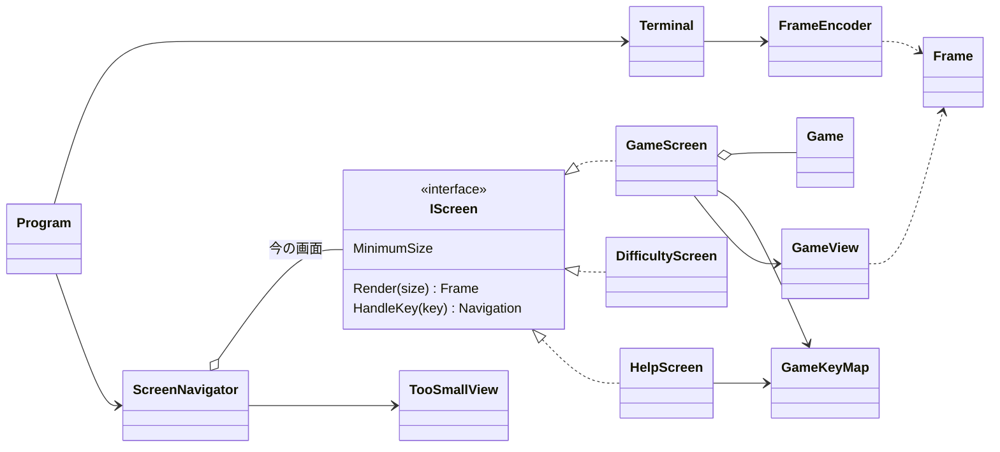

# T1 コンソール版の画面の設計

判断の基準: sustainable-code-jp（Dp）。作業の種類は「設計の相談」なので、object-design.md を読んだ。インターフェイスを新しく置くので simplicity.md も読んだ。

## 0. 作るもの（What の言い直し）と仮定

作るもの: 3 つの画面（ゲーム、難易度の選択、ヘルプ）と「端末を大きくしてください」の表示。キーで画面を切り替え、VT のシーケンスで描く。**画面の判断（キーを受けて何が起きるか、何が見えるか）を xUnit で確かめられること**が、この設計の中心の要求である。

仮定（課題に書かれていないので、こう置いて進めた）:

| # | 仮定 |
|---|------|
| A1 | ゲームのライブラリには `Game`、`Board`、`Difficulty`（初級・中級・上級のプリセット）がある。`Game` には、マスを開ける・旗を切り替える操作と、状態（遊んでいる・勝ち・負け）、残りの地雷数、マスの状態の読み出しがある。テストでは、地雷の位置を決めた `Game` を作れる |
| A2 | `Game` は時間を測らない。経過時間は画面の側で測る |
| A3 | ヘルプと難易度の選択は、ゲームの画面から開き、閉じるとゲームの画面に戻る（遊んでいたゲームはそのまま残る）。ヘルプを難易度の選択の画面から開くことはしない |
| A4 | 画面の文言は日本語。全角の文字は 2 桁ぶんの幅として数える |
| A5 | 端末が小さい間は、終了のキーだけを受け付け、ほかのキーは捨てる（見えない盤面を操作させないため） |
| A6 | カスタムの難易度（数を入力する画面）は、課題の 3 画面に入っていないので作らない |

## 1. 関心事と、それに対応する型

クラスの一覧より先に、関心事と変更の理由を並べた（object-design.md の「関心事の列挙が先」「変更理由を一つにする」）。

| 変更の理由（こう変えたくなったら） | 直す場所 |
|---|---|
| 画面の行き来の決まり（どのキーでどこへ、戻り先） | `ScreenNavigator` |
| ゲームのキーの割り当て（ヘルプの説明の文言を含む） | `GameKeyMap` |
| ゲームの画面でキーを受けたときの振る舞い（カーソル、開く、旗） | `GameScreen` |
| 盤面と状態の行の見た目（記号、並べ方） | `GameView` |
| 難易度の選択画面・ヘルプの画面 | `DifficultyScreen`、`HelpScreen` |
| 小さすぎるときの表示 | `TooSmallView` |
| 色（役割から SGR への対応）、VT のシーケンス | `FrameEncoder` |
| 端末の準備と後始末、キーの読み取り、端末の大きさ | `Terminal` |
| 経過時間の測り方 | `PlayTimer` |

「一つの変更 → 一つの修正」になるように、各行の直す場所を一つにした。

## 2. 型の一覧

### 2.1 描いた結果（データ）

画面の判断と端末への出力を分けるための境界である。画面は端末に書かずに `Frame`（描く内容）を返す。それを VT の文字列に変えて書くのは別の型の仕事にする。こうすると、画面のテストは `Frame` の文字を見るだけで済む（SKILL.md の判断ルール 3: 判断を引数と戻り値に寄せ、I/O の側は差し替えずに薄く保つ）。

```csharp
public readonly record struct TerminalSize(int Columns, int Rows)
{
    public bool CanContain(TerminalSize required);   // 幅も高さも足りるか
}

public enum TextRole { Normal, Emphasis, Cursor, Number1, /* … */ Number8, Flag, Mine, WrongFlag, Hidden }

public readonly record struct Span(string Text, TextRole Role);

public sealed class FrameLine   // 1 行 = Span の並び
{
    public IReadOnlyList<Span> Spans { get; }
    public string PlainText { get; }     // 色を除いた文字列（テストで見る）
    public int Width { get; }            // 表示の幅（TextWidth で数える）
}

public sealed class Frame
{
    public IReadOnlyList<FrameLine> Lines { get; }
    public string PlainText(int row);
    public static Frame Centered(TerminalSize size, IEnumerable<FrameLine> lines);  // 中央に置く
}

public static class TextWidth
{
    public static int Of(string text);   // 全角を 2、半角を 1 として数える（A4）
}
```

- 画面は色ではなく**役割**（`TextRole.Flag` など）を書く。役割から色への対応は `FrameEncoder` の 1 か所に置く。配色を変えても画面の型は変わらない。
- `Frame` には等価の比較を持たせない。前と同じなら書かない、という判断は `Terminal` が VT の文字列どうしで比べる（2.5）。

### 2.2 画面

```csharp
public interface IScreen
{
    TerminalSize MinimumSize { get; }            // これより小さい端末では描けない
    Frame Render(TerminalSize size);
    Navigation HandleKey(ConsoleKeyInfo key);    // 画面の中の状態を変え、行き先を返す
}

public abstract record Navigation
{
    public sealed record Stay : Navigation;
    public sealed record Back : Navigation;             // ゲームの画面に戻る（A3）
    public sealed record ShowHelp : Navigation;
    public sealed record ShowDifficulty : Navigation;
    public sealed record StartGame(Difficulty Difficulty) : Navigation;
    public sealed record Quit : Navigation;
    // 各ケースの static なインスタンス（Navigation.Stay.Instance など）を持たせる
}
```

- 画面は**次の画面を作らない**。行き先を値（`Navigation`）で返すだけにする。どこへ移るか、遊んでいるゲームを残すかは `ScreenNavigator` が決める。画面のテストは「このキーで `ShowHelp` が返る」を見るだけで済み、画面どうしが互いを知らずに済む。
- `IScreen` を置くのは、実装が今 3 つある（`GameScreen`、`DifficultyScreen`、`HelpScreen`）ので、`ScreenNavigator` が 3 つを同じ形で扱えるからである。将来への備えではない（判断ルール 1。simplicity.md の YAGNI の点検表にも当たらない）。

#### GameScreen（ゲームの画面: キーを受けて、ゲームとカーソルを動かす）

```csharp
public sealed class GameScreen : IScreen
{
    public GameScreen(Game game, TimeProvider time);
    public TerminalSize MinimumSize { get; }                 // GameView.RequiredSize(game) に任せる
    public Frame Render(TerminalSize size);                  // GameView.Render(...) に任せる
    public Navigation HandleKey(ConsoleKeyInfo key);
}
```

- 持つ状態: `Game`、`BoardCursor`、`PlayTimer`。
- `HandleKey` は `GameKeyMap.Find(key)` でコマンドにしてから、`switch` で振る舞いを決める。カーソルの移動・開く・旗は `Game` と `BoardCursor` に任せ、開いたときにタイマーを始め、勝ち負けが決まったら止める。ヘルプ・難易度・終了のコマンドは `Navigation` を返す。「新しいゲーム」は `StartGame(同じ難易度)` を返す。
- 描くのは `GameView` に任せる。盤面を描くコードは、この画面のうちでいちばん大きく、変わる理由（見た目）がキーの振る舞いと違うからである。難易度とヘルプの画面は小さいので分けない。

```csharp
public readonly record struct BoardCursor(int Row, int Column)
{
    public BoardCursor Move(int dRow, int dColumn, int rows, int columns);  // 盤の端で止まる
}

public sealed class PlayTimer   // 経過時間を測る（A2）
{
    public PlayTimer(TimeProvider time);
    public void Start();          // 2 回目以降は何もしない
    public void Stop();
    public TimeSpan Elapsed { get; }
}
```

#### GameView（ゲームの画面の見た目: 状態から Frame を作る）

```csharp
public static class GameView
{
    public static TerminalSize RequiredSize(Game game);   // 盤の大きさ + 状態の行 + 案内の行
    public static Frame Render(Game game, BoardCursor cursor, TimeSpan elapsed, TerminalSize size);
}
```

状態からの変換だけで、状態を持たない（object-design.md の「OO を絶対化しない」: モデルの状態から描画命令の列への変換は、変換として書く）。マスの記号（未開放、数字、旗、地雷、誤った旗）の決め方は、この中の private なメソッドにする。

#### GameKeyMap（ゲームのキーの割り当て）

```csharp
public enum GameCommand { MoveUp, MoveDown, MoveLeft, MoveRight, Open, ToggleFlag, NewGame, ShowDifficulty, ShowHelp, Quit }

public static class GameKeyMap
{
    public static GameCommand? Find(ConsoleKeyInfo key);
    public static IReadOnlyList<(string Keys, string Description)> HelpEntries { get; }
}
```

キーの割り当てとヘルプの説明を同じ型に置く。ヘルプの画面はここから説明を読んで描く。キーを変えるとヘルプの文言も変わる、という同じ意図を 1 か所にまとめるためである（Once And Only Once）。

#### DifficultyScreen、HelpScreen

```csharp
public sealed class DifficultyScreen : IScreen
{
    public DifficultyScreen(Difficulty current);     // 今の難易度に選択を合わせて開く
    // 上下で選び、Enter で StartGame(選んだ難易度)、Esc で Back
}

public sealed class HelpScreen : IScreen
{
    // GameKeyMap.HelpEntries を並べて描く。どのキーでも Back
}
```

### 2.3 TooSmallView（端末が小さいときの表示）

```csharp
public static class TooSmallView
{
    public static Frame Render(TerminalSize actual, TerminalSize required);
    // 「端末を大きくしてください」と、今の大きさ・要る大きさを出す
}
```

キーで行き来する画面ではなく、「今の画面が描けない」という描き方の条件なので、`IScreen` にしない。画面の切り替えの中に入れると、大きくしたときにどこへ戻るかを別に覚える必要ができるからである。

### 2.4 ScreenNavigator（画面の行き来: 今の画面を決め、キーと描く依頼を回す）

```csharp
public sealed class ScreenNavigator
{
    public ScreenNavigator(Difficulty initial, TimeProvider time);
    public bool IsQuitRequested { get; }
    public IScreen Current { get; }                     // テストで今の画面を見る
    public void HandleKey(ConsoleKeyInfo key, TerminalSize size);
    public Frame Render(TerminalSize size);
}
```

- 持つ状態: ゲームの画面（1 つ。遊んでいるゲームを残すため）と、今の画面。
- `Render`: `size.CanContain(Current.MinimumSize)` でなければ `TooSmallView.Render`、そうなら `Current.Render`。
- `HandleKey`: 小さすぎる間は終了のキーだけを見る（A5）。そうでなければ `Current.HandleKey` の戻り値で切り替える。`StartGame(d)` ならゲームの画面を `new GameScreen(new Game(d), time)` で作り直す、`Back` ならゲームの画面に戻す、`ShowHelp`・`ShowDifficulty` ならその画面を作る。
- 戻り先がいつもゲームの画面なので（A3）、画面の積み重ね（スタック）は持たない。

### 2.5 端末の I/O（テストしない、薄い側）

```csharp
public static class FrameEncoder     // Frame → VT の文字列（純粋な変換）
{
    public static string Encode(Frame frame);   // カーソルを左上へ、行ごとに書いて行末を消す、役割を SGR に
}

public sealed class Terminal : IDisposable
{
    public static Terminal Open();                    // 代替画面へ切り替え、カーソルを隠し、Ctrl+C を入力として受ける
    public TerminalSize Size { get; }                 // Console.WindowWidth / WindowHeight
    public ConsoleKeyInfo? TryReadKey(TimeSpan timeout);   // KeyAvailable を見て待つ
    public void Show(Frame frame);                    // Encode して、前と違うときだけ書く
    public void Dispose();                            // 色・カーソル・元の画面を戻す
}
```

- `FrameEncoder` は純粋な変換なので、テストできる（エスケープ シーケンスの間違いは、目で見つけにくいため）。
- `Terminal` は `Console` を呼ぶだけの薄い型にし、差し替え口（`ITerminal`）は置かない。判断はすべて `ScreenNavigator` 以下に寄せたので、差し替えてまで確かめる判断が `Terminal` に残っていないからである（判断ルール 3）。

### 2.6 Program（組み立てと回し方）

```csharp
using var terminal = Terminal.Open();
var navigator = new ScreenNavigator(Difficulty.Beginner, TimeProvider.System);
while (!navigator.IsQuitRequested)
{
    terminal.Show(navigator.Render(terminal.Size));
    if (terminal.TryReadKey(TimeSpan.FromMilliseconds(200)) is { } key)
        navigator.HandleKey(key, terminal.Size);
}
```

キーが来なくても 200 ms ごとに描き直すので、経過時間の表示と、端末の大きさの変化が画面に出る。中身が同じなら `Terminal.Show` は書かないので、ちらつかない。

## 3. 型の間の関係



依存の向きは一方向である: `Program` → `Terminal` / `ScreenNavigator` → 画面 → `GameView`・`GameKeyMap` → ゲームのライブラリ。画面の側は `Console` を知らない。`Frame` は両側が使うデータで、どちらにも依存しない。

## 4. 単体テスト（xUnit）で確かめること

`Console` にも端末にも触らずに、次を確かめられる。

| 対象 | テストの例 |
|---|---|
| `ScreenNavigator` | H でヘルプの画面になり、どのキーでもゲームの画面に戻る。戻ったゲームは同じ `Game` である |
| | 難易度の画面で中級を選ぶと、中級の新しいゲームの画面になる。Esc なら元のゲームが残る |
| | 端末が `MinimumSize` より小さいと、`Render` の結果に「端末を大きくしてください」がある。その間、矢印のキーで盤が変わらず、終了のキーでは `IsQuitRequested` になる |
| `GameScreen` | 地雷の位置を決めた `Game` で、カーソルを動かして Space で開くと、そのマスが開く。地雷を開くと負けの表示になり、タイマーが止まる |
| | カーソルは盤の端で止まる |
| `PlayTimer` | `TimeProvider` の派生（テストの中で `GetUtcNow` を返す小さなクラス）で、開始からの時間、止めた後に進まないこと |
| `GameView` | 数字・旗・誤った旗の記号と `TextRole`、状態の行の残りの地雷数と秒数 |
| `GameKeyMap` / `HelpScreen` | `HelpEntries` のすべてがヘルプの画面に出る |
| `FrameEncoder` | 役割ごとの SGR、行末の消去、最後に色を戻すこと |
| `TextWidth` | 全角・半角の幅。`Frame.Centered` の左の余白 |

## 5. 作らないことにしたもの

| 作らないもの | 理由 |
|---|---|
| `ITerminal`（端末の差し替え口） | 判断を `ScreenNavigator` 以下に寄せたので、`Terminal` にはテストで確かめる判断が残らない（判断ルール 3） |
| 画面の基底クラス（`ScreenBase`） | 3 つの画面に共通の処理は `Frame.Centered` くらいで、再利用だけのための継承になる（判断ルール 9）。共通の処理は `Frame` の static なメソッドにした |
| 画面のスタック、一般的な画面遷移の仕組み | 戻り先はいつもゲームの画面（A3）。二段目に重ねる画面が要求に出てから入れる |
| 差分だけを書く描画（変わったセルだけ） | 同じなら書かない、で足りる見込み。ちらつきが実際に見えたら測ってから入れる |
| キーの割り当ての設定ファイル、配色の設定 | 要求にない（YAGNI） |
| カスタムの難易度の入力画面、マウスの入力 | 課題の 3 画面に入っていない（A6） |
| 端末の大きさの変化のイベント | 200 ms ごとに `Size` を読むので要らない |
| 多言語対応（文言の表） | 要求にない |

## 6. 気づいたリスク（コードに備えは足さず、確かめ方を書く）

- **Windows の古いコンソール（conhost）の VT**: Windows Terminal では VT がそのまま効くが、conhost で VT の処理が有効になっているかは、実機で確かめる。効かないときは、`System.Console` と VT だけという制約の中で扱えるかを、そのときに判断する（ここでは、あり得ることとして挙げるだけにする）。
- **後始末**: 例外や Ctrl+C でも端末を元に戻す。`Terminal.Open` で Ctrl+C を入力として受け、`using` と `Dispose` で戻す。端末を閉じたときの振る舞いは、Windows と Linux の実機で確かめる。
- **全角の幅**: 端末とフォントによっては、記号（旗の絵文字など）の幅が 1 か 2 かで食い違う。盤面の記号は、幅が確かな半角の文字にしておくことを勧める（`GameView` の中だけで変えられる）。

## 7. ユーザーの判断が要る点

- A3（ヘルプ・難易度の戻り先はいつもゲームの画面）と A5（小さい間は終了のキーだけ）でよいか。
- ゲームのライブラリが時間を測るなら（A2 が違うなら）、`PlayTimer` は作らずにライブラリの時間を表示する。
