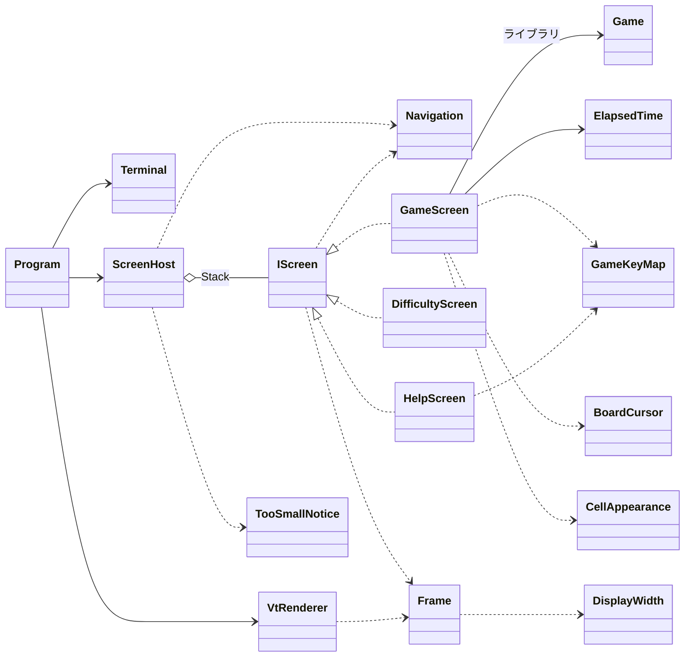

# 課題 T1: コンソール版の画面まわりの型の設計

判断の基準: スキル sustainable-code-jp（Dp）。作業の種類は「設計の相談」なので、object-design.md を読んだ。インターフェイスを 1 つ新しく作るので simplicity.md も読んだ。

## 1. 何を作るか（What の言い直し）

- 3 つの画面（ゲーム、難易度の選択、ヘルプ）を、キーで行き来できる形で作る。
- 各画面は「キーを受けて、次にどうするかを返す」ことと「今の状態を画面の絵（Frame）にする」ことだけを受け持つ。
  そうすれば、端末（`System.Console`）がなくても xUnit で確かめられる。
- 端末が画面に必要な大きさより小さいときは、その画面の代わりに「端末を大きくしてください」を出す。
- 端末とのやり取り（キーを読む、大きさを知る、VT の文字列を書く、後始末）は、判断を持たない薄い層にまとめる。

## 2. 置いた仮定

問題文に書かれていないことは、次のように仮定した。

| # | 仮定 |
|---|------|
| A1 | ゲームのルールのライブラリには、`Difficulty`（初級・中級・上級。行数、列数、地雷の数を持つ）、`Game`（`Open(row, column)`、`ToggleFlag(row, column)`、状態 `Playing / Won / Lost`、盤面 `Board` の各マスの状態）がある。地雷の置き方（乱数）は `Game` の側が受け持つ |
| A2 | 経過時間はライブラリに入っていないので、コンソール版で測る |
| A3 | 難易度は 3 つの定型だけで、カスタム（行・列・地雷の数を入力する）は作らない |
| A4 | 画面の文言は日本語を含む（「端末を大きくしてください」が日本語のため）。端末では全角の文字が 2 桁を占めるので、幅はそれに合わせて数える。絵文字とサロゲート ペアは使わない |
| A5 | 画面は切り替えるだけで、スクロールはしない。ヘルプも 80×24 に収まる量にする |
| A6 | 端末が小さい間は、終了のキー以外を受け付けない（見えないまま、マスを開けてしまわないため） |
| A7 | 画面の行き来: ゲーム → 難易度（D）、ゲーム → ヘルプ（H か ?）、難易度・ヘルプ → 元の画面（Esc）、難易度を選ぶ（Enter）→ その難易度で新しいゲーム、ゲームで R → 同じ難易度でやり直し、Q か Ctrl+C → 終了。終了の確認はしない |

## 3. 型の一覧

名前空間は `Minesweeper.ConsoleApp` とする（`Console` という名前にすると `System.Console` を隠すため）。

### 3.1 画面の共通の契約

```csharp
// 1 つの画面。キーへの反応と、今の状態の描き方を受け持つ
public interface IScreen
{
    TerminalSize RequiredSize { get; }          // この画面を描くのに要る大きさ
    Navigation HandleKey(ConsoleKeyInfo key);   // キーを受け、次にどうするかを返す
    Frame Render(TerminalSize size);            // 今の状態を画面の絵にする（size は RequiredSize 以上）
}
```

- 責務: 「画面であること」の契約。実装は 3 つ（`GameScreen`、`DifficultyScreen`、`HelpScreen`）が今あるので、実装が 1 つのインターフェイスにはならない（判断ルール 1。多態のためのインターフェイス）。
- `ConsoleKeyInfo` は `System.Console` の型だが、ただの値で、テストで `new ConsoleKeyInfo('f', ConsoleKey.F, false, false, false)` と作れる。そのため、自前のキーの型は作らない。

### 3.2 画面の行き来を表す値

```csharp
// 画面が、キーの結果として求める行き先
public abstract record Navigation
{
    public sealed record Stay : Navigation;                          // 今の画面のまま
    public sealed record Back : Navigation;                          // 1 つ前の画面へ戻る
    public sealed record ShowHelp : Navigation;
    public sealed record ChooseDifficulty : Navigation;
    public sealed record StartGame(Difficulty Difficulty) : Navigation; // 新しいゲーム（やり直しを含む）
    public sealed record Quit : Navigation;
}
```

- 責務: 「次にどうしたいか」を、画面の外へ伝える値。画面どうしは互いを知らない。
  `DifficultyScreen` は `GameScreen` の作り方（`Game`、時計）を知らずに済む。
- 画面を作るのは `ScreenHost` の 1 か所だけにする（GRASP の Creator。行き来の規則が 1 か所に集まる）。

### 3.3 画面の行き来と、端末の大きさの判定

```csharp
// 画面の重なりを持ち、キーを今の画面に渡し、行き先に従って画面を切り替える
public sealed class ScreenHost
{
    public ScreenHost(Difficulty initialDifficulty, Func<Difficulty, GameScreen> createGameScreen);

    public bool IsRunning { get; }
    public void HandleKey(ConsoleKeyInfo key, TerminalSize size);
    public Frame Render(TerminalSize size);
}
```

- 責務: 画面の行き来（`Navigation` の解釈）と、今の画面を描けるだけの大きさがあるかの判定。
- 画面は `Stack<IScreen>` で持つ。一番下は常に `GameScreen` で、その上にヘルプか難易度の画面が乗る（ヘルプは難易度の画面からも開ける）。
  `Back` は上から 1 枚を下ろし、`StartGame` は重なりを空にして新しい `GameScreen` を置く。
- `Render`: `size.CanContain(current.RequiredSize)` なら `current.Render(size)`、そうでなければ `TooSmallNotice.Render(size, current.RequiredSize)` を返す。
- `HandleKey`: 小さすぎる間は、終了のキーだけを受け付ける（A6）。
- `createGameScreen` を外から受け取るのは、地雷の置き方（乱数）と時計を、テストで決まった値にするためである（判断ルール 3。テストが最初の利用者）。
  `Program` では `d => new GameScreen(new Game(d), new ElapsedTime(TimeProvider.System))` を渡す。

### 3.4 3 つの画面

```csharp
// 1 回のゲームの画面。キーを盤面の操作に変え、盤面・残り地雷数・経過時間を描く
public sealed class GameScreen(Game game, ElapsedTime elapsed) : IScreen
{
    public TerminalSize RequiredSize { get; }   // 盤面の行数・列数から決まる（Expert: 盤面の大きさを知る者が答える）
    public Navigation HandleKey(ConsoleKeyInfo key);
    public Frame Render(TerminalSize size);
}

// 難易度の一覧から 1 つを選ぶ画面
public sealed class DifficultyScreen(Difficulty current) : IScreen { ... }

// 操作の一覧を示す画面
public sealed class HelpScreen : IScreen { ... }
```

- `GameScreen.HandleKey` は、キーを `GameKeyMap.CommandFor(key)` で `GameCommand` に変え、盤面の操作（カーソルの移動、開く、旗）を行うか、`Navigation` を返す（R → `StartGame(同じ難易度)`、H → `ShowHelp`、D → `ChooseDifficulty`、Q → `Quit`）。
  最初にマスを開けたら `elapsed.Start()`、勝ち負けが決まったら `elapsed.Stop()` を呼ぶ。
- `DifficultyScreen`: ↑↓ で選び、Enter で `StartGame(選んだ難易度)`、Esc で `Back`。1〜3 のキーでも直接選べる。今の難易度に最初のカーソルを置く。
- `HelpScreen`: `GameKeyMap.Bindings` の説明を並べて描く。Esc（と H）で `Back`。`RequiredSize` は文言の行数と最大の幅から決まる。

### 3.5 ゲームの画面を支える小さな型

```csharp
// ゲームの画面での操作の種類
public enum GameCommand { MoveUp, MoveDown, MoveLeft, MoveRight, Open, ToggleFlag,
                          Restart, ShowHelp, ChooseDifficulty, Quit }

// キーと操作の対応表。ゲームの画面の解釈と、ヘルプの文言の両方の出どころ
public static class GameKeyMap
{
    public static IReadOnlyList<KeyBinding> Bindings { get; }
    public static GameCommand? CommandFor(ConsoleKeyInfo key);
}
public sealed record KeyBinding(IReadOnlyList<ConsoleKey> Keys, GameCommand Command, string Description);

// 盤面の上のカーソル。盤面の外へは出ない
public readonly record struct BoardCursor(int Row, int Column)
{
    public BoardCursor Move(int rowDelta, int columnDelta, int rows, int columns);
}

// 経過時間を測る（最初に開けたときに始め、勝ち負けで止める）
public sealed class ElapsedTime(TimeProvider time)
{
    public void Start();
    public void Stop();
    public int Seconds { get; }   // 表示は 999 で止める
}

// マスの状態から、見た目（1 文字と色）を決める
public static class CellAppearance
{
    public static (char Glyph, TextStyle Style) Of(CellView cell, bool isGameOver);
}
```

- `GameKeyMap`: キーの割り当てが、ゲームの画面の解釈とヘルプの文言の 2 か所に要る。同じ意図（どのキーで何をするか）なので、表 1 つに集めた（Once And Only Once）。拡張の仕組みではなく、ただのデータの表である。
- `BoardCursor`: 「盤面の外へ出ない移動」に名前を付け、`GameScreen` から座標の計算を追い出す（読む手間を下げる抽象。判断ルール 2）。
- `ElapsedTime`: 時刻は `TimeProvider`（.NET の標準の型。ライブラリではない）から取る。テストでは `GetUtcNow` を上書きした小さな派生の型を使う。
- `CellAppearance`: 数字の色、旗、地雷、誤った旗の見た目の対応を 1 か所にまとめる。変わる理由（見た目）が、キーの割り当てや画面の配置と違うので、`GameScreen` から分けた。`CellView` はライブラリの側のマスの状態の型（A1）。

### 3.6 画面の絵と、VT への変換

```csharp
// 端末の大きさ
public readonly record struct TerminalSize(int Width, int Height)
{
    public bool CanContain(TerminalSize required);
}

// 文字の見た目（前景色・背景色・反転）
public readonly record struct TextStyle(ConsoleColor? Foreground = null,
                                        ConsoleColor? Background = null,
                                        bool Inverse = false);

// 1 画面分の文字と見た目の升目。端末に書く前の絵
public sealed class Frame(TerminalSize size)
{
    public TerminalSize Size { get; }
    public void Write(int row, int column, string text, TextStyle style = default);   // はみ出した分は切る
    public void WriteCentered(int row, string text, TextStyle style = default);
    public string RowText(int row);                   // テストで行の文字を確かめる
    public TextStyle StyleAt(int row, int column);    // テストで見た目を確かめる
}

// 端末に出る幅（全角は 2、それ以外は 1）
internal static class DisplayWidth
{
    public static int Of(char c);
    public static int Of(string text);
}

// 端末が小さすぎるときの画面
public static class TooSmallNotice
{
    public static Frame Render(TerminalSize actual, TerminalSize required);
}

// Frame を VT のシーケンスの文字列にする
public static class VtRenderer
{
    public static string ToVt(Frame frame);
}
```

- `Frame`: 画面は `Console` に直接書かずに、`Frame` を返す。テストは `RowText` と `StyleAt` で結果を確かめられる（判断を I/O から切り離す。判断ルール 3 の後半）。
  全角の文字は 2 升を占め、2 升目は「前の文字の続き」の印にする。幅の数え方は `DisplayWidth` の 1 か所に閉じ込める（A4。本質的な複雑さを封じ込める）。
- `TooSmallNotice`: 「端末を大きくしてください」と、今の大きさと必要な大きさ（例: `60×20 以上が必要です（今は 50×18）`）を描く。どの画面の代わりにもなるので、`IScreen` ではなく関数にした（キーを受けず、行き来の対象でもないため）。
  端末がこのお知らせさえ入らないほど小さいときは、`Frame` の切り捨てに任せる。
- `VtRenderer`: カーソルを左上へ戻し（`ESC[H`）、行ごとに文字を書き、見た目が変わる所だけに SGR（`ESC[...m`）を入れ、行の残りを消す（`ESC[K`）。純粋な関数なので、小さな `Frame` から出る文字列を直接比べてテストする。

### 3.7 端末（テストしない薄い層）

```csharp
// 端末の準備と後始末、キーの読み取り、大きさの取得、書き込み
public sealed class Terminal : IDisposable
{
    public static Terminal Open();         // 代替の画面へ切り替え、カーソルを隠し、Ctrl+C をキーとして受ける。Windows では VT の処理を有効にする
    public TerminalSize Size { get; }      // Console.WindowWidth / WindowHeight
    public bool TryReadKey(out ConsoleKeyInfo key);   // Console.KeyAvailable を見て、待たずに読む
    public void Write(string vt);
    public void Dispose();                 // 見た目を戻し、カーソルを出し、元の画面へ戻す
}

// 組み立てと、繰り返し（キーを読む → 描く → 変わったときだけ書く）
internal static class Program
{
    static void Main();
}
```

- `Program.Main` の繰り返し（50 ms ごと）:
  1. キーがあれば `host.HandleKey(key, terminal.Size)`。
  2. `var vt = VtRenderer.ToVt(host.Render(terminal.Size))`。
  3. `vt` が前回に書いたものと違うときだけ `terminal.Write(vt)`。
  4. `host.IsRunning` が false になったら抜ける。`using` で `Terminal.Dispose` が必ず走る。
- 経過時間の秒の更新と、端末の大きさの変化（Windows には大きさの変化の知らせがない）は、この繰り返しの中で見つかる。大きさが変わったときは、全体を描き直す（前回の文字列を捨てて、`ESC[2J` から書く）。
- `Terminal` にはインターフェイスを付けない。判断はすべて `ScreenHost`、各画面、`VtRenderer` に寄せたので、ここには差し替えてまで確かめる判断が残らない（判断ルール 3）。`Terminal` は実際の端末（Windows Terminal と Linux の端末）で動かして確かめる。

## 4. 型の間の関係



依存の向きは一方向（`Program` → `ScreenHost` → 画面 → `Frame`・ライブラリ）で、`System.Console` に触るのは `Terminal` だけである（`ConsoleKeyInfo`、`ConsoleColor` の値は除く）。

## 5. 設計の理由

### 5.1 変わる理由と直す場所

| 変わる理由 | 直す場所 |
|------------|----------|
| キーの割り当てを変える | `GameKeyMap`（ヘルプの文言も一緒に変わる） |
| マスの見た目・配色を変える | `CellAppearance` |
| ゲームの画面の配置（盤面の位置、見出し）を変える | `GameScreen.Render` |
| 画面の行き来の規則を変える（例: ヘルプから直接難易度へ） | `ScreenHost`（と、行き先を返す画面） |
| 画面を 1 つ増やす（例: カスタムの入力） | 新しい `IScreen` と `Navigation` の値を 1 つ足し、`ScreenHost` の解釈に 1 行足す |
| 端末への書き方を変える（例: 差分だけ書く） | `VtRenderer` と `Program` の繰り返し |
| 端末の準備と後始末を変える | `Terminal` |

### 5.2 テストの置き場所

| 型 | テストで確かめること |
|----|----------------------|
| `ScreenHost` | D で難易度の画面、Esc で元のゲームに戻り、ゲームの状態が残る。Enter で新しいゲームになる。小さすぎる間は Q 以外を無視し、`TooSmallNotice` を返す |
| `GameScreen` | 矢印でカーソルが動き、盤面の端で止まる。Space で開き、F で旗。R・H・D・Q が正しい `Navigation` を返す。`Render` の行の文字（残り地雷数、秒、盤面）。`RequiredSize` が難易度で変わる |
| `DifficultyScreen` / `HelpScreen` | 選択の移動と `StartGame` の中身。ヘルプに `GameKeyMap` の説明がすべて出る |
| `ElapsedTime` | 始める前は 0、始めてからの秒、止めた後は増えない、999 で止まる |
| `Frame` / `DisplayWidth` | 全角が 2 升を占める、はみ出しの切り捨て、中央寄せ |
| `VtRenderer` | 小さな `Frame` から出る文字列が期待どおり（SGR は見た目が変わる所だけ） |
| `TooSmallNotice` | 文言と、今の大きさ・必要な大きさが出る |

盤面を決めたテストのため、`GameScreen` には地雷の位置を決めた `Game` を渡す（A1 のライブラリに、そのような作り方があると仮定する）。

### 5.3 捨てた案とトレードオフ

- **画面が `Console` に直接書く案**: 型は減るが、画面のテストに端末が要る。`Frame` を返す形にすれば、描く中身の判断と書き込みが分かれる。
- **`ITerminal` を作って差し替える案**: 繰り返しの全体を確かめられるが、繰り返しには判断がほとんど残らないので、読む対象を増やすだけになる。判断を `ScreenHost` に寄せる方を選んだ。
- **画面が次の画面を作って返す案**（`HandleKey` が `IScreen` を返す）: 行き来が画面に散らばり、`DifficultyScreen` が `GameScreen` の作り方（`Game`、時計）を知ることになる。値の `Navigation` を返し、`ScreenHost` が 1 か所で作る方を選んだ。代わりに、画面を増やすときは `Navigation` と `ScreenHost` の両方に手が入る。
- **「小さすぎる」を 4 つ目の `IScreen` にする案**: キーを受けず、行き来の対象でもないので、契約に合わない。関数にした。

## 6. 作らないことにしたもの

| 作らないもの | 理由 |
|--------------|------|
| 差分だけを書く描画（前の `Frame` と比べて変わった升だけ書く） | 問題文にない。左上から上書きし、`ESC[2J` を使わず、変わったときだけ書くことで、ちらつきは抑えられる見込み。実際の端末でちらつきが見えたら足す |
| 画面のスクロール | A5。画面は 80×24 に収める |
| 自前のキーの型と、入力の抽象 | `ConsoleKeyInfo` はテストで作れる |
| `Terminal` のインターフェイス | 5.3 のとおり |
| 画面の基底クラス | 3 つの画面が共有する処理（例: Esc で戻る）は 1〜2 行なので、再利用のための継承にしない（判断ルール 9） |
| 画面の登録の仕組み・設定ファイル・色のテーマ | 画面は 3 つで決まっており、変更の見通しがない（YAGNI） |
| 端末の大きさの変化の知らせ（Linux の SIGWINCH） | Windows にはないので、どちらも繰り返しの中で大きさを見る 1 つの方式にする |
| カスタムの難易度の入力、ベストタイム、効果音、マウス | 問題文にない（A3） |
| 終了の確認 | A7 |

## 7. 決める人の判断が要る点

- A6: 端末が小さい間のキーを無視する方針でよいか（無視しない場合、`ScreenHost.HandleKey` の引数から `size` が消える）。
- A4: 画面の文言を英語だけにしてよいなら、`DisplayWidth` と全角の続きの印は要らなくなる。
- A1: ライブラリの `Game` に、地雷の位置を決めて作る手段があるか。なければ、`GameScreen` の盤面のテストの足場を先に決める必要がある。
