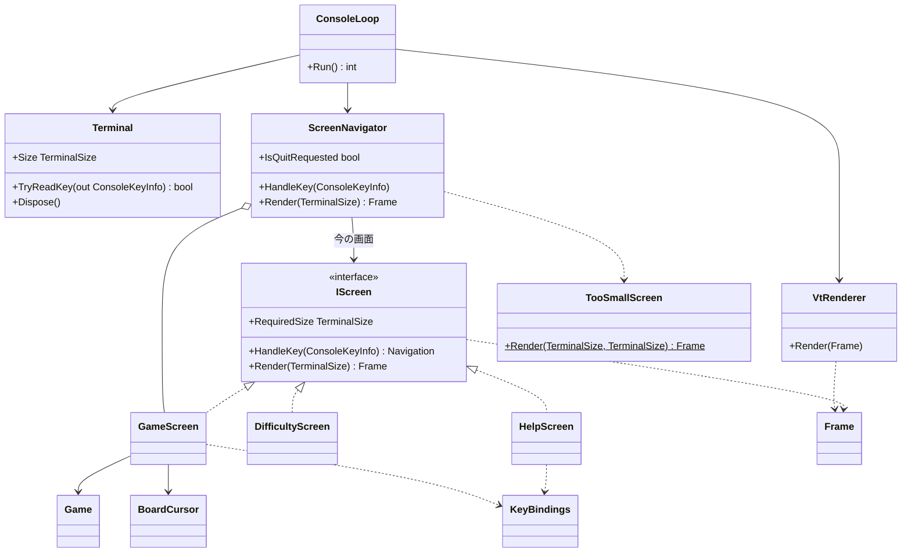

# T1: コンソール版の画面まわりの型の設計

## 0. 何を作り、何を作らないか（What）

作るもの: ゲーム・難易度の選択・ヘルプの 3 画面と、画面の行き来、「端末を大きくしてください」の画面、それを VT のシーケンスで端末に描く仕組み。画面の単位は xUnit で単体テストできるようにする。

作らないもの（詳しくは 6 章）: 差分描画、マウス入力、カスタム難易度の入力、画面の基底クラス、端末の入出力のインターフェイス。

### 置いた仮定
- A1: ゲームのルールのライブラリには、少なくとも次がある。`Difficulty`（行数・列数・地雷数。初級・中級・上級のプリセットを持つ）、`Game`（`new Game(Difficulty)`、`Open(row, column)`、`ToggleFlag(row, column)`、`State`（プレイ中・勝ち・負け）、`RemainingMines`、マスの状態を読む手段）。テストのために、地雷の配置を決めて `Game` を作る手段がある（種か配置を渡せる）。
- A2: 経過時間は `Game` が持っていないので、画面の側で開始時刻を持つ。
- A3: ヘルプと難易度の選択は、ゲームの画面から開き、閉じるとゲームの画面に戻る。ヘルプを開いている間も時計は進む（止める要求がないため）。
- A4: 難易度の選択画面はプリセットの 3 つだけを選ぶ（課題にカスタムがないため）。
- A5: Windows 11 の既定の端末（Windows Terminal）は VT のシーケンスを解釈する。古い conhost で表示が崩れたら、そのとき `SetConsoleMode` で VT を有効にする処理を `Terminal` に足す。
- A6: 画面の文言は日本語を含むので、端末上の表示幅（全角は 2 桁）で寸法を測る必要がある。
- A7: キーの割り当ては仮に次とする。矢印キーでカーソル移動、Space/Enter で開く、F で旗、D で難易度、H か ? でヘルプ、N で新しいゲーム、Esc で戻る、Q で終了。

## 1. 関心事と、それに対応する型

クラスの一覧より先に関心事を挙げ、その結果として型を決めた。

| 関心事 | 変わる理由 | 型 |
|---|---|---|
| 画面の中身（何をどこに置くか） | 画面ごとのレイアウトや文言の変更 | `GameScreen`、`DifficultyScreen`、`HelpScreen`、`TooSmallScreen` |
| 画面の共通の契約 | 画面と画面を行き来する仕組みの変更 | `IScreen`、`Navigation` |
| 画面の行き来と、端末が小さいときの判断 | 画面の遷移の仕様の変更 | `ScreenNavigator` |
| 描いた結果（端末の技術を含まない） | 表示の意味の種類の変更 | `Frame`、`FrameLine`、`Span`、`Tone`、`TerminalSize` |
| 文字の表示幅 | 全角・半角の扱いの変更 | `DisplayWidth` |
| キーと操作の対応（ヘルプの一覧も兼ねる） | キーの割り当ての変更 | `KeyBindings`、`GameCommand` |
| 盤面の上のカーソル | カーソルの動き方（端で止まるか回るか）の変更 | `BoardCursor` |
| VT のシーケンスへの変換と出力 | 色や端末の制御の方法の変更 | `VtRenderer` |
| 端末の準備と後始末、キーの読み取り、ループ | 端末の入出力の方法の変更 | `Terminal`、`ConsoleLoop` |

判断（どの画面か、何を描くか、キーで何が起きるか）を純粋な型に寄せ、端末の入出力（`Terminal`、`ConsoleLoop`、`VtRenderer` の書き込み）を薄く残す。こうすると、端末を差し替えるインターフェイスを作らずに、判断の側を xUnit で確かめられる（判断ルール 3: 判断を引数と戻り値に寄せられるなら、I/O の側は差し替えない）。

## 2. 型の関係



依存の向きは、外側（`ConsoleLoop`）から内側（画面、`Frame`、`Game`）への一方向だけである。画面は VT のシーケンスも `System.Console` も知らない。

## 3. 各型の責務と主なシグネチャ

### 3.1 描いた結果: `Frame` とその部品

画面が返すのは、端末の技術を含まない「何を描くか」である。VT のシーケンスへの変換は `VtRenderer` の 1 か所に置く。

```csharp
// 表示の意味。色やエスケープ シーケンスは VtRenderer だけが知る
public enum Tone { Normal, Title, Hidden, Revealed, Number1, Number2, Number3, Number4,
                   Number5, Number6, Number7, Number8, Flag, Mine, WrongFlag, Cursor, Hint }

public readonly record struct Span(string Text, Tone Tone = Tone.Normal);

public sealed record FrameLine(IReadOnlyList<Span> Spans)
{
    public int Width { get; }                      // DisplayWidth で測った表示幅
    public string PlainText { get; }               // テストで読むための文字だけの形
}

public sealed record Frame(IReadOnlyList<FrameLine> Lines)
{
    public IEnumerable<string> PlainLines { get; } // テスト用に、行ごとの文字だけ
}

public readonly record struct TerminalSize(int Width, int Height)
{
    public bool Contains(TerminalSize required);   // 幅も高さも足りるか
}

public static class DisplayWidth
{
    public static int Of(string text);             // 全角は 2 桁、それ以外は 1 桁
}
```

- `Frame` はデータなので、画面のテストは「どの行にどの文字が出たか」「このマスの Span の Tone は何か」を、エスケープ シーケンスを読まずに確かめられる。
- 色を直接持たせず `Tone`（意味）にしたのは、「数字 3 の色を変える」変更を `VtRenderer` の表の 1 行に閉じるためである。
- `DisplayWidth` は A6 のための型である。中央寄せと、端末が足りるかの判断が表示幅を使うので、測り方を 1 か所に置く。

### 3.2 画面の契約: `IScreen` と `Navigation`

```csharp
public interface IScreen
{
    TerminalSize RequiredSize { get; }             // この画面を描くのに要る最小の大きさ
    Navigation HandleKey(ConsoleKeyInfo key);      // キーを受けて、行き先を返す
    Frame Render(TerminalSize size);               // 今の状態を描く（size は中央寄せに使う）
}

// 画面から「次にどうしたいか」を返す。画面は他の画面を知らない
public abstract record Navigation
{
    public sealed record Stay : Navigation;
    public sealed record OpenHelp : Navigation;
    public sealed record OpenDifficulty : Navigation;
    public sealed record Back : Navigation;                         // ゲームの画面に戻る
    public sealed record StartGame(Difficulty Difficulty) : Navigation;
    public sealed record Quit : Navigation;
}
```

- インターフェイスを置いた理由: 実装がいま 3 つある（ゲーム・難易度・ヘルプ）。`ScreenNavigator` が画面の種類で `switch` して描き分ける形より、「今の画面に聞く」形の方が、描画とキーの受け取りの 2 か所に同じ分岐が育たない。多態のためのインターフェイスであって、将来への備えではない。
- 画面は遷移先の画面を作らず、`Navigation` を返すだけにした。遷移の仕様（ヘルプから戻る先はゲーム、など）を `ScreenNavigator` の 1 か所に閉じるためである。`Navigation` は `enum` でもよいが、`StartGame` が難易度を運ぶので record の階層にした。

### 3.3 `GameScreen`: ゲームの画面

ひとことで言うと「1 回のゲームを表示し、キーをゲームの操作に変えて渡す」。

```csharp
public sealed class GameScreen : IScreen
{
    public GameScreen(Game game, TimeProvider clock);

    public TerminalSize RequiredSize { get; }      // 盤面の寸法 + 見出し + 操作の案内
    public Navigation HandleKey(ConsoleKeyInfo key);
    public Frame Render(TerminalSize size);        // 見出し（残り地雷数・経過時間・勝敗）、盤面、案内
}
```

- `Game` の操作（開く、旗）は `Game` に任せる。勝敗の判定も `Game` のもので、画面は `Game.State` を問い合わせて表示するだけにする（情報を持つ者に判定を任せる）。
- 経過時間は A2 により画面が持つ。時刻は `TimeProvider`（.NET の標準の抽象クラス）で受け取る。テストでは `GetUtcNow` を上書きした小さな派生クラスで時刻を進める。時刻は判断（何秒と表示するか）から切り離せないので、ここは差し替え口を置く。
- 経過時間は最初のマスを開いたときに始め、勝ち負けが決まったら止める（仮定）。
- キーの解釈は `KeyBindings.Find(key)` に任せ、返った `GameCommand` で分岐する。

### 3.4 `KeyBindings` と `GameCommand`: キーと操作の対応

```csharp
public enum GameCommand { MoveUp, MoveDown, MoveLeft, MoveRight, Open, ToggleFlag,
                          NewGame, ShowDifficulty, ShowHelp, Quit }

public sealed record KeyBinding(ConsoleKey Key, GameCommand Command, string KeyLabel, string Description);

public static class KeyBindings
{
    public static IReadOnlyList<KeyBinding> All { get; }                // ヘルプの画面が一覧に使う
    public static GameCommand? Find(ConsoleKeyInfo key);               // ゲームの画面が使う
}
```

- 表にした理由: 「どのキーで何をするか」の知識は、ゲームの画面での分岐とヘルプの画面の一覧の 2 か所で要る。別々に書くと、キーを変えたときにヘルプが嘘をつく（Once And Only Once）。表を 1 つにすれば、キーの変更は表の 1 行で閉じる。

### 3.5 `BoardCursor`: 盤面のカーソル

```csharp
public readonly record struct BoardCursor(int Row, int Column)
{
    public BoardCursor Move(int rowDelta, int columnDelta, int rows, int columns); // 端で止まる
}
```

- 端での扱いという小さな判断があるので、`GameScreen` の中の 2 つの int にせず、名前を付けて単独でテストする。値の型にして、`GameScreen` は新しい値に置き換えるだけにする。

### 3.6 `DifficultyScreen` と `HelpScreen`

```csharp
public sealed class DifficultyScreen : IScreen
{
    public DifficultyScreen(Difficulty current);  // 今の難易度に選択を合わせて開く
    // ↑↓ で選ぶ、Enter で StartGame(選んだ難易度)、Esc で Back
}

public sealed class HelpScreen : IScreen
{
    // KeyBindings.All とルールの短い説明を描く。Esc・H・? で Back
}
```

- どちらも状態が小さい（選んでいる行だけ、または状態なし）ので、`ScreenNavigator` が開くたびに新しく作る。

### 3.7 `TooSmallScreen`: 端末が小さいときの画面

```csharp
public static class TooSmallScreen
{
    // 「端末を大きくしてください」、今の大きさ、要る大きさを描く。size に収まるように行を切る
    public static Frame Render(TerminalSize size, TerminalSize required);
}
```

- `IScreen` にはしない。キーを受けて行き先を決める画面ではなく、「今の画面が描けない」ことの表示だからである。端末が小さい間のキーは、今の画面には渡さない（見えない盤面を操作させないため）。ただし終了の Q だけは受ける（仮定）。
- 端末が極端に小さい（1 行など）ときも、例外を出さずに入る分だけを描く。

### 3.8 `ScreenNavigator`: 画面の行き来

ひとことで言うと「今の画面を決め、キーをそこに渡し、描く画面を選ぶ」。

```csharp
public sealed class ScreenNavigator
{
    public ScreenNavigator(Difficulty initial, Func<Difficulty, Game> newGame, TimeProvider clock);

    public bool IsQuitRequested { get; }
    public void HandleKey(ConsoleKeyInfo key, TerminalSize size); // 小さいときは Q 以外を捨てる
    public Frame Render(TerminalSize size);  // size が今の画面の RequiredSize に足りなければ TooSmallScreen
}
```

- `GameScreen` は持ち続け（集約）、ヘルプや難易度の画面から `Back` で戻れるようにする。`StartGame` を受けたら、`newGame` で `Game` を作り、新しい `GameScreen` に替える。
- `Func<Difficulty, Game>` を受けるのは、テストで地雷の配置を決めたゲームを渡すためである（A1）。
- 「端末が足りるか」の判断をここに置いたのは、今の画面の `RequiredSize` と端末の大きさの両方を知っているのがここだけだからである。
- これで、ループの中の判断はすべて `ScreenNavigator` の中にあり、キーの列と端末の大きさを与えて `Frame` を確かめる形でテストできる（`ConsoleKeyInfo` はテストでそのまま作れる構造体なので、キー入力の抽象は要らない）。

### 3.9 `VtRenderer`: VT のシーケンスへの変換

```csharp
public sealed class VtRenderer
{
    public VtRenderer(TextWriter output);
    public void Render(Frame frame);  // カーソルを左上へ → 各行を Tone の色で書き、行末を消す → 残りの行を消す
}
```

- `Tone` から色（SGR）への対応表と、カーソル移動・消去のシーケンスは、この型だけが持つ。
- 前回と同じ文字列なら書かない。ループは定期的に描き直すが（経過時間が進むため）、変わらないときに端末へ書かないので、ちらつきと出力を抑えられる。
- `TextWriter` を受けるので、`StringWriter` で「数字 1 の Span が青の SGR で囲まれる」などを確かめられる。ただしテストの中心は画面の `Frame` の側に置き、ここは少数にとどめる。

### 3.10 `Terminal` と `ConsoleLoop`: 端末の入出力（薄く保つ）

```csharp
public sealed class Terminal : IDisposable
{
    public static Terminal Open();                 // 代替画面に切り替え、カーソルを隠し、Ctrl+C を入力として受ける
    public TerminalSize Size { get; }              // Console.WindowWidth / WindowHeight
    public TextWriter Output { get; }
    public bool TryReadKey(out ConsoleKeyInfo key);// Console.KeyAvailable を見て、あれば読む
    public void Dispose();                         // 元の画面に戻し、カーソルを表示し、色を戻す
}

public static class ConsoleLoop
{
    public static int Run(); // using Terminal → ScreenNavigator と VtRenderer を作る
                             // → 終了まで「キーがあれば渡す → 描く → 短く待つ」を繰り返す
}
```

- `Terminal` は後始末を `Dispose` に集め、例外で抜けても端末が壊れた状態で残らないようにする（`using` で使う）。
- この 2 つは単体テストしない。判断を持たないように薄くし、Windows 11 と Linux の本物の端末で動かして確かめる（大きさを変える、Ctrl+C で抜ける、例外で抜けたときに端末が戻る）。
- 端末の大きさの変化は、ループの中で毎回 `Size` を読むだけで扱う（シグナルやイベントは使わない）。

## 4. テストの方針

| 対象 | 確かめること（例） |
|---|---|
| `GameScreen` | Space で開いたマスが数字の Span になる / F で旗の Tone になる / D で `OpenDifficulty` を返す / 時計を 5 秒進めると見出しが 005 になる / 負けたら地雷と誤った旗が表示される |
| `DifficultyScreen` | ↓ と Enter で中級の `StartGame` を返す / Esc で `Back` |
| `HelpScreen` | `KeyBindings.All` のすべてのキーの説明が描かれる |
| `ScreenNavigator` | H → ヘルプ、Esc → 元のゲームに戻り盤面が保たれる / 難易度を選ぶと新しいゲームになる / 端末が小さいと「端末を大きくしてください」が描かれ、盤面へのキーが無視される / Q で `IsQuitRequested` |
| `TooSmallScreen` | 要る大きさが文言に出る / 1×1 でも例外にならない |
| `BoardCursor`、`DisplayWidth`、`KeyBindings` | 端で止まる / 全角が 2 桁 / 割り当ての重複がない |
| `VtRenderer` | 同じ `Frame` の 2 回目は何も書かない / Tone の色の SGR（少数） |

ゲームのルールそのもの（勝敗、連鎖して開く）は、テスト済みのライブラリの責務なので、画面のテストでは繰り返さない。

## 5. 設計の理由（捨てた案とのトレードオフ）

- **画面が文字列を直接返す案を捨てた**: 画面が VT のシーケンス入りの文字列を返すと、テストがエスケープ シーケンスを読むことになり、色を変えるだけで画面のテストが壊れる。`Frame` と `Tone` を挟んで、「何を描くか」と「どう端末に書くか」を分けた。
- **端末の入出力のインターフェイス（`ITerminal`）を捨てた**: 判断を `ScreenNavigator` と画面に寄せたので、ループに残るのは読む・書く・待つだけになる。差し替え口を置いても、テストしたい判断がそこにない。
- **画面の種類で `switch` する案を捨てた**: 描画・キー処理・要る大きさの 3 か所に同じ分岐が並ぶ。実装が 3 つあるので `IScreen` の多態にした。
- **画面が次の画面を作る案を捨てた**: 画面どうしが互いを知り、遷移の仕様が 3 か所に散る。`Navigation` を返させ、遷移は `ScreenNavigator` に集めた。

## 6. 作らないことにしたもの

- **差分描画（変わったマスだけを書く）**: 毎回の全体描画と「前回と同じなら書かない」で足りる見込み。上級の盤面でちらつきが実際に見えたら、`VtRenderer` の中だけで入れる（画面の側は変わらない）。
- **画面の基底クラス**: 3 つの画面に共通の処理（中央寄せなど）は、`Frame` を作る静的な補助のメソッドで共有する。再利用のためだけの継承はしない。
- **マウス入力**: 要求にない。
- **カスタム難易度の入力画面**: 課題の 3 画面に含まれない（A4）。要るときは `DifficultyScreen` に行を足し、入力の画面を `IScreen` として足す。`ScreenNavigator` の変更は `Navigation` の 1 種類の追加で済む。
- **終了の確認、一時停止、色なしの表示の切り替え、ベストタイム**: 要求にない。
- **キーの割り当ての設定ファイル**: 要求にない。`KeyBindings` の表で足りる。
- **端末の大きさの変化のイベント**: ループで毎回読めば足りる。

## 7. ユーザーの判断が要る点

- ヘルプや難易度の画面を開いている間に、経過時間を止めるか（A3。いまは止めない）。
- 端末が小さい間に受けるキーを Q だけにしてよいか。
- Windows の古い conhost に対応するか（A5）。対応するなら `Terminal.Open` に VT を有効にする処理が要る。
