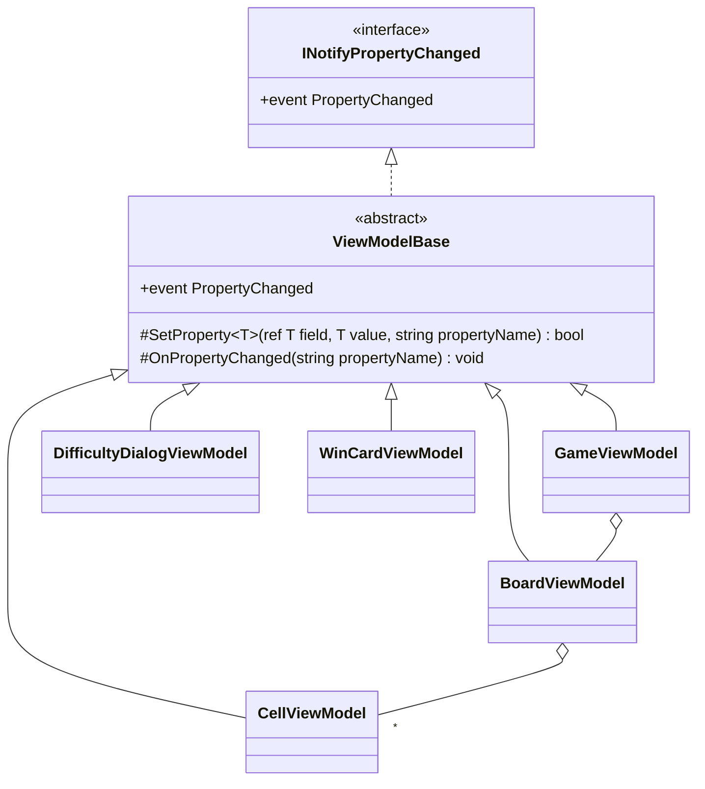

# T2 ビューモデルの変化の通知の設計

## 1. 仮定

- ビューモデルは UI スレッドだけで変わる（経過時間は Avalonia の `DispatcherTimer` で進め、UI スレッドで更新する）。別のスレッドから通知することは考えない。
- ゲームの状態の本体（盤面、マスの状態、経過時間など）はビューモデルの外のモデル（ゲームの進め方のクラス）が持ち、ビューモデルはそれを表示用の形にして View に見せる。値をビューモデル自身が持つプロパティ（ダイアログの入力欄、押下中の見た目など）と、モデルの値をそのまま見せるプロパティの二種類がある。
- View の束縛は Avalonia のコンパイル済みの束縛（`x:DataType`）を使い、`INotifyPropertyChanged` の `PropertyChanged` でプロパティ名を指定して知らせれば足りる。
- 盤面のマスの数は難易度を変えたときだけ変わる（最大でも数百）。

## 2. 決めたこと（要約）

1. 抽象クラス `ViewModelBase` を 1 つ作り、5 つのビューモデルはそれを継承する。`INotifyPropertyChanged` の実装はここだけに置く。
2. `ViewModelBase` が持つのは、次の 2 つの `protected` メソッドだけにする。
   - `SetProperty<T>(ref T field, T value, [CallerMemberName] string? propertyName = null)` : 値が変わったときだけ代入して知らせ、変わったかどうかを `bool` で返す。
   - `OnPropertyChanged([CallerMemberName] string? propertyName = null)` : 名前を指定して知らせる。
3. プロパティの種類ごとの書き方を一つに決める。

| プロパティの種類 | 書き方 |
|------------------|--------|
| ビューモデルが値を持つ（入力欄、押下中など） | バッキング フィールド + `SetProperty` |
| 他のプロパティから計算する（表示の文字列、可否など） | 計算だけの get-only プロパティ。元のプロパティが変わったところで `OnPropertyChanged(nameof(計算のプロパティ))` を明示的に呼ぶ |
| モデルの値をそのまま見せる | get-only プロパティ。モデルを変えた操作の後に `OnPropertyChanged(nameof(...))` を呼ぶ |
| 要素が入れ替わるコレクション（盤面のマスの並び） | 難易度を変えたら、リストごと作り直して、そのプロパティの変化として知らせる（`ObservableCollection` は使わない） |

4. 使わないもの: MVVM の支援ライブラリ（決定どおり）、属性や式木による依存関係の自動の通知、`PropertyChangedEventArgs` のキャッシュ、プロパティ名を空にした「全部変わった」の通知、スレッドの切り替え。

## 3. 型の構成



- `GameViewModel` は `BoardViewModel` を持ち、`BoardViewModel` は `CellViewModel` の並びを持つ。子のビューモデルの変化は子自身が知らせるので、親が子の変化を中継することはしない。
- `DifficultyDialogViewModel` と `WinCardViewModel` は、ダイアログ・カードを開くたびに作る（閉じたら捨てる）。

## 4. コード

### 4.1 基底クラス

```csharp
using System.Collections.Generic;
using System.ComponentModel;
using System.Runtime.CompilerServices;

namespace Shos.Minesweeper.Desktop.ViewModels;

/// <summary>ビューモデルの共通の基底。プロパティの変化を View に知らせる。</summary>
public abstract class ViewModelBase : INotifyPropertyChanged
{
    public event PropertyChangedEventHandler? PropertyChanged;

    /// <summary>値が変わったときだけ代入して知らせる。</summary>
    /// <returns>値が変わったら true。計算のプロパティをあわせて知らせるときに使う。</returns>
    protected bool SetProperty<T>(ref T field, T value, [CallerMemberName] string? propertyName = null)
    {
        if (EqualityComparer<T>.Default.Equals(field, value))
            return false;

        field = value;
        OnPropertyChanged(propertyName);
        return true;
    }

    protected void OnPropertyChanged([CallerMemberName] string? propertyName = null)
        => PropertyChanged?.Invoke(this, new PropertyChangedEventArgs(propertyName));
}
```

### 4.2 例: `DifficultyDialogViewModel`（プロパティ 2 つ）

ビューモデルが値を持つプロパティ（`WidthText`）と、それから計算するプロパティ（`CanAccept`）の例である。

```csharp
namespace Shos.Minesweeper.Desktop.ViewModels;

public sealed class DifficultyDialogViewModel : ViewModelBase
{
    string widthText = "";

    /// <summary>カスタムの幅の入力欄。</summary>
    public string WidthText
    {
        get => widthText;
        set
        {
            if (SetProperty(ref widthText, value))
                OnPropertyChanged(nameof(CanAccept));
        }
    }

    /// <summary>決定のボタンを押せるか。入力が正しい数のときだけ押せる。</summary>
    public bool CanAccept => int.TryParse(WidthText.Trim(), out var width) && width is >= 9 and <= 30;
}
```

（幅の範囲 9〜30 は例として置いた値である。実際には仕様の定数を参照する。）

### 4.3 参考: モデルの値を見せるプロパティ（`CellViewModel`）

```csharp
public sealed class CellViewModel : ViewModelBase
{
    readonly Cell cell;   // モデルのマス

    public CellViewModel(Cell cell) => this.cell = cell;

    public string Label => cell.IsOpen ? (cell.AdjacentMines > 0 ? cell.AdjacentMines.ToString() : "") : (cell.IsFlagged ? "🚩" : "");

    /// <summary>モデルのマスが変わった後に、盤面から呼ばれる。</summary>
    public void Refresh() => OnPropertyChanged(nameof(Label));
}
```

`BoardViewModel` は、1 回の操作の結果で変わったマスについてだけ `Refresh()` を呼ぶ（変わったマスの一覧はモデルの操作の結果から得る。得られない場合は全部のマスを呼んでも数百回で足りる）。

## 5. 理由

1. **基底クラスに 1 つだけ置く**: 5 つのビューモデルが同じ `PropertyChanged` と「値が変わったときだけ知らせる」処理を持つので、各クラスに書くと 5 か所の重複になる。等しさの判定を忘れて余計な通知を出す、名前を書き間違える、といった誤りを 1 か所で防げる。ビューモデルはほかの基底クラスを必要としないので、継承の枠を使っても困らない。
2. **`SetProperty` と `OnPropertyChanged` の 2 つだけ**: 支援ライブラリを使わないと決めた以上、自前の部品は小さく保つ。この 2 つで、値を持つプロパティ・計算のプロパティ・モデルを見せるプロパティのすべてが書ける。コマンドや検証（`INotifyDataErrorInfo`）などは、要るとわかったときに足す。
3. **`[CallerMemberName]` と `nameof`**: プロパティ名を文字列で書かないので、名前の変更に強く、書き間違いがコンパイルで見つかる。
4. **計算のプロパティは明示的に知らせる**: 依存関係を属性などで宣言する仕組みは、5 つのビューモデルの規模では作る手間と読む手間に見合わない。「元のプロパティの set の中で、依存するプロパティを知らせる」と決めておけば、どのプロパティがどれに依存するかが set を読めばわかる。`SetProperty` が `bool` を返すのは、値が変わらなかったときに依存するプロパティまで知らせないためである。
5. **コレクションは作り直して知らせる**: マスの並びが変わるのは難易度を変えたときだけで、そのときは全部のマスが変わる。`ObservableCollection` の追加・削除の通知は、この使い方では役に立たず、1 マスずつ通知が出て遅くなる。個々のマスの変化は `CellViewModel` 自身が知らせる。
6. **スレッドとキャッシュを扱わない**: 仮定のとおり UI スレッドだけで変わるので、ディスパッチの処理は要らない。`PropertyChangedEventArgs` を毎回作る割り当ては、マスが数百の規模では問題にならない（遅いとわかってから測って直す）。
7. **テストできる**: どのビューモデルも `PropertyChanged` を購読するだけで、Avalonia を起動せずに xUnit で「どの操作でどのプロパティが知らされたか」を確かめられる。例:

```csharp
[Fact]
public void ChangingWidthTextNotifiesCanAccept()
{
    var viewModel = new DifficultyDialogViewModel();
    var changed = new List<string?>();
    viewModel.PropertyChanged += (_, e) => changed.Add(e.PropertyName);

    viewModel.WidthText = "16";

    Assert.Equal([nameof(DifficultyDialogViewModel.WidthText), nameof(DifficultyDialogViewModel.CanAccept)], changed);
}

[Fact]
public void SettingTheSameValueDoesNotNotify()
{
    var viewModel = new DifficultyDialogViewModel { WidthText = "16" };
    var notified = false;
    viewModel.PropertyChanged += (_, _) => notified = true;

    viewModel.WidthText = "16";

    Assert.False(notified);
}
```

## 6. 見送った案

| 案 | 見送った理由 |
|----|--------------|
| 各ビューモデルに `INotifyPropertyChanged` を直接実装する | 5 か所に同じコードが重複し、等しさの判定などの誤りが散らばる |
| インターフェイスと拡張メソッドで共通にする | `PropertyChanged` のイベントは宣言したクラスの中からしか発火できないので、結局各クラスに発火の処理が要る |
| 依存関係を属性で宣言して自動で知らせる | 規模に対して仕組みが大きい。支援ライブラリを使わない方針とも合わない |
| `OnPropertyChanged(string.Empty)` でまとめて知らせる | 何が変わったかがテストで確かめられず、関係のない束縛まで評価し直す |
| 盤面を `ObservableCollection<CellViewModel>` にする | 上の理由 5 のとおり |
