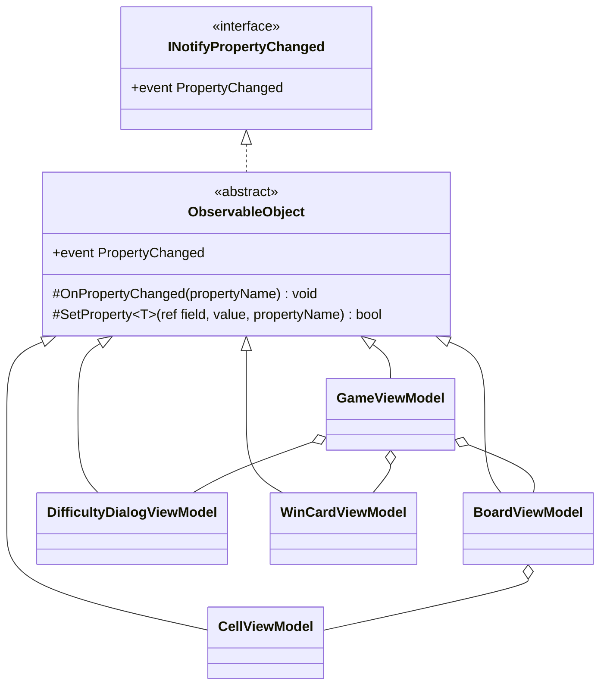

# 課題 T2: ビューモデルの変化の通知の設計

## 1. 仮定

- .NET 10、C# 14 を使う（プロパティの中で `field` キーワードが使える）。
- 5 つのビューモデルは、どれもほかの基底クラスを継承する必要がない（Avalonia の型を継承しない、ただの C# のクラスにする）。
- ビューモデルのプロパティは UI スレッドで変える（経過時間は Avalonia の `DispatcherTimer` で進めるので、UI スレッドで動く）。通知の仕組みはスレッドの切り替えをしない。
- 盤面のマスの数は、ゲームの途中では変わらない。難易度を変えたときだけ、マスの並びを作り直す。

## 2. 結論

通知の書き方を、抽象の基底クラス `ObservableObject` の 1 か所にまとめ、5 つのビューモデルはそれを継承する。

- 値を持つプロパティは、`set => SetProperty(ref field, value);` の 1 行で書く。値が変わったときだけ通知する。
- 他の値から計算するプロパティ（表示の文字列など）は、計算のもとのプロパティの `SetProperty` が `true` を返したときに `OnPropertyChanged(nameof(...))` で知らせる。
- プロパティ名は文字列で書かない（`[CallerMemberName]` と `nameof` を使う）。
- マスの並びのような集まりは、ゲームの途中では要素が増減しないので `ObservableCollection` にしない。難易度を変えたときに、並びを新しく作ってプロパティごと差し替え、そのプロパティの変化を知らせる。

## 3. 型の構成



| 型 | 役割 |
|----|------|
| `ObservableObject`（抽象クラス） | `INotifyPropertyChanged` を実装し、通知の出し方（`OnPropertyChanged`）と、「値を比べて、変わっていたら代入して通知する」（`SetProperty`）を持つ。ビューモデルの知識は持たない |
| 5 つのビューモデル | `ObservableObject` を継承し、自分のプロパティで `SetProperty` と `OnPropertyChanged` を呼ぶだけにする |

置き場所はデスクトップ版のプロジェクト（例: `Shos.Minesweeper.Desktop` の `ViewModels` フォルダー）とする。`INotifyPropertyChanged` は UI の技術に依存しないが、今これを使うのはデスクトップ版だけなので、共有のプロジェクトには置かない。コンソール版などで要るようになったら移す。

## 4. コード

### 4.1 基底クラス

```csharp
using System.Collections.Generic;
using System.ComponentModel;
using System.Runtime.CompilerServices;

namespace Shos.Minesweeper.Desktop.ViewModels;

/// <summary>プロパティの変化を View に知らせるビューモデルの共通の部分。</summary>
public abstract class ObservableObject : INotifyPropertyChanged
{
    public event PropertyChangedEventHandler? PropertyChanged;

    /// <summary>プロパティが変わったことを知らせる。</summary>
    protected void OnPropertyChanged([CallerMemberName] string? propertyName = null)
        => PropertyChanged?.Invoke(this, new PropertyChangedEventArgs(propertyName));

    /// <summary>
    /// 値が変わったときだけ、代入して知らせる。
    /// </summary>
    /// <returns>値が変わったら true。計算で求めるプロパティの通知に使う。</returns>
    protected bool SetProperty<T>(ref T field, T value, [CallerMemberName] string? propertyName = null)
    {
        if (EqualityComparer<T>.Default.Equals(field, value))
            return false;

        field = value;
        OnPropertyChanged(propertyName);
        return true;
    }
}
```

### 4.2 ビューモデルの例（`GameViewModel` の一部）

経過時間（値を持つプロパティ）と、その表示の文字列（計算で求めるプロパティ）の 2 つ。

```csharp
namespace Shos.Minesweeper.Desktop.ViewModels;

public sealed class GameViewModel : ObservableObject
{
    const int MaxDisplayedSeconds = 999;

    /// <summary>経過時間（秒）。タイマーから 1 秒ごとに設定される。</summary>
    public int ElapsedSeconds
    {
        get;
        private set
        {
            if (SetProperty(ref field, value))
                OnPropertyChanged(nameof(ElapsedText));
        }
    }

    /// <summary>画面に出す経過時間。999 で止める。</summary>
    public string ElapsedText => Math.Min(ElapsedSeconds, MaxDisplayedSeconds).ToString("000");

    // 例: DispatcherTimer の Tick から呼ぶ
    void OnTimerTick() => ElapsedSeconds++;

    // ... 残り地雷数、BoardViewModel、ダイアログや勝利カードの表示の有無などは同じ形で書く
}
```

計算で求めるプロパティが増えても、どの値に左右されるかは、もとのプロパティの `set` を読めばわかる。

### 4.3 通知のテスト（xUnit）

通知の仕組みは Avalonia を起動せずに確かめられる。

```csharp
[Fact]
public void ChangingElapsedSecondsNotifiesElapsedText()
{
    var game = CreateGameViewModel();
    var changed = new List<string?>();
    game.PropertyChanged += (_, e) => changed.Add(e.PropertyName);

    game.Tick();   // テストから進める入口（タイマーを差し替える口、など）

    Assert.Equal([nameof(GameViewModel.ElapsedSeconds), nameof(GameViewModel.ElapsedText)], changed);
}

[Fact]
public void SettingTheSameValueDoesNotNotify() { /* 同じ値を設定しても PropertyChanged が起きないこと */ }
```

## 5. そう決めた理由

### 5.1 基底クラスに 1 か所でまとめる（5 か所に書かない）

- 通知の決まり（「値が変わったときだけ知らせる」「名前は `CallerMemberName` で取る」）は 5 つのビューモデルで同じである。各クラスに `PropertyChanged` のイベントと比べて通知する処理を書くと、同じ処理が 5 回重なり、どれか 1 つだけ比べ忘れる、といった食い違いが起きうる。1 か所にあれば、決まりを変えるのも確かめるのも 1 か所で済む。
- 5 つのビューモデルは他の基底クラスを持たないので、単一継承の枠を使ってしまう不都合がない。
- インターフェースの既定の実装や拡張メソッドでは、イベントを起こすこと（`PropertyChanged?.Invoke`）がクラスの外からできないので、基底クラスが最も素直である。

### 5.2 `SetProperty` で「変わったときだけ」知らせる

- 同じ値の代入で通知が出ると、View が不要に描き直す。盤面のマスは上級で 480 あり、1 手ごとに全マスを更新し直す書き方をしても、変わったマスだけが通知を出すので、ビューモデルの側で差分を管理しなくてよい。
- 戻り値の `bool` で、計算で求めるプロパティ（`ElapsedText` など）の通知を、もとの値が変わったときだけに絞れる。

### 5.3 `field` キーワードを使う

- C# 14 の `field` で、裏の変数（`_elapsedSeconds`）を宣言しなくてよい。プロパティごとの行数が減り、名前の付け違い（別のプロパティの裏の変数に書くなど）も起きない。

### 5.4 名前を文字列で書かない

- `[CallerMemberName]` と `nameof` を使えば、プロパティ名を変えたときにコンパイラーが追いかける。文字列だと、名前を変えた後も通知が古い名前で出て、画面だけが更新されない、という気づきにくい不具合になる。

### 5.5 集まりは `ObservableCollection` にしない

- マスの並びはゲームの途中で増減せず、各マスの状態の変化は `CellViewModel` の通知で伝わる。増減の通知の仕組みを持ち込む理由がない。難易度の変更で数が変わるときは、並びを作り直して `BoardViewModel` のプロパティを差し替える（`SetProperty` で通知される）。1 つずつ足すより、差し替える方が通知の回数も少ない。

### 5.6 採らなかった案

| 案 | 採らなかった理由 |
|----|------------------|
| CommunityToolkit.Mvvm などのライブラリ | 使わないと決めている（課題の前提）。必要なのは上の十数行だけである |
| 自作のソースジェネレーター | 5 つのクラス、十数のプロパティのために、ビルドの仕組みを増やすのは見合わない |
| 各ビューモデルに通知を個別に実装する | 5.1 のとおり、同じ処理が 5 回重なる |
| 通知の生成を速くするため `PropertyChangedEventArgs` をキャッシュする | 通知の回数は 1 手でたかだか数百で、速さの問題は見えていない。必要が測れてから考える |
| `OnPropertyChanged(string.Empty)`（すべてのプロパティが変わった）で一括して知らせる | どのプロパティが変わるかがわからなくなり、テストで確かめにくい。ビューの側がすべてを読み直すので無駄も多い。変わった名前を個別に知らせる |
| 基底クラスで UI スレッドへ切り替える | タイマーは `DispatcherTimer` で UI スレッドで動くので要らない（仮定）。背景のスレッドから変える必要が出たら、呼ぶ側で `Dispatcher.UIThread.Post` を使う |
