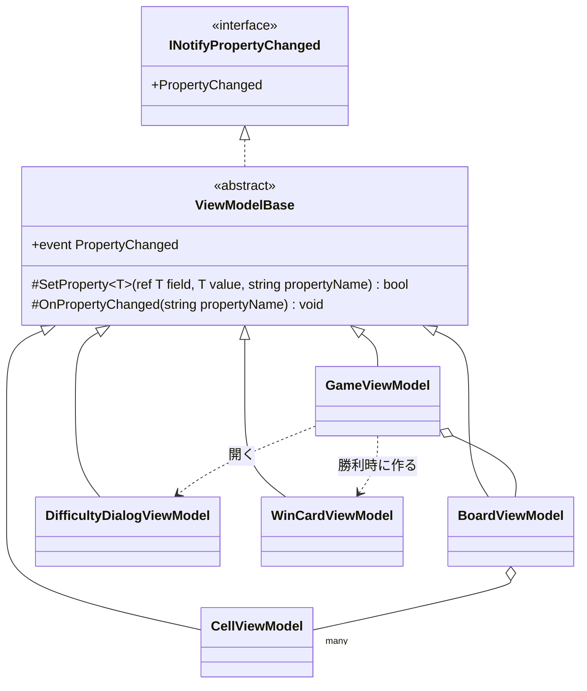

# T2: ビューモデルの変化の通知の設計

## 1. 結論

- 変化の通知は、抽象の基底クラス `ViewModelBase` の 1 か所に置く。5 つのビューモデルはこれを継承する。
- `ViewModelBase` が持つのは 2 つのメソッドだけにする。
  - `SetProperty<T>(ref T field, T value, [CallerMemberName] string? propertyName = null)`: 値が変わったときだけ、フィールドを書き換えて通知する。変わったかどうかを `bool` で返す。
  - `OnPropertyChanged(string propertyName)`: 計算で求めるプロパティ（他のプロパティから決まるもの）の通知に使う。
- 計算で求めるプロパティは、もとのプロパティの setter で、`SetProperty` が `true` を返したときに `OnPropertyChanged(nameof(...))` で明示して通知する。依存を属性や表で宣言する仕組みは作らない。
- 名前を空文字列や `null` にした「すべて変わった」の通知は使わない。

## 2. 型の構成



- 置き場所はデスクトップ版のプロジェクト（例: `Shos.Minesweeper.Desktop` の `ViewModels` フォルダー）。コンソール版は `INotifyPropertyChanged` を使わず、Web 版（Blazor）も使わないので、共有のプロジェクト（Presentation）には置かない。使うのが 1 つのアプリだけのうちは、そのアプリの中に置く。
- `ViewModelBase` はデータを何も持たない。コマンド（`ICommand` の実装）は通知とは別の関心なので、このクラスに入れない。

## 3. コード

### 3.1 基底クラス

```csharp
using System.ComponentModel;
using System.Runtime.CompilerServices;

namespace Shos.Minesweeper.Desktop.ViewModels;

/// <summary>プロパティの変化を View に知らせるビューモデルの基底クラス。</summary>
public abstract class ViewModelBase : INotifyPropertyChanged
{
    public event PropertyChangedEventHandler? PropertyChanged;

    /// <summary>値が変わったときだけ、フィールドを書き換えて通知する。</summary>
    /// <returns>値が変わったら true。</returns>
    protected bool SetProperty<T>(ref T field, T value, [CallerMemberName] string? propertyName = null)
    {
        if (EqualityComparer<T>.Default.Equals(field, value))
            return false;

        field = value;
        OnPropertyChanged(propertyName!);
        return true;
    }

    /// <summary>計算で求めるプロパティなど、setter を持たないプロパティの変化を知らせる。</summary>
    protected void OnPropertyChanged(string propertyName)
        => PropertyChanged?.Invoke(this, new PropertyChangedEventArgs(propertyName));
}
```

### 3.2 例: `GameViewModel`（残り地雷数と、その表示の文字列）

```csharp
namespace Shos.Minesweeper.Desktop.ViewModels;

public sealed class GameViewModel : ViewModelBase
{
    int remainingMines;

    /// <summary>残り地雷数（地雷の数 − 旗の数。負になりうる）。</summary>
    public int RemainingMines
    {
        get => remainingMines;
        private set
        {
            if (SetProperty(ref remainingMines, value))
                OnPropertyChanged(nameof(RemainingMinesText));
        }
    }

    /// <summary>画面に出す残り地雷数（3 桁。負のときは符号を付ける）。</summary>
    public string RemainingMinesText => RemainingMines < 0 ? $"-{-RemainingMines:00}" : $"{RemainingMines:000}";

    // 操作の後に、ゲームの状態からビューモデルを写し直す。
    // 変わっていない値は SetProperty が通知しないので、全部を写し直してよい。
    void Refresh() => RemainingMines = session.RemainingMines;

    // (session などの他のメンバーは省略)
}
```

### 3.3 通知のテスト（xUnit。Avalonia を起動しない）

```csharp
[Fact]
public void 旗を立てると残り地雷数とその文字列の変化が通知される()
{
    var viewModel = CreateGameViewModel(/* 盤面を決めたゲーム */);
    var changed = new List<string?>();
    viewModel.PropertyChanged += (_, e) => changed.Add(e.PropertyName);

    viewModel.ToggleFlag(row: 0, column: 0);

    Assert.Equal([nameof(GameViewModel.RemainingMines), nameof(GameViewModel.RemainingMinesText)], changed);
}
```

## 4. そう決めた理由

1. **重複を 1 か所にまとめる**: 5 つのビューモデルがそれぞれ `INotifyPropertyChanged` を実装すると、「イベントの宣言・値の比較・書き換え・通知」の同じ手順が 5 回書かれ、比較の忘れや名前の書き誤りが入りやすい。C# では実装を共有する手段として基底クラスが最も単純で、5 つのビューモデルはどれも他のクラスを継承する必要がないので、単一継承の制約も問題にならない。
2. **支援ライブラリを使わない決定と矛盾しない最小の形**: CommunityToolkit.Mvvm の `ObservableObject` に当たるものを、必要な 2 メソッドだけ自分で持つ。20 行ほどで済み、ソース ジェネレーターや IL の書き換え（Fody など）を足すより、読む人に隠れた仕組みがない。
3. **名前の書き誤りを防ぐ**: `[CallerMemberName]` で setter の中のプロパティ名をコンパイラーに入れさせ、計算で求めるプロパティは `nameof` で書く。文字列のリテラルでプロパティ名を書く箇所がなくなる。
4. **変わったときだけ通知する**: 上級の盤面は 480 マス、カスタムはそれ以上になる。操作のたびにゲームの状態から全マスの `CellViewModel` を写し直しても、`SetProperty` が等しい値を捨てるので、通知と再描画は実際に変わったマスだけで起きる。ビューモデルの側で「どのマスが変わったか」を追う仕組みを持たずに済み、写し直しの処理を単純に保てる。
5. **依存は明示して書く**: 計算で求めるプロパティ（残り地雷数の文字列、経過時間の文字列、マスの見た目の種類など）は数が少なく、もとのプロパティの近くに書けば見える。依存を宣言する属性や表を作るのは、この規模では仕組みの方が大きくなる。`SetProperty` が `bool` を返すのは、この連鎖を「変わったときだけ」にするためである。
6. **「すべて変わった」を使わない**: 名前が空の通知は、View がすべてのバインディングを評価し直すので、変わった範囲がわからなくなり、テストでも何が変わったのかを確かめられない。盤面の大きさが変わる（難易度の変更）ときは、`BoardViewModel` のマスの一覧（`Cells`）と行数・列数を、名前を付けて通知する。
7. **テストしやすい**: 通知は `PropertyChanged` を購読するだけで確かめられ、Avalonia を起動せずに xUnit で書ける（3.3）。

## 5. 置いた仮定と、決めなかったこと

- 仮定: ビューモデルは UI のスレッドだけで書き換える。経過時間は Avalonia の `DispatcherTimer`（UI のスレッドで動く）で進める。そのため、`ViewModelBase` はスレッドの切り替え（`Dispatcher.UIThread.Post`）をしない。別のスレッドから書き換える必要が出たら、その呼び出し側で UI のスレッドに移す。
- 仮定: ゲームの状態は、共有の部品（ゲームのルールと 1 回のゲームの進め方）が持ち、ビューモデルはそれを表示のために写すだけである。ビューモデルが状態の正本を持たないので、`Refresh` で写し直す形にした。
- 仮定: マスの一覧は、難易度が変わったときに作り直して丸ごと差し替える（`Cells` プロパティの変化として通知する）。1 マスずつの追加・削除はないので、`ObservableCollection` の変化の通知（`INotifyCollectionChanged`）は使わず、`IReadOnlyList<CellViewModel>` で足りる。
- 決めなかったこと: `PropertyChangedEventArgs` をプロパティごとに使い回す（割り当てを減らす）ことはしない。1 回の操作で変わるマスの数は多くても盤面の大きさ程度で、割り当ての費用が問題になると示すものがない。測って遅いとわかったら、基底クラスの中だけで変えられる。
- 決めなかったこと: `OnPropertyChanged` を `virtual` にしない。派生クラスで通知に割り込む必要がいまはない。
