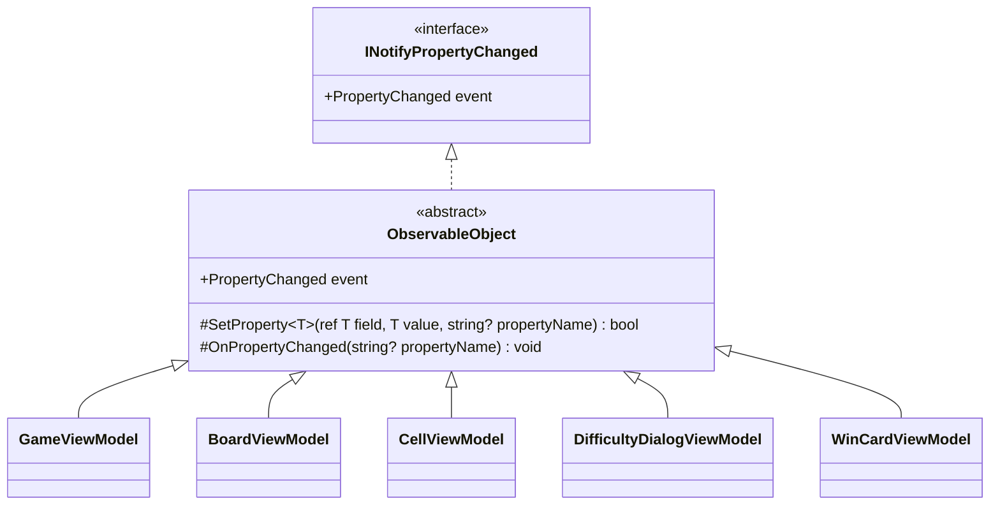

# 課題 T2: ビューモデルの変化の通知の設計

## 1. 結論

- 変化の通知は、自前の小さな抽象クラス `ObservableObject` の 1 か所にまとめる。5 つのビューモデルはこれを継承する。
- `ObservableObject` が持つのは次の 2 つのメソッドだけにする。
  - `SetProperty<T>(ref T field, T value, [CallerMemberName] string? propertyName = null)`: 値が変わったときだけ代入して通知し、変わったかどうかを `bool` で返す。
  - `OnPropertyChanged([CallerMemberName] string? propertyName = null)`: 通知だけをする。ほかのプロパティから計算するプロパティ（派生プロパティ）を知らせるのに使う。
- プロパティは C# 14（.NET 10）の `field` キーワードで書き、裏のフィールドを宣言しない。
- 派生プロパティは値を持たず、元のプロパティの setter で `SetProperty` が `true` を返したときに `OnPropertyChanged(nameof(派生))` で知らせる。
- `ObservableObject` は Avalonia に依存しない（`System.ComponentModel` だけを使う）。ビューモデルを Avalonia を起動せずに xUnit で確かめられるようにするため。

## 2. 型の構成



- 置き場所: デスクトップ版のプロジェクトの `ViewModels` フォルダー（名前空間 `Shos.Minesweeper.Desktop.ViewModels`）。`internal` にする。
- 共有の部品（Presentation）には置かない。MVVM で作るのはデスクトップ版だけで、Web 版（Blazor）とコンソール版は `INotifyPropertyChanged` を使わないため。使う版が 2 つになったら移す。
- 盤面のマスの並びの変化（難易度を変えてマスの数が変わるとき）は、`BoardViewModel` が `IReadOnlyList<CellViewModel> Cells` を新しいリストに差し替えて `Cells` の変化を知らせる。`ObservableCollection` は使わない。マスの数が変わるのは新しいゲームを始めるときだけで、1 つずつ足し引きする操作がないため。

## 3. コード

### 3.1 基底クラス

```csharp
using System.Collections.Generic;
using System.ComponentModel;
using System.Runtime.CompilerServices;

namespace Shos.Minesweeper.Desktop.ViewModels;

/// <summary>プロパティの変化を View に知らせるビューモデルの基底。</summary>
internal abstract class ObservableObject : INotifyPropertyChanged
{
    public event PropertyChangedEventHandler? PropertyChanged;

    /// <summary>値が変わったときだけ代入して知らせる。変わったら true を返す。</summary>
    protected bool SetProperty<T>(ref T field, T value, [CallerMemberName] string? propertyName = null)
    {
        if (EqualityComparer<T>.Default.Equals(field, value))
            return false;

        field = value;
        OnPropertyChanged(propertyName);
        return true;
    }

    protected void OnPropertyChanged([CallerMemberName] string? propertyName = null)
        => PropertyChanged?.Invoke(this, new PropertyChangedEventArgs(propertyName));
}
```

### 3.2 ビューモデルの例（`CellViewModel`）

元のプロパティ `State` と、それから計算する派生プロパティ `Text` の 2 つを示す（`CellDisplayState` はマスの見た目の状態を表す列挙型、`CellText.Of` はその文字を返す関数とする。どちらも仮定）。

```csharp
namespace Shos.Minesweeper.Desktop.ViewModels;

/// <summary>盤面の 1 マス。</summary>
internal sealed class CellViewModel : ObservableObject
{
    public CellViewModel(int column, int row) => (Column, Row) = (column, row);

    public int Column { get; }   // 変わらない値は通知しない
    public int Row    { get; }

    public CellDisplayState State
    {
        get;
        set
        {
            if (SetProperty(ref field, value))
                OnPropertyChanged(nameof(Text));
        }
    }

    /// <summary>マスに出す文字。State から決まるので値を持たない。</summary>
    public string Text => CellText.Of(State);
}
```

ほかのビューモデルも同じ形で書く。例えば `GameViewModel` の経過時間は `public int ElapsedSeconds { get; set => SetProperty(ref field, value); }` の 1 行になる。

### 3.3 テストの例（xUnit）

```csharp
public class CellViewModelTests
{
    [Fact]
    public void ChangingStateNotifiesStateAndText()
    {
        var cell = new CellViewModel(0, 0);
        var changed = new List<string?>();
        cell.PropertyChanged += (_, e) => changed.Add(e.PropertyName);

        cell.State = CellDisplayState.Flagged;

        Assert.Equal([nameof(CellViewModel.State), nameof(CellViewModel.Text)], changed);
    }

    [Fact]
    public void SettingTheSameStateNotifiesNothing()
    {
        var cell = new CellViewModel(0, 0) { State = CellDisplayState.Flagged };
        var changed = new List<string?>();
        cell.PropertyChanged += (_, e) => changed.Add(e.PropertyName);

        cell.State = CellDisplayState.Flagged;

        Assert.Empty(changed);
    }
}
```

## 4. 理由

1. **重複をなくす**: `PropertyChanged` のイベントと発火の処理を 5 つのビューモデルにそれぞれ書くと、同じ数行が 5 回重なり、直すときに 5 か所を揃える必要が出る。基底の 1 か所にまとめれば、各ビューモデルは「何が変わるか」だけを書けばよい。
2. **名前の書き間違いをなくす**: `[CallerMemberName]` で、プロパティ名をコンパイラーに埋めさせる。派生プロパティも `nameof` で書くので、名前を変えたときに文字列だけが古いまま残ることがない。
3. **無駄な通知をしない**: `SetProperty` は値が同じなら通知しない。上級の盤面（30×16 = 480 マス）や大きなカスタムの盤面で、ゲームの状態からマスを全部書き直しても、実際に変わったマスだけが View を更新する。ビューモデルの側で「変わったマスだけを探す」処理を書かずに済む。
4. **派生プロパティを明示する**: 派生プロパティは値を持たず、元の setter で知らせる。どのプロパティがどれに依存するかが setter を読めばわかり、値を二重に持って食い違うこともない。
5. **`field` キーワード**: .NET 10（C# 14）で使える。裏のフィールドの宣言と名前付けが要らず、プロパティが 1 か所で完結する。
6. **ライブラリも Avalonia も使わない**: 支援ライブラリを使わない決定に従う。また、Avalonia の `AvaloniaObject`（`StyledProperty`）や `ReactiveObject` を基底にすると、ビューモデルが UI のフレームワークに縛られ、テストで Avalonia を起動する必要が出る。`System.ComponentModel` だけなら xUnit で直接確かめられる。
7. **引き算（入れなかったもの）**:
   - `PropertyChangedEventArgs` のキャッシュ: 通知の数は人の操作の速さで決まり、負荷にならない。測って問題が出たら入れる。
   - 依存関係を属性で宣言する仕組み（`[DependsOn]` など）: 派生プロパティは数個しかなく、setter に 1 行書く方が単純。
   - 別スレッドからの通知を UI スレッドに回す処理: 経過時間の更新には Avalonia の `DispatcherTimer`（UI スレッドで動く）を使う前提にし、基底には入れない。
   - `INotifyPropertyChanging`、`IDataErrorInfo`（`INotifyDataErrorInfo`）: カスタムの入力の検証は `DifficultyDialogViewModel` のエラー文言のプロパティで足り、いまは要らない。

## 5. 仮定

- .NET 10 と C# 14 を使う（`field` キーワードを使うため）。C# 13 以前なら、同じ形で裏のフィールドを宣言して `ref _state` を渡す。
- 経過時間の更新は UI スレッドで行う（`DispatcherTimer`）。
- `CellDisplayState` と `CellText.Of` は、マスの見た目と文字を決める既存の部品があるとした仮の名前である。
- 5 つのビューモデルの具体的なプロパティは課題に書かれていないので、例は `CellViewModel` の 2 つのプロパティと `GameViewModel` の経過時間にとどめた。
