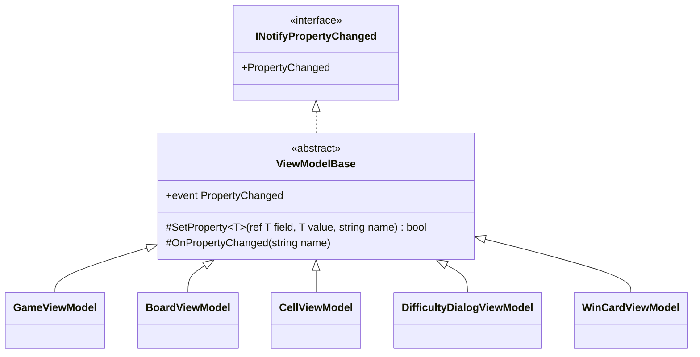

# T2: ビューモデルの変化の通知の設計

## 結論

5 つのビューモデルが共通に継承する、小さな抽象クラス `ViewModelBase` を 1 つだけ作る。`INotifyPropertyChanged` の実装と、「値が変わったときだけ通知する」手順をここに 1 か所で持つ。各ビューモデルは、プロパティの `set` で `SetProperty` を呼ぶだけにする。

## 仮定

- 対象は .NET 10 / C# 14 とする（`field` キーワードが使える）。
- ビューモデルのプロパティは UI スレッドだけで変える（経過時間は `DispatcherTimer` で進めるなど）。そのため、通知の側でスレッドの切り替えはしない。
- コマンド（`ICommand`）の書き方はこの課題の範囲外とする。

## 型の構成



| 型 | 役割 |
|----|------|
| `ViewModelBase`（abstract） | `PropertyChanged` イベント、`SetProperty`（値を比べ、変わったら代入して通知し、変わったかどうかを返す）、`OnPropertyChanged`（他のプロパティから計算される値を通知する） |
| 5 つのビューモデル | `ViewModelBase` を継承し、自分のプロパティだけを書く |

名前は `ViewModelBase` とする。5 つとも名前が `...ViewModel` で終わるので、その共通の土台であることが名前から読める。

## コード

### 基底クラス

```csharp
using System.Collections.Generic;
using System.ComponentModel;
using System.Runtime.CompilerServices;

namespace Shos.Minesweeper.Desktop.ViewModels;

/// <summary>ビューモデルの共通の土台。プロパティの変化を View に知らせる。</summary>
public abstract class ViewModelBase : INotifyPropertyChanged
{
    public event PropertyChangedEventHandler? PropertyChanged;

    /// <summary>
    /// 値が変わったときだけ、フィールドに代入して通知する。
    /// </summary>
    /// <returns>値が変わったら true。</returns>
    protected bool SetProperty<T>(ref T field, T value, [CallerMemberName] string propertyName = "")
    {
        if (EqualityComparer<T>.Default.Equals(field, value))
            return false;

        field = value;
        OnPropertyChanged(propertyName);
        return true;
    }

    /// <summary>他のプロパティから計算されるプロパティの変化を知らせる。</summary>
    protected void OnPropertyChanged([CallerMemberName] string propertyName = "")
        => PropertyChanged?.Invoke(this, new PropertyChangedEventArgs(propertyName));
}
```

### 例: `CellViewModel`

保持するプロパティ `State` と、それから計算される `IsOpened` の 2 つ。

```csharp
namespace Shos.Minesweeper.Desktop.ViewModels;

public enum CellDisplayState { Hidden, Flagged, Opened }

/// <summary>盤面の 1 マス。</summary>
public sealed class CellViewModel : ViewModelBase
{
    public CellViewModel(int column, int row) => (Column, Row) = (column, row);

    // 作った後に変わらないので、通知しない。
    public int Column { get; }
    public int Row    { get; }

    public CellDisplayState State {
        get;
        set {
            if (SetProperty(ref field, value))
                OnPropertyChanged(nameof(IsOpened));   // State に従う値も知らせる
        }
    } = CellDisplayState.Hidden;

    public bool IsOpened => State == CellDisplayState.Opened;
}
```

他のプロパティに影響しない普通のプロパティは、次の 1 行で済む（例: `GameViewModel` の残り地雷数）。

```csharp
public int RemainingMines { get; private set => SetProperty(ref field, value); }
```

## そう決めた理由

1. **重複を 1 か所にまとめる。** `INotifyPropertyChanged` を 5 つのクラスでそれぞれ実装すると、イベントの宣言、値の比較、通知の呼び出しが 5 回繰り返される。比較の忘れ（同じ値で通知して描き直しが増える）や、通知の忘れが、クラスごとに起こりうる。手順を基底クラスに置けば、正しさを 1 か所で保てる。
2. **ライブラリを使わない決定に合う。** CommunityToolkit.Mvvm の `ObservableObject.SetProperty` と同じ考え方を、20 行ほどの自前のコードで書ける。ソース ジェネレーターや、プロパティの名前から自動で通知する仕組みまで作るのは、5 つのクラスには大きすぎる。
3. **プロパティの名前を文字列で書かない。** `[CallerMemberName]` で呼び出し元の名前が入るので、名前を変えても通知の名前がずれない。他のプロパティを通知するときは `nameof` を使う。
4. **C# 14 の `field` で、裏のフィールドを書かない。** プロパティごとに `private int _remainingMines;` を宣言する必要がなく、プロパティの宣言だけで読める。
5. **計算されるプロパティは、元のプロパティの `set` で明示的に知らせる。** `SetProperty` が「変わったか」を返すので、変わったときだけ `OnPropertyChanged(nameof(IsOpened))` を呼べる。依存関係を属性や表で宣言する仕組みも考えられるが、依存は数えるほどしかないので、`set` に書いてある方が追いやすい。
6. **スレッドの切り替えを持たない。** 変化は UI スレッドだけで起こる前提なので、通知の中で `Dispatcher` に回す処理は入れない（引き算）。別のスレッドから変えることになったら、変える側で UI スレッドに戻す。
7. **インターフェースではなく抽象クラスにする。** 共有したいのは契約ではなく実装（比較と通知の手順）なので、継承が素直である。5 つのビューモデルは他の基底クラスを持つ必要がない。

## 見送ったもの

- `PropertyChangedEventArgs` をプロパティごとにキャッシュすること: 上級の盤面（30×16 = 480 マス）で一斉に変わっても生成の費用は小さい。測って問題が出たら考える。
- 複数のプロパティをまとめて通知する仕組み（`OnPropertyChanged(params string[])`、`string.Empty` で全体を通知など）: 今の依存は 1 つずつで足りる。
- 基底クラスのテスト: `SetProperty` は、同じ値では通知しないこと、違う値で 1 回だけ通知すること、通知の名前がプロパティの名前であることを、xUnit で `CellViewModel` などを通して確かめる（Avalonia を起動せずに確かめられる）。
