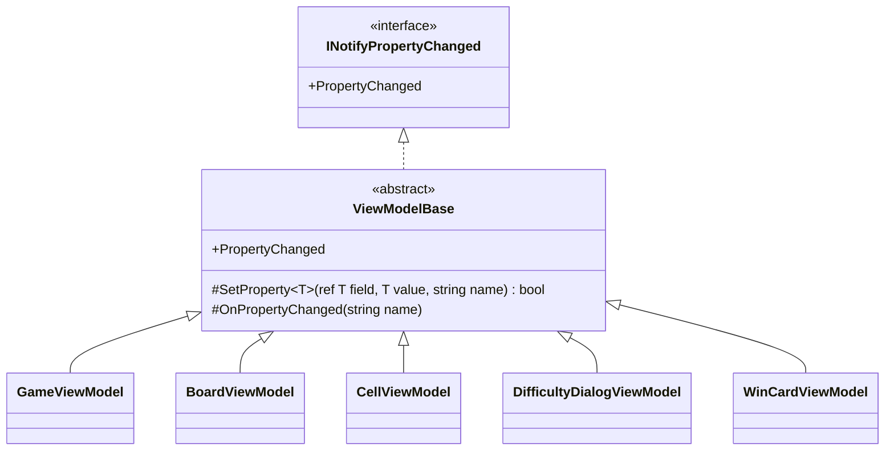

# T2: ビューモデルの変化の通知の設計

適用したスキルの作業の種類: 「設計の相談」（modeling.md、object-design.md を読み、基底クラスを新しく作るので simplicity.md も読んだ）。

## 1. 何を作るか（What）

5 つのビューモデルは、どれも「プロパティの値が変わったら、その名前を `PropertyChanged` で View に知らせる」という同じ意図を持つ。設計で決めるのは、この一つの意図をどこに一度だけ書くかと、各ビューモデルの setter をどれだけ短く、意図だけが見える形にするかである。

作らないもの: 変化の通知の他の仕組み（コマンドの基底クラス、検証の `INotifyDataErrorInfo`、メッセンジャー、変化の追跡、`PropertyChangedEventArgs` のキャッシュ）は、この課題の問題文にないので設計に入れない。

## 2. 型の構成



- `ViewModelBase`（抽象クラス、1 つだけ）: `INotifyPropertyChanged` を実装し、次の 2 つだけを派生クラスに公開する。
  - `SetProperty<T>(ref T field, T value, [CallerMemberName] string? propertyName = null)`: 値が変わったときだけ書き込んで通知し、変わったかどうかを `bool` で返す。
  - `OnPropertyChanged([CallerMemberName] string? propertyName = null)`: 値を持たない、他のプロパティから計算されるプロパティ（派生プロパティ）の変化を知らせる。
- 5 つのビューモデルは、どれも `ViewModelBase` を直接継承する。階層は 1 段だけにする。
- 各ビューモデルの書き方の規則（統一する流儀）:
  1. 値を持つプロパティの setter は `SetProperty(ref field, value)` の 1 行にする。名前は `CallerMemberName` で入るので、文字列を書かない。
  2. 派生プロパティ（例: 経過秒数から作る表示の文字列）は値を持たず、元のプロパティの setter で `SetProperty` が `true` を返したときに `OnPropertyChanged(nameof(派生))` を呼ぶ。名前は必ず `nameof` で書き、文字列リテラルを使わない。
  3. View から書き換えないプロパティの setter は `private set` にする（ゲームの状態からビューモデルが決める値が大半なので）。
  4. `PropertyChanged` を直接 `Invoke` するコードは `ViewModelBase` の外に書かない。

## 3. 例: `GameViewModel`（残り地雷数と経過時間）

```csharp
using System.Collections.Generic;
using System.ComponentModel;
using System.Runtime.CompilerServices;

namespace Shos.Minesweeper.Desktop.ViewModels;

/// <summary>プロパティの変化を View に知らせるビューモデルの共通の土台。</summary>
public abstract class ViewModelBase : INotifyPropertyChanged
{
    public event PropertyChangedEventHandler? PropertyChanged;

    /// <summary>値が変わったときだけ書き込んで通知する。変わったら true を返す。</summary>
    protected bool SetProperty<T>(ref T field, T value, [CallerMemberName] string? propertyName = null)
    {
        if (EqualityComparer<T>.Default.Equals(field, value))
            return false;
        field = value;
        OnPropertyChanged(propertyName);
        return true;
    }

    protected void OnPropertyChanged([CallerMemberName] string? propertyName = null)
        => PropertyChanged?.Invoke(this, new PropertyChangedEventArgs(propertyName));
}
```

```csharp
namespace Shos.Minesweeper.Desktop.ViewModels;

public sealed class GameViewModel : ViewModelBase
{
    int remainingMineCount;
    int elapsedSeconds;

    public int RemainingMineCount {
        get => remainingMineCount;
        private set => SetProperty(ref remainingMineCount, value);
    }

    public int ElapsedSeconds {
        get => elapsedSeconds;
        private set {
            if (SetProperty(ref elapsedSeconds, value))
                OnPropertyChanged(nameof(ElapsedTimeText)); // 表示は経過秒数から決まるので、一緒に知らせる
        }
    }

    public string ElapsedTimeText => $"{ElapsedSeconds:000}";

    // ... ゲームの状態が変わったときに RemainingMineCount / ElapsedSeconds を更新する処理は省略
}
```

`CellViewModel` のように状態（未開放・旗・開放済みなど）から見た目の複数のプロパティが決まるものも、状態を 1 つの値のプロパティにして、`SetProperty` が `true` を返したときに派生プロパティを `nameof` で知らせる、同じ形で書く。

確かめ方（Testable）: 通知は Avalonia を起動せずに xUnit で確かめられる。

```csharp
[Fact]
public void ChangingElapsedSecondsNotifiesTheTextToo()
{
    var game = /* 経過秒数を進められる状態の GameViewModel */;
    var changed = new List<string?>();
    game.PropertyChanged += (_, e) => changed.Add(e.PropertyName);

    /* 1 秒進める */

    Assert.Equal([nameof(GameViewModel.ElapsedSeconds), nameof(GameViewModel.ElapsedTimeText)], changed);
}
```

## 4. そう決めた理由（Why）

1. **同じ意図が 5 か所にあるので一か所にまとめる（Once And Only Once）。** 「値が変わったときだけ書き込み、名前を付けて通知する」は、5 つのビューモデルすべてで同じ意図であり、たまたま似ているのではない。スキルの判断ルール 1 の「同じ分岐がすでに 2 箇所目に現れた」に当たり、ここではすでに 5 か所あるので、将来への備えではなく今ある重複の解消である。まとめないと、比較・代入・通知の 5〜8 行が 5 つのクラスとすべての setter に散り、「比較を忘れて無駄に通知する」「名前の文字列を間違える」誤りの置き場所が増える。
2. **継承を選んだ理由（合成にしない理由）。** スキルは「共通処理の再利用だけが目的の継承」を避け、合成を勧める。しかし `INotifyPropertyChanged` は、ビューモデル自身が `PropertyChanged` イベントを持つことを求める契約である。合成（通知の部品を持たせて委譲する）にしても、各ビューモデルにイベントの宣言と転送を書くことになり、まとめたかった重複が残る。5 つのビューモデルはいずれも「View から変化を観察できるオブジェクト」という同じ契約を守る一種（is-a）であり、基底クラスは状態をイベント以外に持たず、階層は 1 段なので、派生クラスの全体像は基底を見なくても読める（壊れやすい基底クラスの問題が起きにくい）。
3. **基底クラスに置くものを最小にした（引き算）。** 置くのは `SetProperty` と `OnPropertyChanged` の 2 つだけで、どちらも今日の 5 つのビューモデルがすぐ使う。複数の名前をまとめて通知するメソッド、`OnPropertyChanging`、イベント引数のキャッシュ、ジェネリックな式ツリーによる名前の指定などは、今の要求にないので入れない（YAGNI）。インターフェイスを別に切る（`IViewModel` など）ことも、実装が 1 つしかない階層になるのでしない。
4. **MVVM の支援ライブラリを使わない決定の中で、それが提供する最小の形だけを自分で持つ。** CommunityToolkit.Mvvm の `ObservableObject.SetProperty` と同じ使い方にしたので、読む人が慣れた形で読める。ソース生成（`[ObservableProperty]`）の代わりに、setter を 1 行にすることで、手で書く量の差を小さくした。
5. **名前は文字列で書かない。** setter は `CallerMemberName`、派生プロパティは `nameof` にすることで、プロパティ名を変えたときにコンパイラーが追ってくれ、名前の不一致（View が更新されない不具合）を型で防げる。
6. **派生プロパティは値を持たず、元の変化のときに知らせる。** 表示の文字列を別のフィールドに持つと、元の値と二重に状態を持つことになり、食い違いが起きうる。値は一つにし、計算は getter に置き、通知の依存関係は元のプロパティの setter の 1 か所に書く。`SetProperty` が `bool` を返すのはこのためで、値が変わらないときに派生の通知も出さない。
7. **名前 `ViewModelBase`。** Avalonia のプロジェクトのテンプレートが使う名前で、Avalonia の利用者が最初に探す名前なので、流儀に合わせた（「Base」は実装寄りの語だが、テンプレートとの一致を優先した）。`ObservableObject` にしないのは、CommunityToolkit.Mvvm を使っていると誤解されないためでもある。

## 5. 捨てた案とトレードオフ

| 案 | 捨てた理由 |
|---|---|
| 5 つのクラスがそれぞれ `INotifyPropertyChanged` を直接実装する | 同じ意図が 5 か所に重複する。setter ごとに比較と通知を書くと、S/N 比が低くなり、比較の書き忘れも起きやすい |
| 通知の部品（例: `PropertyChangedNotifier`）を合成して委譲する | イベントの宣言と転送が 5 つのクラスに残り、重複を消せない。契約上イベントはビューモデル自身に要る |
| Avalonia の `AvaloniaObject` と `StyledProperty` をビューモデルに使う | ビューモデルが UI の技術に依存し、Avalonia を起動しないテストがしにくくなる |
| Fody.PropertyChanged などの IL の書き換え | ビルドの仕組みを増やし、通知がコードに見えなくなる（何がいつ通知されるかを読めない）。支援ライブラリを使わない決定の趣旨にも合わない |
| 自前のソース生成 | 5 つのビューモデルの規模に対して偶発的な複雑さが大きい |

## 6. 置いた仮定

- `PropertyChanged` は UI スレッドから発生させる。経過時間の更新は `DispatcherTimer`（UI スレッドで動く）で行う前提で、基底クラスにスレッドの切り替えは入れない。別のスレッドから更新する必要が出たら、そのときに呼ぶ側で `Dispatcher.UIThread.Post` を使う。
- コレクション（`BoardViewModel` のマスの並び）の変化は、盤面の大きさが変わるときに作り直して、そのプロパティの変化として通知する（`ObservableCollection` の要素ごとの追加・削除の通知は要らない）と仮定した。マスの中身の変化は各 `CellViewModel` の通知で伝わる。
- 上級（30×16、480 マス）でも、各マスが自分の変化だけを通知すれば性能の問題はないと見込む。問題が出たら計測してから対処する。
- コマンド（`ICommand` の実装）は変化の通知と別の関心なので、この設計の範囲外とした。

## 7. ユーザーの判断が要る点

- 基底クラスの名前（`ViewModelBase` とするか、`ObservableObject`・`NotifyingViewModel` など別の名前にするか）。
- 派生プロパティの通知を、元の setter に書く方式（本案）でよいか。派生の関係が多くなるビューモデル（`CellViewModel`）で読みにくくなったら、状態を 1 つのプロパティにまとめ、状態が変わったら派生をまとめて知らせるメソッドを `CellViewModel` の中に置くことを考える。
