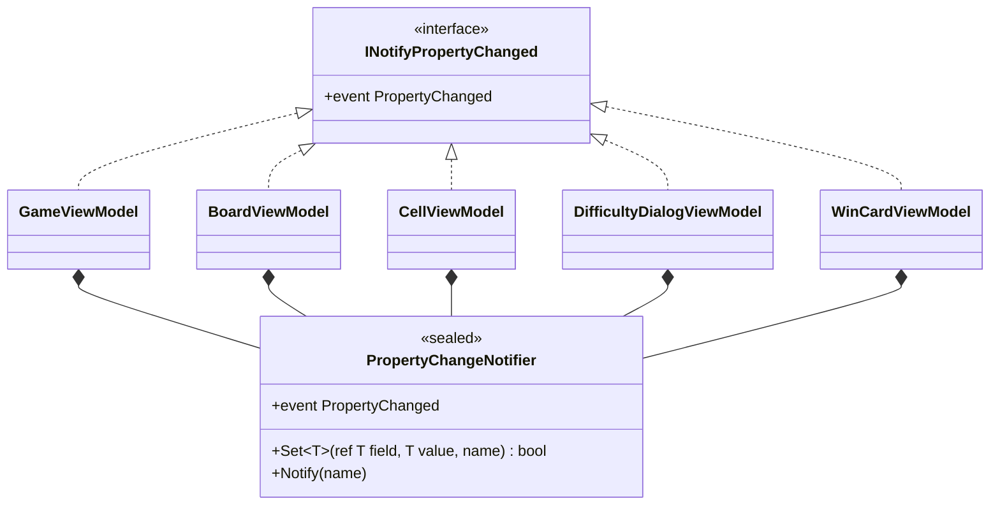

# 課題 T2: ビューモデルの変化の通知の設計

作業の種類は「設計の相談」とした。そのため、スキルの表に従って modeling.md と object-design.md を読み、基底クラスを作るかどうかを決める必要があったので simplicity.md も読んだ。

## 1. 何を作るか（What）

意図: 「ビューモデルのプロパティの値が変わったら、その名前を View に知らせる」。

5 つのビューモデルに共通する仕事は、次の 2 つだけである。

1. 自分で値を持つプロパティ: 値を置き換え、**変わったときだけ**そのプロパティの名前で知らせる
2. ほかの値から計算するプロパティ: もとの値が変わったときに、そのプロパティの名前で知らせる

どちらも「PropertyChanged を送り手（ビューモデル自身）と名前で起こす」ことに行き着く。この仕事を 1 か所に置き、5 つのビューモデルは使うだけにする。

## 2. 型の構成



| 型 | 仕事（ひとことで） |
|---|---|
| `PropertyChangeNotifier`（sealed） | プロパティの変化を、持ち主のビューモデルを送り手として購読者に知らせる |
| 5 つのビューモデル | それぞれの画面の状態を表す。`INotifyPropertyChanged` を自分で実装し、通知は `PropertyChangeNotifier` に任せる（合成と委譲） |

- 置き場所: デスクトップ版のプロジェクト（ビューモデルと同じフォルダー）。`INotifyPropertyChanged` を使うのはデスクトップ版のビューモデルだけなので、共有のプロジェクトには置かない。
- 基底クラス（`ViewModelBase` / `ObservableObject`）は作らない。理由は 4 章。

## 3. コード

### 3.1 通知の部品

```csharp
using System.ComponentModel;
using System.Runtime.CompilerServices;

/// <summary>プロパティの変化を、持ち主のビューモデルを送り手として購読者に知らせる。</summary>
sealed class PropertyChangeNotifier(INotifyPropertyChanged owner)
{
    public event PropertyChangedEventHandler? PropertyChanged;

    /// <summary>値を置き換え、変わったときだけ知らせる。変わったら true を返す。</summary>
    public bool Set<T>(ref T field, T value, [CallerMemberName] string propertyName = "")
    {
        if (EqualityComparer<T>.Default.Equals(field, value))
            return false;
        field = value;
        Notify(propertyName);
        return true;
    }

    /// <summary>計算で求めるプロパティなど、値を持たないプロパティの変化を知らせる。</summary>
    public void Notify(string propertyName)
        => PropertyChanged?.Invoke(owner, new PropertyChangedEventArgs(propertyName));
}
```

### 3.2 ビューモデルの例（CellViewModel、プロパティ 2 つ）

`Face` は自分で値を持つプロパティ、`CanOpen` は `Face` から計算するプロパティの例である。C# 14（.NET 10）の `field` キーワードで、裏の変数の宣言を省いている。

```csharp
using System.ComponentModel;

sealed class CellViewModel : INotifyPropertyChanged
{
    readonly PropertyChangeNotifier changes;

    public CellViewModel() => changes = new(this);

    public event PropertyChangedEventHandler? PropertyChanged
    {
        add => changes.PropertyChanged += value;
        remove => changes.PropertyChanged -= value;
    }

    /// <summary>マスの見た目（未開放、旗、数字、地雷など）。</summary>
    public CellFace Face
    {
        get;
        set
        {
            if (changes.Set(ref field, value))
                changes.Notify(nameof(CanOpen));
        }
    } = CellFace.Unopened;

    /// <summary>このマスを開けられるか（未開放で旗がないとき）。</summary>
    public bool CanOpen => Face == CellFace.Unopened;
}
```

ほかの 4 つのビューモデルも同じ形である（`changes` のフィールド、コンストラクター、`PropertyChanged` の転送の 3 か所と、各プロパティの `changes.Set` / `changes.Notify`）。依存するプロパティのないものは、`set => changes.Set(ref field, value);` の 1 行になる。

### 3.3 テストの例（xUnit）

```csharp
[Fact]
public void SettingANewFaceNotifiesFaceAndCanOpen()
{
    var cell = new CellViewModel();
    var names = new List<string?>();
    cell.PropertyChanged += (_, e) => names.Add(e.PropertyName);

    cell.Face = CellFace.Flagged;

    Assert.Equal([nameof(CellViewModel.Face), nameof(CellViewModel.CanOpen)], names);
}

[Fact]
public void SettingTheSameFaceNotifiesNothing()
{
    var cell = new CellViewModel();
    var notified = false;
    cell.PropertyChanged += (_, _) => notified = true;

    cell.Face = CellFace.Unopened;

    Assert.False(notified);
}
```

Avalonia を起動しなくても、購読するだけで通知を確かめられる。`PropertyChangeNotifier` だけのテストもできる。

## 4. そう決めた理由（Why）とトレードオフ

### 4.1 通知の書き方を 1 か所に集めた（Once And Only Once）

5 つのビューモデルが、それぞれ「比べて、置き換えて、名前で知らせる」を書くと、同じ意図が 5 か所（プロパティごとに数えればもっと多く）に散らばる。これは「たまたま似ている」コードではなく、`INotifyPropertyChanged` の契約を果たすという同じ意図なので、1 か所に集める（判断ルール 6）。比べ方や `PropertyChangedEventArgs` の作り方を変えるときも、直すのは `PropertyChangeNotifier` だけで済む（ひとつの変更 → ひとつの修正）。

### 4.2 基底クラスではなく合成にした（判断ルール 9）

よくある形は `abstract class ViewModelBase : INotifyPropertyChanged { protected SetProperty(...) }` を作り、5 つのビューモデルが継承する形である。各ビューモデルに転送の 3 か所が要らないので、行数はこちらの方が少ない。それでも採らなかった。

- 基底クラスを作る動機は「通知の処理を再利用したい」だけである。どこにも `ViewModelBase` 型として 5 つを同じように扱うコード（多態）がない。View は `INotifyPropertyChanged` として見るだけである。スキルは、共通処理の再利用だけが目的の継承をしないと定めている。
- 合成なら、各ビューモデルの宣言（`: INotifyPropertyChanged`）と中身だけで、全体像が分かる。基底クラスの protected なメンバーをたどらなくてよい。

受け入れたコスト: 各ビューモデルに、`changes` のフィールド、コンストラクター、`PropertyChanged` の `add`/`remove` の転送（計 6 行ほど）が要る。これは 5 か所で同じ形だが、中身は「通知を部品に任せる」という宣言だけで、判断を含まない。C# では、イベントを起こせるのは宣言した型の中だけなので、合成で書くときはこの転送が避けられない。

### 4.3 部品の形を小さくした（引き算）

- `Set` と `Notify` の 2 つだけにした。`Set` が「変わったか」を返すので、計算で求めるプロパティ（`CanOpen`）への通知は呼ぶ側が書ける。依存関係を属性で宣言する仕組み（`[NotifiesOn(...)]` など）は、依存するプロパティが少ないうちは読む対象を増やすだけなので作らない。
- 値が同じなら知らせない。盤面のマスは上級で 480 個あり、1 手ごとに全マスの状態を反映し直しても、変わったマスだけが View に知らされる。
- `[CallerMemberName]` で名前を取るので、プロパティ名の文字列を手で書かない。計算で求めるプロパティは `nameof` で書く。
- インターフェイス（`IPropertyChangeNotifier` など）は作らない。実装が 1 つしかなく、テストでも差し替える必要がない（本物のままで確かめられる）。

## 5. 作らなかったもの・置いた仮定

- **作らなかったもの**: ビューモデルの基底クラス、通知の部品のインターフェイス、依存関係の宣言の仕組み、UI スレッドへの切り替え（`Dispatcher` への送り直し）、通知の一時停止やまとめて送る仕組み、`INotifyPropertyChanging`、`ICommand` の実装（課題の範囲外）。
- **仮定**:
  - ビューモデルの値は、すべて UI スレッドで変える（経過時間は Avalonia の `DispatcherTimer` で進める）。そのため、通知の中でスレッドを切り替えない。ほかのスレッドから変える必要が出たら、そのときに足す。
  - 5 つのビューモデルは、どれも通知すべき変化を持つ（課題の前提どおり）。
  - `CellFace` は、マスの見た目を表す列挙型として別にある（例のために置いた名前）。
  - `field` キーワードを使える C# 14（.NET 10）でビルドする。

## 6. ユーザーの判断が要る点

- **基底クラスと合成のどちらにするか**: 行数と見慣れた形を優先するなら基底クラス、スキルの「再利用だけの継承をしない」と各クラスの見通しを優先するなら合成（この設計）である。既存のコードに基底クラスの流儀がすでにあるなら、ルールの統一（第六箇条）を優先して基底クラスに合わせるのがよい。
- **値が同じときに知らせないこと**: View の表示は変わらないので問題はないはずだが、「同じ値を入れ直したら知らせてほしい」使い方があるなら、そのプロパティは `Notify` で書く。
