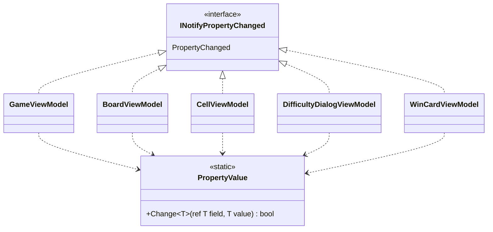

# T2: ビューモデルの変化の通知の設計

作業の種類はスキルの「設計の相談」として扱い、modeling.md と object-design.md を読んだ。新しく共通の型（基底クラスか補助の型）を作るかどうかを決めるので、simplicity.md も読んだ。

## 1. 何を決めるか（What）

5 つのビューモデルで、次の意図を 1 か所に書き、すべてで同じ書き方にする。

> 「プロパティの値が**変わったときだけ**、そのプロパティ（と、それに依存して値が変わるプロパティ）の名前で PropertyChanged を発生させる」

作らないもの: 変化の通知以外の MVVM の仕組み（コマンドの基盤、メッセンジャー、検証の枠組みなど）。今回の課題には入っていない。

## 2. 結論

- 各ビューモデルは `INotifyPropertyChanged` を**直接実装する**（`sealed class Xxx : INotifyPropertyChanged`）。共通の基底クラスは作らない。
- 「値を比べて、変わったときだけ代入する」という共通の手順だけを、小さな静的クラス `PropertyValue` の 1 つのメソッドに置く。
- 各ビューモデルが持つ定型は、`event` の宣言と、1 行の `OnPropertyChanged` の 2 行だけにする（C# のイベントは宣言したクラスの中でしか発生させられないので、基底クラスを使わない限り、この 2 行は省けない）。
- プロパティ名は `[CallerMemberName]` と `nameof` で渡し、文字列の直書きはしない。

### 型の構成



| 型 | 仕事（ひとことで） |
|---|---|
| `PropertyValue` | プロパティの値を変える。変わったかどうかを返す |
| 各ビューモデル | 自分の表示の状態を持ち、変わったことを View に知らせる |

### 共通の部品

```csharp
using System.Collections.Generic;

namespace Shos.Minesweeper.Desktop.ViewModels;

/// <summary>ビューモデルのプロパティの値を変える。</summary>
static class PropertyValue
{
    /// <summary>値が違うときだけ代入し、代入したら true を返す。</summary>
    public static bool Change<T>(ref T field, T value)
    {
        if (EqualityComparer<T>.Default.Equals(field, value))
            return false;
        field = value;
        return true;
    }
}
```

### 1 つのビューモデルの例（CellViewModel）

盤面のマス 1 つ分。`State` は保持する値、`Text` は `State` から決まる値（依存するプロパティ）である。

```csharp
using System.ComponentModel;
using System.Runtime.CompilerServices;

namespace Shos.Minesweeper.Desktop.ViewModels;

public sealed class CellViewModel : INotifyPropertyChanged
{
    public event PropertyChangedEventHandler? PropertyChanged;

    public CellState State
    {
        get;
        set {
            if (!PropertyValue.Change(ref field, value))
                return;
            OnPropertyChanged();
            OnPropertyChanged(nameof(Text)); // Text は State から決まるので、一緒に知らせる
        }
    }

    public string Text => State.ToDisplayText();

    void OnPropertyChanged([CallerMemberName] string? propertyName = null)
        => PropertyChanged?.Invoke(this, new PropertyChangedEventArgs(propertyName));
}
```

（`field` は .NET 10 の C# 14 のキーワードで、自動実装プロパティの裏のフィールドを指す。`CellState` と `ToDisplayText` は、共有の部品にあるマスの表示の状態と、その文字を返すものと仮定した。）

### 5 つのビューモデルで揃える規則

1. **保持する値**は、setter で `PropertyValue.Change` を呼び、true のときだけ `OnPropertyChanged()` を呼ぶ（例: `CellViewModel.State`、`DifficultyDialogViewModel` のカスタムの幅・高さ・地雷数の入力、エラーの文言）。
2. **ほかの値から決まるプロパティ**（計算するだけで保持しないもの）は、元の値の setter の中で `OnPropertyChanged(nameof(依存するプロパティ))` を並べて知らせる。依存の関係が 1 か所に見える。
3. **モデル（ゲームの進行）から読むだけのプロパティ**（例: `GameViewModel` の残り地雷数、顔の表示）は、モデルを変える操作のメソッド（開く、旗を立てる、リセットなど）の最後で、変わりうるプロパティの名前を知らせる。
4. 名前は `[CallerMemberName]` か `nameof` で渡す。文字列の直書き、`null` や空文字による「全部変わった」の通知は使わない。
5. `WinCardViewModel` のように、作った後に値が変わらないビューモデルは、`event` の宣言だけを持ち、通知を呼ぶ所がなくてもよい（課題の前提どおり `INotifyPropertyChanged` は実装する）。

### テストの例（xUnit）

変化の通知は、Avalonia を起動せずに確かめられる。

```csharp
public class CellViewModelTests
{
    [Fact]
    public void ChangingStateNotifiesStateAndText()
    {
        var cell = new CellViewModel();
        var changedNames = new List<string?>();
        cell.PropertyChanged += (_, e) => changedNames.Add(e.PropertyName);

        cell.State = CellState.Flagged;

        Assert.Equal([nameof(CellViewModel.State), nameof(CellViewModel.Text)], changedNames);
    }

    [Fact]
    public void SettingSameStateDoesNotNotify()
    {
        var cell = new CellViewModel { State = CellState.Flagged };
        var notified = false;
        cell.PropertyChanged += (_, _) => notified = true;

        cell.State = CellState.Flagged;

        Assert.False(notified);
    }
}
```

## 3. 理由（Why）

### 比べた案

| 案 | 各ビューモデルに書くこと | 評価 |
|---|---|---|
| A. 各ビューモデルが全部を自前で書く | event、通知のメソッド、プロパティごとの「比べる・代入・通知」 | 同じ意図（比べて変わったら代入）が 5 クラス×プロパティの数だけ重複する。Once And Only Once に反し、1 か所だけ比較を書き忘れる、といったずれが起きうる。**採らない** |
| B. 基底クラス `ObservableObject`（`SetProperty` を持つ）を継承する | `: ObservableObject` と `set => SetProperty(ref field, value)` | 1 行ずつ短い。.NET の MVVM でよく知られた形でもある。ただし、この継承の目的は共通処理を再利用することだけで、派生クラスが上書きする振る舞いもない。スキルの判断ルール 9（継承 vs 合成）の「再利用だけが目的の継承はしない」に当たる。**採らない** |
| C. 直接実装し、共通の手順だけを静的クラスに置く（採用） | event と `OnPropertyChanged` の 2 行、setter での `PropertyValue.Change` | 重複する意図（比べて代入）は `PropertyValue.Change` の 1 か所にある。各ビューモデルは基底クラスを見なくても、そのクラスだけで全体が分かる。**採る** |

- **Once And Only Once（判断ルール 6）**: 5 つのビューモデルの「値が変わったときだけ知らせる」は、たまたま似ているのではなく同じ意図なので、1 か所に集める。集める先は、重複しているのが「比べて代入する」手順だけなので、その手順だけを持つ最小の部品にした。
- **継承より合成（判断ルール 9、object-design.md の「再利用のための継承は合成に変える」）**: 案 B の基底クラスは is-a の多態のためではなく、10 行ほどの処理を再利用するためのものである。案 C なら、ビューモデルは 1 段の継承も持たず、各クラスの全体像がそのクラスの中で完結する。代償は各クラスの 2 行の定型で、これは C# のイベントの制約（宣言したクラスでしか発生させられない）から来る最小の量である（判断ルール 11: 言語にある手段の範囲で適用する）。
- **値が変わったときだけ知らせる理由**: 盤面の全マスの `CellViewModel`（上級で 480 個）を、1 手ごとにモデルから一斉に更新しても、実際に変わったマスだけが通知され、View の再描画もそのマスだけになる。更新する側（`BoardViewModel`）は「どのマスが変わったか」を知る必要がなく、全マスに今の状態を渡すだけでよい。比較の責務を、値を持つビューモデル自身に置いた（Expert）。
- **依存するプロパティを元の値の setter で知らせる理由**: 「`Text` は `State` から決まる」という依存の関係が、`State` の setter の 1 か所に書かれる。`Text` を保持する値にして二重に持つより、状態が 1 つで済む。
- **Testable**: 通知は `PropertyChanged` を購読するだけで確かめられ、Avalonia の起動も差し替えの仕組みも要らない。

## 4. 作らなかったもの・仮定

- **作らなかったもの**
  - 基底クラスとインターフェイスの階層（案 B。理由は上のとおり）。
  - `ObservableCollection` による盤面のマスの集まりの通知。難易度が変わったら、`BoardViewModel` がマスの集まりを作り直し、そのプロパティ（例: `Cells`、行数、列数）の変化を知らせれば足りると考えた。マスの追加・削除を 1 つずつ View に伝える要求はない。
  - `PropertyChangedEventArgs` のキャッシュなどの性能の工夫。1 手で変わるのは多くても数百のマスで、計測せずに可読性を下げる最適化はしない。
  - 式木・リフレクション・コード生成（Fody など）による自動の通知。ライブラリやツールを足すことになり、課題の「支援ライブラリを使わない」という決定の趣旨にも合わない。
  - UI スレッドへの切り替え。経過時間のタイマーは Avalonia の `DispatcherTimer`（UI スレッドで動く）を使い、ビューモデルは UI スレッドの上だけで変わると仮定した。別のスレッドから変える必要が出たら、そのときに扱う。
- **仮定**
  - プロジェクトは .NET 10（C# 14）で、`field` キーワードが使える。使えない場合は、裏のフィールドを明示して `PropertyValue.Change(ref state, value)` と書くだけで、設計は変わらない。
  - `CellState`、`ToDisplayText` は、共有の部品にある（または作る）マスの表示の状態と文字の決め方を指す仮の名前である。
  - 5 つのビューモデルは同じアセンブリにあり、`PropertyValue` は `internal` でよい。

## 5. ユーザーの判断が要る点

- **案 B（基底クラス）を選ぶかどうか**: 案 B は各クラスで 1〜2 行短くなり、.NET の MVVM に慣れた人には見慣れた形である。一方で、再利用だけのための継承になる。この設計では案 C を選んだが、チームが「ビューモデルは `ObservableObject` を継承する」という慣習をすでに持っているなら、既存の流儀（第六箇条「ルールの統一」）を優先して案 B にしてもよい。どちらにしても、5 つのビューモデルで同じ書き方に揃えることが大事である。
- **値が作った後に変わらないビューモデル**（`WinCardViewModel` が表示だけなら）に `INotifyPropertyChanged` が本当に要るか。課題の前提に従って実装したが、変わる値がなければ、実装しなくても Avalonia のバインディングは初期値を表示できる。
