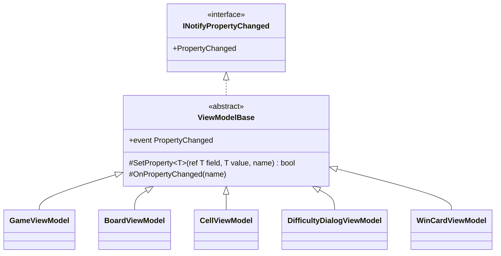

# T2: ビューモデルの変化の通知の設計

## 0. 何を決めるか（What）

5 つのビューモデルが `INotifyPropertyChanged` の契約を守るための「書き方」を一つに決める。守るべき契約は次の 3 点である。

1. 値が変わったときだけ `PropertyChanged` を上げる（同じ値の代入では上げない。双方向バインディングでの無駄な往復を防ぐ）
2. `sender` は変わったビューモデル自身、プロパティ名は正しい名前（文字列の打ち間違いを起こさない）
3. 他のプロパティから計算されるプロパティ（例: 入力から決まる「OK を押せるか」）も、元が変わったときに通知される

作らないもの: コマンド（`ICommand`）の仕組み、検証（`INotifyDataErrorInfo`）、スレッドをまたぐ通知、Rx 風の購読。どれもこの課題の問いにない。

### 置いた仮定

- ビューモデルは UI スレッドだけで変更される（タイマーの経過時間も `DispatcherTimer` で UI スレッドから更新する）。そのため、通知の側で UI スレッドへの切り替えはしない。
- 言語は .NET 10 の既定の C# 14 で、`field` キーワードが使える。使えない場合は、明示的なバッキング フィールドに置き換えるだけで、型の構成は変わらない。
- 課題の前提どおり 5 つとも `INotifyPropertyChanged` を実装する。ただし、生成後に値が変わらないビューモデル（例: 勝利カードの表示内容を作成時に受け取るだけなら `WinCardViewModel`）は、基底を継承しても通知を一度も上げないだけで、特別な書き方はしない。

## 1. 型の構成



- 新設する型は `ViewModelBase` の 1 つだけ。仕事をひとことで言うと「プロパティの変化を View に知らせる」。
- 継承は 1 段だけ。5 つのビューモデルは `sealed` にし、`ViewModelBase` に `virtual` のフック（テンプレート メソッド）は置かない。
- 名前は Avalonia の MVVM テンプレートが生成する名前（`ViewModelBase`）に合わせる。Avalonia を知る読み手がそのまま読める。`ObservableObject` は CommunityToolkit.Mvvm の型と同じ名前で、「ライブラリを使っているのか」と誤解させるので避ける。

## 2. コード

### 2.1 基底

```csharp
using System.ComponentModel;
using System.Runtime.CompilerServices;

namespace Shos.Minesweeper.Desktop.ViewModels;

/// <summary>プロパティの変化を View に知らせる、ビューモデルの共通の実装。</summary>
public abstract class ViewModelBase : INotifyPropertyChanged
{
    public event PropertyChangedEventHandler? PropertyChanged;

    /// <summary>値が変わったときだけ代入して通知する。変わったかどうかを返す。</summary>
    protected bool SetProperty<T>(ref T field, T value, [CallerMemberName] string propertyName = "")
    {
        if (EqualityComparer<T>.Default.Equals(field, value))
            return false;

        field = value;
        OnPropertyChanged(propertyName);
        return true;
    }

    /// <summary>計算で決まるプロパティなど、代入を伴わない変化を通知する。</summary>
    protected void OnPropertyChanged([CallerMemberName] string propertyName = "")
        => PropertyChanged?.Invoke(this, new PropertyChangedEventArgs(propertyName));
}
```

### 2.2 ビューモデルの例（`DifficultyDialogViewModel` の 2 つのプロパティ）

入力されるプロパティ（`ColumnsText`）と、それから計算されるプロパティ（`CanAccept`）の 2 つで、二つの書き方を示す。

```csharp
namespace Shos.Minesweeper.Desktop.ViewModels;

public sealed class DifficultyDialogViewModel : ViewModelBase
{
    const int MinColumns = 9;
    const int MaxColumns = 30;

    /// <summary>カスタムの列数として入力された文字列（TextBox と双方向にバインドする）。</summary>
    public string ColumnsText
    {
        get;
        set
        {
            if (SetProperty(ref field, value))
                OnPropertyChanged(nameof(CanAccept));   // CanAccept は ColumnsText から決まるため
        }
    } = "";

    /// <summary>OK を押せるか。入力から決まるので、値は持たない。</summary>
    public bool CanAccept
        => int.TryParse(ColumnsText, out var columns) && columns is >= MinColumns and <= MaxColumns;
}
```

（行数・地雷数の入力も `ColumnsText` と同じ形で並ぶ。入力の正規化や範囲の決まりは、この課題の対象外なので簡略にしてある。）

書き方の決まりは次の 2 つだけである。

| プロパティの種類 | 書き方 |
|---|---|
| 値を持つ（入力、状態） | `set => SetProperty(ref field, value);` |
| 他から計算される | 値を持たない。元のプロパティの setter で、`SetProperty` が `true` を返したときに `OnPropertyChanged(nameof(計算されるプロパティ))` を呼ぶ |

ゲームの進行（共有の `GameSession` など）の結果を映すだけのビューモデル（`CellViewModel`、`GameViewModel` の残り地雷数など）も、同じ 2 つの形のどちらかで書く。モデルから読むだけのプロパティなら後者で、更新を受けたときに `OnPropertyChanged(nameof(...))` を呼ぶ。

### 2.3 確かめ方（xUnit。Avalonia を起動しない）

```csharp
[Fact]
public void ChangingColumnsTextNotifiesColumnsTextAndCanAccept()
{
    var dialog = new DifficultyDialogViewModel();
    var changed = new List<string?>();
    dialog.PropertyChanged += (_, e) => changed.Add(e.PropertyName);

    dialog.ColumnsText = "10";

    Assert.Equal([nameof(DifficultyDialogViewModel.ColumnsText), nameof(DifficultyDialogViewModel.CanAccept)], changed);
}

[Fact]
public void AssigningTheSameValueDoesNotNotify()
{
    var dialog = new DifficultyDialogViewModel { ColumnsText = "10" };
    var notified = false;
    dialog.PropertyChanged += (_, _) => notified = true;

    dialog.ColumnsText = "10";

    Assert.False(notified);
}
```

## 3. そう決めた理由（Why）

### 3.1 通知の決まりを 1 か所に集める（Once And Only Once）

「値が同じなら上げない、違えば代入して自分を sender に上げる」は、5 つのビューモデルで**同じ意図**である（たまたま似ているのではなく、`INotifyPropertyChanged` の契約そのもの）。これを各クラスに書くと、同じ決まりが 5 か所に散り、1 か所だけ等値の比較を忘れる、といったずれが起きる。1 か所に置けば、決まりを変える（例: 通知の記録を足す）ときの修正も 1 か所で済む。

### 3.2 プロパティ名を文字列で書かない（正しさ、的確な名前）

`[CallerMemberName]` で setter の名前を自動で渡し、計算されるプロパティは `nameof` で指す。文字列を書かないので、名前を変えたときに通知だけが古い名前のまま残る、という不具合が起きない。

### 3.3 `field` キーワードでバッキング フィールドを消す（S/N 比）

プロパティ 1 つにつき、バッキング フィールドの宣言と、その名前の二重管理（`columnsText` と `ColumnsText`）が消える。1 行に残るのは「この値が変わったら知らせる」という意図だけになる。

### 3.4 計算されるプロパティは値を持たない

`CanAccept` を値として持って setter で更新すると、`ColumnsText` と `CanAccept` の二つの状態を一致させ続ける責任が生まれる。計算にすれば食い違いが起こりえず、残る仕事は「元が変わったら知らせる」だけになる。依存の関係は、元のプロパティの setter に 1 行で書き、なぜ通知するかをコメントで残す。

### 3.5 基底クラスにした理由と、捨てた案

スキルの判断ルール 9 は「共通処理の再利用だけが目的の継承はしない」としている。この基底クラスはその線上にあるので、合成の案と比べて決めた。

| 案 | 良い点 | 悪い点 |
|---|---|---|
| A. 各ビューモデルが直接実装する | 継承がない | 3.1 の決まりが 5 か所に重複する（Once And Only Once に反する） |
| B. 通知の役の部品を持たせる（合成）。`PropertyChangeNotifier` を各ビューモデルが持ち、`event` の `add`/`remove` をその部品へ転送する | 継承がない。決まりは 1 か所 | C# の `event` は宣言したクラスからしか上げられないので、各クラスに「部品のフィールド、生成、`add`/`remove` の転送 4 行」が要る。この定型が 5 か所に重複し、しかも見慣れない形なので読む量が増える |
| C. 静的なヘルパー関数に等値の比較と通知を置く | 継承がない | 各クラスに `event` の宣言と、ヘルパーを呼ぶ包みのメソッドが要り、B と同じく定型が 5 か所に残る |
| **D. 基底クラス `ViewModelBase`（採用）** | 決まりが 1 か所。各ビューモデルに定型が残らない。Avalonia のテンプレートと同じ形で、読み手が慣れている | 継承を使う |

D を選んだ。ルール 9 が継承を避ける理由（責務が基底と派生に分散して全体像が見えなくなる、階層が深いと基底の変更が派生を壊す）は、次の制約で起きないようにしてある。

- 基底の責務は「変化を知らせる」の一つだけで、10 行ほどである。ゲームの状態や共通の処理（タイマー、効果音など）は基底に置かない。
- 階層は 1 段で、派生はすべて `sealed`。基底に `virtual` のフックはない。したがって、派生の振る舞いを読むのに基底を追う必要があるのは `SetProperty` の 1 つだけである。
- 基底はビューモデル全体が `INotifyPropertyChanged` の契約を守ることの実装であり、それ以外を含まない。

この制約が守れなくなったら（例: 「共通の処理だから」と基底に別の責務を足したくなったら）、それは基底ではなく、必要とするビューモデルが持つ別の部品にする。

### 3.6 引き算（作らなかったもの）

- `SetProperty` に「変わったときに呼ぶ `Action`」を受ける多重定義は作らない。依存するプロパティの通知は `if (SetProperty(...)) OnPropertyChanged(...)` で足り、呼び出しの形を 2 つに増やす理由がない。
- 依存関係を属性（`[DependsOn(nameof(ColumnsText))]` のような）で宣言してリフレクションで通知する仕組みは作らない。5 つのビューモデルの規模では、setter の 1 行の方が読むものが少ない（YAGNI）。
- `PropertyChanging`（変わる前の通知）、UI スレッドへの自動の切り替え、弱い参照のイベントは作らない。要求にも仮定にも根拠がない。
- 「全プロパティが変わった」を空文字列で一括通知する書き方は採らない。どのプロパティが変わるかを明示した方が、テストで確かめられ、読み手にも依存関係が見える。

## 4. 検証について

この回答は設計であり、コードをビルド・実行していない。`field` キーワードとプロパティ初期化子の組み合わせ、`Assert.Equal` へのコレクション式の渡し方は C# 14 / xUnit v3 を前提にしており、実際のプロジェクトでビルドして確かめる必要がある。

## 5. ユーザーの判断が要る点

- 3.5 のとおり、スキルの判断ルール 9（再利用目的の継承を避ける）に対して、制約付きで基底クラスを採った。合成（案 B）を優先する方針なら、その場合の各ビューモデルの定型（約 6 行 × 5）を受け入れることになる。
- `WinCardViewModel` のように作成後に値が変わらないビューモデルも、課題の前提に従って `INotifyPropertyChanged` を実装するとした。変わる値がないと確定したら、通知を持たない普通のクラスにする方が単純である。
