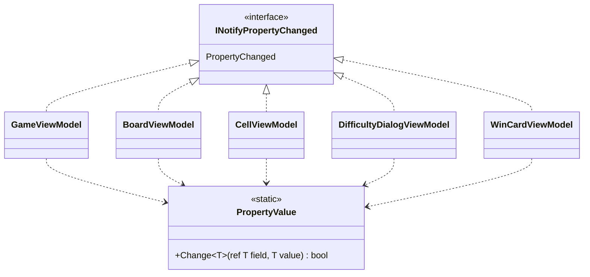

# T2: ビューモデルの変化の通知の設計

使ったスキル: skills/B（sustainable-code-jp）。作業は「設計の相談」に当たるので、modeling.md と object-design.md を読んだ。基底クラスを作るかどうかを決める必要があったので、simplicity.md も読んだ。

## 1. What（何を決めるか）

5 つのビューモデルが、プロパティの値が変わったときに、`INotifyPropertyChanged.PropertyChanged` で View に知らせる。その書き方を 1 つに揃える。

- 値が変わったときだけ知らせる（同じ値を入れ直しても知らせない）
- プロパティの名前を文字列で書かない
- MVVM の支援ライブラリは使わない（決まっていること）

## 2. 決めた形

### 型の構成



- **共通の基底クラスは作らない。** 5 つのビューモデルは、それぞれが `INotifyPropertyChanged` を直接実装する。
- **共通の部品は `PropertyValue.Change` の 1 つだけ。** 「値が違えば代入して true を返し、同じなら何もせず false を返す」という仕事をする static メソッドである。
- 各ビューモデルには、private の `Notify` を 1 行で置く。`[CallerMemberName]` を使って、呼んだプロパティの名前で `PropertyChanged` を起こす。
- プロパティは C# 14 の `field` キーワードで書き、後ろの field を自分で宣言しない。setter の形は、どのプロパティでも `if (PropertyValue.Change(ref field, value)) Notify();` にする。

### 共通の部品

```csharp
namespace Shos.Minesweeper.Desktop.ViewModels;

/// <summary>ビューモデルのプロパティの値を変える</summary>
static class PropertyValue
{
    /// <summary>値が違うときだけ field に代入する。代入したら true を返す</summary>
    public static bool Change<T>(ref T field, T value)
    {
        if (EqualityComparer<T>.Default.Equals(field, value))
            return false;
        field = value;
        return true;
    }
}
```

### 例: `WinCardViewModel`（プロパティ 2 つ）

```csharp
using System.ComponentModel;
using System.Runtime.CompilerServices;

namespace Shos.Minesweeper.Desktop.ViewModels;

/// <summary>勝ったときに出すカード</summary>
sealed class WinCardViewModel : INotifyPropertyChanged
{
    public event PropertyChangedEventHandler? PropertyChanged;

    public bool IsVisible
    {
        get;
        private set { if (PropertyValue.Change(ref field, value)) Notify(); }
    }

    public string ElapsedTimeText
    {
        get;
        private set { if (PropertyValue.Change(ref field, value)) Notify(); }
    } = "";

    public void Show(TimeSpan elapsedTime)
    {
        ElapsedTimeText = $"{(int)elapsedTime.TotalSeconds} 秒";
        IsVisible = true;
    }

    public void Hide() => IsVisible = false;

    void Notify([CallerMemberName] string? propertyName = null)
        => PropertyChanged?.Invoke(this, new PropertyChangedEventArgs(propertyName));
}
```

あるプロパティから計算するプロパティ（例: `GameViewModel` の `RemainingMines` から作る `RemainingMinesText`）は、setter を持たせずに get だけで計算する。元の値が変わったところで、`Notify(); Notify(nameof(RemainingMinesText));` のように、計算するプロパティの名前も知らせる。

## 3. Why（そう決めた理由）

### 基底クラス（`ViewModelBase`）を作らない理由

よくある書き方は、`ViewModelBase : INotifyPropertyChanged` を作って `SetProperty` を持たせ、5 つのビューモデルがそれを継承する形である。この形は採らない。

- この基底クラスは、共通の処理（比べて、代入して、知らせる）を使い回すためだけにある。どこかのコードが `ViewModelBase` の型でビューモデルを扱うことはない。Avalonia のバインディングが見るのは `INotifyPropertyChanged` だけである。スキルの判断ルール 9「共通処理の再利用だけが目的の継承はしない」に当たる。
- 継承にすると、各ビューモデルが何を公開しているかは、基底クラスを見ないと分からない。この形なら、クラスを 1 つ読めば分かる。
- 多態のために種類を分けたくなったときにも、基底クラスの席が空いている。今のところその予定はないが、席をふさぐ理由もない。

### 「比べて代入する」だけを共通にした理由

- これは 5 つのクラスのすべてのプロパティで繰り返す、同じ意図の処理である（Once And Only Once）。値の比べ方（`EqualityComparer<T>.Default`）を 1 か所に置けば、`string` や enum、`TimeSpan` でも同じように比べられる。
- 知らせる部分（`Notify`）は、各クラスに 1 行ずつ置く。C# では、イベントを起こせるのは、それを宣言した型の中だけである。合成（ほかのオブジェクトに持たせる）で共通にしようとすると、イベントの add と remove を転送するコードが要り、かえって読むものが増える（判断ルール 11: その言語で使える手段の範囲で適用する）。1 行が 5 回あっても、これはイベントを実装する側の言語の決まりであり、意図が重なっているわけではない。
- setter を `if (Change(...)) Notify();` と書くと、「値が変わったら知らせる」という意図がそのまま読める。計算するプロパティを知らせたいときも、同じ形のまま `Notify` を足すだけでよい。1 行で比べて代入して知らせる `Set(ref field, value, Notify)` のような形も考えたが、デリゲートを受け渡す分だけ読むものが増えるので採らなかった。

### そのほかの決め方

- **名前は `[CallerMemberName]` と `nameof` で渡す。** 名前を変えたときに、文字列だけが古いまま残ることがない。
- **setter は `private` にする。** View から値を変える経路は、バインディングの双方向に限る。それが要るのは `DifficultyDialogViewModel` のカスタムの入力欄（幅、高さ、地雷の数）だけで、そのプロパティだけ setter を `public` にする。ほかのビューモデルは、`Show` のように、意図を名前で表したメソッドで状態を変える。
- **テストしやすい。** 5 つとも Avalonia を起動せずに作れる。テストでは `PropertyChanged` を購読して、起きた名前を並べて確かめればよい。

## 4. 作らなかったもの

- `ViewModelBase` などの基底クラス（理由は 3 章）
- 名前ごとの `PropertyChangedEventArgs` の使い回し。速さが問題になると測って分かるまで入れない
- 空の名前（全部のプロパティが変わった）を知らせる仕組み。今は要る場面がない
- ほかのスレッドから UI スレッドへの受け渡し

## 5. 置いた仮定

- 対象は .NET 10（C# 14）である。Avalonia 12 がこれに対応するので、`field` キーワードを使える。C# 13 以前なら、後ろの field を `bool isVisible;` のように宣言して、`ref isVisible` を渡す。形はそれ以外は変わらない。
- ビューモデルを変えるのは UI スレッドだけである（経過時間は `DispatcherTimer` で進める）。そのため、`PropertyChanged` をどのスレッドで起こすかは考えていない。
- 盤面のマスの並び（`BoardViewModel` の `Cells`）は、難易度を変えたときにリストごと入れ替えて、`Cells` の変化として知らせるものとした。`INotifyCollectionChanged`（`ObservableCollection`）はこの課題の外で、要るかは盤面の View を決めるときに決める。

## 6. 検証結果

- 作業フォルダーの `check/` に、上の `PropertyValue` と `WinCardViewModel` を .NET 10 SDK（10.0.112）のコンソール アプリとして書き、`Nullable` を有効にし、警告もエラーとして扱ってビルドした。エラーも警告もなく通った（C# 14 の `field` を `ref` で渡せることも確かめた）。
- 動かして、`Show` を 2 回、`Hide` を 1 回呼んだ。起きた通知は `ElapsedTimeText, IsVisible, IsVisible` で、同じ値の 2 回目の `Show` では通知が起きないことを確かめた。
- Avalonia のバインディングでは動かしていない（パッケージを取れなかったため）。

## 7. ユーザーの判断が要る点

- 基底クラスを使わないことで、各ビューモデルにイベントの宣言と `Notify` の 2 行ずつが重なる。この重なりを許すかどうか。許さないなら、`ViewModelBase` を作ることになるが、使い回しのためだけの継承になる。
