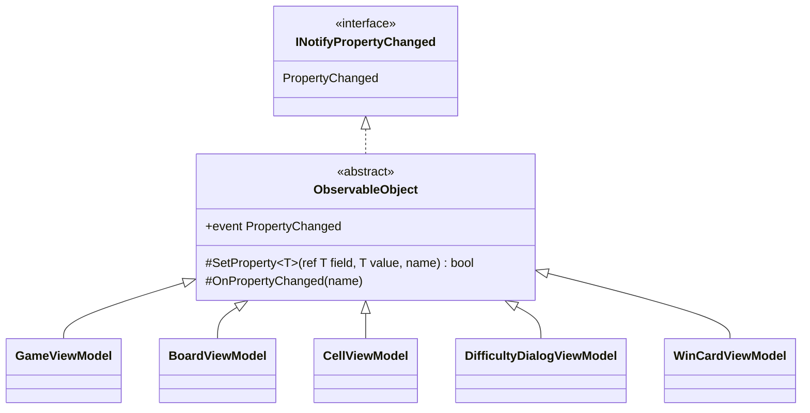

# T2: ビューモデルの変化の通知の設計

適用したスキル: sustainable-code-jp（作業の種類は「設計の相談」）。読んだもの: SKILL.md、modeling.md、object-design.md。基底クラスを新しく作るので simplicity.md も読んだ。

## 1. 何を作るか（What）

5 つのビューモデルが、プロパティの値が**変わったときだけ**、**そのプロパティの名前**を `PropertyChanged` で View に知らせる。書き方は 5 つのクラスで同じにする。書くたびに間違えやすいところ（名前の文字列、値が同じときの通知の抑止、イベントの発行）は 1 か所で決める。

作らないもの（引き算）:
- MVVM の支援ライブラリ、Fody、ソース ジェネレーター（ライブラリは使わないと決まっているため）
- 通知の引数（`PropertyChangedEventArgs`）のキャッシュ（計測していないため。上級でもマスは 480 で、1 回の操作で変わるマスの数も多くない）
- UI スレッドへの切り替え（ゲームの処理とタイマー（`DispatcherTimer` を想定）は UI スレッドで動く、と仮定した）
- `INotifyPropertyChanging`、検証（`INotifyDataErrorInfo`）、「全プロパティが変わった」の一括通知（今の要求にないため。必要になったら足す）

## 2. 型の構成



- `ObservableObject`（抽象クラス、デスクトップ版のプロジェクトの中）: 仕事は「プロパティの変化を `INotifyPropertyChanged` の契約どおりに知らせる」のひとことだけ。公開するのはイベントだけで、派生クラスには 2 つの protected メソッドだけを見せる。
  - `SetProperty<T>(ref T field, T value, [CallerMemberName] string? propertyName = null)`: 値が同じなら何もせず `false`。違えば代入して通知し、`true`。
  - `OnPropertyChanged([CallerMemberName] string? propertyName = null)`: 計算で求めるプロパティ（他の値から決まるもの）の通知に使う。
- 5 つのビューモデルは `ObservableObject` を継承し、値を持つプロパティは `SetProperty`、計算で求めるプロパティは元の値が変わったところで `OnPropertyChanged(nameof(...))` を呼ぶ。
- 決まり: `ObservableObject` には、通知のほかには何も入れない（コマンド、タイマー、共通の初期化などを足さない）。virtual のフックも置かない。

## 3. コード

### 3.1 基底クラス

```csharp
using System.Collections.Generic;
using System.ComponentModel;
using System.Runtime.CompilerServices;

namespace Shos.Minesweeper.Desktop.ViewModels;

/// <summary>プロパティの変化を View に知らせる。</summary>
public abstract class ObservableObject : INotifyPropertyChanged
{
    public event PropertyChangedEventHandler? PropertyChanged;

    protected bool SetProperty<T>(ref T field, T value, [CallerMemberName] string? propertyName = null)
    {
        if (EqualityComparer<T>.Default.Equals(field, value))
            return false;
        field = value;
        OnPropertyChanged(propertyName);
        return true;
    }

    protected void OnPropertyChanged([CallerMemberName] string? propertyName = null)
        => PropertyChanged?.Invoke(this, new PropertyChangedEventArgs(propertyName));
}
```

### 3.2 ビューモデルの例（CellViewModel。値を持つプロパティ 1 つと、それから計算するプロパティ 1 つ）

マスの状態（`State`）は値として持ち、表示する文字（`Label`）は状態から計算する。状態が変わったときだけ、表示する文字の変化も知らせる。

```csharp
namespace Shos.Minesweeper.Desktop.ViewModels;

public sealed class CellViewModel : ObservableObject
{
    CellState state;

    public CellState State
    {
        get => state;
        set
        {
            if (SetProperty(ref state, value))
                OnPropertyChanged(nameof(Label));
        }
    }

    public string Label => CellLabels.Of(State);   // 文言は共有の Presentation の部品に任せる（仮定）
}
```

`CellState` と `CellLabels` は、ゲームのルールの側と表示の文言の側にある型を仮定した名前である。

### 3.3 テストの例（xUnit）

`PropertyChanged` を購読すれば、Avalonia を起動せずに通知を確かめられる。

```csharp
[Fact]
public void ChangingStateNotifiesStateAndLabel()
{
    var cell = new CellViewModel();
    var names = new List<string?>();
    cell.PropertyChanged += (_, e) => names.Add(e.PropertyName);

    cell.State = CellState.Flagged;

    Assert.Equal([nameof(CellViewModel.State), nameof(CellViewModel.Label)], names);
}

[Fact]
public void SettingTheSameStateDoesNotNotify()
{
    var cell = new CellViewModel { State = CellState.Flagged };
    var notified = false;
    cell.PropertyChanged += (_, _) => notified = true;

    cell.State = CellState.Flagged;

    Assert.False(notified);
}
```

## 4. そう決めた理由（Why）

1. **同じ意図が 5 か所にある（Once And Only Once）。** 「値が変わったら、その名前で知らせる」は 5 つのビューモデルに共通する同じ意図である。各クラスに書くと、イベントの宣言、同じ値の抑止、発行の 3 つが 5 回重複し、どれか 1 つで同じ値の抑止を忘れる（無駄な再描画、通知の無限の往復）ような食い違いが起きうる。1 か所に集めれば、直すのも確かめるのも 1 回で済む。
2. **名前の文字列を書かない。** `[CallerMemberName]` と `nameof` で名前をコンパイラーに決めさせる。プロパティの名前を変えても通知の名前がずれない（文字列の書き間違いは、ビルドもテストも通るのに表示だけが更新されない、見つけにくい不具合になる）。
3. **継承を選んだ理由（合成を取らなかった理由）。** スキルは「共通処理の再利用だけを目的とする継承」を避け、合成を勧めている。ここで合成（通知役のオブジェクトを各ビューモデルが持つ）を取らないのは、次の理由による。
   - C# のイベントは、宣言したクラスの中からしか発行できない。合成にすると、各ビューモデルにイベントの宣言と、通知役に発行を頼む中継のメソッドが残り、重複が減らない（判断ルール 11: 言語にない仕組みを無理に持ち込まない）。
   - この基底クラスの仕事は、`INotifyPropertyChanged` という契約を満たすことそのものである。5 つのビューモデルは「変化を知らせるオブジェクト」の一種（is-a）として View のバインディングから使われ、契約を守る。共通の処理の寄せ集めではない。
   - 継承の害（責務が基底と派生に散って全体が見えない、基底の変更が派生を壊す）は、基底を通知だけの 15 行ほどに限り、virtual のフックを置かず、通知のほかは入れないという決まりで抑える。そのため、名前は `ViewModelBase` にしなかった。`ViewModelBase` は「ビューモデルの共通のもの」の置き場に見えて、コマンドやタイマーが集まりやすい。名前はこのクラスが提供するもの（変化を知らせるオブジェクト）を表す `ObservableObject` にした。
4. **`SetProperty` が `bool` を返す。** 計算で求めるプロパティ（`Label`）の通知を、値が本当に変わったときだけ出すためである。3.2 のように、依存する通知が、元のプロパティの setter の中に 1 行で並ぶ。
5. **テストしやすい。** 通知は普通の .NET のイベントなので、xUnit で購読して名前の列を確かめられる。Avalonia の画面のテストは要らない。
6. **足したのは基底クラス 1 つだけ。** インターフェイスを新設したり、ジェネリクスの階層を作ったりはしない。`INotifyPropertyChanged` は .NET と Avalonia が決めた契約で、自前の抽象を重ねる理由がない。

## 5. 捨てた案とのトレードオフ

| 案 | 良い点 | 捨てた理由 |
|----|--------|------------|
| A. 各ビューモデルが直接 `INotifyPropertyChanged` を実装する | 継承がなく、各クラスだけを読めば分かる | 同じ意図の重複が 5 か所。同じ値の抑止などの細部が食い違いうる |
| B. 抽象基底クラス `ObservableObject`（採用） | 通知の決まりが 1 か所。各プロパティは 1〜3 行 | 継承を 1 段使う。基底を太らせない決まりが要る |
| C. 通知役のクラスを合成する、または静的なヘルパーにイベントの発行を渡す | 継承がない | イベントの宣言と発行の中継が各クラスに残り、A と比べて減る量が少ないのに、読む場所が増える |

## 6. 置いた仮定と、判断が要る点

- 仮定: ゲームの処理とタイマーは UI スレッドで動く。別のスレッドから値を変えることはない（変えるなら、通知の前に UI スレッドへ切り替える仕組みを考え直す）。
- 仮定: 盤面のマスの並び（`BoardViewModel` のマスの一覧）は、難易度を変えたときに一覧ごと作り直し、`SetProperty` でプロパティとして通知する。1 マスずつの追加・削除はないので、`ObservableCollection` の変化の通知は使わない。
- 仮定: `CellState`、`CellLabels` はゲームのルールと表示の文言の側にある型で、ここでの名前は例として置いた。
- 判断が要る点: 基底クラスの名前。`ObservableObject` は Rx の `IObservable<T>` と紛れるおそれがある。紛れるのを避けたいなら `NotifyingObject` などにする。
