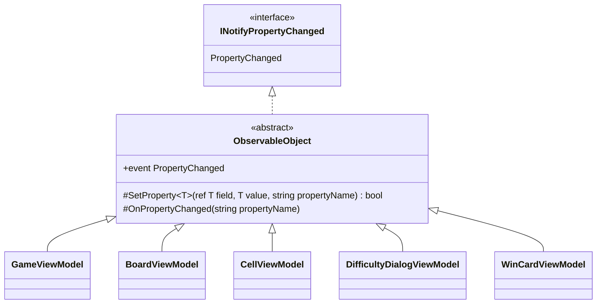

# 課題 T2: ビューモデルの変化の通知の設計

適用したスキル: sustainable-code-jp（作業の種類は「設計の相談」。modeling.md、object-design.md を読み、基底クラスを新設するので simplicity.md も読んだ）。

## 1. 何を決めるか（What）

5 つのビューモデルは、どれも「自分のプロパティが変わったら、変わったプロパティの名前を添えて View に知らせる」という**同じ意図**を持つ。決めることは次の 3 つである。

1. その意図の実装を、どこに一度だけ書くか（5 か所に書くか、1 か所に集めるか）
2. 各ビューモデルのプロパティを、どういう形で書くか
3. 他のプロパティから計算されるプロパティ（依存するプロパティ）の通知を、どう書くか

## 2. 決めたこと

### 2.1 型の構成



- 抽象クラス `ObservableObject` を 1 つだけ作り、5 つのビューモデルはそれを直接継承する（階層は 1 段だけ。ビューモデルどうしの継承はしない）。
- `ObservableObject` の仕事はひとことで「プロパティの変化を知らせる」であり、それ以外（コマンド、スレッドの切り替え、検証など）は持たせない。
- 置き場所はデスクトップ版のプロジェクト（`Shos.Minesweeper.Desktop` の `ViewModels`）。Web 版（Blazor）もコンソール版も `INotifyPropertyChanged` を使わないので、共有のプロジェクト（Presentation）には置かない。
- プロパティは C# 14（.NET 10）の `field` キーワードで書き、裏のフィールドを宣言しない。

### 2.2 基底クラスのコード

```csharp
using System.ComponentModel;
using System.Runtime.CompilerServices;

namespace Shos.Minesweeper.Desktop.ViewModels;

/// <summary>プロパティの変化を View に知らせるビューモデルの基底。</summary>
public abstract class ObservableObject : INotifyPropertyChanged
{
    public event PropertyChangedEventHandler? PropertyChanged;

    /// <summary>値が変わったときだけ書き換えて知らせる。変わったかどうかを返す。</summary>
    protected bool SetProperty<T>(ref T field, T value, [CallerMemberName] string propertyName = "")
    {
        if (EqualityComparer<T>.Default.Equals(field, value))
            return false;
        field = value;
        OnPropertyChanged(propertyName);
        return true;
    }

    /// <summary>他のプロパティから計算されるプロパティの変化を知らせるときに使う。</summary>
    protected void OnPropertyChanged(string propertyName)
        => PropertyChanged?.Invoke(this, new PropertyChangedEventArgs(propertyName));
}
```

### 2.3 ビューモデルの例（DifficultyDialogViewModel）

選ばれた難易度と、それに依存する「カスタムの入力欄を使えるか」の 2 つのプロパティの例である（`Difficulty` は GameLogic にある難易度の型と仮定した）。

```csharp
namespace Shos.Minesweeper.Desktop.ViewModels;

public sealed class DifficultyDialogViewModel : ObservableObject
{
    public Difficulty SelectedDifficulty {
        get;
        set {
            if (SetProperty(ref field, value))
                OnPropertyChanged(nameof(IsCustomSelected));  // 依存するプロパティも変わる
        }
    } = Difficulty.Beginner;

    /// <summary>カスタムの幅・高さ・地雷数の入力欄を使えるか。</summary>
    public bool IsCustomSelected => SelectedDifficulty == Difficulty.Custom;
}
```

依存がないプロパティは、`set => SetProperty(ref field, value);` の 1 行で済む。

```csharp
public string CustomWidthText { get; set => SetProperty(ref field, value); } = "";
```

### 2.4 書き方の決まり（5 つのビューモデルで揃える）

| 場面 | 書き方 |
|---|---|
| View に見せる、変わるプロパティ | `get; set => SetProperty(ref field, value);`（外から書き換えさせないときは `private set`） |
| 他のプロパティから計算されるプロパティ | 式形式の get-only にし、元のプロパティの setter で `SetProperty` が `true` を返したときに `OnPropertyChanged(nameof(...))` を呼ぶ |
| 作った後に変わらないプロパティ（例: 勝利カードのタイム） | get-only の自動実装プロパティにし、通知しない |
| プロパティの名前 | `[CallerMemberName]` と `nameof` だけを使い、文字列リテラルで書かない |

### 2.5 テストの形

`ObservableObject` は Avalonia に依存しないので、ビューモデルは Avalonia を起動せずに xUnit で確かめられる。`PropertyChanged` を購読して、知らされた名前を集めて比べる。

```csharp
[Fact]
public void SelectingCustomAlsoNotifiesIsCustomSelected()
{
    var dialog = new DifficultyDialogViewModel();
    var changedNames = new List<string?>();
    dialog.PropertyChanged += (_, e) => changedNames.Add(e.PropertyName);

    dialog.SelectedDifficulty = Difficulty.Custom;

    Assert.Equal([nameof(DifficultyDialogViewModel.SelectedDifficulty),
                  nameof(DifficultyDialogViewModel.IsCustomSelected)], changedNames);
}

[Fact]
public void SettingTheSameValueDoesNotNotify()
{
    var dialog = new DifficultyDialogViewModel();
    var notified = false;
    dialog.PropertyChanged += (_, _) => notified = true;

    dialog.SelectedDifficulty = dialog.SelectedDifficulty;

    Assert.False(notified);
}
```

## 3. 理由（Why）とトレードオフ

### 3.1 なぜ 1 か所に集めるか（Once And Only Once）

「値が変わったときだけ書き換え、名前を添えて知らせる」は、5 つのビューモデルで**同じ意図**であり、たまたま似ているだけのコードではない（判断ルール 6）。各ビューモデルに書くと、同じ 6〜8 行（イベントの宣言、等値の比較、代入、発火）が 5 か所に並び、「同じ値なら知らせない」のような決まりを変えるときに 5 か所を直すことになる。1 か所に集めれば「ひとつの変更 → ひとつの修正」になる。

### 3.2 なぜ合成ではなく継承か（スキルの判断ルール 9 との対立）

スキルは「共通処理の再利用だけが目的の継承はしない」とし、合成を優先する。ここではその原則に照らして次の案を比べ、継承を選んだ。**これは原則からの逸脱なので、理由を明記する。**

| 案 | 形 | 評価 |
|---|---|---|
| A. 各ビューモデルに直接書く | 5 つがそれぞれ `event` と `SetProperty` を持つ | 同じ意図が 5 か所に重複する（Once And Only Once に反する） |
| B. 合成（通知役のオブジェクトを持たせて委譲する） | 各ビューモデルが `PropertyChangeNotifier` を持ち、`event` の add/remove と `SetProperty` を転送する | C# のイベントは宣言した型の中からしか発火できず、`sender` もビューモデル自身でなければならない。そのため、転送の数行（イベントの add/remove、`SetProperty` の中継）が結局 5 か所に残り、重複は消えず、読む物（通知役の型）が 1 つ増える。静的なヘルパーにすると引数が 5 つ（sender、handler、ref field、value、名前）になる |
| **C. 抽象基底クラス（採用）** | `ObservableObject` を直接継承する | 重複がなくなり、各プロパティは 1 行になる |

継承の害としてスキルが挙げるもの（責務が基底と派生に分散して全体像が見えない、階層が深くなって壊れやすい基底クラス問題が起きる）が、この形では起きにくいことを確かめた。

- 基底は状態を持たず（イベントだけ）、仮想メソッドもない（派生が上書きする口がない）。派生の振る舞いを基底が裏で左右しないので、各ビューモデルの全体像は基底の 2 つのメソッドの名前を知っていれば把握できる。
- 階層は 1 段に限り、ビューモデルどうしの継承は作らない。
- 基底は `INotifyPropertyChanged` という契約（View の束縛が多態的に使う口）の実装そのものであり、「変化を知らせる物」という is-a が 5 つすべてに成り立つ。
- C# は単一継承だが、この 5 つのビューモデルには他に継承したい型がない（Avalonia のビューモデルは素のクラスでよい）。

言語の制約（イベントの発火が宣言した型に限られる）の中では、C が最も重複が少なく読む物も少ない（判断ルール 11）。

### 3.3 名前を `ObservableObject` にした理由

仕事をひとことで言うと「観測できる（変化を知らせる）物」である。`ViewModelBase` は「Base」が実装の都合（継承の階層）を名前に漏らしており、仕事を表さない。`ObservableObject` は .NET の MVVM で広く使われる語でもあり、読む人が役割を推測しやすい（ライブラリは使わないが、語彙は借りる）。

### 3.4 `SetProperty` が `bool` を返す理由

依存するプロパティの通知を「値が本当に変わったときだけ」出すためである（2.3 の `if (SetProperty(...)) OnPropertyChanged(...)`）。戻り値がなければ、依存するプロパティの通知が値の変わらないときにも出るか、呼ぶ側が比較を書き直すことになる。

### 3.5 依存するプロパティを setter で知らせる理由

計算されるプロパティ（例: 残り地雷数、カスタムを選んでいるか）は、値を別に持たずに式で計算する。値を二重に持つと、ずれる余地が生まれるからである。その代わり、元のプロパティが変わったときに依存先の名前を知らせる。依存関係を属性や表で宣言する仕組み（`[DependsOn]` など）は、依存するプロパティが数個のうちは読む物を増やすだけなので作らない。

### 3.6 `field` キーワードを使う理由

意図は「このプロパティは変わったら知らせる」だけであり、裏のフィールドの宣言と名前（`_selectedDifficulty`）はノイズである。C# 14（.NET 10 の既定）の `field` で、プロパティが 1 行になり S/N 比が上がる。

## 4. 作らなかったもの（引き算）

- **UI スレッドへの切り替え（Dispatcher の呼び出し）**: 仮定として、ゲームの操作もタイマー（`DispatcherTimer`）も UI スレッドで動くとした。別スレッドから書き換える場面が実際に出たら、その場所で UI スレッドに戻してから書き換える。基底に入れると、すべての通知が Avalonia に依存し、テストで Avalonia が要るようになる。
- **`PropertyChangedEventArgs` の使い回し（キャッシュ）**: マスは上級で 480 個（30×16）あるが、通知は開いたマスの分だけで、性能の問題は計測されていない。計測してから考える（判断ルール 5）。
- **`INotifyPropertyChanging`、`INotifyDataErrorInfo`、コマンドの基底（`RelayCommand` など）**: 課題は変化の通知だけであり、要求にない。コマンドが要るなら、別の設計として決める。
- **複数の名前を一度に知らせる `OnPropertyChanged(params string[])`**: 依存するプロパティが 3 つ以上並ぶ場所が出てから考える。
- **依存関係の宣言の仕組み（`[DependsOn]` 属性、依存の表）**: 3.5 のとおり。
- **インターフェイス（`IViewModel` など）**: 実装が 1 つの階層になるだけで、何も解かない（YAGNI）。
- **共有プロジェクト（Presentation）への配置**: 他の版は `INotifyPropertyChanged` を使わない。

## 5. 置いた仮定

- C# 14（.NET 10 の既定の言語の版）で `field` キーワードが使える。
- GameLogic に難易度の型 `Difficulty`（`Beginner`、`Custom` などを持つ）がある。例のための仮定であり、設計の要点には関わらない。
- ビューモデルへの書き込みはすべて UI スレッドで行う。
- 盤面のマスの一覧（`BoardViewModel` の `Cells`）は、難易度を変えたときに一覧ごと取り替え、`Cells` の変化として知らせる前提とした（マスを 1 つずつ足し引きしないので `ObservableCollection` は要らない）。これはプロパティの通知の設計の外なので、盤面の設計で改めて決める。

## 6. ユーザーの判断が要る点

- スキルの「再利用だけのための継承はしない」から外れて、抽象基底クラスを採った（3.2）。合成の案 B を選ぶと重複が 5 か所に残る代わりに継承はなくなる。この逸脱を受け入れるかどうか。
