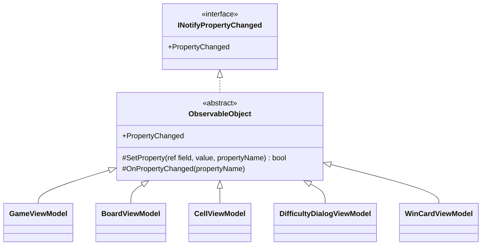

# T2: ビューモデルの変化の通知の書き方

スキルの表の「設計の相談」に当たるので、modeling.md と object-design.md を読んだ。基底クラスを新しく作るかどうかを決めるので、simplicity.md も読んだ。

## 1. 何を決めるか（What）

5 つのビューモデルは、どれも「値が変わったら、変わったプロパティの名前を `PropertyChanged` で View に知らせる」。決めることは次の 2 つである。

- この通知の仕組みを、どこに一度だけ書くか
- 各ビューモデルのプロパティに、それをどう書くか

## 2. 置いた仮定

- 対象は .NET 10（C# 14）とする。プロパティの裏の変数には `field` キーワードを使う。C# 13 以前なら、`private int remainingMines;` のような裏の変数を書くだけで、ほかの設計は変わらない。
- ビューモデルの値は UI のスレッドで変える（経過時間の更新には `DispatcherTimer` を使う）。そのため、通知を UI のスレッドに移す処理は入れない。
- 5 つのビューモデルは、ほかの基底クラスを必要としない（Avalonia の `AvaloniaObject` などから派生させない）。
- ゲームのルールの型（`GameStatus` など）は、ビューモデルの外（GameLogic）にあるものとする。例ではその名前を仮に使う。

## 3. 型の構成



- 抽象クラス `ObservableObject` を 1 つだけ作る。仕事をひとことで言うと「プロパティの変化を通知する」ことで、名前はそれを表している。持つものは、イベント 1 つと、protected のメソッド 2 つだけである。
- 5 つのビューモデルは `ObservableObject` から直接派生させる。階層はこの 1 段だけにする。
- `ObservableObject` には virtual のメンバーを置かない。派生クラスが上書きできるところがないので、基底クラスが派生クラスの振る舞いに入り込むことはない。

### 3.1 ObservableObject

```csharp
using System.Collections.Generic;
using System.ComponentModel;
using System.Runtime.CompilerServices;

namespace Shos.Minesweeper.Desktop.ViewModels;

/// <summary>プロパティの変化を View に通知するビューモデルの基底クラス。</summary>
public abstract class ObservableObject : INotifyPropertyChanged
{
    public event PropertyChangedEventHandler? PropertyChanged;

    /// <summary>値が変わったときだけ代入して通知する。変わったら true を返す。</summary>
    protected bool SetProperty<T>(ref T field, T value, [CallerMemberName] string propertyName = "")
    {
        if (EqualityComparer<T>.Default.Equals(field, value))
            return false;
        field = value;
        OnPropertyChanged(propertyName);
        return true;
    }

    /// <summary>ほかのプロパティから計算されるプロパティの変化を通知する。</summary>
    protected void OnPropertyChanged(string propertyName)
        => PropertyChanged?.Invoke(this, new PropertyChangedEventArgs(propertyName));
}
```

### 3.2 例: GameViewModel（プロパティ 2 つ）

```csharp
namespace Shos.Minesweeper.Desktop.ViewModels;

public sealed class GameViewModel : ObservableObject
{
    public int RemainingMines
    {
        get;
        private set => SetProperty(ref field, value);
    }

    public GameStatus Status
    {
        get;
        private set {
            if (SetProperty(ref field, value))
                OnPropertyChanged(nameof(IsOver));   // IsOver は Status から計算されるので、一緒に知らせる
        }
    }

    public bool IsOver => Status is GameStatus.Won or GameStatus.Lost;

    // ゲームの操作の後に、RemainingMines と Status を GameLogic の値で更新するメソッドが入る（この課題の範囲外）
}
```

- 普通のプロパティは、setter に `SetProperty(ref field, value)` と書くだけである。プロパティ名は `[CallerMemberName]` でコンパイラーが入れるので、文字列で書かない。名前の書き間違いが起こらない。
- ほかのプロパティから計算されるプロパティ（`IsOver`）は、元のプロパティが変わったときだけ `OnPropertyChanged(nameof(...))` で知らせる。`SetProperty` が `bool` を返すのは、この「変わったときだけ」を書くためである。

## 4. そう決めた理由（Why）

### 4.1 通知の仕組みを 1 か所に集める（Once And Only Once）

「同じ値なら何もしない。違えば代入して、プロパティ名を付けて通知する」という意図は、5 つのビューモデルで同じである（たまたま似ているのではなく、INotifyPropertyChanged の契約を満たすという同じ意図）。各クラスに書くと 5 か所に同じ処理ができ、たとえば「値の比べ方を変える」ときに 5 か所を直すことになる。1 か所に集めれば、修正も 1 か所で済む。

### 4.2 基底クラスにした理由と、判断ルール 9（継承 vs 合成）との関係

スキルは「共通処理の再利用だけが目的の継承はしない。多態（is-a と契約の遵守）のための継承は可」としている。ここでは次の理由で、基底クラスにした。

- **is-a が成り立つ**: 5 つのビューモデルは、どれも「変化を通知するオブジェクトの一種」である。View のバインディングは、ビューモデルの具体的な型ではなく `INotifyPropertyChanged` という契約を通して変化を受け取る。`ObservableObject` はこの契約を実装し、派生クラスは契約を変えずにそのまま置き換えられる（LSP を守る）。
- **継承の害が起きない形に限っている**: object-design.md が挙げる継承の害は、責務が基底と派生に散る、階層が深くなって結合が高まる、基底の変更が派生を壊す、である。`ObservableObject` は通知という 1 つの責務をまるごと持ち、派生クラスは何も上書きしない。階層は 1 段で、各ビューモデルの全体像は、基底クラスの 20 行ほどを一度読めば把握できる。

合成（共通の処理を別のオブジェクトや静的メソッドに置き、各ビューモデルがそれを呼ぶ）は、次の理由で採らなかった。

| 案 | 捨てた理由 |
|---|---|
| 静的メソッド `PropertyChange.Set(this, PropertyChanged, ref field, value)` を各 setter から呼ぶ | C# のイベントは、宣言したクラスの外から発火できないので、呼ぶたびに `this` と `PropertyChanged` を渡すことになる。全ビューモデルのすべての setter に、意図にない引数が 2 つ入り（ノイズ）、引数も 3 つを超える |
| 通知を担うオブジェクトを各ビューモデルが持つ | `PropertyChanged` の `add` と `remove` を、そのオブジェクトに転送するコードが 5 つのクラスに要る。重複をなくすための仕組みが、別の重複を生む |
| 各ビューモデルに、それぞれ `SetProperty` を書く | 4.1 の Once And Only Once に反する |

基底クラスの欠点は、C# の単一継承の枠を 1 つ使うことである。仮定のとおり、ビューモデルにほかの基底クラスは要らないので、失うものはない。

### 4.3 同じ値なら通知しない

経過時間は 1 秒ごとの更新、セルは盤面の更新のたびに値を設定し直すことが多く、値が変わらないことがある。上級の盤面は 480 セルあるので、変わらない値まで通知すると、View が変化のないバインディングを何度も読み直す。比べるのは `EqualityComparer<T>.Default` なので、列挙型、数値、文字列、record のどれでも同じ書き方で使える。

### 4.4 名前

- `ObservableObject`: 提供するサービス（観察できる = 変化を知らせる）を表す。`ViewModelBase` にしなかったのは、「Base」は実装の形（基底であること）を名前に出しているだけで、仕事を表さないからである。また、`ViewModel` という広い名前にすると、ビューモデルの共通のものが何でも集まる置き場になりやすい。
- `SetProperty` と `OnPropertyChanged`: .NET の MVVM で広く使われる名前で、読む人がすぐに意味を取れる（MVVM の支援ライブラリを使わないことと、その語彙を使うことは矛盾しない）。

### 4.5 確かめ方（Testable）

`ObservableObject` は Avalonia に依存しないので、ビューモデルを xUnit で直接確かめられる。確かめる例は次のとおり。

- 値が変わったとき、そのプロパティの名前で 1 回だけ通知される
- 同じ値を設定したときは通知されない
- `Status` が変わったとき、`Status` と `IsOver` の両方が通知される

```csharp
[Fact]
public void ChangingStatusNotifiesIsOverToo()
{
    var game = /* 勝つ直前の盤面で作った GameViewModel */;
    var names = new List<string?>();
    game.PropertyChanged += (_, e) => names.Add(e.PropertyName);

    /* 最後の安全なセルを開く */

    Assert.Equal([nameof(GameViewModel.Status), nameof(GameViewModel.IsOver)], names.Where(name => name is nameof(GameViewModel.Status) or nameof(GameViewModel.IsOver)));
}
```

## 5. 作らなかったもの

頼まれておらず、今の要求にも根拠がないので、次のものは入れていない。必要になったら足す。

- 通知を UI のスレッドに移す処理（仮定のとおり、値は UI のスレッドで変える）
- `INotifyPropertyChanging`（変化の前の通知）。View は使わない
- `INotifyDataErrorInfo` などの入力の検証の仕組み。カスタムの難易度の入力の検証は、`DifficultyDialogViewModel` の設計のときに決める
- 空の名前で全プロパティの変化を一度に知らせる仕組み
- 複数のプロパティをまとめて通知する `SetProperty` の多重定義や、依存するプロパティを属性で宣言する仕組み。計算されるプロパティは、今は `IsOver` の例のように setter の中で 1 行書けば足りる
- ソースジェネレーターや IL の書き換え（Fody など）による自動化
- コマンド（`ICommand` の実装）。この課題の範囲外である

## 6. ユーザーの判断が要る点

- **判断ルール 9 の解釈**: 4.2 のとおり、is-a と契約の遵守が成り立つので基底クラスにした。基底クラスを使わない方針（合成を優先する）を守りたい場合は、4.2 の表の 1 つ目の案（静的メソッド）を採れる。その場合は、setter のノイズが増えることを受け入れることになる。
- **WinCardViewModel が通知を要るか**: 勝利カードの表示の間に値が変わらないなら、変化を通知する必要はなく、作ったときの値を読むだけのクラスで足りる。課題の前提（5 つとも `INotifyPropertyChanged` を実装する）に従ったが、値が変わらないと分かれば、`ObservableObject` から派生させる理由はなくなる。
