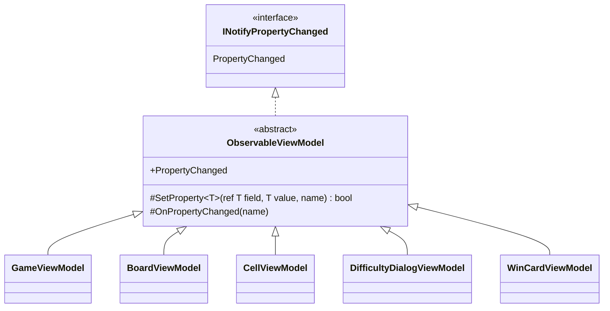

# T2: ビューモデルの変化の通知の設計

## 0. 何を決めるか（What）

5 つのビューモデル（`GameViewModel`、`BoardViewModel`、`CellViewModel`、`DifficultyDialogViewModel`、`WinCardViewModel`）が、自分のプロパティが変わったことを `INotifyPropertyChanged` で View に知らせる。その**書き方を 1 通りに揃える**。MVVM の支援ライブラリは使わない。

決めること:

1. 「値を入れて、変わったときだけ知らせる」処理をどこに一度だけ置くか
2. 他のプロパティから計算されるプロパティ（依存するプロパティ）をどう知らせるか
3. 各ビューモデルのプロパティの書き方の型

作らないもの（下の 5 章に理由）: コレクションの変化の仕組み、依存関係の属性、一括通知、スレッドの切り替え、コマンドの基盤。

### 置いた仮定

- ビューモデルの状態は、UI スレッドの上でだけ変わる（経過時間は Avalonia の `DispatcherTimer` で進める）。
- ビューモデルは、ゲームのモデル（盤面・マスのルール）を持つ別のクラスから状態を受け取って表示用に写すだけで、ルールは持たない。
- 盤面のマスの数は 1 回のゲームの間は変わらない。難易度を変えたときは、マスの一覧をまとめて作り直す。
- テストは xUnit で、Avalonia を起動せずにビューモデルを確かめる。

## 1. 型の構成



- 新しく作る型は `ObservableViewModel` の 1 つだけ。仕事をひとことで言うと「プロパティの変化を View に知らせる」。
- 5 つのビューモデルはこれを直接継承し、`sealed` にする。階層は 1 段で、それより深くしない。
- `ObservableViewModel` は Avalonia に依存しない（`System.ComponentModel` だけ）。そのため、Avalonia を起動しない xUnit のテストで通知を確かめられる。

### ObservableViewModel

```csharp
using System.ComponentModel;
using System.Runtime.CompilerServices;

namespace Shos.Minesweeper.Desktop.ViewModels;

/// <summary>プロパティの変化を View に知らせる、ビューモデルの共通の部分。</summary>
public abstract class ObservableViewModel : INotifyPropertyChanged
{
    public event PropertyChangedEventHandler? PropertyChanged;

    /// <summary>値が変わったときだけ入れて知らせる。変わったら true を返す。</summary>
    protected bool SetProperty<T>(ref T field, T value, [CallerMemberName] string? propertyName = null)
    {
        if (EqualityComparer<T>.Default.Equals(field, value))
            return false;

        field = value;
        OnPropertyChanged(propertyName);
        return true;
    }

    /// <summary>計算で求めるプロパティなど、フィールドを持たないプロパティの変化を知らせる。</summary>
    protected void OnPropertyChanged([CallerMemberName] string? propertyName = null)
        => PropertyChanged?.Invoke(this, new PropertyChangedEventArgs(propertyName));
}
```

## 2. 1 つのビューモデルの例（CellViewModel）

マスの見た目（`Appearance`）と、それから計算する読み上げの名前（`AccessibleName`）の 2 つのプロパティで、「フィールドを持つプロパティ」と「依存するプロパティ」の 2 つの型を示す。

```csharp
namespace Shos.Minesweeper.Desktop.ViewModels;

public sealed class CellViewModel(int row, int column) : ObservableViewModel
{
    CellAppearance appearance = CellAppearance.Covered;

    public int Row { get; } = row;
    public int Column { get; } = column;

    /// <summary>マスの見た目（未開放、旗、数字、地雷など）。</summary>
    public CellAppearance Appearance
    {
        get => appearance;
        private set
        {
            if (SetProperty(ref appearance, value))
                OnPropertyChanged(nameof(AccessibleName));   // AccessibleName は Appearance から決まる
        }
    }

    /// <summary>スクリーンリーダーが読み上げる名前。</summary>
    public string AccessibleName => CellNames.Of(Row, Column, Appearance);

    /// <summary>ゲームのモデルから受け取ったマスの状態を、表示に写す。</summary>
    public void Update(CellAppearance appearance) => Appearance = appearance;
}
```

- 書き方の型は 3 つだけにする。
  1. **変わらない値**: `{ get; }`。通知しない（`Row`、`Column`）。
  2. **変わる値**: フィールド＋`SetProperty`。setter は `private` にし、変える入口は `Update` のような意図を表すメソッドにする（View からの双方向バインドが要るプロパティだけ `public set`。例: `DifficultyDialogViewModel` のカスタムの幅・高さ・地雷数の入力）。
  3. **計算する値**: 式本体のプロパティ。元のプロパティの setter で、`SetProperty` が `true` を返したときに `OnPropertyChanged(nameof(...))` で知らせる。
- `CellAppearance`（表示の種類の列挙）と `CellNames.Of`（読み上げの名前）は、表示の文言の側にある既存の部品を仮定している。

### テストの例

```csharp
[Fact]
public void UpdatingAppearanceNotifiesAppearanceAndAccessibleName()
{
    var cell = new CellViewModel(0, 0);
    var changed = new List<string?>();
    cell.PropertyChanged += (_, e) => changed.Add(e.PropertyName);

    cell.Update(CellAppearance.Flagged);

    Assert.Equal([nameof(CellViewModel.Appearance), nameof(CellViewModel.AccessibleName)], changed);
}

[Fact]
public void UpdatingWithTheSameAppearanceNotifiesNothing()
{
    var cell = new CellViewModel(0, 0);
    var changed = new List<string?>();
    cell.PropertyChanged += (_, e) => changed.Add(e.PropertyName);

    cell.Update(CellAppearance.Covered);

    Assert.Empty(changed);
}
```

## 3. そう決めた理由（Why）

### 3.1 共通の処理を 1 か所に置く（Once And Only Once）

「前と同じなら何もしない／違えば入れて、名前を付けて知らせる」は、5 つのビューモデルのすべてのプロパティで**同じ意図**である。各クラスに書くと、比べ方（`EqualityComparer<T>.Default`）や知らせ方を変えるときに 5 か所を直すことになる。1 か所に置けば、「通知の仕方を変える → `ObservableViewModel` だけを直す」の「ひとつの変更 → ひとつの修正」になる。

### 3.2 合成ではなく、1 段の継承にした（判断ルール 9 からの意図した例外）

スキルの判断ルール 9 は「共通処理の再利用だけが目的の継承はしない」である。この基底クラスも再利用が主な動機なので、合成の案と比べたうえで継承を選んだ。

| 案 | 各プロパティの書き方 | 捨てた理由／選んだ理由 |
|---|---|---|
| A. 各クラスで直接実装 | `SetProperty` を 5 回書く | 同じ意図の重複（Once And Only Once 違反）。比べ方の不揃いが起きうる |
| B. 静的なヘルパーに委ねる（合成） | `Notify.Set(this, PropertyChanged, ref field, value)` | C# のイベントは宣言したクラスの中からしか起こせないので、各クラスに `event` の宣言と、ヘルパーへの転送を毎回書くことになる。全プロパティで `this, PropertyChanged` のノイズが増え、S/N 比が下がる。転送用の private メソッドを各クラスに置けば、A と同じ重複に戻る |
| **C. 1 段の抽象基底クラス（採用）** | `SetProperty(ref field, value)` | 各プロパティが 1 行で意図だけを書ける。C# で `INotifyPropertyChanged` を共有する、言語の仕組みに沿った普通の形（判断ルール 11） |

継承の害（責務が基底と派生に分散して全体像が見えない、壊れやすい基底クラス）を避けるために、次を守る。

- 基底クラスは**通知の 2 つのメソッドだけ**を持ち、状態（イベント以外のフィールド）も、`virtual` のフックも持たない。派生クラスは基底を見なくても、`SetProperty` の名前から振る舞いが分かる。
- 階層は 1 段。派生クラスは `sealed`。
- 「ビューモデルに共通だから」という理由で、他の機能（コマンド、破棄、ログなど）を基底に足さない。足したくなったら、そのときに合成で別の型にする。

また、この継承は `INotifyPropertyChanged` という契約の実装を共有するもので、5 つのビューモデルはどれも「変化を知らせるもの」として View から同じ契約で扱われる。is-a の関係は崩れていない。

### 3.3 名前

- `ObservableViewModel`: 利用者（ビューモデルを書く人と View）から見た仕事、「観察できる（変化を知らせる）ビューモデル」を表す。実装の都合を表す `ViewModelBase` の `Base` は、何を共有しているかを言わないので避けた。
- `SetProperty` / `OnPropertyChanged`: .NET の MVVM で広く使われる名前にそろえ、読む人が初見で振る舞いを推測できるようにした（ライブラリは使わないが、語彙は借りる）。

### 3.4 依存するプロパティは、元の setter で明示的に知らせる

`AccessibleName` のような計算するプロパティは、元のプロパティの setter で `OnPropertyChanged(nameof(...))` を呼ぶ。依存が setter の 1 行として目に見え、`nameof` によって名前の変更にも追従する。依存関係を属性で宣言して自動で知らせる仕組みは、5 つのビューモデルの規模では読む対象（仕組みそのもの）を増やすだけなので作らない。

### 3.5 Testable

基底クラスが Avalonia に依存しないので、ビューモデルは `new` するだけで作れ、`PropertyChanged` を購読して「どの名前が、何回知らされたか」を xUnit で確かめられる（2 章のテスト）。「同じ値では知らせない」ことも確かめられる。

## 4. 5 つのビューモデルへの当てはめ（プロパティの型の目安）

| ビューモデル | 変わる値（`SetProperty`） | 計算する値（`OnPropertyChanged`） | 変わらない値 |
|---|---|---|---|
| `GameViewModel` | 残り地雷数、経過秒数、ゲームの状態、表示中のダイアログ・勝利カード | 顔（リセットボタン）の表示など、状態から決まるもの | — |
| `BoardViewModel` | マスの一覧（難易度を変えたときに一覧ごと差し替える） | — | — |
| `CellViewModel` | 見た目 | 読み上げの名前 | 行、列 |
| `DifficultyDialogViewModel` | 選んだ難易度、カスタムの入力（双方向バインドなので `public set`） | 入力が正しいか、エラーの文言 | — |
| `WinCardViewModel` | — | — | 難易度、タイム、ベストタイムか（表示するたびに作る） |

`WinCardViewModel` のように、表示するたびに作り直して中身が変わらないものは通知が要らない。それでも `ObservableViewModel` を継承するかは、「変わる値ができたときに書き方が揃う」ことよりも「要らないものを持たない」ことを優先し、**変わる値がないうちは継承しない**（`INotifyPropertyChanged` も実装しない）。課題文の「どれも実装する」とは異なるので、下の 6 章に挙げる。

## 5. 作らなかったもの

- **`ObservableCollection` によるマスの増減の通知**: 1 回のゲームの間マスの数は変わらないので、各 `CellViewModel` が自分の変化を知らせ、難易度を変えたときは `BoardViewModel` が一覧を差し替えて `Cells` の変化を知らせれば足りる（仮定）。
- **依存関係を宣言する属性や、一括で知らせる仕組み（`string.Empty` で全体を知らせるなど）**: 規模に対して要らない（YAGNI）。
- **UI スレッドへの切り替え**: 状態は UI スレッドでだけ変わる仮定なので入れない。別スレッドから変えることになったら、変える側で `Dispatcher.UIThread` に移す（基底クラスを Avalonia に依存させない）。
- **ソース生成・IL の書き換え（Fody など）**: 支援ライブラリを使わない決定に沿い、読む人が生成物を想像しなくて済むように、手で書く。
- **コマンド（`ICommand`）の基盤**: 課題の範囲（変化の通知）の外。

## 6. 判断が要る点

- `WinCardViewModel` のように変わる値がないビューモデルは `INotifyPropertyChanged` を実装しない、としたが、課題文は「どれも実装する」としている。「5 つすべて同じ形にそろえる」を優先するなら、`ObservableViewModel` を継承させてもよい（通知が一度も起きないだけで、害はない）。
- 合成を基本とするスキルの判断ルール 9 から、3.2 の理由で意図して外れた。基底クラスに通知以外を足さない、という約束を守り続けられるかが前提である。
