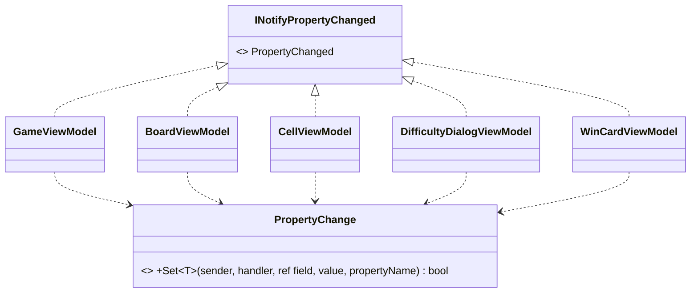

# T2: ビューモデルの変化の通知の設計

作業の種類は「設計の相談」とした（スキルの表により、modeling.md と object-design.md を読んだ。基底クラス・ジェネリクスを新しく作るかを決めるので、simplicity.md も読んだ）。

## 1. 意図（What）

「ビューモデルのプロパティの値が変わったときだけ、そのプロパティの名前を View に知らせる」。5 つのビューモデルで意図は同じなので、この意図を 1 か所に置く（Once And Only Once）。

## 2. 置いた仮定

- 言語は C# 14（.NET 10 の既定）。プロパティの中で `field` キーワードが使える。
- ビューモデルは UI スレッドだけで変わる。別スレッドからの通知（Dispatcher への切り替え）は問題文にないので入れない。
- ゲームのルールのモデル（盤面やゲームの状態）は自分では通知しない。ビューモデルが操作の後にモデルを読み直して、自分のプロパティに入れる。値が同じなら通知しないので、読み直しを何度しても無駄な通知は出ない。
- 5 つのビューモデルを、共通の型として扱うコード（例: `List<ViewModelBase>`）はない。

## 3. 型の構成



- `PropertyChange`（static クラス、1 つ）: 「値が変わったかを比べ、変わっていればフィールドに入れて、変化を知らせる」を 1 か所に持つ。仕事をひとことで言うと「プロパティの変化を反映して知らせる」。
- 5 つのビューモデル: それぞれが `INotifyPropertyChanged` を直接実装する。持つのは、イベント 1 つと、`PropertyChange.Set` に自分を渡す 1 行の `Set`、ほかのプロパティから決まる値を知らせる 1 行の `Notify` だけ。
- 基底クラス（`ViewModelBase`）は作らない。理由は 5 章。

```csharp
using System.ComponentModel;

namespace Shos.Minesweeper.Desktop.ViewModels;

static class PropertyChange
{
    // 値が変わったときだけ書き換えて知らせる。変わったかどうかを返す。
    public static bool Set<T>(object sender, PropertyChangedEventHandler? handler,
                              ref T field, T value, string propertyName)
    {
        if (EqualityComparer<T>.Default.Equals(field, value))
            return false;
        field = value;
        handler?.Invoke(sender, new PropertyChangedEventArgs(propertyName));
        return true;
    }
}
```

## 4. 1 つのビューモデルの例（CellViewModel）

```csharp
using System.ComponentModel;
using System.Runtime.CompilerServices;

namespace Shos.Minesweeper.Desktop.ViewModels;

sealed class CellViewModel : INotifyPropertyChanged
{
    public event PropertyChangedEventHandler? PropertyChanged;

    public CellState State
    {
        get;
        private set { if (Set(ref field, value)) Notify(nameof(IsOpened)); }
    }

    public bool IsOpened => State is CellState.Opened;   // State から決まる値

    public void Update(Cell cell) => State = cell.State;  // モデルを読み直す

    bool Set<T>(ref T field, T value, [CallerMemberName] string propertyName = "")
        => PropertyChange.Set(this, PropertyChanged, ref field, value, propertyName);

    void Notify(string propertyName)
        => PropertyChanged?.Invoke(this, new PropertyChangedEventArgs(propertyName));
}
```

- プロパティの名前は `[CallerMemberName]` で取る。文字列で書かないので、名前を変えても通知の名前がずれない。
- ほかのプロパティから決まる値（`IsOpened`）は、元になるプロパティ（`State`）の setter で `nameof` を使って知らせる。どの値がどの値に依存するかが、元の値の setter の 1 か所で読める。
- `CellState`・`Cell` はモデルの側の型（仮の名前）である。

他の 4 つも同じ形で書く（例: `GameViewModel.RemainingMineCount`、`WinCardViewModel.IsVisible`）。

## 5. そう決めた理由（Why）と捨てた案

| 案 | 内容 | 判断 |
|---|---|---|
| A. 各ビューモデルに全部書く | 比較・代入・通知を 5 か所に書く | 捨てた。「変わったときだけ知らせる」という同じ意図が 5 か所に重なる（Once And Only Once に反する）。比較を忘れる・名前を打ち間違えるなどの揺れが入りやすい |
| B. 基底クラス `ViewModelBase` | 通知の実装を基底に置き、5 つが継承する | 捨てた。5 つを基底の型として扱うコードはなく、継承の動機は共通処理の再利用だけである（スキルの判断ルール 9「共通処理の再利用だけが目的の継承はしない」）。Avalonia のテンプレートで見慣れた形だが、慣れは選ぶ理由にならない（判断ルール 8） |
| C. static の `PropertyChange` と、各ビューモデルの 1 行の転送（採用） | 意図は 1 か所、イベントは各ビューモデルが持つ | 採用。重複は「イベントの宣言と 2 つの 1 行」だけで、これは `INotifyPropertyChanged` を実装する以上、各クラスに要る部分である。各クラスは基底を見なくても全体が分かる |

- 合成（通知を受け持つオブジェクトを各ビューモデルが持つ）も考えたが、`PropertyChanged` イベントはビューモデル自身に要るので、イベントの add/remove を転送するコードが増える。状態を持たない処理なので、static のメソッドで足りる。
- `PropertyChange.Set` の引数は 5 つで、目安の 3 つを超える。`ref` のフィールドと送り手とイベントを渡すには、まとめる型を作るより引数で渡すほうが読みやすい。呼ぶのは各ビューモデルの 1 行の `Set` だけなので、利用側からは引数 2 つに見える。
- C# 14 の `field` キーワードで、裏のフィールドの宣言をなくした。通知と関係のない記述（ノイズ）が減る。
- テスト: ビューモデルは Avalonia に依存しないので、`PropertyChanged` を購読して、操作の後に届いた名前の一覧を確かめるテストが xUnit で書ける（例: 旗を立てると `State` だけが届き、同じ状態を入れ直すと何も届かない）。

## 6. 作らなかったもの

- 基底クラス、インターフェイスの階層、ジェネリクスの基底（上の B）。
- UI スレッド以外からの通知への備え（Dispatcher への切り替え）。問題文にない。
- コマンド（`ICommand`）の実装、`INotifyPropertyChanging`、複数のプロパティをまとめて知らせる仕組み、依存するプロパティを属性で宣言する仕組み。いずれも頼まれていない。
- 検証: コードはこの設計の例であり、ビルドとテストは行っていない。

## 7. ユーザーの判断が要る点

- 基底クラスを使わない形（C）は、Avalonia の一般的な例（`ViewModelBase`）と違う。チームがすでに基底クラスの流儀で書いているなら、既存の流儀（第六箇条「ルールの統一」）を優先して B にするかを決めてほしい。
- 別スレッド（タイマーなど）からビューモデルを変える予定があるか。あるなら、UI スレッドへ切り替える場所を決める必要がある（通知の側ではなく、タイマーの側で切り替えるのが単純）。
