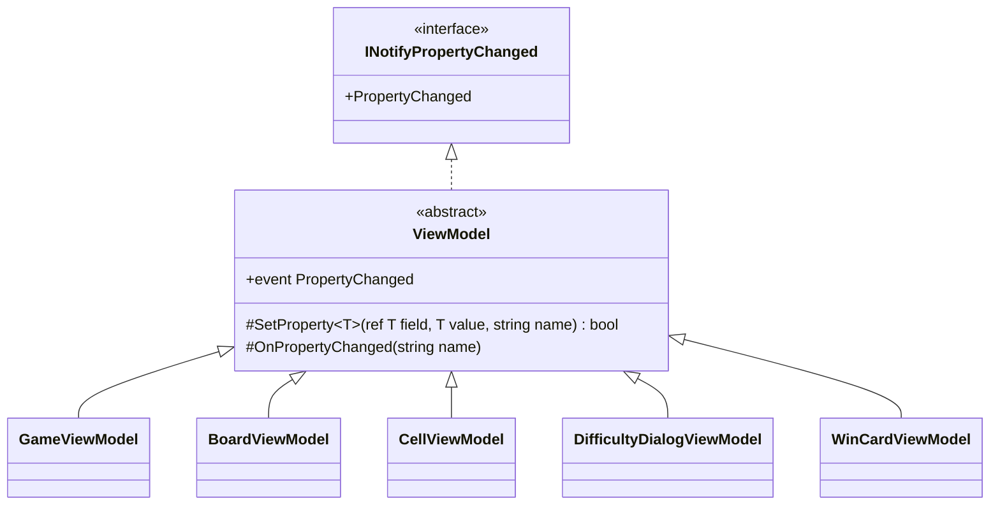

# T2: ビューモデルの変化の通知の設計

作業の種類はスキルの「設計の相談」である。必ず読む object-design.md に加えて、基底クラスを新設するかどうかを決めるので、simplicity.md も読んだ。

## 1. What（何を決めるか）

5 つのビューモデルが `INotifyPropertyChanged` を実装するときに、次の 3 つをどこに、どう書くかを決める。

1. `PropertyChanged` イベントの宣言と発火
2. 「値を比べて、変わったときだけ代入して通知する」手順
3. ほかのプロパティから計算されるプロパティ（派生プロパティ）の通知

作るのは、通知の書き方だけである。コマンド（`ICommand`）、ダイアログの開き方、タイマーは課題の外なので、ここでは決めない。

## 2. 結論

- 通知だけを受け持つ抽象クラス `ViewModel` を 1 つ作り、5 つのビューモデルはそれを継承する。階層は 1 段だけにする。
- `ViewModel` のメンバーは、`PropertyChanged` イベント、`SetProperty`、`OnPropertyChanged` の 3 つだけである。virtual のメンバーは持たない。
- 値を保持するプロパティは、C# 14 の `field` キーワードを使って `set => SetProperty(ref field, value);` と書く。
- 派生プロパティは、元のプロパティの `SetProperty` が `true` を返したときに `OnPropertyChanged(nameof(...))` で通知する。
- プロパティ名は `[CallerMemberName]` と `nameof` で渡し、文字列リテラルは書かない。
- 5 つの派生クラスは `sealed` にする。

### 型の構成



`ViewModel` は `System.ComponentModel` と `System.Runtime.CompilerServices` だけに依存し、Avalonia には依存しない。

## 3. コード

### 3.1 基底クラス

```csharp
using System.ComponentModel;
using System.Runtime.CompilerServices;

namespace Shos.Minesweeper.Desktop.ViewModels;

/// <summary>プロパティの変化を View に知らせるビューモデル。</summary>
public abstract class ViewModel : INotifyPropertyChanged
{
    public event PropertyChangedEventHandler? PropertyChanged;

    /// <summary>値が変わったときだけ代入して通知する。変わったかどうかを返す。</summary>
    protected bool SetProperty<T>(ref T field, T value, [CallerMemberName] string propertyName = "")
    {
        if (EqualityComparer<T>.Default.Equals(field, value))
            return false;

        field = value;
        OnPropertyChanged(propertyName);
        return true;
    }

    protected void OnPropertyChanged(string propertyName)
        => PropertyChanged?.Invoke(this, new PropertyChangedEventArgs(propertyName));
}
```

### 3.2 ビューモデルの例（GameViewModel の経過時間）

値を保持するプロパティ（`ElapsedSeconds`）と、そこから計算する派生プロパティ（`ElapsedText`）の 2 つを示す。ほかのメンバーは省く。

```csharp
namespace Shos.Minesweeper.Desktop.ViewModels;

public sealed class GameViewModel : ViewModel
{
    public int ElapsedSeconds
    {
        get;
        private set
        {
            if (SetProperty(ref field, value))
                OnPropertyChanged(nameof(ElapsedText));
        }
    }

    public string ElapsedText => ElapsedSeconds.ToString("000");

    // タイマーの 1 秒ごとの処理から呼ぶ（タイマーの作り方は課題の外）
    public void Tick() => ElapsedSeconds++;
}
```

派生プロパティがなければ、setter は 1 行で済む。

```csharp
public int RemainingMines { get; private set => SetProperty(ref field, value); }
```

### 3.3 通知を確かめるテスト（xUnit。Avalonia を起動しない）

```csharp
[Fact]
public void TickNotifiesElapsedSecondsAndElapsedText()
{
    var viewModel = new GameViewModel();
    var changedNames = new List<string?>();
    viewModel.PropertyChanged += (_, e) => changedNames.Add(e.PropertyName);

    viewModel.Tick();

    Assert.Equal([nameof(GameViewModel.ElapsedSeconds), nameof(GameViewModel.ElapsedText)], changedNames);
}
```

## 4. Why（そう決めた理由）

### 4.1 通知の手順を 1 か所にまとめる（Once And Only Once）

「比べて、代入して、通知する」という手順は、5 つのクラスで意図が同じである。たまたま形が似ているだけのコードではない。だから 1 か所に置く（判断ルール 6）。各クラスに書き写すと、同じ手順が 5 つのコピーになり、どれか 1 つだけを直し忘れるおそれがある（「比べずに毎回通知する」コピーが混ざる、など）。

### 4.2 合成ではなく継承を選んだ理由（判断ルール 9 との関係）

スキルは、共通処理を再利用するためだけの継承を避け、合成を先に考えるように求めている。そこで、合成の案を次のとおり検討した。

| 案 | 各プロパティの書き方 | 各クラスに残るもの | 評価 |
|---|---|---|---|
| A. 各クラスに書き写す | `set => SetProperty(ref field, value);` | イベントと 2 つのメソッド（約 10 行 × 5） | 重複になる。4.1 の理由で採らない |
| B. 静的なヘルパーを合成する | `set => Notifier.Set(ref field, value, this, PropertyChanged);` | イベントの宣言 | 引数が 4 つになり、すべての setter が読みにくくなる（ノイズ）。引数 3 つの目安も超える |
| C. 通知役のオブジェクトを持たせる | B と同じくらいの長さ | イベントの `add`/`remove` の転送 | 転送の定型コードが 5 つのクラスに残る |
| D. 抽象基底クラス `ViewModel`（採用） | `set => SetProperty(ref field, value);` | なし | 一番短く、意図だけが読める |

合成の形にしにくいのは、C# ではイベントを発火できるのが宣言したクラスだけだからである（B も C も、この言語の制約を回避するためのコードが増える）。判断ルール 11 に従い、言語の自然な手段である基底クラスを使う。

そのうえで、スキルが挙げる継承の害（責務が基底と派生に分かれて全体像が見えなくなる、深い階層、壊れやすい基底クラス）を、次の制約で防ぐ。

- 基底の責務は「変化を知らせる」の 1 つだけにする。コマンドやサービスへの参照など、ほかの共通処理は `ViewModel` に置かない。
- virtual・abstract のメンバーを持たない。派生クラスは何も上書きしないので、基底を変えても派生の振る舞いが思いがけず変わることがない。
- 階層は 1 段だけで、派生クラスは `sealed` にする。

5 つのビューモデルは、どれも「View に変化を知らせるモデル」であり、`INotifyPropertyChanged` という契約を満たす。したがって、単に処理を借りるだけでなく、is-a の関係も成り立っている。

### 4.3 名前を `ViewModel` にした理由

基底の仕事をひとことで言うと「View に変化を知らせるモデル」であり、これはビューモデルという概念そのものである。`GameViewModel : ViewModel` と書けば、is-a の関係がそのまま読める。

次の名前は採らなかった。

- `ViewModelBase`: 「基底である」という実装の立場を名前に漏らしている。
- `ObservableObject`: .NET では `IObservable<T>`（Rx）と紛らわしい。ReactiveUI を使わないと決めたこの題材では、特に誤解のもとになる。

### 4.4 派生プロパティは、元の setter から通知する

`ElapsedText` のような派生プロパティは値を保持しない。そのため、変わったことを知っているのは元のプロパティの setter である。変わったときだけ `SetProperty` が `true` を返すので、その場で派生プロパティも通知する（情報を持つ者に判断を任せる、Expert）。依存関係を属性や表で宣言する仕組みは、今は派生プロパティが少ないので作らない（YAGNI）。

### 4.5 `field` キーワード、`[CallerMemberName]`、`nameof`

- `field`（C# 14。.NET 10 の既定の言語バージョンで使える）を使えば、裏付けのフィールドを別に宣言しなくてよい。プロパティごとのノイズが 1 行減り、フィールドとプロパティの名前がずれることもない。
- 文字列リテラルでプロパティ名を渡すと、名前を変えたときに通知が黙って壊れる。`[CallerMemberName]` と `nameof` なら、名前の変更にコンパイラーが追従する。

### 4.6 Testable

`ViewModel` は Avalonia に依存しないので、ビューモデルを xUnit だけで生成して、`PropertyChanged` の名前を記録すれば通知を確かめられる（3.3）。画面を起動しなくてよい。

## 5. 作らなかったもの（引き算）と置いた仮定

- **作らなかったもの**
  - 通知を UI スレッドへ回す仕組み。Avalonia の `DispatcherTimer` とボタンの操作は UI スレッドで動くので、今は要らない。
  - 複数の名前をまとめて通知する `OnPropertyChanged(params string[])` と、全プロパティを通知する（名前を空にする）仕組み。まとめて通知したい場面が 2 か所目に現れたら足す。
  - `PropertyChangedEventArgs` のキャッシュ。上級の盤面は 480 マスあるが、計測する前に最適化はしない（判断ルール 5）。
  - `PropertyChanging`（変わる前の通知）と、比較のための `IEqualityComparer<T>` の引数。使う人がいないので作らない。
  - `ICommand` の実装。課題の外なので決めていない。
- **仮定**
  - C# 14 が使える（`net10.0` 系の既定）。言語バージョンを下げる必要があれば、`field` の代わりに `private int elapsedSeconds;` を置いて `SetProperty(ref elapsedSeconds, value)` と書く。基底クラスはそのまま使える。
  - プロパティは、View からは読むだけで、ビューモデル自身のメソッドが更新する。そのため setter は `private` にした。View が書き込む `DifficultyDialogViewModel` の入力欄などは、setter を `public` にする。書き方は同じである。
  - 例の `Tick` と `"000"` の書式は説明のためのものであり、経過時間の表示の仕様は課題の外である。

## 6. ユーザーの判断が要る点

- 判断ルール 9 に照らして、再利用を主な動機とする基底クラスを入れることになる（4.2）。1 段、virtual なし、責務は通知だけ、という制約を付けてもよいかを決めてほしい。合成（案 B）を選ぶなら、setter が長くなり、各クラスにイベントの宣言が残ることを受け入れることになる。
- 基底クラスの名前（`ViewModel`、`ViewModelBase`、`ObservableObject`、`NotifyingObject` など）。
