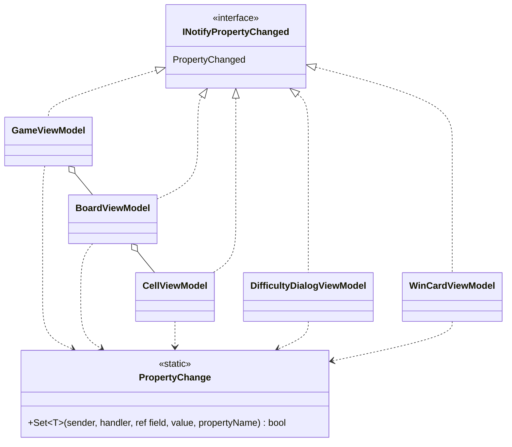

# 課題 T2: ビューモデルの変化の通知の設計

作業の種類は「設計の相談」とした。スキルの表に従って `object-design.md` を読み、基底クラスという選択肢を検討するので `simplicity.md` も読んだ。

## 0. 何を決めるか（What）

5 つのビューモデルが `INotifyPropertyChanged` を実装する。このとき、次の 3 つを決める。

- 「値が変わったときだけ `PropertyChanged` を出す」という手順をどこに置くか
- ほかのプロパティから計算されるプロパティ（依存するプロパティ）を、どう知らせるか
- 盤面のマスの並び（コレクション）の変化を、どう知らせるか

作らないもの: コマンド（`ICommand`）、検証（`INotifyDataErrorInfo`）、`PropertyChanging` はこの課題の範囲外とした。

## 1. 置いた仮定

- A1: ビューモデルの変更はすべて UI スレッドで起きる。経過時間は Avalonia の `DispatcherTimer` で進め、スレッドをまたぐ通知はない。そのため、Dispatcher に切り替える処理は入れない。
- A2: 5 つのビューモデルのほかに、変化を通知するクラスが増える計画はない。
- A3: 盤面のマスの数は 1 回のゲームの間は変わらない。マスの数が変わるのは、新しいゲームで難易度を変えたときだけである。
- A4: ゲームの状態を持つのはモデル（ゲームのロジック）である。ビューモデルは、操作のたびにモデルから値を受け取って自分のプロパティを更新する。
- A5: 実装はテストファーストで進め、ビューモデルは xUnit で Avalonia を起動せずに確かめる。

## 2. 型の構成



| 型 | ひとことで言うと | 置き方 |
|---|---|---|
| `PropertyChange`（static クラス） | 値が変わったときだけ、フィールドを書き換えて変化を知らせる | 通知の手順を 1 か所にまとめる（Once And Only Once）。`internal`。状態は持たない |
| 5 つのビューモデル（`sealed class`） | それぞれの画面の部分の表示状態 | `INotifyPropertyChanged` を**直接**実装する。基底クラスは作らない。`PropertyChanged` のイベントは各クラスで宣言し、プロパティの setter から `PropertyChange.Set` を呼ぶ |

各ビューモデルの決まった形（ルールの統一。5 つとも同じ形にする）:

1. `public event PropertyChangedEventHandler? PropertyChanged;`（インターフェイスが要求する宣言）
2. `PropertyChange.Set` を呼ぶ、1 行の private メソッド `Set`（呼び出し側の引数を 3 つに抑えるため）
3. 依存するプロパティは、元のプロパティの `Set` が `true` を返したときに、`nameof` で名前を指定して知らせる。
4. プロパティの名前は `[CallerMemberName]` か `nameof` で渡し、文字列リテラルでは書かない。

盤面のマスの並び（`BoardViewModel.Cells`）は `IReadOnlyList<CellViewModel>` にする。`ObservableCollection` は使わない。

- 1 回のゲームの中では、並びは変わらない（A3）。変わるのは各マスの見た目なので、変化は各 `CellViewModel` が自分のプロパティで知らせる。
- 難易度を変えたときは、並びを新しいリストに置き換えて `Cells`（と `Columns`、`Rows`）を知らせる。
- 盤面全体の Reset の通知はしない。開いたマスだけが通知を出すので、大きな盤面でも描き直しは変わったマスだけで済む。

## 3. コードの例

### 3.1 通知の手順（1 か所）

```csharp
using System.ComponentModel;
using System.Runtime.CompilerServices;

namespace Shos.Minesweeper.Desktop.ViewModels;

/// <summary>INotifyPropertyChanged の通知の手順（値が変わったときだけ知らせる）。</summary>
static class PropertyChange
{
    /// <returns>値が変わって通知したら true。</returns>
    public static bool Set<T>(object sender, PropertyChangedEventHandler? handler,
                              ref T field, T value, [CallerMemberName] string propertyName = "")
    {
        if (EqualityComparer<T>.Default.Equals(field, value))
            return false;

        field = value;
        handler?.Invoke(sender, new PropertyChangedEventArgs(propertyName));
        return true;
    }
}
```

`Set` の引数は 5 つで、目安の 3 つを超えている。通知を出すのはイベントを持つビューモデルの側なので、送り手とイベントを受け取る必要がある。この関数を直接呼ぶのは各ビューモデルの 1 行の `Set` だけで、プロパティの側から見える引数は 3 つ以下に収まる。

### 3.2 ビューモデルの例: `CellViewModel`（プロパティ 2 つ）

`Appearance` は、マスの見た目（未開放・数字・旗・地雷など）である。`AccessibleName` は読み上げの名前で、`Appearance` から計算される依存するプロパティである。

```csharp
using System.ComponentModel;
using System.Runtime.CompilerServices;

namespace Shos.Minesweeper.Desktop.ViewModels;

sealed class CellViewModel(int row, int column) : INotifyPropertyChanged
{
    CellAppearance appearance = CellAppearance.Closed;

    public event PropertyChangedEventHandler? PropertyChanged;

    public int Row { get; } = row;
    public int Column { get; } = column;

    public CellAppearance Appearance
    {
        get => appearance;
        private set
        {
            if (Set(ref appearance, value))
                PropertyChanged?.Invoke(this, new PropertyChangedEventArgs(nameof(AccessibleName)));
        }
    }

    // 読み上げの名前は見た目から決まるので、フィールドを持たずに計算する
    public string AccessibleName => CellNames.Of(Row, Column, Appearance);

    /// <summary>操作の後に、モデルのマスの状態を映す。</summary>
    public void Update(CellAppearance newAppearance) => Appearance = newAppearance;

    bool Set<T>(ref T field, T value, [CallerMemberName] string propertyName = "")
        => PropertyChange.Set(this, PropertyChanged, ref field, value, propertyName);
}
```

（`CellAppearance` と `CellNames.Of` は例のために置いた名前である。実際には、表示の文言を持つ既存の部品に合わせる。）

### 3.3 テストの形（Testable）

```csharp
[Fact]
public void UpdatingAppearanceNotifiesItAndTheAccessibleName()
{
    var cell = new CellViewModel(0, 0);
    var changed = new List<string?>();
    cell.PropertyChanged += (_, e) => changed.Add(e.PropertyName);

    cell.Update(CellAppearance.Flagged);

    Assert.Equal([nameof(CellViewModel.Appearance), nameof(CellViewModel.AccessibleName)], changed);
}

[Fact]
public void UpdatingWithTheSameAppearanceNotifiesNothing() { /* 同じ値では通知が出ないこと */ }
```

`PropertyChange.Set` の「値が同じなら知らせない」も、ここで 1 回確かめる。各ビューモデルのテストで確かめるのは、どのプロパティを知らせるか（依存するプロパティの漏れがないか）だけでよい。

## 4. 理由（Why）と捨てた案

| 案 | 判断 | 理由 |
|---|---|---|
| A. 各ビューモデルに通知の手順を手で書く | 捨てた | 値の比較、代入、通知という同じ意図の数行が 5 か所に重複する（Once And Only Once に反する）。1 か所だけ比較を忘れる、といったずれも起きやすい |
| B. 抽象基底クラス `ViewModelBase : INotifyPropertyChanged` に `SetProperty` を置いて継承する | 捨てた | 継承する動機が「共通処理の再利用」だけである。多態は `INotifyPropertyChanged` というインターフェイスですでに成り立っていて、基底クラスは何の種類も表さない。スキルの判断ルール 9（再利用だけのための継承はしない）に当たる。基底クラスがあると、各ビューモデルの全体像（`Set` や `OnPropertyChanged` がどこから来るか）が基底を見ないと分からない。また、いずれ基底に「便利な」メンバーが足されていく置き場所になる（壊れやすい基底クラス） |
| C. 通知を受け持つオブジェクト（`PropertyChangeNotifier`）を各ビューモデルに持たせ、イベントの add/remove をそこへ転送する | 捨てた | 合成ではあるが、各ビューモデルにフィールド、コンストラクターでの `this` の受け渡し、イベントの add/remove の転送が要る。案 D より読む行が増えて、得るものがない |
| D. 状態を持たない static な手順 `PropertyChange.Set` を、各ビューモデルが呼ぶ（採用） | 採用 | 重複する手順は 1 か所に置いたうえで、各ビューモデルは基底なしで読める（イベントの宣言も `Set` も、そのクラスの中に見える）。各クラスに残るのはイベントの宣言と 1 行の `Set` だけである。イベントの宣言はインターフェイスが要求するもので、意図の重複ではない |
| E. MVVM の支援ライブラリ、ソース ジェネレーター、Fody | 捨てた | 支援ライブラリは使わないと決まっている。自前のソース ジェネレーターは、5 つのクラスのためには読む対象とビルドの仕組みを増やすだけである |

そのほかの決定の理由:

- **値が変わったときだけ知らせる**: 同じ値での通知は描き直しを増やすだけである。また、テストで「知らせた/知らせない」を確かめられる形にしておける。
- **依存するプロパティは、元のプロパティの setter で `nameof` を使って知らせる**: 何が何に依存するかが setter の 1 行に見える。依存関係を登録する仕組み（属性や表）は、5 つのクラスには大きすぎるので作らない（YAGNI）。
- **計算されるプロパティはフィールドを持たない**: 持つと、元の値と食い違う状態が生まれうる。
- **setter は `private`**: 値を変える入口を `Update` などの操作に絞り、View やほかのビューモデルが勝手に書き換えないようにする。ただし、双方向のバインドで入力を受けるプロパティ（`DifficultyDialogViewModel` の行数・列数・地雷数の入力、`WinCardViewModel` の名前の入力を仮定）は `public` の setter にする。

## 5. 作らなかったもの

- `ViewModelBase`、`ObservableObject` のような基底クラス（上の案 B）
- `PropertyChangedEventArgs` のキャッシュ: 計測の根拠がないので、先回りの最適化はしない
- UI スレッドへの切り替え（A1。スレッドをまたぐ通知が出てきたら、そのときに足す）
- `ObservableCollection` による盤面の通知（A3）
- 依存関係を登録する仕組み、`PropertyChanging`

## 6. 判断が要る点

- 仮定の A1（通知はすべて UI スレッド）が崩れる場合は、ここでの設計を見直す必要がある。例: 経過時間を `System.Threading.Timer` で進める場合。
- 案 B（基底クラス）は、Avalonia のテンプレートや多くの解説で一般的な形である。チームがその形に慣れていて、それを流儀として優先する場合は、B も成り立つ。そのときは、基底には `SetProperty` と `OnPropertyChanged` だけを置き、ほかのものを足さないという決まりを添える。ここでは、再利用だけのための継承を避けるというスキルの判断ルールを優先して D を採った。
