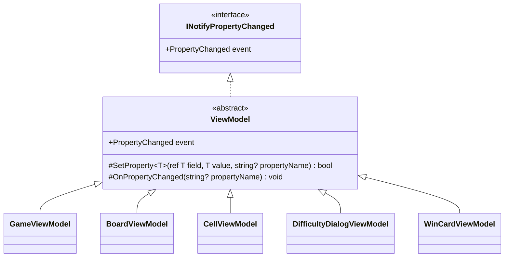

# 課題 T2: ビューモデルの変化の通知の設計

## 0. 何を作り、何を作らないか（What）

- 作るもの: 5 つのビューモデル（`GameViewModel`、`BoardViewModel`、`CellViewModel`、`DifficultyDialogViewModel`、`WinCardViewModel`）が、`INotifyPropertyChanged` でプロパティの変化を View に知らせるための、共通の書き方。
- 作らないもの: コマンド（`ICommand`）、入力の検証（`INotifyDataErrorInfo`）、UI スレッドへの切り替え、コレクションの変化の通知。これらは「プロパティの変化を知らせる」という今回の課題の外である（6 章）。

置いた仮定:

- A1. ビューモデルのプロパティは UI スレッドだけで変わる。経過時間は Avalonia の `DispatcherTimer`（UI スレッドで動く）で進める。
- A2. 盤面のマスの並びは、難易度を変えたときに丸ごと作り直す。途中でマスが足されたり消えたりはしないので、`ObservableCollection` は要らず、並びそのものを 1 つのプロパティとして差し替えて通知すればよい。
- A3. MVVM の支援ライブラリは使わない（課題の前提）。C# の標準の仕組み（`CallerMemberName`、`EqualityComparer<T>.Default`）は使ってよい。

## 1. 型の構成



- `ViewModel`（抽象クラス、1 つだけ）: `INotifyPropertyChanged` の実装を 1 か所に持つ。仕事をひとことで言うと「プロパティの変化を View に知らせる」。持つのは次の 2 つだけにする。
  - `SetProperty<T>`: 値が変わったときだけフィールドを書き換えて通知し、変わったかどうかを返す。
  - `OnPropertyChanged`: 他のプロパティから導かれるプロパティ（例: 残り地雷数から作る表示の文字列）を、明示的に通知するために使う。
- 5 つのビューモデル（すべて `sealed`）: `ViewModel` を直接継承する。継承は 1 段だけにし、ビューモデルの間の継承は作らない。
- 各プロパティの書き方の規則:
  1. setter は `SetProperty(ref field, value)` の 1 行にする（プロパティ名は `CallerMemberName` で入るので書かない）。
  2. View から書き換えないプロパティは `private set` にし、変える操作はメソッドとして公開する（例: `Tick()`、`Update(...)`）。View は「状態を読む」、ビューモデルは「状態を変える」と、書き換える者を 1 つにするため。
  3. 他のプロパティから導かれるプロパティは、get だけの計算プロパティにし、元のプロパティの `SetProperty` が `true` を返したときに `OnPropertyChanged(nameof(導かれるプロパティ))` を呼ぶ。導かれる値をフィールドに重ねて持たない。
  4. 通知の名前は文字列で書かず、`CallerMemberName` か `nameof` で書く。

## 2. 基底クラスのコード

```csharp
using System.Collections.Generic;
using System.ComponentModel;
using System.Runtime.CompilerServices;

namespace Shos.Minesweeper.Desktop.ViewModels;

/// <summary>プロパティの変化を View に知らせる、ビューモデルの共通の実装。</summary>
public abstract class ViewModel : INotifyPropertyChanged
{
    public event PropertyChangedEventHandler? PropertyChanged;

    /// <summary>値が変わったときだけ書き換えて通知する。変わったら true を返す。</summary>
    protected bool SetProperty<T>(ref T field, T value, [CallerMemberName] string? propertyName = null)
    {
        if (EqualityComparer<T>.Default.Equals(field, value))
            return false;
        field = value;
        OnPropertyChanged(propertyName);
        return true;
    }

    protected void OnPropertyChanged([CallerMemberName] string? propertyName = null)
        => PropertyChanged?.Invoke(this, new PropertyChangedEventArgs(propertyName));
}
```

- 値が同じなら通知しない（ガード節）。経過時間を毎秒設定しても、変わらないプロパティで View を描き直させないためと、通知の連鎖でループしないため。
- `OnPropertyChanged` は `virtual` にしない。派生クラスが通知の仕組みを差し替える要求はないので、拡張ポイントを作らない（YAGNI）。

## 3. 1 つのビューモデルの例（GameViewModel の 2 つのプロパティ）

経過時間（秒）と、それから導かれる表示の文字列を例にする。

```csharp
namespace Shos.Minesweeper.Desktop.ViewModels;

public sealed class GameViewModel : ViewModel
{
    const int MaximumElapsedSeconds = 999;

    int elapsedSeconds;

    /// <summary>経過時間（秒）。1 秒ごとに Tick で進む。</summary>
    public int ElapsedSeconds
    {
        get => elapsedSeconds;
        private set
        {
            if (SetProperty(ref elapsedSeconds, value))
                OnPropertyChanged(nameof(ElapsedTimeText));
        }
    }

    /// <summary>画面に出す経過時間（3 桁）。ElapsedSeconds から導く。</summary>
    public string ElapsedTimeText => ElapsedSeconds.ToString("000");

    /// <summary>1 秒進める。上限に達したら止まる。</summary>
    public void Tick() => ElapsedSeconds = Math.Min(ElapsedSeconds + 1, MaximumElapsedSeconds);

    // 残り地雷数、盤面（BoardViewModel）、勝利カード（WinCardViewModel?）なども同じ書き方で持つ
}
```

- `ElapsedTimeText` は計算プロパティなので、値を二重に持たない。通知だけを `ElapsedSeconds` の setter から出す。
- 上限（999）の値は仮定である。表示の桁数や上限は仕様に合わせる。

通知が正しく出ることは、Avalonia を起動せずに確かめられる（xUnit の例）。

```csharp
[Fact]
public void TickNotifiesElapsedSecondsAndItsText()
{
    var game = new GameViewModel();
    var changed = new List<string?>();
    game.PropertyChanged += (_, e) => changed.Add(e.PropertyName);

    game.Tick();

    Assert.Equal([nameof(GameViewModel.ElapsedSeconds), nameof(GameViewModel.ElapsedTimeText)], changed);
}
```

## 4. そう決めた理由（Why）

### 4.1 通知の実装を 1 か所に集める（Once And Only Once）

5 つのビューモデルはどれも「値を比べ、変わったら書き換えて、名前を付けてイベントを出す」という同じ意図の処理を要る。これは「たまたま似ている」のではなく、`INotifyPropertyChanged` の契約を果たすという同じ意図なので、1 か所に集める（判断ルール 6）。利用者はすでに 5 つあり、抽象化の根拠は具体的である（判断ルール 1）。setter が 1 行になり、各ビューモデルを読むときにノイズ（比較・イベントの発火）ではなく、どの値がどの値に連動するかという意図だけが見える。

### 4.2 集める方法に、基底クラス（継承）を選んだ

スキルの判断ルール 9 は「共通処理の再利用だけが目的の継承はしない」と言うので、次の 3 案を比べた。

| 案 | 形 | 評価 |
|---|---|---|
| A. 各クラスに直に書く | 5 クラスそれぞれに `PropertyChanged` と `SetProperty` を書く | 同じ意図が 5 か所に重複する（Once And Only Once に反する）。直すときに 5 か所を直すことになる |
| B. 合成（通知の部品を持たせる） | `PropertyChangeNotifier` を各ビューモデルが持ち、`event` の `add`/`remove` と `SetProperty` を部品へ転送する | C# のイベントは送り手（`sender`）がビューモデル自身である必要があり、転送の記述（4〜6 行）が各クラスに残る。重複を減らすための部品なのに、重複する転送が残る |
| C. 抽象基底クラス `ViewModel`（採用） | 通知だけを持つ 1 段の基底クラスを継承する | 各クラスの記述は `: ViewModel` だけ。C# の MVVM で広く使われる形なので、読む人が迷わない |

C を選んだ理由は、ルール 9 が避けようとしている継承の害（責務が基底と派生に散る、階層が深くなって基底の変更が派生を壊す）が、この形では起きないように縛れるからである。

- 基底クラスは「プロパティの変化を知らせる」ことだけを持ち、ゲームの知識やコマンドなどを足さない。派生クラスの全体像は、基底を見なくても `SetProperty` の意味さえ分かれば読める。
- 継承は 1 段だけにし、5 つのビューモデルは `sealed` にする。ビューモデルの間で継承を作らない。
- `virtual` を置かないので、基底の振る舞いを派生が上書きして契約を崩すことがない。

また、5 つはどれも「View に変化を知らせるビューモデルの一種」であり、`INotifyPropertyChanged` という契約を同じように守る（is-a と契約の遵守）。案 B の合成は、この言語ではかえって各クラスに転送の重複を残すので、スキルの判断ルール 11（言語にない仕組みを無理に持ち込まない）に照らしても C が素直である。

### 4.3 書き換える者を 1 つにする（private set と操作のメソッド）

View から書き換えないプロパティを `private set` にし、状態を変えるのは `Tick()` などのメソッドだけにする。こうすると「この値を誰が変えるのか」に 1 つの答え（そのビューモデル自身）しかなく、通知の漏れもそのメソッドのテストで確かめられる。難易度ダイアログの入力欄のように、View から書き換えるプロパティだけを `public set` にする。

### 4.4 導かれるプロパティは計算で持ち、通知だけを足す

`ElapsedTimeText` のような表示用の値を別のフィールドに持つと、元の値と食い違いうる。計算プロパティにすれば値は常に正しく、足すのは通知の 1 行だけで済む。どの値がどの値に連動するかが、元のプロパティの setter に書かれるので、読めば分かる。

### 4.5 テストできる形

ビューモデルは Avalonia の型に依存しないので、`PropertyChanged` を購読するだけで通知の有無と順序を xUnit で確かめられる（3 章の例）。

## 5. 名前の決め方

- `ViewModel`: 5 つがどれも「ビューモデル」であることを、そのまま表す。`ViewModelBase` の `Base` や、`ObservableObject` のような実装寄りの名前は使わない。役割（View に変化を知らせるモデル）で呼ぶ。
- `SetProperty` / `OnPropertyChanged`: .NET の MVVM で広く使われている名前に合わせる。読む人がすでに知っている意味で使えるため。

## 6. 作らなかったもの（引き算）

| 作らなかったもの | 理由 |
|---|---|
| UI スレッドへの切り替え（`Dispatcher.UIThread.Post` など） | 仮定 A1 により、プロパティは UI スレッドでしか変わらない。バックグラウンドで変える処理が来たときに、その処理の側で切り替える |
| `SetProperty` の変化時のコールバック（`Action onChanged` 引数）や、依存関係を属性で宣言する仕組み | 連動は `if (SetProperty(...)) OnPropertyChanged(...)` で足り、1 か所で読める。仕組みを足すと読む対象が増える |
| `PropertyChanging`（変化の前の通知） | View が使わない |
| `ObservableCollection` による盤面の通知 | 仮定 A2 により、マスの並びは丸ごと差し替えるので、`BoardViewModel` のプロパティ 1 つの通知で足りる |
| コマンドの実装（`RelayCommand` など）、`INotifyDataErrorInfo` | 変化の通知という今回の課題の外。要るときに別の型として作り、`ViewModel` には入れない |
| `ViewModel` の `virtual` メソッドやインターフェイスの追加 | 差し替える要求がない（YAGNI） |

## 7. ユーザーの判断が要る点

- 仮定 A1（UI スレッドだけで変わる）が崩れる処理（例: 効果音の再生の完了をバックグラウンドから知らせる）があるか。あれば、その処理の側で UI スレッドに戻す方針でよいか。
- 仮定 A2（盤面は丸ごと作り直す）でよいか。マスを部分的に足し引きする仕様があれば `ObservableCollection` を使う。
- 継承を使うこと（4.2）。スキルの判断ルール 9 の例外として、基底を「通知だけ・1 段・派生は sealed・virtual なし」に縛る条件で採用した。この条件をチームの規約として書いておくことを勧める。
